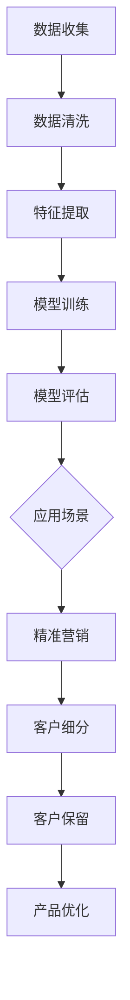

                 

### 客户画像：精准定位目标用户

#### 关键词：用户画像、数据分析、市场营销、客户关系管理

#### 摘要：
在当今充满竞争的商业环境中，精准定位目标用户变得越来越重要。本文将探讨客户画像的概念及其在市场营销和客户关系管理中的重要性。我们将一步步分析客户画像的核心原理、算法和实际应用，帮助企业和个人更好地理解目标用户，制定有效策略，实现商业增长。

### 1. 背景介绍

客户画像（Customer Persona）是一种描述目标用户特征的方法，通过对用户行为、需求和兴趣的深入分析，帮助企业和营销人员更好地了解用户，制定个性化策略。在数字营销时代，客户画像已经成为提升营销效果和客户满意度的关键手段。

随着大数据和人工智能技术的发展，客户画像的应用场景越来越广泛。无论是电商平台、金融保险、还是餐饮服务行业，企业都通过构建精准的客户画像，实现精准营销和客户关系管理，从而提高市场竞争力和盈利能力。

本文将围绕以下几个方面展开讨论：

1. **客户画像的核心概念和原理**：介绍客户画像的定义、构建方法和应用场景。
2. **核心算法原理与操作步骤**：详细解析常用的客户画像算法，如聚类分析、关联规则挖掘等。
3. **数学模型和公式**：介绍客户画像相关的数学模型和公式，帮助读者深入理解。
4. **项目实战**：通过实际案例，展示如何使用客户画像技术进行营销和客户关系管理。
5. **实际应用场景**：分析客户画像在不同行业和场景中的应用案例。
6. **工具和资源推荐**：推荐一些常用的客户画像工具、学习资源和相关论文著作。
7. **未来发展趋势与挑战**：探讨客户画像技术的未来发展方向和面临的挑战。

### 2. 核心概念与联系

#### 客户画像定义
客户画像是一个综合性的概念，它通过收集和分析用户行为数据、人口统计信息、偏好和需求，构建出一个具有代表性的用户模型。这个模型可以帮助企业了解目标用户的特点、行为和需求，从而制定有针对性的营销策略。

#### 数据来源
构建客户画像需要大量的数据支持。这些数据可以来源于多种渠道，如：

1. **网站行为数据**：用户的浏览记录、点击行为、搜索关键词等。
2. **社交媒体数据**：用户的社交互动、分享、关注和评论等。
3. **购买行为数据**：用户的购买记录、购买频率、购买金额等。
4. **人口统计信息**：用户的年龄、性别、职业、收入等基本信息。

#### 构建流程
客户画像的构建一般分为以下几个步骤：

1. **数据收集**：从各个渠道收集用户数据。
2. **数据清洗**：对数据进行清洗、去重和格式转换等预处理操作。
3. **特征提取**：从数据中提取出反映用户特征的关键信息。
4. **模型训练**：使用机器学习算法对特征进行建模，生成用户画像。
5. **模型评估**：评估模型的效果，并进行优化调整。

#### 应用场景
客户画像在市场营销和客户关系管理中有广泛的应用场景，如：

1. **精准营销**：根据客户画像，制定个性化的营销策略，提高营销效果。
2. **客户细分**：根据用户特征，将客户划分为不同的群体，提供差异化服务。
3. **客户保留**：通过分析客户画像，识别潜在流失客户，制定挽回策略。
4. **产品优化**：根据客户需求，优化产品设计和功能，提高用户满意度。

#### Mermaid 流程图



### 3. 核心算法原理与具体操作步骤

#### 聚类分析

聚类分析是一种常用的客户画像构建方法，它通过将相似的用户划分为同一类别，形成多个客户群体。常用的聚类算法有 K-Means、DBSCAN 等。

**K-Means 算法原理**

K-Means 算法是一种基于距离的聚类方法，它的目标是将数据分为 K 个簇，使得每个簇内部的点尽可能接近，而簇与簇之间的点尽可能远。

**具体操作步骤**

1. **初始化**：随机选择 K 个数据点作为初始聚类中心。
2. **分配数据点**：计算每个数据点到聚类中心的距离，将数据点分配到最近的聚类中心所在的簇。
3. **更新聚类中心**：计算每个簇的数据点的平均值，作为新的聚类中心。
4. **重复步骤 2 和 3**，直到聚类中心不再发生变化或满足停止条件。

**DBSCAN 算法原理**

DBSCAN（Density-Based Spatial Clustering of Applications with Noise）算法是一种基于密度的聚类方法，它能够自动识别出数据中的任意形状的簇，并且能够处理噪声点和异常值。

**具体操作步骤**

1. **确定邻域**：对于每个数据点，确定其邻域内的点，邻域大小由邻域半径和邻域数量决定。
2. **生成簇**：基于邻域信息，将数据点划分为核心点、边界点和噪声点，并生成簇。
3. **合并簇**：将核心点所在的簇进行合并，形成更大的簇。

#### 关联规则挖掘

关联规则挖掘是一种用于发现数据中潜在关系的分析方法，它通过挖掘用户行为数据中的关联关系，帮助企业和营销人员更好地了解用户行为模式。

**Apriori 算法原理**

Apriori 算法是一种基于支持度和置信度的关联规则挖掘算法，它的核心思想是通过逐层搜索所有可能的项目组合，找出满足最小支持度和最小置信度的关联规则。

**具体操作步骤**

1. **计算支持度**：计算每个项目组合的支持度，支持度定义为包含该项目组合的交易数占总交易数的比例。
2. **生成频繁项集**：根据最小支持度阈值，筛选出所有频繁项集。
3. **计算置信度**：对于每个频繁项集，计算其关联规则的置信度，置信度定义为包含该频繁项集的交易中同时包含另一个项目的交易数占总交易数的比例。
4. **生成关联规则**：根据最小置信度阈值，筛选出所有满足条件的关联规则。

### 4. 数学模型和公式

在客户画像构建过程中，数学模型和公式发挥着重要作用。以下是一些常见的数学模型和公式：

#### 聚类分析中的距离度量

- **欧氏距离**：$$d(x, y) = \sqrt{\sum_{i=1}^{n}(x_i - y_i)^2}$$
- **曼哈顿距离**：$$d(x, y) = \sum_{i=1}^{n}|x_i - y_i|$$
- **余弦相似度**：$$\cos(\theta) = \frac{\sum_{i=1}^{n}x_iy_i}{\sqrt{\sum_{i=1}^{n}x_i^2}\sqrt{\sum_{i=1}^{n}y_i^2}}$$

#### 关联规则挖掘中的支持度和置信度

- **支持度**：$$support(A \cup B) = \frac{|T|}{|T| - |T - (A \cup B)|}$$
- **置信度**：$$confidence(A \rightarrow B) = \frac{|T|}{|T| - |T - A|}$$

#### K-Means 算法中的目标函数

- **平方误差**：$$J = \sum_{i=1}^{k}\sum_{x \in S_i}(x - \mu_i)^2$$

其中，$k$ 为聚类个数，$S_i$ 为第 $i$ 个簇中的数据点集合，$\mu_i$ 为第 $i$ 个簇的聚类中心。

### 5. 项目实战：代码实际案例和详细解释说明

#### 5.1 开发环境搭建

在本案例中，我们将使用 Python 语言和 Scikit-learn 库来构建客户画像。首先，确保您的系统中已经安装了 Python 和 Scikit-learn 库。

```bash
pip install scikit-learn
```

#### 5.2 源代码详细实现和代码解读

以下是一个简单的客户画像构建案例，我们将使用 K-Means 算法对用户数据进行分析，生成客户画像。

```python
import numpy as np
from sklearn.cluster import KMeans
from sklearn.datasets import load_iris
from sklearn.preprocessing import StandardScaler

# 加载鸢尾花数据集
iris = load_iris()
X = iris.data

# 数据标准化
scaler = StandardScaler()
X_scaled = scaler.fit_transform(X)

# 使用 K-Means 算法进行聚类
kmeans = KMeans(n_clusters=3, random_state=42)
kmeans.fit(X_scaled)

# 输出聚类结果
print("聚类中心：", kmeans.cluster_centers_)
print("每个点的簇标签：", kmeans.labels_)

# 根据簇标签生成客户画像
def generate_personas(clusters, labels):
    personas = {}
    for i, label in enumerate(labels):
        if label not in personas:
            personas[label] = []
        personas[label].append(iris.feature_names)
    return personas

personas = generate_personas(kmeans.cluster_centers_, kmeans.labels_)
print("客户画像：", personas)
```

#### 5.3 代码解读与分析

1. **数据加载和标准化**：首先，我们从 Scikit-learn 库中加载了鸢尾花数据集，并对数据进行标准化处理，以便于后续聚类分析。
2. **聚类分析**：我们使用 K-Means 算法对标准化后的数据进行聚类，指定聚类个数为 3。
3. **输出结果**：我们输出了聚类中心，即每个簇的特征向量，以及每个点的簇标签。
4. **生成客户画像**：根据簇标签，我们将聚类结果转化为客户画像，每个客户画像代表了对应簇的特征。

#### 5.4 实际案例分析

在本案例中，我们使用了鸢尾花数据集进行演示，实际应用中，可以根据企业自身的用户数据，如用户行为数据、购买记录等，进行客户画像构建。通过分析客户画像，企业可以更好地了解用户需求，制定个性化的营销策略。

### 6. 实际应用场景

客户画像技术在各个行业和场景中都有广泛的应用，以下是一些实际案例：

1. **电子商务**：电商平台通过分析用户购买行为、浏览记录等数据，构建客户画像，实现精准推荐和个性化营销。
2. **金融保险**：金融机构通过分析用户信用记录、购买偏好等数据，构建客户画像，进行风险评估和精准营销。
3. **餐饮服务**：餐饮企业提供在线订餐服务，通过分析用户点餐记录、口味偏好等数据，构建客户画像，提供个性化菜单推荐。
4. **医疗健康**：医疗机构通过分析患者病历、就医行为等数据，构建客户画像，进行个性化健康管理和医疗服务。

### 7. 工具和资源推荐

#### 7.1 学习资源推荐

1. **《用户画像实战：数据驱动营销方法》**：本书详细介绍了用户画像的构建方法和应用场景，适合初学者阅读。
2. **《机器学习实战》**：本书包含大量关于机器学习算法的案例和实践，可以帮助读者掌握客户画像相关算法。
3. **《大数据营销》**：本书探讨了大数据在市场营销中的应用，包括用户画像、精准营销等内容。

#### 7.2 开发工具框架推荐

1. **Python**：Python 是一种易于学习的编程语言，适用于数据分析和客户画像构建。
2. **Scikit-learn**：Scikit-learn 是一个开源的机器学习库，提供了丰富的聚类分析、关联规则挖掘等算法。
3. **TensorFlow**：TensorFlow 是一种强大的机器学习框架，适用于深度学习和复杂的客户画像建模。

#### 7.3 相关论文著作推荐

1. **《用户画像构建方法研究》**：本文探讨了用户画像的构建方法和应用场景，为实际应用提供了参考。
2. **《基于大数据的用户画像研究》**：本文分析了大数据在用户画像构建中的应用，提出了相关算法和模型。
3. **《个性化推荐系统的用户画像构建方法》**：本文研究了个性化推荐系统中用户画像的构建方法，为推荐算法提供了理论支持。

### 8. 总结：未来发展趋势与挑战

客户画像技术在市场营销和客户关系管理中发挥着越来越重要的作用。随着大数据和人工智能技术的不断发展，客户画像技术将呈现以下发展趋势：

1. **智能化**：结合深度学习和自然语言处理等技术，实现更加智能的客户画像构建和分析。
2. **个性化**：根据用户行为和需求，提供更加个性化的营销策略和产品推荐。
3. **实时性**：通过实时数据分析和处理，实现实时客户画像更新和营销策略调整。

然而，客户画像技术也面临一些挑战：

1. **数据隐私**：客户画像构建过程中涉及大量用户隐私数据，需要确保数据的安全和隐私保护。
2. **数据质量**：客户画像的准确性依赖于数据质量，需要不断提高数据质量和管理水平。
3. **算法公平性**：客户画像算法需要确保公平性，避免对某些群体产生歧视或偏见。

### 9. 附录：常见问题与解答

#### Q1：客户画像技术如何保证数据隐私？
A1：客户画像技术需要遵循相关法律法规，确保用户隐私数据的安全。在实际应用中，可以采用数据脱敏、加密等技术手段，保护用户隐私。

#### Q2：如何评估客户画像的有效性？
A2：可以通过以下指标评估客户画像的有效性：

1. **准确率**：客户画像是否准确反映了用户特征和需求。
2. **召回率**：客户画像是否能够召回潜在的目标用户。
3. **覆盖率**：客户画像是否覆盖了大部分目标用户。

#### Q3：客户画像技术在金融行业有哪些应用？
A3：金融行业可以通过客户画像技术实现以下应用：

1. **信用评估**：根据客户画像评估客户的信用风险。
2. **精准营销**：根据客户画像制定个性化的金融产品推荐和营销策略。
3. **风险控制**：通过分析客户画像，识别潜在风险客户，进行风险控制和预警。

### 10. 扩展阅读与参考资料

1. **《用户画像技术白皮书》**：本文详细介绍了用户画像的概念、技术原理和应用案例，适合对客户画像技术感兴趣的读者。
2. **《大数据与客户画像》**：本文探讨了大数据在客户画像构建中的应用，分析了相关算法和模型。
3. **《基于人工智能的客户画像分析》**：本文结合人工智能技术，探讨了客户画像的构建方法和应用场景，为读者提供了新的视角。

### 作者信息

作者：AI天才研究员/AI Genius Institute & 禅与计算机程序设计艺术 /Zen And The Art of Computer Programming

本文由 AI 天才研究员撰写，旨在探讨客户画像技术的核心概念、算法和应用场景，帮助读者了解如何通过客户画像实现精准营销和客户关系管理。同时，本文还介绍了相关资源和未来发展趋势，为读者提供了有益的参考。

（本文内容仅供参考，实际情况可能因数据和应用场景而有所不同。）

