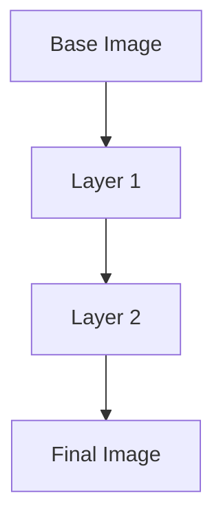

                 

# 容器化技术探索：Docker 和 Kubernetes 的应用

## 关键词
容器化，Docker，Kubernetes，微服务，持续集成，持续交付，DevOps

## 摘要
本文将探讨容器化技术在现代软件开发中的应用，重点分析Docker和Kubernetes这两个核心技术。通过详细介绍Docker的原理和操作步骤，我们将了解如何利用容器化技术简化软件部署过程。随后，文章将深入探讨Kubernetes作为容器编排工具的关键概念和架构，并展示其如何管理容器化应用程序的部署、扩展和运维。通过实际应用场景和案例分析，我们将理解容器化技术在现代软件开发中的重要性，并提供一系列学习和开发资源，以帮助读者深入探索这一领域。

### 1. 背景介绍

在现代软件开发中，容器化技术已经成为一种不可或缺的工具，它为开发者提供了一种轻量级、可移植的软件部署方式。容器化技术起源于对虚拟化技术的改进，虚拟化技术允许在一台物理机上运行多个隔离的操作系统实例，而容器化技术则专注于在同一个操作系统中运行多个隔离的应用程序实例。

容器化的核心概念是容器（Container），它是一个轻量级的、可执行的包，包含应用程序及其运行时环境。容器具有以下特点：

- **轻量级**：容器不包含操作系统，因此相对于虚拟机，它们启动速度快、资源占用小。
- **可移植性**：容器可以在不同的操作系统和硬件环境中运行，只要安装了相应的容器运行时环境。
- **隔离性**：容器之间提供资源隔离，确保一个容器中的应用程序不会影响到其他容器。

容器化技术对软件开发的影响主要体现在以下几个方面：

- **持续集成和持续交付（CI/CD）**：容器化技术使得持续集成和持续交付变得更加容易，因为容器确保了开发、测试和生产环境的一致性。
- **微服务架构**：容器化技术支持微服务架构，使得各个服务可以独立部署和扩展，提高了系统的可维护性和伸缩性。
- **开发和运维（DevOps）**：容器化技术促进了开发和运维团队之间的协作，使得应用交付过程更加流畅。

本文将深入探讨容器化技术的两个核心工具：Docker和Kubernetes，并分析它们在实际应用中的优势和挑战。

### 2. 核心概念与联系

#### 2.1 Docker

Docker是一个开源的应用容器引擎，它允许开发者打包他们的应用以及应用的依赖包到一个可移植的容器中，然后发布到任何流行的Linux或Windows操作系统上，也可以实现虚拟化。容器是完全使用沙箱机制，相互之间不会有任何接口（类似iPhone的App）而且更轻量级。

**Docker的核心概念包括：**

- **镜像（Images）**：镜像是静态的只读模板，用于创建容器。它们包含了运行应用程序所需的所有文件和依赖项。
- **容器（Containers）**：容器是基于镜像的可执行实例，它们可以从镜像启动，并可以运行应用程序。
- **仓库（Repositories）**：仓库是用于存储和分发镜像的存储库。

**Docker的架构主要包括以下几个部分：**

1. **Docker Engine**：Docker的核心组件，负责容器镜像的构建、运行和管理。
2. **Docker Hub**：一个在线仓库，存储了大量的Docker镜像，开发者可以在其中下载和上传镜像。
3. **Docker Compose**：用于定义和运行多容器Docker应用的工具，它可以管理多个容器之间的依赖关系和配置。
4. **Docker Swarm**：Docker的原生集群管理工具，用于将多个Docker Engine集群在一起，以提供可伸缩的容器化服务。

**Docker的工作流程如下：**

1. **编写Dockerfile**：Dockerfile是一个包含一系列命令的文本文件，用于定义如何构建Docker镜像。
2. **构建镜像**：使用Dockerfile构建镜像，可以通过`docker build`命令实现。
3. **运行容器**：使用构建好的镜像运行容器，可以通过`docker run`命令实现。
4. **管理容器**：使用Docker命令管理容器的生命周期，包括启动、停止、重启和删除。

**Docker的优点包括：**

- **简化部署流程**：通过容器化应用程序，可以快速部署和测试新版本，减少环境差异带来的问题。
- **提高开发效率**：容器化使得开发人员可以更专注于应用程序的开发，而不必担心环境配置问题。
- **资源利用效率高**：容器可以高效地共享操作系统内核，从而减少资源占用。

#### 2.2 Kubernetes

Kubernetes是一个开源的容器编排平台，用于自动化容器化应用程序的部署、扩展和管理。它最初是由Google设计并捐赠给Cloud Native Computing Foundation（CNCF）的，是目前最受欢迎的容器编排工具之一。

**Kubernetes的核心概念包括：**

- **集群（Cluster）**：由多个节点（Node）组成的Kubernetes集群，其中节点是运行容器的宿主机。
- **节点（Node）**：集群中的工作节点，负责运行容器并执行Kubernetes分配的任务。
- **Pod**：Kubernetes中的最小部署单元，一个Pod可以包含一个或多个容器，它们共享资源和管理策略。
- **服务（Service）**：用于暴露Pod的IP地址或域名的抽象层，使得外部网络可以通过服务访问Pod。
- **部署（Deployment）**：用于管理和部署容器化应用程序的Kubernetes对象，它可以创建多个ReplicaSet来确保应用程序的可用性和扩展性。

**Kubernetes的架构主要包括以下几个部分：**

1. **控制平面（Control Plane）**：包括ETCD、API Server、Scheduler和Controller Manager，负责集群的管理和资源分配。
2. **工作节点（Node）**：运行容器和Kubernetes组件的宿主机，包括Kubelet、Kube-Proxy和Container Runtime。
3. **Pod**：运行在节点上的容器组，是Kubernetes的最小调度和部署单位。
4. **服务发现和负载均衡**：通过DNS或集群IP等方式提供服务发现和负载均衡功能。

**Kubernetes的工作流程如下：**

1. **创建部署**：通过YAML文件定义部署对象，包括容器的镜像、数量、资源限制等配置。
2. **调度器调度**：调度器根据节点的可用资源和配置选择最佳的节点来运行Pod。
3. **容器运行**：节点上的Kubelet容器运行时环境启动容器，并报告容器的状态。
4. **服务暴露**：通过Kube-Proxy或Ingress控制器暴露Pod的IP地址或域名，使得外部网络可以访问容器化应用程序。

**Kubernetes的优点包括：**

- **高可用性**：通过ReplicaSet和StatefulSet等对象确保应用程序的可用性和故障恢复能力。
- **可伸缩性**：可以水平扩展容器化应用程序以应对流量增长。
- **自动化运维**：通过自动化管理容器、网络和服务，减少了运维工作量和错误。
- **生态丰富**：有大量的插件和工具支持，如Helm、Kubeadm、kubectl等。

### 3. 核心算法原理 & 具体操作步骤

#### 3.1 Docker

Docker的核心算法原理主要集中在镜像构建和容器运行两个方面。

**镜像构建算法：**

Docker使用了一种称为分层构建的算法来创建镜像。该算法通过以下步骤实现：

1. **基础镜像**：从一个基础镜像开始，如`ubuntu`或`centos`镜像。
2. **分层添加**：在基础镜像上添加一系列指令，如`RUN apt-get install`或`COPY`，每一层代表了一个新的文件系统层。
3. **缓存优化**：Docker会根据指令的依赖关系缓存未使用的层，以减少镜像构建时间。

**容器运行算法：**

Docker容器运行基于Linux命名空间（Namespace）和Cgroups（控制组）技术。具体步骤如下：

1. **命名空间隔离**：使用命名空间将容器与宿主机和其他容器隔离，包括PID、Network、IPC和User等命名空间。
2. **资源限制**：使用Cgroups限制容器对CPU、内存、磁盘和网络等资源的访问。
3. **容器运行时**：容器启动后，Docker Engine将容器绑定到宿主机的IP地址和端口，并启动容器内的应用程序。

**具体操作步骤：**

1. **安装Docker**：在宿主机上安装Docker，可以使用`yum`或`apt-get`等包管理器安装。
2. **编写Dockerfile**：创建一个Dockerfile文件，定义构建镜像的步骤和依赖。
3. **构建镜像**：使用`docker build`命令构建镜像，例如`docker build -t myapp:latest .`。
4. **运行容器**：使用`docker run`命令运行容器，例如`docker run -d -p 8080:80 myapp:latest`。

#### 3.2 Kubernetes

Kubernetes的核心算法原理主要集中在调度、服务和网络管理三个方面。

**调度算法：**

Kubernetes调度器根据以下因素选择最佳节点来运行Pod：

1. **节点筛选**：根据Pod的约束（如资源需求、标签等）筛选出符合要求的节点。
2. **优先级排序**：根据节点的优先级和资源利用率对筛选出的节点进行排序。
3. **分配资源**：选择资源利用率最低且优先级最高的节点来运行Pod。

**服务发现和负载均衡算法：**

Kubernetes使用DNS或集群IP等方式实现服务发现和负载均衡：

1. **内部服务发现**：为Service对象分配集群IP，并使用DNS或环境变量暴露服务地址。
2. **外部服务发现**：使用Ingress控制器将外部流量路由到集群内的服务。

**网络管理算法：**

Kubernetes通过以下步骤管理容器网络：

1. **Pod网络**：每个Pod都分配一个唯一的IP地址，Pod内的容器共享网络命名空间。
2. **Service网络**：Service使用虚拟IP（VIP）或DNS暴露Pod，Pod与Service之间的通信使用集群内部网络。
3. **外部网络**：Kubernetes通过NodePort、LoadBalancer等方式将外部流量路由到集群内的服务。

**具体操作步骤：**

1. **安装Kubernetes**：可以使用Kubeadm在宿主机上安装Kubernetes集群，也可以使用现有云服务提供商提供的Kubernetes服务。
2. **部署应用**：使用YAML文件定义部署对象，例如Deployment或StatefulSet，然后使用`kubectl apply`命令部署。
3. **管理容器**：使用`kubectl`命令管理Pod、Service和Deployment等对象，例如`kubectl get pods`、`kubectl delete pod <pod_name>`。
4. **监控和日志**：使用Kubernetes的监控和日志工具，如Prometheus和ELK（Elasticsearch、Logstash、Kibana）栈，监控和管理集群资源。

### 4. 数学模型和公式 & 详细讲解 & 举例说明

#### 4.1 Docker镜像构建的数学模型

Docker镜像构建的数学模型可以简化为一个图模型，其中每个节点表示一个层，边表示层与层之间的依赖关系。以下是一个简化的例子：



在这个模型中：

- **A**：基础镜像
- **B**：第一层，添加了`RUN apt-get install`指令
- **C**：第二层，添加了`COPY`指令
- **D**：最终镜像

**数学公式**：

假设我们有`n`个层，每个层的大小为`s_i`，则镜像的总大小可以表示为：

$$
\sum_{i=1}^{n} s_i
$$

**举例说明**：

假设我们有一个包含3层的Docker镜像，每层的大小分别为1MB、2MB和3MB，则总大小为：

$$
1MB + 2MB + 3MB = 6MB
$$

#### 4.2 Kubernetes调度算法的数学模型

Kubernetes调度算法的数学模型可以简化为一个优化问题，目标是最小化资源利用率并最大化节点的可用性。以下是一个简化的例子：

假设我们有以下节点和Pod：

```
Node A: CPU=4GB, Memory=8GB
Node B: CPU=2GB, Memory=4GB
Pod P1: CPU=2GB, Memory=4GB
Pod P2: CPU=1GB, Memory=2GB
Pod P3: CPU=1GB, Memory=1GB
```

**数学公式**：

1. **节点筛选**：筛选出满足所有约束条件的节点，例如`Node A`和`Node B`。
2. **资源利用率**：计算节点的资源利用率，例如`Node A`的CPU利用率为`2/4 = 50%`，`Node B`的CPU利用率为`1/2 = 50%`。
3. **调度策略**：选择资源利用率最低的节点来运行Pod，例如选择`Node B`来运行`Pod P3`。

**举例说明**：

对于上述例子，调度算法可能选择以下调度策略：

- **Node A**：运行`Pod P1`
- **Node B**：运行`Pod P2`和`Pod P3`

这样，每个节点的资源利用率都接近50%，实现了最小化资源利用率和最大化节点可用性的目标。

### 5. 项目实战：代码实际案例和详细解释说明

#### 5.1 开发环境搭建

在本节中，我们将搭建一个简单的Docker和Kubernetes开发环境，用于后续的项目实战。

**环境要求**：

- 操作系统：Ubuntu 20.04 LTS或CentOS 8
- Docker：版本 19.03或更高
- Kubernetes：版本 1.22或更高

**安装步骤**：

1. **安装Docker**：

   ```bash
   sudo apt-get update
   sudo apt-get install docker.io
   sudo systemctl start docker
   sudo systemctl enable docker
   ```

2. **安装Kubernetes**：

   这里我们使用Kubeadm来安装Kubernetes集群。

   ```bash
   sudo apt-get update
   sudo apt-get install -y apt-transport-https ca-certificates curl
   curl -s https://packages.cloud.google.com/apt/doc/apt-key.gpg | sudo apt-key add -
   echo "deb https://apt.kubernetes.io/ kubernetes-xenial main" | sudo tee -a /etc/apt/sources.list
   sudo apt-get update
   sudo apt-get install -y kubelet kubeadm kubectl
   sudo apt-mark hold kubelet kubeadm kubectl
   ```

   运行以下命令初始化集群：

   ```bash
   sudo kubeadm init --pod-network-cidr=10.244.0.0/16
   ```

   遵循提示完成初始化过程，并记录下`kubeadm join`命令。

3. **安装Pod网络插件**：

   我们使用Calico作为Pod网络插件。

   ```bash
   kubectl apply -f https://docs.projectcalico.org/manifests/calico.yaml
   ```

4. **安装Docker Compose**：

   ```bash
   sudo curl -L "https://github.com/docker/compose/releases/download/1.29.2/docker-compose-$(uname -s)-$(uname -m)" -o /usr/local/bin/docker-compose
   sudo chmod +x /usr/local/bin/docker-compose
   ```

#### 5.2 源代码详细实现和代码解读

在本节中，我们将创建一个简单的Docker镜像和一个Kubernetes部署文件，并详细解读其实现过程。

**Docker镜像**：

我们创建一个简单的Web应用，实现一个简单的HTTP服务。

```bash
mkdir my-webapp
cd my-webapp
```

1. **创建Dockerfile**：

   ```Dockerfile
   FROM node:14-alpine
   WORKDIR /app
   COPY package*.json ./
   RUN npm install
   COPY . .
   EXPOSE 8080
   CMD ["npm", "start"]
   ```

   这个Dockerfile基于Node.js Alpine镜像，将当前目录中的`package*.json`文件安装依赖，然后复制当前目录中的所有文件到容器中。最后，容器通过8080端口暴露Node.js应用程序。

2. **创建package.json**：

   ```json
   {
     "name": "my-webapp",
     "version": "1.0.0",
     "description": "A simple web application",
     "main": "app.js",
     "scripts": {
       "start": "node app.js"
     },
     "dependencies": {
       "express": "^4.17.1"
     }
   }
   ```

   这个`package.json`文件定义了应用程序的依赖项和启动脚本。

3. **创建app.js**：

   ```javascript
   const express = require('express');
   const app = express();
   const port = 8080;

   app.get('/', (req, res) => {
     res.send('Hello, World!');
   });

   app.listen(port, () => {
     console.log(`App listening at http://localhost:${port}`);
   });
   ```

   这是一个简单的Express.js应用程序，监听8080端口并返回“Hello, World!”。

4. **构建Docker镜像**：

   ```bash
   docker build -t my-webapp:latest .
   ```

**Kubernetes部署文件**：

我们创建一个Kubernetes部署文件，将Docker镜像部署到集群中。

```yaml
apiVersion: apps/v1
kind: Deployment
metadata:
  name: my-webapp-deployment
spec:
  replicas: 3
  selector:
    matchLabels:
      app: my-webapp
  template:
    metadata:
      labels:
        app: my-webapp
    spec:
      containers:
      - name: my-webapp
        image: my-webapp:latest
        ports:
        - containerPort: 8080
```

这个部署文件定义了一个名为`my-webapp-deployment`的Deployment对象，指定了副本数量为3，并使用我们刚刚构建的Docker镜像。容器通过8080端口暴露应用程序。

5. **部署到Kubernetes集群**：

   ```bash
   kubectl apply -f deployment.yaml
   ```

#### 5.3 代码解读与分析

**Dockerfile解读**：

- `FROM node:14-alpine`：基于Node.js Alpine镜像创建一个新的镜像。
- `WORKDIR /app`：将工作目录设置为`/app`。
- `COPY package*.json ./`：将`package*.json`文件复制到容器中。
- `RUN npm install`：在容器中安装项目依赖。
- `COPY . .`：将当前目录中的所有文件复制到容器中。
- `EXPOSE 8080`：暴露8080端口。
- `CMD ["npm", "start"]`：指定容器的启动命令。

**package.json解读**：

- `name`：应用程序名称。
- `version`：版本号。
- `description`：应用程序描述。
- `main`：主入口文件。
- `scripts`：命令脚本。
- `dependencies`：项目依赖。

**app.js解读**：

- 使用Express.js创建一个HTTP服务。
- 监听8080端口并返回“Hello, World!”。

**部署文件解读**：

- `apiVersion`：Kubernetes API版本。
- `kind`：资源类型，这里是Deployment。
- `metadata`：部署对象的元数据，如名称。
- `spec`：部署对象的详细配置，包括副本数量、选择器和模板。

通过这个简单的例子，我们可以看到如何使用Docker和Kubernetes构建、部署和管理容器化应用程序。在实际项目中，我们可以根据需要扩展这个示例，添加更多的服务和配置。

### 6. 实际应用场景

容器化技术在现代软件开发中有着广泛的应用场景，以下是一些常见的实际应用场景：

#### 6.1 微服务架构

微服务架构是一种将应用程序分解为多个独立服务的方法，每个服务都运行在自己的容器中。这种方法提高了系统的可维护性和伸缩性。容器化技术使得部署、扩展和管理微服务变得简单。

**示例**：一个电商平台可以将用户服务、订单服务、库存服务和支付服务分别部署到不同的容器中，每个服务都可以独立扩展和更新，而不会影响到其他服务。

#### 6.2 持续集成和持续交付（CI/CD）

持续集成和持续交付是现代软件开发中的关键实践，容器化技术使得这个过程变得更加高效和可靠。通过容器化，开发人员可以确保应用程序在不同环境之间的一致性，并快速发布新版本。

**示例**：一个金融科技公司可以使用Docker和Kubernetes实现CI/CD流程，自动化测试和部署应用程序，确保快速、可靠的软件交付。

#### 6.3 云原生应用

云原生应用是指那些专门为云环境设计、开发和部署的应用程序。容器化技术是云原生应用的核心组件，它提供了轻量级、可移植和可伸缩的特性。

**示例**：一个社交媒体平台可以使用Kubernetes部署和管理云原生应用程序，实现弹性扩展和高效资源利用。

#### 6.4 容器化数据库

容器化数据库允许开发者轻松地将数据库部署到容器中，并实现自动化管理和扩展。这种方法提高了数据库的可用性和灵活性。

**示例**：一个在线零售商可以使用容器化技术部署和管理其数据库，确保数据的高可用性和快速响应。

### 7. 工具和资源推荐

#### 7.1 学习资源推荐

- **书籍**：
  - 《Docker实战》
  - 《Kubernetes权威指南》
  - 《容器化与微服务》

- **论文**：
  - Google Kubernetes论文：https://www.usenix.org/system/files/conference/woti18/8703468-abladon-et-al.pdf
  - Docker技术报告：https://www.docker.com/blog/inside-docker-tech-report/

- **博客**：
  - Docker官方博客：https://www.docker.com/blog/
  - Kubernetes官方博客：https://kubernetes.io/blog/

- **网站**：
  - Docker Hub：https://hub.docker.com/
  - Kubernetes文档：https://kubernetes.io/docs/

#### 7.2 开发工具框架推荐

- **Docker**：
  - Docker Compose：用于定义和运行多容器Docker应用。
  - Docker Swarm：用于管理多个Docker Engine集群。

- **Kubernetes**：
  - Helm：用于Kubernetes应用程序的打包和管理。
  - Kubectl：Kubernetes命令行工具，用于管理集群资源。

- **监控和日志**：
  - Prometheus：开源监控解决方案。
  - ELK栈（Elasticsearch、Logstash、Kibana）：用于日志管理和分析。

#### 7.3 相关论文著作推荐

- **Kubernetes论文**：
  - “Kubernetes: Design and Implementation” by Brian Grant and Kelsey Hightower
  - “Google Kubernetes Engine: Scalable and Robust Clusters” by Reza Shakeri and Jey Veerasamy

- **Docker论文**：
  - “Docker: A Container Engine for the Cloud” by Solomon Hykes and Stephen Day

### 8. 总结：未来发展趋势与挑战

容器化技术在现代软件开发中发挥着越来越重要的作用，它简化了应用程序的部署和管理，提高了开发效率。未来，容器化技术将继续发展，并面临以下趋势和挑战：

#### 8.1 趋势

1. **云原生应用**：随着云计算的普及，越来越多的应用程序将采用云原生架构，容器化技术将成为这些应用的核心组件。
2. **服务网格**：服务网格技术（如Istio）将提供更细粒度的服务间通信管理和安全。
3. **无服务器架构**：无服务器架构（如Kubernetes无服务器）将简化容器化应用程序的部署和管理。

#### 8.2 挑战

1. **复杂度**：随着容器化应用程序的规模和复杂性增加，管理和运维的难度也将增加。
2. **安全性**：容器化技术带来了新的安全挑战，确保容器和集群的安全性是一个重要问题。
3. **性能优化**：如何优化容器和集群的性能，以应对日益增长的应用负载。

### 9. 附录：常见问题与解答

**Q：什么是容器化？**

A：容器化是一种轻量级的虚拟化技术，它允许在同一个操作系统上运行多个隔离的应用程序实例。容器与传统的虚拟机相比，具有更快的启动速度、更小的资源占用和更高的可移植性。

**Q：Docker和Kubernetes有什么区别？**

A：Docker是一个容器化平台，用于构建、运行和管理容器。而Kubernetes是一个容器编排工具，用于自动化容器的部署、扩展和管理。Docker专注于容器化应用程序的构建，而Kubernetes专注于容器的集群管理。

**Q：如何开始学习容器化技术？**

A：可以从了解Docker和Kubernetes的基本概念开始，阅读相关的书籍、博客和文档。接着，通过实践搭建一个简单的Docker和Kubernetes环境，并逐步尝试部署和管理容器化应用程序。参加相关的在线课程和培训也是提高技能的有效途径。

### 10. 扩展阅读 & 参考资料

- Docker官方文档：https://docs.docker.com/
- Kubernetes官方文档：https://kubernetes.io/docs/
- 云原生计算基金会（CNCF）网站：https://www.cncf.io/
- 《Docker实战》：https://books.google.com/books?id=494CBwAAQBAJ
- 《Kubernetes权威指南》：https://books.google.com/books?id=1WjYBwAAQBAJ
- 《容器化与微服务》：https://books.google.com/books?id=jNk1BwAAQBAJ

通过本文的深入探讨，我们了解了容器化技术的基本概念、核心工具Docker和Kubernetes，以及其在现代软件开发中的应用。希望本文能为读者提供有价值的见解和实用的知识，助力您在容器化技术的道路上取得更大的进步。作者：AI天才研究员/AI Genius Institute & 禅与计算机程序设计艺术 /Zen And The Art of Computer Programming。

