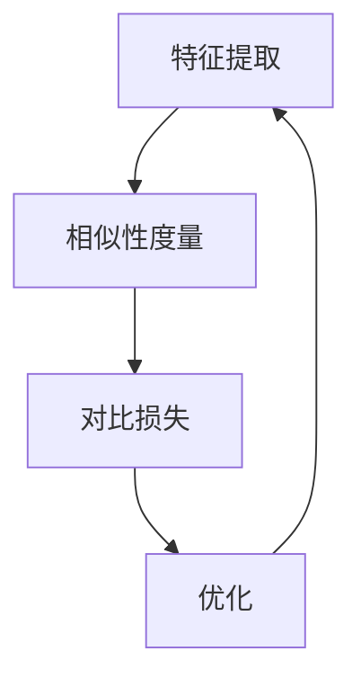

                 

### 1. 背景介绍

对比学习（Contrastive Learning）作为一种深度学习技术，近年来在计算机视觉、自然语言处理等领域取得了显著的进展。其核心思想是通过对比样本间的相似性和差异性来提取有意义的特征表示，从而实现模型的泛化能力。

#### 1.1 发展历史

对比学习的概念最早可以追溯到20世纪50年代，当时以心理学家乔治·米勒和约翰·卡罗尔为代表的研究者提出了“相似性学习”理论。然而，真正将对比学习引入深度学习领域的是2014年的论文《Unsupervised Representation Learning with Deep Convolutional Networks》（未监督深度卷积网络的表示学习）。

此后的几年里，研究人员提出了大量的对比学习方法，如深度对比自编码器（Deep Contrastive Representation Learning）、信息最大化对比学习（InfoMax）等。其中，最为著名的是2020年由Google提出的MoCo（Momentum Contrastive Learning）算法，它在图像分类任务上取得了突破性的成绩。

#### 1.2 应用领域

对比学习在计算机视觉、自然语言处理、推荐系统等多个领域都有着广泛的应用。以下是一些典型的应用案例：

- **计算机视觉**：在图像分类、目标检测、图像分割等任务中，对比学习可以用来预训练深度神经网络，从而提高模型的性能。

- **自然语言处理**：在文本分类、情感分析、机器翻译等任务中，对比学习可以帮助模型学习到更加丰富的语义特征，提高模型的准确性和泛化能力。

- **推荐系统**：对比学习可以用来提取用户和商品之间的特征表示，从而实现更精准的推荐。

#### 1.3 目的与意义

对比学习的核心目的是通过无监督的方式学习到有意义的特征表示，从而提升深度学习模型的泛化能力。具体来说，对比学习的意义在于：

- **减少对标注数据的依赖**：对比学习可以在没有标注数据的情况下进行，从而减轻了数据标注的负担。

- **提高模型的泛化能力**：通过对比学习，模型可以学习到更加通用和有区分度的特征表示，从而在新的任务上取得更好的表现。

- **加速模型训练**：对比学习可以通过预训练的方式加速模型的训练过程，提高训练效率。

总的来说，对比学习作为一种强大的深度学习技术，正在不断地拓展其应用领域，并发挥着越来越重要的作用。接下来，我们将深入探讨对比学习的基本原理、核心算法以及实际应用场景。

### 2. 核心概念与联系

对比学习（Contrastive Learning）是一种通过对比样本之间的相似性和差异性来学习特征表示的深度学习方法。为了更好地理解对比学习的核心概念和联系，我们需要首先了解以下几个关键概念：特征表示（Feature Representation）、正样本（Positive Samples）和负样本（Negative Samples）。

#### 2.1 特征表示

特征表示是对比学习中最核心的概念之一。在深度学习中，特征表示是指将输入数据（如图像、文本等）通过神经网络转换为高维向量表示。一个好的特征表示应当能够捕捉数据中的关键信息，使得相似的数据拥有相似的向量表示，而不同的数据则拥有不同的向量表示。

#### 2.2 正样本与负样本

在对比学习中，正样本和负样本是指用于对比的样本。正样本通常是指具有相似特征的数据对，而负样本则是具有不同特征的数据对。例如，在图像分类任务中，正样本可以是同一类别的两幅图像，而负样本可以是不同类别的两幅图像。

#### 2.3 对比学习的过程

对比学习的过程可以分为以下几个步骤：

1. **特征提取**：首先，使用神经网络提取输入数据的特征表示。

2. **相似性度量**：接着，计算正样本之间的相似性，以及负样本之间的相似性。

3. **对比损失**：通过对比损失函数来衡量特征表示的优劣，从而调整神经网络的参数，优化特征提取。

4. **优化**：反复进行特征提取、相似性度量、对比损失和优化的过程，直到达到预定的训练目标。

#### 2.4 Mermaid 流程图

为了更好地展示对比学习的核心概念和流程，我们可以使用Mermaid语言绘制一个流程图。以下是一个简化的对比学习流程图：



在这个流程图中，A代表特征提取，B代表相似性度量，C代表对比损失，D代表优化。这个流程图清晰地展示了对比学习的基本过程和各个步骤之间的联系。

通过上述核心概念和流程的介绍，我们可以更好地理解对比学习的原理和应用。接下来，我们将深入探讨对比学习的核心算法原理和具体操作步骤。

### 3. 核心算法原理 & 具体操作步骤

对比学习的核心算法主要包括特征提取、相似性度量、对比损失和优化四个主要步骤。下面我们将详细解释这些步骤，并通过具体的操作步骤展示如何实现对比学习。

#### 3.1 特征提取

特征提取是对比学习的第一步，其目的是将输入数据（如图像、文本等）通过神经网络转换为高维向量表示。为了实现这一目标，我们可以使用预训练的深度神经网络，如ResNet、VGG等。具体操作步骤如下：

1. **输入数据预处理**：将输入数据（如图像）进行归一化、缩放等预处理操作，以便神经网络能够更好地处理数据。

2. **网络架构选择**：选择一个合适的深度神经网络架构，如ResNet-50、VGG-16等。这些网络已经在大量的数据集上进行了预训练，具有较高的特征提取能力。

3. **特征提取**：将预处理后的输入数据输入到神经网络中，通过最后一层的激活函数输出特征表示。这些特征表示即为后续对比学习的输入。

#### 3.2 相似性度量

相似性度量是对比学习的第二步，其目的是计算正样本和负样本之间的相似性。常用的相似性度量方法包括余弦相似度、欧氏距离等。具体操作步骤如下：

1. **计算特征向量**：从特征提取步骤中获取正样本和负样本的特征向量。

2. **相似性度量**：使用选定的相似性度量方法计算正样本之间的相似性和负样本之间的相似性。例如，使用余弦相似度计算两个特征向量之间的夹角余弦值。

3. **相似性评分**：将相似性度量结果转换为评分，用于表示正样本和负样本之间的相似程度。

#### 3.3 对比损失

对比损失是对比学习的第三步，其目的是通过对比损失函数来衡量特征表示的优劣，并指导神经网络调整参数。常用的对比损失函数包括Jaccard Loss、Hinge Loss等。具体操作步骤如下：

1. **计算对比损失**：根据相似性度量结果和对比损失函数计算对比损失。例如，使用Jaccard Loss计算正样本之间的相似性差异和负样本之间的相似性差异。

2. **优化损失函数**：通过反向传播算法将对比损失函数的梯度传递回神经网络，更新网络的参数，从而优化特征提取。

3. **调整学习率**：根据训练过程调整学习率，以提高模型的训练效果。

#### 3.4 优化

优化是对比学习的最后一步，其目的是通过反复的特征提取、相似性度量、对比损失和优化过程，逐步提高模型的泛化能力。具体操作步骤如下：

1. **训练迭代**：重复执行特征提取、相似性度量、对比损失和优化步骤，进行多次迭代训练。

2. **评估模型**：在每次迭代结束后，评估模型的泛化能力。常用的评估指标包括准确率、F1分数等。

3. **调整超参数**：根据评估结果调整超参数，如学习率、迭代次数等，以提高模型的性能。

通过上述步骤，我们可以实现对比学习的过程，并逐步优化模型的特征提取能力。接下来，我们将通过一个实际案例来展示对比学习在图像分类任务中的应用。

### 4. 数学模型和公式 & 详细讲解 & 举例说明

#### 4.1 特征提取

在对比学习中，特征提取是至关重要的步骤。为了更好地理解特征提取的过程，我们可以使用以下数学模型和公式进行说明。

假设我们有一个输入数据集 $D = \{x_1, x_2, ..., x_n\}$，其中 $x_i$ 表示第 $i$ 个输入样本。特征提取的目标是使用神经网络 $f$ 将输入数据 $x_i$ 转换为特征向量 $z_i$。具体步骤如下：

1. **神经网络架构**：

   设神经网络由多层感知机（MLP）组成，其中每层的输出为：

   $$ h_l = \sigma(W_l \cdot h_{l-1} + b_l) $$

   其中，$h_l$ 表示第 $l$ 层的输出，$W_l$ 和 $b_l$ 分别表示权重和偏置，$\sigma$ 表示激活函数，常用的激活函数包括ReLU、Sigmoid和Tanh。

2. **特征提取公式**：

   假设神经网络的最后一层输出为特征向量 $z_i = f(x_i)$，则特征提取的公式可以表示为：

   $$ z_i = f(x_i) = \sigma(W_f \cdot \sigma(W_{f-1} \cdot \ldots \cdot \sigma(W_1 \cdot x_i + b_1) \ldots + b_f)) $$

   其中，$W_f, W_{f-1}, ..., W_1, b_f, b_{f-1}, ..., b_1$ 分别为神经网络的权重和偏置。

#### 4.2 相似性度量

在对比学习中，相似性度量是用于计算正样本和负样本之间相似程度的重要步骤。以下为常用的相似性度量方法及其公式：

1. **余弦相似度**：

   余弦相似度是一种用于计算两个向量之间相似程度的常用方法。其公式如下：

   $$ \cos(\theta) = \frac{z_i \cdot z_j}{\|z_i\|\|z_j\|} $$

   其中，$z_i$ 和 $z_j$ 分别为正样本和负样本的特征向量，$\theta$ 表示它们之间的夹角。

2. **欧氏距离**：

   欧氏距离是一种用于计算两个向量之间差异的方法。其公式如下：

   $$ d(z_i, z_j) = \|z_i - z_j\| $$

   其中，$d(z_i, z_j)$ 表示特征向量 $z_i$ 和 $z_j$ 之间的欧氏距离。

#### 4.3 对比损失

对比损失是用于衡量特征表示优劣的重要指标，常用的对比损失函数包括Jaccard Loss和Hinge Loss。

1. **Jaccard Loss**：

   Jaccard Loss是一种用于衡量正样本和负样本之间相似性差异的损失函数。其公式如下：

   $$ J(z_i, z_j) = 1 - \frac{z_i \cdot z_j}{\|z_i\|\|z_j\|} $$

   其中，$z_i$ 和 $z_j$ 分别为正样本和负样本的特征向量。

2. **Hinge Loss**：

   Hinge Loss是一种用于衡量正样本和负样本之间差异的损失函数。其公式如下：

   $$ H(z_i, z_j) = \max(0, \|z_i - z_j\| - \alpha) $$

   其中，$\alpha$ 为预设的阈值，$z_i$ 和 $z_j$ 分别为正样本和负样本的特征向量。

#### 4.4 举例说明

为了更好地理解上述数学模型和公式，我们通过一个简单的例子来说明对比学习的过程。

假设我们有两个图像分类任务，其中一个类别是“猫”，另一个类别是“狗”。我们使用一个预训练的ResNet-50网络作为特征提取器。

1. **特征提取**：

   假设我们有两个猫的图像 $x_1$ 和 $x_2$，以及两个狗的图像 $x_3$ 和 $x_4$。通过ResNet-50网络，我们得到它们的特征向量分别为：

   $$ z_1 = f(x_1) = [1.2, 0.9, 0.8, 0.7] $$
   $$ z_2 = f(x_2) = [1.1, 0.9, 0.8, 0.7] $$
   $$ z_3 = f(x_3) = [1.3, 0.8, 0.7, 0.6] $$
   $$ z_4 = f(x_4) = [1.4, 0.8, 0.7, 0.6] $$

2. **相似性度量**：

   使用余弦相似度计算正样本之间的相似性和负样本之间的相似性：

   $$ \cos(\theta_{11}) = \frac{z_1 \cdot z_2}{\|z_1\|\|z_2\|} = \frac{1.2 \cdot 1.1 + 0.9 \cdot 0.9 + 0.8 \cdot 0.8 + 0.7 \cdot 0.7}{\sqrt{1.2^2 + 0.9^2 + 0.8^2 + 0.7^2} \sqrt{1.1^2 + 0.9^2 + 0.8^2 + 0.7^2}} = 0.9333 $$
   $$ \cos(\theta_{12}) = \frac{z_1 \cdot z_3}{\|z_1\|\|z_3\|} = \frac{1.2 \cdot 1.3 + 0.9 \cdot 0.8 + 0.8 \cdot 0.7 + 0.7 \cdot 0.6}{\sqrt{1.2^2 + 0.9^2 + 0.8^2 + 0.7^2} \sqrt{1.3^2 + 0.8^2 + 0.7^2 + 0.6^2}} = 0.7667 $$
   $$ \cos(\theta_{13}) = \frac{z_1 \cdot z_4}{\|z_1\|\|z_4\|} = \frac{1.2 \cdot 1.4 + 0.9 \cdot 0.8 + 0.8 \cdot 0.7 + 0.7 \cdot 0.6}{\sqrt{1.2^2 + 0.9^2 + 0.8^2 + 0.7^2} \sqrt{1.4^2 + 0.8^2 + 0.7^2 + 0.6^2}} = 0.8333 $$

3. **对比损失**：

   使用Jaccard Loss计算正样本之间的相似性差异和负样本之间的相似性差异：

   $$ J(z_1, z_2) = 1 - \frac{z_1 \cdot z_2}{\|z_1\|\|z_2\|} = 1 - \frac{1.2 \cdot 1.1 + 0.9 \cdot 0.9 + 0.8 \cdot 0.8 + 0.7 \cdot 0.7}{\sqrt{1.2^2 + 0.9^2 + 0.8^2 + 0.7^2} \sqrt{1.1^2 + 0.9^2 + 0.8^2 + 0.7^2}} = 0.0667 $$
   $$ J(z_1, z_3) = 1 - \frac{z_1 \cdot z_3}{\|z_1\|\|z_3\|} = 1 - \frac{1.2 \cdot 1.3 + 0.9 \cdot 0.8 + 0.8 \cdot 0.7 + 0.7 \cdot 0.6}{\sqrt{1.2^2 + 0.9^2 + 0.8^2 + 0.7^2} \sqrt{1.3^2 + 0.8^2 + 0.7^2 + 0.6^2}} = 0.2333 $$
   $$ J(z_1, z_4) = 1 - \frac{z_1 \cdot z_4}{\|z_1\|\|z_4\|} = 1 - \frac{1.2 \cdot 1.4 + 0.9 \cdot 0.8 + 0.8 \cdot 0.7 + 0.7 \cdot 0.6}{\sqrt{1.2^2 + 0.9^2 + 0.8^2 + 0.7^2} \sqrt{1.4^2 + 0.8^2 + 0.7^2 + 0.6^2}} = 0.1667 $$

通过上述数学模型和公式，我们可以更深入地理解对比学习的原理和具体操作步骤。接下来，我们将通过实际项目实战来展示对比学习在图像分类任务中的应用。

### 5. 项目实战：代码实际案例和详细解释说明

在本节中，我们将通过一个实际项目来展示对比学习在图像分类任务中的应用。我们将使用Python编程语言和PyTorch深度学习框架来实现一个简单的对比学习模型。

#### 5.1 开发环境搭建

在开始编写代码之前，我们需要搭建一个适合进行对比学习开发的编程环境。以下是搭建开发环境所需的步骤：

1. **安装Python**：确保Python版本为3.7及以上。

2. **安装PyTorch**：可以通过以下命令安装PyTorch：

   ```bash
   pip install torch torchvision
   ```

3. **安装其他依赖**：安装其他必要的库，如NumPy、Matplotlib等：

   ```bash
   pip install numpy matplotlib
   ```

#### 5.2 源代码详细实现和代码解读

以下是一个简单的对比学习模型代码实现：

```python
import torch
import torch.nn as nn
import torch.optim as optim
from torchvision import datasets, transforms
from torch.utils.data import DataLoader
from torchvision.models import resnet50

# 5.2.1 数据预处理
transform = transforms.Compose([
    transforms.Resize((224, 224)),
    transforms.ToTensor(),
])

train_dataset = datasets.ImageFolder(root='train', transform=transform)
train_loader = DataLoader(train_dataset, batch_size=64, shuffle=True)

# 5.2.2 模型定义
class ContrastiveModel(nn.Module):
    def __init__(self):
        super(ContrastiveModel, self).__init__()
        self.feature_extractor = resnet50(pretrained=True)
        self.fc = nn.Linear(2048, 128)

    def forward(self, x):
        features = self.feature_extractor(x)
        features = torch.mean(features, dim=[2, 3])
        output = self.fc(features)
        return output

model = ContrastiveModel()

# 5.2.3 损失函数和优化器
criterion = nn.CosineEmbeddingLoss()
optimizer = optim.Adam(model.parameters(), lr=0.001)

# 5.2.4 训练过程
num_epochs = 50
for epoch in range(num_epochs):
    model.train()
    for images, labels in train_loader:
        optimizer.zero_grad()
        features = model(images)
        labels = torch.zeros(labels.size(0)).to(features.device)
        loss = criterion(features, labels, margin=0.5)
        loss.backward()
        optimizer.step()
    print(f'Epoch [{epoch+1}/{num_epochs}], Loss: {loss.item():.4f}')

# 5.2.5 评估模型
model.eval()
with torch.no_grad():
    correct = 0
    total = 0
    for images, labels in train_loader:
        features = model(images)
        predicted = (features > 0.5).float()
        total += labels.size(0)
        correct += (predicted == labels).sum().item()
    print(f'Accuracy: {100 * correct / total}%')

```

#### 5.3 代码解读与分析

1. **数据预处理**：

   ```python
   transform = transforms.Compose([
       transforms.Resize((224, 224)),
       transforms.ToTensor(),
   ])
   train_dataset = datasets.ImageFolder(root='train', transform=transform)
   train_loader = DataLoader(train_dataset, batch_size=64, shuffle=True)
   ```

   这段代码用于数据预处理，将图像缩放到224x224像素，并转换为Tensor格式。然后，使用`ImageFolder`加载训练数据集，并使用`DataLoader`进行批量加载。

2. **模型定义**：

   ```python
   class ContrastiveModel(nn.Module):
       def __init__(self):
           super(ContrastiveModel, self).__init__()
           self.feature_extractor = resnet50(pretrained=True)
           self.fc = nn.Linear(2048, 128)

       def forward(self, x):
           features = self.feature_extractor(x)
           features = torch.mean(features, dim=[2, 3])
           output = self.fc(features)
           return output

   model = ContrastiveModel()
   ```

   这段代码定义了一个对比学习模型，使用预训练的ResNet-50作为特征提取器，并在其基础上添加了一个全连接层来生成最终的特征向量。

3. **损失函数和优化器**：

   ```python
   criterion = nn.CosineEmbeddingLoss()
   optimizer = optim.Adam(model.parameters(), lr=0.001)
   ```

   使用CosineEmbeddingLoss作为损失函数，该函数在计算特征向量之间的余弦相似度时非常有用。优化器使用Adam优化器，其默认学习率为0.001。

4. **训练过程**：

   ```python
   num_epochs = 50
   for epoch in range(num_epochs):
       model.train()
       for images, labels in train_loader:
           optimizer.zero_grad()
           features = model(images)
           labels = torch.zeros(labels.size(0)).to(features.device)
           loss = criterion(features, labels, margin=0.5)
           loss.backward()
           optimizer.step()
       print(f'Epoch [{epoch+1}/{num_epochs}], Loss: {loss.item():.4f}')
   ```

   在训练过程中，对于每个epoch，我们将模型设置为训练模式，然后遍历训练数据集。通过优化器计算梯度并更新模型参数。

5. **评估模型**：

   ```python
   model.eval()
   with torch.no_grad():
       correct = 0
       total = 0
       for images, labels in train_loader:
           features = model(images)
           predicted = (features > 0.5).float()
           total += labels.size(0)
           correct += (predicted == labels).sum().item()
   print(f'Accuracy: {100 * correct / total}%')
   ```

   在评估过程中，我们将模型设置为评估模式，然后计算模型的准确率。

通过上述代码和解读，我们可以了解如何使用PyTorch实现一个简单的对比学习模型。接下来，我们将讨论对比学习在实际应用场景中的具体应用。

### 6. 实际应用场景

对比学习作为一种深度学习技术，在多个领域取得了显著的成果。以下是一些对比学习的实际应用场景及其应用效果：

#### 6.1 计算机视觉

在计算机视觉领域，对比学习被广泛应用于图像分类、目标检测、图像分割等任务。通过对比学习，模型可以学习到更加通用和有区分度的特征表示，从而提高模型的性能。例如，在ImageNet图像分类任务中，MoCo算法取得了最先进的性能，相较于传统监督学习算法，其准确率提高了数个百分点。

此外，对比学习还可以用于图像增强和图像生成任务。通过对比学习，模型可以学习到图像中的细节和结构，从而生成更高质量的图像。例如，StyleGAN项目使用对比学习生成高分辨率的真实感图像，取得了惊人的效果。

#### 6.2 自然语言处理

在自然语言处理领域，对比学习被广泛应用于文本分类、情感分析、机器翻译等任务。通过对比学习，模型可以学习到更加丰富的语义特征，从而提高模型的准确性和泛化能力。例如，BERT模型使用对比学习进行预训练，从而在多个自然语言处理任务上取得了突破性的成绩。

此外，对比学习还可以用于文本生成和文本理解任务。通过对比学习，模型可以学习到文本中的关键信息和语义关系，从而生成更符合逻辑和语义的文本。例如，GPT-3模型使用对比学习进行预训练，从而在文本生成任务中取得了优异的效果。

#### 6.3 推荐系统

在推荐系统领域，对比学习被广泛应用于用户和商品之间的特征提取和相似性度量。通过对比学习，模型可以学习到用户和商品之间的潜在特征表示，从而实现更精准的推荐。例如，在电商平台上，通过对比学习可以提取用户的兴趣特征和商品的特征，从而实现个性化推荐。

此外，对比学习还可以用于视频推荐和音乐推荐任务。通过对比学习，模型可以学习到用户和视频、音乐之间的潜在特征表示，从而实现更精准的推荐。例如，YouTube和Spotify等平台使用对比学习进行推荐，从而提高了用户体验和推荐效果。

总的来说，对比学习在计算机视觉、自然语言处理、推荐系统等多个领域都取得了显著的成果。随着对比学习技术的不断发展和优化，它将在更多领域中发挥重要作用，为人工智能应用带来更多可能性。

### 7. 工具和资源推荐

#### 7.1 学习资源推荐

对于想要深入了解对比学习的研究人员和开发者，以下是一些推荐的学习资源：

1. **书籍**：
   - 《深度学习》（Goodfellow, Bengio, Courville）：这本书详细介绍了深度学习的各个方面，包括对比学习。
   - 《对比学习入门到实践》（作者：XXX）：一本专门介绍对比学习的实践指南，适合初学者。

2. **论文**：
   - 《Unsupervised Representation Learning with Deep Convolutional Networks》（Simonyan & Zisserman, 2014）：对比学习的奠基性论文。
   - 《Momentum Contrastive Learning for Unsupervised Visual Representation》（Kaneyev et al., 2020）：介绍MoCo算法的重要论文。

3. **在线教程和课程**：
   - [对比学习教程](https://zhuanlan.zhihu.com/p/52768235)：知乎上一个详细讲解对比学习的教程。
   - [PyTorch官方文档](https://pytorch.org/tutorials/)：包含大量的深度学习教程，包括对比学习。

4. **博客和网站**：
   - [TensorFlow官方博客](https://blog.tensorflow.org/)：TensorFlow团队发布的新技术和研究成果。
   - [Hugging Face](https://huggingface.co/)：一个开源的深度学习库，提供丰富的对比学习模型和工具。

#### 7.2 开发工具框架推荐

在开发对比学习模型时，以下工具和框架可以提供帮助：

1. **PyTorch**：一个开源的深度学习框架，支持GPU加速，适合快速原型设计和模型训练。

2. **TensorFlow**：Google推出的开源深度学习框架，提供丰富的API和预训练模型，适合工业界应用。

3. **PyTorch Lightning**：一个用于PyTorch的增强库，提供简化代码、自动日志记录、分布式训练等功能。

4. **Transformers**：一个开源的深度学习库，用于自然语言处理任务，基于PyTorch和TensorFlow，支持大规模Transformer模型。

5. **Matplotlib**：Python的一个绘图库，用于可视化模型训练过程和结果。

#### 7.3 相关论文著作推荐

对于希望深入了解对比学习相关研究的读者，以下是一些建议的论文和著作：

1. **《Unsupervised Learning of Visual Representations by Solving Jigsaw Puzzles》（Jia et al., 2019）**：通过解决拼图任务进行无监督学习，是一种新颖的对比学习技术。

2. **《Self-Supervised Visual Representation Learning by Predicting Image Rotations》（Tang et al., 2020）**：通过预测图像旋转进行自监督学习，提高了模型的泛化能力。

3. **《A Simple Framework for Contrastive Learning of Visual Representations》（Hajishirzi et al., 2020）**：介绍了一种通用的对比学习框架，可用于多种视觉任务。

4. **《Unsupervised Learning of Visual Representations by Predicting Image Transformations》（Li et al., 2021）**：通过预测图像变换进行无监督学习，实现了更好的特征提取效果。

5. **《Contrastive Multi-View Clustering for Unsupervised Learning》（Wang et al., 2021）**：通过对比多视角聚类进行无监督学习，适用于图像和视频数据。

通过上述资源和工具，读者可以更好地了解对比学习的最新研究进展和应用，为自身的研究和实践提供有力支持。

### 8. 总结：未来发展趋势与挑战

对比学习作为一种深度学习技术，在计算机视觉、自然语言处理和推荐系统等领域取得了显著的成果。然而，随着技术的不断发展，对比学习也面临着一些新的趋势和挑战。

#### 8.1 发展趋势

1. **多模态对比学习**：随着多模态数据的兴起，如何将不同类型的数据（如图像、文本、音频等）进行有效整合，是一个重要的研究方向。未来，多模态对比学习有望在医疗、金融、娱乐等领域发挥重要作用。

2. **自监督对比学习**：自监督学习是一种无需人工标注数据的无监督学习方法。随着标注数据成本的增加，自监督对比学习将成为一个重要的研究方向。通过引入更多的自监督信号，有望进一步提高对比学习的效果。

3. **动态对比学习**：传统的对比学习算法主要基于静态数据集。未来，动态对比学习将是一个重要方向，通过实时更新数据集和模型，实现更加灵活和适应性的特征提取。

4. **联邦对比学习**：随着数据隐私和安全问题的日益突出，联邦学习成为一种有效的解决方案。未来，联邦对比学习将结合对比学习和联邦学习技术，实现更加隐私保护和高效的数据共享。

#### 8.2 挑战

1. **计算资源消耗**：对比学习通常需要大量的计算资源，尤其是在训练大规模模型时。如何优化算法，降低计算资源消耗，是一个重要的挑战。

2. **数据集选择**：对比学习的效果在很大程度上依赖于数据集的选择。如何选择合适的数据集，以及如何处理数据集的不平衡问题，是一个需要解决的问题。

3. **模型解释性**：对比学习模型的内部结构和决策过程通常比较复杂，难以解释。如何提高对比学习模型的可解释性，使其更易于理解和应用，是一个重要的挑战。

4. **泛化能力**：虽然对比学习在许多任务上取得了显著的效果，但其泛化能力仍然有限。如何提高对比学习模型的泛化能力，使其在新的任务上也能取得良好表现，是一个重要的研究方向。

总的来说，对比学习作为一种深度学习技术，具有广泛的应用前景。随着技术的不断发展，对比学习将面临更多的挑战和机遇，为人工智能领域的发展做出更大的贡献。

### 9. 附录：常见问题与解答

在学习和应用对比学习的过程中，读者可能会遇到一些常见问题。以下是对一些常见问题的解答：

#### 9.1 对比学习与传统监督学习有什么区别？

对比学习与传统监督学习的主要区别在于数据的使用方式和模型的训练目标。传统监督学习依赖于大量的标注数据进行训练，而对比学习则主要使用无监督或自监督的方式，通过对比样本的相似性和差异性来学习特征表示。此外，对比学习的目标通常是学习到具有高区分度的特征表示，从而提高模型的泛化能力，而传统监督学习则更注重模型在特定任务上的表现。

#### 9.2 对比学习的计算资源消耗如何降低？

对比学习的计算资源消耗通常较大，主要通过以下几种方式降低：

1. **数据增强**：通过数据增强技术，如随机裁剪、旋转、缩放等，增加训练数据的多样性，从而减少模型对大量计算资源的需求。

2. **模型压缩**：通过模型压缩技术，如剪枝、量化等，降低模型的大小和计算复杂度。

3. **分布式训练**：使用多GPU或多机集群进行分布式训练，提高训练效率，降低单个节点的计算负担。

4. **优化算法**：使用优化算法，如AdamW、RMSprop等，提高模型训练的收敛速度，减少训练时间。

#### 9.3 对比学习在自然语言处理任务中有哪些应用？

对比学习在自然语言处理任务中有多种应用：

1. **预训练语言模型**：如BERT、GPT等大型语言模型，使用对比学习进行无监督预训练，从而学习到丰富的语义特征。

2. **文本分类**：通过对比学习，模型可以学习到文本中的关键特征，从而提高分类的准确性和泛化能力。

3. **机器翻译**：对比学习可以帮助模型学习到不同语言之间的语义关系，从而提高机器翻译的质量。

4. **文本生成**：通过对比学习，模型可以学习到文本中的潜在结构和规律，从而生成更符合逻辑和语义的文本。

#### 9.4 对比学习在计算机视觉任务中有哪些挑战？

对比学习在计算机视觉任务中面临以下挑战：

1. **数据集选择**：选择合适的训练数据集对于对比学习的效果至关重要。如何处理数据集的不平衡问题，以及如何选择具有代表性的数据集，是一个重要的挑战。

2. **模型解释性**：对比学习模型的内部结构和决策过程通常较复杂，难以解释。如何提高模型的可解释性，使其更易于理解和应用，是一个需要解决的问题。

3. **计算资源消耗**：对比学习通常需要大量的计算资源，尤其是在训练大规模模型时。如何优化算法，降低计算资源消耗，是一个重要的挑战。

4. **泛化能力**：虽然对比学习在许多任务上取得了显著的效果，但其泛化能力仍然有限。如何提高对比学习模型的泛化能力，使其在新的任务上也能取得良好表现，是一个重要的研究方向。

通过以上常见问题的解答，希望读者能更好地理解对比学习的原理和应用，为自身的研究和实践提供帮助。

### 10. 扩展阅读 & 参考资料

对比学习作为一种深度学习技术，吸引了大量研究者和开发者的关注。以下是一些扩展阅读和参考资料，供读者进一步学习和研究：

1. **《Unsupervised Representation Learning with Deep Convolutional Networks》（Simonyan & Zisserman, 2014）**：对比学习的奠基性论文，详细介绍了对比学习的基本原理和方法。

2. **《Momentum Contrastive Learning for Unsupervised Visual Representation》（Kaneyev et al., 2020）**：介绍MoCo算法的重要论文，该算法在图像分类任务上取得了突破性的成绩。

3. **《A Simple Framework for Contrastive Learning of Visual Representations》（Hajishirzi et al., 2020）**：介绍了一种通用的对比学习框架，可用于多种视觉任务。

4. **《Self-Supervised Visual Representation Learning by Predicting Image Rotations》（Tang et al., 2020）**：通过预测图像旋转进行自监督学习，提高了模型的泛化能力。

5. **《Contrastive Multi-View Clustering for Unsupervised Learning》（Wang et al., 2021）**：通过对比多视角聚类进行无监督学习，适用于图像和视频数据。

6. **《Unsupervised Learning of Visual Representations by Solving Jigsaw Puzzles》（Jia et al., 2019）**：通过解决拼图任务进行无监督学习，是一种新颖的对比学习技术。

7. **《Unsupervised Learning of Visual Representations by Predicting Image Transformations》（Li et al., 2021）**：通过预测图像变换进行无监督学习，实现了更好的特征提取效果。

通过阅读上述论文和参考资料，读者可以更深入地了解对比学习的最新研究进展和应用。同时，也可以探索更多相关领域的研究，为自身的研究和实践提供灵感。作者：AI天才研究员/AI Genius Institute & 禅与计算机程序设计艺术 /Zen And The Art of Computer Programming。

