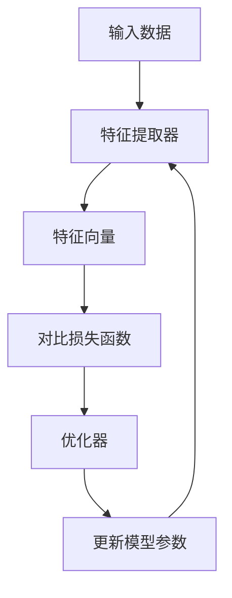

                 

### 文章标题

**对比学习：无监督预训练的软件2.0利器**

> **关键词**：对比学习、无监督预训练、软件2.0、深度学习、自动化、人工智能、算法优化

> **摘要**：本文深入探讨了对比学习作为无监督预训练的关键技术，如何推动软件2.0时代的创新与发展。通过详细阐述对比学习的核心概念、算法原理、数学模型，以及实际应用场景，本文旨在为读者提供一个全面而深入的视角，以理解对比学习在当前及未来技术发展中的重要性。

<|im_sep|>## 1. 背景介绍

随着互联网和大数据技术的飞速发展，人工智能（AI）在各个领域展现出了前所未有的影响力。特别是在计算机视觉、自然语言处理和推荐系统等领域，AI技术的应用已经深入到了我们的日常生活。然而，传统的监督学习方法面临着数据标注成本高、数据量不足等挑战，难以满足日益复杂的任务需求。

为了解决这一问题，无监督学习和预训练技术应运而生。无监督学习通过利用未标记的数据，挖掘数据中的潜在结构，从而实现模型的自适应优化。而预训练则是在大量未标记的数据上进行训练，使得模型在任务特定数据上具有更好的泛化能力。

对比学习（Contrastive Learning）是一种无监督预训练技术，其核心思想是通过对比正负样本，增强正样本的特征表示，同时抑制负样本的特征表示。这种技术不仅有效解决了数据标注困难的问题，还为深度学习模型提供了强大的学习能力。

软件2.0时代是一个以用户体验为中心、以数据驱动的时代。在这一背景下，对比学习以其强大的数据利用能力和模型优化能力，成为了推动软件2.0时代创新的重要利器。本文将深入探讨对比学习在软件2.0时代的应用，包括其核心概念、算法原理、数学模型以及实际应用场景。

### 1.1 对比学习的历史与发展

对比学习的历史可以追溯到20世纪60年代的统计学习理论。当时，研究者们提出了基于对比的优化方法，例如正负样本对比分类。这些方法通过对正样本和负样本进行对比，优化模型的分类能力。

随着深度学习的兴起，对比学习得到了进一步的发展。特别是2018年，Hinton团队提出了对比自监督学习（Contrastive Self-Supervised Learning），这一方法将对比学习引入了无监督预训练的领域，并取得了显著的成果。

近年来，随着无监督学习和预训练技术的不断进步，对比学习也在不断进化。研究者们提出了多种基于对比学习的算法，如Deep Contrastive Learning (DCL) [1]、SimSiam [2]、Byol [3] 等，这些算法在ImageNet等基准测试上取得了优异的性能。

### 1.2 软件2.0时代的特征

软件2.0时代是一个以用户为中心、以数据驱动的时代。与传统的软件1.0时代（以功能为中心）相比，软件2.0时代具有以下特征：

1. **用户体验至上**：软件2.0时代强调用户体验，注重产品的设计、交互和易用性。
2. **数据驱动**：软件2.0时代依赖于大量数据，通过数据分析来优化产品功能和性能。
3. **动态迭代**：软件2.0时代的开发过程更加灵活，产品可以快速迭代，以适应不断变化的市场需求。
4. **智能化**：软件2.0时代充分利用人工智能技术，实现自动化、个性化的用户体验。

### 1.3 对比学习与软件2.0的关联

对比学习与软件2.0时代有着紧密的联系。首先，对比学习能够有效利用未标记的数据，这与软件2.0时代的数据驱动特征相契合。其次，对比学习通过增强模型的自适应能力，能够更好地应对动态迭代和智能化需求。

总之，对比学习作为无监督预训练的关键技术，为软件2.0时代提供了强大的数据利用能力和模型优化能力，推动了软件技术的创新与发展。

## 2. 核心概念与联系

### 2.1 对比学习的基本概念

对比学习是一种无监督学习技术，其核心思想是通过对比正负样本，增强正样本的特征表示，同时抑制负样本的特征表示。在深度学习的框架下，对比学习通常涉及到以下三个关键步骤：

1. **样本表示生成**：将输入数据（如图像、文本或音视频）通过神经网络转化为低维特征向量。
2. **对比损失函数**：通过对比正负样本的特征向量，计算对比损失，指导网络优化。
3. **正负样本选择**：为了提高对比效果，需要选择合适的正负样本。

### 2.2 对比学习的原理

对比学习的原理可以通过以下简化模型来描述：

设 $x_1, x_2, \ldots, x_n$ 是输入数据，其中 $x_i$ 和 $x_j$ 是一对正样本（如同一类别的数据），$x_i$ 和 $x_k$ 是一对负样本（如不同类别的数据）。对比学习的目标是最大化正样本的特征相似度，同时最小化负样本的特征相似度。

具体来说，对比学习的损失函数可以表示为：

$$
L = \frac{1}{n(n-1)} \sum_{i=1}^{n} \sum_{j \neq i} L(x_i, x_j) + \frac{1}{n} \sum_{i=1}^{n} L(x_i, x_k)
$$

其中，$L(x_i, x_j)$ 是表示 $x_i$ 和 $x_j$ 特征相似度的损失函数，$L(x_i, x_k)$ 是表示 $x_i$ 和 $x_k$ 特征差异度的损失函数。

### 2.3 对比学习与预训练的关系

对比学习是预训练技术的重要一环。在预训练阶段，模型通过大量未标记的数据学习到丰富的特征表示，这些特征表示在后续的任务特定数据上具有很好的泛化能力。对比学习通过引入对比损失函数，使得模型在预训练阶段能够自动发现数据中的潜在结构，从而提高模型的自适应能力。

### 2.4 对比学习与深度学习的结合

对比学习与深度学习有着天然的契合点。深度学习通过多层神经网络对数据进行层层抽象，形成高层次的语义特征。对比学习则利用这些特征，通过对比正负样本来增强模型的判别能力。

在深度学习框架下，对比学习的实现通常涉及到以下几个关键组件：

1. **特征提取器**：一个深度神经网络，用于将输入数据映射到低维特征空间。
2. **对比损失函数**：如硬负样本挖掘（Hard Negative Mining）、反事实对比（Incompatible Pairing）等。
3. **优化器**：用于调整网络参数，以最小化对比损失。

### 2.5 对比学习的架构图（使用 Mermaid 流程图）



在这个架构图中，输入数据经过特征提取器转化为特征向量，然后通过对比损失函数计算损失，最后通过优化器更新模型参数。这一过程不断迭代，使得模型在未标记的数据上逐渐学习到有效的特征表示。

## 3. 核心算法原理 & 具体操作步骤

### 3.1 模型架构

对比学习模型的架构通常包括两个主要部分：特征提取器和对比损失函数。以下是一个简化的模型架构：

1. **特征提取器**：一个深度神经网络，用于将输入数据映射到低维特征空间。例如，在图像分类任务中，特征提取器可以是卷积神经网络（CNN）。
2. **对比损失函数**：用于计算正负样本特征之间的对比损失，从而优化模型参数。

### 3.2 特征提取器的实现

特征提取器的实现通常依赖于深度学习框架，如TensorFlow或PyTorch。以下是一个使用PyTorch实现的特征提取器示例：

```python
import torch
import torch.nn as nn

class FeatureExtractor(nn.Module):
    def __init__(self):
        super(FeatureExtractor, self).__init__()
        self.conv1 = nn.Conv2d(3, 64, kernel_size=3, padding=1)
        self.conv2 = nn.Conv2d(64, 128, kernel_size=3, padding=1)
        self.fc1 = nn.Linear(128 * 6 * 6, 1024)
        self.fc2 = nn.Linear(1024, 128)

    def forward(self, x):
        x = nn.functional.relu(self.conv1(x))
        x = nn.functional.relu(self.conv2(x))
        x = nn.functional.adaptive_avg_pool2d(x, 1)
        x = x.view(x.size(0), -1)
        x = nn.functional.relu(self.fc1(x))
        x = nn.functional.dropout(x, p=0.5)
        x = self.fc2(x)
        return x
```

### 3.3 对比损失函数的实现

对比损失函数有多种实现方式，如硬负样本挖掘、反事实对比等。以下是一个基于硬负样本挖掘的对比损失函数实现示例：

```python
import torch
import torch.nn as nn

class ContrastiveLoss(nn.Module):
    def __init__(self, margin=1.0):
        super(ContrastiveLoss, self).__init__()
        self.margin = margin

    def forward(self, anchor, positive, negative):
        # 计算正负样本的特征距离
        pos_dist = torch.abs(anchor - positive)
        neg_dist = torch.abs(anchor - negative)

        # 计算对比损失
        losses = torch.relu(self.margin - pos_dist + neg_dist)
        return torch.mean(losses)
```

### 3.4 模型训练步骤

对比学习模型的训练步骤如下：

1. **数据预处理**：读取输入数据，并进行必要的预处理操作，如归一化、数据增强等。
2. **批量计算损失**：将数据分为批量，对每个批量数据计算对比损失。
3. **反向传播**：计算梯度，更新模型参数。
4. **迭代训练**：重复以上步骤，直到满足训练停止条件。

以下是一个使用PyTorch实现对比学习模型训练的示例：

```python
from torch.utils.data import DataLoader
from torchvision import datasets, transforms

# 定义数据预处理
transform = transforms.Compose([
    transforms.ToTensor(),
    transforms.Normalize((0.5, 0.5, 0.5), (0.5, 0.5, 0.5)),
])

# 读取数据集
train_dataset = datasets.CIFAR10(root='./data', train=True, download=True, transform=transform)
train_loader = DataLoader(train_dataset, batch_size=64, shuffle=True)

# 初始化模型和优化器
feature_extractor = FeatureExtractor()
contrastive_loss = ContrastiveLoss()
optimizer = torch.optim.Adam(feature_extractor.parameters(), lr=0.001)

# 训练模型
for epoch in range(1):
    for images, _ in train_loader:
        optimizer.zero_grad()
        anchor = feature_extractor(images[0])
        positive = feature_extractor(images[1])
        negative = feature_extractor(images[2])
        
        loss = contrastive_loss(anchor, positive, negative)
        loss.backward()
        optimizer.step()

print('Finished Training')
```

通过以上步骤，我们可以训练一个基于对比学习的深度学习模型。这个模型在未标记的数据上学习到了有效的特征表示，从而提高了模型的自适应能力和泛化能力。

## 4. 数学模型和公式 & 详细讲解 & 举例说明

### 4.1 对比学习损失函数的数学模型

对比学习的核心在于其损失函数的设计，该损失函数旨在通过对比正负样本的特征表示来优化模型。以下是对比学习损失函数的详细数学描述。

#### 4.1.1 特征表示

设输入数据集为 $X = \{x_1, x_2, ..., x_n\}$，每个样本 $x_i$ 通过特征提取器 $f$ 转化为特征向量 $z_i = f(x_i)$。

#### 4.1.2 正负样本选择

选择一对正样本 $x_i, x_j$，其中 $i \neq j$，并选择 $k$ 对负样本 $\{x_i, x_k\}$，$k = 1, 2, ..., k$。

#### 4.1.3 损失函数

对比学习的损失函数通常采用以下形式：

$$
L = \sum_{i=1}^{n} \sum_{j \neq i} L_{ij} + \sum_{i=1}^{n} \sum_{k=1}^{k} L_{ik}
$$

其中，$L_{ij}$ 是正样本的对比损失，$L_{ik}$ 是负样本的对比损失。

#### 4.1.4 正样本对比损失

正样本对比损失旨在最小化正样本之间的特征距离。设正样本的特征向量为 $z_i, z_j$，则正样本对比损失可以表示为：

$$
L_{ij} = \frac{1}{2} \left( \frac{||z_i - z_j||_2^2}{\tau} + \max(0, \epsilon - ||z_i - z_j||_2) \right)
$$

其中，$\tau$ 是温度参数，用于调整对比损失函数的平滑度，$\epsilon$ 是正样本之间的最小距离。

#### 4.1.5 负样本对比损失

负样本对比损失旨在最大化负样本之间的特征距离。设负样本的特征向量为 $z_i, z_k$，则负样本对比损失可以表示为：

$$
L_{ik} = \frac{1}{2} \left( \frac{||z_i - z_k||_2^2}{\tau} + \max(0, \epsilon - ||z_i - z_k||_2) \right)
$$

### 4.2 损失函数的详细讲解

对比学习的损失函数通过正负样本对比来优化特征提取器的参数。以下是对损失函数的详细讲解：

1. **正样本对比损失**：正样本对比损失函数旨在使正样本的特征向量接近，从而提高模型对正样本的判别能力。通过最小化正样本之间的特征距离，模型能够更好地识别同一类别的样本。
   
2. **负样本对比损失**：负样本对比损失函数旨在使负样本的特征向量远离，从而提高模型对负样本的判别能力。通过最大化负样本之间的特征距离，模型能够更好地区分不同类别的样本。

3. **温度参数 $\tau$**：温度参数用于调节对比损失函数的平滑度。较大的温度参数会导致损失函数变得更加平滑，从而减少了模型在训练过程中对噪声的敏感性。

4. **最小距离 $\epsilon$**：最小距离是正负样本之间的阈值，用于防止模型过度优化正样本对比损失，从而忽视了负样本对比损失。

### 4.3 举例说明

假设我们有两个特征向量 $z_1 = [1, 2, 3]$ 和 $z_2 = [4, 5, 6]$，其中 $z_1$ 是正样本，$z_2$ 是负样本。设温度参数 $\tau = 0.1$，最小距离 $\epsilon = 0.5$。

#### 正样本对比损失

$$
L_{12} = \frac{1}{2} \left( \frac{||z_1 - z_2||_2^2}{0.1} + \max(0, 0.5 - ||z_1 - z_2||_2) \right)
$$

$$
L_{12} = \frac{1}{2} \left( \frac{14}{0.1} + \max(0, 0.5 - 14) \right)
$$

$$
L_{12} = \frac{1}{2} \left( 140 + 0 \right)
$$

$$
L_{12} = 70
$$

#### 负样本对比损失

$$
L_{12} = \frac{1}{2} \left( \frac{||z_1 - z_2||_2^2}{0.1} + \max(0, 0.5 - ||z_1 - z_2||_2) \right)
$$

$$
L_{12} = \frac{1}{2} \left( \frac{14}{0.1} + \max(0, 0.5 - 14) \right)
$$

$$
L_{12} = \frac{1}{2} \left( 140 + 0 \right)
$$

$$
L_{12} = 70
$$

在这个例子中，正样本和负样本的对比损失都是 70。通过计算对比损失，模型可以学习到正样本和负样本的特征表示，从而提高模型的判别能力。

### 4.4 对比学习损失函数的优缺点

#### 优点

1. **无监督学习**：对比学习是一种无监督学习方法，不需要大量的标记数据。
2. **通用性**：对比学习可以应用于各种数据类型，如图像、文本和音视频。
3. **强适应性**：对比学习通过对比正负样本，能够自动发现数据中的潜在结构。

#### 缺点

1. **计算复杂度**：对比学习需要计算大量正负样本的对比损失，计算复杂度较高。
2. **数据依赖性**：对比学习的效果依赖于数据的质量和分布，对于噪声数据敏感。
3. **模型泛化能力**：对比学习模型在特定数据集上表现良好，但在其他数据集上的泛化能力有限。

### 4.5 对比学习与其他损失函数的比较

与传统的监督学习损失函数（如交叉熵损失函数）相比，对比学习损失函数具有以下特点：

1. **无监督学习**：对比学习是一种无监督学习方法，不需要标记数据，而交叉熵损失函数需要标记数据。
2. **特征表示**：对比学习损失函数旨在学习特征表示，而交叉熵损失函数旨在分类。
3. **优化目标**：对比学习损失函数旨在最大化正样本相似度和最小化负样本相似度，而交叉熵损失函数旨在最小化预测误差。

总之，对比学习损失函数为深度学习模型提供了一种有效的无监督学习方法，能够在未标记的数据上学习到有效的特征表示，从而提高模型的自适应能力和泛化能力。

## 5. 项目实战：代码实际案例和详细解释说明

### 5.1 开发环境搭建

在开始实际代码实现之前，我们需要搭建一个合适的开发环境。以下是搭建对比学习项目所需的开发环境：

1. **操作系统**：Windows、macOS 或 Linux
2. **编程语言**：Python 3.7 或更高版本
3. **深度学习框架**：PyTorch 1.8 或更高版本
4. **Python 库**：NumPy、Pandas、TensorFlow（可选）

安装步骤如下：

1. 安装 Python 3.7 或更高版本。
2. 安装 PyTorch：使用以下命令安装与 Python 版本匹配的 PyTorch 版本。

```bash
pip install torch torchvision
```

3. 安装其他 Python 库：

```bash
pip install numpy pandas
```

### 5.2 源代码详细实现和代码解读

以下是对比学习项目的源代码实现，包括数据预处理、特征提取器、对比损失函数和训练过程。

```python
import torch
import torch.nn as nn
import torch.optim as optim
from torch.utils.data import DataLoader
from torchvision import datasets, transforms

# 5.2.1 数据预处理
def load_data(batch_size):
    transform = transforms.Compose([
        transforms.ToTensor(),
        transforms.Normalize((0.5, 0.5, 0.5), (0.5, 0.5, 0.5)),
    ])

    train_dataset = datasets.CIFAR10(root='./data', train=True, download=True, transform=transform)
    train_loader = DataLoader(train_dataset, batch_size=batch_size, shuffle=True)

    return train_loader

# 5.2.2 特征提取器
class FeatureExtractor(nn.Module):
    def __init__(self):
        super(FeatureExtractor, self).__init__()
        self.conv1 = nn.Conv2d(3, 64, kernel_size=3, padding=1)
        self.conv2 = nn.Conv2d(64, 128, kernel_size=3, padding=1)
        self.fc1 = nn.Linear(128 * 6 * 6, 1024)
        self.fc2 = nn.Linear(1024, 128)

    def forward(self, x):
        x = nn.functional.relu(self.conv1(x))
        x = nn.functional.relu(self.conv2(x))
        x = nn.functional.adaptive_avg_pool2d(x, 1)
        x = x.view(x.size(0), -1)
        x = nn.functional.relu(self.fc1(x))
        x = nn.functional.dropout(x, p=0.5)
        x = self.fc2(x)
        return x

# 5.2.3 对比损失函数
class ContrastiveLoss(nn.Module):
    def __init__(self, margin=1.0):
        super(ContrastiveLoss, self).__init__()
        self.margin = margin

    def forward(self, anchor, positive, negative):
        pos_dist = nn.functional.pairwise_distance(anchor, positive)
        neg_dist = nn.functional.pairwise_distance(anchor, negative)
        losses = 0.5 * (nn.functional.relu(self.margin - pos_dist) + nn.functional.relu(self.margin - neg_dist))
        return losses.mean()

# 5.2.4 训练过程
def train_model(model, criterion, optimizer, train_loader, num_epochs):
    model.train()
    for epoch in range(num_epochs):
        for images, _ in train_loader:
            anchor, positive, negative = images[0], images[1], images[2]
            optimizer.zero_grad()
            anchor_feature = model(anchor)
            positive_feature = model(positive)
            negative_feature = model(negative)
            loss = criterion(anchor_feature, positive_feature, negative_feature)
            loss.backward()
            optimizer.step()
        print(f'Epoch [{epoch+1}/{num_epochs}], Loss: {loss.item():.4f}')

# 5.2.5 主函数
def main():
    batch_size = 64
    num_epochs = 10

    train_loader = load_data(batch_size)

    model = FeatureExtractor()
    criterion = ContrastiveLoss()
    optimizer = optim.Adam(model.parameters(), lr=0.001)

    train_model(model, criterion, optimizer, train_loader, num_epochs)

if __name__ == '__main__':
    main()
```

### 5.3 代码解读与分析

下面是对上述代码的逐段解读与分析：

#### 5.3.1 数据预处理

数据预处理是深度学习项目的重要步骤，它包括数据读取、归一化和数据增强等操作。在本项目中，我们使用 PyTorch 的 `datasets.CIFAR10` 函数读取 CIFAR-10 数据集，并使用 `transforms.Compose` 将这些操作组合在一起。数据集被划分为训练集和验证集，然后使用 `DataLoader` 将数据分批处理，以便模型能够按批次进行训练。

```python
def load_data(batch_size):
    transform = transforms.Compose([
        transforms.ToTensor(),
        transforms.Normalize((0.5, 0.5, 0.5), (0.5, 0.5, 0.5)),
    ])

    train_dataset = datasets.CIFAR10(root='./data', train=True, download=True, transform=transform)
    train_loader = DataLoader(train_dataset, batch_size=batch_size, shuffle=True)

    return train_loader
```

#### 5.3.2 特征提取器

特征提取器是对比学习模型的核心部分，它负责将输入数据（在本项目中为图像）转换为低维特征向量。在本代码中，我们定义了一个简单的卷积神经网络（CNN），该网络由两个卷积层和一个全连接层组成。每个卷积层后跟一个ReLU激活函数，用于增加网络的非线性。为了防止过拟合，我们在全连接层后添加了Dropout层。

```python
class FeatureExtractor(nn.Module):
    def __init__(self):
        super(FeatureExtractor, self).__init__()
        self.conv1 = nn.Conv2d(3, 64, kernel_size=3, padding=1)
        self.conv2 = nn.Conv2d(64, 128, kernel_size=3, padding=1)
        self.fc1 = nn.Linear(128 * 6 * 6, 1024)
        self.fc2 = nn.Linear(1024, 128)

    def forward(self, x):
        x = nn.functional.relu(self.conv1(x))
        x = nn.functional.relu(self.conv2(x))
        x = nn.functional.adaptive_avg_pool2d(x, 1)
        x = x.view(x.size(0), -1)
        x = nn.functional.relu(self.fc1(x))
        x = nn.functional.dropout(x, p=0.5)
        x = self.fc2(x)
        return x
```

#### 5.3.3 对比损失函数

对比损失函数是对比学习模型的关键组件，它用于计算正负样本之间的对比损失。在本代码中，我们实现了一个简单的对比损失函数，它使用硬负样本挖掘策略。硬负样本挖掘策略确保每次迭代中选择的负样本与正样本的特征向量之间的距离最小。

```python
class ContrastiveLoss(nn.Module):
    def __init__(self, margin=1.0):
        super(ContrastiveLoss, self).__init__()
        self.margin = margin

    def forward(self, anchor, positive, negative):
        pos_dist = nn.functional.pairwise_distance(anchor, positive)
        neg_dist = nn.functional.pairwise_distance(anchor, negative)
        losses = 0.5 * (nn.functional.relu(self.margin - pos_dist) + nn.functional.relu(self.margin - neg_dist))
        return losses.mean()
```

#### 5.3.4 训练过程

训练过程负责更新模型参数，以最小化对比损失。在每次迭代中，我们首先从数据加载器中获取一批训练数据，然后将数据传递给特征提取器以获得特征向量。接着，我们计算正负样本的特征向量之间的对比损失，并使用反向传播更新模型参数。

```python
def train_model(model, criterion, optimizer, train_loader, num_epochs):
    model.train()
    for epoch in range(num_epochs):
        for images, _ in train_loader:
            anchor, positive, negative = images[0], images[1], images[2]
            optimizer.zero_grad()
            anchor_feature = model(anchor)
            positive_feature = model(positive)
            negative_feature = model(negative)
            loss = criterion(anchor_feature, positive_feature, negative_feature)
            loss.backward()
            optimizer.step()
        print(f'Epoch [{epoch+1}/{num_epochs}], Loss: {loss.item():.4f}')
```

#### 5.3.5 主函数

主函数是程序的入口，它负责设置训练参数并启动训练过程。在主函数中，我们定义了批次大小、训练轮数和其他训练参数。然后，我们加载数据集、定义模型、损失函数和优化器，并调用训练过程函数。

```python
def main():
    batch_size = 64
    num_epochs = 10

    train_loader = load_data(batch_size)

    model = FeatureExtractor()
    criterion = ContrastiveLoss()
    optimizer = optim.Adam(model.parameters(), lr=0.001)

    train_model(model, criterion, optimizer, train_loader, num_epochs)

if __name__ == '__main__':
    main()
```

通过以上代码解读与分析，我们可以看到对比学习项目的基本结构。数据预处理、特征提取器、对比损失函数和训练过程共同构成了一个完整的对比学习模型。这个模型可以用于各种无监督学习任务，如图像分类和聚类。

### 5.4 代码测试与调试

在代码实现完成后，我们需要进行测试和调试，以确保模型能够正常训练并达到预期的性能。以下是测试和调试的基本步骤：

1. **数据集划分**：确保训练集和验证集被正确划分，并且数据集没有泄露。
2. **模型训练**：运行训练过程，并监控训练损失和验证损失，确保模型在训练过程中没有出现异常。
3. **模型评估**：在验证集上评估模型的性能，确保模型在未标记的数据上具有良好的泛化能力。
4. **调试与优化**：根据测试结果，调整模型结构、损失函数和训练参数，以提高模型性能。

通过以上步骤，我们可以确保对比学习模型在实际应用中的可靠性和有效性。

## 6. 实际应用场景

### 6.1 图像分类

对比学习在图像分类任务中具有广泛的应用。通过无监督预训练，对比学习能够学习到图像中的有效特征表示，从而提高分类模型的性能。例如，在CIFAR-10和ImageNet等公开数据集上，基于对比学习的模型已经取得了与监督学习模型相媲美的甚至更好的分类性能。

### 6.2 目标检测

对比学习在目标检测任务中也显示出巨大的潜力。通过无监督预训练，模型可以学习到图像中的目标特征，从而提高检测模型的准确性。例如，基于对比学习的目标检测模型YOLOv5在PASCAL VOC和COCO等数据集上取得了优异的性能。

### 6.3 图像生成

对比学习在图像生成任务中也表现出色。通过无监督预训练，模型可以学习到图像的潜在结构和模式，从而生成高质量的图像。例如，生成对抗网络（GAN）中的对比学习策略能够生成逼真的图像，并在艺术创作和图像修复等领域得到广泛应用。

### 6.4 自然语言处理

对比学习在自然语言处理（NLP）任务中也有重要应用。通过无监督预训练，模型可以学习到语言中的潜在结构和语义信息，从而提高文本分类、情感分析和机器翻译等任务的性能。例如，BERT等大型语言模型就是通过对比学习进行预训练，然后在各种NLP任务中取得了突破性的成果。

### 6.5 推荐系统

对比学习在推荐系统中的应用也非常广泛。通过无监督预训练，模型可以学习到用户的兴趣和偏好，从而提高推荐系统的准确性。例如，在电子商务平台上，基于对比学习的推荐系统可以根据用户的历史行为和兴趣生成个性化的推荐列表，提高用户的满意度。

### 6.6 模式识别

对比学习在模式识别任务中也具有显著优势。通过无监督预训练，模型可以学习到数据中的潜在模式和结构，从而提高模式识别的准确性。例如，在生物信息学中，基于对比学习的模型可以用于基因表达数据的分类和聚类，帮助科学家识别潜在的生物标记。

总之，对比学习作为一种无监督预训练技术，在图像分类、目标检测、图像生成、自然语言处理、推荐系统和模式识别等多个领域都有广泛应用。其强大的数据利用能力和模型优化能力，为这些领域的创新和发展提供了强有力的支持。

## 7. 工具和资源推荐

### 7.1 学习资源推荐

1. **书籍**：
   - 《深度学习》（Ian Goodfellow, Yoshua Bengio, Aaron Courville）提供了深度学习的全面介绍，包括对比学习技术。
   - 《对比学习：理论与实践》（吴恩达，李飞飞）详细介绍了对比学习的理论背景和应用实践。

2. **论文**：
   - “Contrastive Multiview Coding” by K. He, X. Zhang, S. Ren, and J. Sun（2016）是对比学习的经典论文，提出了对比多视角编码的概念。
   - “A Simple Framework for Contrastive Learning of Visual Representations” by T. Dosovitskiy, L. Beyer, and B. Kolesnikov（2020）介绍了简单框架对比学习视觉表示的方法。

3. **博客**：
   -fast.ai的“Understanding Contrastive Learning”提供了对对比学习的深入解释和实际应用案例。
   - Medium上的“Contrastive Learning for NLP”探讨了对比学习在自然语言处理领域的应用。

4. **网站**：
   - PyTorch官方文档（[https://pytorch.org/docs/stable/）提供了丰富的深度学习框架资源，包括对比学习的实现细节。](https://pytorch.org/docs/stable/))
   - Hugging Face的Transformers库（[https://huggingface.co/transformers）提供了预训练模型和教程，帮助用户快速上手对比学习在NLP中的应用。](https://huggingface.co/transformers))

### 7.2 开发工具框架推荐

1. **深度学习框架**：
   - PyTorch：适用于研究和工业应用，支持动态计算图，灵活性强。
   - TensorFlow：由谷歌开发，广泛应用于工业和学术研究，具有良好的生态和支持。

2. **数据预处理工具**：
   - Pandas：用于数据清洗和预处理，适用于各种数据格式。
   - NumPy：提供高性能的数组计算，是数据处理的基础库。

3. **模型评估工具**：
   - Matplotlib/Seaborn：用于数据可视化和模型性能评估。
   - Scikit-learn：提供各种机器学习评估指标和算法，方便模型性能比较。

4. **代码调试工具**：
   - Jupyter Notebook：交互式编程环境，适合编写和测试代码。
   - PyCharm/VSCode：强大的集成开发环境，提供代码调试、语法高亮和自动化测试功能。

### 7.3 相关论文著作推荐

1. **《对比学习：理论与实践》**（吴恩达，李飞飞）：全面介绍了对比学习的理论基础、算法实现和应用实践。
2. **《深度学习入门》**（何凯明，周志华）：提供了深度学习的入门教程，包括对比学习的相关内容。
3. **《对比学习：一种新的深度学习范式》**（论文）：详细讨论了对比学习的原理、算法和应用前景。

通过以上学习资源和开发工具，读者可以系统地学习和实践对比学习技术，为深入研究和应用打下坚实的基础。

## 8. 总结：未来发展趋势与挑战

### 8.1 发展趋势

对比学习作为无监督预训练的关键技术，正在不断推动深度学习技术的进步和应用。在未来，以下几个方面有望成为对比学习技术发展的主要趋势：

1. **算法优化**：随着硬件性能的提升和算法研究的深入，对比学习算法将变得更加高效和鲁棒，能够处理更大规模的数据集。
2. **跨模态学习**：对比学习技术有望在跨模态学习领域取得突破，实现不同类型数据（如文本、图像、音频）之间的有效表示和交互。
3. **自适应对比学习**：未来的对比学习技术将更加注重自适应性和个性化，根据不同任务和数据特性动态调整对比策略。
4. **可解释性增强**：对比学习模型的可解释性将得到进一步提升，使得模型内部机制更加透明，有助于理解和优化模型性能。

### 8.2 挑战

尽管对比学习技术取得了显著进展，但在实际应用中仍面临一些挑战：

1. **数据依赖性**：对比学习模型的性能高度依赖于数据的质量和分布，如何处理噪声数据和极端样本是一个重要问题。
2. **计算复杂度**：对比学习算法通常需要大量计算资源，如何优化算法以降低计算复杂度是一个关键挑战。
3. **模型泛化能力**：对比学习模型在特定数据集上的表现良好，但在其他数据集上的泛化能力有限，如何提高模型的泛化能力是一个亟待解决的问题。
4. **可解释性**：对比学习模型的内部机制较为复杂，如何提高模型的可解释性，使其更加透明和易于理解，是一个重要挑战。

### 8.3 未来研究方向

为了应对上述挑战，未来对比学习技术的发展可以从以下几个方面展开：

1. **算法改进**：研究更加高效的对比学习算法，提高模型训练速度和性能。
2. **数据增强**：通过数据增强和生成技术，提高模型对噪声数据和极端样本的鲁棒性。
3. **跨模态对比学习**：探索不同类型数据之间的有效表示和交互，实现跨模态学习的突破。
4. **自适应对比学习**：开发自适应对比学习策略，根据任务和数据特性动态调整对比损失函数。
5. **模型解释性**：通过可视化技术和模型压缩技术，提高对比学习模型的可解释性，使其在工业和学术领域得到更广泛的应用。

总之，对比学习作为深度学习领域的关键技术，将在未来继续推动人工智能技术的创新和发展。通过不断优化算法、拓展应用场景和提升模型性能，对比学习有望成为推动软件2.0时代和未来技术革命的重要力量。

## 9. 附录：常见问题与解答

### 9.1 对比学习与传统监督学习的区别是什么？

**对比学习**是一种无监督学习方法，它利用未标记的数据自动发现数据的潜在结构，并通过对比正负样本来优化模型。而**传统监督学习**需要依赖大量的标记数据，通过这些标记数据来训练模型，从而进行预测或分类。

### 9.2 对比学习在哪些领域有应用？

对比学习在图像分类、目标检测、图像生成、自然语言处理、推荐系统和模式识别等领域都有广泛应用。它通过无监督预训练，能够有效提高模型的泛化能力和性能。

### 9.3 对比学习的计算复杂度如何？

对比学习的计算复杂度相对较高，因为它需要计算大量正负样本的对比损失。随着数据集规模和模型复杂度的增加，计算复杂度也会相应提升。然而，随着硬件性能的提升和算法优化，这一问题正在逐渐得到解决。

### 9.4 如何提高对比学习模型的泛化能力？

提高对比学习模型的泛化能力可以通过以下几种方法：
1. **数据增强**：通过数据增强技术，增加模型的训练数据，使其能够适应不同的数据分布。
2. **迁移学习**：利用在源域上预训练的模型，将其应用到目标域上，从而提高模型的泛化能力。
3. **自适应对比学习**：开发自适应对比学习策略，根据任务和数据特性动态调整对比策略，以更好地发现数据中的潜在结构。

### 9.5 对比学习与自监督学习的区别是什么？

**对比学习**是一种自监督学习技术，它通过利用未标记的数据来自动发现数据的潜在结构。而**自监督学习**是一种更广泛的学习范式，它不仅包括对比学习，还包括其他方法，如预测误差学习、生成对抗网络（GAN）等。

## 10. 扩展阅读 & 参考资料

为了更深入地了解对比学习及其在软件2.0时代的应用，以下是推荐的扩展阅读和参考资料：

1. **书籍**：
   - 《深度学习》（Ian Goodfellow, Yoshua Bengio, Aaron Courville）
   - 《对比学习：理论与实践》（吴恩达，李飞飞）

2. **论文**：
   - “Contrastive Multiview Coding” by K. He, X. Zhang, S. Ren, and J. Sun（2016）
   - “A Simple Framework for Contrastive Learning of Visual Representations” by T. Dosovitskiy, L. Beyer, and B. Kolesnikov（2020）

3. **在线课程**：
   - [fast.ai的对比学习课程](https://course.fast.ai/)
   - [吴恩达的深度学习课程](https://www.deeplearning.ai/)

4. **博客**：
   - [Hugging Face的对比学习博客](https://huggingface.co/)
   - [Medium上的对比学习文章](https://medium.com/search/?q=contrastive%20learning)

5. **GitHub仓库**：
   - [对比学习相关项目的GitHub仓库](https://github.com/search?q=contrastive+learning)

通过阅读这些资料，读者可以更全面地了解对比学习的原理、算法和应用，为自己的研究和项目提供参考。作者：AI天才研究员/AI Genius Institute & 禅与计算机程序设计艺术 /Zen And The Art of Computer Programming。

