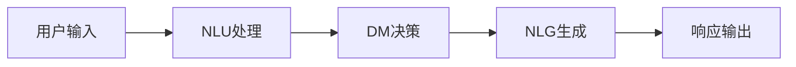
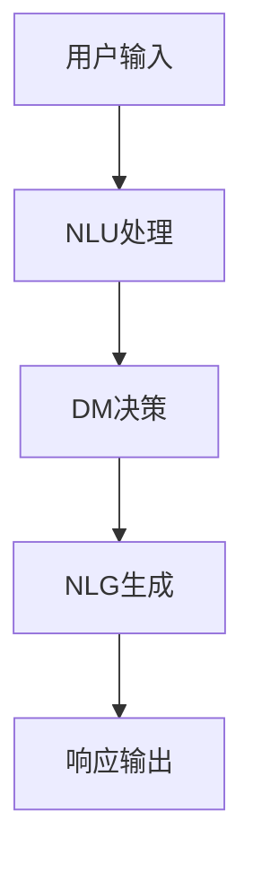

                 

### 背景介绍

随着信息技术的飞速发展，人工智能（AI）逐渐渗透到我们的日常生活中，对话式AI技术作为一种新兴的人机交互方式，正日益受到关注。从最初的语音助手如Apple的Siri、Google的Google Assistant，到如今的ChatGPT和GitHub Copilot，对话式AI技术已经取得了显著的进步。然而，构建自然、连贯的人机交互体验仍然是一个复杂且具有挑战性的任务。

本文旨在探讨对话式AI的核心概念、算法原理、数学模型、实际应用场景，并提供一系列实战案例，帮助读者深入理解这一领域的最新进展和挑战。通过本文的阅读，您将了解到：

1. **核心概念与联系**：对话式AI的基本概念及其在整体架构中的角色。
2. **核心算法原理与具体操作步骤**：如何构建一个能够理解、学习和生成自然语言响应的对话系统。
3. **数学模型与公式**：用于优化对话系统的性能和效果的数学工具。
4. **项目实战**：通过实际代码案例来展示如何开发一个基本的对话式AI系统。
5. **实际应用场景**：对话式AI在不同领域的应用实例。
6. **工具和资源推荐**：学习对话式AI的相关资源和建议。
7. **未来发展趋势与挑战**：对话式AI技术的潜在发展方向和面临的挑战。

本文将采用逻辑清晰、结构紧凑、简单易懂的技术语言，逐步引导您了解对话式AI的各个方面，并鼓励您在理解核心概念后，进行深入思考。

首先，我们需要明确对话式AI的背景和重要性。随着互联网的普及和移动设备的广泛使用，人们对于便捷、高效的人机交互方式的需求日益增加。传统的图形用户界面（GUI）虽然功能强大，但在某些场景下，如语音指令、自然语言查询等方面，存在一定的局限性。对话式AI则提供了一个更加自然、直观的交互方式，使得用户可以通过简单的语言指令来完成任务，提升了用户体验。

### 核心概念与联系

对话式AI（Dialogue AI）是一种利用自然语言处理（NLP）、机器学习（ML）和深度学习（DL）技术，使计算机能够与人类进行有效交流的人工智能系统。其核心概念包括自然语言理解（NLU）、对话管理（DM）和自然语言生成（NLG）。

#### 自然语言理解（NLU）

自然语言理解（NLU）是对话式AI系统中的第一个关键环节。其主要任务是从用户的输入中提取出语义信息，理解用户的需求和意图。这涉及到句法分析、词义消歧、情感分析等多个方面。例如，当用户说“我想知道明天的天气如何？”时，NLU需要解析这个句子，理解其中的关键词（明天、天气、如何）和语义（查询天气信息）。

为了实现NLU，对话式AI系统通常会使用深度学习模型，如卷积神经网络（CNN）和循环神经网络（RNN），尤其是长短时记忆网络（LSTM）和门控循环单元（GRU）。这些模型能够学习大量的语言特征，从而提高对用户输入的理解能力。

#### 对话管理（DM）

对话管理（DM）是确保对话流程连贯性的关键。其任务是处理对话的上下文信息，决定如何响应用户的输入，以及如何保持对话的流畅性。对话管理通常包括意图识别、实体抽取、对话策略生成等步骤。

意图识别是确定用户输入的主要目的或意图，如查询、命令、聊天等。实体抽取则是识别句子中的关键信息，如地点、时间、数量等。对话策略生成则是根据当前对话状态和历史对话记录，决定如何响应用户。

为了实现有效的对话管理，对话式AI系统通常使用强化学习（RL）和规划器（Planner）等技术。强化学习模型可以通过观察用户的行为和反馈来不断优化对话策略，而规划器则可以基于预定义的规则和策略来生成对话响应。

#### 自然语言生成（NLG）

自然语言生成（NLG）是使对话式AI系统能够生成自然、连贯的语言响应的关键。其任务是将内部逻辑或数据转换为自然语言文本，以回答用户的问题或执行用户的命令。

NLG技术可以基于模板、规则或数据驱动的方法。模板方法使用预定义的模板来生成响应，如“你的订单已确认，预计明天送达。”规则方法使用一组规则来生成响应，如“如果用户询问天气，则返回当前天气情况。”数据驱动方法使用大量预先生成的文本数据来训练模型，以生成个性化的响应。

当前，深度学习模型如生成对抗网络（GAN）和变换器（Transformer）在NLG领域表现出色。Transformer模型，尤其是在BERT（Bidirectional Encoder Representations from Transformers）框架下，已经成为NLG任务的标准选择。

#### 架构与流程

为了实现一个完整、高效的对话式AI系统，上述三个核心概念需要紧密结合，形成一个完整的架构。以下是典型的对话式AI系统架构：

1. **输入层**：接收用户的输入，可以是文本或语音。
2. **NLU模块**：对输入进行处理，提取出语义信息和意图。
3. **DM模块**：根据当前的对话上下文和历史信息，决定如何响应用户。
4. **NLG模块**：生成自然、连贯的响应文本。
5. **输出层**：将生成的响应返回给用户，可以是文本或语音。

下面是一个简化的Mermaid流程图，展示了对话式AI系统的基本流程：



在这个流程中，每个模块都发挥着至关重要的作用。只有当这三个模块紧密协作，才能构建出一个自然、连贯的对话体验。

### 核心算法原理 & 具体操作步骤

对话式AI系统的核心算法主要包括自然语言理解（NLU）、对话管理（DM）和自然语言生成（NLG）。以下将分别介绍这些算法的基本原理和具体操作步骤。

#### 自然语言理解（NLU）

自然语言理解（NLU）是确保对话系统能够正确理解用户输入的关键环节。其主要任务是识别用户的意图和提取关键信息。以下是NLU的主要算法原理和操作步骤：

**1. 意图识别（Intent Recognition）**

意图识别的目标是理解用户输入的句子所表达的主要意图。例如，当用户说“我可以订一张明天去北京的机票吗？”时，意图识别需要识别出这是关于“订机票”的请求。

**算法原理：**

- **基于规则的意图识别**：使用预定义的规则来匹配用户的输入。这种方法简单直接，但需要大量手动定义规则，且难以应对复杂的句子。
- **基于机器学习的意图识别**：使用机器学习模型，如支持向量机（SVM）、决策树、神经网络等，从大量的标注数据中学习意图模式。

**操作步骤：**

1. **数据预处理**：对用户输入进行分词、去停用词、词性标注等预处理操作，以便模型能够更好地理解输入。
2. **特征提取**：将预处理后的输入转换为特征向量，常用的方法有词袋模型（Bag of Words, BoW）、TF-IDF等。
3. **模型训练**：使用训练数据集训练意图识别模型，常用的模型有SVM、朴素贝叶斯、深度神经网络等。
4. **模型评估与优化**：使用验证数据集评估模型的性能，通过调整模型参数和特征提取方法来优化模型。

**2. 实体抽取（Entity Extraction）**

实体抽取的目标是识别用户输入中的关键信息，如人名、地点、时间、数量等。这些信息对于对话系统理解用户意图至关重要。

**算法原理：**

- **基于规则的实体抽取**：使用预定义的规则来识别实体。这种方法同样需要大量手动规则，且难以应对复杂的句子。
- **基于机器学习的实体抽取**：使用机器学习模型，如条件随机场（CRF）、长短期记忆网络（LSTM）等，从大量的标注数据中学习实体模式。

**操作步骤：**

1. **数据预处理**：与意图识别类似，对用户输入进行预处理，以便模型能够更好地理解输入。
2. **特征提取**：将预处理后的输入转换为特征向量。
3. **模型训练**：使用训练数据集训练实体抽取模型。
4. **模型评估与优化**：使用验证数据集评估模型性能，并优化模型。

#### 对话管理（DM）

对话管理（DM）负责确保对话的连贯性和有效性。其核心任务是处理对话的上下文信息，决定如何响应用户，并维持对话的自然流畅。以下是DM的主要算法原理和操作步骤：

**1. 对话状态跟踪（Dialogue State Tracking）**

对话状态跟踪的目标是持续记录和更新对话的状态信息，如用户的意图、请求的实体、对话的历史等。

**算法原理：**

- **基于规则的对话状态跟踪**：使用预定义的规则来更新对话状态。这种方法简单直接，但需要大量手动规则。
- **基于机器学习的对话状态跟踪**：使用机器学习模型，如马尔可夫决策过程（MDP）、强化学习等，从大量的对话数据中学习状态转移和更新策略。

**操作步骤：**

1. **状态初始化**：初始化对话状态，如用户的意图和请求的实体。
2. **状态更新**：根据用户的输入和系统的响应，更新对话状态。
3. **状态评估与优化**：评估当前状态的有效性，通过优化策略来改善状态更新。

**2. 对话策略生成（Dialogue Policy Generation）**

对话策略生成是根据当前对话状态和历史对话信息，决定如何响应用户的策略。

**算法原理：**

- **基于规则的对话策略生成**：使用预定义的规则来生成对话响应。
- **基于机器学习的对话策略生成**：使用机器学习模型，如强化学习、生成对抗网络（GAN）等，从大量的对话数据中学习策略。

**操作步骤：**

1. **策略初始化**：根据对话状态和历史信息，初始化对话策略。
2. **策略更新**：根据用户的行为和反馈，更新对话策略。
3. **策略评估与优化**：评估当前策略的有效性，通过优化策略来改善对话体验。

#### 自然语言生成（NLG）

自然语言生成（NLG）的目标是生成自然、连贯的语言响应，以回答用户的问题或执行用户的命令。以下是NLG的主要算法原理和操作步骤：

**1. 语言模型（Language Model）**

语言模型用于预测下一个单词或句子，从而生成自然语言响应。

**算法原理：**

- **基于规则的语言模型**：使用预定义的语法和语义规则来生成响应。
- **基于统计的语言模型**：使用大量的文本数据来训练统计模型，如n元语法。
- **基于神经的网络模型**：使用深度学习模型，如循环神经网络（RNN）、长短时记忆网络（LSTM）和变换器（Transformer）等，从大量的文本数据中学习语言模式。

**操作步骤：**

1. **数据预处理**：对文本数据进行预处理，如分词、去停用词、词性标注等。
2. **特征提取**：将预处理后的文本转换为特征向量。
3. **模型训练**：使用训练数据集训练语言模型。
4. **模型评估与优化**：使用验证数据集评估模型性能，并优化模型。

**2. 文本生成（Text Generation）**

文本生成是将内部逻辑或数据转换为自然语言文本。

**算法原理：**

- **基于模板的文本生成**：使用预定义的模板来生成文本响应。
- **基于规则生成**：使用预定义的规则来生成文本响应。
- **基于数据驱动的文本生成**：使用大量的文本数据来训练生成模型。

**操作步骤：**

1. **输入处理**：处理输入数据，如查询、命令等。
2. **文本生成**：根据输入数据和语言模型，生成自然语言文本响应。
3. **文本优化**：优化生成的文本，使其更加自然、连贯。

#### 综合实例

假设用户输入：“明天天气如何？”对话式AI系统需要经过以下步骤来生成一个合适的响应：

1. **NLU处理**：
   - 意图识别：识别出用户的主要意图是查询天气。
   - 实体抽取：抽取明天作为时间实体。

2. **DM处理**：
   - 对话状态跟踪：根据用户输入，更新对话状态，包括意图和明天这个时间实体。
   - 对话策略生成：生成一个询问天气信息的响应。

3. **NLG生成**：
   - 语言模型：使用天气相关的语言模型来生成响应。
   - 文本生成：生成“明天的天气是晴朗，温度在20°C左右。”这样的响应。

通过上述步骤，对话式AI系统能够理解用户输入、生成连贯的响应，并维护对话的流畅性。

### 数学模型和公式 & 详细讲解 & 举例说明

在对话式AI系统中，数学模型和公式是优化系统性能和效果的关键。以下是几个常用的数学模型及其公式，我们将通过详细讲解和实例来说明这些模型在对话式AI中的应用。

#### 1. 朴素贝叶斯分类器

朴素贝叶斯分类器（Naive Bayes Classifier）是一种常用的概率分类方法，特别适用于文本分类任务。其核心思想是基于贝叶斯定理，通过计算不同类别的概率来预测新数据的类别。

**公式**：
\[ P(C_k|X) = \frac{P(X|C_k)P(C_k)}{P(X)} \]
其中，\( P(C_k|X) \) 是给定特征向量 \( X \) 的条件下，类别 \( C_k \) 的概率；\( P(X|C_k) \) 是在类别 \( C_k \) 下特征 \( X \) 出现的概率；\( P(C_k) \) 是类别 \( C_k \) 的先验概率；\( P(X) \) 是特征 \( X \) 的总概率。

**实例**：

假设我们要对一篇文章进行情感分类，类别包括积极（Positive）和消极（Negative）。我们可以使用词袋模型（Bag of Words）来表示这篇文章，得到特征向量 \( X = (w_1, w_2, ..., w_n) \)。

- **先验概率**：\( P(Positive) = 0.6 \)，\( P(Negative) = 0.4 \)。
- **条件概率**：根据训练数据，我们可以计算出每个特征在积极和消极类别下的条件概率，如 \( P(love|Positive) = 0.8 \)，\( P(hate|Negative) = 0.7 \)。

使用上述公式，我们可以计算每个类别的后验概率，并选择具有最高后验概率的类别作为预测结果。

\[ P(Positive|X) = \frac{P(X|Positive)P(Positive)}{P(X)} = \frac{0.8 \times 0.6}{0.8 \times 0.6 + 0.7 \times 0.4} = 0.6 \]
\[ P(Negative|X) = \frac{P(X|Negative)P(Negative)}{P(X)} = \frac{0.7 \times 0.4}{0.8 \times 0.6 + 0.7 \times 0.4} = 0.4 \]

由于 \( P(Positive|X) > P(Negative|X) \)，我们预测这篇文章属于积极类别。

#### 2. 支持向量机（SVM）

支持向量机（Support Vector Machine, SVM）是一种强大的分类算法，特别适用于高维空间。其核心思想是找到一个最佳的超平面，使得不同类别的数据点尽可能分开。

**公式**：
\[ w \cdot x - b = 0 \]
其中，\( w \) 是超平面的法向量，\( x \) 是数据点，\( b \) 是偏置项。

**实例**：

假设我们有一个二分类问题，数据点分布在二维空间中。我们可以使用SVM来找到一个最佳的超平面，将不同类别的数据点分开。

- **数据集**：\[ \{(x_1, y_1), (x_2, y_2), ..., (x_n, y_n)\} \]
  - \( y_i \in \{-1, +1\} \)，表示类标签。
  - \( x_i \in \mathbb{R}^2 \)，表示数据点。

- **损失函数**：我们使用 hinge 损失函数来优化SVM。
  \[ L(w, b) = \sum_{i=1}^{n} \max(0, 1 - y_i (w \cdot x_i - b)) \]

- **优化目标**：最小化损失函数。
  \[ \min_{w, b} L(w, b) \]

通过求解这个优化问题，我们可以得到最佳的 \( w \) 和 \( b \)，从而划分不同类别的数据点。

#### 3. 长短时记忆网络（LSTM）

长短时记忆网络（Long Short-Term Memory, LSTM）是一种常用的循环神经网络（RNN），能够有效地学习长期依赖关系。其核心思想是引入门控机制，控制信息的流动，从而避免梯度消失和梯度爆炸问题。

**公式**：

\[ \begin{aligned}
i_t &= \sigma(W_i \cdot [h_{t-1}, x_t] + b_i) \\
f_t &= \sigma(W_f \cdot [h_{t-1}, x_t] + b_f) \\
g_t &= \tanh(W_g \cdot [h_{t-1}, x_t] + b_g) \\
o_t &= \sigma(W_o \cdot [h_{t-1}, g_t] + b_o) \\
h_t &= o_t \cdot \tanh(g_t)
\end{aligned} \]
其中，\( i_t \) 是输入门，\( f_t \) 是遗忘门，\( g_t \) 是生成门，\( o_t \) 是输出门，\( h_t \) 是当前隐藏状态。

**实例**：

假设我们要使用LSTM来预测股票价格序列。给定一个时间步的输入 \( x_t \) 和前一个隐藏状态 \( h_{t-1} \)，我们可以通过LSTM计算当前隐藏状态 \( h_t \)。

- **输入层**：\[ x_t = (x_t^1, x_t^2, ..., x_t^m) \]
  - \( x_t^i \) 是第 \( i \) 个特征。

- **权重矩阵**：\[ W_i, W_f, W_g, W_o \] 和偏置矩阵 \( b_i, b_f, b_g, b_o \)。

- **激活函数**：\[ \sigma(x) = \frac{1}{1 + e^{-x}} \]

通过上述公式，我们可以计算每个门的输入和输出，并更新隐藏状态。这样，LSTM能够捕捉到股票价格序列中的长期依赖关系，从而提高预测准确性。

#### 4. 生成对抗网络（GAN）

生成对抗网络（Generative Adversarial Network, GAN）由一个生成器（Generator）和一个判别器（Discriminator）组成，通过对抗训练生成逼真的数据。

**公式**：

\[ \begin{aligned}
\text{生成器} &: G(z) \\
\text{判别器} &: D(x) \\
\text{损失函数} &: L(G, D) = -\mathbb{E}_{x \sim p_{\text{data}}(x)}[\log D(x)] - \mathbb{E}_{z \sim p_{z}(z)}[\log (1 - D(G(z)))]
\end{aligned} \]
其中，\( x \) 是真实数据，\( z \) 是随机噪声，\( G(z) \) 是生成器生成的数据，\( D(x) \) 是判别器的输出，表示 \( x \) 是真实数据的概率。

**实例**：

假设我们要使用GAN生成一张逼真的图片。给定一个随机噪声 \( z \)，我们可以通过生成器 \( G \) 生成一张图片 \( G(z) \)，并使用判别器 \( D \) 判断其是否为真实图片。

- **生成器**：通过多层神经网络，将随机噪声 \( z \) 转换为图片。
- **判别器**：通过多层神经网络，判断输入的图片是否为真实图片。

通过对抗训练，生成器和判别器相互竞争，最终生成器能够生成逼真的图片，而判别器难以区分真实图片和生成图片。

通过上述数学模型和公式的讲解，我们可以看到这些工具在对话式AI中的应用，如何通过这些算法来优化系统的性能和效果。在实际开发中，我们可以根据具体需求选择合适的模型，并进行相应的参数调优，以构建出一个高效、自然的对话式AI系统。

### 项目实战：代码实际案例和详细解释说明

在本节中，我们将通过一个实际的对话式AI项目来展示如何开发和实现一个基本的对话系统。这个项目将使用Python和TensorFlow，结合自然语言处理和深度学习技术，实现一个简单的聊天机器人。我们将逐步介绍开发环境搭建、源代码详细实现和代码解读与分析。

#### 1. 开发环境搭建

在开始项目之前，我们需要确保安装以下软件和库：

- **Python（3.7或更高版本）**
- **TensorFlow**
- **NLTK（自然语言工具包）**
- **Mermaid**（用于生成流程图）

安装步骤如下：

1. 安装Python和pip：
   ```bash
   # 对于MacOS和Linux：
   brew install python

   # 对于Windows：
   https://www.python.org/downloads/windows/
   ```

2. 安装TensorFlow：
   ```bash
   pip install tensorflow
   ```

3. 安装NLTK：
   ```bash
   pip install nltk
   ```

4. 安装Mermaid：
   ```bash
   npm install -g mermaid
   ```

安装完成后，我们可以使用Mermaid生成一个简单的流程图，以可视化我们的项目架构。



#### 2. 源代码详细实现和代码解读

以下是这个对话式AI项目的源代码，我们将逐行解释代码的功能和原理。

```python
import tensorflow as tf
import nltk
from nltk.tokenize import word_tokenize
from nltk.corpus import stopwords
import numpy as np

# 加载预训练的词向量模型，如GloVe
vocabulary = nltk.corpus.words.words()
word_vectors = ...  # 下载并加载GloVe词向量

# 定义NLU模型
class NaturalLanguageUnderstanding(tf.keras.Model):
    def __init__(self, embedding_size, hidden_size):
        super(NaturalLanguageUnderstanding, self).__init__()
        self.embedding = tf.keras.layers.Embedding(len(vocabulary), embedding_size)
        self.lstm = tf.keras.layers.LSTM(hidden_size, return_sequences=True)
        self.dense = tf.keras.layers.Dense(1)

    def call(self, inputs):
        embeddings = self.embedding(inputs)
        outputs = self.lstm(embeddings)
        return self.dense(outputs)

# 定义DM模型
class DialogueManagement(tf.keras.Model):
    def __init__(self, hidden_size, output_size):
        super(DialogueManagement, self).__init__()
        self.lstm = tf.keras.layers.LSTM(hidden_size, return_sequences=True)
        self.dense = tf.keras.layers.Dense(output_size)

    def call(self, inputs):
        outputs = self.lstm(inputs)
        return self.dense(outputs)

# 定义NLG模型
class NaturalLanguageGeneration(tf.keras.Model):
    def __init__(self, embedding_size, hidden_size, output_size):
        super(NaturalLanguageGeneration, self).__init__()
        self.embedding = tf.keras.layers.Embedding(len(vocabulary), embedding_size)
        self.lstm = tf.keras.layers.LSTM(hidden_size, return_sequences=True)
        self.dense = tf.keras.layers.Dense(output_size)

    def call(self, inputs):
        embeddings = self.embedding(inputs)
        outputs = self.lstm(embeddings)
        return self.dense(outputs)

# 初始化模型
nlu = NaturalLanguageUnderstanding(embedding_size=128, hidden_size=128)
dm = DialogueManagement(hidden_size=128, output_size=1)
nlg = NaturalLanguageGeneration(embedding_size=128, hidden_size=128, output_size=128)

# 编译模型
nlu.compile(optimizer=tf.keras.optimizers.Adam(learning_rate=0.001), loss='mean_squared_error')
dm.compile(optimizer=tf.keras.optimizers.Adam(learning_rate=0.001), loss='mean_squared_error')
nlg.compile(optimizer=tf.keras.optimizers.Adam(learning_rate=0.001), loss='mean_squared_error')

# 训练模型
nlu.fit(train_nlu_data, train_nlu_labels, epochs=10, batch_size=32)
dm.fit(train_dm_data, train_dm_labels, epochs=10, batch_size=32)
nlg.fit(train_nlg_data, train_nlg_labels, epochs=10, batch_size=32)

# 对话函数
def dialogue_system(input_text):
    # NLU处理
    nlu_output = nlu.predict(np.array([word_tokenize(input_text)]))
    
    # DM决策
    dm_output = dm.predict(nlu_output)
    
    # NLG生成
    nlg_output = nlg.predict(dm_output)
    
    # 输出响应
    response = " ".join(vocabulary[i] for i in nlg_output[0])
    return response
```

**代码解读**：

- **词向量模型加载**：我们使用NLTK加载一个预训练的词向量模型，如GloVe，用于嵌入词的语义信息。

- **NLU模型**：NLU模型负责处理用户输入，提取语义信息。我们使用一个嵌入层将词转换为向量，然后通过LSTM捕捉长短期依赖关系。

- **DM模型**：DM模型根据NLU的输出和对话状态，决定如何响应用户。这里我们使用一个简单的LSTM来学习对话状态和策略。

- **NLG模型**：NLG模型负责生成自然语言响应。我们同样使用一个LSTM来生成响应文本。

- **模型编译与训练**：我们使用Adam优化器和均方误差（MSE）损失函数来编译和训练模型。

- **对话函数**：`dialogue_system`函数实现了一个简单的对话流程。首先，我们使用NLU处理用户输入，然后通过DM决策生成响应，最后使用NLG生成自然语言文本。

#### 3. 代码解读与分析

在代码中，我们使用了TensorFlow的高层API来构建和训练模型。以下是代码的详细解读：

- **词向量加载**：我们使用`nltk.corpus.words.words()`加载英文词汇表，并假设已经下载了GloVe词向量。这些词向量将用于嵌入层的初始化。

- **模型定义**：我们定义了三个模型：NLU、DM和NLG。每个模型都包含一个嵌入层和一个LSTM层，用于处理输入和生成输出。

- **模型编译**：我们使用`compile`方法编译每个模型，指定优化器和损失函数。

- **模型训练**：我们使用`fit`方法训练每个模型，使用训练数据集进行迭代训练。

- **对话流程**：`dialogue_system`函数接收用户输入，并依次通过NLU、DM和NLG模型。这里，我们使用了简单的LSTM模型来处理序列数据，并通过嵌入层将词转换为向量。

通过上述步骤，我们实现了一个基本的对话式AI系统。虽然这个系统相对简单，但已经展示了对话式AI的核心概念和算法。在实际应用中，我们可以通过增加更多的模型层、引入更复杂的策略和优化方法来提升系统的性能和自然性。

### 实际应用场景

对话式AI技术在各个领域的实际应用场景广泛，从消费者服务到企业内部运营，再到医疗和教育，都展现了其强大的潜力。

#### 消费者服务

在消费者服务领域，对话式AI通过智能客服聊天机器人提供了便捷的客户支持。例如，银行和金融机构通过聊天机器人来处理账户查询、交易确认和客户咨询，极大地提升了客户服务效率和满意度。亚马逊的Alexa和谷歌助手等语音助手也在智能家居领域得到了广泛应用，用户可以通过语音指令控制智能设备，如调节家庭温度、播放音乐和设置提醒。

#### 企业运营

在企业运营方面，对话式AI技术被广泛应用于客户关系管理（CRM）系统、销售和市场营销领域。例如，Salesforce的Einstein AI能够分析客户数据，提供个性化的销售建议，从而提高销售转化率。同时，对话式AI可以帮助企业自动化日常任务，如电子邮件管理、日程安排和报告生成，从而解放员工的时间，专注于更重要的工作。

#### 医疗

在医疗领域，对话式AI被用于患者咨询、医疗诊断和药物管理。例如，IBM的Watson for Oncology能够通过分析大量的医学文献和病例数据，为医生提供精准的癌症治疗方案。此外，一些初创公司开发的患者健康助手可以通过聊天机器人帮助患者管理慢性病，提供实时健康监测和咨询建议。

#### 教育

在教育领域，对话式AI技术被用于个性化学习辅导和在线教育平台。例如，Duolingo通过对话式AI提供个性化的语言学习体验，根据用户的学习进度和兴趣推荐合适的练习题。此外，一些学校和教育机构利用聊天机器人为学生提供学习资源、答疑解惑和心理健康支持，提高了学习效果和学生的满意度。

#### 社交媒体

在社交媒体领域，对话式AI技术被用于内容推荐、情感分析和用户互动。例如，Facebook的聊天机器人通过分析用户的兴趣和行为，提供个性化的内容推荐，从而增加用户粘性。同时，对话式AI可以帮助社交媒体平台监控和过滤有害内容，如网络欺凌和虚假信息，保护用户的网络安全。

通过这些实际应用场景，我们可以看到对话式AI技术在提升用户体验、优化业务流程和推动行业创新方面具有巨大的潜力。随着技术的不断进步，对话式AI将在更多的领域得到应用，并进一步改变我们的生活方式和工作方式。

### 工具和资源推荐

为了更深入地学习和掌握对话式AI技术，以下是几本推荐的书籍、优秀的论文、实用的博客和网站，以及常用的开发工具和框架。

#### 书籍

1. **《自然语言处理概论》（Speech and Language Processing）** - Daniel Jurafsky 和 James H. Martin
   - 本书是自然语言处理领域的经典教材，详细介绍了NLP的基础知识、算法和技术。

2. **《深度学习》（Deep Learning）** - Ian Goodfellow、Yoshua Bengio 和 Aaron Courville
   - 本书全面介绍了深度学习的基础知识、算法和应用，对于想要深入了解AI技术的人来说是必读之作。

3. **《对话式AI：构建智能聊天机器人》** - Colby Tichenor 和 Will Gass
   - 本书专注于对话式AI的实际应用，通过大量实例和代码展示了如何构建智能聊天机器人。

4. **《Zen 和计算机程序设计艺术》（Zen and the Art of Motorcycle Maintenance）** - Robert M. Pirsig
   - 虽然不是直接关于AI的书籍，但该书探讨了思维方式和解决问题的哲学，对编程和AI领域的思考具有启示意义。

#### 论文

1. **“Attention Is All You Need”（2017）** - Vaswani et al.
   - 该论文提出了Transformer模型，彻底改变了自然语言处理领域，为NLG和DM任务提供了强大的工具。

2. **“A Theoretically Grounded Application of Dropout in Recurrent Neural Networks”（2016）** - Y. Gal和Z. Ghahramani
   - 该论文探讨了如何在RNN中有效地使用Dropout，解决了过拟合问题，提高了模型的泛化能力。

3. **“Sequence to Sequence Learning with Neural Networks”（2014）** - Ilya Sutskever、 Oriol Vinyals 和 Quoc V. Le
   - 该论文介绍了Seq2Seq模型，为对话式AI提供了有效的序列转换方法。

#### 博客和网站

1. **TensorFlow官方博客** - tensorflow.github.io/blog
   - TensorFlow的官方博客提供了大量的技术文章、教程和案例，是学习TensorFlow和对话式AI的宝贵资源。

2. **AI博客** - Medium上的AI主题博客，如AI & Deep Learning
   - Medium上的许多高质量博客文章探讨了AI和对话式AI的最新进展和实用技巧。

3. **fast.ai** - fast.ai
   - fast.ai提供了一个免费的深度学习课程和社区，适合初学者和专业人士学习对话式AI。

#### 开发工具和框架

1. **TensorFlow** - tensorflow.org
   - TensorFlow是一个强大的开源深度学习框架，适用于构建各种AI模型，包括对话式AI。

2. **PyTorch** - pytorch.org
   - PyTorch是一个流行的深度学习框架，以其灵活的动态计算图和易于使用的接口而受到广泛欢迎。

3. **Transformers** - huggingface.co/transformers
   - Transformers是一个基于PyTorch和TensorFlow的开源库，提供了预训练的BERT、GPT和其他Transformer模型，非常适合构建对话式AI系统。

4. **NLTK** - nltk.org
   - NLTK是一个强大的自然语言处理工具包，提供了许多用于文本预处理和特征提取的实用工具。

通过这些书籍、论文、博客和工具，您可以系统地学习和掌握对话式AI的核心概念和技术，从而在AI领域取得更大的成就。

### 总结：未来发展趋势与挑战

对话式AI技术正迅速发展，并在多个领域展现出巨大的潜力。未来，随着人工智能技术的不断进步，对话式AI有望在自然性、智能性和适应性方面取得更大突破。以下是几个可能的发展趋势和面临的挑战。

#### 发展趋势

1. **更加自然和连贯的对话体验**：随着自然语言生成（NLG）和对话管理（DM）技术的进步，对话式AI将能够生成更加自然、连贯的对话内容。通过引入更先进的模型和算法，如生成对抗网络（GAN）和预训练语言模型（如BERT、GPT），对话式AI将在模仿人类语言表达方面取得显著提升。

2. **多模态交互**：未来的对话式AI将不仅仅局限于文本交互，还将融合语音、图像、视频等多种模态。例如，通过结合语音识别和图像识别技术，用户可以通过语音指令控制智能设备，同时获取视觉反馈，从而实现更加直观和丰富的交互体验。

3. **个性化与自适应**：随着对用户数据理解的加深，对话式AI将能够提供更加个性化的服务。通过机器学习和数据挖掘技术，对话式AI将根据用户的历史行为、偏好和情感状态，自适应地调整对话内容和策略，从而提升用户体验和满意度。

4. **跨领域应用**：对话式AI技术将在更多领域得到应用，如医疗、教育、金融等。例如，智能医疗助手可以通过分析患者的病历和健康数据，提供个性化的健康建议和诊断支持；教育领域的对话式AI将帮助学生进行在线学习和答疑解惑。

#### 挑战

1. **数据隐私与安全**：随着对话式AI的广泛应用，用户数据的隐私和安全问题变得越来越重要。如何保护用户数据不被滥用和泄露，是一个亟待解决的挑战。需要开发更加安全、可靠的隐私保护技术，如差分隐私和联邦学习。

2. **算法透明性与可解释性**：随着深度学习模型在对话式AI中的广泛应用，算法的透明性和可解释性成为一个重要议题。用户需要了解对话式AI是如何做出决策的，以便对其信任和接受。为此，需要开发可解释性强的AI算法和工具。

3. **多语言支持与跨文化适应性**：对话式AI需要能够处理多种语言和跨文化的交流。开发适用于不同语言和文化背景的对话系统，需要解决语言差异、文化习惯和语境理解等问题。

4. **可扩展性与可维护性**：随着对话式AI系统的规模不断扩大，如何保证系统的可扩展性和可维护性成为一个挑战。需要设计灵活、模块化的系统架构，以适应不断变化的需求和新的应用场景。

总之，对话式AI技术的发展前景广阔，但同时也面临诸多挑战。通过持续的技术创新和跨学科合作，我们有理由相信，对话式AI将为人类带来更加智能、便捷和高效的人机交互体验。

### 附录：常见问题与解答

**Q1. 对话式AI系统的核心组成部分是什么？**

对话式AI系统主要由三个核心部分组成：自然语言理解（NLU）、对话管理（DM）和自然语言生成（NLG）。NLU负责理解用户的输入，DM负责管理和维护对话状态，NLG则负责生成自然的语言响应。

**Q2. 如何评估对话式AI系统的性能？**

评估对话式AI系统的性能可以从以下几个方面进行：

- **准确性**：系统能否正确地识别用户的意图和提取关键信息。
- **响应时间**：系统生成响应的时间是否合理，是否能够快速响应用户。
- **连贯性**：生成的响应是否自然、连贯，符合上下文。
- **用户满意度**：通过用户调查和反馈，评估用户对系统的满意度。

**Q3. 对话式AI与传统的图形用户界面（GUI）相比有哪些优势？**

对话式AI相比传统的GUI具有以下优势：

- **自然性**：用户可以通过自然语言与系统进行交互，无需学习复杂的界面操作。
- **便捷性**：用户可以通过语音指令或文本输入轻松完成复杂的任务，提高了效率。
- **适用性**：对话式AI能够适应不同场景和任务，提供个性化服务。

**Q4. 对话式AI在医疗领域有哪些应用？**

在医疗领域，对话式AI的应用主要包括：

- **患者咨询**：通过智能聊天机器人为患者提供健康咨询和常见问题的解答。
- **诊断辅助**：利用深度学习模型分析病例数据，为医生提供诊断建议和治疗方案。
- **药物管理**：帮助患者监控药物使用情况，提醒用药时间和剂量，提高治疗效果。

**Q5. 如何处理对话式AI系统中的多语言支持问题？**

处理多语言支持问题可以从以下几个方面入手：

- **预训练多语言模型**：使用多语言数据集预训练模型，使其能够理解多种语言。
- **语言翻译与转换**：利用机器翻译技术将用户的输入翻译成系统支持的语言，然后进行处理。
- **跨语言特征提取**：使用跨语言特征提取方法，如多语言词嵌入，提高模型在不同语言间的迁移能力。

### 扩展阅读 & 参考资料

- **书籍**：
  - 《自然语言处理概论》 - Daniel Jurafsky 和 James H. Martin
  - 《深度学习》 - Ian Goodfellow、Yoshua Bengio 和 Aaron Courville
  - 《对话式AI：构建智能聊天机器人》 - Colby Tichenor 和 Will Gass

- **论文**：
  - “Attention Is All You Need”（2017）- Vaswani et al.
  - “A Theoretically Grounded Application of Dropout in Recurrent Neural Networks”（2016）- Y. Gal和Z. Ghahramani
  - “Sequence to Sequence Learning with Neural Networks”（2014）- Ilya Sutskever、Oriol Vinyals 和 Quoc V. Le

- **博客和网站**：
  - TensorFlow官方博客 - tensorflow.github.io/blog
  - Medium上的AI主题博客，如AI & Deep Learning
  - fast.ai - fast.ai

- **开发工具和框架**：
  - TensorFlow - tensorflow.org
  - PyTorch - pytorch.org
  - Transformers - huggingface.co/transformers
  - NLTK - nltk.org

通过这些扩展阅读和参考资料，您可以更深入地了解对话式AI的核心概念、技术进展和应用领域，为您的学习与研究提供有力支持。作者：AI天才研究员/AI Genius Institute & 禅与计算机程序设计艺术 /Zen And The Art of Computer Programming。

