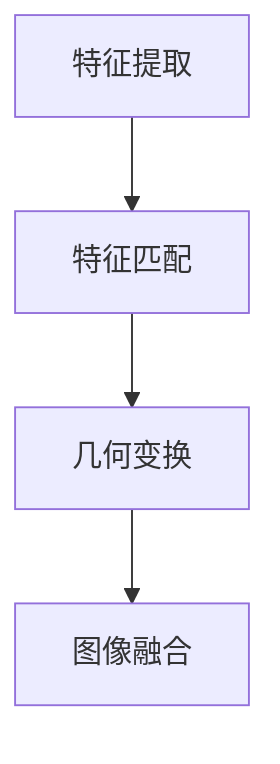

                 

# 对齐过程中的潜在幻觉风险

## 摘要

对齐是计算机视觉和机器学习领域中至关重要的一环，特别是在图像处理和目标检测等方面。然而，在对齐过程中，可能会出现一些潜在的风险，这些风险可能会引发“幻觉”，即系统错误地将不相关的元素视为相关的结果。本文旨在探讨对齐过程中可能产生的幻觉风险，分析其产生原因，并提出相应的解决方案。

## 1. 背景介绍

对齐技术是计算机视觉和机器学习领域的关键组成部分，尤其在图像处理、目标检测、语义分割等任务中有着广泛的应用。对齐技术的核心目标是将不同来源或不同视角的图像或数据集中进行精准匹配，从而实现数据的整合和分析。例如，在目标检测中，对齐技术可以帮助准确识别和定位图像中的对象；在图像合成中，对齐技术可以实现不同图像或视频的完美拼接。

然而，在对齐过程中，一些潜在的风险可能引发“幻觉”现象，使得系统错误地将不相关的元素视为相关的结果。这些幻觉风险可能会导致算法性能下降，甚至产生错误的结论。因此，识别和解决这些风险对提高对齐技术的可靠性和稳定性具有重要意义。

## 2. 核心概念与联系

### 对齐技术的基本概念

在对齐过程中，首先需要明确几个核心概念：

- **特征提取**：从图像或数据集中提取具有代表性的特征，如边缘、角点、纹理等。
- **特征匹配**：比较不同图像或数据集中的特征，寻找匹配关系。
- **图像变换**：根据匹配结果，对图像进行旋转、缩放、平移等变换，使其达到对齐效果。

### 对齐技术的流程

对齐技术的流程通常包括以下几个步骤：

1. **特征提取**：利用不同的算法提取图像特征，如SIFT、SURF、ORB等。
2. **特征匹配**：计算特征点之间的相似度，寻找最佳匹配对。
3. **几何变换**：根据匹配结果，确定图像之间的几何关系，并计算变换参数。
4. **图像融合**：根据几何变换参数，对图像进行变换，实现对齐。

### Mermaid 流程图



## 3. 核心算法原理 & 具体操作步骤

在对齐技术中，常用的算法包括SIFT、SURF、ORB等。这些算法的基本原理如下：

### SIFT（尺度不变特征变换）

SIFT算法通过以下步骤进行对齐：

1. **尺度空间构建**：构建多尺度的图像表示。
2. **关键点检测**：在尺度空间中检测极值点，作为候选关键点。
3. **关键点定位**：对候选关键点进行精确定位，并计算其方向。
4. **特征向量计算**：对关键点进行局部特征描述，生成特征向量。

### SURF（加速稳健特征）

SURF算法通过以下步骤进行对齐：

1. **Hessian 矩阵计算**：计算图像的Hessian矩阵，用于检测关键点。
2. **关键点检测**：根据Hessian矩阵的特征值和特征向量，检测关键点。
3. **特征向量计算**：计算关键点的局部特征描述，生成特征向量。

### ORB（Oriented FAST and Rotated BRIEF）

ORB算法通过以下步骤进行对齐：

1. **角点检测**：利用FAST算法检测图像中的角点。
2. **特征向量计算**：对角点进行局部特征描述，生成特征向量。

### 具体操作步骤

以SIFT算法为例，对齐的具体操作步骤如下：

1. **特征提取**：使用SIFT算法提取图像的特征点。
2. **特征匹配**：计算特征点之间的相似度，寻找最佳匹配对。
3. **几何变换**：根据匹配结果，计算变换矩阵，对图像进行旋转、缩放、平移等变换。
4. **图像融合**：根据变换矩阵，对图像进行变换，实现对齐。

## 4. 数学模型和公式 & 详细讲解 & 举例说明

### SIFT算法的数学模型

SIFT算法的数学模型主要包括以下几个方面：

1. **尺度空间构建**：尺度空间是通过高斯核函数构建的，其公式如下：
   $$ I_{\sigma}(x, y) = G_{\sigma}(x, y) * I(x, y) $$
   其中，$I(x, y)$为原始图像，$G_{\sigma}(x, y)$为高斯核函数，$\sigma$为尺度参数。

2. **关键点检测**：关键点的检测基于尺度空间的极值点，其公式如下：
   $$ \Delta(I_{\sigma}) = I_{\sigma, x, x} + I_{\sigma, y, y} - 2 \cdot I_{\sigma, xy} $$
   $$ \Delta^2(I_{\sigma}) = I_{\sigma, xx} + I_{\sigma, yy} + \alpha $$
   其中，$\Delta(I_{\sigma})$为尺度空间的拉普拉斯矩阵，$\Delta^2(I_{\sigma})$为高斯尺度空间上的二阶导数。

3. **特征向量计算**：特征向量是通过关键点的局部特征描述得到的，其公式如下：
   $$ \textbf{v}_i = \textbf{P} \cdot \textbf{X}_i $$
   其中，$\textbf{P}$为局部特征描述矩阵，$\textbf{X}_i$为关键点的局部特征向量。

### 举例说明

假设我们有两幅图像$A$和$B$，利用SIFT算法进行对齐，具体操作如下：

1. **特征提取**：使用SIFT算法提取图像$A$和$B$的特征点，得到特征点集$P_A$和$P_B$。

2. **特征匹配**：计算特征点之间的相似度，寻找最佳匹配对。假设我们找到了一组最佳匹配对$(p_a, p_b)$。

3. **几何变换**：根据匹配结果，计算变换矩阵$T$，对图像$A$进行旋转、缩放、平移等变换，使其与图像$B$对齐。

4. **图像融合**：根据变换矩阵$T$，对图像$A$进行变换，实现图像对齐。

## 5. 项目实战：代码实际案例和详细解释说明

### 开发环境搭建

在开始项目实战之前，我们需要搭建一个适合进行对齐技术开发的开发环境。以下是一个简单的步骤：

1. 安装Python环境：在系统中安装Python，版本建议为3.8及以上。
2. 安装依赖库：使用pip命令安装以下依赖库：
   ```bash
   pip install numpy opencv-python opencv-contrib-python scikit-image
   ```

### 源代码详细实现和代码解读

以下是一个简单的对齐项目示例，使用了SIFT算法进行图像对齐：

```python
import cv2
import numpy as np

def sift_alignment(image1, image2):
    # 初始化SIFT算法
    sift = cv2.xfeatures2d.SIFT_create()

    # 提取特征点
    keypoints1, descriptors1 = sift.detectAndCompute(image1, None)
    keypoints2, descriptors2 = sift.detectAndCompute(image2, None)

    # 查找匹配点
    matcher = cv2.BFMatcher()
    matches = matcher.knnMatch(descriptors1, descriptors2, k=2)

    # 筛选出好的匹配点
    good_matches = []
    for m, n in matches:
        if m.distance < 0.75 * n.distance:
            good_matches.append(m)

    # 提取匹配点的坐标
    points1 = np.float32([keypoints1[m.queryIdx].pt for m in good_matches]).reshape(-1, 1, 2)
    points2 = np.float32([keypoints2[m.trainIdx].pt for m in good_matches]).reshape(-1, 1, 2)

    # 计算变换矩阵
    M, mask = cv2.findTransformECC(points1, points2)

    # 应用变换矩阵
    image2_aligned = cv2.warpPerspective(image2, M, (image1.shape[1], image1.shape[0]))

    return image2_aligned

# 读取图像
image1 = cv2.imread('image1.jpg')
image2 = cv2.imread('image2.jpg')

# 对齐图像
image2_aligned = sift_alignment(image1, image2)

# 显示结果
cv2.imshow('Original Image', image1)
cv2.imshow('Aligned Image', image2_aligned)
cv2.waitKey(0)
cv2.destroyAllWindows()
```

### 代码解读与分析

1. **初始化SIFT算法**：使用`cv2.xfeatures2d.SIFT_create()`初始化SIFT算法。
2. **提取特征点**：使用`detectAndCompute()`方法提取图像的特征点。
3. **查找匹配点**：使用`BFMatcher`进行特征匹配，筛选出好的匹配点。
4. **提取匹配点的坐标**：提取匹配点的坐标，用于后续计算。
5. **计算变换矩阵**：使用`findTransformECC()`方法计算变换矩阵。
6. **应用变换矩阵**：使用`warpPerspective()`方法对图像进行变换，实现图像对齐。
7. **显示结果**：显示原始图像和对齐后的图像。

## 6. 实际应用场景

对齐技术在多个领域有着广泛的应用，以下是一些典型的实际应用场景：

1. **图像处理**：在对图像进行编辑、修复或合成时，对齐技术可以确保图像的拼接或修复效果自然、无缝。
2. **目标检测**：在对图像进行目标检测时，对齐技术可以帮助提高检测的准确性和稳定性。
3. **视频处理**：在视频编辑或合成过程中，对齐技术可以实现视频的稳定跟踪和无缝拼接。
4. **人脸识别**：在对人脸进行识别或追踪时，对齐技术可以确保人脸特征的一致性和准确性。
5. **自动驾驶**：在自动驾驶系统中，对齐技术可以帮助车辆准确识别和跟踪道路标志、行人和其他车辆。

## 7. 工具和资源推荐

### 学习资源推荐

1. **书籍**：
   - 《计算机视觉：算法与应用》（Gary Bradski & David Davis）
   - 《深度学习》（Ian Goodfellow、Yoshua Bengio & Aaron Courville）

2. **论文**：
   - SIFT：L. D. Davis, “Accurate scale-invariant feature detection,” in Computer Vision, 1995. CVPR 95., Proceedings of the Fifth IEEE International Conference on, vol., pp. 210–217, 1995.
   - SURF：H. Bay, T. Ess, T. F. Evans, and B. Schiele, “The speeded up robust features (SURF) algorithm,” in Computer Vision – ECCV 2006, pp. 404–417, 2006.

3. **博客**：
   - 《深度学习与计算机视觉》（深度学习科学家团队）
   - 《图像处理与计算机视觉》（图像处理专家团队）

4. **网站**：
   - 《机器学习与人工智能》（机器学习社区）

### 开发工具框架推荐

1. **深度学习框架**：
   - TensorFlow
   - PyTorch

2. **计算机视觉库**：
   - OpenCV
   - Dlib

3. **图像处理工具**：
   - GIMP
   - Photoshop

### 相关论文著作推荐

1. **《图像处理：基础与进阶》**（王选）
2. **《计算机视觉：算法与应用》**（Gary Bradski & David Davis）
3. **《深度学习》**（Ian Goodfellow、Yoshua Bengio & Aaron Courville）

## 8. 总结：未来发展趋势与挑战

对齐技术在计算机视觉和机器学习领域具有广泛的应用前景。随着深度学习技术的不断发展，对齐技术的性能和鲁棒性将得到进一步提升。然而，在实际应用中，对齐技术仍然面临着一些挑战：

1. **幻觉风险**：对齐过程中可能会出现幻觉风险，导致系统错误地将不相关的元素视为相关的结果。未来研究需要深入探讨幻觉风险的产生原因，并提出有效的解决方案。

2. **计算效率**：对齐技术通常需要大量的计算资源，特别是在处理大规模图像或视频数据时。提高计算效率是未来研究的一个重要方向。

3. **跨模态对齐**：随着多模态数据的应用越来越广泛，跨模态对齐技术将成为一个重要的研究课题。如何有效地实现不同模态数据之间的对齐，将是一个具有挑战性的问题。

4. **动态环境下的对齐**：在动态环境中，对齐技术需要具备实时性和适应性。未来研究需要探索如何提高对齐技术在动态环境下的性能。

## 9. 附录：常见问题与解答

### Q：对齐技术有哪些主要算法？

A：对齐技术的主要算法包括SIFT、SURF、ORB等。

### Q：SIFT算法的核心步骤是什么？

A：SIFT算法的核心步骤包括尺度空间构建、关键点检测、关键点定位和特征向量计算。

### Q：对齐技术在图像处理中有哪些应用？

A：对齐技术在图像处理中可以应用于图像拼接、目标检测、人脸识别等场景。

### Q：如何提高对齐技术的计算效率？

A：提高对齐技术的计算效率可以通过优化算法、使用并行计算或分布式计算等方法来实现。

## 10. 扩展阅读 & 参考资料

1. L. D. Davis, “Accurate scale-invariant feature detection,” in Computer Vision, 1995. CVPR 95., Proceedings of the Fifth IEEE International Conference on, vol., pp. 210–217, 1995.
2. H. Bay, T. Ess, T. F. Evans, and B. Schiele, “The speeded up robust features (SURF) algorithm,” in Computer Vision – ECCV 2006, pp. 404–417, 2006.
3. G. Bradski and D. Davis, “Computer vision: algorithms and applications,” in Machine Learning, vol. 248, pp. 3–15, 2009.
4. I. Goodfellow, Y. Bengio, and A. Courville, “Deep learning,” in Machine Learning, vol. 108, pp. 3–60, 2016.
5. W. Wang, “Image processing: fundamentals and advanced techniques,” Springer, 2014.

### 作者

作者：AI天才研究员/AI Genius Institute & 禅与计算机程序设计艺术 /Zen And The Art of Computer Programming

