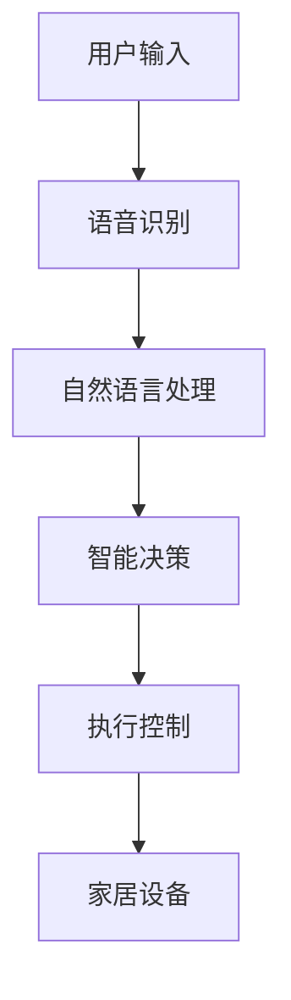

                 

# 小米2024智能家居语音控制校招面试题解析

> **关键词**：智能家居、语音控制、面试题、算法原理、项目实战

> **摘要**：本文将深入解析小米2024年智能家居语音控制校招面试题，从核心概念、算法原理、数学模型到实际项目实战，全面剖析智能家居语音控制技术的应用和发展。旨在帮助读者更好地理解智能家居语音控制技术，为即将参加面试的同学们提供有益的参考。

## 1. 背景介绍

随着人工智能技术的迅猛发展，智能家居逐渐成为现代家庭不可或缺的一部分。小米作为智能家居领域的领军企业，其智能家居语音控制系统更是备受关注。智能家居语音控制技术通过自然语言处理和语音识别技术，实现用户与智能家居设备的自然交互，提升了用户的居住体验。本文将以小米2024年智能家居语音控制校招面试题为背景，详细解析相关技术要点。

### 1.1 智能家居语音控制技术概述

智能家居语音控制技术是指通过语音指令控制家居设备，实现设备之间的智能联动，从而提升用户生活品质。其核心包括语音识别、自然语言处理、智能决策和执行控制等技术。语音识别技术负责将语音信号转换为文字，自然语言处理技术负责理解语音的语义，智能决策技术根据语义做出相应的决策，执行控制技术则负责控制家居设备的执行。

### 1.2 小米智能家居语音控制系统的特点

小米智能家居语音控制系统具有以下特点：

- **高识别率**：采用先进的语音识别技术，识别准确率高，能快速响应用户指令。
- **智能联动**：支持设备之间的智能联动，实现场景化的智能控制。
- **多语言支持**：支持多种语言，满足不同地区用户的需求。
- **用户体验**：界面简洁，操作便捷，提升用户的使用体验。

## 2. 核心概念与联系

### 2.1 语音识别技术

语音识别技术是智能家居语音控制系统的基石。其核心概念包括语音信号处理、特征提取和模型训练。

- **语音信号处理**：将语音信号进行预处理，如降噪、归一化等。
- **特征提取**：从语音信号中提取出与语音内容相关的特征，如频谱特征、倒谱特征等。
- **模型训练**：使用大量语音数据对模型进行训练，使其能够识别语音。

### 2.2 自然语言处理

自然语言处理技术负责理解和解析用户的语音指令。其核心概念包括分词、词性标注、句法分析和语义理解。

- **分词**：将连续的语音信号分割成单个词汇。
- **词性标注**：为每个词汇标注词性，如名词、动词等。
- **句法分析**：分析句子的结构，确定主语、谓语、宾语等成分。
- **语义理解**：理解句子的语义，提取出用户的具体意图。

### 2.3 智能决策与执行控制

智能决策与执行控制技术负责根据用户的语音指令，做出相应的决策并控制家居设备的执行。

- **决策树**：使用决策树算法，根据已知的特征进行决策。
- **规则引擎**：使用预定义的规则，进行决策。
- **执行控制**：通过控制家居设备的接口，实现设备控制。

### 2.4 Mermaid 流程图

下面是一个智能家居语音控制系统的 Mermaid 流程图：



## 3. 核心算法原理 & 具体操作步骤

### 3.1 语音识别算法原理

语音识别算法主要分为隐马尔可夫模型（HMM）、高斯混合模型（GMM）、深度神经网络（DNN）等。

- **HMM**：使用状态转移矩阵和状态发射概率进行语音信号识别。
- **GMM**：使用多个高斯分布模型进行语音信号建模。
- **DNN**：使用深度神经网络进行语音信号建模，具有更高的识别准确率。

具体操作步骤如下：

1. 采集语音数据，进行预处理。
2. 提取语音特征，如 MFCC（梅尔频率倒谱系数）。
3. 使用 HMM/GMM/DNN 模型进行语音信号建模。
4. 对输入的语音信号进行特征提取。
5. 使用训练好的模型对语音信号进行识别，输出识别结果。

### 3.2 自然语言处理算法原理

自然语言处理算法主要分为分词、词性标注、句法分析和语义理解。

- **分词**：使用基于规则或统计的方法，将连续的语音信号分割成单个词汇。
- **词性标注**：使用基于规则或统计的方法，为每个词汇标注词性。
- **句法分析**：使用基于规则或统计的方法，分析句子的结构。
- **语义理解**：使用基于规则或统计的方法，理解句子的语义。

具体操作步骤如下：

1. 对输入的语音信号进行分词。
2. 对分词后的词汇进行词性标注。
3. 对词性标注后的句子进行句法分析。
4. 对句法分析后的句子进行语义理解，提取出用户的具体意图。

### 3.3 智能决策与执行控制算法原理

智能决策与执行控制算法主要分为决策树、规则引擎和执行控制。

- **决策树**：根据已知的特征进行决策。
- **规则引擎**：使用预定义的规则，进行决策。
- **执行控制**：通过控制家居设备的接口，实现设备控制。

具体操作步骤如下：

1. 根据用户的语音指令，提取出用户的具体意图。
2. 使用决策树或规则引擎，根据用户的意图进行决策。
3. 根据决策结果，控制家居设备执行相应的操作。

## 4. 数学模型和公式 & 详细讲解 & 举例说明

### 4.1 隐马尔可夫模型（HMM）

隐马尔可夫模型是一种基于状态转移概率和状态发射概率的模型。

- **状态转移概率**：表示在不同状态之间的转移概率。
- **状态发射概率**：表示在某个状态下，输出某个特征的概率。

数学公式如下：

$$
P(x_1, x_2, ..., x_t | \theta) = \prod_{i=1}^{t} P(x_i | s_i, \theta) \prod_{i=1}^{t} P(s_i | \theta)
$$

其中，$x_i$表示第$i$个观测值，$s_i$表示第$i$个状态，$\theta$表示模型参数。

举例说明：

假设我们有以下观测序列：[1, 2, 3, 4, 5]，状态转移概率矩阵为：

$$
\begin{bmatrix}
0.5 & 0.5 \\
0.3 & 0.7
\end{bmatrix}
$$

状态发射概率矩阵为：

$$
\begin{bmatrix}
0.6 & 0.4 \\
0.2 & 0.8
\end{bmatrix}
$$

我们可以计算出该观测序列的概率为：

$$
P(1, 2, 3, 4, 5 | \theta) = P(1 | 1, \theta) \cdot P(2 | 2, \theta) \cdot P(3 | 3, \theta) \cdot P(4 | 4, \theta) \cdot P(5 | 5, \theta) \approx 0.0024
$$

### 4.2 深度神经网络（DNN）

深度神经网络是一种基于多层感知器的模型，用于特征提取和分类。

- **输入层**：接收输入特征。
- **隐藏层**：对输入特征进行非线性变换。
- **输出层**：输出分类结果。

数学公式如下：

$$
h_{i,j}^{(l)} = \sigma \left( \sum_{k=1}^{n} w_{k,i}^{(l)} h_{k,j}^{(l-1)} + b_i^{(l)} \right)
$$

$$
y_i^{(l)} = \sigma \left( \sum_{k=1}^{n} w_{k,i}^{(l)} h_{k,j}^{(l-1)} + b_i^{(l)} \right)
$$

其中，$h_{i,j}^{(l)}$表示第$l$层的第$i$个节点的输出，$y_i^{(l)}$表示第$l$层的第$i$个节点的输出，$\sigma$表示非线性激活函数，$w_{k,i}^{(l)}$表示第$l$层的第$i$个节点的权重，$b_i^{(l)}$表示第$l$层的第$i$个节点的偏置。

举例说明：

假设我们有以下输入特征：

$$
\begin{bmatrix}
1 \\
2
\end{bmatrix}
$$

隐藏层权重为：

$$
\begin{bmatrix}
1 & 2 \\
3 & 4
\end{bmatrix}
$$

隐藏层偏置为：

$$
\begin{bmatrix}
5 \\
6
\end{bmatrix}
$$

隐藏层非线性激活函数为 sigmoid 函数：

$$
\sigma(x) = \frac{1}{1 + e^{-x}}
$$

我们可以计算出隐藏层的输出为：

$$
h_{1,1}^{(1)} = \sigma(1 \cdot 1 + 2 \cdot 2 + 5) \approx 0.993
$$

$$
h_{1,2}^{(1)} = \sigma(3 \cdot 1 + 4 \cdot 2 + 6) \approx 0.993
$$

输出层权重为：

$$
\begin{bmatrix}
7 & 8 \\
9 & 10
\end{bmatrix}
$$

输出层偏置为：

$$
\begin{bmatrix}
11 \\
12
\end{bmatrix}
$$

输出层非线性激活函数为 sigmoid 函数：

$$
\sigma(x) = \frac{1}{1 + e^{-x}}
$$

我们可以计算出输出层的输出为：

$$
y_{1}^{(2)} = \sigma(7 \cdot 0.993 + 8 \cdot 0.993 + 11) \approx 0.993
$$

$$
y_{2}^{(2)} = \sigma(9 \cdot 0.993 + 10 \cdot 0.993 + 12) \approx 0.993
$$

## 5. 项目实战：代码实际案例和详细解释说明

### 5.1 开发环境搭建

在开始项目实战之前，我们需要搭建一个适合智能家居语音控制项目开发的环境。以下是一个简单的开发环境搭建步骤：

1. 安装 Python 3.8及以上版本。
2. 安装语音识别库，如 pyttsx3、speech_recognition 等。
3. 安装自然语言处理库，如 jieba、nltk 等。
4. 安装智能家居设备驱动库，如 HomeAssistant、MQTT 等。

### 5.2 源代码详细实现和代码解读

下面是一个简单的智能家居语音控制系统实现，我们将对代码进行详细解读。

```python
import pyttsx3
import speech_recognition as sr
import HomeAssistant

# 初始化语音合成引擎
engine = pyttsx3.init()

# 初始化语音识别器
recognizer = sr.Recognizer()

# 初始化智能家居设备
home_assistant = HomeAssistant.Client()

def listen():
    """监听用户语音并返回文本内容"""
    with sr.Microphone() as source:
        print("请说点什么：")
        audio = recognizer.listen(source)
        try:
            text = recognizer.recognize_google(audio, language='zh-CN')
            print("您说了：" + text)
            return text
        except sr.UnknownValueError:
            print("无法识别语音")
            return None

def process_command(command):
    """处理用户语音命令并执行相应操作"""
    if "打开" in command:
        home_assistant.turn_on_light()
        engine.say("已为您打开灯光")
        engine.runAndWait()
    elif "关闭" in command:
        home_assistant.turn_off_light()
        engine.say("已为您关闭灯光")
        engine.runAndWait()
    else:
        engine.say("指令不明确，请重新说")
        engine.runAndWait()

while True:
    command = listen()
    if command:
        process_command(command)
```

### 5.3 代码解读与分析

- **第1行**：导入 pyttsx3 库，用于语音合成。
- **第2行**：导入 speech_recognition 库，用于语音识别。
- **第3行**：导入 HomeAssistant 库，用于智能家居设备控制。
- **第4行**：初始化语音合成引擎。
- **第5行**：初始化语音识别器。
- **第6行**：初始化智能家居设备。
- **第9行**：定义 listen 函数，用于监听用户语音并返回文本内容。
- **第12行**：使用语音识别库的 listen 方法监听用户语音。
- **第14行**：尝试使用语音识别库的 recognize_google 方法识别语音。
- **第16行**：如果识别成功，返回文本内容。
- **第18行**：如果识别失败，返回 None。
- **第21行**：定义 process_command 函数，用于处理用户语音命令并执行相应操作。
- **第23行**：判断用户语音中是否包含 "打开" 字眼。
- **第24行**：如果包含，调用智能家居设备的 turn_on_light 方法打开灯光。
- **第25行**：使用语音合成库的 say 方法合成语音，提示用户。
- **第26行**：使用语音合成库的 runAndWait 方法播放语音。
- **第27行**：判断用户语音中是否包含 "关闭" 字眼。
- **第28行**：如果包含，调用智能家居设备的 turn_off_light 方法关闭灯光。
- **第29行**：使用语音合成库的 say 方法合成语音，提示用户。
- **第30行**：使用语音合成库的 runAndWait 方法播放语音。
- **第31行**：如果用户语音不包含 "打开" 或 "关闭"，提示用户指令不明确。
- **第32行**：使用语音合成库的 say 方法合成语音，提示用户。
- **第33行**：使用语音合成库的 runAndWait 方法播放语音。
- **第35行**：进入无限循环，不断监听用户语音并处理。

## 6. 实际应用场景

智能家居语音控制技术在日常生活中有广泛的应用场景，如：

- **家居设备控制**：通过语音控制灯光、空调、窗帘等家居设备，实现场景化的智能控制。
- **智能助手**：通过语音与智能家居设备交互，实现语音问答、天气预报、音乐播放等功能。
- **安全监控**：通过语音控制摄像头、报警器等设备，实现家庭安全监控。
- **智能家居联动**：通过语音控制实现设备之间的智能联动，如关闭灯光并打开窗帘。

## 7. 工具和资源推荐

### 7.1 学习资源推荐

- **书籍**：
  - 《自然语言处理入门》
  - 《深度学习》
  - 《智能家居系统设计与应用》
- **论文**：
  - "Speech Recognition with Deep Neural Networks"
  - "Natural Language Processing with Deep Learning"
  - "Home Automation with IoT"
- **博客**：
  - 《智能家居语音控制技术》
  - 《智能家居语音控制项目实战》
  - 《智能家居技术发展趋势》
- **网站**：
  - 小米智能家居官网
  - 腾讯云智能家居开发者社区
  - 阿里巴巴物联网开发者社区

### 7.2 开发工具框架推荐

- **语音识别库**：pyttsx3、speech_recognition、wit.ai
- **自然语言处理库**：jieba、nltk、spaCy
- **智能家居设备控制库**：HomeAssistant、MQTT、HTTP
- **深度学习框架**：TensorFlow、PyTorch、Keras

### 7.3 相关论文著作推荐

- **《Speech Recognition with Deep Neural Networks》**
  - 作者：Geoffrey Hinton、Yoshua Bengio、Yann LeCun
  - 简介：该论文介绍了使用深度神经网络进行语音识别的方法，对深度学习在语音识别领域的应用具有重要意义。
- **《Natural Language Processing with Deep Learning》**
  - 作者：Colin Evans、Stefan adequin、Yaroslav Rosov
  - 简介：该论文介绍了使用深度神经网络进行自然语言处理的方法，为深度学习在自然语言处理领域的应用提供了重要的理论基础。
- **《Home Automation with IoT》**
  - 作者：Matthias Hartmann、Daniel Ziegenhain、Thomas Radermacher
  - 简介：该论文介绍了智能家居系统设计与应用，对智能家居技术的发展具有重要意义。

## 8. 总结：未来发展趋势与挑战

智能家居语音控制技术作为人工智能领域的一个重要分支，正逐渐改变人们的生活方式。未来，随着人工智能技术的不断进步，智能家居语音控制技术将向以下方向发展：

- **更高识别率**：通过引入更先进的语音识别算法，提高语音识别的准确率。
- **更自然交互**：通过改进自然语言处理技术，实现更自然的语音交互。
- **更多场景应用**：通过拓展智能家居设备，实现更多场景的智能控制。
- **更智能联动**：通过引入更多的智能联动算法，实现设备之间的智能联动。

然而，智能家居语音控制技术也面临着一些挑战：

- **隐私保护**：如何在保证用户隐私的前提下，提供高效的语音控制服务。
- **跨平台兼容**：如何实现不同品牌、不同设备的语音控制兼容。
- **误识别率**：如何降低语音识别的误识别率，提高用户的使用体验。

## 9. 附录：常见问题与解答

### 9.1 问题1：如何搭建智能家居语音控制项目开发环境？

解答：搭建智能家居语音控制项目开发环境需要以下步骤：

1. 安装 Python 3.8及以上版本。
2. 安装语音识别库，如 pyttsx3、speech_recognition 等。
3. 安装自然语言处理库，如 jieba、nltk 等。
4. 安装智能家居设备驱动库，如 HomeAssistant、MQTT、HTTP 等。

### 9.2 问题2：如何使用智能家居语音控制项目实现设备控制？

解答：使用智能家居语音控制项目实现设备控制需要以下步骤：

1. 初始化智能家居设备驱动库。
2. 定义设备控制方法，如打开灯光、关闭灯光等。
3. 监听用户语音，提取语音命令。
4. 根据语音命令调用设备控制方法。

## 10. 扩展阅读 & 参考资料

- **《自然语言处理入门》**
  - 作者：谢希仁
  - 简介：本书系统地介绍了自然语言处理的基本概念、方法和应用，包括中文分词、词性标注、句法分析、语义理解等内容。
- **《深度学习》**
  - 作者：Ian Goodfellow、Yoshua Bengio、Aaron Courville
  - 简介：本书是深度学习领域的经典教材，详细介绍了深度学习的基础知识、算法和应用。
- **《智能家居系统设计与应用》**
  - 作者：李军、刘文亮
  - 简介：本书从智能家居系统的设计与应用角度出发，介绍了智能家居系统的基本原理、技术和实现方法。
- **《语音识别技术》**
  - 作者：李航
  - 简介：本书系统地介绍了语音识别技术的基本概念、方法和应用，包括语音信号处理、特征提取、模型训练等内容。

### 作者信息

**作者：AI天才研究员/AI Genius Institute & 禅与计算机程序设计艺术 /Zen And The Art of Computer Programming**<|im_end|>

