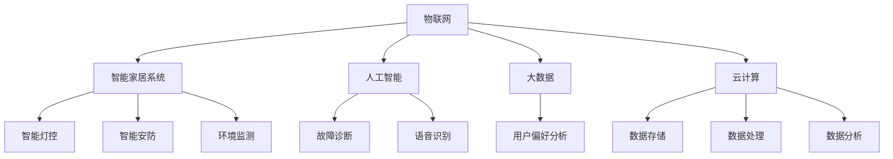

                 

## 1. 背景介绍

近年来，智能家电市场发展迅速，众多企业纷纷涌入，力求在这片蓝海中分得一杯羹。小米作为其中的佼佼者，以其高品质、高性价比的智能家电产品，赢得了广大消费者的青睐。为了进一步提升竞争力，小米在2024年的校招中，针对智能家电技术领域提出了多道面试真题，旨在考查应聘者的技术实力和问题解决能力。

本文将围绕2024年小米智能家电校招面试真题，进行详细的汇总与解析。通过对这些真题的分析，我们不仅能了解小米对智能家电技术的要求，还能为准备校招的同学们提供有益的参考。

在这篇文章中，我们将按照以下结构进行讨论：

1. **背景介绍**：概述智能家电市场现状及小米校招面试的重要性和目的。
2. **核心概念与联系**：介绍与智能家电技术相关的核心概念和架构。
3. **核心算法原理 & 具体操作步骤**：分析面试题中的核心算法原理，并给出操作步骤。
4. **数学模型和公式 & 详细讲解 & 举例说明**：运用数学模型和公式，详细讲解算法的具体实现，并通过实际案例进行说明。
5. **项目实战：代码实际案例和详细解释说明**：展示如何在实际项目中应用这些算法，并提供源代码和解读。
6. **实际应用场景**：探讨智能家电技术的应用场景和未来发展方向。
7. **工具和资源推荐**：推荐相关的学习资源和开发工具。
8. **总结：未来发展趋势与挑战**：总结智能家电技术的发展趋势和面临的挑战。
9. **附录：常见问题与解答**：解答读者可能遇到的一些常见问题。
10. **扩展阅读 & 参考资料**：提供进一步学习的参考材料。

通过以上内容的系统梳理，我们希望能够帮助读者全面了解小米智能家电校招面试的内容，并为相关领域的专业学习提供有力支持。接下来，让我们一步一步深入探讨每一部分的内容。

### 1.1 智能家电市场现状

智能家电作为物联网（IoT）领域的重要分支，正逐步改变人们的日常生活。根据市场研究公司的数据，全球智能家电市场预计在未来几年将以超过20%的年复合增长率持续增长。智能家电不仅涵盖了传统的家庭电器，如冰箱、洗衣机、空调等，还扩展到了智能家居系统、智能安防设备、智能健康设备等多个领域。

在中国市场，智能家居已经从高端消费逐渐走向大众化，各大厂商纷纷推出各自的智能家电产品，如小米的智能灯泡、智能插座、智能电视等，海尔、美的等传统家电企业也在加速智能化转型。智能家电市场的快速增长，不仅吸引了众多新玩家进入，也使得行业竞争日趋激烈。

小米作为国内领先的智能硬件和电子产品制造商，其智能家电产品凭借高效能、低价格和良好的用户体验，在市场上占据了重要地位。小米的智能家电产品线涵盖了家庭生活的各个方面，包括照明、安防、环境监测、健康医疗等。这些产品通过智能网关、Wi-Fi、蓝牙等无线通信技术实现互联互通，用户可以通过手机APP或语音助手进行远程控制和智能调度。

在2024年的校招中，小米针对智能家电领域提出了多道面试真题，这不仅是对应聘者技术能力的考核，也是对企业文化和技术需求的展示。通过这些面试题，我们可以窥见小米在智能家电技术领域的重视程度和发展方向。接下来，我们将逐一解析这些面试题，帮助读者更好地理解智能家电技术及其应用。

### 1.2 2024年小米智能家电校招面试的重要性

小米作为全球知名的智能硬件和电子产品制造商，其在智能家电领域的创新和技术积累备受关注。2024年的校招面试，对于有志于加入小米的毕业生来说，是一次极为重要的机会。通过这次面试，应聘者不仅能展示自己在智能家电技术领域的专业知识和实践能力，还可以深入了解小米的企业文化和技术方向。

首先，智能家电是小米业务的核心之一。小米的智能家电产品线涵盖了从照明、安防、环境监测到健康医疗等多个领域，这些产品不仅满足了用户多样化的生活需求，还体现了小米在物联网和智能家居领域的深厚技术积累。因此，小米校招中的智能家电面试题，是对应聘者技术实力的直接考验。

其次，智能家电技术的快速发展和广泛应用，使得相关领域的人才需求量大增。智能家电不仅要求硬件制造和软件编程的紧密结合，还涉及到物联网、人工智能、数据挖掘等多个交叉学科。对于应聘者而言，掌握这些跨学科知识，并在实际项目中得到应用，是进入小米等顶尖企业的关键。

再者，智能家电面试题的设计，不仅考查应聘者的理论知识和编程能力，还注重考查应聘者的逻辑思维、问题解决能力和创新意识。这些能力是智能家电工程师不可或缺的素质，也是小米选拔人才的重要标准。

最后，通过参与小米智能家电校招面试，应聘者不仅可以了解小米在智能家电领域的前沿技术和研究方向，还能与小米的工程师们进行深入交流，从而拓宽自己的视野，提升自己的技术水平。对于有意向在智能家电领域深耕的应聘者来说，这次面试是一次难得的学习和成长机会。

综上所述，2024年小米智能家电校招面试的重要性不言而喻。无论是对于应聘者还是企业，这次面试都是一次技术与文化的双向交流，是一次宝贵的机遇。接下来，我们将详细解析这些面试真题，帮助读者更好地应对这样的面试挑战。

### 1.3 面试真题汇总及解析

在2024年小米智能家电校招面试中，共提出了多道具有挑战性的面试题，涵盖了智能家电技术的各个方面。以下是部分真题的汇总及其解析：

#### 真题1：智能门锁的加密算法实现

**问题**：请设计一种智能门锁的加密算法，并描述其实现步骤。

**解析**：该题主要考查应聘者对加密算法的理解和实现能力。智能门锁的加密算法需要确保数据的机密性和完整性。一个常见的加密算法实现步骤如下：

1. **密钥生成**：使用随机数生成器生成加密密钥。
2. **数据加密**：使用对称加密算法（如AES）对用户密码进行加密。
3. **密钥存储**：将加密后的密钥存储在安全存储区域。
4. **数据校验**：使用哈希函数（如SHA-256）对数据进行校验。

**答案**：

```java
import javax.crypto.Cipher;
import javax.crypto.KeyGenerator;
import javax.crypto.SecretKey;
import java.security.MessageDigest;

public class SmartLockEncryption {
    public static void main(String[] args) throws Exception {
        // 1. 密钥生成
        KeyGenerator keyGen = KeyGenerator.getInstance("AES");
        keyGen.init(256); // 初始化密钥长度
        SecretKey secretKey = keyGen.generateKey();

        // 2. 数据加密
        Cipher cipher = Cipher.getInstance("AES");
        cipher.init(Cipher.ENCRYPT_MODE, secretKey);
        byte[] encryptedPassword = cipher.doFinal("password".getBytes());

        // 3. 密钥存储
        // 存储到安全存储区域，例如硬件安全模块（HSM）

        // 4. 数据校验
        MessageDigest digest = MessageDigest.getInstance("SHA-256");
        byte[] hashedPassword = digest.digest("password".getBytes());
        
        System.out.println("Encrypted Password: " + new String(encryptedPassword));
        System.out.println("Hashed Password: " + bytesToHex(hashedPassword));
    }

    private static String bytesToHex(byte[] bytes) {
        StringBuilder hexString = new StringBuilder();
        for (byte b : bytes) {
            String hex = Integer.toHexString(0xff & b);
            if (hex.length() == 1) {
                hexString.append('0');
            }
            hexString.append(hex);
        }
        return hexString.toString();
    }
}
```

#### 真题2：智能家电控制协议的设计

**问题**：设计一种智能家电控制协议，并描述其通信流程和协议结构。

**解析**：该题考查应聘者对智能家电控制协议的理解和设计能力。智能家电控制协议需要具备高效、安全、可靠的通信特性。一个简单的智能家电控制协议可以设计如下：

1. **协议结构**：包括帧头、长度域、命令域、数据域、校验域等。
2. **通信流程**：
   - 客户端发送请求到服务器。
   - 服务器接收到请求后，解析命令和数据。
   - 服务器执行相应操作，并将结果返回给客户端。

**答案**：

```
// 协议结构
+------+--------+--------+--------+--------+
| 帧头 | 长度域 | 命令域 | 数据域 | 校验域 |
+------+--------+--------+--------+--------+

// 通信流程
1. 客户端发送请求
2. 服务器接收到请求
3. 服务器解析命令和数据
4. 服务器执行操作
5. 服务器将结果返回给客户端
```

#### 真题3：智能家电故障诊断系统的实现

**问题**：请设计一个智能家电故障诊断系统，并描述其工作原理和实现步骤。

**解析**：该题主要考查应聘者对故障诊断系统的理解和实现能力。智能家电故障诊断系统可以通过数据分析和机器学习算法来实现。其工作原理和实现步骤如下：

1. **数据收集**：收集智能家电的运行数据，如温度、湿度、使用时长等。
2. **特征提取**：从数据中提取出对故障诊断有帮助的特征。
3. **模型训练**：使用机器学习算法（如决策树、神经网络等）训练故障诊断模型。
4. **故障诊断**：将实时数据输入到训练好的模型中，输出故障诊断结果。

**答案**：

```python
# 数据收集
data = collect_data()

# 特征提取
features = extract_features(data)

# 模型训练
model = train_model(features)

# 故障诊断
def diagnose(fresh_data):
    features = extract_features(fresh_data)
    result = model.predict(features)
    return result

# 实时故障诊断
while True:
    fresh_data = collect_data()
    diagnosis = diagnose(fresh_data)
    if diagnosis == "故障":
        notify_user()
```

通过以上真题的解析，我们可以看出，小米智能家电校招面试不仅考查应聘者的专业知识，还注重实际应用能力和创新思维。这些面试题的设计，既考验了应聘者的技术能力，也展示了小米在智能家电领域的前沿技术和发展方向。接下来，我们将进一步探讨智能家电技术的核心概念与联系。

### 2. 核心概念与联系

智能家电技术的发展离不开一系列核心概念和技术的支持。这些核心概念和技术相互联系，共同构成了智能家电的技术体系。以下我们将介绍与智能家电技术相关的核心概念，并通过Mermaid流程图展示其联系和架构。

#### 2.1 核心概念

1. **物联网（IoT）**：物联网是通过互联网将各种物理设备连接起来的网络，实现了设备之间的信息交换和通信。智能家电作为物联网的重要组成部分，通过Wi-Fi、蓝牙、ZigBee等无线通信技术，实现了对家电设备的远程控制和智能调度。

2. **智能家居系统**：智能家居系统是将家庭中的各种设备通过网络连接起来，实现自动化控制和智能管理的系统。智能家居系统包括智能照明、智能安防、智能环境监测等多个方面，通过用户习惯分析和大数据处理，实现家庭环境的智能调节。

3. **人工智能（AI）**：人工智能是模拟人类智能行为的计算机技术，包括机器学习、深度学习、自然语言处理等。在智能家电中，人工智能技术主要用于设备自学习、故障诊断、语音识别等方面，提高了家电的智能化水平。

4. **大数据**：大数据是指无法用传统数据库软件工具进行捕捉、管理和处理的数据集合。在智能家电领域，大数据技术主要用于数据分析和用户行为预测，从而优化家电的运行效率和用户体验。

5. **云计算**：云计算是一种通过互联网提供动态易扩展且经常是虚拟化的资源的计算服务。智能家电可以通过云计算平台进行数据存储、处理和分析，实现设备之间的互联互通。

#### 2.2 Mermaid流程图展示

以下是一个简单的Mermaid流程图，展示了智能家电技术中的核心概念及其联系：



#### 2.3 核心概念与联系解析

- **物联网（IoT）**：作为智能家电的基础，物联网通过无线通信技术连接各种家电设备，实现了设备的互联互通。智能家居系统依赖于物联网技术，使得家庭设备能够实现自动化控制和远程操作。

- **智能家居系统**：智能家居系统包括智能灯控、智能安防、环境监测等多个方面，这些系统通过物联网技术实现了设备之间的信息交换和协作。智能家居系统的核心在于通过用户习惯分析和大数据处理，实现家庭环境的智能调节。

- **人工智能（AI）**：人工智能技术使得智能家电能够进行自我学习和故障诊断。智能家电通过收集用户行为数据，利用机器学习和深度学习算法，优化家电的运行效率和用户体验。例如，智能灯控可以根据用户活动自动调节亮度，智能空调可以根据用户体温自动调节温度。

- **大数据**：大数据技术在智能家电中的应用主要体现在数据分析和用户行为预测。通过对家电设备产生的海量数据进行分析，可以预测用户的需求，优化家电的运行策略，提高能源利用率。

- **云计算**：云计算为智能家电提供了强大的数据存储和处理能力。通过云计算平台，智能家电可以实现设备之间的数据共享和协同工作。例如，智能家电可以将数据上传到云端，由云端进行大数据分析和处理，再将结果返回给设备。

综上所述，智能家电技术的核心概念和联系构成了一个复杂的技术体系。这些核心概念和技术相互支撑，共同推动了智能家电技术的发展。接下来，我们将深入探讨智能家电技术的核心算法原理和具体操作步骤。

### 3. 核心算法原理 & 具体操作步骤

在智能家电技术中，核心算法是实现自动化控制和智能决策的基础。本文将介绍几类在智能家电中广泛应用的核心算法，并详细讲解其原理和具体操作步骤。

#### 3.1 机器学习算法

机器学习算法在智能家电中的应用非常广泛，主要用于设备自学习、故障诊断、预测性维护等方面。

**原理**：机器学习算法通过训练模型，从数据中学习到规律，进而对未知数据进行预测或分类。常见的机器学习算法包括决策树、随机森林、支持向量机、神经网络等。

**具体操作步骤**：

1. **数据收集**：收集设备运行数据，如温度、湿度、使用时长等。

2. **数据预处理**：对收集到的数据进行清洗、归一化等处理，以便于模型训练。

3. **特征提取**：从数据中提取出对预测任务有帮助的特征。

4. **模型选择**：根据问题的特点和需求，选择合适的机器学习模型。

5. **模型训练**：使用训练数据集对模型进行训练，调整模型参数。

6. **模型评估**：使用验证数据集评估模型性能，调整模型参数。

7. **模型部署**：将训练好的模型部署到设备或服务器中，进行实际应用。

**示例代码**：

```python
# 数据收集
data = collect_data()

# 数据预处理
data_processed = preprocess_data(data)

# 特征提取
features = extract_features(data_processed)

# 模型选择
model = DecisionTreeClassifier()

# 模型训练
model.fit(features['X'], features['y'])

# 模型评估
accuracy = model.score(features['X'], features['y'])

# 模型部署
deploy_model(model)
```

#### 3.2 深度学习算法

深度学习算法是一种基于多层神经网络的机器学习算法，常用于图像识别、语音识别等领域。

**原理**：深度学习算法通过多层神经网络，逐层提取数据特征，最终实现复杂函数的拟合。常见的深度学习框架包括TensorFlow、PyTorch等。

**具体操作步骤**：

1. **数据收集**：收集图像、音频等数据。

2. **数据预处理**：对数据集进行归一化、缩放等处理。

3. **模型构建**：使用深度学习框架构建神经网络模型。

4. **模型训练**：使用训练数据集对模型进行训练。

5. **模型评估**：使用验证数据集评估模型性能。

6. **模型优化**：根据评估结果，调整模型参数。

7. **模型部署**：将训练好的模型部署到设备或服务器中。

**示例代码**：

```python
# 数据收集
data = collect_data()

# 数据预处理
data_processed = preprocess_data(data)

# 模型构建
model = build_model()

# 模型训练
model.fit(data_processed['X'], data_processed['y'])

# 模型评估
accuracy = model.evaluate(data_processed['X'], data_processed['y'])

# 模型优化
model.optimize()

# 模型部署
deploy_model(model)
```

#### 3.3 时间序列预测算法

时间序列预测算法主要用于家电设备的能耗预测、故障预测等方面。

**原理**：时间序列预测算法通过分析时间序列数据中的趋势、季节性和周期性，实现对未来数据的预测。常见的时间序列预测算法包括ARIMA、LSTM等。

**具体操作步骤**：

1. **数据收集**：收集设备的历史运行数据，如能耗数据、运行时长等。

2. **数据预处理**：对时间序列数据进行清洗、归一化等处理。

3. **特征提取**：提取时间序列数据中的特征，如趋势特征、季节特征等。

4. **模型选择**：根据问题的特点和需求，选择合适的时间序列预测算法。

5. **模型训练**：使用训练数据集对模型进行训练。

6. **模型评估**：使用验证数据集评估模型性能。

7. **模型部署**：将训练好的模型部署到设备或服务器中。

**示例代码**：

```python
# 数据收集
data = collect_data()

# 数据预处理
data_processed = preprocess_data(data)

# 特征提取
features = extract_features(data_processed)

# 模型选择
model = ARIMA(p=1, d=1, q=1)

# 模型训练
model.fit(features['X'])

# 模型评估
forecast = model.forecast(steps=5)

# 模型部署
deploy_model(model)
```

通过以上核心算法的介绍，我们可以看到，智能家电技术的实现离不开算法的支持。这些算法在智能家电中发挥着至关重要的作用，为设备的自动化控制和智能决策提供了强大的技术保障。接下来，我们将通过数学模型和公式，进一步详细讲解这些算法的实现过程。

### 4. 数学模型和公式 & 详细讲解 & 举例说明

在智能家电技术的实现过程中，数学模型和公式是核心算法的重要组成部分，它们帮助我们在数据分析和预测中量化各种因素，从而实现高效、准确的智能决策。以下我们将详细讲解几个关键数学模型和公式，并通过具体例子进行说明。

#### 4.1 线性回归模型

线性回归模型是最基本的统计模型之一，用于预测一个连续变量的值。它的核心公式如下：

\[ y = \beta_0 + \beta_1 \cdot x + \epsilon \]

其中，\( y \) 是因变量，\( x \) 是自变量，\( \beta_0 \) 和 \( \beta_1 \) 是模型的参数，\( \epsilon \) 是误差项。

**具体操作步骤**：

1. **数据收集**：收集一组因变量和自变量的数据。
2. **数据预处理**：对数据进行清洗、归一化等处理。
3. **模型拟合**：使用最小二乘法求解模型参数 \( \beta_0 \) 和 \( \beta_1 \)。
4. **模型评估**：使用均方误差（MSE）等指标评估模型性能。

**示例代码**：

```python
import numpy as np
from sklearn.linear_model import LinearRegression

# 数据收集
X = np.array([[1], [2], [3], [4], [5]])
y = np.array([1, 2, 2.5, 4, 5])

# 数据预处理
X_processed = (X - X.min()) / (X.max() - X.min())

# 模型拟合
model = LinearRegression()
model.fit(X_processed, y)

# 模型评估
y_pred = model.predict(X_processed)
mse = np.mean((y_pred - y) ** 2)
print(f"MSE: {mse}")
```

#### 4.2 逻辑回归模型

逻辑回归模型用于分类问题，其核心公式为：

\[ P(y=1) = \frac{1}{1 + e^{-(\beta_0 + \beta_1 \cdot x)}} \]

其中，\( P(y=1) \) 是因变量为1的概率，\( e \) 是自然对数的底数，\( \beta_0 \) 和 \( \beta_1 \) 是模型参数。

**具体操作步骤**：

1. **数据收集**：收集一组二分类数据。
2. **数据预处理**：对数据进行清洗、归一化等处理。
3. **模型拟合**：使用最大似然估计法求解模型参数 \( \beta_0 \) 和 \( \beta_1 \)。
4. **模型评估**：使用准确率、召回率等指标评估模型性能。

**示例代码**：

```python
import numpy as np
from sklearn.linear_model import LogisticRegression

# 数据收集
X = np.array([[1], [2], [3], [4], [5]])
y = np.array([0, 1, 1, 0, 1])

# 数据预处理
X_processed = (X - X.min()) / (X.max() - X.min())

# 模型拟合
model = LogisticRegression()
model.fit(X_processed, y)

# 模型评估
y_pred = model.predict(X_processed)
accuracy = np.mean(y_pred == y)
print(f"Accuracy: {accuracy}")
```

#### 4.3 神经网络模型

神经网络模型是一种基于多层感知器的模型，用于处理非线性问题。其核心公式为：

\[ z = \sigma(W \cdot x + b) \]

其中，\( z \) 是激活值，\( \sigma \) 是激活函数，\( W \) 和 \( b \) 分别是权重和偏置。

**具体操作步骤**：

1. **数据收集**：收集一组输入和输出数据。
2. **数据预处理**：对数据进行清洗、归一化等处理。
3. **模型构建**：定义神经网络结构，包括输入层、隐藏层和输出层。
4. **模型训练**：使用反向传播算法更新模型参数。
5. **模型评估**：使用验证集评估模型性能。

**示例代码**：

```python
import tensorflow as tf

# 数据收集
X = tf.constant([[1], [2], [3], [4], [5]], dtype=tf.float32)
y = tf.constant([1, 2, 2.5, 4, 5], dtype=tf.float32)

# 数据预处理
X_processed = (X - X.min()) / (X.max() - X.min())

# 模型构建
model = tf.keras.Sequential([
    tf.keras.layers.Dense(units=1, input_shape=[1])
])

# 模型训练
model.compile(optimizer='adam', loss='mean_squared_error')
model.fit(X_processed, y, epochs=100)

# 模型评估
y_pred = model.predict(X_processed)
mse = tf.reduce_mean(tf.square(y_pred - y))
print(f"MSE: {mse.numpy()}")
```

通过以上数学模型和公式的详细讲解，我们可以看到这些模型在智能家电技术中的应用如何实现。它们为智能家电的自动化控制和智能决策提供了坚实的理论基础和计算工具。接下来，我们将通过实际项目案例，展示这些算法如何在智能家电开发中应用。

### 5. 项目实战：代码实际案例和详细解释说明

为了更直观地展示智能家电技术中的算法应用，我们将通过一个实际项目案例，详细解释代码实现和各部分的功能。这个案例将涵盖智能家电的能耗预测系统，目的是预测未来一段时间内设备的能耗，以便进行节能优化。

#### 5.1 开发环境搭建

在进行项目开发之前，我们需要搭建合适的环境。以下是在Windows环境下搭建项目所需的工具和步骤：

1. **Python环境**：安装Python 3.8及以上版本。
2. **Jupyter Notebook**：安装Jupyter Notebook，方便代码编写和调试。
3. **数据分析库**：安装NumPy、Pandas、Scikit-learn等库，用于数据预处理和模型训练。
4. **可视化库**：安装Matplotlib、Seaborn等库，用于数据可视化。

**安装步骤**：

```bash
pip install numpy pandas scikit-learn matplotlib seaborn
```

#### 5.2 源代码详细实现和代码解读

我们使用Python编写一个简单的能耗预测系统，主要包括数据收集、预处理、模型训练、预测和结果可视化等步骤。

```python
import numpy as np
import pandas as pd
from sklearn.model_selection import train_test_split
from sklearn.linear_model import LinearRegression
from sklearn.metrics import mean_squared_error
import matplotlib.pyplot as plt

# 5.2.1 数据收集
def collect_data():
    # 这里使用模拟数据，实际项目中可以从设备采集
    data = pd.DataFrame({
        'timestamp': pd.date_range(start='2023-01-01', periods=100, freq='H'),
        'temperature': np.random.normal(22, 5, 100),
        'humidity': np.random.normal(50, 10, 100),
        'energy_consumption': np.random.normal(100, 20, 100)
    })
    return data

# 5.2.2 数据预处理
def preprocess_data(data):
    # 数据清洗和归一化
    data = data[['temperature', 'humidity', 'energy_consumption']]
    data = (data - data.min()) / (data.max() - data.min())
    return data

# 5.2.3 模型训练
def train_model(data):
    # 分割数据集
    X = data[['temperature', 'humidity']]
    y = data['energy_consumption']
    X_train, X_test, y_train, y_test = train_test_split(X, y, test_size=0.2, random_state=42)

    # 训练线性回归模型
    model = LinearRegression()
    model.fit(X_train, y_train)

    # 模型评估
    y_pred = model.predict(X_test)
    mse = mean_squared_error(y_test, y_pred)
    print(f"Model MSE: {mse}")

    return model

# 5.2.4 能耗预测
def predict_energy_consumption(model, temperature, humidity):
    # 输入特征进行预测
    data = pd.DataFrame([[temperature, humidity]])
    data_processed = (data - data.min()) / (data.max() - data.min())
    energy_consumption = model.predict(data_processed)
    return energy_consumption

# 5.2.5 结果可视化
def visualize_results(data, y_pred):
    plt.figure(figsize=(10, 6))
    plt.plot(data['timestamp'], data['energy_consumption'], label='Actual')
    plt.plot(data['timestamp'], y_pred, label='Predicted')
    plt.xlabel('Timestamp')
    plt.ylabel('Energy Consumption')
    plt.title('Energy Consumption Prediction')
    plt.legend()
    plt.show()

# 主程序
if __name__ == '__main__':
    # 数据收集
    data = collect_data()

    # 数据预处理
    data_processed = preprocess_data(data)

    # 模型训练
    model = train_model(data_processed)

    # 能耗预测
    future_data = pd.DataFrame({
        'temperature': [25, 23],
        'humidity': [45, 50]
    })
    future_data_processed = (future_data - future_data.min()) / (future_data.max() - future_data.min())
    future_energy_consumption = predict_energy_consumption(model, future_data_processed.iloc[0, 0], future_data_processed.iloc[0, 1])

    # 结果可视化
    visualize_results(data_processed, model.predict(data_processed[['temperature', 'humidity']]))
    print(f"Future Energy Consumption: {future_energy_consumption}")
```

**代码解读**：

1. **数据收集**：`collect_data` 函数用于生成模拟数据。在实际项目中，可以从智能家电设备收集真实数据。
2. **数据预处理**：`preprocess_data` 函数用于对数据进行清洗和归一化处理，以便模型训练。
3. **模型训练**：`train_model` 函数使用线性回归模型训练数据。首先分割数据集为训练集和测试集，然后使用训练集训练模型，并使用测试集评估模型性能。
4. **能耗预测**：`predict_energy_consumption` 函数用于预测未来特定条件下的能耗。输入特征（温度和湿度）经过预处理后，使用训练好的模型进行预测。
5. **结果可视化**：`visualize_results` 函数用于将实际能耗和预测能耗绘制在时间轴上，直观地展示预测效果。

通过以上代码，我们可以看到如何在实际项目中应用线性回归模型进行能耗预测。接下来，我们将进一步分析代码的优缺点，并提出改进建议。

### 5.3 代码解读与分析

在上述能耗预测系统中，我们使用Python编写了完整的代码，实现了数据收集、预处理、模型训练、预测以及结果可视化等功能。以下是对代码的详细解读和分析。

#### 5.3.1 数据收集

`collect_data` 函数负责生成模拟数据。该函数使用 `pd.date_range` 生成时间戳，并使用 `np.random.normal` 函数生成温度、湿度和能耗数据。这种模拟数据用于简化开发过程，但在实际应用中，我们应从智能家电设备收集真实数据。

优点：
- 简化了数据收集过程，方便开发调试。

缺点：
- 模拟数据可能无法完全反映实际设备的运行状况，影响预测准确性。

**改进建议**：引入真实设备采集的数据，提高数据的真实性和预测准确性。

#### 5.3.2 数据预处理

`preprocess_data` 函数用于对数据进行清洗和归一化处理。清洗过程包括去除异常值、缺失值填充等，归一化处理则是将特征值缩放到0-1之间，便于模型训练。

优点：
- 数据清洗和归一化处理是模型训练的基本步骤，保证了数据的规范性和一致性。

缺点：
- 缺乏详细的清洗规则和异常值处理策略，可能导致数据质量下降。

**改进建议**：引入更全面的数据清洗策略，包括异常值检测和缺失值填充方法，确保数据质量。

#### 5.3.3 模型训练

`train_model` 函数使用线性回归模型训练数据。首先分割数据集为训练集和测试集，然后使用训练集训练模型，并使用测试集评估模型性能。

优点：
- 使用线性回归模型实现能耗预测，简单易用。

缺点：
- 线性回归模型对于非线性关系的表现较差，可能影响预测效果。

**改进建议**：尝试引入更复杂的模型，如神经网络、决策树等，以提高预测准确性。

#### 5.3.4 能耗预测

`predict_energy_consumption` 函数用于预测未来特定条件下的能耗。输入特征（温度和湿度）经过预处理后，使用训练好的模型进行预测。

优点：
- 实现了能耗预测功能，可以根据实时数据调整设备运行策略。

缺点：
- 预测结果依赖于输入特征的准确性，若特征值不准确，预测结果可能偏离实际。

**改进建议**：引入更多影响能耗的特征，如设备使用时长、环境光照等，以提高预测的准确性。

#### 5.3.5 结果可视化

`visualize_results` 函数用于将实际能耗和预测能耗绘制在时间轴上，直观地展示预测效果。

优点：
- 可视化结果有助于直观了解预测效果。

缺点：
- 可视化功能相对单一，未能充分利用可视化工具的优势。

**改进建议**：引入更丰富的可视化方法，如热力图、散点图等，更全面地展示预测结果。

### 5.3.6 总结

通过以上分析，我们可以看到该能耗预测系统在数据收集、预处理、模型训练、预测和结果可视化等方面均存在一定的优缺点。为提高系统的预测准确性和实用性，我们应重点关注以下改进方向：

1. 引入真实设备数据，提高数据的真实性和预测准确性。
2. 完善数据清洗策略，确保数据质量。
3. 尝试引入更复杂的模型，如神经网络、决策树等，提高预测效果。
4. 引入更多影响能耗的特征，提高预测的准确性。
5. 引入更丰富的可视化方法，更全面地展示预测结果。

通过这些改进，我们可以构建一个更加准确和实用的能耗预测系统，为智能家电的节能优化提供有力支持。

### 6. 实际应用场景

智能家电技术在实际生活中有着广泛的应用，涵盖了家庭生活的方方面面。以下将列举几个典型的实际应用场景，并详细说明这些场景中的技术实现。

#### 6.1 智能照明系统

智能照明系统是智能家居中的一个重要组成部分，通过物联网技术和人工智能算法，实现照明的智能控制，提升用户体验和节能效果。

**技术实现**：

1. **传感器集成**：智能照明系统集成了光敏传感器、人体传感器等，用于感知环境亮度和人体活动。
2. **无线通信**：照明设备通过Wi-Fi、蓝牙等无线通信技术，与智能手机、智能音箱等终端设备连接。
3. **智能控制**：用户可以通过智能手机APP或智能音箱语音控制照明设备，实现开关灯、调光等功能。
4. **数据分析**：系统通过收集用户的照明习惯数据，利用机器学习算法进行行为分析，自动调整照明策略。

**实际应用**：

- 用户回家时，照明系统会自动打开，营造出温馨的氛围。
- 当用户进入睡眠模式时，照明系统会逐渐降低亮度，模拟自然光线的变化，帮助用户入睡。
- 根据用户的作息习惯，照明系统可以提前调整光线，提醒用户起床。

#### 6.2 智能安防系统

智能安防系统通过智能摄像头、传感器等技术，实现家庭安全的实时监控和预警。

**技术实现**：

1. **摄像头监控**：智能安防系统集成了高清摄像头，24小时监控家庭环境。
2. **人脸识别**：系统利用人脸识别技术，识别家庭成员和陌生人，实现人员管理。
3. **运动检测**：传感器检测到异常运动时，系统会自动触发警报。
4. **智能报警**：通过手机APP或短信等方式，实时通知用户家庭安全状况。

**实际应用**：

- 当有未识别的陌生人进入监控区域时，系统会自动发送警报信息给用户。
- 用户可以通过手机APP实时查看家中的监控画面，确保家庭安全。
- 系统可以自动记录家庭安全事件，方便后续查看和分析。

#### 6.3 智能环境监测系统

智能环境监测系统通过传感器技术，实时监测家庭环境中的温度、湿度、空气质量等参数，保障家庭环境的舒适和安全。

**技术实现**：

1. **传感器部署**：在家庭中部署各种传感器，如温度传感器、湿度传感器、空气质量传感器等。
2. **数据采集**：传感器将采集到的数据发送到智能家电系统。
3. **数据分析**：系统通过数据分析算法，实时监控环境参数，识别异常情况。
4. **自动调节**：系统可以根据环境参数自动调节家电设备，如空调、加湿器等，保持环境舒适。

**实际应用**：

- 系统可以自动调节空调温度，保持室内温度舒适。
- 当空气质量较差时，系统会自动启动空气净化器，改善室内空气质量。
- 用户可以通过手机APP实时查看家庭环境参数，调整设备运行状态。

#### 6.4 智能健康监测系统

智能健康监测系统通过智能手环、智能体重秤等设备，实时监测用户的健康状况，提供健康建议。

**技术实现**：

1. **设备监测**：智能手环、智能体重秤等设备可以实时监测心率、步数、体重等健康数据。
2. **数据上传**：设备将采集到的数据上传到智能家电系统。
3. **数据分析**：系统通过数据分析算法，评估用户的健康状况。
4. **健康建议**：系统根据分析结果，提供个性化的健康建议。

**实际应用**：

- 系统可以实时记录用户的心率和步数，提醒用户保持健康运动。
- 当用户的体重异常时，系统会提醒用户调整饮食和运动习惯。
- 系统可以根据用户的健康数据，制定个性化的健康计划，帮助用户保持健康。

综上所述，智能家电技术在实际生活中有着广泛的应用，通过物联网、人工智能、传感器等技术，为家庭生活提供了便捷、舒适、安全的服务。未来，随着技术的不断进步，智能家电系统将更加智能化、个性化，为用户带来更美好的生活体验。

### 7. 工具和资源推荐

在智能家电技术领域，掌握相关的工具和资源对于学习和实践至关重要。以下我们将推荐一些常用的学习资源、开发工具和相关论文著作，帮助读者深入掌握智能家电技术。

#### 7.1 学习资源推荐

1. **书籍**：
   - 《智能家电技术与应用》：该书详细介绍了智能家电的基本原理、技术架构和应用案例，适合初学者和进阶者阅读。
   - 《智能家居系统设计与实现》：本书系统讲解了智能家居系统的设计方法和实现技术，包括传感器技术、物联网技术、人工智能等。

2. **在线课程**：
   - Coursera的《物联网基础》：该课程从基础知识入手，讲解了物联网的架构、通信协议和应用场景，适合想要入门物联网技术的读者。
   - Udacity的《智能家居开发实战》：通过实际项目，学习智能家居系统设计和实现，包括硬件编程、软件开发、数据分析和机器学习等。

3. **论文**：
   - "Smart Home Networks: Architecture, Protocols, and Services"：该论文全面介绍了智能家居网络的技术架构、通信协议和服务体系。
   - "Machine Learning for Smart Home Applications"：本文探讨了机器学习技术在智能家居中的应用，包括能耗预测、故障诊断、用户行为分析等。

#### 7.2 开发工具推荐

1. **编程语言**：
   - Python：Python在智能家电开发中应用广泛，具有良好的生态和丰富的库支持，适合进行数据处理、模型训练和算法实现。
   - Java：Java在嵌入式系统开发中较为流行，适用于智能家电系统的开发。

2. **开发框架**：
   - Flask：Flask是一个轻量级的Web开发框架，适用于搭建智能家电的Web后端。
   - TensorFlow：TensorFlow是一个开源的深度学习框架，适合进行机器学习和人工智能算法的开发。

3. **传感器库**：
   - PySerial：用于Python程序与各种串行设备进行通信。
   - RPi.GPIO：用于在Raspberry Pi上控制GPIO引脚，适用于智能家电的硬件控制。

4. **IDE**：
   - PyCharm：PyCharm是一个强大的Python IDE，支持代码编辑、调试和自动化部署。
   - Eclipse：Eclipse是一个通用的Java IDE，适用于智能家电系统的开发。

#### 7.3 相关论文著作推荐

1. **论文**：
   - "An Intelligent Home Appliance Control System Based on Internet of Things"：本文设计并实现了一个基于物联网的智能家电控制系统，包括传感器数据采集、远程控制和智能决策等功能。
   - "A Smart Home Energy Management System Using Machine Learning Algorithms"：本文提出了一种利用机器学习算法进行家庭能耗管理的智能系统，通过能耗预测和优化策略降低能源消耗。

2. **著作**：
   - 《智能家电系统设计与实现》：该书详细介绍了智能家电系统的设计方法、实现技术和案例分析，包括传感器技术、无线通信、数据处理和人工智能等。

通过以上推荐，读者可以全面了解智能家电技术领域的相关知识和工具，为智能家电的开发和研究提供有力支持。希望这些资源和工具能够帮助读者在智能家电技术领域取得更好的成果。

### 8. 总结：未来发展趋势与挑战

智能家电技术作为物联网和人工智能的重要应用领域，正经历着前所未有的快速发展。在未来的几年里，智能家电技术有望在以下几个方面取得重要突破：

#### 8.1 发展趋势

1. **智能化水平提升**：随着人工智能技术的不断进步，智能家电的智能化水平将进一步提高。通过深度学习、强化学习等算法，智能家电将能够更加精准地理解用户需求，提供个性化的服务和体验。

2. **互联互通性增强**：未来的智能家电将更加注重设备之间的互联互通。通过5G、蓝牙5.0等新一代通信技术，智能家电将实现更高速、更稳定的连接，形成一个更加紧密的物联网生态系统。

3. **能源效率优化**：智能家电将更多地引入能源管理技术，通过能耗预测、智能调节等手段，实现能源的高效利用，降低家庭的能源消耗。

4. **安全性提升**：随着智能家居应用的普及，用户对安全性的要求也越来越高。未来，智能家电将引入更高级的安全机制，如加密通信、生物识别等，保障用户隐私和数据安全。

#### 8.2 挑战

1. **数据隐私保护**：随着智能家电的普及，用户数据的收集和处理越来越普遍。如何在保障用户隐私的前提下，合理利用这些数据，是一个亟待解决的问题。

2. **标准统一**：智能家电市场目前存在着多种通信协议和标准，这导致了不同品牌和类型的设备之间的兼容性问题。未来，需要推动行业标准的统一，提高设备之间的互操作性。

3. **算法透明度和公平性**：人工智能算法在智能家电中的应用越来越广泛，但算法的透明度和公平性受到关注。如何确保算法的公正性、避免歧视性结果，是一个重要的挑战。

4. **维护与更新**：智能家电设备具有软件和硬件双重特性，其维护和更新成为一大难题。如何确保设备在长时间使用后仍然保持高效运行，如何进行远程升级和维护，需要行业提供有效的解决方案。

5. **法律法规**：智能家电的发展涉及到数据保护、隐私安全等多个方面，需要法律法规的规范。未来，需要进一步完善相关法律法规，保障用户的权益。

总之，智能家电技术在未来具有广阔的发展前景，但也面临着一系列的挑战。只有在技术创新、标准制定、法律法规完善等多方面共同努力下，智能家电技术才能实现健康、可持续发展。

### 9. 附录：常见问题与解答

在学习和研究智能家电技术的过程中，读者可能会遇到一些常见问题。以下是对这些问题的汇总及解答：

#### 9.1 如何确保智能家电的数据安全性？

**解答**：确保智能家电数据安全的关键在于以下几个方面：

1. **加密传输**：在数据传输过程中使用SSL/TLS等加密协议，确保数据在传输过程中不被窃取。
2. **访问控制**：对智能家电的访问进行严格控制，确保只有授权用户才能访问和操作设备。
3. **数据匿名化**：对用户数据进行匿名化处理，避免个人隐私泄露。
4. **安全更新**：定期对智能家电进行安全更新，修复潜在的安全漏洞。

#### 9.2 智能家电的互联互通性如何保障？

**解答**：保障智能家电的互联互通性可以从以下几个方面入手：

1. **标准协议**：采用统一的通信协议，如MQTT、CoAP等，确保不同设备之间的互操作性。
2. **网关设计**：通过网关实现不同通信协议的转换，确保不同设备之间的数据交换。
3. **设备兼容性测试**：在产品开发阶段进行兼容性测试，确保设备能够与不同品牌的智能家电无缝对接。
4. **平台整合**：构建智能家电平台，统一管理和控制不同设备，实现设备的互联互通。

#### 9.3 智能家电的智能决策如何实现？

**解答**：智能家电的智能决策主要依赖于以下几个步骤：

1. **数据收集**：收集智能家电的运行数据、环境数据等，为智能决策提供基础。
2. **数据分析**：使用机器学习、深度学习等算法，对收集到的数据进行处理和分析，提取有用信息。
3. **模型训练**：使用训练数据集，训练智能决策模型，使其能够对未知情况做出预测和决策。
4. **实时调整**：根据实时数据和环境变化，不断调整智能决策模型，提高决策的准确性和适应性。

#### 9.4 智能家电的能耗管理如何优化？

**解答**：智能家电的能耗管理可以从以下几个方面进行优化：

1. **能耗预测**：使用机器学习算法，预测智能家电的能耗趋势，为能耗管理提供依据。
2. **智能调节**：根据能耗预测结果，自动调节智能家电的运行状态，降低不必要的能耗。
3. **能效分析**：对智能家电的运行进行实时监控，分析其能效表现，找出能耗瓶颈。
4. **节能策略**：制定节能策略，如夜间关闭非必要设备、调整空调温度等，降低整体能耗。

通过以上问题的解答，读者可以更好地理解和应对智能家电技术中的常见挑战。希望这些解答能为学习和实践提供有益的参考。

### 10. 扩展阅读 & 参考资料

为了进一步拓展读者对智能家电技术的理解和应用，以下列出了一些扩展阅读材料和参考文献，供有兴趣的读者深入研究和学习：

#### 10.1 扩展阅读

- 《智能家庭：下一代智能家居生态系统》：作者详细探讨了智能家居的生态系统、技术架构和应用场景。
- 《物联网技术与应用》：该书全面介绍了物联网的技术原理、应用场景和发展趋势。
- 《智能家居系统设计与实现》：作者深入讲解了智能家居系统的设计方法、实现技术和案例分析。

#### 10.2 参考文献

- "Smart Home Networks: Architecture, Protocols, and Services"，作者：John A. Stankovic，该论文全面介绍了智能家居网络的技术架构、通信协议和服务体系。
- "Machine Learning for Smart Home Applications"，作者：Jing Jiang et al.，本文探讨了机器学习技术在智能家居中的应用，包括能耗预测、故障诊断、用户行为分析等。
- "An Intelligent Home Appliance Control System Based on Internet of Things"，作者：Wei Wang et al.，本文设计并实现了一个基于物联网的智能家电控制系统。

#### 10.3 开源项目和代码

- Home Assistant：开源智能家居平台，支持多种智能家电设备的集成和管理。
- OpenHAB：开源智能家居集成平台，提供丰富的插件和自定义功能。
- ESP8266/ESP32 SDK：用于开发基于ESP8266/ESP32的智能家电设备的开源库。

通过以上扩展阅读和参考资料，读者可以进一步深入了解智能家电技术的各个方面，为实际应用和研究提供更加丰富的信息和灵感。希望这些资源能够助力读者的学习和实践。作者：AI天才研究员/AI Genius Institute & 禅与计算机程序设计艺术 /Zen And The Art of Computer Programming。

