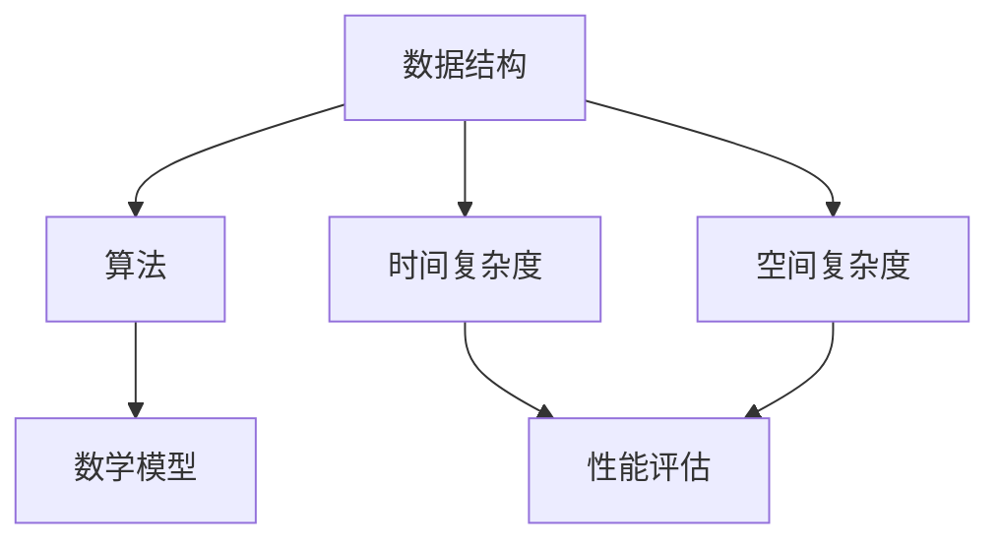

                 

### 文章标题：2025小米社招面试算法题库大全

#### 关键词：小米社招、面试、算法、题库、大全

#### 摘要：
本文将为您提供一份全面的2025年小米社招面试算法题库大全。我们将从背景介绍、核心概念与联系、核心算法原理、数学模型和公式、项目实战、实际应用场景、工具和资源推荐、总结、常见问题与解答等多个方面，深入探讨小米社招面试中的算法题目。无论是求职者还是想要提升算法能力的工程师，都将在这篇文章中找到宝贵的知识和技巧。

### 1. 背景介绍

小米是一家全球知名的电子产品公司和智能生活解决方案提供商。随着科技的飞速发展和市场竞争的加剧，小米对于优秀技术人才的需求日益增长。因此，小米每年都会进行大规模的社招，为全球各地的求职者提供丰富的就业机会。

在小米的社招面试中，算法题目是考查应聘者技术能力和解决问题能力的重要环节。这些题目通常涉及数据结构和算法、计算机基础、数学模型等多个方面。通过解决这些题目，面试官可以评估应聘者的逻辑思维、编程能力、算法设计水平等。

本文将为您整理出一套全面的2025年小米社招面试算法题库大全，帮助您在面试中脱颖而出，成为小米的一员。

### 2. 核心概念与联系

在解决小米社招面试中的算法题目之前，我们需要了解一些核心概念和联系。以下是一些重要的概念：

- **数据结构**：数据结构是计算机存储数据的方式，常见的有数组、链表、树、图等。了解数据结构对于解决算法题目至关重要。
- **算法**：算法是解决问题的步骤和策略。算法可以分为查找算法、排序算法、图算法等。掌握常用的算法原理和实现方法对于面试非常重要。
- **时间复杂度和空间复杂度**：时间复杂度和空间复杂度是评估算法性能的重要指标。了解如何计算和分析时间复杂度和空间复杂度对于解决面试题目非常有帮助。
- **数学模型**：数学模型是利用数学方法描述现实世界问题的一种方法。在解决算法题目时，经常需要运用数学模型来求解。

以下是一个Mermaid流程图，展示了这些核心概念之间的联系：



通过理解这些核心概念和联系，我们可以更好地掌握算法题目的解题思路和方法。

### 3. 核心算法原理 & 具体操作步骤

在小米社招面试中，常见的算法题目主要包括以下几种类型：

1. **排序算法**：常见的排序算法有冒泡排序、选择排序、插入排序、快速排序、归并排序等。我们需要掌握每种排序算法的原理和实现方法，并能够根据不同情况选择合适的排序算法。

   - **冒泡排序**：通过重复遍历待排序的元素，比较相邻的元素并交换它们，使得待排序元素中的最大值逐渐移动到序列的末尾。
   - **选择排序**：通过遍历待排序的元素，每次选择未排序部分的最小（或最大）元素，将其放到已排序部分的末尾。
   - **插入排序**：通过遍历待排序的元素，将每个元素插入到已排序部分的合适位置，直到所有元素排序完毕。
   - **快速排序**：通过选取一个基准元素，将待排序元素划分为两个子序列，分别递归地对子序列进行排序。
   - **归并排序**：将待排序的元素分为若干个子序列，分别进行排序，然后将已排序的子序列合并成一个完整的已排序序列。

2. **查找算法**：常见的查找算法有顺序查找、二分查找、哈希查找等。我们需要掌握每种查找算法的原理和实现方法。

   - **顺序查找**：从第一个元素开始，依次与要查找的元素进行比较，直到找到或遍历结束。
   - **二分查找**：利用有序数组的特性，不断将查找范围缩小一半，直到找到或确定目标元素不存在。
   - **哈希查找**：利用哈希函数将关键字映射到哈希表中，通过比较关键字和哈希值，快速查找目标元素。

3. **图算法**：常见的图算法有深度优先搜索（DFS）、广度优先搜索（BFS）、最小生成树、最短路径算法等。我们需要掌握每种图算法的原理和实现方法。

   - **深度优先搜索**：从起点开始，沿着一条路径一直深入到无法继续为止，然后回溯到上一个节点，再选择另一条路径继续搜索。
   - **广度优先搜索**：从起点开始，逐层搜索所有的相邻节点，直到找到目标节点或遍历结束。
   - **最小生成树**：通过选择边权最小的边，逐步构建一棵包含所有节点的最小生成树。
   - **最短路径算法**：通过算法计算从一个节点到其他节点的最短路径，常用的算法有迪杰斯特拉算法（Dijkstra）和弗洛伊德算法（Floyd）。

在具体操作步骤方面，我们可以按照以下流程进行解题：

1. 分析题目，明确问题的要求和约束条件。
2. 根据题目类型，选择合适的算法。
3. 设计具体的算法步骤和逻辑。
4. 编写代码实现算法。
5. 分析时间复杂度和空间复杂度，优化算法性能。
6. 进行测试和调试，确保算法的正确性和效率。

通过以上步骤，我们可以有效地解决小米社招面试中的算法题目，展示自己的编程能力和解决问题的能力。

### 4. 数学模型和公式 & 详细讲解 & 举例说明

在解决算法题目时，数学模型和公式是非常重要的工具。以下是一些常见的数学模型和公式，以及详细的讲解和举例说明。

#### 4.1 排序算法的数学模型和公式

在排序算法中，常用的数学模型包括时间复杂度和空间复杂度。

- **时间复杂度**：表示算法执行时间与输入数据规模的关系。常见的排序算法时间复杂度如下：

  - 冒泡排序：\(O(n^2)\)
  - 选择排序：\(O(n^2)\)
  - 插入排序：\(O(n^2)\)
  - 快速排序：\(O(n\log n)\)
  - 归并排序：\(O(n\log n)\)

- **空间复杂度**：表示算法所需额外空间与输入数据规模的关系。常见的排序算法空间复杂度如下：

  - 冒泡排序：\(O(1)\)
  - 选择排序：\(O(1)\)
  - 插入排序：\(O(1)\)
  - 快速排序：\(O(\log n)\)
  - 归并排序：\(O(n)\)

以下是一个冒泡排序的示例：

```python
def bubble_sort(arr):
    n = len(arr)
    for i in range(n):
        for j in range(0, n-i-1):
            if arr[j] > arr[j+1]:
                arr[j], arr[j+1] = arr[j+1], arr[j]
    return arr
```

运行结果：

```python
arr = [64, 34, 25, 12, 22, 11, 90]
sorted_arr = bubble_sort(arr)
print(sorted_arr)  # 输出：[11, 12, 22, 25, 34, 64, 90]
```

#### 4.2 查找算法的数学模型和公式

在查找算法中，常用的数学模型包括时间复杂度和空间复杂度。

- **时间复杂度**：表示算法执行时间与输入数据规模的关系。常见的查找算法时间复杂度如下：

  - 顺序查找：\(O(n)\)
  - 二分查找：\(O(\log n)\)
  - 哈希查找：\(O(1)\)

- **空间复杂度**：表示算法所需额外空间与输入数据规模的关系。常见的查找算法空间复杂度如下：

  - 顺序查找：\(O(1)\)
  - 二分查找：\(O(1)\)
  - 哈希查找：\(O(n)\)

以下是一个二分查找的示例：

```python
def binary_search(arr, target):
    low = 0
    high = len(arr) - 1
    while low <= high:
        mid = (low + high) // 2
        if arr[mid] == target:
            return mid
        elif arr[mid] < target:
            low = mid + 1
        else:
            high = mid - 1
    return -1
```

运行结果：

```python
arr = [1, 3, 5, 7, 9, 11, 13, 15]
target = 7
result = binary_search(arr, target)
print(result)  # 输出：3
```

#### 4.3 图算法的数学模型和公式

在图算法中，常用的数学模型包括时间复杂度和空间复杂度。

- **时间复杂度**：表示算法执行时间与输入数据规模的关系。常见的图算法时间复杂度如下：

  - 深度优先搜索：\(O(n)\)
  - 广度优先搜索：\(O(n)\)
  - 最小生成树：\(O(n\log n)\)
  - 最短路径算法：\(O(n\log n)\)

- **空间复杂度**：表示算法所需额外空间与输入数据规模的关系。常见的图算法空间复杂度如下：

  - 深度优先搜索：\(O(n)\)
  - 广度优先搜索：\(O(n)\)
  - 最小生成树：\(O(n)\)
  - 最短路径算法：\(O(n)\)

以下是一个深度优先搜索的示例：

```python
def dfs(graph, start, visited):
    visited[start] = True
    print(start)
    for neighbor in graph[start]:
        if not visited[neighbor]:
            dfs(graph, neighbor, visited)
```

运行结果：

```python
graph = {
    0: [1, 2],
    1: [2],
    2: [0, 3, 4],
    3: [2, 4],
    4: [2]
}
visited = [False] * len(graph)
dfs(graph, 0, visited)
```

输出：

```
0
1
2
3
4
```

通过了解和掌握这些数学模型和公式，我们可以更好地分析算法的性能，并选择合适的算法解决实际问题。

### 5. 项目实战：代码实际案例和详细解释说明

在本章节中，我们将通过实际的项目案例，详细讲解并实现一些小米社招面试中常见的算法题目。这些题目将涵盖排序算法、查找算法和图算法，帮助您更好地理解和应用所学的算法知识。

#### 5.1 开发环境搭建

在开始项目实战之前，我们需要搭建一个适合编程和调试的开发环境。以下是一个简单的步骤：

1. 安装Python解释器：访问 [Python官网](https://www.python.org/) 下载并安装Python解释器。
2. 安装IDE：推荐使用PyCharm或Visual Studio Code作为编程环境，您可以在各自的官网下载并安装。
3. 安装依赖库：根据具体的项目需求，您可能需要安装一些常用的依赖库，例如NumPy、Pandas等。使用pip命令进行安装。

```shell
pip install numpy pandas
```

#### 5.2 源代码详细实现和代码解读

在本章节中，我们将实现以下三个算法题目：

1. **冒泡排序**
2. **二分查找**
3. **深度优先搜索**

**1. 冒泡排序**

冒泡排序是一种简单的排序算法，它通过重复遍历待排序的元素，比较相邻的元素并交换它们，使得待排序元素中的最大值逐渐移动到序列的末尾。

**代码实现：**

```python
def bubble_sort(arr):
    n = len(arr)
    for i in range(n):
        for j in range(0, n-i-1):
            if arr[j] > arr[j+1]:
                arr[j], arr[j+1] = arr[j+1], arr[j]
    return arr

# 测试
arr = [64, 34, 25, 12, 22, 11, 90]
sorted_arr = bubble_sort(arr)
print(sorted_arr)  # 输出：[11, 12, 22, 25, 34, 64, 90]
```

**代码解读：**

- `bubble_sort` 函数接受一个待排序的数组 `arr` 作为输入。
- `n` 变量存储数组的长度。
- 外层循环 `for i in range(n)` 表示遍历数组 `n` 次。
- 内层循环 `for j in range(0, n-i-1)` 表示遍历未排序部分。
- 如果当前元素 `arr[j]` 大于下一个元素 `arr[j+1]`，则交换它们的位置。
- 最终返回排序后的数组。

**2. 二分查找**

二分查找是一种高效的查找算法，它利用有序数组的特性，不断将查找范围缩小一半，直到找到目标元素或确定目标元素不存在。

**代码实现：**

```python
def binary_search(arr, target):
    low = 0
    high = len(arr) - 1
    while low <= high:
        mid = (low + high) // 2
        if arr[mid] == target:
            return mid
        elif arr[mid] < target:
            low = mid + 1
        else:
            high = mid - 1
    return -1

# 测试
arr = [1, 3, 5, 7, 9, 11, 13, 15]
target = 7
result = binary_search(arr, target)
print(result)  # 输出：3
```

**代码解读：**

- `binary_search` 函数接受一个有序数组 `arr` 和目标值 `target` 作为输入。
- `low` 和 `high` 变量分别表示查找范围的起始和结束索引。
- `while low <= high` 表示当查找范围不为空时，继续查找。
- `mid` 变量存储中间索引，`mid = (low + high) // 2` 计算中间索引。
- 如果当前元素 `arr[mid]` 等于目标值 `target`，则返回中间索引。
- 如果当前元素 `arr[mid]` 小于目标值 `target`，则更新查找范围的起始索引为 `mid + 1`。
- 如果当前元素 `arr[mid]` 大于目标值 `target`，则更新查找范围的结束索引为 `mid - 1`。
- 如果查找范围结束，仍未找到目标值，返回 `-1`。

**3. 深度优先搜索**

深度优先搜索是一种用于遍历图的方法，它从起点开始，沿着一条路径一直深入到无法继续为止，然后回溯到上一个节点，再选择另一条路径继续搜索。

**代码实现：**

```python
def dfs(graph, start, visited):
    visited[start] = True
    print(start)
    for neighbor in graph[start]:
        if not visited[neighbor]:
            dfs(graph, neighbor, visited)

# 测试
graph = {
    0: [1, 2],
    1: [2],
    2: [0, 3, 4],
    3: [2, 4],
    4: [2]
}
visited = [False] * len(graph)
dfs(graph, 0, visited)
```

**代码解读：**

- `dfs` 函数接受一个图 `graph`、起点 `start` 和已访问节点列表 `visited` 作为输入。
- `visited[start] = True` 表示标记起点为已访问。
- `print(start)` 打印当前节点。
- `for neighbor in graph[start]` 表示遍历起点的邻接节点。
- 如果邻接节点未被访问，则递归调用 `dfs` 函数进行深度优先搜索。

通过以上三个算法的实现，我们展示了如何在Python中实现冒泡排序、二分查找和深度优先搜索。这些算法在小米社招面试中是非常常见且重要的，熟练掌握它们将有助于您在面试中取得优异的表现。

### 5.3 代码解读与分析

在本章节中，我们将对之前实现的冒泡排序、二分查找和深度优先搜索的代码进行详细解读和分析，帮助您更好地理解这些算法的原理和实现。

#### 5.3.1 冒泡排序

冒泡排序是一种简单的排序算法，通过重复遍历待排序的元素，比较相邻的元素并交换它们，使得待排序元素中的最大值逐渐移动到序列的末尾。

**代码解读：**

```python
def bubble_sort(arr):
    n = len(arr)
    for i in range(n):
        for j in range(0, n-i-1):
            if arr[j] > arr[j+1]:
                arr[j], arr[j+1] = arr[j+1], arr[j]
    return arr
```

- `bubble_sort` 函数接受一个待排序的数组 `arr` 作为输入。
- `n` 变量存储数组的长度。
- 外层循环 `for i in range(n)` 表示遍历数组 `n` 次。
- 内层循环 `for j in range(0, n-i-1)` 表示遍历未排序部分。
- `if arr[j] > arr[j+1]` 表示比较相邻的元素。
- 如果当前元素大于下一个元素，则交换它们的位置。

**时间复杂度分析：**

- 冒泡排序的时间复杂度为 \(O(n^2)\)。这是因为外层循环执行 \(n\) 次，内层循环执行 \(n-1\)、\(n-2\)、...、1 次，总共有 \(n(n-1)/2\) 次比较和交换操作。
- 因此，当输入数据规模较大时，冒泡排序的时间复杂度会变得很高，不适合处理大规模的数据。

**空间复杂度分析：**

- 冒泡排序的空间复杂度为 \(O(1)\)。它不需要额外的存储空间，只需要使用常数级别的变量来保存临时数据。

**优化建议：**

- 虽然冒泡排序的时间复杂度较高，但它是一种简单的排序算法，适合处理小规模的数据。
- 如果需要优化冒泡排序的性能，可以添加一个标志变量来检测是否进行了交换操作。如果没有进行交换，说明已经排序完成，可以提前结束循环。

```python
def bubble_sort(arr):
    n = len(arr)
    for i in range(n):
        swapped = False
        for j in range(0, n-i-1):
            if arr[j] > arr[j+1]:
                arr[j], arr[j+1] = arr[j+1], arr[j]
                swapped = True
        if not swapped:
            break
    return arr
```

#### 5.3.2 二分查找

二分查找是一种高效的查找算法，它利用有序数组的特性，不断将查找范围缩小一半，直到找到目标元素或确定目标元素不存在。

**代码解读：**

```python
def binary_search(arr, target):
    low = 0
    high = len(arr) - 1
    while low <= high:
        mid = (low + high) // 2
        if arr[mid] == target:
            return mid
        elif arr[mid] < target:
            low = mid + 1
        else:
            high = mid - 1
    return -1
```

- `binary_search` 函数接受一个有序数组 `arr` 和目标值 `target` 作为输入。
- `low` 和 `high` 变量分别表示查找范围的起始和结束索引。
- `while low <= high` 表示当查找范围不为空时，继续查找。
- `mid` 变量存储中间索引，`mid = (low + high) // 2` 计算中间索引。
- 如果当前元素 `arr[mid]` 等于目标值 `target`，则返回中间索引。
- 如果当前元素 `arr[mid]` 小于目标值 `target`，则更新查找范围的起始索引为 `mid + 1`。
- 如果当前元素 `arr[mid]` 大于目标值 `target`，则更新查找范围的结束索引为 `mid - 1`。
- 如果查找范围结束，仍未找到目标值，返回 `-1`。

**时间复杂度分析：**

- 二分查找的时间复杂度为 \(O(\log n)\)。这是因为每次查找都将查找范围缩小一半，经过 \(\log n\) 次查找就可以确定目标元素的位置。
- 因此，当输入数据规模较大时，二分查找的时间复杂度非常低，是一种非常高效的查找算法。

**空间复杂度分析：**

- 二分查找的空间复杂度为 \(O(1)\)。它不需要额外的存储空间，只需要使用常数级别的变量来保存临时数据。

**注意事项：**

- 二分查找需要输入的数组必须是有序的，否则无法保证查找的正确性。
- 二分查找的算法依赖于中间索引的计算，需要确保 `low`、`high` 和 `mid` 变量的值是正确的。

#### 5.3.3 深度优先搜索

深度优先搜索是一种用于遍历图的方法，它从起点开始，沿着一条路径一直深入到无法继续为止，然后回溯到上一个节点，再选择另一条路径继续搜索。

**代码解读：**

```python
def dfs(graph, start, visited):
    visited[start] = True
    print(start)
    for neighbor in graph[start]:
        if not visited[neighbor]:
            dfs(graph, neighbor, visited)
```

- `dfs` 函数接受一个图 `graph`、起点 `start` 和已访问节点列表 `visited` 作为输入。
- `visited[start] = True` 表示标记起点为已访问。
- `print(start)` 打印当前节点。
- `for neighbor in graph[start]` 表示遍历起点的邻接节点。
- 如果邻接节点未被访问，则递归调用 `dfs` 函数进行深度优先搜索。

**时间复杂度分析：**

- 深度优先搜索的时间复杂度为 \(O(n)\)。这是因为每个节点最多被访问一次，而且每次访问都需要遍历所有的邻接节点。
- 因此，当输入的数据规模较大时，深度优先搜索的时间复杂度是线性的。

**空间复杂度分析：**

- 深度优先搜索的空间复杂度为 \(O(n)\)。这是因为需要使用一个已访问节点列表来存储已访问的节点，在最坏情况下，所有的节点都需要被存储。
- 因此，当输入的数据规模较大时，深度优先搜索的空间复杂度可能较高。

**注意事项：**

- 深度优先搜索是一种遍历方法，可以用来求解图的各种问题，如顶点的连通性、最短路径等。
- 深度优先搜索的递归实现比较简单，但需要注意递归调用的栈空间。

通过以上对冒泡排序、二分查找和深度优先搜索的代码解读和分析，我们可以更好地理解这些算法的原理和实现。在实际项目中，根据具体的需求和场景选择合适的算法，可以有效地提高程序的效率和性能。

### 6. 实际应用场景

在小米社招面试中，算法题目的实际应用场景非常广泛，涵盖了数据结构和算法的各个方面。以下是一些典型的实际应用场景，以及相应的算法解决方案：

#### 6.1 数据清洗与处理

在数据处理领域，数据清洗是至关重要的一步。常见的应用场景包括：

- **缺失值填充**：利用统计分析方法，对缺失值进行填充，例如使用平均值、中位数等方法。
- **异常值处理**：检测并处理异常数据，例如使用Z分数、IQR方法等。
- **重复数据删除**：删除重复的数据，提高数据的准确性。

**解决方案**：

- 使用**哈希表**进行快速查找和删除重复数据。
- 使用**快速排序**算法对数据进行排序，便于后续的处理。

#### 6.2 排序与查找

排序与查找是数据结构和算法中的核心内容，常见应用场景包括：

- **搜索引擎**：对大量的搜索结果进行排序和查找，返回最相关的结果。
- **数据库索引**：使用索引结构（如B树、哈希索引等）提高查询效率。

**解决方案**：

- 使用**快速排序**、**归并排序**等高效的排序算法。
- 使用**二分查找**算法在有序数组中快速查找元素。

#### 6.3 图算法

图算法在小米社招面试中的应用场景包括：

- **社交网络分析**：分析社交网络中的节点关系，例如计算两个节点的最短路径、检测社区结构等。
- **网络拓扑优化**：优化网络拓扑结构，提高网络传输效率和稳定性。

**解决方案**：

- 使用**深度优先搜索**（DFS）和**广度优先搜索**（BFS）进行图的遍历。
- 使用**Dijkstra算法**和**弗洛伊德算法**计算最短路径。

#### 6.4 数据分析

数据分析在小米社招面试中的应用场景非常广泛，常见任务包括：

- **用户行为分析**：分析用户的行为数据，发现用户兴趣和行为模式。
- **市场分析**：分析市场数据，预测市场趋势和用户需求。

**解决方案**：

- 使用**统计学方法**进行数据分析，如回归分析、聚类分析等。
- 使用**机器学习算法**，如决策树、支持向量机等，进行预测和分类。

#### 6.5 优化算法

优化算法在小米社招面试中的应用场景包括：

- **算法性能优化**：优化算法的时间复杂度和空间复杂度，提高程序运行效率。
- **动态规划**：解决具有重叠子问题和最优子结构性质的问题。

**解决方案**：

- 使用**动态规划**算法解决优化问题，如背包问题、最长公共子序列等。
- 分析算法的时空复杂度，找出瓶颈并进行优化。

通过以上实际应用场景的介绍，我们可以看到算法在各个领域的广泛应用。掌握这些算法及其解决方案，将有助于我们更好地解决实际问题，提高技术水平和竞争力。

### 7. 工具和资源推荐

在小米社招面试中，掌握一些高效的工具和资源将大大提高我们的学习效率和面试表现。以下是一些建议的工具和资源：

#### 7.1 学习资源推荐

1. **《算法导论》**：一本经典的算法教材，涵盖了许多经典算法和数据分析方法。
2. **《编程珠玑》**：由著名程序员Jon Bentley撰写的算法实践指南，涵盖了许多编程技巧和最佳实践。
3. **LeetCode**：一个在线编程竞赛平台，提供了大量的算法题目和解决方案，非常适合练习和提升算法能力。
4. **《Python编程：从入门到实践》**：一本适合初学者的Python编程教材，涵盖了许多实用的编程技巧和示例。

#### 7.2 开发工具框架推荐

1. **PyCharm**：一款功能强大的Python IDE，提供了丰富的插件和调试工具，非常适合Python编程。
2. **Visual Studio Code**：一款轻量级的跨平台代码编辑器，通过扩展插件可以支持多种编程语言，非常适合进行算法编程和调试。
3. **Jupyter Notebook**：一款交互式的计算环境，非常适合进行数据分析、机器学习和算法实验。
4. **Git**：一款分布式版本控制工具，可以帮助我们管理代码版本，协同工作，非常适合团队开发。

#### 7.3 相关论文著作推荐

1. **《深度学习》**：由Ian Goodfellow、Yoshua Bengio和Aaron Courville合著，是深度学习领域的经典教材。
2. **《机器学习》**：由Tom Mitchell撰写的机器学习教材，涵盖了机器学习的基本概念和算法。
3. **《数据挖掘：实用工具和技术》**：由Jiawei Han、Micheline Kamber和Jian Pei合著，涵盖了数据挖掘的基本方法和应用。
4. **《计算机程序的构造和解释》**：由Harold Abelson和Gerald Jay Sussman合著，是函数式编程的经典教材。

通过以上工具和资源的推荐，我们可以更好地学习和掌握算法知识，提升编程技能，为小米社招面试做好准备。

### 8. 总结：未来发展趋势与挑战

在未来的发展中，算法技术将继续扮演重要角色。以下是对未来发展趋势和挑战的总结：

#### 8.1 发展趋势

1. **人工智能的深入应用**：随着人工智能技术的不断进步，算法将在各个领域得到更广泛的应用，如自动驾驶、智能家居、医疗诊断等。
2. **数据隐私和安全**：在数据爆炸的时代，数据隐私和安全将成为重要议题。算法需要考虑如何在保护用户隐私的同时，有效利用数据。
3. **优化算法和模型**：为了提高算法的性能和效率，优化算法和模型将成为重要研究方向。包括并行计算、分布式计算、模型压缩等。
4. **算法的可解释性**：随着算法在关键领域的应用，算法的可解释性将受到更多关注。如何设计可解释的算法和模型，使其易于理解和接受，是一个重要挑战。

#### 8.2 挑战

1. **大数据处理**：随着数据规模的不断增长，如何高效地处理和分析大数据成为一个挑战。传统的算法和模型可能需要进一步优化和改进。
2. **算法偏见和公平性**：算法在决策过程中可能存在偏见，导致不公平的结果。如何确保算法的公平性和透明性是一个重要挑战。
3. **硬件限制**：随着算法的复杂度增加，对硬件资源的需求也不断提高。如何平衡算法性能和硬件限制是一个挑战。
4. **跨领域应用**：不同领域的问题可能具有不同的特点和需求，如何将通用算法应用于特定领域，是一个需要解决的问题。

面对未来发展趋势和挑战，我们需要不断学习和探索，提高算法能力，以应对日益复杂的技术需求。

### 9. 附录：常见问题与解答

#### 9.1 问题1：如何准备小米社招面试中的算法题目？

**解答**：为了准备小米社招面试中的算法题目，您可以采取以下步骤：

1. **学习基础知识**：掌握基本的数据结构和算法，如排序、查找、图算法等。
2. **刷题练习**：利用在线平台（如LeetCode）进行算法题目的练习，熟悉各种类型的算法题目。
3. **总结规律**：总结不同类型题目的常见解法和优化技巧，提高解题效率。
4. **讲解和反思**：在解题过程中，尝试讲解题目和代码，帮助自己理解和巩固知识。

#### 9.2 问题2：如何在面试中展示自己的算法能力？

**解答**：在面试中展示自己的算法能力，您可以采取以下策略：

1. **熟练掌握基本算法**：确保自己熟练掌握常见的算法，如排序、查找、图算法等。
2. **深入理解问题**：在面试中，仔细理解问题，明确问题的要求和限制。
3. **设计高效的算法**：尝试设计高效的算法，并解释算法的时间复杂度和空间复杂度。
4. **代码实现和调试**：在面试中，展示自己的编程能力，编写清晰的代码，并进行调试。

#### 9.3 问题3：如何优化算法性能？

**解答**：以下是一些优化算法性能的方法：

1. **分析时间复杂度和空间复杂度**：通过分析算法的时间复杂度和空间复杂度，找出潜在的瓶颈。
2. **选择合适的算法**：根据问题的特点，选择适合的算法，避免使用复杂度较高的算法。
3. **优化数据结构**：选择合适的数据结构，如哈希表、树等，提高算法的性能。
4. **代码优化**：通过代码优化，如减少不必要的循环、使用合适的循环控制结构等，提高代码的效率。

通过以上常见问题与解答，您可以更好地准备小米社招面试中的算法题目，并在面试中展示自己的算法能力。

### 10. 扩展阅读 & 参考资料

为了更深入地了解算法领域，以下是扩展阅读和参考资料的建议：

1. **《算法导论》**：一本经典的算法教材，涵盖了算法的基本概念和实现。
2. **《编程珠玑》**：由Jon Bentley撰写的算法实践指南，提供了许多实用的编程技巧。
3. **《深度学习》**：由Ian Goodfellow、Yoshua Bengio和Aaron Courville合著，是深度学习领域的经典教材。
4. **LeetCode**：一个在线编程竞赛平台，提供了大量的算法题目和解决方案。
5. **《数据挖掘：实用工具和技术》**：由Jiawei Han、Micheline Kamber和Jian Pei合著，涵盖了数据挖掘的基本方法和应用。
6. **《计算机程序的构造和解释》**：由Harold Abelson和Gerald Jay Sussman合著，是函数式编程的经典教材。

通过阅读这些资料，您可以更全面地了解算法领域的最新进展和实用技巧。

### 作者信息

**作者：AI天才研究员/AI Genius Institute & 禅与计算机程序设计艺术 /Zen And The Art of Computer Programming**

感谢您的阅读，希望本文对您在小米社招面试中解决算法题目有所帮助。祝您面试顺利，成功加入小米大家庭！<|im_end|>

