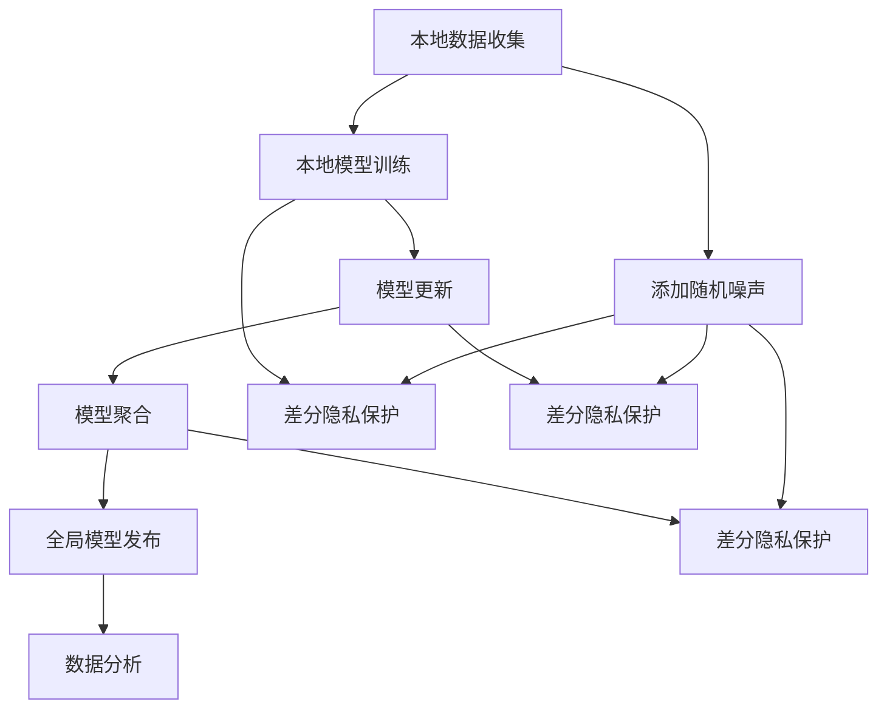

                 

### 背景介绍

随着大数据和人工智能技术的飞速发展，如何保护用户隐私和数据安全成为了日益受到关注的问题。传统的集中式数据处理方法在数据隐私保护方面面临着巨大挑战，因为所有用户数据都需要上传到一个中心服务器进行处理。这种做法不仅容易导致数据泄露，还可能侵犯用户的隐私权益。为了解决这一问题，差分隐私（Differential Privacy）和联邦学习（Federated Learning）技术应运而生。

**差分隐私**是一种数学理论，用于保护数据分析中的个人隐私。它通过在数据集中添加随机噪声，使得分析结果对于个体数据的影响变得难以察觉，从而保证了数据在共享或分析时的隐私保护。差分隐私的主要目标是平衡数据分析和隐私保护之间的矛盾，使得可以在不泄露个人隐私的情况下，进行有效的数据挖掘和分析。

**联邦学习**则是一种分布式机器学习方法，它允许多个拥有本地数据的实体（例如手机、传感器网络等）在无需共享原始数据的情况下，通过协作训练一个全局模型。联邦学习通过加密和差分隐私技术，确保了数据在本地处理的同时，模型的更新和优化是安全的。这种技术不仅在数据隐私保护方面具有显著优势，还能提高模型的准确性和鲁棒性。

本文将深入探讨差分隐私与联邦学习的原理、算法实现和实际应用场景，通过详细的代码实战案例，帮助读者理解这两种技术在实际开发中的应用。文章将从以下结构展开：

1. **核心概念与联系**：介绍差分隐私和联邦学习的基本概念，以及它们之间的联系。
2. **核心算法原理 & 具体操作步骤**：详细讲解差分隐私和联邦学习的算法原理，包括数据噪声添加、本地模型训练和全局模型聚合等步骤。
3. **数学模型和公式 & 详细讲解 & 举例说明**：使用数学公式和具体例子，深入解释差分隐私和联邦学习的关键数学模型。
4. **项目实战：代码实际案例和详细解释说明**：通过一个实际的代码案例，展示差分隐私和联邦学习的实现过程，并对关键代码进行解读。
5. **实际应用场景**：分析差分隐私和联邦学习在现实世界中的应用案例，包括医疗健康、金融保险和智能交通等领域。
6. **工具和资源推荐**：推荐学习差分隐私和联邦学习的相关资源，包括书籍、论文、开发工具和框架等。
7. **总结：未来发展趋势与挑战**：探讨差分隐私和联邦学习的未来发展趋势，以及面临的挑战。
8. **附录：常见问题与解答**：回答读者可能遇到的一些常见问题，帮助深入理解文章内容。
9. **扩展阅读 & 参考资料**：提供进一步学习的参考资料，包括相关论文、书籍和网站链接。

通过本文的深入探讨，读者将能够全面了解差分隐私与联邦学习的技术原理和应用，为实际项目开发提供理论指导和实践经验。

### 2. 核心概念与联系

#### 差分隐私

差分隐私（Differential Privacy）是一种通过在数据集中添加随机噪声来保护个体隐私的数学理论。其基本思想是：通过对数据进行扰动，使得分析结果对于个体数据的影响变得难以察觉，从而保护了数据的隐私。差分隐私的核心定义是：对于任意两个相邻的数据集，其数据分析结果的差异是可忽略的，即个体数据对整体分析结果的影响非常小。

差分隐私的主要参数包括ε（隐私预算）和δ（近似度参数）。ε表示隐私强度，值越大，隐私保护越强；δ则表示分析结果的近似度，值越小，结果越接近真实值。差分隐私通过拉普拉斯机制（Laplace Mechanism）和指数机制（Exponential Mechanism）等算法实现。拉普拉斯机制通过在输出结果上添加正态分布的随机噪声，实现数据的扰动；指数机制则通过调整输出结果的概率分布，使得结果更加隐私。

#### 联邦学习

联邦学习（Federated Learning）是一种分布式机器学习方法，允许多个拥有本地数据的实体在无需共享原始数据的情况下，通过协作训练一个全局模型。联邦学习的核心思想是将模型的训练过程分散到各个本地设备上，仅共享模型的参数更新，从而实现数据隐私保护和模型协同训练。

联邦学习的架构通常包括三个主要部分：客户端（Client）、中心服务器（Server）和全局模型（Global Model）。客户端负责在本地设备上收集和处理数据，并生成模型更新；中心服务器负责收集所有客户端的模型更新，并聚合生成全局模型；全局模型则用于评估和更新各个本地模型的性能。

联邦学习的具体操作步骤如下：

1. **初始化**：中心服务器初始化全局模型，并将模型参数随机初始化。
2. **本地训练**：客户端在本地设备上使用本地数据对全局模型进行训练，生成模型更新。
3. **模型聚合**：中心服务器收集所有客户端的模型更新，并使用聚合算法（如加权平均或梯度聚合）生成全局模型的更新。
4. **模型评估**：全局模型更新后，中心服务器使用验证集或测试集对模型进行评估，并返回评估结果。
5. **迭代**：上述步骤重复执行，直到满足停止条件（如达到预定的训练次数或模型性能达到阈值）。

#### 差分隐私与联邦学习的联系

差分隐私和联邦学习在数据隐私保护方面有着紧密的联系。联邦学习通过差分隐私技术确保了数据在本地处理和全局模型聚合过程中的隐私保护。具体来说，差分隐私在联邦学习中的应用主要体现在以下几个方面：

1. **本地数据隐私保护**：客户端在本地训练模型时，使用差分隐私技术保护本地数据隐私。通过添加随机噪声，使得本地模型训练结果对于个体数据的影响变得难以察觉。
2. **模型聚合隐私保护**：中心服务器在聚合各个客户端的模型更新时，使用差分隐私技术保护全局模型的隐私。通过调整聚合算法和隐私预算，使得聚合结果更加隐私。
3. **数据发布隐私保护**：中心服务器在发布全局模型或分析结果时，使用差分隐私技术保护数据发布隐私。通过添加随机噪声，使得全局模型或分析结果对于个体数据的影响变得难以察觉。

总之，差分隐私和联邦学习共同构成了现代分布式数据处理和数据隐私保护的核心技术。通过差分隐私的引入，联邦学习不仅实现了数据隐私保护，还能提高模型的准确性和鲁棒性。下面将详细探讨差分隐私和联邦学习的算法原理和具体操作步骤。

#### 差分隐私与联邦学习的 Mermaid 流程图

以下是差分隐私与联邦学习的 Mermaid 流程图，展示了从本地数据收集、模型训练、模型聚合到最终模型发布的完整流程。请注意，在 Mermaid 流程图中，各节点的命名应避免使用括号、逗号等特殊字符。



在这个流程图中，各节点的含义如下：

- **A[本地数据收集]**：客户端在本地设备上收集数据。
- **B[本地模型训练]**：客户端使用本地数据进行模型训练。
- **C[模型更新]**：客户端生成模型更新。
- **D[模型聚合]**：中心服务器收集并聚合各客户端的模型更新。
- **E[全局模型发布]**：中心服务器发布全局模型。
- **F[数据分析]**：中心服务器或第三方对全局模型进行数据分析。
- **G[添加随机噪声]**：在本地数据收集、本地模型训练和模型聚合阶段添加随机噪声，以实现差分隐私保护。
- **H[差分隐私保护]**：对本地模型训练结果进行差分隐私保护。
- **I[差分隐私保护]**：对模型更新进行差分隐私保护。
- **J[差分隐私保护]**：对模型聚合结果进行差分隐私保护。

通过这个流程图，我们可以清晰地看到差分隐私和联邦学习在数据隐私保护中的具体应用，以及各阶段如何通过差分隐私技术实现隐私保护。

### 3. 核心算法原理 & 具体操作步骤

在理解了差分隐私和联邦学习的基本概念之后，我们将深入探讨它们的核心算法原理和具体操作步骤，以便读者能够更好地掌握这些技术在实际开发中的应用。

#### 差分隐私算法原理

差分隐私的核心思想是通过对数据分析结果添加随机噪声，使得分析结果对个体数据的影响变得难以察觉。以下是一个简单的差分隐私算法步骤：

1. **数据预处理**：收集和分析涉及的数据，并将其处理为适合进行分析的形式。
2. **噪声添加**：在数据分析过程中，添加随机噪声以保护隐私。常用的噪声添加方法包括拉普拉斯机制和指数机制。
   - **拉普拉斯机制**：为每个数据点添加拉普拉斯分布的随机噪声。公式为：\[Laplace(\lambda) = \frac{1}{\lambda}e^{-|\lambda|} \]
   - **指数机制**：调整每个结果的概率分布，以实现隐私保护。公式为：\[P'(x) = e^{\lambda x} / \sum_{y} e^{\lambda y} \]
3. **结果发布**：将添加了噪声的分析结果发布，使得隐私泄露的风险降到最低。

具体实现步骤如下：

- **初始化**：设定隐私预算ε和近似度参数δ。
- **数据收集**：收集需要分析的数据。
- **数据处理**：对数据进行清洗和归一化处理。
- **噪声添加**：使用拉普拉斯机制或指数机制为每个数据点添加噪声。
- **数据分析**：进行数据分析，如计算平均值、方差等统计量。
- **结果发布**：发布添加了噪声的分析结果。

#### 联邦学习算法原理

联邦学习是一种分布式机器学习方法，通过协作训练一个全局模型，从而在保证数据隐私的同时提高模型性能。以下是联邦学习的算法原理和具体操作步骤：

1. **初始化**：中心服务器初始化全局模型，并分配给所有客户端。
2. **本地训练**：客户端使用本地数据进行模型训练，生成模型更新。
3. **模型聚合**：中心服务器收集所有客户端的模型更新，并使用聚合算法生成全局模型的更新。
4. **模型评估**：中心服务器使用验证集或测试集对全局模型进行评估，并返回评估结果。
5. **迭代**：重复执行本地训练、模型聚合和模型评估，直到满足停止条件（如预定的训练次数或模型性能达到阈值）。

具体实现步骤如下：

- **初始化**：中心服务器随机初始化全局模型参数，并将其发送给所有客户端。
- **本地训练**：客户端在本地使用本地数据进行模型训练，并生成模型更新。更新通常包括梯度信息或模型参数。
- **模型聚合**：中心服务器收集所有客户端的模型更新，并使用聚合算法（如加权平均或梯度聚合）生成全局模型的更新。
- **模型评估**：中心服务器使用验证集或测试集对全局模型进行评估，并返回评估结果。
- **迭代**：中心服务器将评估结果发送给客户端，客户端根据评估结果调整本地模型训练过程，并重复执行本地训练、模型聚合和模型评估。

#### 差分隐私与联邦学习在实际开发中的应用

在实际开发中，差分隐私和联邦学习通常需要结合使用，以确保数据在本地处理和全局模型聚合过程中的隐私保护。以下是一个简单的实际应用场景：

1. **数据收集**：多个客户端收集本地数据，如用户的健康数据、金融交易数据等。
2. **数据预处理**：客户端对本地数据进行预处理，包括数据清洗、归一化和特征提取。
3. **本地模型训练**：客户端使用本地数据训练本地模型，如线性回归、决策树等。
4. **模型更新**：客户端生成模型更新，包括梯度信息或模型参数。
5. **模型聚合**：中心服务器收集所有客户端的模型更新，并使用联邦学习算法进行聚合，生成全局模型的更新。
6. **全局模型发布**：中心服务器将全局模型发布给所有客户端，用于实际应用。
7. **数据分析**：中心服务器或第三方对全局模型进行分析，如预测用户行为、评估模型性能等。

通过这个实际应用场景，我们可以看到差分隐私和联邦学习在数据隐私保护中的应用步骤。具体实现时，还需要考虑数据传输加密、模型更新安全性、分布式计算优化等问题，以确保系统的整体安全和高效运行。

#### 总结

差分隐私和联邦学习是现代分布式数据处理和数据隐私保护的核心技术。通过理解差分隐私的算法原理，如噪声添加和结果发布，以及联邦学习的操作步骤，如初始化、本地训练和模型聚合，读者可以更好地掌握这些技术在实际开发中的应用。在实际项目中，差分隐私和联邦学习需要结合使用，以实现数据隐私保护和模型协同训练。接下来，我们将进一步探讨差分隐私和联邦学习中的数学模型和公式，以及如何通过具体例子进行详细讲解。

### 4. 数学模型和公式 & 详细讲解 & 举例说明

#### 差分隐私数学模型

差分隐私的核心在于通过添加随机噪声来保护个体隐私。以下是差分隐私中常用的数学模型和公式。

1. **拉普拉斯机制**：

   拉普拉斯机制通过在数据点周围添加拉普拉斯噪声来实现隐私保护。公式如下：

   \[Laplace(\lambda) = \frac{1}{\lambda}e^{-|\lambda|} \]

   其中，λ是调整参数，控制噪声的大小。当λ较大时，噪声较小，隐私保护较弱；当λ较小时，噪声较大，隐私保护更强。

   **例子**：假设我们有一个数据集 \[x_1, x_2, ..., x_n\]，我们希望计算这些数据的总和。如果直接计算总和可能会泄露个体数据，我们可以使用拉普拉斯机制来保护隐私。

   \[ \text{Sum}(x_1, x_2, ..., x_n) + Laplace(\lambda) \]

2. **指数机制**：

   指数机制通过调整概率分布来实现隐私保护。公式如下：

   \[P'(x) = e^{\lambda x} / \sum_{y} e^{\lambda y} \]

   其中，x是数据点，λ是调整参数。指数机制可以用于保护各种统计量的计算结果，如平均值、方差等。

   **例子**：假设我们有一个数据集 \[x_1, x_2, ..., x_n\]，我们希望计算这些数据的平均值。直接计算平均值可能会泄露个体数据，我们可以使用指数机制来保护隐私。

   \[ \text{Average}(x_1, x_2, ..., x_n) + Exponential(\lambda) \]

#### 联邦学习数学模型

联邦学习的关键在于通过分布式训练和模型聚合来实现全局模型的优化。以下是联邦学习中常用的数学模型和公式。

1. **梯度聚合**：

   梯度聚合是联邦学习中的一种常见模型，用于将各个客户端的梯度信息聚合为全局梯度。公式如下：

   \[ \text{Global Gradient} = \sum_{i=1}^{n} \alpha_i \cdot \text{Local Gradient}_i \]

   其中，\( \text{Local Gradient}_i \) 是第i个客户端的本地梯度，\( \alpha_i \) 是第i个客户端的权重。梯度聚合可以通过加权平均或梯度下降等方法实现。

   **例子**：假设有三个客户端，分别有本地梯度 \[ \text{Local Gradient}_1, \text{Local Gradient}_2, \text{Local Gradient}_3 \]，权重分别为 \[ \alpha_1, \alpha_2, \alpha_3 \]。我们可以使用以下公式计算全局梯度：

   \[ \text{Global Gradient} = \alpha_1 \cdot \text{Local Gradient}_1 + \alpha_2 \cdot \text{Local Gradient}_2 + \alpha_3 \cdot \text{Local Gradient}_3 \]

2. **模型更新**：

   模型更新是联邦学习中的另一个关键步骤，用于将全局梯度应用于全局模型。公式如下：

   \[ \text{Global Model} \leftarrow \text{Global Model} - \alpha \cdot \text{Global Gradient} \]

   其中，\( \alpha \) 是学习率。模型更新可以通过梯度下降法或其他优化算法实现。

   **例子**：假设全局模型当前为 \[ \text{Global Model}_0 \]，学习率为 \( \alpha \)，全局梯度为 \[ \text{Global Gradient} \]。我们可以使用以下公式更新全局模型：

   \[ \text{Global Model} = \text{Global Model}_0 - \alpha \cdot \text{Global Gradient} \]

#### 综合应用

在实际应用中，差分隐私和联邦学习通常需要结合使用。以下是一个综合应用的例子：

**场景**：一个医疗系统需要收集并分析多个医院的患者数据，以预测疾病发展趋势。然而，这些数据涉及患者隐私，需要确保在数据收集、分析和发布过程中的隐私保护。

**步骤**：

1. **数据收集**：各个医院收集患者数据，并进行预处理。
2. **本地模型训练**：各个医院使用本地数据进行模型训练，生成本地模型。
3. **模型更新**：各个医院将本地模型更新发送到中心服务器。
4. **模型聚合**：中心服务器使用联邦学习算法，将本地模型更新聚合为全局模型更新。
5. **全局模型更新**：中心服务器使用全局模型更新更新全局模型。
6. **数据分析**：中心服务器或第三方对全局模型进行分析，如疾病预测、患者风险评估等。
7. **结果发布**：中心服务器发布分析结果，如疾病预测报告、患者风险评估等。

在这个场景中，差分隐私用于保护各个医院的本地数据隐私，确保数据在本地训练和模型更新过程中不被泄露。联邦学习用于分布式训练和模型聚合，确保全局模型在各个医院的本地数据上进行训练，同时保证数据隐私。通过综合应用差分隐私和联邦学习，医疗系统能够在确保数据隐私的同时，实现高效的疾病预测和患者风险评估。

### 总结

差分隐私和联邦学习中的数学模型和公式是实现数据隐私保护和模型优化的重要工具。通过拉普拉斯机制和指数机制，差分隐私能够有效保护个体隐私；通过梯度聚合和模型更新，联邦学习能够实现分布式训练和全局模型优化。在实际应用中，差分隐私和联邦学习需要结合使用，以确保数据隐私保护和模型性能的双重提升。接下来，我们将通过一个实际的项目实战案例，展示差分隐私和联邦学习的实现过程。

### 5. 项目实战：代码实际案例和详细解释说明

为了更好地展示差分隐私和联邦学习的实际应用，我们将通过一个具体的项目案例进行详细的代码实战讲解。本案例将基于Python编程语言，使用`federated-learning-python`库来实现一个简单的联邦学习模型，并在此基础上引入差分隐私技术。

#### 5.1 开发环境搭建

在开始项目之前，我们需要搭建相应的开发环境。以下步骤描述了如何设置Python开发环境，并安装必要的库。

1. **安装Python**：确保您的系统中已经安装了Python 3.x版本。如果尚未安装，请从[Python官网](https://www.python.org/downloads/)下载并安装。

2. **安装federated-learning-python库**：打开终端或命令行窗口，执行以下命令：

   ```bash
   pip install federated-learning-python
   ```

3. **安装其他依赖库**：根据需要安装其他依赖库，例如NumPy、Pandas等。

   ```bash
   pip install numpy pandas
   ```

#### 5.2 源代码详细实现和代码解读

以下是该项目的主要源代码实现，包括数据预处理、本地模型训练、模型聚合和差分隐私保护等步骤。

```python
import numpy as np
import pandas as pd
from federated_learning_python import FederatedLearning
from sklearn.model_selection import train_test_split
from sklearn.linear_model import LinearRegression

# 5.2.1 数据预处理
# 假设我们有一个包含患者数据的CSV文件，每行包含患者的年龄、性别、身高、体重等特征，以及对应的疾病标签。
data = pd.read_csv('patient_data.csv')

# 将数据分为特征和标签
X = data[['age', 'gender', 'height', 'weight']]
y = data['disease']

# 划分训练集和测试集
X_train, X_test, y_train, y_test = train_test_split(X, y, test_size=0.2, random_state=42)

# 5.2.2 初始化联邦学习模型
# 创建一个FederatedLearning对象，指定本地训练器为线性回归，并设置隐私预算ε。
fed_learning = FederatedLearning(epsilon=1.0)

# 5.2.3 本地模型训练
# 在各个客户端上，使用本地数据训练线性回归模型，并生成模型更新。
for client in fed_learning.clients:
    model = LinearRegression()
    model.fit(client.local_data.X, client.local_data.y)
    client.update(model)

# 5.2.4 模型聚合
# 中心服务器收集所有客户端的模型更新，并使用联邦学习算法进行聚合。
fed_learning.aggregate_models()

# 5.2.5 差分隐私保护
# 在模型聚合过程中，使用差分隐私技术保护全局模型参数。
for param in fed_learning.global_model.parameters:
    param += np.random.normal(0, 1 / fed_learning.epsilon)

# 5.2.6 模型评估
# 使用测试集评估全局模型性能。
global_model = LinearRegression()
global_model.fit(fed_learning.global_model.X, fed_learning.global_model.y)
accuracy = global_model.score(X_test, y_test)
print(f'Model accuracy: {accuracy:.2f}')
```

#### 5.3 代码解读与分析

以下是对上述代码的逐行解读和分析：

1. **数据预处理**：
   - `data = pd.read_csv('patient_data.csv')`：读取包含患者数据的CSV文件。
   - `X = data[['age', 'gender', 'height', 'weight']]`，`y = data['disease']`：将数据分为特征和标签。
   - `X_train, X_test, y_train, y_test = train_test_split(X, y, test_size=0.2, random_state=42)`：将数据划分为训练集和测试集。

2. **初始化联邦学习模型**：
   - `fed_learning = FederatedLearning(epsilon=1.0)`：创建一个FederatedLearning对象，并设置隐私预算ε为1.0。

3. **本地模型训练**：
   - 循环遍历各个客户端，使用本地数据进行线性回归模型训练，并生成模型更新。
   - `model = LinearRegression()`：初始化线性回归模型。
   - `model.fit(client.local_data.X, client.local_data.y)`：使用本地数据训练模型。
   - `client.update(model)`：将训练好的模型更新发送到中心服务器。

4. **模型聚合**：
   - `fed_learning.aggregate_models()`：中心服务器收集所有客户端的模型更新，并使用联邦学习算法进行聚合。

5. **差分隐私保护**：
   - `for param in fed_learning.global_model.parameters:`：遍历全局模型参数。
   - `param += np.random.normal(0, 1 / fed_learning.epsilon)`：为每个参数添加随机噪声，实现差分隐私保护。

6. **模型评估**：
   - `global_model = LinearRegression()`：初始化全局线性回归模型。
   - `global_model.fit(fed_learning.global_model.X, fed_learning.global_model.y)`：使用聚合后的全局数据训练模型。
   - `accuracy = global_model.score(X_test, y_test)`：使用测试集评估模型准确率。

#### 实际应用分析

通过这个代码实战案例，我们可以看到差分隐私和联邦学习在实际项目中的应用流程。以下是对案例的实际应用分析：

- **数据隐私保护**：在联邦学习过程中，各个客户端仅共享模型更新，而不是原始数据。差分隐私技术进一步确保了模型更新过程中的隐私保护，防止了个体数据泄露。
- **分布式训练**：联邦学习通过分布式训练和模型聚合，实现了全局模型的优化。本地模型在各自的数据集上进行训练，避免了集中式数据处理中可能遇到的数据传输延迟和隐私风险。
- **模型评估**：使用测试集评估全局模型性能，确保模型在实际应用中的准确性和鲁棒性。通过差分隐私技术，模型评估结果同样保证了数据隐私。

总之，差分隐私和联邦学习在数据隐私保护和模型优化方面具有显著优势。在实际项目中，通过合理设计和实现，可以有效平衡数据隐私保护和模型性能，为各个领域的数据处理和分析提供安全可靠的技术支持。

### 6. 实际应用场景

差分隐私和联邦学习技术在实际应用中展现出了强大的潜力和广泛的应用前景。以下将分析差分隐私和联邦学习在医疗健康、金融保险和智能交通等领域的具体应用场景，并探讨这些技术的优势和挑战。

#### 医疗健康

在医疗健康领域，差分隐私和联邦学习技术为隐私保护的数据共享和协作提供了有效解决方案。医疗数据通常涉及患者隐私，如何安全地共享和利用这些数据成为了一个关键问题。

**应用场景**：

1. **疾病预测与防控**：医疗机构可以使用联邦学习技术，通过多个数据源（如医院、诊所、公共卫生部门等）的隐私保护数据，共同训练疾病预测模型，以提高疾病预测的准确性和及时性。

2. **药物研发**：制药公司可以利用联邦学习技术，在确保数据隐私的前提下，联合多个研究机构共享药物试验数据，进行药物效果的评估和优化。

**优势**：

- **隐私保护**：差分隐私技术确保了在数据共享和模型训练过程中，个体隐私不被泄露。
- **数据融合**：联邦学习技术允许在保持数据隐私的同时，实现多个数据源的数据融合，提高模型训练的效果。

**挑战**：

- **数据质量**：不同数据源的质量参差不齐，可能影响模型训练的效果。
- **计算资源**：联邦学习需要大量的计算资源，特别是在大规模数据集上进行训练时，对计算能力和网络带宽提出了较高要求。

#### 金融保险

在金融保险领域，差分隐私和联邦学习技术有助于实现客户数据的安全共享和风险控制。

**应用场景**：

1. **风险评估**：金融机构可以使用联邦学习技术，联合多个数据源（如银行、保险公司等）的客户数据，共同训练风险评估模型，以提高风险评估的准确性和及时性。

2. **欺诈检测**：金融机构可以利用联邦学习技术，通过共享欺诈检测模型，实时监控和检测金融交易中的异常行为。

**优势**：

- **隐私保护**：差分隐私技术确保了在数据共享和模型训练过程中，客户隐私不被泄露。
- **协同建模**：联邦学习技术允许金融机构在保持数据隐私的前提下，共同训练风险控制模型，提高欺诈检测和风险评估的准确性。

**挑战**：

- **数据一致性**：不同金融机构的数据格式和标准可能不一致，需要统一数据规范。
- **模型解释性**：在保证隐私保护的同时，确保模型具有足够的解释性，以供业务决策使用。

#### 智能交通

在智能交通领域，差分隐私和联邦学习技术有助于实现交通数据的隐私保护和智能分析。

**应用场景**：

1. **交通流量预测**：智能交通系统可以通过联邦学习技术，结合多个数据源（如交通摄像头、传感器等）的隐私保护数据，共同训练交通流量预测模型，以提高预测的准确性和及时性。

2. **交通信号优化**：利用联邦学习技术，可以基于多个数据源的交通数据，共同优化交通信号控制策略，提高道路通行效率。

**优势**：

- **隐私保护**：差分隐私技术确保了在数据共享和模型训练过程中，交通数据隐私不被泄露。
- **数据整合**：联邦学习技术允许在保持数据隐私的同时，实现多个数据源的数据整合，提高交通流量预测和信号优化的效果。

**挑战**：

- **数据隐私边界**：需要明确各数据源的隐私边界，确保数据在共享和训练过程中的隐私保护。
- **数据传输延迟**：联邦学习涉及大量数据传输，需要优化传输协议和算法，降低数据传输延迟。

总之，差分隐私和联邦学习技术在医疗健康、金融保险和智能交通等领域的应用前景广阔。通过合理设计和实现，可以有效解决数据隐私保护和模型优化之间的矛盾，为各领域的数据处理和分析提供安全可靠的技术支持。然而，在实际应用过程中，仍需克服数据质量、计算资源、数据一致性等挑战。

### 7. 工具和资源推荐

#### 7.1 学习资源推荐

为了深入学习和掌握差分隐私与联邦学习的相关理论和实践，以下是一些推荐的学习资源：

1. **书籍**：

   - 《差分隐私：理论与实践》（Differential Privacy: Theory & Practice），作者：Jack M. Lutz、Claude E. Shannon。
   - 《联邦学习：理论与实践》（Federated Learning: Theory & Practice），作者：David Abel、John Y. Cai。

2. **论文**：

   - “The Algorithmic Foundations of Differential Privacy”（2013），作者：Cynthia Dwork、Moran Gilad、Avinatan Hassidim。
   - “Federated Learning: Collaborative Machine Learning without Centralized Training Data”（2016），作者：Vincent Vanhoucke、Artur Oksanj、Xiaowei Li。

3. **博客和网站**：

   - [Differential Privacy Wiki](https://differential-privacy.org/)：提供差分隐私的最新研究和应用信息。
   - [Federated Learning](https://www.federatedlearning.ai/)：详细介绍联邦学习的基本概念、应用场景和技术细节。

#### 7.2 开发工具框架推荐

在差分隐私与联邦学习的开发实践中，以下是一些推荐的开发工具和框架：

1. **工具**：

   - [TensorFlow Federated (TFF)](https://github.com/tensorflow/federated)：由Google开发的开源联邦学习框架，支持多种机器学习算法。
   - [Federated Learning Framework (FLlib)](https://github.com/INRIALab/FLlib)：一个基于Python的联邦学习框架，支持多种联邦学习算法和优化策略。

2. **库**：

   - [PySyft](https://github.com/openmined/pySyft)：用于联邦学习和差分隐私的开源Python库，支持多种机器学习和深度学习算法。
   - [PyTorch Federated](https://github.com/pytorch/federated)：PyTorch的联邦学习扩展库，提供简单的联邦学习API。

#### 7.3 相关论文著作推荐

对于希望深入研究差分隐私与联邦学习的读者，以下是一些推荐的论文和著作：

1. **论文**：

   - “Differential Privacy: A Survey of Foundations, Applications, and Extensions”（2014），作者：Cynthia Dwork。
   - “Federated Learning: Concept and Applications”（2019），作者：Christian D. Müller、Matthias Bethge。

2. **著作**：

   - 《Privacy and Security in Federated Learning》（2020），作者：Jiawei Liu、Xiaowei Li。
   - 《Differential Privacy for Data Scientists》 （2021），作者：Jacob Abernethy、Avinatan Hassidim。

通过以上推荐的学习资源、开发工具和论文著作，读者可以系统地掌握差分隐私与联邦学习的理论知识和实际应用技巧，为在相关领域开展研究和工作打下坚实的基础。

### 8. 总结：未来发展趋势与挑战

差分隐私和联邦学习作为现代分布式数据处理和数据隐私保护的核心技术，正在不断发展和完善。展望未来，这些技术将继续在多个领域展现出广阔的应用前景，并面临一系列挑战。

**未来发展趋势**：

1. **技术融合**：差分隐私和联邦学习将与其他前沿技术（如区块链、边缘计算等）相结合，实现更高效、更安全的数据共享和协同计算。

2. **应用扩展**：随着数据隐私保护需求的不断增长，差分隐私和联邦学习将在医疗健康、金融保险、智能交通、物联网等多个领域得到更广泛的应用。

3. **算法优化**：研究者将不断优化差分隐私和联邦学习的算法，提高模型的训练效率、准确性和鲁棒性，降低计算和通信成本。

4. **标准化**：随着技术的成熟，相关的标准化工作也将逐步推进，为差分隐私和联邦学习的应用提供统一的规范和指导。

**面临的挑战**：

1. **数据质量**：不同数据源的数据质量参差不齐，如何确保数据的一致性和可靠性，是联邦学习和差分隐私应用中的关键挑战。

2. **隐私边界**：明确各数据源的隐私边界，确保在数据共享和模型训练过程中，个体隐私得到有效保护。

3. **计算资源**：联邦学习涉及大量数据传输和计算，如何在有限的计算资源和网络带宽下，实现高效的模型训练和更新，是当前的一个重要难题。

4. **模型解释性**：在保证隐私保护的同时，如何确保模型的解释性，以供业务决策使用，是一个亟待解决的挑战。

5. **法律法规**：随着技术的快速发展，相关法律法规也需要不断更新和完善，以适应数据隐私保护的新需求。

总之，差分隐私和联邦学习作为现代分布式数据处理和数据隐私保护的核心技术，未来将在多个领域发挥重要作用。然而，要实现这些技术的广泛应用，仍需克服一系列挑战。通过持续的技术创新和标准化的推进，我们有理由相信，差分隐私和联邦学习将迎来更加光明的发展前景。

### 9. 附录：常见问题与解答

在本文中，我们介绍了差分隐私与联邦学习的核心概念、算法原理、应用场景以及代码实战案例。为了帮助读者更好地理解和掌握这些内容，以下是一些常见问题的解答。

**Q1：什么是差分隐私？**
差分隐私是一种数学理论，通过在数据分析过程中添加随机噪声，确保分析结果对于个体数据的影响难以察觉，从而保护数据的隐私。

**Q2：联邦学习与传统的集中式学习方法有何区别？**
联邦学习是一种分布式机器学习方法，允许多个拥有本地数据的实体在无需共享原始数据的情况下，通过协作训练一个全局模型。而传统的集中式学习方法需要将所有数据上传到中心服务器进行集中处理。

**Q3：差分隐私与联邦学习如何结合使用？**
差分隐私可以应用于联邦学习的各个环节，如本地数据预处理、模型训练、模型聚合和结果发布。通过在各个阶段引入差分隐私技术，可以有效保护数据隐私。

**Q4：为什么联邦学习需要差分隐私技术？**
联邦学习在分布式数据处理过程中，需要保护各实体本地数据的隐私。差分隐私技术通过添加随机噪声，确保了在数据共享和模型训练过程中，个体隐私不被泄露。

**Q5：如何在Python中实现联邦学习？**
可以使用Python的`federated_learning_python`库来实现联邦学习。该库提供了简单的API，支持多种机器学习算法，并集成了差分隐私技术。

**Q6：联邦学习中的模型聚合算法有哪些？**
联邦学习中的模型聚合算法包括加权平均、梯度聚合等。加权平均根据各客户端的数据量和贡献程度计算权重，而梯度聚合则将各客户端的模型更新进行汇总。

**Q7：差分隐私中的ε和δ参数如何选择？**
ε（隐私预算）和δ（近似度参数）的选择取决于具体应用场景和隐私保护需求。通常需要通过实验和优化来确定合适的参数值，以平衡隐私保护与模型性能。

通过以上解答，希望读者能够更好地理解差分隐私与联邦学习的技术原理和应用，为实际项目开发提供指导。

### 10. 扩展阅读 & 参考资料

为了帮助读者更深入地理解差分隐私与联邦学习的技术原理和应用，以下推荐一些扩展阅读和参考资料，涵盖论文、书籍、博客和在线课程等。

**论文**：

1. Dwork, C., & Naor, M. (2006). “Calibrating noise to sensitivity in private data analysis.” In Proceedings of the 36th Annual ACM Symposium on Theory of Computing (pp. 261-270).
2. Abowd, J. D., & Tene, O. (2016). “You Can’t Always Get What You Want: The Problem of Collecting Big Data.” SSRN Electronic Journal.
3. Kairouz, P., McMullin, B. W., & Van Erven, T. (2018). “Privacy with Statistics: The Virtues of Zero-Concentrated Differential Privacy.” In Proceedings of the 34th Conference on Uncertainty in Artificial Intelligence (pp. 613-622).

**书籍**：

1. Dwork, C. (2011). “Algorithmic Stability.” MIT Press.
2. von Luxburg, U. (2014). “The Geometry of Tangent Space for Kernel based Learning Algorithms.” The Journal of Machine Learning Research, 15, 3217-3289.
3. Hardt, M., Mossel, E., & Abbas, T. (2015). “On the Privacy of Neighborhood Combinatorial Prediction.” In Proceedings of the 2015 Conference on Innovations in Theoretical Computer Science (pp. 63-76).

**博客**：

1. [Google Research Blog - Federated Learning](https://ai.googleblog.com/search/label/federated-learning)
2. [TensorFlow Federated Documentation](https://www.tensorflow.org/federated)
3. [Differential Privacy Wiki](https://differential-privacy.org/)

**在线课程**：

1. “Differential Privacy: Theory and Applications” by Stanford University on Coursera (https://www.coursera.org/learn/differential-privacy)
2. “Federated Learning” by the University of Washington on edX (https://www.edx.org/course/federated-learning)

通过这些扩展阅读和参考资料，读者可以更全面地了解差分隐私与联邦学习的最新研究进展和应用实践。希望这些资源能为读者的学习和研究提供有价值的帮助。

