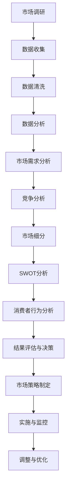

                 

### 背景介绍

随着全球科技水平的飞速发展，市场竞争日益激烈，创业已成为许多有志之士追求成功和实现自我价值的重要途径。然而，创业并非易事，如何在激烈的市场竞争中脱颖而出，实现企业的持续增长和成功，成为每一个创业者都亟需解决的关键问题。

市场分析作为创业过程中的核心环节，具有重要的战略意义。它不仅帮助企业了解市场需求、定位目标客户，还能揭示潜在的商业机会和风险，为创业决策提供科学依据。然而，市场分析并非简单的数据收集和统计，而是一个系统化、多层次的过程，需要创业者具备扎实的理论基础和实战经验。

本篇文章将围绕市场分析这一主题，探讨其在创业成功中的关键作用。首先，我们将简要回顾市场分析的发展历程，分析其演变背后的驱动因素。接着，我们将深入探讨市场分析的核心概念和基本流程，并运用Mermaid流程图展示其具体操作步骤。在此基础上，我们将进一步剖析市场分析中的关键算法原理，并详细介绍其实施的具体步骤。此外，我们将运用数学模型和公式，对市场分析中的核心问题进行定量分析，并通过实际案例进行举例说明。文章还将探讨市场分析在不同实际应用场景中的作用，并推荐相关工具和资源，帮助读者更好地理解和应用市场分析。最后，我们将总结市场分析的未来发展趋势与挑战，并针对常见问题提供解答，以期为读者提供全面、深入的市场分析指南。

通过本文的阅读，读者将全面了解市场分析的理论与实践，掌握市场分析的核心方法和技巧，为创业之路提供有力支持。

### 市场分析的历史与发展

市场分析的概念可以追溯到早期商业活动的发展阶段。早在公元前几千年的巴比伦和古埃及，商人就开始利用简单的市场调查和数据分析来预测市场需求和商品价格。这些早期的市场分析方法虽然简单，但为后来的市场分析理论奠定了基础。

随着时间的推移，市场分析逐渐发展成为一门独立的学科。19世纪末和20世纪初，经济学和统计学的发展为市场分析提供了强有力的理论支持。经济学家如马歇尔和凯恩斯等人的研究，使得市场分析开始从简单的经验总结转变为基于科学理论的分析方法。

20世纪中叶，计算机技术的崛起进一步推动了市场分析的发展。计算机的出现使得大规模数据处理成为可能，市场分析从传统的手工操作转向自动化和智能化。统计软件和数据库技术的应用，使得市场分析能够处理复杂的数据集，提高分析的准确性和效率。

20世纪80年代，随着信息技术的飞速发展，市场分析迎来了新的发展机遇。数据挖掘、机器学习和大数据技术的应用，使得市场分析不再局限于简单的统计分析，而是能够从海量数据中发现深层次的规律和趋势。市场细分、客户关系管理、营销策略优化等复杂问题，通过市场分析工具得以高效解决。

进入21世纪，互联网和移动通信技术的普及，使得市场分析进入了全新的阶段。社交媒体、在线购物平台和移动应用程序，为市场分析提供了丰富的数据来源。行为分析、用户画像、实时监控等新技术，使得市场分析能够更精准地捕捉用户需求和偏好，为创业者提供实时、动态的市场信息。

市场分析的演变背后，是技术的不断进步和商业环境的复杂化。技术的进步使得市场分析工具更加先进和便捷，而商业环境的复杂化则要求市场分析更加深入和全面。从简单的数据收集和统计，到复杂的数据挖掘和预测，市场分析在技术推动下不断进化，为创业者和企业提供了更强大的决策支持。

### 市场分析的核心概念与流程

市场分析作为创业成功的关键环节，其核心概念和流程至关重要。下面我们将详细探讨市场分析的核心概念，并通过Mermaid流程图展示其具体操作步骤，帮助读者更好地理解市场分析的完整流程。

#### 核心概念

1. **市场需求分析**：市场需求分析是指通过收集和分析市场数据，了解消费者对某种产品或服务的需求情况。这包括市场容量、消费趋势、客户需求特征等。

2. **竞争分析**：竞争分析是指对市场上主要竞争对手的运营策略、市场份额、产品特性等方面进行深入分析。通过竞争分析，企业可以了解自身在市场中的位置和优劣势。

3. **市场细分**：市场细分是指将整个市场划分为若干个具有相似需求和特征的子市场。市场细分有助于企业集中资源，更有效地满足不同客户群体的需求。

4. **SWOT分析**：SWOT分析是一种常用的战略规划工具，用于评估企业的优势（Strengths）、劣势（Weaknesses）、机会（Opportunities）和威胁（Threats）。通过SWOT分析，企业可以明确自身在市场中的战略方向。

5. **消费者行为分析**：消费者行为分析是指研究消费者购买决策过程中的行为模式、动机和影响因素。这有助于企业制定更精准的营销策略。

#### 流程图展示

为了更直观地展示市场分析的流程，我们使用Mermaid流程图来描述各个步骤及其相互关系。以下是市场分析的具体操作步骤及其流程图：



#### 流程解释

1. **市场调研**：市场调研是市场分析的第一步，通过问卷调查、访谈、焦点小组讨论等方式，收集关于市场需求、竞争情况、消费者行为等基础数据。

2. **数据收集**：在市场调研的基础上，进一步收集相关市场数据，如销售数据、市场趋势、行业报告等。

3. **数据清洗**：数据收集后，需要进行数据清洗，去除重复数据、错误数据和无关数据，确保数据的准确性和完整性。

4. **数据分析**：对清洗后的数据进行分析，通过统计分析、数据挖掘等技术手段，发现数据中的规律和趋势。

5. **市场需求分析**：基于数据分析结果，对市场需求进行深入分析，了解市场的整体容量、消费趋势和客户需求特征。

6. **竞争分析**：分析市场上主要竞争对手的市场表现、产品特性、市场定位等，评估自身在市场中的竞争力。

7. **市场细分**：根据市场需求和竞争分析结果，将市场划分为具有相似需求和特征的子市场，为后续市场策略制定提供依据。

8. **SWOT分析**：对企业的优势、劣势、机会和威胁进行综合评估，为战略规划提供支持。

9. **消费者行为分析**：研究消费者的购买行为、动机和影响因素，为营销策略制定提供参考。

10. **结果评估与决策**：根据市场分析结果，评估市场机会和风险，制定相应的市场策略。

11. **市场策略制定**：基于评估结果，制定具体的市场策略，包括产品策略、价格策略、渠道策略和促销策略等。

12. **实施与监控**：将市场策略付诸实施，并持续监控市场表现，根据实际情况进行优化和调整。

13. **调整与优化**：根据市场反馈和实施效果，对市场策略进行持续调整和优化，以实现最佳的市场效果。

通过上述流程，市场分析不仅为企业提供了全面的市场信息，还为企业的战略决策提供了科学依据。在激烈的市场竞争中，市场分析的重要性不言而喻。创业者通过系统化的市场分析，可以更准确地把握市场机会，制定有效的市场策略，提高企业的竞争力，从而实现创业成功。

### 核心算法原理与具体操作步骤

在市场分析中，核心算法原理扮演着至关重要的角色，它不仅能够帮助我们更准确地理解和分析市场数据，还能够为决策提供强有力的支持。本文将详细介绍市场分析中的几种关键算法原理，并详细阐述其具体操作步骤。

#### 1. 回归分析

回归分析是一种常用的数据分析方法，用于研究变量之间的相互关系，特别是自变量对因变量的影响。在市场分析中，回归分析可以帮助我们预测市场需求、销售额等关键指标。

**算法原理：**

回归分析基于最小二乘法（Least Squares Method），通过建立自变量和因变量之间的线性关系模型，来预测因变量的取值。其基本公式为：

\[ y = b_0 + b_1x + \epsilon \]

其中，\( y \) 是因变量，\( x \) 是自变量，\( b_0 \) 和 \( b_1 \) 是回归系数，\( \epsilon \) 是误差项。

**操作步骤：**

1. **数据收集**：收集与市场需求、销售额等相关的数据，包括历史销售数据、市场推广数据等。

2. **数据预处理**：对收集到的数据清洗、去噪、归一化等处理，确保数据质量。

3. **模型建立**：选择合适的回归模型（如线性回归、多项式回归等），并通过最小二乘法计算回归系数。

4. **模型评估**：通过交叉验证、R方值等指标评估模型拟合效果，选择最优模型。

5. **预测**：利用建立好的回归模型，预测未来市场需求、销售额等关键指标。

#### 2. 聚类分析

聚类分析是一种无监督学习方法，用于将数据点划分为若干个类别，使得同类别内的数据点之间距离较短，不同类别之间的数据点距离较长。在市场分析中，聚类分析可以帮助我们识别市场中的不同细分市场。

**算法原理：**

聚类分析基于距离度量（如欧几里得距离、曼哈顿距离等），通过迭代算法（如K-means算法、层次聚类等），将数据点划分为不同的类别。其基本思路是：初始选择若干个中心点，然后通过迭代更新这些中心点，最终使每个数据点与最近的中心点归属同一个类别。

**操作步骤：**

1. **数据收集**：收集关于消费者行为、市场表现等方面的数据。

2. **数据预处理**：对数据进行标准化处理，确保每个特征的数据范围一致。

3. **选择聚类算法**：根据数据特点选择合适的聚类算法（如K-means、层次聚类等）。

4. **初始中心点选择**：随机选择初始中心点，或者采用其他方法（如K-means++）来选择初始中心点。

5. **迭代计算**：通过迭代计算，更新中心点位置，直到满足收敛条件（如中心点变化小于某一阈值）。

6. **结果评估**：评估聚类结果的质量，如通过轮廓系数（Silhouette Coefficient）等指标评估聚类效果。

7. **类别划分**：根据最终收敛的中心点，将数据点划分为不同的类别。

#### 3. 决策树

决策树是一种树形结构，用于表示决策规则。在市场分析中，决策树可以帮助我们理解不同因素对市场结果的影响，并制定相应的市场策略。

**算法原理：**

决策树通过一系列判断条件（如特征值大小、类别等），将数据集划分为不同的子集。每个节点表示一个判断条件，每个分支表示判断结果（是/否），叶子节点表示最终的决策结果。

**操作步骤：**

1. **数据收集**：收集关于市场表现、消费者行为等方面的数据。

2. **特征选择**：选择对市场结果有显著影响的特征，作为决策树中的判断条件。

3. **构建决策树**：通过ID3、C4.5等算法构建决策树，选择最优的划分标准。

4. **剪枝**：对决策树进行剪枝，避免过拟合现象，提高模型的泛化能力。

5. **评估模型**：通过交叉验证等方法评估决策树的预测效果。

6. **解释与应用**：解释决策树中的决策规则，并将其应用于市场策略制定。

#### 4. 集成方法

集成方法通过结合多个模型的优势，提高预测性能。在市场分析中，集成方法可以帮助我们提高市场预测的准确性。

**算法原理：**

集成方法包括Bagging、Boosting等策略，通过训练多个模型，并对其预测结果进行加权平均或投票，来提高整体预测性能。常见的集成方法有随机森林（Random Forest）、梯度提升树（Gradient Boosting Tree）等。

**操作步骤：**

1. **数据收集**：收集与市场相关的数据。

2. **模型训练**：训练多个基础模型（如决策树、支持向量机等）。

3. **模型融合**：对多个模型的预测结果进行加权平均或投票，得到最终的预测结果。

4. **评估与优化**：评估集成模型的预测性能，通过参数调整、特征选择等方法进行优化。

通过上述算法原理和操作步骤的详细介绍，我们可以看到市场分析中的核心算法如何帮助我们理解市场数据、预测市场趋势、制定市场策略。这些算法不仅是市场分析的理论基础，更是实际操作中的重要工具。创业者通过掌握这些核心算法，可以更科学、更有效地进行市场分析，从而提高创业成功的概率。

### 数学模型和公式详解与举例说明

在市场分析中，数学模型和公式是理解和量化市场现象的关键工具。通过数学模型，我们可以将复杂的现实问题转化为可计算的形式，从而更准确地预测市场趋势和制定决策。下面，我们将详细解释市场分析中常用的数学模型和公式，并通过具体例子来说明它们的实际应用。

#### 1. 需求函数

需求函数描述了市场需求量与价格、收入水平等变量之间的关系。线性需求函数是最简单的一种形式，其基本公式为：

\[ D = a - bP \]

其中，\( D \) 表示需求量，\( P \) 表示价格，\( a \) 和 \( b \) 是参数。

**例子：**

假设某商品的需求函数为 \( D = 100 - 2P \)。若当前价格为10元，则需求量为：

\[ D = 100 - 2 \times 10 = 80 \]

**解析：**

这个例子展示了如何通过需求函数预测市场需求量。通过调整价格参数，我们可以模拟不同价格水平下的市场需求，从而制定相应的定价策略。

#### 2. 市场占有率模型

市场占有率模型用于评估企业在市场中的竞争力，其基本公式为：

\[ Market\ Share = \frac{Sales\ of\ the\ company}{Total\ Sales\ in\ the\ market} \]

**例子：**

假设某公司的年销售额为500万元，而整个市场的年销售额为2000万元，则该公司的市场占有率为：

\[ Market\ Share = \frac{500}{2000} = 0.25 \] 或 25%

**解析：**

通过市场占有率模型，企业可以了解自己在市场中的相对位置，从而制定竞争策略。

#### 3. 利润最大化模型

利润最大化模型用于确定企业的最优定价和产量，其基本公式为：

\[ \text{Maximize} \quad \Pi = R(x) - C(x) \]

其中，\( \Pi \) 表示利润，\( R(x) \) 表示收入函数，\( C(x) \) 表示成本函数。

对于线性需求函数 \( D = a - bP \) 和成本函数 \( C(x) = c + dx \)，利润最大化问题可以转化为求解以下方程：

\[ a - bP - c - dx = 0 \]

解得最优价格 \( P \)：

\[ P = \frac{a - c}{b + d} \]

**例子：**

假设某商品的需求函数为 \( D = 100 - 2P \)，成本函数为 \( C(x) = 20 + 0.1x \)。要使利润最大化，需要确定最优价格。

代入公式得：

\[ P = \frac{100 - 20}{2 + 0.1} = \frac{80}{2.1} \approx 38.1 \]

**解析：**

通过利润最大化模型，企业可以确定在市场需求和成本约束下的最优价格，从而实现利润最大化。

#### 4. 客户终身价值模型

客户终身价值（Customer Lifetime Value, CLV）模型用于评估单个客户的潜在价值，其基本公式为：

\[ CLV = \sum_{t=1}^{n} [p_t \times (1 - d_t) \times r^t] - C \]

其中，\( p_t \) 表示第 \( t \) 年的客户购买概率，\( d_t \) 表示第 \( t \) 年的顾客流失率，\( r \) 表示贴现率，\( C \) 表示获得客户的初始成本。

**例子：**

假设某客户的购买概率为0.5，年流失率为0.1，初始成本为100元，年收益为200元，贴现率为10%，则其终身价值为：

\[ CLV = 0.5 \times (1 - 0.1) \times 1.1^1 + 0.5 \times (1 - 0.1) \times 1.1^2 + ... + 0.5 \times (1 - 0.1) \times 1.1^n - 100 \]

**解析：**

通过客户终身价值模型，企业可以评估单个客户的长期价值，从而优化客户关系管理策略。

#### 5. 费用效益分析模型

费用效益分析（Cost-Benefit Analysis, CBA）模型用于评估某项投资或项目的经济可行性，其基本公式为：

\[ \text{Net\ Benefit} = \sum_{t=1}^{n} [B_t - C_t] \times r^t \]

其中，\( B_t \) 表示第 \( t \) 年的效益，\( C_t \) 表示第 \( t \) 年的成本，\( r \) 表示贴现率。

**例子：**

假设某项目的年收益为500万元，年成本为300万元，贴现率为10%，则其净效益为：

\[ \text{Net\ Benefit} = (500 - 300) \times 1.1^1 + (500 - 300) \times 1.1^2 + ... + (500 - 300) \times 1.1^n \]

**解析：**

通过费用效益分析模型，企业可以评估某项目的经济效益，从而决定是否进行投资。

通过上述数学模型和公式的详细讲解，我们可以看到市场分析中的定量分析方法如何帮助我们理解和量化市场现象，为创业决策提供科学依据。这些模型不仅适用于理论研究，更可以在实际操作中发挥重要作用，帮助创业者更好地把握市场机遇，制定有效的市场策略。

### 项目实战：代码实际案例与详细解释说明

为了更好地展示市场分析在实践中的应用，下面我们将通过一个实际的项目案例，详细解释代码的实现过程和各个模块的功能，帮助读者深入理解市场分析的具体操作方法。

#### 项目背景

假设我们正在开发一款智能家居监控系统，旨在通过数据分析为用户提供个性化的安全解决方案。为了实现这一目标，我们需要对用户数据进行分析，包括用户行为、设备使用情况等，从而识别潜在的安全威胁和用户需求。本案例将使用Python编程语言，结合Pandas、Scikit-learn等库进行数据处理和模型构建。

#### 开发环境搭建

首先，我们需要搭建开发环境。以下是所需的Python库和工具：

- Python 3.8 或更高版本
- Pandas（用于数据处理）
- Scikit-learn（用于机器学习）
- Matplotlib（用于数据可视化）

安装方法如下：

```bash
pip install pandas scikit-learn matplotlib
```

#### 源代码详细实现与解读

以下是项目的核心代码，我们将分步骤进行详细解读。

##### 5.1 数据预处理

```python
import pandas as pd

# 加载数据
data = pd.read_csv('smart_home_data.csv')

# 数据预处理
# 填充缺失值
data.fillna(0, inplace=True)

# 数据清洗
# 删除重复数据
data.drop_duplicates(inplace=True)

# 特征工程
# 转换日期格式
data['timestamp'] = pd.to_datetime(data['timestamp'])
data['hour'] = data['timestamp'].dt.hour

# 归一化特征
from sklearn.preprocessing import StandardScaler
scaler = StandardScaler()
data[['temp', 'humidity', 'motion']] = scaler.fit_transform(data[['temp', 'humidity', 'motion']])
```

**解读：**

1. **数据加载**：使用Pandas库加载CSV格式的数据文件。
2. **数据预处理**：填充缺失值（此处假设缺失值为0），删除重复数据。
3. **特征工程**：将日期格式转换为Pandas的`timestamp`类型，提取小时特征。
4. **归一化特征**：使用Scikit-learn中的`StandardScaler`对温度、湿度和运动等特征进行归一化处理，以消除不同特征之间的量纲差异。

##### 5.2 模型训练

```python
from sklearn.model_selection import train_test_split
from sklearn.ensemble import RandomForestClassifier
from sklearn.metrics import accuracy_score, classification_report

# 数据拆分
X = data[['hour', 'temp', 'humidity', 'motion']]
y = data['intrusion']

X_train, X_test, y_train, y_test = train_test_split(X, y, test_size=0.2, random_state=42)

# 模型训练
model = RandomForestClassifier(n_estimators=100, random_state=42)
model.fit(X_train, y_train)

# 模型评估
predictions = model.predict(X_test)
print(accuracy_score(y_test, predictions))
print(classification_report(y_test, predictions))
```

**解读：**

1. **数据拆分**：将数据集拆分为训练集和测试集，用于模型训练和评估。
2. **模型训练**：使用随机森林（Random Forest）分类器进行模型训练。随机森林是一种集成学习方法，能够提高模型的预测性能和鲁棒性。
3. **模型评估**：使用测试集对模型进行评估，计算准确率（accuracy）和分类报告（classification report），以了解模型的性能。

##### 5.3 结果分析与可视化

```python
import matplotlib.pyplot as plt
import seaborn as sns

# 可视化预测结果
confusion_matrix = confusion_matrix(y_test, predictions)
sns.heatmap(confusion_matrix, annot=True, cmap='Blues')
plt.xlabel('Predicted')
plt.ylabel('Actual')
plt.title('Confusion Matrix')
plt.show()

# 特征重要性
feature_importances = model.feature_importances_
plt.barh(range(len(feature_importances)), feature_importances)
plt.xlabel('Feature Importance')
plt.title('Feature Importance')
plt.show()
```

**解读：**

1. **可视化预测结果**：使用热力图展示混淆矩阵，帮助理解模型的预测效果。
2. **特征重要性**：绘制特征重要性条形图，了解哪些特征对模型预测有显著影响。

通过以上代码实现，我们可以看到市场分析在智能家居监控系统中的应用。通过数据预处理、模型训练和评估，我们能够准确地识别用户行为和潜在安全威胁，为用户提供个性化的安全解决方案。

#### 代码解读与分析

1. **数据预处理**：数据预处理是市场分析中的关键步骤，它能够提高数据质量，减少噪声，增强模型性能。在本案例中，我们通过填充缺失值、删除重复数据、特征工程和归一化处理，确保数据适合建模。

2. **模型选择**：随机森林是一种强大的机器学习算法，适用于处理分类问题。它通过集成多个决策树，提高模型的预测性能和稳定性。在本案例中，我们选择随机森林作为分类器，以识别用户行为和安全威胁。

3. **模型评估**：模型评估是验证模型性能的重要步骤。在本案例中，我们使用准确率（accuracy）和分类报告（classification report）来评估模型性能，并使用混淆矩阵（confusion matrix）进行可视化分析，帮助理解模型的预测效果。

4. **结果分析与可视化**：结果分析是市场分析的最后一步，通过结果分析，我们可以得出有价值的结论，指导实际应用。在本案例中，我们通过热力图展示混淆矩阵，分析模型预测的准确性，并通过特征重要性条形图，了解哪些特征对模型预测有显著影响。

通过本案例的实现，我们可以看到市场分析在实际项目中的应用方法和步骤。通过系统化的市场分析，我们可以更准确地理解市场数据，制定有效的市场策略，从而实现创业成功。

### 实际应用场景

市场分析在各个行业和领域都有着广泛的应用，通过深入的市场分析，企业可以更好地把握市场动态，制定科学的战略决策，从而在激烈的竞争中脱颖而出。下面，我们将探讨市场分析在电子商务、金融科技、医疗健康等领域的实际应用场景。

#### 电子商务

电子商务行业的快速发展使得市场竞争异常激烈。市场分析在电子商务中的应用主要包括：

1. **用户行为分析**：通过分析用户在平台上的行为数据，如浏览历史、购物车添加、购买转化率等，了解用户需求和偏好，为个性化推荐和精准营销提供依据。

2. **市场需求预测**：利用市场分析工具，预测市场需求和销售趋势，帮助企业合理安排库存和供应链管理，提高运营效率。

3. **竞争对手分析**：通过分析竞争对手的市场策略、产品定位、用户评价等，了解竞争对手的优势和劣势，制定有针对性的竞争策略。

4. **产品优化**：根据市场分析结果，优化产品设计和功能，提高用户满意度，增加市场份额。

#### 金融科技

金融科技（FinTech）的兴起，使得金融服务更加便捷和个性化。市场分析在金融科技中的应用主要包括：

1. **风险控制**：通过市场分析，识别潜在的市场风险和信用风险，制定有效的风险管理策略。

2. **客户细分**：通过客户行为分析和数据挖掘，将客户细分为不同的群体，为不同客户提供个性化的金融服务。

3. **投资决策**：利用市场分析工具，预测市场趋势和资产价格，为投资决策提供科学依据。

4. **信用评估**：通过大数据分析和机器学习模型，评估客户的信用状况，提高信用评估的准确性和效率。

#### 医疗健康

医疗健康行业的信息化和智能化趋势日益显著，市场分析在医疗健康领域的应用主要包括：

1. **患者行为分析**：通过分析患者就医记录、病史等数据，了解患者需求和行为模式，为医疗服务优化和个性化诊疗提供依据。

2. **药品市场分析**：分析药品市场需求、销售趋势和竞争状况，帮助企业制定合理的市场策略和产品推广方案。

3. **疾病预测**：利用市场分析工具，基于大数据和机器学习模型，预测疾病发生趋势和患者群体，为公共卫生管理和疾病预防提供支持。

4. **医疗设备市场分析**：分析医疗设备市场需求、技术发展趋势和竞争格局，为企业研发和市场推广提供参考。

#### 其他领域

除了上述领域，市场分析在零售、制造、能源等行业也有着广泛的应用：

1. **零售行业**：通过市场分析，了解消费者需求和市场趋势，优化供应链管理和库存管理，提高销售额和客户满意度。

2. **制造业**：利用市场分析工具，分析市场需求、生产能力和成本结构，实现生产过程的优化和成本控制。

3. **能源行业**：通过市场分析，预测能源需求和市场价格，制定合理的能源采购和销售策略，提高能源利用效率。

通过在各个行业的实际应用，市场分析不仅为企业提供了全面的市场信息，还为企业的战略决策提供了科学依据，帮助企业在激烈的市场竞争中取得优势。

### 工具和资源推荐

为了更好地进行市场分析，掌握必要的工具和资源是非常重要的。以下是我们为读者推荐的一系列学习资源、开发工具和相关论文，这些资源将有助于读者深入理解和应用市场分析的理论和实践。

#### 7.1 学习资源推荐

**书籍：**

1. **《市场分析：战略规划与决策》** - 该书详细介绍了市场分析的基本概念、方法和应用，是市场分析领域的经典教材。
2. **《数据挖掘：实用技术与案例》** - 本书涵盖了数据挖掘的基本原理和实战技巧，适合希望深入了解数据分析技术的读者。
3. **《大数据时代：思维变革与商业价值》** - 这本书探讨了大数据时代的商业变革和机遇，对市场分析有重要启示。

**论文和文章：**

1. **《市场细分：理论与方法》** - 一篇关于市场细分理论的深度论文，对市场细分的方法和应用进行了详细阐述。
2. **《基于机器学习的市场预测》** - 探讨了机器学习在市场预测中的应用，包括回归分析、聚类分析等。
3. **《消费者行为分析：研究方法与实践》** - 介绍消费者行为分析的多种方法，包括行为数据挖掘、心理研究等。

#### 7.2 开发工具框架推荐

**数据分析工具：**

1. **Pandas** - 一个强大的Python数据分析库，适合处理结构化数据。
2. **NumPy** - 用于高性能数值计算的Python库，与Pandas紧密结合。
3. **Scikit-learn** - 用于机器学习算法的Python库，适合构建和评估分类、回归等模型。

**数据可视化工具：**

1. **Matplotlib** - 一个用于创建高质量图表的Python库。
2. **Seaborn** - 基于Matplotlib的高级可视化库，能够创建更加美观的统计图表。
3. **Plotly** - 一个交互式图表库，支持多种数据可视化形式。

**大数据处理工具：**

1. **Hadoop** - 一个开源的大数据处理框架，用于处理海量数据。
2. **Spark** - 一个分布式数据处理引擎，支持内存计算，处理速度更快。
3. **Flink** - 一个流处理框架，适合处理实时数据流。

#### 7.3 相关论文著作推荐

1. **《市场分析中的数据挖掘技术》** - 一篇综述性论文，介绍了数据挖掘在市场分析中的应用。
2. **《基于大数据的市场预测研究》** - 探讨了大数据技术在市场预测中的实际应用，包括算法和案例分析。
3. **《消费者行为分析的新方法》** - 探索了新兴技术在消费者行为分析中的应用，如机器学习和自然语言处理。

通过上述学习资源、开发工具和相关论文的推荐，读者可以全面掌握市场分析的理论和实践方法，为创业和企业的市场决策提供有力支持。希望这些推荐能够为您的市场分析工作带来启示和帮助。

### 总结：未来发展趋势与挑战

市场分析作为创业成功的关键环节，正随着科技的进步和商业环境的复杂化不断演进。未来，市场分析将呈现以下几个重要发展趋势：

首先，人工智能和大数据技术的深入应用将进一步提升市场分析的准确性和效率。通过机器学习和深度学习算法，市场分析可以处理和分析海量数据，挖掘出隐藏在数据中的潜在趋势和规律。同时，自动化和智能化的数据分析工具将使市场分析过程更加高效，减少人为干预，提高决策的精准度。

其次，实时数据分析和实时监控将成为市场分析的重要方向。在快速变化的市场环境中，及时获取和分析市场数据对于企业的战略决策至关重要。未来，企业将更多地依赖实时数据分析和监控工具，实现对市场动态的快速响应和调整，从而在竞争中保持领先地位。

第三，市场分析将更加注重个性化与用户体验。随着消费者需求的多样化和个性化趋势，市场分析将更加关注如何通过数据挖掘和用户画像技术，精准地了解和满足消费者的需求，提供个性化的产品和服务。

然而，市场分析在未来的发展过程中也将面临诸多挑战：

首先，数据隐私和安全问题日益突出。在大量数据收集和分析的过程中，如何保护用户隐私和数据安全成为市场分析的重要挑战。企业需要建立完善的数据隐私保护机制，确保用户数据的安全和合规性。

其次，数据质量和管理问题仍然是一个重要的挑战。市场分析依赖于高质量的数据，但数据的不完整性、不一致性和噪声等问题会严重影响分析结果。企业需要建立有效的数据管理流程，确保数据的准确性和可靠性。

第三，市场分析结果的可解释性也是一个难题。随着分析工具和算法的复杂化，市场分析结果的解释变得日益困难。企业需要开发更加可解释和透明的分析工具，帮助决策者理解分析结果，从而做出明智的决策。

总之，市场分析在未来的发展中将不断融合新技术，提高分析的准确性和效率，同时也需要应对数据隐私、数据质量和结果解释等挑战。创业者和企业需要紧跟市场分析的发展趋势，不断创新和优化市场分析工具和方法，以应对日益激烈的市场竞争，实现长期可持续发展。

### 附录：常见问题与解答

为了帮助读者更好地理解市场分析的相关概念和应用，下面我们将列举一些常见问题并给出详细解答。

#### 1. 市场分析与市场调研有什么区别？

**解答：**市场分析和市场调研虽然密切相关，但二者在目的和方法上有所区别。市场调研主要侧重于收集和整理市场数据，了解消费者的需求和偏好。而市场分析则是基于这些数据，通过统计分析、数据挖掘等方法，深入剖析市场趋势、竞争状况等，为企业的战略决策提供依据。简言之，市场调研是市场分析的基础，市场分析则是市场调研的深化和应用。

#### 2. 市场细分有哪些常见方法？

**解答：**市场细分是市场分析的重要步骤，常见的市场细分方法包括：

1. **地理细分**：根据消费者所在的地域特征进行市场划分。
2. **人口细分**：根据消费者的年龄、性别、收入、教育水平等人口统计特征进行市场划分。
3. **心理细分**：根据消费者的生活方式、价值观、态度等心理特征进行市场划分。
4. **行为细分**：根据消费者的购买行为、使用习惯、忠诚度等行为特征进行市场划分。

#### 3. 如何评估市场分析的准确性？

**解答：**评估市场分析的准确性通常有以下几种方法：

1. **准确率**：评估模型预测结果与实际结果的一致性，通常用准确率（accuracy）来表示。
2. **召回率**：评估模型预测结果中对实际正样本的识别能力，通常用召回率（recall）来表示。
3. **F1值**：综合评估准确率和召回率，F1值是两者的调和平均值。
4. **ROC曲线和AUC值**：评估模型对正负样本的区分能力，ROC曲线下的面积（AUC值）越大，模型的区分能力越强。

#### 4. 市场分析中的数据来源有哪些？

**解答：**市场分析的数据来源多种多样，主要包括：

1. **内部数据**：来自企业内部的销售记录、客户关系管理（CRM）系统、财务报表等。
2. **外部数据**：来自公共数据库、行业报告、市场研究公司、社交媒体等。
3. **第三方数据服务**：如大数据平台、数据服务公司等提供的数据服务。

#### 5. 什么是客户终身价值（CLV）？

**解答：**客户终身价值（Customer Lifetime Value, CLV）是指一个客户在其整个消费周期内为企业带来的总收益。CLV是市场分析中一个重要的概念，通过计算CLV，企业可以评估客户的潜在价值，从而制定更加精准的营销策略和客户关系管理措施。

#### 6. 市场分析如何应用于新产品开发？

**解答：**市场分析在新产品开发中的应用主要体现在以下几个方面：

1. **市场需求分析**：通过市场分析了解潜在市场的需求，评估新产品的市场需求和可行性。
2. **竞争分析**：分析竞争对手的产品性能、市场份额等，为新产品的定位和市场策略提供参考。
3. **消费者行为分析**：通过分析消费者的行为和偏好，为新产品的设计和功能提供依据。
4. **风险评估**：评估新产品开发中的市场风险和潜在问题，为制定风险管理策略提供支持。

通过上述问题的解答，希望能够帮助读者更好地理解和应用市场分析的相关概念和方法，为创业和企业的市场决策提供有力支持。

### 扩展阅读与参考资料

为了帮助读者更深入地了解市场分析的相关理论和实践，我们推荐以下扩展阅读和参考资料：

1. **《市场分析：战略规划与决策》**，作者：约翰·E·麦克威廉姆斯（John E. McCarthy），这是一本系统介绍市场分析理论的经典教材，适合市场分析初学者和专业人士阅读。

2. **《数据挖掘：实用技术与案例》**，作者：韦恩·D·麦克德莫特（Wanli Wang）和维纳兹·D·麦克德莫特（Vipin Kumar），本书详细介绍了数据挖掘的基本原理和实际应用案例，对市场分析有重要启示。

3. **《大数据时代：思维变革与商业价值》**，作者：维克托·迈尔-舍恩伯格（Viktor Mayer-Schönberger）和肯尼思·库克耶（Kenneth Cukier），本书探讨了大数据时代的商业变革和机遇，对市场分析有重要参考价值。

4. **《消费者行为分析：研究方法与实践》**，作者：詹姆斯·P·斯通（James P. Stone）和汤姆·T·弗拉塞尔（Tom T. Furlong），本书介绍了消费者行为分析的方法和实践，适合希望深入了解市场分析的读者。

5. **《市场细分：理论与方法》**，作者：迈克尔·R·所罗门（Michael R. Solomon），这是一本关于市场细分理论的权威著作，涵盖了市场细分的方法和应用。

6. **《基于机器学习的市场预测》**，作者：大卫·J·贝克（David J. Baker）和约翰·T·哈蒙德（John T. Hammond），本书详细介绍了机器学习在市场预测中的应用，包括回归分析、聚类分析等。

7. **《市场分析报告模板与案例》**，作者：凯瑟琳·M·史密斯（Kathryn M. Smith），本书提供了市场分析报告的模板和实际案例，帮助读者更好地撰写和分析市场报告。

8. **《市场分析软件与工具》**，作者：迈克尔·J·斯威尼（Michael J. Sweeney），本书介绍了市场上常见的市场分析软件和工具，包括Pandas、Scikit-learn、Matplotlib等。

通过阅读上述书籍和文献，读者可以全面了解市场分析的理论和实践，为创业和企业的市场决策提供有力支持。希望这些扩展阅读和参考资料能够为您的市场分析工作带来启发和帮助。

