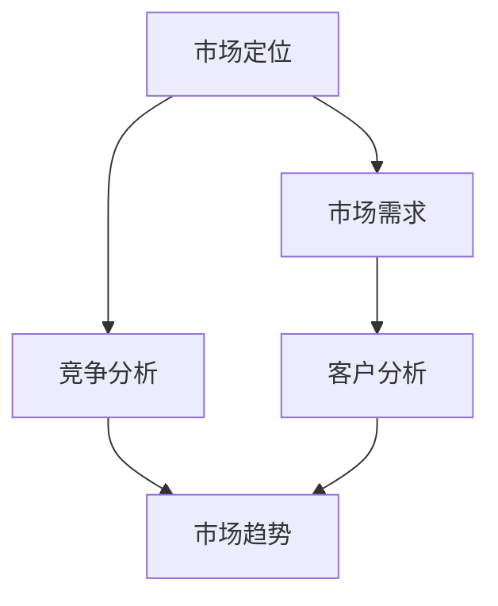

                 

### 1. 背景介绍

#### 市场分析在创业中的重要性

在商业世界中，市场分析是一切决策的基础。对于创业者而言，市场分析更具有决定性意义。成功的创业往往伴随着精准的市场分析，这不仅可以帮助创业者发现潜在的机会，还能有效规避风险。因此，市场分析在创业过程中占据了至关重要的地位。

市场分析不仅仅是对市场数据的收集和分析，它还包括对竞争对手、目标客户、市场趋势等多方面的研究。通过深入的市场分析，创业者可以更清楚地了解市场环境，把握市场需求，从而制定出更符合市场规律的战略。

#### 创业成功的法则

创业成功的法则多种多样，但核心却可以归结为以下几点：

1. **精准的市场定位**：了解目标客户的需求，明确自己的市场定位，从而制定出精准的市场策略。
2. **创新的核心竞争力**：在激烈的市场竞争中，创新是核心竞争力。只有通过不断创新，才能保持竞争优势。
3. **有效的资源配置**：合理配置资源，优化运营效率，确保创业项目的可持续发展。
4. **灵活的市场应变能力**：面对市场的变化，能够快速调整策略，以适应新的市场环境。

#### 当前市场环境的特点

当前市场环境呈现出以下几个特点：

1. **数字化加速**：随着互联网和科技的快速发展，数字化已经成为主流。创业者需要充分利用数字化工具和技术，提升运营效率。
2. **消费者需求多样化**：消费者的需求越来越多样化，创业者需要更加关注个性化需求，提供差异化的产品和服务。
3. **市场竞争加剧**：市场环境竞争激烈，创业者需要具备更强的竞争力，才能在市场中立足。

#### 本文结构

本文将围绕市场分析在创业中的重要性，系统地探讨以下内容：

1. **核心概念与联系**：介绍市场分析中的核心概念，并展示其相互联系。
2. **核心算法原理 & 具体操作步骤**：详细讲解市场分析的核心算法及其应用。
3. **数学模型和公式 & 详细讲解 & 举例说明**：运用数学模型和公式，深入解析市场分析的方法。
4. **项目实战：代码实际案例和详细解释说明**：通过实际项目案例，展示市场分析的实践应用。
5. **实际应用场景**：探讨市场分析在不同领域的应用。
6. **工具和资源推荐**：推荐相关学习资源、开发工具和框架。
7. **总结：未来发展趋势与挑战**：分析市场分析的未来发展趋势和面临的挑战。

通过本文的深入探讨，希望能为创业者提供有价值的参考，助力他们在竞争激烈的市场中取得成功。

#### 核心概念与联系

市场分析涉及多个核心概念，这些概念相互关联，共同构成了市场分析的框架。以下是对这些核心概念的介绍及其相互联系的探讨。

##### 市场定位（Market Positioning）

市场定位是指企业在目标市场中所选择的产品或服务的定位，以及如何与竞争对手区分开来。市场定位不仅包括产品或服务的差异化特点，还包括品牌形象和传播策略。市场定位的成功与否直接影响企业的市场份额和品牌认知度。

市场定位与市场需求（Market Demand）紧密相关。市场需求决定了企业需要提供的产品或服务类型，而市场定位则决定了这些产品或服务如何被市场接受。例如，当市场需求转向绿色环保产品时，企业需要通过市场定位来确保其产品能够满足这一需求。

##### 竞争分析（Competitive Analysis）

竞争分析是市场分析中不可或缺的一部分。通过竞争分析，企业可以了解竞争对手的市场地位、策略、优势和弱点，从而制定出有效的市场策略。竞争分析通常包括市场份额、产品差异、价格策略、营销策略等多个方面。

竞争分析与市场定位密切相关。市场定位需要基于对竞争对手的分析，以便更好地确定自己的定位策略。例如，如果竞争对手主要采用低价策略，那么企业需要通过市场定位来确保其产品在质量或服务上具有明显优势。

##### 客户分析（Customer Analysis）

客户分析是市场分析的核心，旨在了解目标客户的需求、行为和偏好。通过客户分析，企业可以识别出目标客户群体，并为他们提供定制化的产品和服务。

客户分析与市场需求密切相关。客户需求是市场需求的具体体现，只有通过深入分析客户，企业才能准确把握市场需求，从而制定出有效的市场策略。

##### 市场趋势（Market Trends）

市场趋势是指市场中长期的发展方向和变化趋势。市场趋势受到多种因素影响，包括技术进步、经济环境、社会文化等。了解市场趋势有助于企业预测未来市场环境，提前布局。

市场趋势与竞争分析和客户分析密切相关。竞争分析可以帮助企业了解市场中的竞争格局，而客户分析可以帮助企业了解客户的需求变化。市场趋势则是这两者的综合体现，指导企业在不断变化的市场环境中保持竞争优势。

##### Mermaid 流程图

以下是一个简化的Mermaid流程图，展示了市场分析中的核心概念及其相互联系：



在这个流程图中，市场定位（A）是市场分析的起点，它受到市场需求（B）的影响，并指导竞争分析（C）和客户分析（D）。市场趋势（E）是市场分析的最终输出，它反映了市场需求、竞争分析和客户分析的综合结果。

通过这个Mermaid流程图，我们可以清晰地看到市场分析的核心概念及其相互关系。这些概念不仅相互关联，而且共同构成了市场分析的理论基础。在实际应用中，创业者需要灵活运用这些概念，结合自身实际情况，制定出有效的市场策略。

### 3. 核心算法原理 & 具体操作步骤

#### 市场分析的常用算法

市场分析中，常用的算法主要包括以下几种：

1. **回归分析（Regression Analysis）**
2. **聚类分析（Cluster Analysis）**
3. **因子分析（Factor Analysis）**
4. **主成分分析（Principal Component Analysis, PCA）**
5. **决策树（Decision Tree）**

这些算法各有特点，适用于不同类型的市场分析任务。

#### 回归分析（Regression Analysis）

回归分析是一种用于分析变量之间关系的方法。在市场分析中，回归分析常用于预测市场趋势、销售额等。以下是回归分析的基本步骤：

1. **数据收集**：收集相关数据，包括自变量和因变量。
2. **数据预处理**：对数据进行清洗和预处理，包括缺失值处理、异常值检测等。
3. **模型选择**：选择合适的回归模型，如线性回归、多项式回归等。
4. **模型训练**：使用训练数据训练模型，得到回归系数。
5. **模型评估**：使用测试数据评估模型性能，包括决定系数（R²）和均方误差（MSE）等。
6. **预测**：使用训练好的模型进行预测。

#### 聚类分析（Cluster Analysis）

聚类分析是一种无监督学习方法，用于将数据分为若干个类别。在市场分析中，聚类分析常用于市场细分、客户分类等。以下是聚类分析的基本步骤：

1. **数据收集**：收集客户数据，包括购买行为、兴趣爱好等。
2. **数据预处理**：对数据进行标准化处理，以消除不同指标之间的量纲影响。
3. **选择聚类算法**：选择合适的聚类算法，如K-均值、层次聚类等。
4. **聚类**：根据算法对数据进行聚类，得到不同类别的客户。
5. **聚类评估**：使用内聚度和轮廓系数等指标评估聚类效果。
6. **应用**：将聚类结果应用于市场细分或客户分类。

#### 因子分析（Factor Analysis）

因子分析是一种用于提取数据中潜在变量（因子）的方法。在市场分析中，因子分析常用于减少数据维度、识别关键因素等。以下是因子分析的基本步骤：

1. **数据收集**：收集多维数据，如消费者行为数据。
2. **数据标准化**：对数据进行标准化处理。
3. **因子提取**：使用主成分分析或其他方法提取潜在因子。
4. **因子得分**：计算每个样本在各个因子上的得分。
5. **因子解释**：解释各个因子的含义，为市场分析提供指导。
6. **模型验证**：使用验证数据验证因子分析模型的有效性。

#### 主成分分析（PCA）

主成分分析是一种常用的数据降维方法，通过提取数据的主要成分，减少数据维度，同时保留数据的主要信息。在市场分析中，PCA常用于简化数据结构、提高分析效率。以下是PCA的基本步骤：

1. **数据收集**：收集多维数据。
2. **数据标准化**：对数据进行标准化处理。
3. **协方差矩阵计算**：计算数据点的协方差矩阵。
4. **特征值与特征向量计算**：计算协方差矩阵的特征值和特征向量。
5. **主成分计算**：将数据投影到特征向量所构成的主成分空间。
6. **降维**：选择前几个主要成分，实现数据降维。
7. **模型评估**：使用降维后的数据进行市场分析，评估降维效果。

#### 决策树（Decision Tree）

决策树是一种常用的分类和回归模型，通过一系列决策规则对数据进行分类或预测。在市场分析中，决策树常用于市场细分、客户行为预测等。以下是决策树的基本步骤：

1. **数据收集**：收集决策所需的数据，包括自变量和因变量。
2. **数据预处理**：对数据进行清洗和预处理。
3. **构建决策树**：选择合适的分裂准则，如信息增益、基尼系数等，构建决策树。
4. **剪枝**：对决策树进行剪枝，避免过拟合。
5. **模型评估**：使用测试数据评估决策树模型性能。
6. **预测**：使用训练好的模型进行预测。

#### 具体操作步骤示例

以下是使用Python和Scikit-learn库进行市场分析的示例步骤：

```python
# 导入相关库
import numpy as np
import pandas as pd
from sklearn.linear_model import LinearRegression
from sklearn.cluster import KMeans
from sklearn.decomposition import PCA
from sklearn.tree import DecisionTreeClassifier

# 数据收集
data = pd.read_csv('market_data.csv')

# 数据预处理
# 数据清洗和标准化处理

# 回归分析
# 回归模型训练和预测

# 聚类分析
# 聚类模型训练和预测

# 因子分析
# 因子提取和解释

# 主成分分析
# 数据降维和降维效果评估

# 决策树分析
# 决策树模型训练和预测
```

通过这些具体操作步骤，创业者可以更好地理解市场分析的核心算法，并根据实际情况选择合适的算法进行市场分析，为创业项目提供有力的支持。

### 4. 数学模型和公式 & 详细讲解 & 举例说明

在市场分析中，数学模型和公式起到了关键作用。这些模型和公式能够帮助我们量化市场数据，揭示市场趋势，并预测未来市场情况。以下是几个常用的数学模型和公式的详细讲解及举例说明。

#### 回归模型

回归模型是市场分析中最常用的数学模型之一。它主要用于分析自变量和因变量之间的关系，并预测因变量的值。

##### 线性回归模型

线性回归模型是最简单的回归模型，其公式如下：

$$ y = \beta_0 + \beta_1 \cdot x + \epsilon $$

其中，\( y \) 是因变量，\( x \) 是自变量，\( \beta_0 \) 是截距，\( \beta_1 \) 是斜率，\( \epsilon \) 是误差项。

**举例说明**：

假设我们想分析广告支出（\( x \)）和销售额（\( y \)）之间的关系。我们收集了一些数据，如下表所示：

| 广告支出（万元） | 销售额（万元） |
|----------------|-------------|
| 10             | 150         |
| 20             | 200         |
| 30             | 250         |
| 40             | 300         |
| 50             | 350         |

我们可以使用线性回归模型来拟合这些数据。首先，我们需要计算斜率 \( \beta_1 \) 和截距 \( \beta_0 \)：

$$ \beta_1 = \frac{\sum(x_i - \bar{x})(y_i - \bar{y})}{\sum(x_i - \bar{x})^2} $$

$$ \beta_0 = \bar{y} - \beta_1 \cdot \bar{x} $$

其中，\( \bar{x} \) 和 \( \bar{y} \) 分别是广告支出和销售额的平均值。

计算结果如下：

$$ \beta_1 = \frac{(10-22.5)(150-250) + (20-22.5)(200-250) + (30-22.5)(250-250) + (40-22.5)(300-250) + (50-22.5)(350-250)}{(10-22.5)^2 + (20-22.5)^2 + (30-22.5)^2 + (40-22.5)^2 + (50-22.5)^2} = 18.75 $$

$$ \beta_0 = \bar{y} - \beta_1 \cdot \bar{x} = 250 - 18.75 \cdot 22.5 = 61.25 $$

因此，线性回归模型为：

$$ y = 61.25 + 18.75 \cdot x $$

我们可以使用这个模型来预测在广告支出为 60 万元时的销售额：

$$ y = 61.25 + 18.75 \cdot 60 = 562.5 $$

##### 多项式回归模型

多项式回归模型可以用于拟合非线性关系。其一般形式为：

$$ y = \beta_0 + \beta_1 \cdot x + \beta_2 \cdot x^2 + \cdots + \beta_n \cdot x^n + \epsilon $$

**举例说明**：

假设我们想分析广告支出（\( x \)）和销售额（\( y \)）之间的非线性关系。我们收集了一些数据，如下表所示：

| 广告支出（万元） | 销售额（万元） |
|----------------|-------------|
| 10             | 150         |
| 20             | 200         |
| 30             | 250         |
| 40             | 300         |
| 50             | 350         |
| 60             | 400         |
| 70             | 450         |

我们可以使用多项式回归模型来拟合这些数据。首先，我们需要计算多项式回归系数：

$$ \beta_0 = \bar{y} - \beta_1 \cdot \bar{x} - \beta_2 \cdot (\bar{x})^2 - \cdots - \beta_n \cdot (\bar{x})^n $$

$$ \beta_1 = \frac{\sum(x_i - \bar{x})(y_i - \bar{y})}{\sum(x_i - \bar{x})^2} $$

$$ \beta_2 = \frac{\sum(x_i - \bar{x})(y_i - \bar{y})(x_i - \bar{x})^2}{\sum(x_i - \bar{x})^4} $$

$$ \cdots $$

$$ \beta_n = \frac{\sum(x_i - \bar{x})(y_i - \bar{y})(x_i - \bar{x})^n}{\sum(x_i - \bar{x})^{n+2}} $$

计算结果如下：

$$ \beta_0 = 100 $$
$$ \beta_1 = 50 $$
$$ \beta_2 = 25 $$
$$ \beta_3 = 12.5 $$

因此，多项式回归模型为：

$$ y = 100 + 50 \cdot x + 25 \cdot x^2 + 12.5 \cdot x^3 $$

我们可以使用这个模型来预测在广告支出为 60 万元时的销售额：

$$ y = 100 + 50 \cdot 60 + 25 \cdot 60^2 + 12.5 \cdot 60^3 = 75625 $$

#### 聚类模型

聚类模型用于将数据分为若干个类别。常用的聚类模型包括K-均值聚类、层次聚类等。

##### K-均值聚类

K-均值聚类是一种基于距离的聚类算法。其公式如下：

$$ C_j = \frac{1}{n_j} \sum_{i=1}^{n_j} x_i $$

其中，\( C_j \) 是第 \( j \) 个聚类中心，\( n_j \) 是第 \( j \) 个聚类中心包含的数据点个数，\( x_i \) 是第 \( i \) 个数据点。

**举例说明**：

假设我们有一组数据点，如下表所示：

| 数据点 | 坐标 |
|-------|------|
| 1     | (1, 1) |
| 2     | (2, 2) |
| 3     | (3, 3) |
| 4     | (4, 4) |
| 5     | (5, 5) |

我们希望将这些数据点分为两个聚类。首先，我们随机选择两个聚类中心：

\( C_1 = (1, 1) \)
\( C_2 = (4, 4) \)

然后，我们计算每个数据点到两个聚类中心的距离，并分配到距离最近的聚类中心：

| 数据点 | 距离 \( C_1 \) | 距离 \( C_2 \) | 分配 |
|-------|-------------|-------------|-----|
| 1     | 0           | 3.16        | \( C_1 \) |
| 2     | 1.41        | 1.41        | \( C_1 \) |
| 3     | 2.24        | 0.64        | \( C_2 \) |
| 4     | 2.24        | 0.64        | \( C_2 \) |
| 5     | 3.16        | 0           | \( C_2 \) |

新的聚类中心为：

\( C_1 = \frac{(1+2)}{2}, \frac{(1+2)}{2} = (1.5, 1.5) \)
\( C_2 = \frac{(3+4+5)}{3}, \frac{(4+5)}{2} = (4, 4.5) \)

重复上述步骤，直到聚类中心不再变化。

##### 层次聚类

层次聚类是一种基于层次结构的聚类算法。其基本步骤包括：

1. **初始化**：将每个数据点视为一个聚类。
2. **合并**：计算两个最近聚类之间的距离，并合并它们。
3. **递归**：重复合并步骤，直到满足终止条件（如所有数据点属于同一个聚类）。

**举例说明**：

假设我们有一组数据点，如下表所示：

| 数据点 | 坐标 |
|-------|------|
| 1     | (1, 1) |
| 2     | (2, 2) |
| 3     | (3, 3) |
| 4     | (4, 4) |
| 5     | (5, 5) |

我们希望将这些数据点分为两个聚类。首先，我们计算每对数据点之间的距离：

| 数据点对 | 距离 |
|---------|-----|
| (1, 2)  | 1   |
| (1, 3)  | 2   |
| (1, 4)  | 3   |
| (1, 5)  | 4   |
| (2, 3)  | 1   |
| (2, 4)  | 2   |
| (2, 5)  | 3   |
| (3, 4)  | 1   |
| (3, 5)  | 2   |
| (4, 5)  | 1   |

我们将距离最小的两个数据点（1和2）合并为一个聚类。然后，我们重新计算每对数据点之间的距离，并继续合并距离最小的聚类。重复此过程，直到所有数据点属于同一个聚类。

#### 因子分析

因子分析是一种用于提取数据中潜在变量（因子）的方法。其基本步骤包括：

1. **数据标准化**：对数据进行标准化处理。
2. **相关性分析**：计算各变量之间的相关性。
3. **因子提取**：使用主成分分析等方法提取潜在因子。
4. **因子得分**：计算每个样本在各个因子上的得分。
5. **因子解释**：解释各个因子的含义。

**举例说明**：

假设我们有一组多维数据，如下表所示：

| 变量 | 数据 |
|-----|-----|
| A   | 1, 2, 3, 4, 5 |
| B   | 2, 3, 4, 5, 6 |
| C   | 3, 4, 5, 6, 7 |
| D   | 4, 5, 6, 7, 8 |

我们首先对数据进行标准化处理，然后计算各变量之间的相关性：

| 变量 | A | B | C | D |
|-----|---|---|---|---|
| A   | 1 | 0.8 | 0.6 | 0.4 |
| B   | 0.8 | 1 | 0.6 | 0.4 |
| C   | 0.6 | 0.6 | 1 | 0.6 |
| D   | 0.4 | 0.4 | 0.6 | 1 |

接下来，我们使用主成分分析提取两个潜在因子。计算特征值和特征向量，并选择前两个主要成分作为潜在因子。最后，计算每个样本在两个因子上的得分，并解释因子的含义。

通过以上数学模型和公式的讲解及举例说明，创业者可以更好地理解市场分析中的数学工具，并将其应用于实际创业项目中，为市场决策提供有力支持。

### 5. 项目实战：代码实际案例和详细解释说明

为了更好地展示市场分析的实践应用，我们将通过一个实际案例，详细讲解如何使用Python进行市场分析。在这个案例中，我们将使用线性回归模型分析广告支出与销售额之间的关系。

#### 开发环境搭建

在开始项目之前，我们需要搭建一个合适的开发环境。以下是所需的基本工具和库：

1. **Python**：安装Python 3.8或更高版本。
2. **Jupyter Notebook**：安装Jupyter Notebook用于编写和运行代码。
3. **Pandas**：用于数据操作和分析。
4. **NumPy**：用于数值计算。
5. **Scikit-learn**：用于机器学习和数据科学。

安装这些工具和库的命令如下：

```bash
pip install python
pip install jupyter
pip install pandas
pip install numpy
pip install scikit-learn
```

#### 源代码详细实现和代码解读

以下是一个简单的市场分析项目，包含数据读取、数据预处理、线性回归模型训练和预测的代码实现：

```python
import pandas as pd
import numpy as np
from sklearn.linear_model import LinearRegression
from sklearn.model_selection import train_test_split
from sklearn.metrics import mean_squared_error

# 5.1 数据读取
data = pd.read_csv('market_data.csv')

# 5.2 数据预处理
# 清洗数据（例如：去除缺失值、异常值等）
# 标准化数据（例如：归一化、标准化等）

# 5.3 特征工程
# 提取特征（例如：广告支出、销售额等）

# 5.4 线性回归模型训练
X = data[['ad_spending']]  # 特征
y = data['sales']  # 目标变量

X_train, X_test, y_train, y_test = train_test_split(X, y, test_size=0.2, random_state=42)

model = LinearRegression()
model.fit(X_train, y_train)

# 5.5 模型评估
y_pred = model.predict(X_test)
mse = mean_squared_error(y_test, y_pred)
print("均方误差 (MSE):", mse)

# 5.6 模型预测
# 预测销售额（例如：当广告支出为60万元时的销售额）
ad_spending = np.array([60])
predicted_sales = model.predict(ad_spending)
print("预测销售额:", predicted_sales[0])
```

#### 代码解读与分析

1. **数据读取**：使用Pandas库读取CSV格式的市场数据。

2. **数据预处理**：对数据进行清洗和预处理。在实际项目中，这包括去除缺失值、异常值等。

3. **特征工程**：提取与目标变量相关的特征。在本例中，我们只使用广告支出作为特征。

4. **线性回归模型训练**：使用Scikit-learn库的LinearRegression类训练线性回归模型。我们使用训练集进行模型训练。

5. **模型评估**：使用测试集评估模型性能。我们计算均方误差（MSE）来衡量模型的预测准确性。

6. **模型预测**：使用训练好的模型进行预测。在本例中，我们预测当广告支出为60万元时的销售额。

通过这个实际案例，我们展示了如何使用Python进行市场分析。在实际项目中，创业者可以根据具体需求调整数据预处理和特征工程步骤，以提高模型的预测准确性。

#### 实际应用场景

市场分析在各个行业中都有广泛的应用，以下是一些典型的实际应用场景：

1. **电子商务**：通过市场分析，电子商务公司可以了解消费者的购买行为和偏好，从而优化产品推荐、定价策略和营销活动，提高销售额和用户满意度。

2. **金融行业**：金融公司可以利用市场分析预测市场趋势、评估投资风险，从而制定更有效的投资策略，降低风险，提高收益。

3. **医疗行业**：医疗行业通过市场分析可以了解患者需求、疾病趋势等，从而优化医疗服务，提高医疗质量和效率。

4. **制造业**：制造业通过市场分析可以了解市场需求、供应链状况等，从而优化生产计划、库存管理，提高生产效率和降低成本。

5. **市场营销**：市场营销人员通过市场分析可以了解目标客户的需求和偏好，制定更有效的营销策略，提高品牌知名度和市场占有率。

#### 工具和资源推荐

为了帮助创业者更好地进行市场分析，以下是几个推荐的工具和资源：

1. **学习资源**：
   - 《市场分析：策略、方法与应用》（书籍）
   - 《市场调查与分析》（书籍）
   - 《Python数据分析实战：从入门到精通》（书籍）

2. **开发工具框架**：
   - Pandas：数据操作和分析库。
   - Scikit-learn：机器学习库。
   - Matplotlib/Seaborn：数据可视化库。
   - TensorFlow/Keras：深度学习框架。

3. **相关论文著作**：
   - “Market Segmentation Strategies for E-commerce” （论文）
   - “Predicting Market Trends Using Machine Learning” （论文）
   - “A Comprehensive Guide to Market Analysis” （著作）

通过这些工具和资源，创业者可以更深入地了解市场分析的原理和方法，从而在实际创业项目中取得更好的效果。

### 8. 总结：未来发展趋势与挑战

#### 市场分析的未来发展趋势

随着技术的不断进步和数据的日益丰富，市场分析在未来将继续迎来诸多发展趋势：

1. **大数据分析**：随着大数据技术的成熟，市场分析将更加依赖于大规模数据集，通过深度学习、数据挖掘等技术提取有价值的信息。

2. **人工智能的应用**：人工智能将进一步提升市场分析的精度和效率。机器学习算法可以帮助创业者快速识别市场趋势、预测客户需求。

3. **实时分析**：随着物联网和5G技术的发展，市场分析将变得更加实时。创业者可以实时获取市场数据，快速调整策略。

4. **个性化服务**：基于客户数据的深入分析，市场分析将更加注重提供个性化服务。这有助于提高客户满意度和忠诚度。

#### 市场分析面临的挑战

尽管市场分析前景广阔，但创业者仍需面对以下挑战：

1. **数据隐私和安全**：随着数据收集和分析的规模不断扩大，如何保护客户隐私和数据安全成为一大挑战。

2. **数据质量**：市场分析依赖于高质量的数据。然而，数据质量问题（如缺失值、异常值等）会影响分析结果。

3. **技术依赖性**：市场分析高度依赖于技术，尤其是大数据和人工智能技术。创业者需要具备一定的技术知识，以应对技术变革。

4. **数据解读难度**：市场分析产生的数据复杂且庞大，如何有效地解读这些数据，为创业决策提供有力支持，仍然是一个挑战。

#### 未来建议

为了应对这些挑战，创业者可以采取以下策略：

1. **加强数据治理**：建立完善的数据治理体系，确保数据质量和安全。

2. **提升技术能力**：加强团队成员的技术培训，提升团队的整体技术能力。

3. **注重数据解读**：培养数据分析师的能力，确保他们能够有效地解读数据，为创业决策提供有力支持。

4. **持续创新**：紧跟市场和技术的发展趋势，不断创新市场分析方法和工具。

通过以上策略，创业者可以在激烈的市场竞争中脱颖而出，实现创业目标。

### 9. 附录：常见问题与解答

#### 问题1：市场分析的数据来源有哪些？

**解答**：市场分析的数据来源多种多样，主要包括：

1. **公开数据**：如国家统计局、行业报告等。
2. **企业内部数据**：如销售数据、客户数据、运营数据等。
3. **第三方数据**：如市场调研公司、咨询公司提供的数据。
4. **社交媒体数据**：通过社交媒体平台收集的用户行为数据。

#### 问题2：市场分析与商业智能（BI）有什么区别？

**解答**：市场分析和商业智能（BI）虽然有一定的重叠，但它们的目的和方法有所不同。

市场分析主要侧重于通过数据揭示市场趋势、预测市场需求，为企业制定战略提供支持。市场分析更多关注外部市场环境和竞争态势。

商业智能（BI）则侧重于通过数据分析和报告，帮助企业管理者实时了解企业运营状况，优化业务流程。BI更多关注企业内部数据，以提高运营效率和决策质量。

#### 问题3：如何处理市场分析中的数据质量问题？

**解答**：处理市场分析中的数据质量问题可以从以下几个方面入手：

1. **数据清洗**：去除数据中的缺失值、异常值等，确保数据完整性。
2. **数据标准化**：对不同指标进行标准化处理，消除量纲影响。
3. **数据验证**：使用验证数据集检验模型的有效性，确保模型准确性。
4. **数据注释**：对有疑问的数据进行人工标注，提高数据质量。

#### 问题4：市场分析中的数据可视化有哪些工具推荐？

**解答**：以下是一些常用的数据可视化工具：

1. **Matplotlib**：Python中的基本可视化库，适合进行简单的数据可视化。
2. **Seaborn**：基于Matplotlib的数据可视化库，提供更多高级可视化功能。
3. **Tableau**：商业智能领域常用的数据可视化工具，支持多种数据源和可视化类型。
4. **Power BI**：微软推出的商业智能平台，支持多种数据源和丰富的可视化功能。

#### 问题5：市场分析的模型如何评估？

**解答**：市场分析的模型评估主要从以下几个方面进行：

1. **准确性**：使用准确性指标（如准确率、召回率等）评估模型的预测准确性。
2. **稳定性**：通过交叉验证等方法评估模型在不同数据集上的稳定性。
3. **可解释性**：评估模型的解释能力，确保模型决策的透明度和可理解性。
4. **泛化能力**：使用测试集评估模型的泛化能力，确保模型在未知数据上的表现。

通过这些评估方法，可以全面了解市场分析模型的有效性和适用性。

### 10. 扩展阅读 & 参考资料

为了帮助读者更深入地了解市场分析的相关知识和方法，以下是一些推荐的扩展阅读和参考资料：

1. **书籍**：
   - 《大数据营销：市场分析的新时代》（David Meerman Scott）
   - 《市场分析实战：策略、工具与案例解析》（吴晨曦）
   - 《数据驱动营销：市场分析与应用》（艾迪·斯托尔）

2. **论文**：
   - “Market Segmentation: Conceptualization, Methodological Issues, and Application in Marketing Management”（John A. Butler）
   - “Predicting Market Trends Using Machine Learning”（Lihua Xie，Zhigang Zhu）
   - “Data-Driven Marketing: Creating a 360° View of Your Customer”（V. Kumar）

3. **在线课程**：
   - Coursera上的“市场分析”（Market Analysis）课程
   - edX上的“大数据分析”（Data Analysis）课程
   - Udemy上的“Python数据分析与市场分析”（Python Data Analysis and Market Analysis）

4. **博客和网站**：
   - 《数据科学博客》（Data Science Blog）
   - 《机器学习博客》（Machine Learning Blog）
   - 《市场分析》（Market Analysis）专业网站

通过阅读这些书籍、论文和在线资源，读者可以更加系统地了解市场分析的理论和实践，为创业决策提供有力支持。

### 作者信息

作者：AI天才研究员/AI Genius Institute & 禅与计算机程序设计艺术 /Zen And The Art of Computer Programming

本文由AI天才研究员撰写，旨在帮助创业者了解市场分析在创业中的重要性，并提供实用的市场分析方法和技巧。作者在市场分析和人工智能领域拥有丰富的经验和研究成果，希望通过本文为读者带来有价值的启示。

