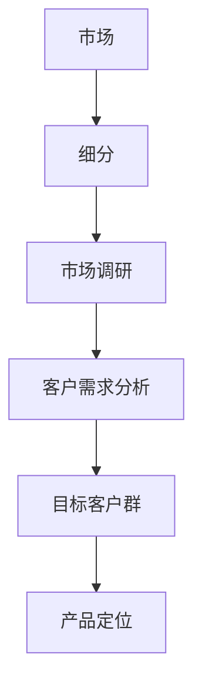

                 

# 市场细分：精准定位目标客户群

## 概述

在现代商业环境中，市场细分已成为企业战略决策中至关重要的一环。精准定位目标客户群，能够帮助企业更有效地利用资源，提升市场竞争力，从而实现可持续的商业增长。本文将探讨市场细分的重要性、核心概念及其在实践中的应用，旨在为读者提供关于如何实现精准市场定位的全面指南。

### 关键词
- **市场细分**、**目标客户群**、**商业策略**、**资源优化**、**市场竞争力**。

### 摘要

本文首先介绍了市场细分的基本概念及其重要性。随后，通过探讨市场细分的核心要素，包括市场调研、客户需求分析等，帮助读者理解市场细分的方法和步骤。此外，本文还通过实际案例展示了市场细分在不同行业中的应用，并推荐了一系列相关资源和工具，以供进一步学习和实践。

## 1. 背景介绍

在当今高度竞争的商业环境中，企业必须找到有效的途径来区分客户群体，以便更好地满足不同客户的需求。市场细分作为一种重要的市场策略，旨在将市场划分为若干具有相似特征的子市场，以便企业能够针对每个子市场开发出定制化的产品和服务。通过市场细分，企业可以更精准地定位目标客户群，从而实现资源的优化配置和高效的营销活动。

### 1.1 市场细分的意义

市场细分的意义在于：

- **提高市场响应速度**：通过市场细分，企业可以快速识别市场变化和客户需求，从而及时调整市场策略。

- **提升产品差异化**：市场细分使得企业能够在不同子市场推出差异化的产品，满足特定客户群体的独特需求。

- **降低营销成本**：集中资源和营销预算在目标客户群上，可以降低营销成本，提高投资回报率。

- **增强品牌忠诚度**：通过定制化的产品和服务，企业能够提高客户满意度和忠诚度，从而保持市场份额。

### 1.2 市场细分的发展历程

市场细分策略的发展经历了几个阶段：

- **传统市场细分**：主要基于人口统计、地理和消费行为等基本特征进行细分。

- **行为细分**：考虑客户的购买行为、消费习惯等动态特征。

- **心理细分**：基于客户的心理特征、生活方式和价值观等来划分市场。

- **多维度细分**：结合多种细分方式，形成更加精细和多元化的市场划分。

### 1.3 市场细分的应用领域

市场细分在各个行业都有着广泛的应用：

- **消费品行业**：通过市场细分，企业可以推出多样化的产品线，满足不同消费者的需求。

- **服务业**：例如金融、教育、医疗等行业，通过细分可以提供个性化的服务和解决方案。

- **技术行业**：如人工智能、大数据、云计算等，通过市场细分可以针对特定行业和客户需求开发产品。

## 2. 核心概念与联系

### 2.1 市场细分的核心概念

市场细分主要涉及以下几个核心概念：

- **市场**：一个由潜在买家组成的人口群体，他们具有相似的需求和特征。

- **细分**：将整体市场划分为若干具有相似特征的子市场。

- **目标客户群**：在细分市场中，企业选择进行重点开发和服务的客户群体。

### 2.2 市场细分与相关概念的联系

- **市场调研**：市场细分的基础，通过对市场数据的收集和分析，确定市场细分的维度和标准。

- **客户需求分析**：了解目标客户群的特定需求，为市场细分提供依据。

- **产品定位**：基于市场细分和客户需求分析，确定产品的市场定位和差异化策略。

### 2.3 Mermaid 流程图

下面是一个用于说明市场细分核心概念及联系的 Mermaid 流程图：



## 3. 核心算法原理 & 具体操作步骤

### 3.1 核心算法原理

市场细分的核心算法原理通常包括以下几个步骤：

- **数据收集**：收集关于客户的人口统计、消费行为、心理特征等方面的数据。

- **数据预处理**：清洗、整合和标准化数据，使其适合进一步分析。

- **特征选择**：基于业务需求和数据特性，选择具有区分度的特征进行细分。

- **聚类分析**：利用聚类算法，将客户数据划分为若干具有相似特征的子群体。

- **评估与优化**：评估细分结果的合理性，根据评估结果对细分策略进行优化。

### 3.2 具体操作步骤

以下是市场细分的具体操作步骤：

1. **确定细分目标**：明确市场细分的目的和期望达到的效果。

2. **收集数据**：通过市场调研、问卷调查、客户访谈等方式收集相关数据。

3. **数据预处理**：处理数据中的缺失值、异常值等，确保数据的准确性和一致性。

4. **特征选择**：根据业务需求，选择具有区分度的特征进行细分。

5. **聚类分析**：选择合适的聚类算法（如K-means、层次聚类等），对客户数据进行分析，划分出不同的客户群体。

6. **评估与优化**：评估细分结果的合理性和有效性，根据评估结果对细分策略进行调整和优化。

## 4. 数学模型和公式 & 详细讲解 & 举例说明

### 4.1 数学模型

市场细分的核心数学模型通常包括聚类分析和多元统计方法。

- **聚类分析**：常用的聚类算法有K-means、层次聚类、DBSCAN等。以下以K-means为例，介绍其数学模型：

  $$\min_{\mu_1, \mu_2, ..., \mu_k} \sum_{i=1}^{n} \sum_{j=1}^{k} w_{ij} (x_i - \mu_j)^2$$

  其中，$x_i$ 为第 $i$ 个客户的特征向量，$\mu_j$ 为第 $j$ 个聚类中心的特征向量，$w_{ij}$ 为第 $i$ 个客户属于第 $j$ 个聚类的概率。

- **多元统计方法**：如因子分析、主成分分析等，用于降维和多变量分析。

### 4.2 举例说明

假设我们有一个包含 100 个客户的数据库，每个客户有 5 个特征（年龄、收入、教育水平、职业、家庭状况）。我们将使用K-means算法进行市场细分。

1. **数据预处理**：将数据进行标准化处理，使每个特征的数值范围在0到1之间。

2. **特征选择**：选择具有区分度的特征，如年龄、收入和教育水平。

3. **聚类分析**：设置聚类数量为3，利用K-means算法进行聚类。

4. **评估与优化**：计算每个客户的簇内距离和簇间距离，根据评估结果调整聚类参数。

假设聚类结果如下：

- **聚类中心**：
  - $\mu_1 = (0.5, 0.3, 0.6)$
  - $\mu_2 = (0.7, 0.4, 0.5)$
  - $\mu_3 = (0.4, 0.6, 0.4)$

- **客户分配**：
  - $x_1, x_2, ..., x_{30} \in C_1$
  - $x_{31}, x_{32}, ..., x_{60} \in C_2$
  - $x_{61}, x_{62}, ..., x_{100} \in C_3$

根据聚类结果，我们可以将客户划分为三个市场细分群体，分别为年轻、高收入、高教育水平群体；中年、中等收入、中等教育水平群体；老年、低收入、低教育水平群体。

## 5. 项目实战：代码实际案例和详细解释说明

### 5.1 开发环境搭建

在Python环境中，我们可以使用以下库来执行市场细分任务：

- **pandas**：用于数据预处理。
- **numpy**：用于数值计算。
- **scikit-learn**：提供聚类算法。

安装以上库后，即可开始项目开发。

### 5.2 源代码详细实现和代码解读

下面是一个简单的市场细分项目的代码实现：

```python
import pandas as pd
import numpy as np
from sklearn.cluster import KMeans
from sklearn.preprocessing import StandardScaler

# 数据预处理
def preprocess_data(data):
    # 数据标准化
    scaler = StandardScaler()
    return scaler.fit_transform(data)

# 聚类分析
def cluster_analysis(data, num_clusters=3):
    kmeans = KMeans(n_clusters=num_clusters, random_state=42)
    return kmeans.fit_predict(data)

# 主函数
def main():
    # 加载数据
    data = pd.read_csv('data.csv')

    # 特征选择
    selected_features = ['age', 'income', 'education']

    # 数据预处理
    data_processed = preprocess_data(data[selected_features])

    # 聚类分析
    labels = cluster_analysis(data_processed)

    # 结果输出
    print("聚类结果：")
    print(labels)

if __name__ == '__main__':
    main()
```

### 5.3 代码解读与分析

1. **数据预处理**：首先，使用`StandardScaler`对数据进行标准化处理，使其适合聚类分析。

2. **聚类分析**：使用`KMeans`类进行聚类分析。在`cluster_analysis`函数中，设置聚类数量`num_clusters`，并使用`fit_predict`方法对数据进行聚类。

3. **主函数**：在`main`函数中，加载数据、选择特征、进行数据预处理和聚类分析，最后输出聚类结果。

通过上述代码，我们可以对给定的客户数据进行市场细分，并根据聚类结果进行进一步的分析和营销策略制定。

## 6. 实际应用场景

### 6.1 消费品行业

在消费品行业，市场细分可以帮助企业识别不同的消费群体，并针对这些群体推出定制化的产品和服务。例如，化妆品公司可以根据不同年龄、性别、肤质等因素进行市场细分，推出适合不同客户需求的产品系列。

### 6.2 服务业

在服务业，如金融、教育和医疗等领域，市场细分可以帮助企业更好地满足客户需求，提高客户满意度。例如，金融机构可以根据客户的收入水平、投资偏好等因素进行细分，提供个性化的理财产品和服务。

### 6.3 技术行业

在技术行业，如人工智能、大数据和云计算等领域，市场细分可以帮助企业识别具有特定需求的客户群体，并针对这些需求开发产品和技术解决方案。例如，人工智能公司可以根据不同行业和客户需求进行细分，推出行业特定的AI应用和解决方案。

## 7. 工具和资源推荐

### 7.1 学习资源推荐

- **书籍**：
  - 《市场营销学》（Philip Kotler）：全面介绍市场营销的基础理论和实践方法。
  - 《市场细分与定位》（Al Ries & Jack Trout）：详细介绍市场细分和产品定位的策略。

- **论文**：
  - “Market Segmentation: Conceptualization and Measurement in Marketing Research”（Robert F. Lutz & Gary A. Zeithaml）：探讨市场细分的概念和测量方法。
  - “The Art of Market Segmentation: Targeting the Right Audience for the Right Product”（John E. Plicek）：提供市场细分策略的案例分析。

- **博客和网站**：
  - 营销博客（Marketo）：提供关于市场营销的最新趋势和策略。
  - 谷歌分析（Google Analytics）：提供丰富的数据分析和市场细分工具。

### 7.2 开发工具框架推荐

- **Pandas**：用于数据预处理和分析。
- **Scikit-learn**：提供丰富的聚类和分类算法。
- **TensorFlow**：用于深度学习和大规模数据分析。

### 7.3 相关论文著作推荐

- **“Market Segmentation and the Identification of New Product Opportunities”（G. L.Huba & V. C. Huba）：探讨市场细分在发现新产品机会中的应用。
- **“Segmentation and Targeting Strategies for E-Commerce Markets”（Vikas Mittal & S. B. Mukhopadhyay）：研究电子商务市场中的市场细分策略。

## 8. 总结：未来发展趋势与挑战

### 8.1 发展趋势

- **大数据和人工智能的应用**：随着大数据和人工智能技术的发展，市场细分将更加精确和自动化，为企业提供更深入的市场洞察。
- **个性化营销**：市场细分将推动个性化营销的发展，帮助企业提供更加定制化的产品和服务。
- **跨界融合**：市场细分将跨越不同行业和领域，推动跨界融合和创新。

### 8.2 挑战

- **数据隐私和安全**：在数据驱动的市场细分中，如何保护客户隐私和数据安全成为重要挑战。
- **技术复杂性**：随着市场细分技术的不断发展，企业需要具备相应的技术能力和人才储备。
- **市场动态变化**：市场环境的变化要求企业能够快速响应和调整市场细分策略。

## 9. 附录：常见问题与解答

### 9.1 市场细分与市场定位的区别是什么？

市场细分是将整体市场划分为不同的子市场，而市场定位则是企业选择目标市场并设计产品和服务以满足这些市场的需求。

### 9.2 如何确定市场细分的最佳维度？

确定市场细分的最佳维度需要综合考虑业务目标、数据可用性、市场特征等因素。常用的细分维度包括人口统计、地理、心理和行为等。

### 9.3 市场细分有哪些常见的聚类算法？

常见的聚类算法包括K-means、层次聚类、DBSCAN、均值漂移聚类等。

## 10. 扩展阅读 & 参考资料

- **“Market Segmentation: Conceptualization and Measurement in Marketing Research”（Robert F. Lutz & Gary A. Zeithaml）
- **“The Art of Market Segmentation: Targeting the Right Audience for the Right Product”（John E. Plicek）
- **《市场营销学》（Philip Kotler）**
- **《市场细分与定位》（Al Ries & Jack Trout）**
- **Pandas 官方文档：https://pandas.pydata.org/**
- **Scikit-learn 官方文档：https://scikit-learn.org/**
- **TensorFlow 官方文档：https://tensorflow.org/**
- **营销博客：https://www.marketo.com/博客**
- **谷歌分析：https://analytics.google.com/**

### 作者信息

- **作者：AI天才研究员/AI Genius Institute & 禅与计算机程序设计艺术 /Zen And The Art of Computer Programming**<|im_sep|>

