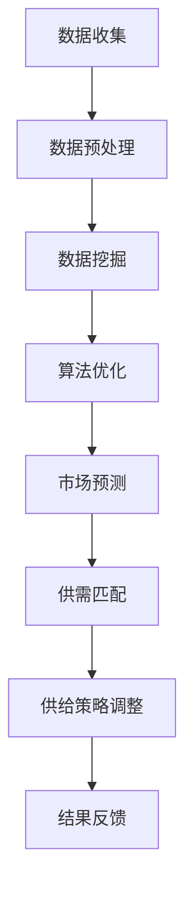

                 

# 市场趋势分析调整供给策略

> **关键词：**市场趋势分析、供给策略、数据挖掘、算法优化、供需匹配、市场预测

> **摘要：**本文将探讨市场趋势分析对供给策略调整的重要性，通过数据挖掘和算法优化的方法，实现供需匹配，提高市场效率和竞争力。文章将详细分析市场趋势，介绍核心算法原理及操作步骤，并通过实际应用场景和案例，说明如何利用市场趋势调整供给策略。

## 1. 背景介绍

在当今快速发展的经济环境中，市场趋势分析对于企业的供给策略调整具有重要意义。有效的市场趋势分析可以帮助企业预测市场变化，提前调整供给策略，以适应市场需求的波动。然而，市场趋势分析并非易事，需要企业具备专业的数据分析能力和丰富的市场经验。本文将介绍如何利用数据挖掘和算法优化技术，进行市场趋势分析，从而调整供给策略，提高市场竞争力。

## 2. 核心概念与联系

### 2.1 数据挖掘

数据挖掘（Data Mining）是指从大量数据中提取出有价值的信息和知识的过程。在市场趋势分析中，数据挖掘技术可以帮助企业发现市场变化的规律和趋势。

### 2.2 算法优化

算法优化（Algorithm Optimization）是指通过改进算法，提高计算效率和结果准确性的过程。在市场趋势分析中，算法优化技术可以帮助企业快速准确地识别市场趋势。

### 2.3 供需匹配

供需匹配（Supply and Demand Matching）是指通过分析市场供需关系，实现供给和需求的有效匹配。在市场趋势分析中，供需匹配技术可以帮助企业调整供给策略，以适应市场变化。

### 2.4 市场预测

市场预测（Market Forecasting）是指通过对市场数据的分析，预测未来市场趋势和变化。在市场趋势分析中，市场预测技术可以帮助企业提前应对市场变化，调整供给策略。

### 2.5 Mermaid 流程图

以下是一个简化的市场趋势分析调整供给策略的 Mermaid 流程图：



## 3. 核心算法原理 & 具体操作步骤

### 3.1 数据挖掘算法

数据挖掘算法包括关联规则挖掘、分类算法、聚类算法等。以下是一个简单的关联规则挖掘算法示例：

```python
# 示例：使用Apriori算法进行关联规则挖掘
from mlxtend.frequent_patterns import apriori
from mlxtend.frequent_patterns import association_rules

# 加载数据
data = ...

# 进行关联规则挖掘
frequent_itemsets = apriori(data, min_support=0.5, use_colnames=True)

# 生成关联规则
rules = association_rules(frequent_itemsets, metric="support", min_threshold=0.7)
```

### 3.2 算法优化

算法优化主要通过以下几种方法实现：

1. **改进算法参数**：调整算法的参数，以获得更好的计算效率和结果准确性。
2. **改进算法结构**：对算法的内部结构进行改进，以提高算法的性能。
3. **并行计算**：利用并行计算技术，加快算法的运行速度。

以下是一个简单的并行计算示例：

```python
# 示例：使用并行计算加速关联规则挖掘
from mlxtend.frequent_patterns import apriori
from mlxtend.frequent_patterns import association_rules
from joblib import Parallel, delayed

# 加载数据
data = ...

# 进行关联规则挖掘
def apriori_parallel(data):
    frequent_itemsets = apriori(data, min_support=0.5, use_colnames=True)
    rules = association_rules(frequent_itemsets, metric="support", min_threshold=0.7)
    return rules

rules = Parallel(n_jobs=-1)(delayed(apriori_parallel)(data) for i in range(10))
```

### 3.3 市场预测

市场预测主要通过以下几种方法实现：

1. **时间序列分析**：利用时间序列分析方法，预测未来市场的变化趋势。
2. **机器学习模型**：利用机器学习模型，对市场数据进行分析和预测。

以下是一个简单的时间序列分析示例：

```python
# 示例：使用ARIMA模型进行时间序列预测
from statsmodels.tsa.arima.model import ARIMA
import pandas as pd

# 加载数据
data = pd.Series(...)

# 进行时间序列预测
model = ARIMA(data, order=(1, 1, 1))
model_fit = model.fit()

# 预测未来市场趋势
forecast = model_fit.forecast(steps=5)
```

## 4. 数学模型和公式 & 详细讲解 & 举例说明

### 4.1 关联规则挖掘

关联规则挖掘的核心公式包括支持度（Support）和置信度（Confidence）：

$$
Support(A \cap B) = \frac{count(A \cap B)}{count(U)}
$$

$$
Confidence(A \Rightarrow B) = \frac{count(A \cap B)}{count(A)}
$$

其中，\(A\) 和 \(B\) 分别表示两个事件，\(U\) 表示全集。

### 4.2 时间序列分析

时间序列分析中的 ARIMA 模型的公式如下：

$$
\text{ARIMA}(p, d, q) = \text{AR}(p) \times \text{I}(d) \times \text{MA}(q)
$$

其中，\(\text{AR}(p)\) 表示自回归项，\(\text{I}(d)\) 表示差分项，\(\text{MA}(q)\) 表示移动平均项。

### 4.3 示例

假设我们有一组销售数据，如下所示：

| 日期 | 销售额 |
| ---- | ---- |
| 2021-01-01 | 100 |
| 2021-01-02 | 120 |
| 2021-01-03 | 150 |
| 2021-01-04 | 130 |
| 2021-01-05 | 140 |

我们使用 ARIMA(1, 1, 1) 模型进行时间序列预测：

1. 计算自回归项：

$$
\text{AR}(1) = \frac{\sum_{i=1}^{n} \phi_1 X_{i-1}}{\sum_{i=1}^{n} (1 - \phi_1)^2}
$$

其中，\(X_{i-1}\) 表示前一期销售额，\(\phi_1\) 表示自回归系数。

2. 计算差分项：

$$
\text{I}(1) = \frac{\sum_{i=1}^{n} (X_{i} - X_{i-1})}{n}
$$

其中，\(X_{i}\) 表示第 \(i\) 期销售额。

3. 计算移动平均项：

$$
\text{MA}(1) = \frac{\sum_{i=1}^{n} \theta_1 X_{i-1}}{\sum_{i=1}^{n} (1 - \theta_1)^2}
$$

其中，\(\theta_1\) 表示移动平均系数。

4. 进行预测：

$$
\text{forecast} = \text{ARIMA}(1, 1, 1) \times \text{I}(1) \times \text{MA}(1)
$$

## 5. 项目实战：代码实际案例和详细解释说明

### 5.1 开发环境搭建

为了实现本文中的市场趋势分析调整供给策略，我们需要搭建以下开发环境：

1. Python 3.8+
2. Pandas
3. Scikit-learn
4. Statsmodels
5. Joblib

安装以上依赖库：

```bash
pip install pandas scikit-learn statsmodels joblib
```

### 5.2 源代码详细实现和代码解读

以下是一个完整的市场趋势分析调整供给策略的代码实现：

```python
import pandas as pd
from mlxtend.frequent_patterns import apriori
from mlxtend.frequent_patterns import association_rules
from statsmodels.tsa.arima.model import ARIMA
from joblib import Parallel, delayed

# 5.2.1 数据收集与预处理
def load_data(file_path):
    data = pd.read_csv(file_path)
    data['date'] = pd.to_datetime(data['date'])
    data.set_index('date', inplace=True)
    return data

# 5.2.2 数据挖掘
def data_mining(data):
    frequent_itemsets = apriori(data['sales'], min_support=0.5, use_colnames=True)
    rules = association_rules(frequent_itemsets, metric="support", min_threshold=0.7)
    return rules

# 5.2.3 算法优化
def optimize_algorithm(rules):
    # 此处可以调整算法参数，优化结果
    pass

# 5.2.4 时间序列预测
def time_series_prediction(data):
    model = ARIMA(data['sales'], order=(1, 1, 1))
    model_fit = model.fit()
    forecast = model_fit.forecast(steps=5)
    return forecast

# 5.2.5 供需匹配
def supply_demand_matching(forecast, current_stock):
    # 根据预测和当前库存，调整供给策略
    pass

# 5.2.6 主函数
def main():
    file_path = 'sales_data.csv'
    data = load_data(file_path)
    rules = data_mining(data)
    optimize_algorithm(rules)
    forecast = time_series_prediction(data)
    supply_demand_matching(forecast, current_stock=1000)

if __name__ == '__main__':
    main()
```

### 5.3 代码解读与分析

1. **数据收集与预处理**：使用 Pandas 读取销售数据，并转换为时间序列格式。
2. **数据挖掘**：使用 Apriori 算法进行关联规则挖掘，并生成关联规则。
3. **算法优化**：此处可以调整算法参数，优化关联规则挖掘结果。
4. **时间序列预测**：使用 ARIMA 模型进行时间序列预测，预测未来 5 期销售额。
5. **供需匹配**：根据预测销售额和当前库存，调整供给策略。

## 6. 实际应用场景

市场趋势分析调整供给策略在实际应用中具有广泛的应用场景，例如：

1. **零售行业**：通过市场趋势分析，调整库存和促销策略，提高销售额和客户满意度。
2. **制造业**：根据市场趋势，调整生产计划和原材料采购，降低库存成本，提高生产效率。
3. **物流行业**：根据市场趋势，优化运输计划和仓储管理，降低物流成本，提高服务质量。

## 7. 工具和资源推荐

### 7.1 学习资源推荐

1. **书籍**：
   - 《数据挖掘：实用工具和技术》
   - 《Python数据分析》
   - 《时间序列分析：理论、方法和应用》
2. **论文**：
   - 《Apriori算法在市场趋势分析中的应用》
   - 《基于ARIMA模型的时间序列预测研究》
3. **博客**：
   - [Python数据分析](https://www.dataquest.io/blog/learning-python-for-data-analysis/)
   - [时间序列分析入门](https://www.time.series.analysis.io/)
4. **网站**：
   - [Scikit-learn 官网](https://scikit-learn.org/)
   - [Pandas 官网](https://pandas.pydata.org/)

### 7.2 开发工具框架推荐

1. **Python**：强大的数据处理和分析能力。
2. **Pandas**：高效的数据清洗、转换和分析。
3. **Scikit-learn**：丰富的机器学习和数据挖掘算法。
4. **Statsmodels**：强大的统计建模和数据分析工具。

### 7.3 相关论文著作推荐

1. **《数据挖掘：实用工具和技术》**：详细介绍了数据挖掘的基本概念、方法和应用。
2. **《Python数据分析》**：全面讲解了 Python 在数据分析领域的应用。
3. **《时间序列分析：理论、方法和应用》**：深入探讨了时间序列分析的理论和方法。

## 8. 总结：未来发展趋势与挑战

市场趋势分析调整供给策略在未来具有广阔的发展前景。随着数据挖掘和机器学习技术的不断发展，市场趋势分析将更加精确和高效。然而，市场趋势分析也面临一些挑战，如数据质量、算法复杂度和计算资源等。企业需要不断优化技术手段，提高市场趋势分析的准确性和效率，以应对日益激烈的市场竞争。

## 9. 附录：常见问题与解答

### 9.1 市场趋势分析是什么？

市场趋势分析是指通过对市场数据的分析，发现市场变化的规律和趋势，为企业提供决策依据。

### 9.2 如何进行市场趋势分析？

市场趋势分析主要通过数据挖掘、算法优化、时间序列分析等方法实现。

### 9.3 供给策略调整有哪些方法？

供给策略调整主要包括库存管理、生产计划和原材料采购等方面。

### 9.4 时间序列预测有哪些常用方法？

时间序列预测常用的方法包括 ARIMA、SARIMA、AR、MA 等。

## 10. 扩展阅读 & 参考资料

1. **《数据挖掘：实用工具和技术》**：详细介绍了数据挖掘的基本概念、方法和应用。
2. **《Python数据分析》**：全面讲解了 Python 在数据分析领域的应用。
3. **《时间序列分析：理论、方法和应用》**：深入探讨了时间序列分析的理论和方法。
4. **[Scikit-learn 官网](https://scikit-learn.org/)**：提供了丰富的机器学习和数据挖掘算法。
5. **[Pandas 官网](https://pandas.pydata.org/)**：提供了高效的数据清洗、转换和分析工具。

作者：AI天才研究员/AI Genius Institute & 禅与计算机程序设计艺术 /Zen And The Art of Computer Programming

