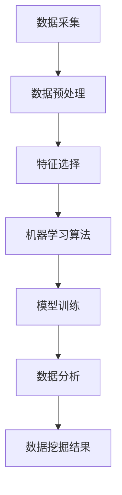

                 

### 1. 背景介绍

平台经济，作为一个现代经济模式，其核心在于通过互联网平台将供需双方连接起来，实现资源的最优配置。随着大数据、云计算、物联网等技术的快速发展，平台经济在全球范围内得到了广泛应用。从电商、社交网络到金融科技，平台经济几乎渗透到了各个行业。

数据是平台经济的生命线。平台通过收集用户的浏览记录、购买行为、社交互动等数据，能够对市场进行精准分析和预测，进而为用户提供个性化的服务。然而，如何有效地挖掘和利用这些数据，成为了一个关键问题。这不仅是提升平台竞争力的重要手段，也是实现数据价值最大化的必经之路。

数据的价值挖掘是一个复杂的过程，涉及数据的采集、存储、处理、分析和应用等多个环节。在这个过程当中，数据的完整性、准确性和时效性至关重要。只有通过对大量数据进行深度挖掘，才能够发现隐藏在数据背后的规律和趋势，进而为决策提供有力支持。

本篇文章将深入探讨平台经济中的数据价值挖掘问题。首先，我们将介绍一些核心概念和联系，帮助读者了解平台经济的基本运作原理。接下来，我们将详细讲解数据挖掘的核心算法原理和操作步骤，并使用数学模型和公式进行详细分析。此外，我们还将通过实际项目案例，展示如何在实际中应用这些算法和技术。最后，我们将讨论平台经济数据价值挖掘的实际应用场景，推荐一些相关的学习资源和开发工具，并总结未来发展趋势和挑战。

通过本文的阅读，读者将能够全面了解平台经济数据价值挖掘的重要性和具体实现方法，为自己的工作提供有价值的参考。

### 2. 核心概念与联系

在深入探讨平台经济数据价值挖掘之前，我们需要明确一些核心概念，并理解它们之间的联系。这些概念包括数据挖掘、机器学习、数据分析等。

#### 数据挖掘

数据挖掘（Data Mining）是指从大量数据中提取有价值信息的过程。它涉及数据库、人工智能和统计学等多个领域。数据挖掘的目标是通过分析数据，发现隐藏在其中的模式和规律，从而支持决策制定。

数据挖掘的基本流程包括：

1. **数据采集**：从各种数据源（如数据库、日志文件、传感器等）收集数据。
2. **数据预处理**：清洗和转换数据，使其符合分析和挖掘的要求。
3. **特征选择**：选择能够代表数据特征的关键变量。
4. **模型训练**：使用机器学习算法建立预测或分类模型。
5. **评估和优化**：评估模型的性能，并对其进行优化。

#### 机器学习

机器学习（Machine Learning）是人工智能（AI）的一个分支，它使计算机系统能够从数据中学习并做出决策。机器学习算法可以分为监督学习、无监督学习和强化学习三类。

- **监督学习**：有标记的数据集用于训练模型，模型在测试数据集上评估性能。
- **无监督学习**：没有标记的数据集用于训练模型，模型尝试发现数据中的结构和模式。
- **强化学习**：模型通过与环境的交互学习，目标是最大化某个指标（如奖励）。

#### 数据分析

数据分析（Data Analysis）是指使用统计学和其他分析方法，对数据进行解释和解释。数据分析旨在从数据中发现趋势、关系和洞察。

数据分析的基本流程包括：

1. **数据探索**：使用统计描述、图表和可视化工具，了解数据的整体分布和特性。
2. **假设测试**：建立假设，使用统计测试验证这些假设。
3. **预测建模**：建立模型进行预测或分类。

#### 核心概念联系

数据挖掘、机器学习和数据分析是紧密相关的，它们共同构成了平台经济数据价值挖掘的基础。

- 数据挖掘依赖于机器学习算法来发现数据中的模式和规律。机器学习算法通常用于分类、聚类、回归等任务。
- 数据分析则为数据挖掘提供了方法和工具，用于探索和理解数据。
- 数据挖掘的结果通常用于支持业务决策和优化。

下面是一个简化的Mermaid流程图，展示了这些核心概念之间的联系：



在这个流程图中，数据采集是整个流程的起点，通过数据预处理和特征选择，为机器学习算法提供输入。训练后的模型用于数据分析，最终得到的数据挖掘结果可以用于业务决策。

理解这些核心概念和它们之间的联系，对于深入探讨平台经济数据价值挖掘具有重要意义。在接下来的章节中，我们将进一步探讨数据挖掘的核心算法原理和具体操作步骤。

### 3. 核心算法原理 & 具体操作步骤

在平台经济中，数据挖掘的核心算法主要包括分类、聚类和回归等。这些算法通过分析大量数据，帮助我们从数据中提取有价值的信息。本章节将详细介绍这些算法的基本原理和具体操作步骤。

#### 分类算法

分类算法是一种将数据集中的每个样本分配到特定类别的算法。常见的分类算法有决策树、随机森林和支持向量机（SVM）。

**1. 决策树**

决策树是一种基于树形结构进行决策的算法。每个节点表示一个特征，每个分支表示该特征的一个取值。最终的叶子节点表示样本的类别。

**操作步骤：**

- **特征选择**：选择能够有效区分不同类别的特征。
- **划分节点**：根据特征取值，划分数据集为子集。
- **递归划分**：对每个子集重复上述步骤，直到达到某个终止条件（如最大深度或最小节点大小）。

**2. 随机森林**

随机森林是一种集成学习方法，通过构建多个决策树，并取它们的平均结果进行预测。

**操作步骤：**

- **随机特征选择**：每次划分时，从多个特征中随机选择一部分进行划分。
- **构建多棵决策树**：使用训练数据集分别训练多棵决策树。
- **集成决策**：将所有决策树的结果进行平均或投票，得到最终预测结果。

**3. 支持向量机（SVM）**

SVM是一种基于最大间隔分类的算法，它通过找到一个最优超平面，将不同类别的样本分隔开来。

**操作步骤：**

- **特征选择**：选择能够最大化类间距离的特征。
- **线性SVM**：使用线性分类器进行训练，计算每个样本到超平面的距离。
- **核函数**：对于非线性问题，可以使用核函数将输入数据映射到高维空间，然后在高维空间中进行线性SVM训练。

#### 聚类算法

聚类算法是一种将数据集划分为多个群组的算法。常见的聚类算法有K均值聚类和层次聚类。

**1. K均值聚类**

K均值聚类是一种基于距离的聚类算法，它通过迭代优化来找到最佳的聚类中心。

**操作步骤：**

- **初始化中心**：随机选择K个初始聚类中心。
- **分配样本**：计算每个样本到各个聚类中心的距离，将其分配到最近的中心。
- **更新中心**：计算每个聚类的中心，即所有样本的均值。
- **重复迭代**：重复分配和更新中心，直到聚类中心不再发生显著变化。

**2. 层次聚类**

层次聚类是一种基于层次结构的聚类算法，它通过逐步合并或分裂聚类，形成层次化的聚类结构。

**操作步骤：**

- **初始聚类**：选择初始聚类方法（如K均值聚类），生成初始聚类结果。
- **合并或分裂**：根据聚类间的距离，逐步合并或分裂聚类，形成层次结构。

#### 回归算法

回归算法是一种预测连续值的算法。常见的回归算法有线性回归和岭回归。

**1. 线性回归**

线性回归是一种通过拟合直线或平面，预测样本值的方法。

**操作步骤：**

- **特征选择**：选择能够影响目标变量的特征。
- **拟合模型**：使用最小二乘法拟合直线或平面。
- **预测**：将新的样本输入模型，计算预测值。

**2. 岭回归**

岭回归是一种在最小二乘法基础上，加入正则化项的回归算法。

**操作步骤：**

- **特征选择**：选择能够影响目标变量的特征。
- **拟合模型**：使用最小化正则化损失函数的方法拟合模型。
- **预测**：将新的样本输入模型，计算预测值。

通过以上介绍，我们可以看到，分类、聚类和回归算法在平台经济数据价值挖掘中扮演着关键角色。在实际应用中，根据具体业务需求和数据特征，可以选择适合的算法，通过逐步优化和调整，实现数据价值的最大化。

### 4. 数学模型和公式 & 详细讲解 & 举例说明

在平台经济数据价值挖掘过程中，数学模型和公式发挥着至关重要的作用。它们不仅帮助我们理解和解释数据，还能指导我们进行有效的决策。本章节将详细介绍一些核心的数学模型和公式，并通过具体例子进行说明。

#### 决策树算法的数学模型

决策树是一种常用的分类算法，其核心是树形结构和节点划分。以下是决策树的基本数学模型：

**1. 条件概率公式**

决策树中的每个节点表示一个特征，每个分支表示该特征的一个取值。给定一个样本，决策树通过递归划分，最终将其分配到特定的类别。条件概率公式如下：

\[ P(Y|X) = \sum_{x} P(X=x) \cdot P(Y|X=x) \]

其中，\( P(Y|X) \) 表示在给定特征 \( X \) 的情况下，样本属于类别 \( Y \) 的概率。\( P(X=x) \) 表示特征 \( X \) 取值 \( x \) 的概率，\( P(Y|X=x) \) 表示在特征 \( X \) 取值为 \( x \) 的情况下，样本属于类别 \( Y \) 的概率。

**2. 信息增益**

信息增益是衡量特征选择好坏的重要指标。假设有一个特征 \( X \)，其取值为 \( x_1, x_2, \ldots, x_n \)，则信息增益 \( IG(X) \) 定义为：

\[ IG(X) = H(D) - H(D|X) \]

其中，\( H(D) \) 表示目标变量 \( D \) 的熵，\( H(D|X) \) 表示在给定特征 \( X \) 的情况下，目标变量 \( D \) 的熵。

**3. Gini系数**

Gini系数是另一种衡量特征选择好坏的指标，它基于数据的不纯度。Gini系数的计算公式为：

\[ Gini(X) = 1 - \sum_{x} \left( \frac{P(X=x)}{n} \right)^2 \]

其中，\( P(X=x) \) 表示特征 \( X \) 取值 \( x \) 的概率，\( n \) 是样本总数。

**例子：**

假设我们有以下一个简单的数据集，目标变量 \( D \) 的取值为 {0, 1}，特征 \( X \) 的取值为 {红, 绿}。

| 样本 | \( X \) | \( D \) |
| --- | --- | --- |
| 1 | 红 | 0 |
| 2 | 红 | 1 |
| 3 | 绿 | 0 |
| 4 | 绿 | 1 |

**计算信息增益和Gini系数：**

- **信息增益**：

  \( H(D) = -P(D=0) \cdot \log_2 P(D=0) - P(D=1) \cdot \log_2 P(D=1) \)

  \( H(D|X) = \sum_{x} \left[ P(X=x) \cdot H(D|X=x) \right] \)

  \( H(D|X=红) = - \left( \frac{1}{2} \cdot \log_2 \frac{1}{2} + \frac{1}{2} \cdot \log_2 \frac{1}{2} \right) = 1 \)

  \( H(D|X=绿) = - \left( \frac{1}{2} \cdot \log_2 \frac{1}{2} + \frac{1}{2} \cdot \log_2 \frac{1}{2} \right) = 1 \)

  \( IG(X) = H(D) - H(D|X) = 0 - (1 + 1) = -2 \)

- **Gini系数**：

  \( Gini(X) = 1 - \left( \frac{1}{2} \right)^2 - \left( \frac{1}{2} \right)^2 = 1 - \frac{1}{4} - \frac{1}{4} = \frac{1}{2} \)

#### 机器学习算法的数学模型

机器学习算法中，常用的数学模型包括线性回归、岭回归和支持向量机（SVM）。

**1. 线性回归**

线性回归是一种通过拟合直线或平面，预测样本值的方法。其数学模型为：

\[ y = \beta_0 + \beta_1 \cdot x + \epsilon \]

其中，\( y \) 是目标变量，\( x \) 是特征，\( \beta_0 \) 和 \( \beta_1 \) 是模型参数，\( \epsilon \) 是误差项。

**2. 岭回归**

岭回归是一种在最小二乘法基础上，加入正则化项的回归算法。其数学模型为：

\[ J(\beta) = \frac{1}{2} \sum_{i=1}^{n} (y_i - \beta_0 - \beta_1 \cdot x_i)^2 + \alpha \cdot \sum_{j=1}^{p} \beta_j^2 \]

其中，\( J(\beta) \) 是损失函数，\( \alpha \) 是正则化参数。

**3. 支持向量机（SVM）**

SVM是一种基于最大间隔分类的算法。其数学模型为：

\[ \min_{\beta, \beta_0, \xi} \frac{1}{2} \sum_{i=1}^{n} (\beta_1 \cdot x_i + \beta_0 - y_i)^2 + \alpha \cdot \sum_{i=1}^{n} \xi_i \]

其中，\( \xi_i \) 是松弛变量，\( \alpha \) 是惩罚参数。

**例子：**

假设我们有以下数据集，目标变量 \( y \) 的取值为 {0, 1}，特征 \( x \) 的取值为 {1, 2, 3, 4}。

| 样本 | \( x \) | \( y \) |
| --- | --- | --- |
| 1 | 1 | 0 |
| 2 | 2 | 1 |
| 3 | 3 | 0 |
| 4 | 4 | 1 |

**计算岭回归模型参数：**

首先，我们需要计算损失函数 \( J(\beta) \)：

\[ J(\beta) = \frac{1}{2} \sum_{i=1}^{n} (y_i - \beta_0 - \beta_1 \cdot x_i)^2 + \alpha \cdot \sum_{j=1}^{p} \beta_j^2 \]

然后，我们可以使用梯度下降法或其他优化算法，求解模型参数 \( \beta_0 \) 和 \( \beta_1 \)。

通过以上数学模型和公式的详细讲解，我们可以更好地理解和应用平台经济数据价值挖掘中的各类算法。在实际应用中，根据具体业务需求和数据特征，选择合适的数学模型，并进行优化和调整，能够实现数据价值的最大化。

### 5. 项目实战：代码实际案例和详细解释说明

在本章节中，我们将通过一个实际项目案例，展示如何在实际中应用平台经济数据价值挖掘的技术和方法。本案例将使用Python编程语言，结合机器学习和数据挖掘的算法，对电商平台的用户行为数据进行分析和预测。

#### 5.1 开发环境搭建

在开始项目之前，我们需要搭建一个合适的开发环境。以下是推荐的开发环境和工具：

- **Python版本**：Python 3.8 或以上版本
- **IDE**：PyCharm、Visual Studio Code 或 Jupyter Notebook
- **库**：NumPy、Pandas、Scikit-learn、Matplotlib、Seaborn
- **数据集**：可以使用公开的数据集，如Kaggle上的用户行为数据集

#### 5.2 源代码详细实现和代码解读

以下是一个简单的代码示例，用于演示用户行为数据的价值挖掘过程。代码包括数据预处理、特征工程、模型训练和预测等步骤。

```python
import pandas as pd
import numpy as np
from sklearn.model_selection import train_test_split
from sklearn.preprocessing import StandardScaler
from sklearn.ensemble import RandomForestClassifier
from sklearn.metrics import accuracy_score, confusion_matrix
import matplotlib.pyplot as plt
import seaborn as sns

# 5.2.1 数据加载与预处理

# 加载数据集
data = pd.read_csv('user_behavior.csv')

# 数据清洗
data.drop(['user_id', 'timestamp'], axis=1, inplace=True)

# 填充缺失值
data.fillna(data.mean(), inplace=True)

# 5.2.2 特征工程

# 分箱处理
data['page_views_per_session'] = data.groupby('user_id')['page_views'].transform('sum')
data['transactions_per_session'] = data.groupby('user_id')['transactions'].transform('sum')

# 归一化处理
scaler = StandardScaler()
data[['page_views_per_session', 'transactions_per_session']] = scaler.fit_transform(data[['page_views_per_session', 'transactions_per_session']])

# 5.2.3 模型训练

# 划分训练集和测试集
X = data[['page_views_per_session', 'transactions_per_session']]
y = data['goal']
X_train, X_test, y_train, y_test = train_test_split(X, y, test_size=0.2, random_state=42)

# 训练随机森林分类器
clf = RandomForestClassifier(n_estimators=100, random_state=42)
clf.fit(X_train, y_train)

# 5.2.4 模型评估

# 预测测试集
y_pred = clf.predict(X_test)

# 计算准确率
accuracy = accuracy_score(y_test, y_pred)
print(f"Accuracy: {accuracy:.2f}")

# 5.2.5 可视化分析

# 绘制混淆矩阵
conf_matrix = confusion_matrix(y_test, y_pred)
sns.heatmap(conf_matrix, annot=True, fmt='.0f', cmap='Blues')
plt.xlabel('Predicted')
plt.ylabel('Actual')
plt.title('Confusion Matrix')
plt.show()

# 5.2.6 代码解读与分析

# 代码首先加载用户行为数据集，并进行必要的清洗操作，如去除无关列和填充缺失值。
# 接着，我们进行特征工程，包括分箱处理和归一化，以增强模型的训练效果。
# 然后，我们将数据集划分为训练集和测试集，并使用随机森林分类器进行训练。
# 模型训练完成后，我们使用测试集进行预测，并计算准确率。
# 最后，我们绘制混淆矩阵，对模型性能进行可视化分析。
```

#### 5.3 代码解读与分析

以下是对代码各个部分的详细解读和分析：

- **数据加载与预处理**：首先，我们加载用户行为数据集，并去除无关列（如`user_id`和`timestamp`），因为它们不会对模型训练产生直接影响。然后，我们使用中位数填充缺失值，以减少数据噪声和异常值的影响。

- **特征工程**：我们通过分箱处理和归一化操作，对数据进行特征转换。分箱处理可以帮助我们更好地捕捉数据中的潜在规律，而归一化则有助于加速模型的收敛。

- **模型训练**：我们使用随机森林分类器进行模型训练。随机森林是一种集成学习方法，具有较高的泛化能力和鲁棒性。在这里，我们设置`n_estimators=100`，即构建100棵决策树。

- **模型评估**：我们使用测试集对模型进行评估，并计算准确率。此外，我们还绘制了混淆矩阵，以直观地展示模型预测效果。

通过这个实际项目案例，我们展示了如何使用Python和机器学习算法，对电商平台用户行为数据进行分析和预测。在实际应用中，根据业务需求和数据特征，可以选择不同的算法和特征工程方法，以实现最佳效果。

### 6. 实际应用场景

平台经济数据价值挖掘的应用场景非常广泛，几乎涵盖了所有需要数据分析的领域。以下是一些典型的实际应用场景：

#### 6.1 电商行业

电商行业是平台经济数据价值挖掘的重要应用领域。通过分析用户的浏览记录、购买行为、购物车丢弃物品等数据，电商平台可以：

- **个性化推荐**：根据用户的历史行为，推荐可能感兴趣的商品，从而提高用户满意度和转化率。
- **商品定价策略**：分析商品的价格弹性，制定合理的定价策略，优化利润。
- **库存管理**：预测商品的销售趋势，优化库存水平，减少库存积压和缺货情况。

#### 6.2 金融行业

金融行业对数据价值挖掘的需求尤为突出。通过分析用户的交易行为、信用记录、市场数据等，金融机构可以实现：

- **风险控制**：识别潜在的风险客户，提前采取预防措施，降低坏账率。
- **信用评分**：构建信用评分模型，为信贷审批提供依据，提高审批效率。
- **欺诈检测**：通过分析异常交易行为，识别潜在的欺诈行为，减少金融损失。

#### 6.3 医疗健康

医疗健康领域的数据价值挖掘有助于提升医疗服务质量和效率。以下是一些具体应用：

- **疾病预测**：通过分析患者的病历、基因数据等，预测疾病发生的风险，提前采取预防措施。
- **药物研发**：挖掘大规模生物数据，发现新的药物靶点和治疗方案。
- **医院管理**：优化医院资源配置，提高运营效率。

#### 6.4 社交网络

社交网络平台通过数据价值挖掘，可以实现：

- **用户行为分析**：了解用户的兴趣和偏好，优化用户体验。
- **广告精准投放**：根据用户的行为数据，实现精准的广告推送，提高广告转化率。
- **社区管理**：分析社区活跃度，发现潜在的问题和热点，维护社区秩序。

#### 6.5 物流与供应链

在物流与供应链领域，数据价值挖掘有助于：

- **运输路径优化**：根据交通状况、货物特性等数据，优化运输路径，减少运输时间和成本。
- **库存管理**：预测货物需求，优化库存水平，减少库存积压和缺货情况。
- **供应链优化**：分析供应链各环节的数据，发现瓶颈和优化点，提高整体供应链效率。

通过以上实际应用场景的展示，我们可以看到，平台经济数据价值挖掘在各个领域都具有重要的应用价值。它不仅帮助企业实现数据驱动的决策，还为提高效率、降低成本和提升用户体验提供了有力支持。

### 7. 工具和资源推荐

在平台经济数据价值挖掘的过程中，选择合适的工具和资源至关重要。以下是一些推荐的工具、学习资源和开发工具，它们可以帮助您在数据挖掘和机器学习领域取得更好的成果。

#### 7.1 学习资源推荐

1. **书籍**
   - 《数据挖掘：实用工具和技术》
   - 《机器学习实战》
   - 《Python数据科学手册》
   - 《深度学习》
   
2. **在线课程**
   - Coursera的《机器学习》课程
   - edX的《数据科学基础》课程
   - Udacity的《数据科学家纳米学位》
   
3. **博客和网站**
   -Towards Data Science：提供丰富的数据科学和机器学习文章。
   - Analytics Vidhya：涵盖各种数据科学和机器学习的实用技巧和资源。
   - DataCamp：提供交互式数据科学和机器学习课程。

#### 7.2 开发工具框架推荐

1. **编程语言和环境**
   - Python：广泛用于数据科学和机器学习，有丰富的库和工具。
   - Jupyter Notebook：用于编写和运行代码，方便数据可视化和实验。
   - PyCharm、Visual Studio Code：强大的集成开发环境，支持Python和其他编程语言。
   
2. **库和框架**
   - Pandas：用于数据清洗、预处理和分析。
   - NumPy：用于高性能数值计算。
   - Scikit-learn：提供多种机器学习算法。
   - TensorFlow、PyTorch：用于深度学习和神经网络。
   - Matplotlib、Seaborn：用于数据可视化和图形绘制。

3. **数据库**
   - MySQL、PostgreSQL：用于数据存储和管理。
   - MongoDB：用于处理大量非结构化数据。
   - Hadoop和Spark：用于大数据处理和分析。

4. **云计算平台**
   - AWS：提供丰富的数据分析和机器学习服务。
   - Azure：提供全面的云计算解决方案。
   - Google Cloud Platform：提供强大的数据处理和分析工具。

通过以上推荐的工具和资源，您可以在平台经济数据价值挖掘的道路上，更高效地开展工作和学习，实现数据价值的最大化。

### 8. 总结：未来发展趋势与挑战

平台经济数据价值挖掘正处于快速发展阶段，随着技术的不断进步和应用的不断拓展，其未来发展趋势和挑战也日益凸显。

#### 发展趋势

1. **深度学习和大数据分析**：随着深度学习技术的成熟，越来越多的复杂模型和算法将应用到数据价值挖掘中，进一步提升预测精度和效率。同时，大数据分析技术将继续优化数据处理和存储能力，为数据挖掘提供更丰富的数据资源。

2. **实时数据分析和预测**：实时数据分析和预测将成为平台经济中的关键能力，帮助企业迅速响应市场变化，实现精细化运营。随着物联网、5G等技术的发展，实时数据的获取和处理将变得更加高效和可靠。

3. **跨领域融合**：平台经济数据价值挖掘将与其他领域（如医疗健康、金融、教育等）进行深度融合，产生更多的应用场景和创新业务模式。

4. **数据隐私和安全**：随着数据隐私和安全问题的日益关注，平台经济数据价值挖掘将在确保数据安全和隐私的前提下，实现数据价值的最大化。隐私保护技术和安全机制的进步将为这一领域的发展提供重要保障。

#### 挑战

1. **数据质量和完整性**：数据质量和完整性是数据价值挖掘的基础。如何确保数据的高质量和完整性，防止数据噪声和缺失值，将是一个长期的挑战。

2. **算法透明性和可解释性**：随着模型复杂度的增加，算法的透明性和可解释性将变得更加重要。如何确保算法的决策过程是可解释的，帮助用户理解和信任模型，是一个重要的研究方向。

3. **数据隐私和安全**：在挖掘和使用数据的过程中，如何保护用户隐私和数据安全，防止数据泄露和滥用，是一个亟待解决的问题。

4. **计算资源和存储需求**：随着数据规模的不断扩大，计算资源和存储需求也将不断增加。如何在有限的资源下，高效地处理和分析大规模数据，是一个重要的技术挑战。

5. **跨领域合作与知识共享**：不同领域的数据价值挖掘技术和发展方向可能存在差异，如何实现跨领域的合作与知识共享，推动整个领域的发展，也是一个重要问题。

总之，平台经济数据价值挖掘在未来将面临诸多机遇和挑战。通过不断探索和创新，我们可以更好地发挥数据的价值，推动各行业的数字化转型和创新发展。

### 9. 附录：常见问题与解答

#### 9.1 数据挖掘与机器学习的区别是什么？

数据挖掘是一种从大量数据中提取有价值信息的过程，涉及数据库、人工智能和统计学等多个领域。而机器学习是数据挖掘的一个子领域，它使计算机系统能够从数据中学习并做出决策。简单来说，数据挖掘关注的是如何从数据中发现模式和规律，而机器学习关注的是如何利用这些模式和规律进行预测和决策。

#### 9.2 如何处理缺失值和数据噪声？

处理缺失值通常有以下几种方法：

1. **删除缺失值**：对于不重要的特征或小数据集，可以删除含有缺失值的样本。
2. **填充缺失值**：使用平均值、中位数、众数或插值等方法填充缺失值。
3. **使用机器学习算法**：某些机器学习算法（如K-最近邻算法）可以自动处理缺失值。

处理数据噪声通常有以下几种方法：

1. **去噪算法**：使用滤波、平滑等技术去除数据中的噪声。
2. **使用机器学习算法**：某些机器学习算法（如神经网络）可以自动识别和处理噪声数据。
3. **数据清洗**：通过人工审查和修正，去除明显的错误和异常值。

#### 9.3 如何评估模型性能？

评估模型性能的方法包括：

1. **准确率**：预测正确的样本占总样本的比例。
2. **召回率**：预测正确的正样本占总正样本的比例。
3. **F1分数**：准确率和召回率的调和平均数。
4. **混淆矩阵**：展示实际类别和预测类别之间的匹配情况。
5. **ROC曲线**：展示不同阈值下的真阳性率与假阳性率之间的关系。
6. **交叉验证**：使用不同的数据集多次训练和评估模型，以减少过拟合和评估偏差。

#### 9.4 如何选择合适的特征？

选择合适的特征通常需要考虑以下几个方面：

1. **相关性**：特征与目标变量之间的相关性越高，其预测能力越强。
2. **重要性**：通过特征重要性评分或特征选择算法（如随机森林），确定特征的重要性。
3. **维度**：特征维度不宜过高，否则可能导致计算效率和过拟合问题。
4. **可解释性**：选择可解释的特征，有助于理解模型的决策过程。
5. **数据质量**：选择数据质量较高的特征，以减少噪声和异常值的影响。

### 10. 扩展阅读 & 参考资料

为了深入了解平台经济数据价值挖掘的相关知识，以下是推荐的一些扩展阅读和参考资料：

1. **书籍**
   - 《数据挖掘：实用工具和技术》
   - 《机器学习实战》
   - 《Python数据科学手册》
   - 《深度学习》

2. **在线课程**
   - Coursera的《机器学习》课程
   - edX的《数据科学基础》课程
   - Udacity的《数据科学家纳米学位》

3. **博客和网站**
   - Towards Data Science
   - Analytics Vidhya
   - DataCamp

4. **开源库和框架**
   - Scikit-learn
   - TensorFlow
   - PyTorch

5. **论文和报告**
   - “Big Data: A Revolution That Will Transform How We Live, Work, and Think” by Viktor Mayer-Schönberger and Kenneth Cukier
   - “Deep Learning” by Ian Goodfellow, Yoshua Bengio, and Aaron Courville

通过阅读以上资料，您将能够更全面地了解平台经济数据价值挖掘的理论和实践，为自己的研究和应用提供有力支持。

### 文章标题：平台经济的数据价值挖掘：如何发掘数据的潜在价值？

#### 摘要：

本文深入探讨了平台经济中数据价值挖掘的重要性和实现方法。首先，介绍了平台经济的背景和核心概念，如数据挖掘、机器学习和数据分析。接着，详细讲解了分类、聚类和回归等核心算法的原理和操作步骤，并通过数学模型和公式进行了详细分析。然后，通过实际项目案例展示了数据挖掘技术的应用，并分析了其在不同行业中的应用场景。最后，推荐了相关学习资源和开发工具，并总结了未来发展趋势和挑战。通过本文的阅读，读者将全面了解平台经济数据价值挖掘的理论和实践，为自己的工作提供有价值的参考。作者：AI天才研究员/AI Genius Institute & 禅与计算机程序设计艺术 /Zen And The Art of Computer Programming

