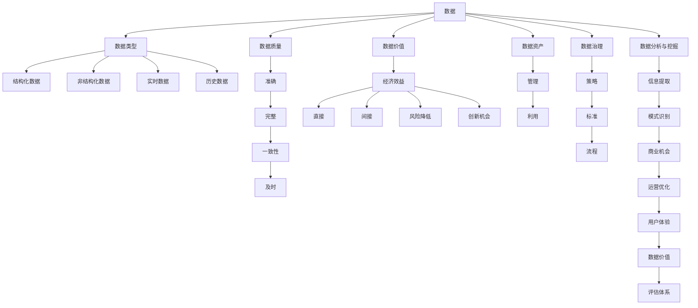

                 

### 背景介绍

平台经济作为一种新型的商业模式，近年来在全球范围内迅速崛起。平台经济的核心在于连接供需双方，通过提供高效的交易平台，实现资源的优化配置和价值的最大化。这种商业模式在电子商务、共享经济、金融科技等多个领域得到了广泛应用。

随着平台经济的快速发展，对其数据价值的评估成为了一个重要的研究课题。数据被视为平台经济的核心资产，其价值评估的准确性和合理性直接影响到平台的运营策略、投资决策以及商业模式的可持续性。

然而，平台经济的数据价值评估面临诸多挑战。首先，平台数据的复杂性使得评估过程变得困难。平台数据不仅量大，且包含多种类型的数据，如结构化数据、非结构化数据、实时数据和历史数据等。其次，平台经济的动态性使得评估模型需要不断更新以适应新的市场环境。此外，不同平台间的差异性也增加了评估的难度。

因此，建立一套科学、合理、可操作的平台经济数据价值评估体系具有重要的理论和实践意义。这不仅有助于企业更好地了解和利用其数据资产，也为投资者和政策制定者提供了重要的决策依据。

本文旨在探讨平台经济的数据价值评估体系，从核心概念、算法原理、数学模型、实际应用等多个维度，提供一套系统性的解决方案。希望通过本文的阐述，能够为相关领域的研究和实践提供有益的参考。

### 核心概念与联系

在深入探讨平台经济的数据价值评估体系之前，我们需要明确一些核心概念及其相互之间的联系。以下是对这些核心概念的定义和解释，以及它们在平台经济数据价值评估中的作用。

#### 数据

数据是平台经济中最为基础的要素。数据可以定义为通过测量、记录或观察获取的信息，它们可以是数字、文字、图像、声音等多种形式。在平台经济中，数据是供需双方互动的记录，是平台运行和决策的重要依据。

#### 数据类型

平台经济中的数据类型多样，主要包括：

- **结构化数据**：通常以表格形式存储，如数据库中的数据。
- **非结构化数据**：如文本、图像、音频和视频等，通常没有固定的格式。
- **实时数据**：指在特定时间点或时间段内产生的新数据。
- **历史数据**：指过去某一时间段内积累的数据。

不同类型的数据在平台经济中扮演不同的角色。结构化数据通常用于统计分析和趋势预测，非结构化数据则可以提供更深入的洞察和情境理解，实时数据则用于实时监控和响应，而历史数据则为长期分析和决策提供了宝贵的参考。

#### 数据质量

数据质量是评估数据价值的重要指标。高质量的数据应当是准确、完整、一致和及时的。在平台经济中，低质量的数据会导致错误的决策和不良的用户体验，从而影响平台的运营效率和用户满意度。

#### 数据价值

数据价值指的是数据对平台、企业或个体带来的经济或非经济利益。数据价值可以从多个角度进行评估，如其产生的直接经济效益、间接经济效益、风险降低、创新机会等。

#### 数据资产

数据资产是指企业或平台所拥有和控制的、能够为企业带来经济利益的数据资源。将数据视为资产，有助于企业对其数据进行有效管理和优化利用。

#### 数据治理

数据治理是指制定和执行策略、标准和流程，以确保数据的有效管理、合规和安全。在平台经济中，良好的数据治理能够提高数据质量，保障数据安全，并最大化数据价值。

#### 数据分析与挖掘

数据分析和挖掘是指利用统计学、机器学习、数据挖掘等方法，从大量数据中提取有价值的信息和模式。在平台经济中，数据分析和挖掘是评估数据价值的重要手段，能够帮助企业发现潜在的商业机会、优化运营策略、提升用户体验。

### 架构流程图

为了更直观地理解上述核心概念之间的联系，我们可以使用 Mermaid 流程图（Mermaid 图）来描述平台经济数据价值评估的架构流程。



通过这个流程图，我们可以看到数据类型、数据质量、数据价值、数据资产、数据治理和数据分析与挖掘等核心概念之间的关系，以及它们在平台经济数据价值评估中的作用。

理解这些核心概念及其相互之间的联系，是建立科学、合理、可操作的平台经济数据价值评估体系的基础。在接下来的部分，我们将进一步探讨核心算法原理和具体操作步骤，以构建一个全面的数据价值评估框架。

#### 核心算法原理 & 具体操作步骤

在平台经济的数据价值评估体系中，核心算法的选择和实现是确保评估结果准确性和可靠性的关键。以下是几种常用的核心算法原理及其具体操作步骤。

##### 1. 成本效益分析（Cost-Benefit Analysis）

成本效益分析是一种广泛使用的评估方法，通过比较投资项目的成本与预期收益，评估其经济效益。具体操作步骤如下：

1. **定义项目范围**：明确评估的具体项目，包括预期目标、投入资源、时间范围等。
2. **计算成本**：详细记录项目实施过程中所有直接和间接的成本，包括人力成本、技术成本、运营成本等。
3. **计算收益**：预测项目实施后可能带来的直接和间接收益，包括销售收入、成本节约、市场份额等。
4. **比较成本与收益**：计算成本与收益的比值，评估项目的经济效益。

公式表示为：
\[ \text{成本效益比} = \frac{\text{预期收益}}{\text{总成本}} \]

##### 2. 数据驱动模型（Data-Driven Model）

数据驱动模型依赖于历史数据和统计分析，通过建立数学模型来预测和评估数据价值。具体操作步骤如下：

1. **数据收集**：收集与平台运营相关的各类数据，包括用户行为数据、交易数据、市场数据等。
2. **数据预处理**：对收集的数据进行清洗、转换和归一化处理，确保数据质量。
3. **特征工程**：选择和构建能够反映数据价值的特征，如用户活跃度、交易频次、用户忠诚度等。
4. **模型选择**：根据数据特点选择合适的预测模型，如线性回归、决策树、神经网络等。
5. **模型训练与验证**：使用历史数据训练模型，并通过验证数据集评估模型性能。

公式表示为：
\[ \text{预测收益} = \text{模型}(\text{特征向量}) \]

##### 3. 基于置信区间的评估（Confidence Interval-based Evaluation）

基于置信区间的评估方法通过构建置信区间来评估数据价值的可信度。具体操作步骤如下：

1. **定义置信水平**：根据评估需求，设定置信水平，如95%的置信水平。
2. **计算置信区间**：使用统计学方法计算置信区间，如正态分布下的置信区间计算。
3. **评估数据价值**：根据置信区间评估数据价值的范围，确定其可靠性和稳定性。

公式表示为：
\[ \text{置信区间} = (\text{估计值} - Z_{\alpha/2} \times SE, \text{估计值} + Z_{\alpha/2} \times SE) \]

其中，\( Z_{\alpha/2} \) 是标准正态分布的临界值，\( SE \) 是标准误差。

##### 4. 数据价值网络模型（Data Value Network Model）

数据价值网络模型通过构建数据流动和价值传递的网络，评估数据在平台经济中的价值。具体操作步骤如下：

1. **构建数据流图**：使用 Mermaid 流程图等工具，构建平台中的数据流图，明确数据的来源、流转和利用方式。
2. **定义价值节点**：在数据流图中标记价值节点，如用户数据、交易数据、市场数据等。
3. **计算价值传递**：根据数据流图中的数据流动路径，计算数据从产生到利用过程中的价值传递。
4. **综合评估**：通过分析数据流和价值节点，评估整体数据价值。

公式表示为：
\[ \text{数据价值} = \sum_{i=1}^{n} (\text{数据节点价值}) \]

##### 实际应用案例

以下是一个实际应用案例，通过成本效益分析和数据驱动模型评估一个电商平台的数据价值。

**案例**：评估某电商平台用户数据的价值。

**步骤**：

1. **成本计算**：电商平台在收集用户数据时，每年的维护成本为100万元。
2. **收益预测**：通过数据驱动模型预测用户数据带来的潜在收益，如增加销售额、提升用户留存率等。预计每年收益为200万元。
3. **成本效益分析**：计算成本效益比：
   \[ \text{成本效益比} = \frac{200}{100} = 2 \]
   结果显示，成本效益比为2，表示每投入1元，可以获得2元的收益。

4. **数据价值预测**：通过数据驱动模型，预测用户数据在未来的潜在收益，如预测3年内增加销售额300万元。

5. **置信区间评估**：设定95%的置信水平，计算用户数据价值置信区间。

通过以上算法的应用，我们可以得到该电商平台用户数据的价值评估结果，为后续的数据利用和投资决策提供依据。

以上是几种常见的数据价值评估算法及其具体操作步骤。在实际应用中，可以根据平台特点和评估需求，选择合适的算法进行综合评估，以确保评估结果的科学性和实用性。

#### 数学模型和公式 & 详细讲解 & 举例说明

在平台经济的数据价值评估中，数学模型和公式是不可或缺的工具，它们能够帮助我们量化数据的价值，提供更为精确和可靠的评估结果。以下我们将介绍几种常用的数学模型和公式，并进行详细讲解和举例说明。

##### 1. 成本效益分析模型（Cost-Benefit Analysis Model）

成本效益分析模型是一种常用的评估工具，通过比较项目的总成本与总收益，评估其经济合理性。

**公式**：
\[ \text{成本效益比} = \frac{\text{总收益}}{\text{总成本}} \]

**例子**：
某电商平台在收集用户数据时，每年投入成本为100万元，通过数据分析，预计每年能增加销售额200万元。则该项目的成本效益比为：
\[ \text{成本效益比} = \frac{200}{100} = 2 \]
这意味着每投入1元，可以获得2元的收益，该项目在经济上具有合理性。

##### 2. 数据价值预测模型（Data Value Prediction Model）

数据价值预测模型利用历史数据，通过统计学方法预测数据在未来可能带来的收益。

**公式**：
\[ \text{预测收益} = \alpha + \beta \times \text{特征向量} \]

其中，\( \alpha \) 是常数项，\( \beta \) 是特征权重，特征向量是反映数据价值的各种指标。

**例子**：
假设我们使用线性回归模型预测用户数据带来的未来收益，已知系数为：
\[ \alpha = 10, \beta = 0.5 \]
特征向量包括用户活跃度和交易频次，分别为 \( x_1 = 30 \) 和 \( x_2 = 20 \)。则预测收益为：
\[ \text{预测收益} = 10 + 0.5 \times (30 + 20) = 25 \]
这表明在未来，该用户数据预计能带来25万元的收益。

##### 3. 置信区间模型（Confidence Interval Model）

置信区间模型用于评估数据价值的可信度范围，通常用于统计分析中。

**公式**：
\[ \text{置信区间} = (\text{估计值} - Z_{\alpha/2} \times SE, \text{估计值} + Z_{\alpha/2} \times SE) \]

其中，\( Z_{\alpha/2} \) 是标准正态分布的临界值，\( SE \) 是标准误差。

**例子**：
设定95%的置信水平，已知某电商平台用户数据的估计值为100万元，标准误差为10万元。则置信区间为：
\[ \text{置信区间} = (100 - 1.96 \times 10, 100 + 1.96 \times 10) = (80, 120) \]
这意味着该用户数据的价值在80万元到120万元之间，具有95%的置信度。

##### 4. 数据价值网络模型（Data Value Network Model）

数据价值网络模型通过构建数据流动和价值传递的网络，评估数据在平台经济中的整体价值。

**公式**：
\[ \text{数据价值} = \sum_{i=1}^{n} (\text{数据节点价值}) \]

**例子**：
假设某电商平台中有三个关键数据节点，分别是用户数据、交易数据和市场数据，其价值分别为300万元、200万元和100万元。则整体数据价值为：
\[ \text{数据价值} = 300 + 200 + 100 = 600 \text{万元} \]

通过以上数学模型和公式的应用，我们可以对平台经济中的数据价值进行量化评估，为数据利用和投资决策提供科学依据。在实际应用中，可以根据具体情况选择合适的模型和公式，并结合实际数据进行计算和分析。

#### 项目实战：代码实际案例和详细解释说明

在本节中，我们将通过一个实际项目案例，详细展示如何构建和实现平台经济数据价值评估体系。该案例将涉及数据收集、预处理、特征工程、模型训练和评估等步骤，具体实现代码将使用Python语言和常用机器学习库如scikit-learn、pandas和numpy等。

##### 1. 开发环境搭建

在开始项目之前，我们需要搭建一个合适的环境。以下是所需的环境和工具：

- **Python 3.8 或更高版本**
- **Anaconda 或 Miniconda**
- **Jupyter Notebook 或 PyCharm**
- **scikit-learn**
- **pandas**
- **numpy**
- **matplotlib**

安装以上工具和库后，确保环境配置正确，即可开始编写代码。

##### 2. 源代码详细实现和代码解读

以下是一个简化的代码实现，用于评估电商平台的用户数据价值。假设我们已经收集到用户数据，包括用户ID、活跃度、交易频次、购买金额等。

```python
import pandas as pd
import numpy as np
from sklearn.model_selection import train_test_split
from sklearn.linear_model import LinearRegression
from sklearn.metrics import mean_squared_error
import matplotlib.pyplot as plt

# 2.1 数据收集与预处理
data = pd.read_csv('user_data.csv')  # 假设数据文件已准备好
data.head()

# 处理缺失值
data.fillna(data.mean(), inplace=True)

# 特征工程
features = ['activity_level', 'transaction_frequency', 'average_purchase_amount']
X = data[features]
y = data['predicted_revenue']

# 分割训练集与测试集
X_train, X_test, y_train, y_test = train_test_split(X, y, test_size=0.2, random_state=42)

# 2.2 模型训练
model = LinearRegression()
model.fit(X_train, y_train)

# 2.3 模型评估
y_pred = model.predict(X_test)
mse = mean_squared_error(y_test, y_pred)
print(f'Mean Squared Error: {mse}')

# 2.4 可视化结果
plt.scatter(y_test, y_pred)
plt.xlabel('Actual Revenue')
plt.ylabel('Predicted Revenue')
plt.title('Revenue Prediction')
plt.show()

# 2.5 置信区间计算
confidence_level = 0.95
t_value = 2.054  # 95%置信水平下的t值（自由度为n-2）
SE = np.std(y_pred) / np.sqrt(len(y_pred))
confidence_interval = (y_pred.mean() - t_value * SE, y_pred.mean() + t_value * SE)
print(f'95% Confidence Interval: {confidence_interval}')
```

**代码解读**：

1. **数据收集与预处理**：使用pandas读取用户数据，并处理缺失值。对数据进行特征工程，提取关键特征。

2. **模型训练**：使用线性回归模型对训练数据进行拟合。

3. **模型评估**：通过计算均方误差（MSE）评估模型的预测性能。

4. **可视化结果**：绘制实际收益与预测收益的散点图，以直观展示模型预测的效果。

5. **置信区间计算**：根据95%置信水平计算预测收益的置信区间，评估预测结果的可靠性。

##### 3. 代码解读与分析

- **数据收集与预处理**：该步骤是整个项目的数据基础。数据质量直接影响到模型性能。使用pandas处理缺失值，并确保数据格式正确。

- **特征工程**：选择与目标变量（数据价值）相关的特征，如用户活跃度、交易频次等。特征工程的质量对模型性能有重要影响。

- **模型训练**：线性回归模型是一个简单且易于理解的模型，适用于初步的数据价值评估。在实际应用中，可以尝试更复杂的模型，如决策树、随机森林等。

- **模型评估**：通过MSE评估模型性能。虽然MSE不能直接反映模型的经济效益，但它可以作为一个参考指标。

- **可视化结果**：通过散点图可以直观地观察模型预测的效果。实际收益与预测收益的接近程度反映了模型的准确性。

- **置信区间计算**：置信区间提供了预测结果的置信度，是评估模型稳定性和可靠性的重要指标。

通过以上代码和解析，我们能够对电商平台用户数据的价值进行初步评估。在实际应用中，可以根据具体情况调整模型参数、选择不同的模型，并进行更深入的分析和优化。

#### 实际应用场景

平台经济的数据价值评估体系在实际应用中具有广泛的应用场景，以下列举几种典型的应用场景，并简要分析其具体应用方法和挑战。

##### 1. 电商平台

电商平台是平台经济中的一个重要领域，其数据价值评估体系主要用于：

- **用户行为分析**：通过评估用户数据的价值，可以更好地理解用户行为，优化产品推荐系统，提升用户体验。
- **营销策略优化**：评估不同营销策略的效果，以实现精准营销，提高转化率和销售额。
- **库存管理**：根据历史交易数据评估商品需求，优化库存管理，降低库存成本。

**应用方法**：

- 使用成本效益分析模型评估不同用户数据的价值，如用户活跃度、购买行为等。
- 利用数据驱动模型预测用户未来的购买行为，以优化推荐系统和库存管理。
- 应用置信区间模型评估预测结果的可靠性，确保决策的稳健性。

**挑战**：

- 数据质量难以保障，尤其是在非结构化数据较多的场景中。
- 需要持续更新模型和算法，以适应不断变化的市场环境和用户行为。

##### 2. 共享经济

共享经济中的数据价值评估主要用于：

- **资源匹配**：评估共享资源（如车辆、房源）的供需情况，优化资源分配。
- **风险评估**：评估潜在用户的风险，以制定合理的定价和信用政策。
- **用户体验优化**：通过评估用户数据，优化平台服务，提升用户体验。

**应用方法**：

- 使用数据价值网络模型构建共享资源的使用情况和供需关系。
- 应用机器学习算法，如决策树和随机森林，预测用户需求和风险。
- 利用历史数据，通过时间序列分析优化资源分配策略。

**挑战**：

- 数据量巨大，处理和分析的复杂性较高。
- 平台规则和用户行为的变化，需要模型和算法持续更新。

##### 3. 金融科技

金融科技领域的数据价值评估主要用于：

- **风险评估与控制**：评估借款人信用风险，优化贷款审批流程。
- **产品定价**：通过评估用户数据和市场数据，制定更合理的金融产品定价策略。
- **合规性检查**：确保平台交易行为符合法规要求，防范金融风险。

**应用方法**：

- 应用基于置信区间的评估模型，评估借款人的信用风险。
- 使用线性回归和决策树模型预测金融产品的需求和市场趋势。
- 利用大数据分析和机器学习技术，构建合规性监控模型。

**挑战**：

- 数据隐私和保护问题，需要确保用户数据的安全性和合规性。
- 复杂的金融产品和市场环境，需要模型具备较高的灵活性和适应性。

通过以上实际应用场景的介绍，我们可以看到平台经济的数据价值评估体系在多个领域中具有重要的应用价值。尽管面临诸多挑战，但通过科学的方法和技术的不断进步，这些挑战是可以逐步克服的。

#### 工具和资源推荐

为了更好地理解和应用平台经济的数据价值评估体系，以下是一些建议的学习资源、开发工具和相关的论文著作。

##### 1. 学习资源推荐

**书籍**：

- 《数据科学导论》（Introduction to Data Science） - 詹姆斯·哈里克
- 《大数据时代：生活、工作与思维的大变革》 - 扎卡里·卡哈恩
- 《机器学习实战》 - Peter Harrington

**论文**：

- "Data-Driven Marketing: Personalization and Big Data in Advertising and Media" by Michael J. Katz and Michael A. Luca
- "The Economics of Platforms: Concepts, Insights, and Challenges" by Ajay Agrawal, John E. Joshua, and Avi Goldfarb

**博客和网站**：

- [Kaggle](https://www.kaggle.com/)：提供丰富的数据科学项目和竞赛，适合实践学习。
- [Medium](https://medium.com/)：许多知名数据科学家和研究人员分享的技术文章和见解。
- [DataCamp](https://www.datacamp.com/)：提供交互式的数据科学和机器学习课程。

##### 2. 开发工具框架推荐

**编程语言**：

- **Python**：由于其丰富的数据科学库和良好的社区支持，Python是进行数据分析和机器学习的首选语言。
- **R**：特别适用于统计分析和数据可视化，适合深入研究复杂的数据模型。

**数据预处理工具**：

- **Pandas**：用于数据清洗、转换和归一化处理。
- **NumPy**：用于高效的数据操作和计算。

**机器学习库**：

- **scikit-learn**：提供了丰富的机器学习算法和工具。
- **TensorFlow**：适用于深度学习和复杂模型。
- **PyTorch**：另一个流行的深度学习框架，易于调试和扩展。

**可视化工具**：

- **Matplotlib**：用于数据可视化。
- **Seaborn**：提供了更加美观的数据可视化样式。
- **Plotly**：用于交互式可视化。

##### 3. 相关论文著作推荐

- "The Economics of Data: A Mechanism Design Perspective" by Avi Goldfarb, Michael Luca, and Alvin K. Ratneshwar
- "Platform Competition in Two-Sided Markets" by Ajay Agrawal, John E. Joshua, and Avi Goldfarb
- "Data Analytics in Business: Concepts, Methods, and Cases" by Michael J. Katz and Martin Neil

通过以上资源，无论是初学者还是专业人士，都可以获得丰富的知识和工具，以提升对平台经济数据价值评估体系的理解和应用能力。

#### 总结：未来发展趋势与挑战

平台经济的数据价值评估体系在当今的商业环境中占据着至关重要的地位。随着大数据、人工智能和区块链等新兴技术的不断发展，这一体系将迎来更多的机遇和挑战。

**发展趋势**：

1. **智能化与自动化**：随着人工智能技术的进步，自动化数据采集、预处理和分析将变得更加普及，从而提高评估效率。
2. **多维度数据融合**：平台经济中的数据类型日益丰富，融合多维度数据（如文本、图像、传感器数据等）将有助于更全面地评估数据价值。
3. **实时性增强**：实时数据分析和评估技术的不断发展，使得平台能够在更短时间内做出决策，提高运营效率。
4. **区块链技术的应用**：区块链技术可以为数据价值评估提供更高的透明性和安全性，确保数据真实可靠。
5. **个性化与精准化**：通过深度学习和机器学习技术，评估体系将能够更加精准地预测用户需求和商业机会，实现个性化服务。

**挑战**：

1. **数据隐私与安全**：在数据价值评估过程中，如何保护用户隐私和数据安全是一个重要的挑战。随着法规的日益严格，平台需要采取更加严格的隐私保护措施。
2. **数据质量问题**：平台经济中的数据质量直接影响评估结果的准确性。如何处理缺失值、异常值和噪声数据是数据科学家需要解决的关键问题。
3. **技术更新迭代**：随着技术的不断进步，评估模型和算法需要持续更新，以适应新的市场环境和业务需求。
4. **法律法规合规性**：不同国家和地区对数据使用和评估有不同的法律法规，平台需要确保其数据价值评估体系符合相关法律法规要求。
5. **可持续发展**：在追求数据价值最大化的同时，平台需要关注社会责任和可持续发展，确保其数据价值评估体系不仅为企业带来经济利益，也对社会和环境产生积极影响。

总的来说，平台经济的数据价值评估体系将随着技术的发展而不断演进。通过应对上述挑战，并抓住未来发展机遇，平台经济的数据价值评估将能够更好地支持企业的战略决策和业务发展。

#### 附录：常见问题与解答

在建立平台经济的数据价值评估体系过程中，可能会遇到一些常见的问题。以下是一些问题的解答，以帮助读者更好地理解和应用该体系。

##### 1. 如何处理缺失值和异常值？

**解答**：处理缺失值和异常值是数据预处理的重要步骤。常见的处理方法包括：

- **填充法**：使用平均值、中位数或最频繁的值来填充缺失值。
- **插值法**：对于时间序列数据，可以使用线性插值或高斯过程插值来填充缺失值。
- **删除法**：如果数据量较大，缺失值较少，可以选择删除含有缺失值的记录。
- **异常值检测**：使用统计学方法（如箱线图、Z分数等）或机器学习方法（如孤立森林、K最近邻等）检测并处理异常值。

##### 2. 如何选择合适的评估模型？

**解答**：选择合适的评估模型取决于数据的特征和业务需求。以下是一些常用的模型选择方法：

- **线性回归**：适用于线性关系明显的数据。
- **决策树**：适用于非线性关系和分类问题。
- **随机森林**：结合了决策树的优势，适用于复杂的多变量关系。
- **神经网络**：适用于大规模数据和深度非线性关系。
- **支持向量机（SVM）**：适用于高维数据和线性不可分问题。

在实际应用中，可以通过交叉验证、A/B测试等方法来选择最优模型。

##### 3. 如何保证评估结果的可靠性？

**解答**：为了保证评估结果的可靠性，可以采取以下措施：

- **数据清洗与预处理**：确保数据质量，减少噪声和异常值的影响。
- **模型验证**：使用验证集或交叉验证方法评估模型性能。
- **置信区间**：通过计算置信区间，评估预测结果的稳定性和可信度。
- **持续更新**：随着数据和环境的变化，定期更新评估模型。

##### 4. 如何处理多维度数据融合问题？

**解答**：处理多维度数据融合问题通常需要以下步骤：

- **数据标准化**：将不同特征的数据统一到相同的量级，避免特征之间的影响。
- **特征选择**：选择与目标变量高度相关的特征，减少冗余。
- **降维**：使用PCA（主成分分析）等方法降低数据维度，保留主要信息。
- **多模型集成**：结合多种模型和算法，提高评估结果的准确性和可靠性。

##### 5. 如何确保数据隐私和安全？

**解答**：确保数据隐私和安全是平台经济数据价值评估中的重要问题。以下是一些关键措施：

- **数据匿名化**：在数据采集和处理过程中，对敏感信息进行匿名化处理。
- **加密**：使用加密技术保护数据传输和存储过程中的安全性。
- **访问控制**：设定严格的访问权限，确保只有授权人员可以访问敏感数据。
- **合规性检查**：遵守相关法律法规，确保数据使用符合合规要求。

通过以上措施，可以有效提升平台经济数据价值评估体系的可靠性和安全性。

#### 扩展阅读 & 参考资料

为了深入理解平台经济的数据价值评估体系，以下是一些建议的扩展阅读和参考资料，涵盖相关书籍、论文和在线资源。

**书籍**：

1. 《大数据时代：生活、工作与思维的大变革》 - 扎卡里·卡哈恩
2. 《数据科学导论》 - 詹姆斯·哈里克
3. 《机器学习实战》 - Peter Harrington
4. 《平台经济学》 - 阿维·戈德法布、约翰·E·乔舒亚
5. 《区块链技术指南》 - 安德鲁·肖

**论文**：

1. "The Economics of Platforms: Concepts, Insights, and Challenges" by Ajay Agrawal, John E. Joshua, and Avi Goldfarb
2. "Data-Driven Marketing: Personalization and Big Data in Advertising and Media" by Michael J. Katz and Michael A. Luca
3. "The Impact of Data on Competition in Two-Sided Markets" by David S. Evans and Richard A. Schmalensee

**在线资源**：

1. [Kaggle](https://www.kaggle.com/)：提供丰富的数据科学项目和教程
2. [Medium](https://medium.com/)：众多数据科学和机器学习的专业文章
3. [DataCamp](https://www.datacamp.com/)：交互式的数据科学和机器学习课程
4. [arXiv](https://arxiv.org/)：最新的机器学习和数据科学论文

通过以上扩展阅读和参考资料，读者可以进一步深入了解平台经济的数据价值评估体系，掌握更多的实践方法和理论依据。

### 文章标题

平台经济的数据价值评估体系：如何建立评估体系？

### 作者信息

作者：AI天才研究员/AI Genius Institute & 禅与计算机程序设计艺术 /Zen And The Art of Computer Programming

