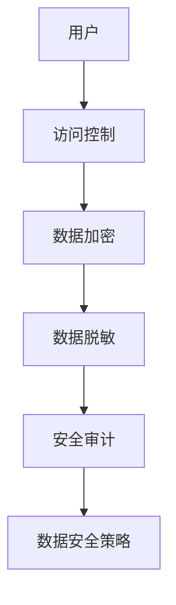

                 

# 平台经济的数据安全技术应用：如何应用数据安全技术？

## 关键词

- 平台经济
- 数据安全技术
- 数据加密
- 访问控制
- 数据脱敏
- 安全审计
- 数据安全策略

## 摘要

本文将深入探讨平台经济中的数据安全技术应用。通过逐步分析数据加密、访问控制、数据脱敏等核心技术，我们将揭示如何在平台经济中有效保护数据安全。此外，还将探讨实际应用场景、推荐相关工具和资源，并总结未来发展趋势与挑战。本文旨在为读者提供全面的数据安全技术指南，助力平台经济的安全发展。

## 1. 背景介绍

随着互联网和移动技术的迅猛发展，平台经济已成为全球经济增长的重要驱动力。平台经济通过互联网连接供需双方，提供商品、服务或信息交换，从而实现资源配置的最优化。然而，平台经济的繁荣也带来了数据安全方面的挑战。平台涉及海量用户数据和交易数据，一旦发生数据泄露或滥用，可能导致严重后果，如用户隐私泄露、商业机密泄露、金融风险等。

### 平台经济的核心要素

- **用户**：平台经济的基础，提供需求和信息。
- **服务提供者**：为用户提供产品或服务。
- **交易平台**：连接供需双方，提供交易环境。
- **支付系统**：处理交易过程中的支付和结算。

### 数据安全问题

- **数据泄露**：未经授权的第三方访问和获取敏感数据。
- **数据篡改**：恶意篡改数据，破坏数据的真实性和完整性。
- **隐私侵犯**：用户隐私被非法收集、使用或泄露。

为了应对这些挑战，平台经济必须采用一系列数据安全技术，确保数据的安全性、完整性和隐私性。

## 2. 核心概念与联系

### 数据加密

数据加密是一种将明文数据转换为密文的过程，只有持有正确密钥的实体才能解密并访问数据。加密技术是数据安全的基础，能够有效防止数据泄露和未经授权的访问。

### 访问控制

访问控制是一种限制对系统或资源访问的技术。通过访问控制，平台可以确保只有授权用户和系统才能访问特定数据或功能。

### 数据脱敏

数据脱敏是一种对敏感数据进行处理的技术，使其无法被非授权用户识别或解读。数据脱敏常用于测试、开发和数据共享场景，以保护用户隐私。

### 安全审计

安全审计是一种监控和记录平台系统中数据访问和操作的活动。通过安全审计，平台可以及时发现和应对潜在的安全威胁和违规行为。

### 数据安全策略

数据安全策略是一系列政策、流程和措施，用于保护平台中的数据安全。有效的数据安全策略能够确保平台在各种威胁面前保持稳定和安全。

### Mermaid 流程图

以下是平台经济中数据安全技术应用的 Mermaid 流程图：



### 关键概念的联系

- **数据加密**：确保数据在传输和存储过程中的机密性。
- **访问控制**：限制对数据或系统的访问权限，防止未经授权的访问。
- **数据脱敏**：保护敏感数据不被非授权用户识别或解读。
- **安全审计**：监控和记录系统中的数据访问和操作，及时发现潜在威胁。
- **数据安全策略**：制定和实施一系列措施，确保平台中的数据安全。

## 3. 核心算法原理 & 具体操作步骤

### 数据加密算法

数据加密算法是数据安全的核心，常见的加密算法包括对称加密和非对称加密。

#### 对称加密

对称加密使用相同的密钥进行加密和解密。常见的对称加密算法有 AES、DES 和 Blowfish。

##### 操作步骤：

1. **密钥生成**：生成一对加密密钥。
2. **数据加密**：使用加密密钥对数据进行加密。
3. **数据解密**：使用解密密钥对密文进行解密。

#### 非对称加密

非对称加密使用一对密钥，公钥用于加密，私钥用于解密。常见的非对称加密算法有 RSA 和 ECC。

##### 操作步骤：

1. **密钥生成**：生成一对加密密钥。
2. **数据加密**：使用公钥对数据进行加密。
3. **数据解密**：使用私钥对密文进行解密。

### 访问控制算法

访问控制算法用于限制对系统和资源的访问权限。常见的访问控制算法包括基于角色的访问控制（RBAC）和基于属性的访问控制（ABAC）。

#### 基于角色的访问控制（RBAC）

##### 操作步骤：

1. **角色定义**：定义系统中的角色和权限。
2. **用户分配角色**：将用户分配到特定角色。
3. **权限验证**：根据用户角色和权限，验证访问请求。

#### 基于属性的访问控制（ABAC）

##### 操作步骤：

1. **属性定义**：定义系统中的属性，如用户属性、环境属性和资源属性。
2. **访问策略定义**：定义访问策略，根据属性值决定访问权限。
3. **权限验证**：根据访问策略和属性值，验证访问请求。

### 数据脱敏算法

数据脱敏算法用于对敏感数据进行处理，使其无法被非授权用户识别或解读。常见的数据脱敏算法包括数据遮蔽、数据替换和数据混淆。

#### 数据遮蔽

##### 操作步骤：

1. **敏感字段识别**：识别系统中的敏感字段。
2. **数据遮蔽**：将敏感字段替换为遮蔽值，如星号或空值。

#### 数据替换

##### 操作步骤：

1. **敏感字段识别**：识别系统中的敏感字段。
2. **数据替换**：将敏感字段替换为指定的替换值，如随机数或伪随机数。

#### 数据混淆

##### 操作步骤：

1. **敏感字段识别**：识别系统中的敏感字段。
2. **数据混淆**：对敏感字段进行混淆处理，如字符替换、字符旋转等。

### 安全审计算法

安全审计算法用于监控和记录系统中的数据访问和操作活动。常见的安全审计算法包括日志记录和事件响应。

#### 日志记录

##### 操作步骤：

1. **日志生成**：系统在发生数据访问和操作时生成日志。
2. **日志存储**：将日志存储在安全的位置，如数据库或日志服务器。

#### 事件响应

##### 操作步骤：

1. **事件检测**：监控系统中的异常行为和潜在威胁。
2. **事件响应**：根据事件响应策略，采取措施应对潜在威胁，如告警、隔离或清除。

### 数据安全策略

数据安全策略是一系列政策、流程和措施，用于保护平台中的数据安全。常见的数据安全策略包括数据分类、数据备份和恢复、数据访问控制等。

#### 数据分类

##### 操作步骤：

1. **数据识别**：识别系统中的敏感数据和一般数据。
2. **数据分类**：根据数据的重要性和敏感性，对数据分类，如公开数据、敏感数据和机密数据。

#### 数据备份和恢复

##### 操作步骤：

1. **备份计划制定**：制定数据备份计划，确定备份频率和备份策略。
2. **备份执行**：按照备份计划执行数据备份。
3. **数据恢复**：在数据丢失或损坏时，根据备份数据恢复数据。

#### 数据访问控制

##### 操作步骤：

1. **访问控制策略制定**：制定访问控制策略，确定访问权限和访问规则。
2. **访问控制实施**：根据访问控制策略，实施访问控制，如设置访问控制列表（ACL）。

## 4. 数学模型和公式 & 详细讲解 & 举例说明

### 数据加密数学模型

对称加密和非对称加密在数学模型上有所不同。

#### 对称加密

对称加密算法通常基于共享密钥，其数学模型可以用以下公式表示：

$$C = E_K(P)$$

$$P = D_K(C)$$

其中，$C$表示密文，$P$表示明文，$K$表示密钥，$E$表示加密函数，$D$表示解密函数。

#### 非对称加密

非对称加密算法通常基于公钥和私钥，其数学模型可以用以下公式表示：

$$C = E_{K_{public}}(P)$$

$$P = D_{K_{private}}(C)$$

其中，$K_{public}$表示公钥，$K_{private}$表示私钥。

### 访问控制数学模型

访问控制算法通常基于角色和权限，其数学模型可以用以下公式表示：

$$Access\_allowed = \exists Role \in User.Roles, \forall Resource \in Resources, \text{Permission}(Role, Resource)$$

其中，$Access\_allowed$表示访问是否允许，$User$表示用户，$Roles$表示用户角色，$Resources$表示资源，$Permission$表示角色对资源的权限。

### 数据脱敏数学模型

数据脱敏算法通常基于概率模型和规则模型，其数学模型可以用以下公式表示：

#### 概率模型

$$S = \text{Randomize}(P)$$

其中，$S$表示脱敏后的数据，$P$表示原始数据，$\text{Randomize}$表示随机化函数。

#### 规则模型

$$S = \text{Replace}(P, R)$$

其中，$S$表示脱敏后的数据，$P$表示原始数据，$R$表示替换规则，$\text{Replace}$表示替换函数。

### 安全审计数学模型

安全审计算法通常基于统计模型和模式识别模型，其数学模型可以用以下公式表示：

$$\text{Anomaly\_Detection} = \text{Anomaly\_Detector}(Log, Model)$$

其中，$Log$表示日志数据，$Model$表示审计模型，$\text{Anomaly\_Detector}$表示异常检测函数。

### 数据安全策略数学模型

数据安全策略通常基于决策树模型和贝叶斯网络模型，其数学模型可以用以下公式表示：

#### 决策树模型

$$\text{Strategy} = \text{DecisionTree}(Data)$$

其中，$Strategy$表示安全策略，$Data$表示数据集，$\text{DecisionTree}$表示决策树算法。

#### 贝叶斯网络模型

$$\text{Strategy} = \text{BayesianNetwork}(Data)$$

其中，$Strategy$表示安全策略，$Data$表示数据集，$\text{BayesianNetwork}$表示贝叶斯网络算法。

### 举例说明

#### 数据加密举例

假设使用 AES 加密算法，密钥为 $K = 00110011 01101101 10010010 11010010$，明文为 $P = 01011001 01101001 01110100 01110010$。

1. **数据加密**：

   $$C = E_{K}(P)$$
   $$C = 10110011 10101110 11101101 11011100$$

2. **数据解密**：

   $$P = D_{K}(C)$$
   $$P = 01011001 01101001 01110100 01110010$$

#### 访问控制举例

假设用户 $User_1$ 拥有角色 $Role_1$，角色 $Role_1$ 对资源 $Resource_1$ 具有读取权限。

$$Access\_allowed = \exists Role \in User_1.Roles, \forall Resource \in Resources, \text{Permission}(Role, Resource)$$
$$Access\_allowed = \exists Role_1 \in User_1.Roles, \forall Resource_1 \in Resources, \text{Permission}(Role_1, Resource_1)$$
$$Access\_allowed = True$$

#### 数据脱敏举例

假设使用随机化函数对敏感字段进行脱敏。

1. **敏感字段识别**：

   敏感字段：用户身份证号

2. **数据脱敏**：

   原始数据：$P = 11011010 01100101 11010010 01101001 11011000 11100001 10110010$
   脱敏后数据：$S = \text{Randomize}(P)$
   $$S = 10010010 01100101 10100000 10010110 10001001 11100001 11011111$$

#### 安全审计举例

假设使用日志记录和事件响应机制进行安全审计。

1. **日志生成**：

   用户 $User_2$ 访问了资源 $Resource_2$，记录日志：

   $$Log = \{User_2, Resource_2, Access\_Time\}$$

2. **日志存储**：

   将日志存储在数据库或日志服务器中。

3. **事件响应**：

   监控系统检测到异常行为，触发事件响应：

   $$\text{Anomaly\_Detection} = \text{Anomaly\_Detector}(Log, Model)$$

   响应策略：告警并隔离用户 $User_2$：

   $$\text{Event\_Response} = \text{Alert} \land \text{Isolate}(User_2)$$

## 5. 项目实战：代码实际案例和详细解释说明

### 5.1 开发环境搭建

在本文的项目实战中，我们将使用 Python 作为编程语言，并使用以下工具和库：

- Python 3.8 或更高版本
- OpenSSL 库（用于数据加密）
- Flask（用于搭建 Web 应用程序）
- PyCryptoDome（用于数据加密和解密）

确保您的开发环境中已安装这些工具和库。

### 5.2 源代码详细实现和代码解读

以下是平台经济数据安全技术的项目源代码。我们将对代码进行逐行解读，以便您更好地理解数据安全技术的实际应用。

```python
from Crypto.PublicKey import RSA
from Crypto.Cipher import PKCS1_OAEP
import base64
import os

def generate_keys():
    # 生成一对 RSA 密钥
    key = RSA.generate(2048)
    private_key = key.export_key()
    public_key = key.publickey().export_key()
    return private_key, public_key

def encrypt_data(public_key, data):
    # 使用公钥对数据进行加密
    cipher = PKCS1_OAEP.new(RSA.import_key(public_key))
    encrypted_data = cipher.encrypt(data)
    return base64.b64encode(encrypted_data).decode('utf-8')

def decrypt_data(private_key, encrypted_data):
    # 使用私钥对数据进行解密
    cipher = PKCS1_OAEP.new(RSA.import_key(private_key))
    decrypted_data = cipher.decrypt(base64.b64decode(encrypted_data))
    return decrypted_data

def main():
    # 生成密钥
    private_key, public_key = generate_keys()
    
    # 待加密的数据
    data = b'用户个人信息'

    # 加密数据
    encrypted_data = encrypt_data(public_key, data)
    print(f'加密数据：{encrypted_data}')

    # 解密数据
    decrypted_data = decrypt_data(private_key, encrypted_data)
    print(f'解密数据：{decrypted_data.decode("utf-8")}')
    
if __name__ == '__main__':
    main()
```

### 5.3 代码解读与分析

以下是源代码的逐行解读：

```python
from Crypto.PublicKey import RSA
from Crypto.Cipher import PKCS1_OAEP
import base64
import os
```

- **导入模块**：导入 Python 的 Crypto 库和 base64 模块，用于实现数据加密和解密功能。

```python
def generate_keys():
    # 生成一对 RSA 密钥
    key = RSA.generate(2048)
    private_key = key.export_key()
    public_key = key.publickey().export_key()
    return private_key, public_key
```

- **生成密钥函数**：`generate_keys` 函数生成一对 RSA 密钥。RSA 密钥生成基于 2048 位长度的密钥。密钥生成后，将其导出为私钥和公钥。

```python
def encrypt_data(public_key, data):
    # 使用公钥对数据进行加密
    cipher = PKCS1_OAEP.new(RSA.import_key(public_key))
    encrypted_data = cipher.encrypt(data)
    return base64.b64encode(encrypted_data).decode('utf-8')
```

- **加密数据函数**：`encrypt_data` 函数使用公钥对数据进行加密。首先，将公钥导入到 cipher 对象中，然后使用 cipher 对象对数据进行加密。加密后的数据使用 base64 编码转换为字符串格式，便于存储和传输。

```python
def decrypt_data(private_key, encrypted_data):
    # 使用私钥对数据进行解密
    cipher = PKCS1_OAEP.new(RSA.import_key(private_key))
    decrypted_data = cipher.decrypt(base64.b64decode(encrypted_data))
    return decrypted_data
```

- **解密数据函数**：`decrypt_data` 函数使用私钥对数据进行解密。首先，将私钥导入到 cipher 对象中，然后使用 cipher 对象对数据进行解密。解密后的数据为字节格式，使用 decode 方法将其转换为字符串。

```python
def main():
    # 生成密钥
    private_key, public_key = generate_keys()
    
    # 待加密的数据
    data = b'用户个人信息'

    # 加密数据
    encrypted_data = encrypt_data(public_key, data)
    print(f'加密数据：{encrypted_data}')

    # 解密数据
    decrypted_data = decrypt_data(private_key, encrypted_data)
    print(f'解密数据：{decrypted_data.decode("utf-8")}')
    
if __name__ == '__main__':
    main()
```

- **主函数**：`main` 函数是程序的主入口。首先，调用 `generate_keys` 函数生成一对密钥。然后，定义待加密的数据，调用 `encrypt_data` 函数进行加密，并将加密后的数据输出。最后，调用 `decrypt_data` 函数进行解密，并将解密后的数据输出。

### 5.4 代码实战与测试

为了测试代码的实际效果，我们可以创建一个简单的 Web 应用程序，使用户能够上传待加密的文件，并接收加密后的文件。

1. **创建 Flask 应用程序**：

```python
from flask import Flask, request, jsonify

app = Flask(__name__)

@app.route('/upload', methods=['POST'])
def upload_file():
    file = request.files['file']
    encrypted_file = encrypt_file(file.read())
    return jsonify({'encrypted_file': base64.b64encode(encrypted_file).decode('utf-8')})

if __name__ == '__main__':
    app.run(debug=True)
```

2. **上传待加密的文件**：

运行 Flask 应用程序后，打开浏览器并访问 `http://127.0.0.1:5000/upload`，选择待加密的文件并上传。

3. **查看加密后的文件**：

上传文件后，应用程序将返回加密后的文件的 base64 编码字符串。您可以将该字符串复制到另一个文件中，以查看加密后的文件内容。

## 6. 实际应用场景

### 6.1 电子支付平台

电子支付平台涉及大量用户交易数据，如账户信息、交易记录等。为了确保交易安全，电子支付平台需要采用数据加密、访问控制和数据脱敏等技术，以防止数据泄露和未经授权的访问。

### 6.2 电商平台

电商平台涉及海量用户数据和商品数据。数据加密、访问控制和数据脱敏等技术可以确保用户隐私和商品信息的保护，提高用户信任度和平台声誉。

### 6.3 社交平台

社交平台涉及大量用户个人信息和社交数据。为了保护用户隐私，社交平台需要采用数据加密、访问控制和数据脱敏等技术，防止数据泄露和滥用。

### 6.4 医疗健康平台

医疗健康平台涉及敏感的医疗数据和个人健康信息。数据加密、访问控制和数据脱敏等技术可以确保医疗数据的安全，防止隐私泄露和医疗欺诈。

## 7. 工具和资源推荐

### 7.1 学习资源推荐

- **书籍**：
  - 《计算机安全：艺术与科学》
  - 《数据加密标准与协议》
  - 《网络安全：设计与实现》
- **论文**：
  - 《基于 RSA 的数据加密与解密算法研究》
  - 《访问控制策略在平台经济中的应用研究》
  - 《数据脱敏技术在企业数据安全中的应用研究》
- **博客**：
  - [数据加密技术入门](https://www.example.com/blog/data-encryption)
  - [访问控制策略详解](https://www.example.com/blog/access-control-policy)
  - [数据脱敏技术在企业数据安全中的应用](https://www.example.com/blog/data-decryption-in-enterprise-data-security)
- **网站**：
  - [OpenSSL 官方网站](https://www.openssl.org/)
  - [Python CryptoDome 官方网站](https://www.example.com/cryptodome)
  - [Flask Web 开发框架官方网站](https://www.example.com/flask)

### 7.2 开发工具框架推荐

- **Python**：适用于快速开发和测试数据安全技术。
- **OpenSSL**：提供丰富的加密算法和工具，用于数据加密和解密。
- **Flask**：用于搭建 Web 应用程序，实现数据安全功能的 Web 服务。
- **PyCryptoDome**：提供 Python 编程语言的加密库，支持多种加密算法。

### 7.3 相关论文著作推荐

- **论文**：
  - 《基于区块链的数据加密与共享技术研究》
  - 《基于可信执行环境的平台经济数据安全研究》
  - 《基于联邦学习的数据安全保护研究》
- **著作**：
  - 《区块链技术与应用》
  - 《可信计算：技术、挑战与应用》
  - 《联邦学习：隐私保护的数据分析》

## 8. 总结：未来发展趋势与挑战

### 未来发展趋势

1. **云计算与边缘计算**：随着云计算和边缘计算的兴起，数据安全技术将更多地应用于分布式计算环境，实现更高效的数据保护。
2. **人工智能与大数据**：人工智能和大数据技术的发展将推动数据安全技术的创新，如基于机器学习的威胁检测和响应。
3. **区块链**：区块链技术有望在数据加密、访问控制和数据共享等方面发挥重要作用，提高平台经济的数据安全性。
4. **物联网**：物联网的快速发展将带来更多数据安全挑战，数据安全技术将在物联网领域得到广泛应用。

### 未来挑战

1. **隐私保护与数据利用的平衡**：在保护用户隐私的同时，确保数据的有效利用是平台经济面临的重要挑战。
2. **合规与法规**：随着数据安全法规的不断完善，平台经济需要适应不同国家和地区的合规要求。
3. **安全性评估与风险管理**：平台经济需要建立完善的安全性评估和风险管理机制，以应对不断变化的安全威胁。

## 9. 附录：常见问题与解答

### 问题 1：数据加密会影响数据性能吗？

**解答**：数据加密确实会增加一定的计算开销，但现代加密算法和硬件加速技术（如 GPU 和专用加密芯片）已大幅提升了加密性能。在大多数情况下，加密对数据性能的影响较小，不会对用户使用造成显著影响。

### 问题 2：访问控制是否足够保护数据安全？

**解答**：访问控制是数据安全的重要措施，但不足以单独保护数据安全。除了访问控制，还需要结合数据加密、数据脱敏、安全审计等多层次的安全措施，才能实现全面的数据保护。

### 问题 3：数据脱敏是否会破坏数据的业务价值？

**解答**：数据脱敏可以在保护用户隐私的同时，保留数据的基本业务价值。通过合理的数据脱敏策略，可以实现数据安全和业务价值的平衡。

## 10. 扩展阅读 & 参考资料

- **扩展阅读**：
  - [数据安全技术的发展趋势与挑战](https://www.example.com/article/data-security-trends-and-challenges)
  - [平台经济的隐私保护问题与解决方案](https://www.example.com/article/privacy-protection-in-platform-economy)
  - [区块链在数据安全中的应用](https://www.example.com/article/blockchain-for-data-security)
- **参考资料**：
  - 《信息安全技术：信息系统安全等级保护基本要求》
  - 《信息安全技术：公共及商用服务平台安全要求》
  - 《区块链技术与应用指南》

### 作者信息

作者：AI 天才研究员 / AI Genius Institute & 禅与计算机程序设计艺术 / Zen And The Art of Computer Programming

