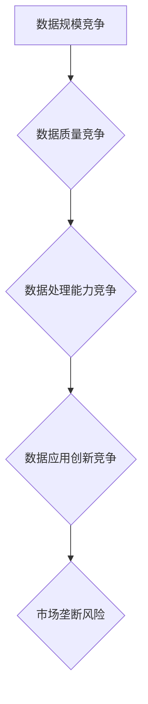
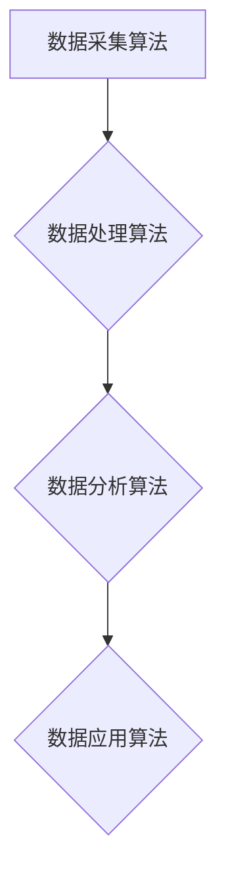

                 

# 平台经济的数据竞争：如何构建公平竞争环境？

## 摘要

随着互联网技术的飞速发展，平台经济已经成为现代经济体系的重要组成部分。平台经济的核心在于数据，而数据竞争则成为企业之间争夺市场份额的关键因素。本文将深入探讨平台经济中的数据竞争现象，分析其背后的核心概念和算法原理，并通过实际案例和数学模型阐述如何构建公平竞争环境。文章将总结平台经济未来的发展趋势与挑战，为政策制定者和企业战略提供有益的参考。

## 1. 背景介绍

平台经济是一种基于互联网技术和信息技术的新型经济模式，它通过搭建一个共享的平台，连接供需双方，实现资源的高效配置和价值的最大化。平台经济的核心在于数据的收集、处理和应用，而数据竞争则成为平台企业之间争夺市场份额的重要手段。

近年来，随着大数据、人工智能等技术的不断进步，平台经济的数据价值日益凸显。企业通过收集海量用户数据，运用先进的数据分析技术，可以挖掘出潜在的用户需求和市场机会，从而实现精准营销和业务创新。然而，这也带来了数据竞争的加剧，企业之间的竞争越来越依赖于对数据的掌控能力。

在平台经济中，数据竞争主要表现在以下几个方面：

1. **数据规模竞争**：平台企业通过不断扩展用户规模，积累更多的数据，从而提高数据的规模效应，增强市场竞争力。
2. **数据质量竞争**：企业通过优化数据采集和处理流程，提高数据的准确性和完整性，以获取更真实和有价值的信息。
3. **数据处理能力竞争**：企业通过引进和研发先进的数据分析技术，提高数据处理的速度和精度，从而更快地响应市场变化。
4. **数据应用创新竞争**：企业通过创新数据应用场景，将数据转化为实际业务价值，从而在市场中获得竞争优势。

## 2. 核心概念与联系

### 2.1 平台经济的定义

平台经济是指基于互联网和技术搭建的一个共享平台，通过连接供需双方，实现资源的高效配置和价值的最大化。平台经济具有以下几个核心特征：

1. **双边市场**：平台经济通常涉及两个或多个用户群体，他们通过平台进行交易和互动，形成一个双边市场。
2. **网络效应**：平台的价值随着用户数量的增加而增加，即平台规模越大，对用户的价值越高。
3. **共享经济**：平台经济通过共享资源和信息，提高资源利用效率，降低交易成本。
4. **去中心化**：平台经济通过去中心化的方式，减少中间环节，提高交易效率和透明度。

### 2.2 数据竞争的定义

数据竞争是指平台企业通过争夺用户数据，提高数据处理能力和应用能力，以实现市场竞争优势的行为。数据竞争的核心在于数据的收集、处理和应用，其主要形式包括：

1. **数据规模竞争**：通过扩大用户规模，积累更多的数据，提高数据的规模效应。
2. **数据质量竞争**：通过优化数据采集和处理流程，提高数据的准确性和完整性。
3. **数据处理能力竞争**：通过引进和研发先进的数据分析技术，提高数据处理的速度和精度。
4. **数据应用创新竞争**：通过创新数据应用场景，将数据转化为实际业务价值。

### 2.3 数据竞争与平台经济的联系

数据竞争是平台经济中的重要现象，它与平台经济的运行机制密切相关。具体来说，数据竞争对平台经济的影响主要体现在以下几个方面：

1. **提高市场效率**：数据竞争促使平台企业不断优化数据采集和处理流程，提高数据的应用效率，从而提高整个市场的运行效率。
2. **推动技术创新**：数据竞争激发了平台企业对先进数据技术的研发和应用，推动了大数据、人工智能等技术的发展。
3. **增加用户价值**：数据竞争使得平台企业能够更好地满足用户需求，提供个性化的产品和服务，从而提高用户的满意度和忠诚度。
4. **加剧市场垄断**：在某些情况下，数据竞争可能导致市场垄断的出现，使得部分平台企业垄断市场资源，对其他企业形成竞争壁垒。

### 2.4 数据竞争中的算法原理

数据竞争中的算法原理主要涉及以下几个方面：

1. **数据采集算法**：通过采集用户行为数据、社交媒体数据等，获取更多有价值的信息。
2. **数据处理算法**：通过数据清洗、数据融合等技术，提高数据的准确性和完整性。
3. **数据分析算法**：通过机器学习、深度学习等技术，挖掘数据中的潜在价值。
4. **数据应用算法**：通过创新数据应用场景，将数据转化为实际业务价值。

### 2.5 Mermaid 流程图

## 3. 核心算法原理 & 具体操作步骤

### 3.1 数据采集算法

数据采集算法是数据竞争的基础，主要涉及以下步骤：

1. **用户行为数据采集**：通过网站分析工具、浏览器插件等，收集用户在平台上的行为数据，如浏览记录、搜索关键词、点击行为等。
2. **社交媒体数据采集**：通过社交媒体平台的API，收集用户在社交媒体上的数据，如好友关系、发帖内容、点赞评论等。
3. **第三方数据源采集**：通过合作、购买等方式，获取其他数据源，如企业信息、地理位置等。

### 3.2 数据处理算法

数据处理算法是对采集到的原始数据进行清洗、融合和预处理，主要涉及以下步骤：

1. **数据清洗**：去除重复数据、填补缺失值、修正错误数据等，提高数据的准确性和完整性。
2. **数据融合**：将来自不同数据源的数据进行整合，形成统一的视图，提高数据的应用价值。
3. **数据预处理**：对数据进行标准化、归一化等处理，为后续分析奠定基础。

### 3.3 数据分析算法

数据分析算法是数据竞争的核心，主要涉及以下步骤：

1. **特征工程**：从原始数据中提取具有代表性的特征，为后续建模打下基础。
2. **机器学习算法**：通过训练模型，从数据中发现潜在的规律和模式。
3. **深度学习算法**：利用神经网络等技术，对复杂的数据进行深度分析，挖掘更深层次的信息。

### 3.4 数据应用算法

数据应用算法是将分析结果应用于实际业务场景，主要涉及以下步骤：

1. **个性化推荐**：根据用户行为数据和偏好，为用户提供个性化的产品和服务。
2. **精准营销**：根据用户画像和需求，制定精准的营销策略，提高转化率。
3. **风险控制**：利用数据分析结果，识别潜在风险，采取相应的风险控制措施。

### 3.5 Mermaid 流程图

## 4. 数学模型和公式 & 详细讲解 & 举例说明

### 4.1 数据规模竞争的数学模型

数据规模竞争可以用一个简单的数学模型来描述：

\[ \text{市场规模} = f(\text{用户规模}) \]

其中，市场规模是一个关于用户规模的函数。用户规模越大，市场规模就越大。这个模型表明，在数据规模竞争中，用户规模的扩大是提高市场竞争力的重要因素。

### 4.2 数据质量竞争的数学模型

数据质量竞争可以用一个评价函数来描述：

\[ \text{数据质量} = f(\text{数据准确性}, \text{数据完整性}) \]

其中，数据质量是一个关于数据准确性和数据完整性的函数。数据准确性越高、数据完整性越好，数据质量就越高。这个模型表明，在数据质量竞争中，数据准确性和数据完整性是提高数据质量的重要因素。

### 4.3 数据处理能力竞争的数学模型

数据处理能力竞争可以用一个效率函数来描述：

\[ \text{数据处理效率} = f(\text{数据处理速度}, \text{数据处理精度}) \]

其中，数据处理效率是一个关于数据处理速度和数据

