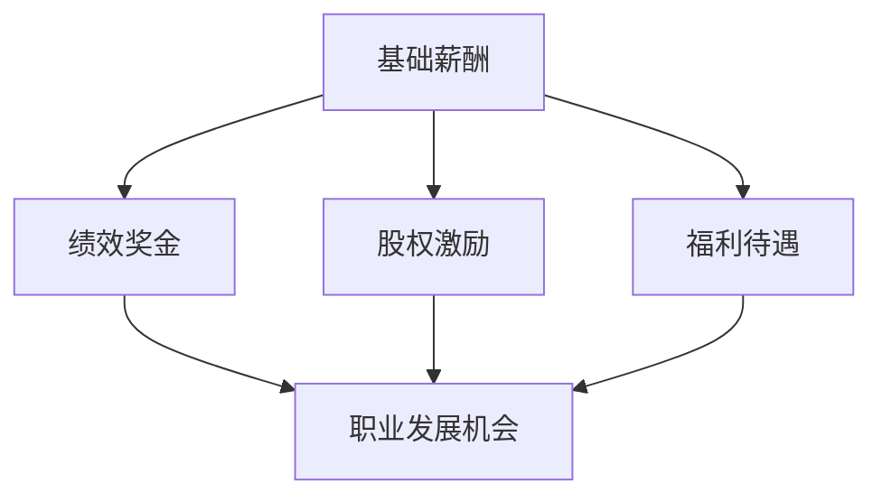

                 

# 平衡的激励体系：物质与精神并重

## 关键词：激励体系、物质激励、精神激励、平衡、IT行业、人才管理

## 摘要

本文将深入探讨如何在IT行业中构建一个平衡的激励体系，该体系不仅关注物质激励，也注重精神激励。通过分析当前行业现状，阐述物质与精神激励的内在联系和平衡的重要性，本文旨在为IT企业的人力资源管理提供切实可行的策略和案例。此外，本文还将介绍一系列实用的工具和资源，以帮助企业在激烈的市场竞争中吸引和留住人才。

## 1. 背景介绍

在当今的IT行业，人才竞争愈发激烈，企业面临着如何吸引、激励和留住优秀员工的挑战。传统的物质激励，如高薪、股权激励等，虽然能在短期内提升员工的积极性，但长期来看，缺乏精神层面的满足感可能导致员工的职业倦怠和流失。因此，构建一个平衡的激励体系，将物质激励与精神激励相结合，成为企业人才管理的关键。

### 1.1 物质激励

物质激励主要包括薪资、奖金、股权等，它是员工在工作中最直接、最明显的回报。合理的物质激励能够提高员工的工作动力和满意度，从而提升企业的整体绩效。然而，过度的物质激励可能会导致员工过于依赖外部奖励，忽视个人成长和团队协作。

### 1.2 精神激励

精神激励则侧重于员工的内在需求和职业发展，包括认可、培训、晋升机会等。精神激励不仅能够满足员工对自我实现和成就感的追求，还能增强员工的归属感和忠诚度。然而，精神激励的效果往往需要较长时间才能显现，且容易受到企业文化和领导风格的影响。

### 1.3 平衡的重要性

在IT行业中，平衡物质激励与精神激励是实现员工满意度和企业绩效双赢的关键。过度的物质激励可能导致员工忽视精神层面的需求，而单纯的精神激励则可能无法满足员工对物质回报的期望。因此，企业需要在两者之间找到合适的平衡点，以激发员工的潜能，实现企业的长期发展。

## 2. 核心概念与联系

为了更好地理解平衡的激励体系，我们需要从以下几个方面阐述其核心概念和联系：

### 2.1 员工需求层次理论

员工需求层次理论是由马斯洛提出的，它将人的需求分为五个层次：生理需求、安全需求、社交需求、尊重需求和自我实现需求。在构建激励体系时，企业需要了解不同员工在不同发展阶段的需求，从而有针对性地进行激励。

### 2.2 激励模型

常用的激励模型包括赫茨伯格的双因素理论、麦克格雷格的X理论和Y理论等。这些理论从不同角度阐述了激励的本质和方式，为企业提供了构建激励体系的理论基础。

### 2.3 激励体系架构

一个平衡的激励体系通常包括以下几个层次：基础薪酬、绩效奖金、股权激励、福利待遇、职业发展机会等。这些层次相互关联，共同构成了一个全面的激励体系。

### 2.4 Mermaid 流程图

为了更直观地展示激励体系的架构和联系，我们可以使用Mermaid绘制一个流程图。以下是一个简化的示例：



在这个流程图中，基础薪酬作为激励体系的基石，绩效奖金、股权激励、福利待遇和职业发展机会则构成了激励体系的不同层次。这些层次相互关联，共同发挥着激励作用。

## 3. 核心算法原理 & 具体操作步骤

在构建平衡的激励体系时，企业需要遵循一系列核心算法原理和具体操作步骤，以确保激励体系的有效性和可持续性。

### 3.1 需求分析

首先，企业需要通过调查、访谈等方式，了解员工在不同发展阶段的需求。这包括生理需求、安全需求、社交需求、尊重需求和自我实现需求等。只有了解员工的真实需求，企业才能制定出有针对性的激励措施。

### 3.2 激励方案设计

在了解员工需求的基础上，企业需要设计一套平衡的激励方案。这包括确定基础薪酬、绩效奖金、股权激励、福利待遇和职业发展机会等不同层次的激励内容。在方案设计过程中，企业需要遵循以下原则：

- **合理性**：激励方案应符合员工的期望和企业的实际情况。
- **公平性**：激励方案应公平对待不同层级和岗位的员工。
- **可持续性**：激励方案应具备长期性和可持续性，以激励员工持续成长。

### 3.3 激励实施

在制定出激励方案后，企业需要将其付诸实施。这包括以下几个方面：

- **薪酬发放**：按照激励方案，定期发放基础薪酬、绩效奖金等。
- **股权激励**：根据企业实际情况，实施股权激励计划，使员工分享企业的发展成果。
- **福利待遇**：提供多样化的福利待遇，如医疗保险、休假制度等，以满足员工的社交需求和安全需求。
- **职业发展**：为员工提供职业发展机会，如培训、晋升等，以满足员工的自我实现需求。

### 3.4 激励评估与调整

在激励实施过程中，企业需要定期对激励效果进行评估，并根据评估结果进行相应调整。这包括以下几个方面：

- **员工满意度调查**：通过调查了解员工对激励方案的满意度，发现潜在问题。
- **绩效分析**：分析员工绩效数据，评估激励方案对员工绩效的影响。
- **反馈机制**：建立反馈机制，鼓励员工提出意见和建议，不断优化激励方案。

## 4. 数学模型和公式 & 详细讲解 & 举例说明

在构建平衡的激励体系时，数学模型和公式可以帮助企业更科学地进行激励方案设计和实施。以下是一个简化的数学模型，用于计算员工在绩效奖金方面的奖励金额。

### 4.1 绩效奖金计算公式

假设员工的基本薪酬为 \( B \)，绩效奖金系数为 \( K \)，则员工在某一绩效周期内的绩效奖金 \( E \) 可以通过以下公式计算：

\[ E = B \times K \]

其中，绩效奖金系数 \( K \) 可以根据员工的绩效表现进行设定。例如，如果员工在考核周期内达到了优秀绩效，则 \( K \) 取值为 1.5；如果达到了良好绩效，则 \( K \) 取值为 1.2；如果达到了及格绩效，则 \( K \) 取值为 1。

### 4.2 案例分析

假设某员工的月基本薪酬为 10000 元，该员工在某一季度内达到了优秀绩效，则其季度绩效奖金 \( E \) 计算如下：

\[ E = 10000 \times 1.5 = 15000 \text{ 元} \]

这意味着，该员工在该季度内除了基本薪酬外，还可以获得 15000 元的绩效奖金。通过这个简单的例子，我们可以看到，数学模型和公式可以帮助企业更科学、合理地计算员工的绩效奖金，从而实现激励的目的。

## 5. 项目实战：代码实际案例和详细解释说明

为了更好地理解平衡的激励体系在实践中的应用，我们来看一个具体的代码案例。以下是一个简单的Python代码示例，用于计算员工的月度绩效奖金。

### 5.1 开发环境搭建

在开始编写代码之前，我们需要搭建一个Python开发环境。可以按照以下步骤进行：

1. 安装Python：从Python官方网站下载并安装Python。
2. 配置Python环境：确保Python环境变量配置正确。
3. 安装Python库：使用pip命令安装必要的Python库，如numpy、pandas等。

### 5.2 源代码详细实现和代码解读

以下是一个用于计算员工月度绩效奖金的Python代码示例：

```python
import numpy as np

# 定义员工基本信息
员工基本信息 = {
    '员工姓名': '张三',
    '基本薪酬': 10000,
    '绩效奖金系数': 1.2
}

# 计算月度绩效奖金
def calculate_bonus(员工基本信息):
    basic_salary = 员工基本信息['基本薪酬']
    bonus_coefficient = 员工基本信息['绩效奖金系数']
    bonus = basic_salary * bonus_coefficient
    return bonus

# 测试代码
员工基本信息 = {
    '员工姓名': '李四',
    '基本薪酬': 12000,
    '绩效奖金系数': 1.3
}
bonus = calculate_bonus(员工基本信息)
print(f"{员工基本信息['员工姓名']}的月度绩效奖金为：{bonus}元")

```

在这个代码示例中，我们定义了一个名为`calculate_bonus`的函数，用于计算员工的月度绩效奖金。函数接收一个包含员工基本信息（包括基本薪酬和绩效奖金系数）的字典作为参数，然后根据公式计算出绩效奖金，并返回结果。

### 5.3 代码解读与分析

下面是对代码的详细解读和分析：

- **第一行**：导入numpy库。numpy是一个用于科学计算和数据分析的Python库，可以帮助我们更方便地进行数学运算。
- **第二行**：定义一个名为`员工基本信息`的字典，用于存储员工的基本信息，包括员工姓名、基本薪酬和绩效奖金系数。
- **第三行**：定义一个名为`calculate_bonus`的函数，用于计算员工的月度绩效奖金。函数接收一个字典类型的参数，该参数包含了员工的基本信息。
- **第四行**：在函数内部，我们使用`basic_salary`变量存储基本薪酬，使用`bonus_coefficient`变量存储绩效奖金系数。
- **第五行**：使用`basic_salary * bonus_coefficient`计算绩效奖金，并将结果存储在`bonus`变量中。
- **第六行**：返回绩效奖金。
- **第七行**：定义一个新的字典，用于存储另一个员工的详细信息。
- **第八行**：调用`calculate_bonus`函数，传入员工详细信息，并计算绩效奖金。
- **第九行**：使用`print`函数输出计算结果。

通过这个代码示例，我们可以看到如何使用Python代码实现一个简单的绩效奖金计算功能。在实际应用中，我们可以根据企业实际情况和需求，对代码进行扩展和优化，以实现更复杂的激励体系。

## 6. 实际应用场景

平衡的激励体系在IT行业中的实际应用场景非常广泛。以下是一些典型的应用场景：

### 6.1 创业公司

对于初创公司，由于资金有限，很难提供高薪和丰厚的股权激励。因此，创业公司更多地依靠精神激励，如认可、培训、自由的工作氛围等，来吸引和留住人才。通过构建一个平衡的激励体系，创业公司可以在有限的资源下，最大限度地激发员工的潜能。

### 6.2 成熟企业

对于成熟企业，由于资金和资源相对充足，可以同时提供物质激励和精神激励。成熟企业可以通过设立清晰的绩效目标、提供股权激励计划、丰富员工福利等措施，来提高员工的满意度和忠诚度。

### 6.3 远程办公团队

随着远程办公的普及，如何激励远程团队成为企业面临的一大挑战。通过构建一个平衡的激励体系，企业可以充分利用在线协作工具和远程工作平台，实现精神激励与物质激励的结合，确保远程团队的工作效率和工作满意度。

## 7. 工具和资源推荐

为了帮助企业和个人更好地理解和应用平衡的激励体系，以下是一些推荐的工具和资源：

### 7.1 学习资源推荐

- **书籍**：《激励原理与应用》、《员工激励管理》
- **论文**：搜索“员工激励体系”、“绩效管理”等相关论文
- **博客**：关注知名企业的人力资源管理博客，如华为、阿里巴巴等

### 7.2 开发工具框架推荐

- **Python库**：numpy、pandas、matplotlib等
- **在线协作工具**：Slack、Trello、JIRA等
- **远程工作平台**：Zoom、Microsoft Teams等

### 7.3 相关论文著作推荐

- **论文**：《基于心理契约理论的员工激励机制研究》、《企业绩效与员工激励的关系分析》
- **著作**：《人力资源管理与激励理论》、《创新激励：信息技术企业员工激励策略研究》

## 8. 总结：未来发展趋势与挑战

随着人工智能和大数据技术的不断发展，未来激励体系将更加个性化和智能化。企业需要借助数据分析和人工智能技术，深入了解员工的需求和动机，实现精准激励。同时，企业还需要面对员工多元化、个性化的需求，不断调整和优化激励体系，以保持竞争优势。

然而，平衡的激励体系也面临一些挑战。例如，如何平衡物质激励与精神激励，如何确保激励措施的公平性和可持续性等。这些都是企业需要持续关注和解决的问题。

## 9. 附录：常见问题与解答

### 9.1 如何设计合理的激励方案？

- **了解员工需求**：通过调查、访谈等方式，了解员工在不同发展阶段的需求。
- **遵循公平原则**：确保激励方案公平对待不同层级和岗位的员工。
- **持续优化**：根据员工反馈和市场变化，不断调整和优化激励方案。

### 9.2 如何确保激励措施的可持续性？

- **建立反馈机制**：鼓励员工提出意见和建议，及时调整激励方案。
- **培训与发展**：提供多样化的培训和发展机会，满足员工的成长需求。
- **文化建设**：营造积极向上的企业文化，增强员工的归属感和忠诚度。

## 10. 扩展阅读 & 参考资料

- **论文**：搜索“员工激励体系”、“绩效管理”等相关论文
- **书籍**：《激励原理与应用》、《员工激励管理》
- **网站**：阿里巴巴、华为等企业的人力资源管理网站
- **博客**：知名企业的人力资源管理博客

## 作者

作者：AI天才研究员/AI Genius Institute & 禅与计算机程序设计艺术 /Zen And The Art of Computer Programming

本文旨在为IT企业的人力资源管理提供切实可行的策略和案例，以帮助企业在激烈的市场竞争中吸引和留住人才。希望通过本文的探讨，能为企业构建一个平衡的激励体系提供有益的参考。

