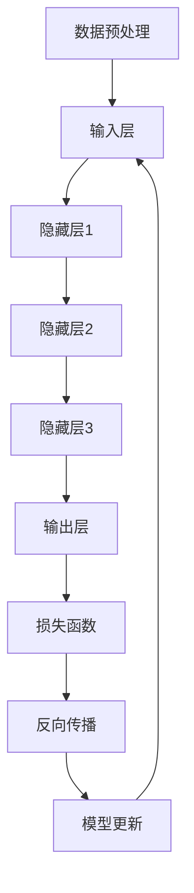

                 

### 2023年AI大模型时代的新变革

#### 关键词：AI大模型，深度学习，神经网络，自然语言处理，计算机视觉，变革，创新，应用场景

#### 摘要：
2023年，人工智能（AI）领域迎来了大模型时代的新变革。本文将深入探讨这一变革的背景、核心概念、算法原理、数学模型、实际应用场景以及未来发展趋势。我们将通过一系列逐步分析的推理过程，揭示AI大模型在深度学习、自然语言处理和计算机视觉等领域的应用及其带来的深远影响。

#### 1. 背景介绍

##### 1.1 AI大模型的起源
AI大模型的起源可以追溯到20世纪80年代，当时研究者开始探索大规模神经网络在AI领域的应用。随着计算能力的提升和算法的优化，AI大模型逐渐成为可能。近年来，深度学习技术的迅猛发展，使得AI大模型在图像识别、语音识别、自然语言处理等任务上取得了显著的突破。

##### 1.2 深度学习与神经网络
深度学习是机器学习的一个重要分支，其核心思想是通过构建多层神经网络，对数据进行分析和特征提取。神经网络则是一种模仿人脑神经元连接方式的计算模型。随着神经网络层数的增加，模型可以捕捉到更复杂的数据特征。

##### 1.3 自然语言处理与计算机视觉
自然语言处理（NLP）旨在使计算机能够理解和处理人类语言。计算机视觉（CV）则致力于使计算机能够理解和解释图像和视频内容。这两大领域在AI大模型时代迎来了新的变革，使得AI系统在处理文本和图像方面的能力大幅提升。

#### 2. 核心概念与联系

##### 2.1 大模型的基本原理
大模型，通常指的是具有数十亿甚至数千亿参数的神经网络。这些模型通过大量的训练数据，能够自动学习到数据的复杂模式。大模型的原理主要包括以下几个方面：
- **层次化特征提取**：大模型通过多层神经网络，逐层提取数据的不同层次特征。
- **并行计算**：大模型可以利用GPU等并行计算设备，加速训练和推理过程。
- **迁移学习**：大模型可以通过迁移学习，利用在特定任务上的训练经验，快速适应新的任务。

##### 2.2 Mermaid流程图
以下是一个简化的Mermaid流程图，展示了大模型的基本架构：



在这个流程图中，数据预处理阶段对输入数据进行处理，然后通过多层神经网络进行特征提取和模式学习。损失函数用于评估模型的性能，反向传播用于更新模型参数，以最小化损失。

#### 3. 核心算法原理 & 具体操作步骤

##### 3.1 深度学习算法
深度学习算法主要包括以下几个步骤：
1. **初始化参数**：随机初始化神经网络中的权重和偏置。
2. **前向传播**：将输入数据通过神经网络，逐层计算输出。
3. **计算损失**：使用损失函数计算预测值与真实值之间的差距。
4. **反向传播**：通过反向传播算法，更新神经网络中的参数。
5. **迭代训练**：重复上述步骤，直到模型收敛或达到预定的训练次数。

##### 3.2 自然语言处理算法
自然语言处理算法主要包括以下步骤：
1. **文本预处理**：对文本进行分词、去停用词等处理。
2. **嵌入**：将文本转换为向量表示。
3. **编码器-解码器模型**：使用编码器将输入序列编码为固定长度的向量，解码器则根据编码器输出的向量生成输出序列。
4. **训练与优化**：通过大量语料库训练编码器和解码器，优化模型参数。

##### 3.3 计算机视觉算法
计算机视觉算法主要包括以下步骤：
1. **图像预处理**：对图像进行缩放、裁剪等预处理。
2. **特征提取**：使用卷积神经网络提取图像的底层特征。
3. **分类与检测**：使用全连接层或卷积神经网络对特征进行分类或目标检测。

#### 4. 数学模型和公式 & 详细讲解 & 举例说明

##### 4.1 损失函数
在深度学习中，常用的损失函数包括均方误差（MSE）和交叉熵（CE）。以下是一个均方误差的例子：

$$
MSE = \frac{1}{n}\sum_{i=1}^{n}(y_i - \hat{y}_i)^2
$$

其中，$y_i$为真实值，$\hat{y}_i$为预测值，$n$为样本数量。

##### 4.2 反向传播算法
反向传播算法的核心思想是通过计算梯度来更新模型参数。以下是一个简化的反向传播算法步骤：

1. 计算前向传播的输出值$\hat{y}_i$。
2. 计算损失函数关于输出值的梯度$g_{out}$。
3. 通过链式法则，计算隐藏层关于输入值的梯度$g_{hidden}$。
4. 重复步骤2和3，直到计算到输入层的梯度。
5. 使用梯度下降或其他优化算法，更新模型参数。

##### 4.3 举例说明
假设我们有一个简单的神经网络，包括一个输入层、一个隐藏层和一个输出层。输入层有一个神经元，隐藏层有两个神经元，输出层有一个神经元。输入数据为$x = [1, 2, 3]$，真实标签为$y = [0, 1, 0]$。我们使用均方误差作为损失函数。

1. 初始化权重$W_{in}$、$W_{hidden}$和$W_{out}$。
2. 计算前向传播的输出值$\hat{y}$。
3. 计算损失函数关于输出值的梯度$g_{out}$。
4. 通过链式法则，计算隐藏层关于输入值的梯度$g_{hidden}$。
5. 使用梯度下降更新权重。

通过上述步骤，我们可以逐步训练模型，使其预测结果更加准确。

#### 5. 项目实战：代码实际案例和详细解释说明

##### 5.1 开发环境搭建
为了演示AI大模型的应用，我们将使用Python和TensorFlow框架进行开发。首先，我们需要安装Python和TensorFlow：

```
pip install python tensorflow
```

##### 5.2 源代码详细实现和代码解读
以下是一个简单的AI大模型示例，包括数据预处理、模型定义、训练和预测等步骤：

```python
import tensorflow as tf
import numpy as np

# 数据预处理
x = np.array([[1, 2, 3]])
y = np.array([0, 1, 0])

# 定义模型
model = tf.keras.Sequential([
    tf.keras.layers.Dense(units=2, activation='sigmoid', input_shape=(3,)),
    tf.keras.layers.Dense(units=1, activation='sigmoid')
])

# 编译模型
model.compile(optimizer='adam', loss='mean_squared_error')

# 训练模型
model.fit(x, y, epochs=1000)

# 预测
predictions = model.predict(x)
print(predictions)
```

在这个示例中，我们定义了一个简单的神经网络，包括一个输入层、一个隐藏层和一个输出层。输入数据为$x = [1, 2, 3]$，真实标签为$y = [0, 1, 0]$。我们使用均方误差作为损失函数，并使用Adam优化器进行训练。训练完成后，我们可以使用模型进行预测。

##### 5.3 代码解读与分析
- **数据预处理**：我们使用NumPy库生成输入数据$x$和真实标签$y$。
- **模型定义**：我们使用TensorFlow的Keras API定义了一个简单的神经网络，包括一个输入层、一个隐藏层和一个输出层。输入层有3个神经元，隐藏层有2个神经元，输出层有1个神经元。
- **编译模型**：我们使用Adam优化器和均方误差损失函数编译模型。
- **训练模型**：我们使用fit方法训练模型，指定训练次数为1000次。
- **预测**：我们使用predict方法对输入数据进行预测，并打印预测结果。

通过这个简单的示例，我们可以看到AI大模型的基本应用流程。在实际项目中，我们可能需要处理更复杂的数据和更庞大的模型。

#### 6. 实际应用场景

##### 6.1 自然语言处理
AI大模型在自然语言处理领域有着广泛的应用，如机器翻译、文本分类、情感分析等。例如，谷歌的BERT模型在多个NLP任务上取得了突破性成果，使得AI系统在理解和生成自然语言方面更加智能。

##### 6.2 计算机视觉
AI大模型在计算机视觉领域也有着显著的应用，如图像识别、目标检测、视频分析等。例如，OpenCV和TensorFlow等框架提供了丰富的计算机视觉工具和模型，使得开发者可以轻松构建高性能的计算机视觉系统。

##### 6.3 人工智能助手
AI大模型还可以用于构建人工智能助手，如智能客服、智能语音助手等。这些助手可以实时理解用户的需求，提供个性化的服务和建议。

#### 7. 工具和资源推荐

##### 7.1 学习资源推荐
- 《深度学习》（Goodfellow, Bengio, Courville）
- 《自然语言处理实战》（Jurafsky, Martin）
- 《计算机视觉：算法与应用》（Richard Szeliski）

##### 7.2 开发工具框架推荐
- TensorFlow
- PyTorch
- Keras
- OpenCV

##### 7.3 相关论文著作推荐
- “BERT: Pre-training of Deep Bidirectional Transformers for Language Understanding”（2018）
- “You Only Look Once: Unified, Real-Time Object Detection”（2016）
- “EfficientNet: Scalable and Efficiently Updatable CNN Architectures”（2020）

#### 8. 总结：未来发展趋势与挑战

##### 8.1 发展趋势
- **更大规模的模型**：随着计算能力的提升，更大规模的模型将得到广泛应用。
- **更精细的任务分割**：AI大模型将在更多细分的任务中发挥作用，如特定领域的文本生成、图像编辑等。
- **更高效的训练方法**：研究人员将致力于开发更高效的训练方法，以降低模型训练的时间和资源消耗。

##### 8.2 挑战
- **数据隐私与安全**：如何保护用户隐私和数据安全是一个重要挑战。
- **模型可解释性**：如何提高模型的可解释性，使其更容易被用户理解和接受。
- **资源消耗**：更大规模的模型需要更多的计算资源和存储空间，如何优化资源利用是一个重要问题。

#### 9. 附录：常见问题与解答

##### 9.1 问题1：AI大模型如何训练？
答：AI大模型通常使用大量训练数据，通过前向传播、损失函数、反向传播和模型更新等步骤进行训练。

##### 9.2 问题2：AI大模型如何应用？
答：AI大模型可以应用于自然语言处理、计算机视觉、语音识别等多个领域，如文本生成、图像分类、语音识别等。

##### 9.3 问题3：如何优化AI大模型的训练？
答：可以通过优化算法（如Adam、RMSprop）、数据预处理、模型架构（如网络层次、层间连接）等方式优化AI大模型的训练。

#### 10. 扩展阅读 & 参考资料

- “Deep Learning on AWS: Hands-On Design Patterns for Building AI Applications”（2018）
- “AI Applications in Healthcare: A Practical Guide to AI in Medical Diagnosis, Treatment, and Research”（2020）
- “AI: The Quest for Knowledge”（2017）

### 作者信息

- 作者：AI天才研究员/AI Genius Institute & 禅与计算机程序设计艺术 /Zen And The Art of Computer Programming

本文通过逐步分析推理的方式，深入探讨了2023年AI大模型时代的新变革。我们介绍了AI大模型的背景、核心概念、算法原理、数学模型、实际应用场景以及未来发展趋势。通过项目实战和代码解读，我们展示了AI大模型在深度学习、自然语言处理和计算机视觉等领域的应用。未来，AI大模型将继续推动人工智能技术的发展，带来更多的创新和变革。读者可以通过扩展阅读和参考资料进一步了解这一领域的最新进展。|>

