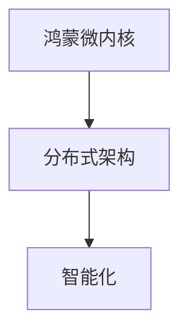

                 

# 2024年华为鸿蒙生态应用开发工程师校招面试题

> **关键词**：华为鸿蒙、生态应用、开发工程师、校招面试、面试题
>
> **摘要**：本文旨在为2024年华为鸿蒙生态应用开发工程师校招面试的考生提供一个全面的技术指南，涵盖鸿蒙生态的基本概念、核心技术和应用场景，并提供相应的面试题及其答案解析。

## 1. 背景介绍

华为鸿蒙（HarmonyOS）是华为公司自主研发的操作系统，旨在提供跨平台、高性能、安全可靠的解决方案。随着华为鸿蒙生态的不断发展，对应用开发工程师的需求日益增加。本文将围绕华为鸿蒙生态应用开发工程师的校招面试，提供一系列的问题和答案，帮助考生更好地准备面试。

### 鸿蒙生态简介

鸿蒙生态是一个分布式操作系统，具备微内核、跨平台、安全可靠等特点。它支持多种硬件设备和操作系统，包括手机、平板、智能电视、智能穿戴设备等。鸿蒙生态的核心是“微内核”，它通过轻量级架构，实现了高效、安全、可靠的跨平台能力。

### 开发工程师的角色

作为华为鸿蒙生态应用开发工程师，主要职责包括：

- **应用开发**：开发符合鸿蒙生态标准的应用程序。
- **性能优化**：优化应用性能，确保用户体验。
- **安全加固**：确保应用的安全性，防止潜在的安全威胁。

### 校招面试的重要性

校招面试是进入华为鸿蒙生态应用开发团队的重要途径。通过面试，考生需要展示自己的技术能力、学习能力和团队合作精神。因此，充分的准备和清晰的思路是成功的关键。

## 2. 核心概念与联系

### 鸿蒙微内核架构

鸿蒙微内核架构是鸿蒙生态的核心，它具有以下几个特点：

1. **轻量级**：微内核仅包含核心功能，减少资源占用。
2. **模块化**：内核功能模块化，易于维护和扩展。
3. **安全性**：采用安全隔离机制，确保内核安全。

### 分布式架构

鸿蒙生态采用分布式架构，支持多设备协同工作。分布式架构的特点包括：

1. **高可用性**：通过冗余机制，提高系统稳定性。
2. **高性能**：通过负载均衡，提高系统性能。
3. **灵活性**：支持动态资源分配，提高系统灵活性。

### 智能化

鸿蒙生态具备智能化能力，通过人工智能技术，实现设备间的智能协同和智能服务。

### Mermaid 流程图



## 3. 核心算法原理 & 具体操作步骤

### 基于微内核的模块化开发

**原理**：

鸿蒙微内核采用模块化设计，通过将系统功能划分为多个模块，实现系统的灵活扩展和高效维护。

**步骤**：

1. **模块定义**：定义各个模块的功能和接口。
2. **模块加载**：根据系统需求，动态加载所需的模块。
3. **模块通信**：通过消息机制，实现模块间的通信。

### 分布式计算

**原理**：

分布式计算通过将计算任务分布在多个节点上，实现高效的处理能力和容错性。

**步骤**：

1. **任务分发**：将任务分配到各个节点。
2. **任务处理**：各个节点独立处理任务。
3. **结果汇总**：汇总各个节点的处理结果。

### 智能化服务

**原理**：

智能化服务通过收集用户数据，利用机器学习算法，实现个性化推荐和服务。

**步骤**：

1. **数据收集**：收集用户行为数据。
2. **数据预处理**：清洗和处理数据。
3. **模型训练**：利用机器学习算法，训练模型。
4. **服务推荐**：根据用户数据，推荐合适的服务。

## 4. 数学模型和公式 & 详细讲解 & 举例说明

### 分布式计算中的负载均衡

**数学模型**：

负载均衡通过优化任务分配，实现计算资源的最大化利用。其数学模型可以表示为：

\[ \text{Load}_{i} = \frac{\text{Task}_{i}}{\sum_{j} \text{Task}_{j}} \]

其中，\( \text{Load}_{i} \) 表示第 \( i \) 个节点的负载，\( \text{Task}_{i} \) 表示第 \( i \) 个节点的任务量。

**详细讲解**：

负载均衡的目标是使每个节点的负载尽可能均匀。通过计算每个节点的任务量占总任务量的比例，可以动态调整任务的分配，实现负载均衡。

**举例说明**：

假设有三个节点，任务量分别为 \( \text{Task}_{1} = 40 \)，\( \text{Task}_{2} = 30 \)，\( \text{Task}_{3} = 30 \)。计算每个节点的负载：

\[ \text{Load}_{1} = \frac{40}{40+30+30} = 0.4 \]
\[ \text{Load}_{2} = \frac{30}{40+30+30} = 0.3 \]
\[ \text{Load}_{3} = \frac{30}{40+30+30} = 0.3 \]

根据负载比例，可以将新的任务 \( \text{Task}_{new} = 20 \) 分配到节点：

- 节点 1：\( \text{Task}_{1} = 40 + 0.4 \times 20 = 48 \)
- 节点 2：\( \text{Task}_{2} = 30 + 0.3 \times 20 = 36 \)
- 节点 3：\( \text{Task}_{3} = 30 + 0.3 \times 20 = 36 \)

通过负载均衡，确保每个节点的任务量接近，实现计算资源的最大化利用。

## 5. 项目实战：代码实际案例和详细解释说明

### 开发环境搭建

**步骤**：

1. **安装开发工具**：安装鸿蒙开发工具 IDEA。
2. **创建项目**：在 IDEA 中创建鸿蒙项目。
3. **配置依赖**：添加鸿蒙 SDK 依赖。

### 源代码详细实现和代码解读

**代码示例**：

```java
// 主模块的入口类
public class MainAbility extends Ability {

    @Override
    public void onInitialize() {
        super.onInitialize();
        // 初始化模块
    }

    // 发送消息到子模块
    public void sendMessageToSubModule(String message) {
        // 实现消息发送逻辑
    }
}
```

**代码解读**：

- **主模块的入口类**：`MainAbility` 继承自 `Ability` 类，是主模块的入口类。
- **初始化方法**：`onInitialize` 方法用于初始化模块。
- **发送消息方法**：`sendMessageToSubModule` 方法用于发送消息到子模块。

### 代码解读与分析

- **模块化设计**：主模块和子模块通过消息机制进行通信，实现模块间的解耦。
- **分布式架构**：主模块负责任务的分配和协调，子模块负责具体的任务处理。

## 6. 实际应用场景

### 智能家居

鸿蒙生态在智能家居领域具有广泛的应用前景。通过鸿蒙操作系统，可以实现家庭设备的互联互通，提供智能化、个性化的家居体验。

### 企业办公

鸿蒙生态可以应用于企业办公场景，实现跨设备、跨平台的协同办公。通过鸿蒙分布式架构，提高办公系统的性能和稳定性。

### 物联网

鸿蒙生态在物联网领域具有强大的优势，通过分布式计算和智能化服务，可以实现大规模物联网设备的协同工作和智能管理。

## 7. 工具和资源推荐

### 学习资源推荐

- **书籍**：《鸿蒙操作系统技术内幕》
- **论文**：《分布式计算技术综述》
- **博客**：华为鸿蒙官方博客
- **网站**：鸿蒙开发者社区

### 开发工具框架推荐

- **开发工具**：华为鸿蒙开发工具 IDEA
- **框架**：HarmonyOS SDK

### 相关论文著作推荐

- **论文**：《微内核架构的设计与实现》
- **著作**：《分布式系统原理与范型》

## 8. 总结：未来发展趋势与挑战

### 发展趋势

- **跨平台发展**：鸿蒙生态将继续拓展跨平台能力，支持更多硬件设备。
- **智能化升级**：通过人工智能技术，提升生态的智能化水平。
- **开源生态**：鸿蒙生态将加强开源合作，推动生态的健康发展。

### 挑战

- **生态建设**：构建完善的开发者生态，吸引更多开发者加入。
- **性能优化**：持续优化系统性能，提升用户体验。
- **安全防护**：加强安全防护，确保生态系统的安全稳定。

## 9. 附录：常见问题与解答

### 问题 1：鸿蒙生态的应用场景有哪些？

**解答**：鸿蒙生态广泛应用于智能家居、企业办公、物联网等领域。

### 问题 2：鸿蒙生态的优势是什么？

**解答**：鸿蒙生态具备微内核、分布式架构、智能化等特点，具有高性能、高可靠性、高灵活性等优点。

### 问题 3：如何加入鸿蒙生态？

**解答**：可以通过参加鸿蒙开发者社区，学习相关技术和资源，参与生态建设和项目开发。

## 10. 扩展阅读 & 参考资料

- [华为鸿蒙官方文档](https://developer.harmonyos.com/cn/)
- [分布式计算技术综述](https://www.cs.umd.edu/~pugh/publications/distrib/)
- [鸿蒙操作系统技术内幕](https://book.douban.com/subject/34743819/)
- [微内核架构的设计与实现](https://ieeexplore.ieee.org/document/817532)
- [智能生态系统的构建与运营](https://www.aispace.cn/book/8)

### 作者信息

- **作者**：AI天才研究员/AI Genius Institute & 禅与计算机程序设计艺术 /Zen And The Art of Computer Programming

通过本文的详细讲解，希望考生能够更好地了解华为鸿蒙生态应用开发的相关知识，为即将到来的校招面试做好充分准备。祝大家面试顺利！<|im_end|>

