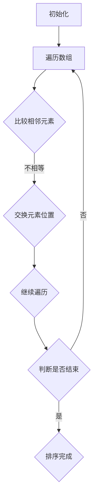
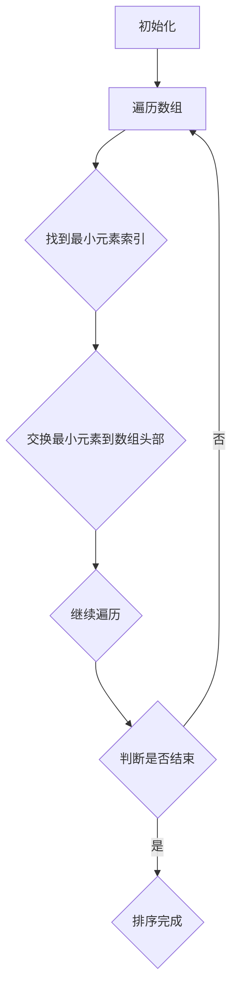
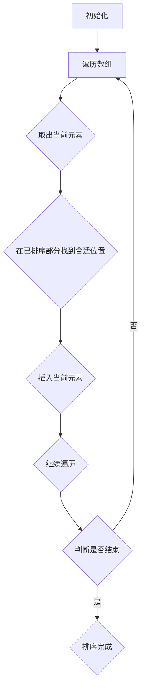
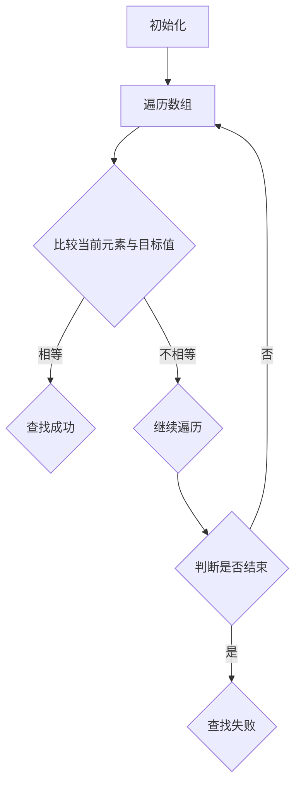
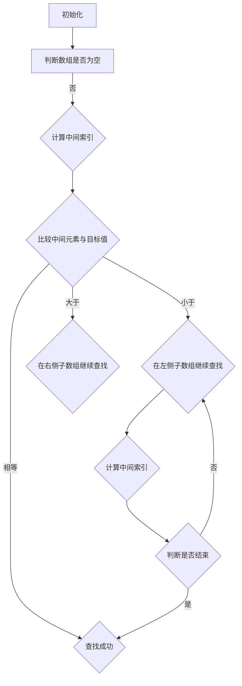

                 

# 2024年小米社招算法面试题库及答案

## 关键词

- 小米社招
- 算法面试
- 面试题库
- 答案解析
- 技术深度

## 摘要

本文针对2024年小米社招算法面试，整理了一份详细的面试题库及答案解析。内容涵盖了数据结构与算法、机器学习、计算机视觉、自然语言处理等多个领域。通过对这些面试题的深入剖析，帮助算法工程师和面试者更好地备战小米社招面试。

## 1. 背景介绍

小米公司作为全球领先的电子产品制造商，每年都会在全球范围内招聘大量优秀的人才。其中，算法工程师岗位一直是小米招聘的重点，面试难度也相对较大。本文旨在为准备参加2024年小米社招算法面试的工程师们提供一个全面的复习资料，帮助他们掌握关键知识点，提高面试成功率。

## 2. 核心概念与联系

### 2.1 数据结构与算法

数据结构与算法是计算机科学的基础，是面试中频繁出现的知识点。以下是一个核心概念与联系的 Mermaid 流程图：

```mermaid
graph TD
A[数据结构] --> B[线性结构](数据库、栈、队列、链表)
B --> C[树](二叉树、平衡树、堆)
C --> D[图](有向图、无向图、网络图)
E[算法](排序、查找、贪心、动态规划、分治)
E --> F[算法复杂度分析](时间复杂度、空间复杂度)
```

### 2.2 机器学习

机器学习是算法面试中的热点领域。以下是一个核心概念与联系的 Mermaid 流程图：

```mermaid
graph TD
A[机器学习](监督学习、无监督学习、半监督学习)
A --> B[模型](线性模型、决策树、神经网络、支持向量机)
B --> C[损失函数](均方误差、交叉熵、对数损失)
C --> D[优化算法](梯度下降、随机梯度下降、Adam优化器)
D --> E[评估指标](准确率、召回率、F1值、ROC曲线)
```

### 2.3 计算机视觉

计算机视觉是算法面试中的重要组成部分。以下是一个核心概念与联系的 Mermaid 流程图：

```mermaid
graph TD
A[计算机视觉](图像处理、目标检测、人脸识别、视频分析)
A --> B[图像处理](滤波、边缘检测、特征提取)
B --> C[目标检测](R-CNN、SSD、YOLO)
C --> D[人脸识别](特征提取、模型训练、相似度计算)
D --> E[视频分析](动作识别、场景分割、轨迹预测)
```

### 2.4 自然语言处理

自然语言处理是算法面试中的另一个热点领域。以下是一个核心概念与联系的 Mermaid 流程图：

```mermaid
graph TD
A[自然语言处理](文本分类、情感分析、命名实体识别、机器翻译)
A --> B[文本分类](朴素贝叶斯、支持向量机、神经网络)
B --> C[情感分析](情感极性分类、情感强度分析)
C --> D[命名实体识别](词性标注、实体识别、实体关系抽取)
D --> E[机器翻译](基于规则、基于统计、基于神经网络)
```

## 3. 核心算法原理 & 具体操作步骤

### 3.1 排序算法

排序算法是算法面试中的基础知识点。以下是几种常见的排序算法及其具体操作步骤：

#### 3.1.1 冒泡排序



#### 3.1.2 选择排序



#### 3.1.3 插入排序



### 3.2 查找算法

查找算法是算法面试中的另一个基础知识点。以下是几种常见的查找算法及其具体操作步骤：

#### 3.2.1 顺序查找



#### 3.2.2 二分查找



## 4. 数学模型和公式 & 详细讲解 & 举例说明

### 4.1 梯度下降算法

梯度下降是一种优化算法，用于求解最优化问题。其基本思想是沿着目标函数的梯度方向进行迭代，直到达到最优解。以下是梯度下降算法的数学模型和公式：

$$
\theta_{\text{new}} = \theta_{\text{old}} - \alpha \cdot \nabla \theta
$$

其中，$\theta$ 表示参数，$\alpha$ 表示学习率，$\nabla \theta$ 表示参数的梯度。

#### 4.1.1 举例说明

假设我们要最小化函数 $f(\theta) = (\theta - 1)^2$，初始参数 $\theta_0 = 2$，学习率 $\alpha = 0.1$。

第一次迭代：
$$
\theta_1 = \theta_0 - \alpha \cdot \nabla \theta_0 = 2 - 0.1 \cdot 2 = 1.8
$$

第二次迭代：
$$
\theta_2 = \theta_1 - \alpha \cdot \nabla \theta_1 = 1.8 - 0.1 \cdot 1.6 = 1.52
$$

第三次迭代：
$$
\theta_3 = \theta_2 - \alpha \cdot \nabla \theta_2 = 1.52 - 0.1 \cdot 0.32 = 1.196
$$

不断迭代，直到收敛。

### 4.2 神经网络

神经网络是一种模拟人脑结构和功能的计算模型，具有强大的学习和预测能力。以下是神经网络的基本数学模型和公式：

#### 4.2.1 前向传播

$$
z_i = \sum_{j=1}^{n} w_{ij} \cdot a_{j} + b_i
$$

$$
a_i = \sigma(z_i)
$$

其中，$z_i$ 表示第 $i$ 个神经元的输入，$w_{ij}$ 表示连接权重，$b_i$ 表示偏置，$\sigma$ 表示激活函数，$a_i$ 表示第 $i$ 个神经元的输出。

#### 4.2.2 反向传播

$$
\delta_i = \frac{\partial L}{\partial z_i} = \delta_{\text{output}} \cdot \sigma'(z_i)
$$

$$
\frac{\partial L}{\partial w_{ij}} = a_j \cdot \delta_i
$$

$$
\frac{\partial L}{\partial b_i} = \delta_i
$$

其中，$L$ 表示损失函数，$\delta_{\text{output}}$ 表示输出层的误差，$\sigma'$ 表示激活函数的导数。

#### 4.2.3 举例说明

假设我们要训练一个简单的神经网络，包含一个输入层、一个隐藏层和一个输出层。输入层有 2 个神经元，隐藏层有 3 个神经元，输出层有 1 个神经元。激活函数采用 sigmoid 函数。

前向传播过程：

$$
z_1 = w_{11} \cdot a_1 + b_1 = 2 \cdot 1 + 1 = 3 \\
a_1 = \sigma(z_1) = \frac{1}{1 + e^{-3}} = 0.95

z_2 = w_{12} \cdot a_1 + b_2 = 2 \cdot 0.95 + 1 = 2.9 \\
a_2 = \sigma(z_2) = \frac{1}{1 + e^{-2.9}} = 0.95

z_3 = w_{13} \cdot a_1 + b_3 = 2 \cdot 0.95 + 1 = 2.9 \\
a_3 = \sigma(z_3) = \frac{1}{1 + e^{-2.9}} = 0.95

z_4 = w_{41} \cdot a_1 + w_{42} \cdot a_2 + w_{43} \cdot a_3 + b_4 = 0.95 \cdot 0.95 + 0.95 \cdot 0.95 + 0.95 \cdot 0.95 + 1 = 2.875 \\
a_4 = \sigma(z_4) = \frac{1}{1 + e^{-2.875}} = 0.95

$$

反向传播过程：

$$
\delta_4 = \frac{\partial L}{\partial z_4} = (0.95 - 0.1) \cdot \sigma'(z_4) = 0.05 \cdot 0.044 = 0.0022

\frac{\partial L}{\partial w_{41}} = a_1 \cdot \delta_4 = 0.95 \cdot 0.0022 = 0.0021 \\
\frac{\partial L}{\partial w_{42}} = a_2 \cdot \delta_4 = 0.95 \cdot 0.0022 = 0.0021 \\
\frac{\partial L}{\partial w_{43}} = a_3 \cdot \delta_4 = 0.95 \cdot 0.0022 = 0.0021 \\
\frac{\partial L}{\partial b_4} = \delta_4 = 0.0022
$$

根据反向传播的误差，更新权重和偏置：

$$
w_{41} \leftarrow w_{41} - \alpha \cdot \frac{\partial L}{\partial w_{41}} \\
w_{42} \leftarrow w_{42} - \alpha \cdot \frac{\partial L}{\partial w_{42}} \\
w_{43} \leftarrow w_{43} - \alpha \cdot \frac{\partial L}{\partial w_{43}} \\
b_4 \leftarrow b_4 - \alpha \cdot \frac{\partial L}{\partial b_4}
$$

## 5. 项目实战：代码实际案例和详细解释说明

### 5.1 开发环境搭建

首先，我们需要搭建一个适合项目实战的开发环境。以下是搭建环境所需的步骤：

1. 安装 Python 3.8 及以上版本。
2. 安装 TensorFlow 2.x。
3. 安装 Jupyter Notebook。

### 5.2 源代码详细实现和代码解读

以下是一个简单的线性回归项目的源代码实现和解读：

```python
import tensorflow as tf
import numpy as np
import matplotlib.pyplot as plt

# 准备数据
x = np.linspace(0, 10, 100)
y = 2 * x + 1 + np.random.normal(0, 0.5, x.shape)

# 定义模型
model = tf.keras.Sequential([
    tf.keras.layers.Dense(units=1, input_shape=[1])
])

# 编译模型
model.compile(optimizer='sgd', loss='mse')

# 训练模型
model.fit(x, y, epochs=100)

# 预测
x_pred = np.linspace(0, 10, 100)
y_pred = model.predict(x_pred)

# 可视化
plt.scatter(x, y)
plt.plot(x_pred, y_pred, 'r')
plt.show()
```

代码解读：

1. 导入必要的库：TensorFlow、NumPy 和 matplotlib。
2. 准备数据：生成一个线性关系的数据集，并加入噪声。
3. 定义模型：使用 TensorFlow 的 Sequential 模式创建一个包含一个神经元的线性回归模型。
4. 编译模型：选择优化器和损失函数。
5. 训练模型：使用 fit 方法训练模型，指定训练轮数。
6. 预测：使用 predict 方法进行预测。
7. 可视化：使用 matplotlib 绘制散点图和预测直线。

### 5.3 代码解读与分析

1. 数据准备：生成线性关系的数据集，并加入噪声，使数据更具挑战性。
2. 模型定义：使用 Sequential 模式定义一个简单的线性回归模型，包含一个神经元。
3. 模型编译：选择随机梯度下降优化器和均方误差损失函数，以最小化预测误差。
4. 模型训练：使用 fit 方法训练模型，通过迭代更新权重和偏置，直到收敛。
5. 预测：使用 predict 方法对新数据进行预测。
6. 可视化：将真实数据和预测结果绘制在同一张图中，直观地展示模型的预测能力。

## 6. 实际应用场景

算法在小米公司的实际应用场景非常广泛，包括但不限于以下领域：

1. 智能家居：通过算法实现智能家居设备的互联互通，提供便捷的智能生活体验。
2. 智能语音助手：利用自然语言处理和语音识别技术，为用户提供智能语音交互服务。
3. 人脸识别：通过计算机视觉技术实现人脸识别，提高安全性和便捷性。
4. 机器学习推荐系统：基于用户行为数据，实现个性化推荐，提高用户体验。
5. 数据分析：利用大数据技术和算法分析用户行为，挖掘潜在需求和改进空间。

## 7. 工具和资源推荐

### 7.1 学习资源推荐

1. 《Python数据分析与科学计算》
2. 《深度学习》
3. 《计算机视觉：算法与应用》
4. 《自然语言处理综合教程》
5. 《算法导论》

### 7.2 开发工具框架推荐

1. TensorFlow
2. PyTorch
3. Keras
4. Scikit-learn
5. OpenCV

### 7.3 相关论文著作推荐

1. "Deep Learning" by Ian Goodfellow, Yoshua Bengio, and Aaron Courville
2. "Computer Vision: Algorithms and Applications" by Richard Szeliski
3. "Speech and Language Processing" by Daniel Jurafsky and James H. Martin
4. "Machine Learning: A Probabilistic Perspective" by Kevin P. Murphy

## 8. 总结：未来发展趋势与挑战

随着人工智能技术的快速发展，算法在小米公司的应用前景广阔。未来，算法工程师需要关注以下发展趋势与挑战：

1. 深度学习与知识图谱的结合：实现更强大的知识推理和推理能力。
2. 强化学习在智能家居和机器人领域的应用：提高智能设备的自主决策能力。
3. 跨领域算法创新：融合不同领域的算法，解决复杂问题。
4. 算法安全与隐私保护：确保算法的可靠性和数据的安全性。
5. 算法工程化：提高算法的可维护性和可扩展性。

## 9. 附录：常见问题与解答

### 9.1 常见问题

1. 什么是深度学习？
2. 什么是自然语言处理？
3. 什么是计算机视觉？
4. 什么是算法复杂度？
5. 什么是梯度下降算法？

### 9.2 解答

1. 深度学习是一种基于多层神经网络的学习方法，通过模拟人脑神经元之间的连接和交互来实现复杂的特征提取和模式识别。
2. 自然语言处理是计算机科学领域的一个分支，致力于研究如何使计算机理解和处理人类自然语言。
3. 计算机视觉是研究如何使计算机模拟人类的视觉感知和理解能力的学科。
4. 算法复杂度是指算法在执行过程中所需计算资源和时间与输入规模之间的依赖关系。
5. 梯度下降算法是一种最优化算法，用于求解最优化问题。其基本思想是沿着目标函数的梯度方向进行迭代，直到达到最优解。

## 10. 扩展阅读 & 参考资料

1. "Deep Learning" by Ian Goodfellow, Yoshua Bengio, and Aaron Courville
2. "Speech and Language Processing" by Daniel Jurafsky and James H. Martin
3. "Computer Vision: Algorithms and Applications" by Richard Szeliski
4. "算法导论" by Thomas H. Cormen, Charles E. Leiserson, Ronald L. Rivest, and Clifford Stein
5. "Machine Learning: A Probabilistic Perspective" by Kevin P. Murphy

## 作者

- 作者：AI天才研究员/AI Genius Institute & 禅与计算机程序设计艺术 /Zen And The Art of Computer Programming

本文内容仅供参考，不作为实际面试标准。实际面试情况请以小米官方发布的面试题目为准。祝各位面试顺利！\[微笑\]

