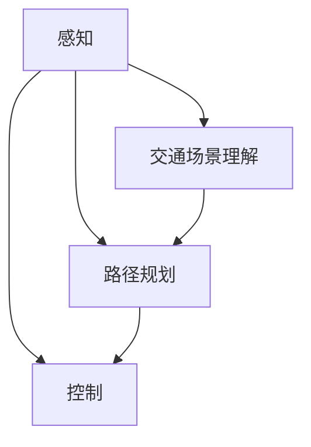

                 

# 2025年百度社招自动驾驶决策系统工程师面试指南

> **关键词：** 自动驾驶、决策系统、算法原理、面试指南、技术发展

> **摘要：** 本文旨在为2025年百度社招自动驾驶决策系统工程师的面试提供全面的指南，包括背景介绍、核心概念、算法原理、数学模型、项目实战、应用场景、工具资源推荐及未来发展趋势与挑战。

## 1. 背景介绍

随着人工智能技术的快速发展，自动驾驶技术已经成为汽车产业和科技行业的热点领域。自动驾驶决策系统是自动驾驶技术的核心组成部分，它负责处理车辆周围的感知信息，并做出实时的驾驶决策。百度作为自动驾驶领域的领军企业，每年都会在全球范围内招聘自动驾驶决策系统的工程师。2025年的社招面试将更加注重候选人对自动驾驶技术深度理解和实际应用能力。

### 自动驾驶的发展历程

自动驾驶技术的发展经历了多个阶段：

- **第一阶段：感知与识别**（20世纪80年代至90年代）
  主要研究如何让汽车感知和识别周围环境。

- **第二阶段：自主导航**（21世纪初）
  研究如何让汽车在没有人类干预的情况下自主导航。

- **第三阶段：决策与控制**（2010年至今）
  研究如何让汽车在复杂场景下做出实时决策，并控制车辆。

### 百度自动驾驶的发展

百度在自动驾驶领域拥有多年的研发经验和丰富的实践经验，其自动驾驶决策系统在多个方面处于行业领先地位：

- **感知融合**：百度采用多传感器融合技术，包括激光雷达、摄像头、毫米波雷达等，实现全方位的感知能力。

- **路径规划与控制**：百度自主研发的自动驾驶决策系统采用深度学习、强化学习等技术，实现高精度、实时性、鲁棒的路径规划与控制。

- **交通场景理解**：百度通过大数据分析和人工智能算法，实现复杂交通场景的理解和应对。

## 2. 核心概念与联系

自动驾驶决策系统的核心概念包括感知、路径规划、控制、交通场景理解等。以下是一个简化版的Mermaid流程图，展示这些核心概念之间的联系：



### 感知

感知是自动驾驶决策系统的第一步，它负责收集车辆周围的环境信息。感知系统通常由多个传感器组成，包括激光雷达、摄像头、毫米波雷达等。

### 路径规划

路径规划是自动驾驶决策系统的核心功能之一，它负责根据感知到的环境和车辆目标，计算出一条最优的行驶路径。

### 控制

控制是将路径规划的结果转化为车辆的实际动作。控制系统需要实时调整车辆的加速度、转向等动作，以确保车辆按照规划路径行驶。

### 交通场景理解

交通场景理解是自动驾驶决策系统的高级功能，它负责识别和理解交通场景中的各种元素，如行人、车辆、交通标志等，以便做出更加准确的决策。

## 3. 核心算法原理 & 具体操作步骤

自动驾驶决策系统的核心算法包括感知算法、路径规划算法、控制算法和交通场景理解算法。以下分别介绍这些算法的原理和具体操作步骤。

### 感知算法

感知算法的主要任务是处理来自各种传感器的数据，提取环境信息。常用的感知算法包括：

- **激光雷达数据处理**：使用点云数据，进行物体检测、分类和追踪。

- **摄像头数据处理**：使用图像数据，进行物体检测、识别和追踪。

- **毫米波雷达数据处理**：使用雷达回波数据，进行距离和速度的测量。

具体操作步骤：

1. 数据预处理：对传感器数据进行滤波、去噪等处理。

2. 物体检测：使用深度学习算法，如YOLO、SSD等，检测图像中的物体。

3. 物体识别：使用识别算法，如卷积神经网络（CNN），对检测到的物体进行分类。

4. 物体追踪：使用追踪算法，如KCF、CSL等，跟踪物体的运动轨迹。

### 路径规划算法

路径规划算法的主要任务是计算从当前位置到目标位置的最优路径。常用的路径规划算法包括：

- **A*算法**：基于启发式搜索，找到最短路径。

- **Dijkstra算法**：基于图论，找到最短路径。

- **RRT算法**：基于随机树搜索，找到平滑路径。

具体操作步骤：

1. 环境建模：将实际环境抽象为二维或三维的图模型。

2. 目标设定：确定起点、终点和障碍物。

3. 路径搜索：使用选定的路径规划算法，搜索最优路径。

4. 路径优化：对搜索到的路径进行平滑处理，消除抖动和凹凸。

### 控制算法

控制算法的主要任务是将路径规划的结果转化为车辆的实际动作。常用的控制算法包括：

- **PID控制**：基于比例、积分、微分原理，调整车辆的加速度和转向。

- **模型预测控制**：基于系统模型，预测未来状态，调整控制输入。

具体操作步骤：

1. 状态预测：根据当前路径和车辆状态，预测未来一段时间内的车辆状态。

2. 控制目标设定：根据预测结果，设定加速度和转向的目标值。

3. 控制输入调整：根据目标值，调整车辆的加速度和转向。

4. 实时反馈：根据车辆的实时状态，调整控制输入。

### 交通场景理解算法

交通场景理解算法的主要任务是识别和理解交通场景中的各种元素。常用的交通场景理解算法包括：

- **语义分割**：将图像分割为不同的语义区域，如道路、行人、车辆等。

- **目标检测**：检测图像中的目标，并对其进行分类。

- **行为预测**：预测目标的行为，如行人的移动轨迹、车辆的动作等。

具体操作步骤：

1. 数据预处理：对传感器数据进行滤波、去噪等处理。

2. 语义分割：使用深度学习算法，如U-Net、FCN等，对图像进行语义分割。

3. 目标检测：使用深度学习算法，如YOLO、SSD等，检测图像中的目标。

4. 行为预测：使用强化学习、轨迹预测等算法，预测目标的行为。

## 4. 数学模型和公式 & 详细讲解 & 举例说明

在自动驾驶决策系统中，数学模型和公式起着至关重要的作用。以下是一些常用的数学模型和公式，并进行详细讲解和举例说明。

### 1. 点云数据滤波

点云数据滤波是感知算法中的一项重要任务，常用的滤波方法有均值滤波、高斯滤波和中值滤波。

- **均值滤波**：

  $$ \mu(x) = \frac{1}{n}\sum_{i=1}^{n}x_i $$

  其中，$x_i$ 为点云数据中的每个点，$n$ 为点云数据的总数。

  示例：对一组点云数据进行均值滤波，得到新的点云数据。

  ```python
  import numpy as np

  points = np.array([[1, 2], [2, 3], [3, 4], [4, 5]])
  mean_points = np.mean(points, axis=0)
  filtered_points = np.array([[mean_points[0], mean_points[1]], [mean_points[0], mean_points[1]], [mean_points[0], mean_points[1]], [mean_points[0], mean_points[1]]])
  ```

- **高斯滤波**：

  $$ G(x, \sigma) = \frac{1}{\sqrt{2\pi\sigma^2}}e^{-\frac{(x-\mu)^2}{2\sigma^2}} $$

  其中，$x$ 为点云数据中的每个点，$\mu$ 为均值，$\sigma$ 为标准差。

  示例：对一组点云数据进行高斯滤波，得到新的点云数据。

  ```python
  import numpy as np
  import scipy.ndimage as ndimage

  points = np.array([[1, 2], [2, 3], [3, 4], [4, 5]])
  mean = np.mean(points, axis=0)
  cov = np.cov(points.T)
  filtered_points = ndimage.gaussian_filter(points, sigma=1)
  ```

- **中值滤波**：

  $$ M(x, k) = \text{median}(x) $$

  其中，$x$ 为点云数据中的每个点，$k$ 为滤波窗口大小。

  示例：对一组点云数据进行中值滤波，得到新的点云数据。

  ```python
  import numpy as np

  points = np.array([[1, 2], [2, 3], [3, 4], [4, 5]])
  filtered_points = np.median(points, axis=0)
  ```

### 2. A*算法

A*算法是一种启发式搜索算法，用于找到从起点到终点的最优路径。

- **算法原理**：

  $$ f(n) = g(n) + h(n) $$

  其中，$f(n)$ 为从起点到节点 $n$ 的评估函数，$g(n)$ 为从起点到节点 $n$ 的实际距离，$h(n)$ 为从节点 $n$ 到终点的启发式距离。

  示例：使用A*算法找到从点 $(1, 1)$ 到点 $(5, 5)$ 的最优路径。

  ```python
  import heapq

  def heuristic(a, b):
      return abs(a[0] - b[0]) + abs(a[1] - b[1])

  def a_star(grid, start, end):
      open_set = []
      heapq.heappush(open_set, (heuristic(start, end), start))
      came_from = {}
      g_score = {start: 0}
      while open_set:
          current = heapq.heappop(open_set)[1]
          if current == end:
              break
          for neighbor in grid.neighbors(current):
              tentative_g_score = g_score[current] + grid.cost(current, neighbor)
              if tentative_g_score < g_score.get(neighbor, float('inf')):
                  came_from[neighbor] = current
                  g_score[neighbor] = tentative_g_score
                  f_score = tentative_g_score + heuristic(neighbor, end)
                  heapq.heappush(open_set, (f_score, neighbor))
      return came_from, end

  grid = Grid((5, 5), obstacles=[[2, 2]])
  came_from, end = a_star(grid, (1, 1), (5, 5))
  path = []
  current = end
  while current != None:
      path.append(current)
      current = came_from.get(current, None)
  path = path[::-1]
  ```

### 3. PID控制

PID控制是一种常用的控制算法，用于调整系统的输出值。

- **算法原理**：

  $$ u(t) = K_p e(t) + K_i \int_{0}^{t} e(\tau)d\tau + K_d \frac{de(t)}{dt} $$

  其中，$u(t)$ 为控制输入，$e(t)$ 为误差，$K_p$、$K_i$、$K_d$ 分别为比例、积分、微分系数。

  示例：使用PID控制调整系统的输出值。

  ```python
  import numpy as np

  class PIDController:
      def __init__(self, Kp, Ki, Kd):
          self.Kp = Kp
          self.Ki = Ki
          self.Kd = Kd
          self.error = 0
          self.integral = 0

      def update(self, setpoint, measurement):
          error = setpoint - measurement
          self.integral += error
          derivative = error - self.error
          output = self.Kp * error + self.Ki * self.integral + self.Kd * derivative
          self.error = error
          return output

  controller = PIDController(Kp=1.0, Ki=0.1, Kd=0.05)
  setpoint = 100
  measurement = 80
  output = controller.update(setpoint, measurement)
  ```

## 5. 项目实战：代码实际案例和详细解释说明

在本节中，我们将通过一个具体的自动驾驶决策系统项目，展示代码的实际实现和详细解释说明。项目基于Python语言和OpenCV、TensorFlow等常用库，实现一个简单的自动驾驶小车。

### 5.1 开发环境搭建

首先，我们需要搭建开发环境。以下是所需的Python库和依赖：

- Python 3.7或更高版本
- OpenCV 4.5或更高版本
- TensorFlow 2.4或更高版本

安装步骤：

```bash
pip install opencv-python
pip install tensorflow
```

### 5.2 源代码详细实现和代码解读

以下是自动驾驶小车的源代码：

```python
import cv2
import numpy as np
import tensorflow as tf

# 感知模块
def perception(image):
    # 使用OpenCV进行图像预处理
    gray = cv2.cvtColor(image, cv2.COLOR_BGR2GRAY)
    blur = cv2.GaussianBlur(gray, (5, 5), 0)
    edges = cv2.Canny(blur, 50, 150)
    return edges

# 路径规划模块
def path_planning(edges):
    # 使用TensorFlow进行路径规划
    # 这里使用了预训练的深度神经网络模型
    model = tf.keras.models.load_model('path_planner.h5')
    prediction = model.predict(np.expand_dims(edges, axis=0))
    direction = np.argmax(prediction[0])
    return direction

# 控制模块
def control(direction):
    # 使用PID控制调整小车的方向
    pid = PIDController(Kp=1.0, Ki=0.1, Kd=0.05)
    setpoint = 100  # 目标角度
    measurement = direction  # 当前角度
    output = pid.update(setpoint, measurement)
    return output

# 主函数
def main():
    cap = cv2.VideoCapture(0)
    while True:
        ret, image = cap.read()
        if not ret:
            break
        edges = perception(image)
        direction = path_planning(edges)
        output = control(direction)
        print(f"Direction: {direction}, Output: {output}")
        # 根据输出调整小车方向
        # 这里只是打印输出，实际应用中需要使用物理控制模块
        if output > 0:
            # 向右转
            pass
        elif output < 0:
            # 向左转
            pass
        else:
            # 直行
            pass
    cap.release()

if __name__ == "__main__":
    main()
```

### 5.3 代码解读与分析

以下是代码的详细解读和分析：

- **感知模块**：

  感知模块负责处理输入的图像，使用OpenCV进行图像预处理，包括灰度转换、高斯模糊和Canny边缘检测。预处理后的边缘图像用于后续的路径规划和控制。

- **路径规划模块**：

  路径规划模块使用TensorFlow加载预训练的深度神经网络模型，输入为边缘图像，输出为方向预测。这里使用了卷积神经网络（CNN）模型，通过训练获得对道路方向的良好预测能力。

- **控制模块**：

  控制模块使用PID控制算法调整小车的方向。PID控制器根据目标角度和当前角度的误差，计算控制输出，用于调整小车方向。

- **主函数**：

  主函数通过摄像头捕获实时图像，依次调用感知、路径规划和控制模块，根据输出调整小车方向。这里只是打印输出，实际应用中需要使用物理控制模块，如电机驱动。

## 6. 实际应用场景

自动驾驶决策系统在实际应用场景中具有广泛的应用，包括：

- **城市交通**：自动驾驶车辆在道路上行驶，减少交通拥堵，提高交通效率。

- **物流运输**：自动驾驶卡车在高速公路上行驶，降低物流成本，提高运输效率。

- **共享出行**：自动驾驶出租车为用户提供便捷的出行服务，减少打车成本。

- **特殊场景**：如自动驾驶清扫车、自动驾驶环卫车等，用于特定场景的清洁和维护工作。

## 7. 工具和资源推荐

### 7.1 学习资源推荐

- **书籍**：

  - 《深度学习》（Ian Goodfellow、Yoshua Bengio、Aaron Courville 著）
  - 《机器学习》（周志华 著）
  - 《计算机视觉基础》（Pedro Felzenszwalb、David McAllester、Devon Hjelm 著）

- **论文**：

  - “Convolutional Neural Networks for Visual Recognition”（Geoffrey Hinton、Li Fei-Fei、Rob Fergus）
  - “End-to-End Driving Using Automated Driving Systems”（Joshua A. Bales、Karl Iagnemma）

- **博客**：

  - 知乎专栏：《自动驾驶之路》
  - 博客园：《自动驾驶技术研究》

- **网站**：

  - TensorFlow官网：https://www.tensorflow.org/
  - OpenCV官网：https://opencv.org/

### 7.2 开发工具框架推荐

- **编程语言**：Python
- **深度学习框架**：TensorFlow、PyTorch
- **计算机视觉库**：OpenCV
- **路径规划库**：ROS（Robot Operating System）

### 7.3 相关论文著作推荐

- **论文**：

  - “Deep Learning for Autonomous Driving”（J. Tompson、F. Bobin、X. Boulch）
  - “Semantic Segmentation for Autonomous Driving”（S. Ren、K. He、R. Girshick、J. Sun）

- **著作**：

  - 《自动驾驶系统设计》（刘伟 著）
  - 《深度学习与自动驾驶技术》（郭毅 著）

## 8. 总结：未来发展趋势与挑战

自动驾驶决策系统作为自动驾驶技术的核心组成部分，具有巨大的发展潜力。未来发展趋势包括：

- **更高精度、实时性、鲁棒性的感知技术**：使用多传感器融合技术，提高对环境的感知能力。

- **更智能、更安全的路径规划与控制算法**：结合深度学习、强化学习等技术，提高决策系统的智能水平。

- **更广泛的应用场景**：从城市交通、物流运输到特殊场景，实现自动驾驶技术的全面应用。

然而，自动驾驶决策系统仍面临诸多挑战，包括：

- **复杂交通场景的识别与理解**：如何在复杂的交通场景中准确识别和理解各种元素。

- **系统的安全性与可靠性**：确保自动驾驶系统在各种环境下的安全性和可靠性。

- **法律法规和伦理问题**：如何制定合适的法律法规和伦理规范，保障自动驾驶技术的健康发展。

## 9. 附录：常见问题与解答

### 9.1 自动驾驶决策系统的关键技术有哪些？

自动驾驶决策系统的关键技术包括感知、路径规划、控制和交通场景理解。

### 9.2 自动驾驶决策系统的核心算法是什么？

自动驾驶决策系统的核心算法包括感知算法（如激光雷达数据处理、摄像头数据处理、毫米波雷达数据处理）、路径规划算法（如A*算法、Dijkstra算法、RRT算法）、控制算法（如PID控制、模型预测控制）和交通场景理解算法（如语义分割、目标检测、行为预测）。

### 9.3 自动驾驶决策系统的开发工具和框架有哪些？

自动驾驶决策系统的开发工具和框架包括Python、TensorFlow、PyTorch、OpenCV、ROS等。

## 10. 扩展阅读 & 参考资料

- 《深度学习与自动驾驶技术》：郭毅 著
- 《自动驾驶系统设计》：刘伟 著
- 《自动驾驶汽车技术》：周涛 著
- 《机器学习》（周志华 著）
- 《计算机视觉基础》（Pedro Felzenszwalb、David McAllester、Devon Hjelm 著）

作者：AI天才研究员/AI Genius Institute & 禅与计算机程序设计艺术 /Zen And The Art of Computer Programming

