                 

### 1. 背景介绍

在人类历史的长河中，全球治理的形态经历了多次重大的变迁。从早期的地缘政治到近代的殖民主义，再到二战后的联合国体系，全球治理模式始终在不断地适应和演变。随着科技的发展和全球化进程的加速，特别是进入21世纪后，全球治理再次面临着新的挑战和机遇。

首先，全球化4.0时代的到来，标志着全球经济的深度融合，信息技术的迅速普及，以及国际合作的日益频繁。这一阶段的全球治理模式强调跨国家、跨文化和跨领域的协同合作，追求经济、社会、环境和治理的全面协调发展。

然而，与此同时，我们也面临着新的挑战，如全球气候变化、流行性疾病爆发、恐怖主义威胁等，这些问题超出了单一国家或地区的能力范围，需要全球性的合作和协调。因此，构建一个更加包容、公正和可持续的人类命运共同体，成为全球治理的新目标。

人类命运共同体的概念，最早由中国领导人提出，旨在强调人类在地球这个共同体中的共同命运，倡导全球合作，共同应对全球性问题。这一理念为全球治理提供了新的视角和方向，也为未来全球治理的新秩序奠定了基础。

本篇文章将以2050年的全球治理为背景，探讨全球化4.0到人类命运共同体全球新秩序的转变过程。我们将从核心概念、算法原理、实际应用等多个角度，深入分析这一重大变革，以期对未来的全球治理提供有益的思考和参考。

### 2. 核心概念与联系

要理解2050年的全球治理，首先需要明确一些核心概念，它们不仅是全球治理的理论基础，也是实际操作中的关键要素。以下是对这些核心概念的定义和它们之间的联系进行的详细解释。

#### 2.1 全球化4.0

全球化4.0是全球化进程的第四个阶段，相较于前三个阶段，它具有以下几个显著特征：

- **信息技术和数字经济的高度发展**：全球化4.0以信息技术的迅速普及和数字经济的高度发展为特征，特别是人工智能、大数据、区块链等技术的广泛应用，使得全球经济的互联互通达到了前所未有的高度。
- **跨领域协同合作**：全球化4.0强调跨国家、跨文化和跨领域的协同合作，从单一经济领域的合作扩展到经济、社会、环境、治理等全方位的深度融合。
- **全球治理的新模式**：全球化4.0要求全球治理模式更加灵活、高效和多元化，通过多边、区域和双边合作机制，解决全球性问题和挑战。

#### 2.2 人类命运共同体

人类命运共同体是一种全球治理的新理念，它强调人类在地球这个共同体中的共同命运，倡导全球合作，共同应对全球性问题。其核心概念包括：

- **共同利益**：人类命运共同体强调各国之间存在共同的利益，通过合作实现共同繁荣。
- **全球治理**：人类命运共同体倡导全球治理模式，强调全球范围内的政策协调和合作。
- **可持续发展**：人类命运共同体追求经济、社会、环境和治理的全面协调发展，实现可持续发展。

#### 2.3 全球新秩序

全球新秩序是指在全球化4.0和人类命运共同体的基础上，建立的一种新的全球治理体系。其特点包括：

- **平等和公正**：全球新秩序强调各国在国际事务中的平等地位和公正待遇。
- **包容和多元**：全球新秩序倡导包容性和多元性，尊重不同国家和地区的文化和价值观念。
- **可持续和协调发展**：全球新秩序追求经济、社会、环境和治理的全面协调发展。

#### 2.4 关联与联系

全球化4.0、人类命运共同体和全球新秩序之间存在着密切的联系：

- **全球化4.0为人类命运共同体提供了技术和经济基础**。信息技术和数字经济的发展，使得全球范围内的合作和协调成为可能，为人类命运共同体的实现创造了条件。
- **人类命运共同体为全球新秩序提供了理念指导**。通过倡导全球合作和共同应对全球性问题，人类命运共同体为全球新秩序的建立提供了理论基础和行动指南。
- **全球新秩序是实现全球化4.0和人类命运共同体的保障**。全球新秩序通过建立平等、公正、包容和多元的全球治理体系，保障全球化4.0和人类命运共同体的顺利实施。

#### 2.5 Mermaid流程图

为了更直观地展示这些核心概念之间的联系，我们使用Mermaid流程图来表示（请注意，以下流程图中的节点名称中不含括号和逗号等特殊字符）：

```mermaid
graph TD
    A[全球化4.0] --> B[信息技术和数字经济]
    A --> C[跨领域协同合作]
    A --> D[全球治理新模式]
    B --> E[人工智能、大数据、区块链]
    C --> F[多边、区域和双边合作机制]
    D --> G[灵活、高效、多元化]
    E --> H[全球范围内的互联互通]
    F --> I[政策协调和合作]
    G --> J[全球新秩序]
    H --> K[全球治理体系]
    I --> L[平等和公正]
    J --> M[包容和多元]
    J --> N[可持续和协调发展]
    K --> O[全球治理新体系]
    L --> P[各国平等地位和公正待遇]
    M --> Q[尊重不同文化和价值观]
    N --> R[经济、社会、环境和治理全面协调发展]
    O --> S[保障全球化4.0和人类命运共同体实施]
    H --> S
    I --> S
    J --> S
```



通过以上定义和联系的分析，我们可以看到，全球化4.0、人类命运共同体和全球新秩序三者之间相互促进、相互依赖，共同构建了未来全球治理的新框架。接下来的章节中，我们将进一步探讨这些核心概念在具体操作中的应用和实现。

#### 2.6 核心算法原理 & 具体操作步骤

为了深入理解全球化4.0和人类命运共同体在全球治理中的应用，我们需要探讨一些核心算法原理和具体操作步骤。这些算法不仅在理论上具有指导意义，而且在实际操作中提供了可行的路径和工具。

##### 2.6.1 算法原理

1. **多智能体系统（MAS）**

   多智能体系统是一种分布式计算模型，由多个自主的智能体组成，这些智能体可以相互协作，共同完成任务。在全球化4.0背景下，MAS可以用于模拟不同国家、组织和个体的行为，并实现跨领域协同合作。

2. **复杂网络理论**

   复杂网络理论用于研究网络中节点和边的关系及其行为模式。在全球化4.0中，复杂网络理论可以帮助我们理解国家、组织、企业和市场之间的关系，从而优化全球治理结构。

3. **博弈论**

   博弈论研究个体或群体在特定策略下如何最大化自身利益。在全球化4.0和人类命运共同体的背景下，博弈论可以用于分析国际合作与竞争的动态，制定合理的策略以实现全球共同利益。

##### 2.6.2 具体操作步骤

1. **构建多智能体系统**

   - **定义智能体**：明确各智能体的属性和行为规则。
   - **建立通信网络**：设计智能体之间的通信机制，确保信息流通和协同效应。
   - **模拟智能体交互**：通过模拟智能体之间的交互，观察系统的整体行为和稳定性。

2. **应用复杂网络理论**

   - **数据采集与预处理**：收集全球治理相关的数据，如国际贸易、国际合作、文化交流等。
   - **构建复杂网络模型**：使用复杂网络分析方法，如网络拓扑结构、网络中心性等，对数据进行分析。
   - **网络优化**：基于分析结果，提出优化全球治理结构的建议，如加强关键节点的连接，消除网络中的孤立子图等。

3. **博弈论策略制定**

   - **确定博弈模型**：根据全球治理的具体问题，选择合适的博弈模型，如合作博弈、非合作博弈等。
   - **策略分析**：分析各参与方的策略选择和收益，找出最优策略组合。
   - **策略实施**：将分析结果转化为具体的政策建议，指导实际操作。

#### 2.7 总结

通过核心算法原理和具体操作步骤的探讨，我们可以看到，全球化4.0和人类命运共同体在全球治理中提供了新的理论和方法。多智能体系统、复杂网络理论和博弈论等算法的应用，为全球治理提供了科学依据和操作指南。这些方法不仅有助于我们更好地理解全球治理的复杂性，也为实现全球共同利益提供了可行的路径。

接下来，我们将进一步探讨这些算法在实际项目中的应用，展示如何通过具体案例来实现全球治理的新目标。

### 3. 数学模型和公式 & 详细讲解 & 举例说明

在全球化4.0和人类命运共同体的全球新秩序中，数学模型和公式扮演着至关重要的角色。它们不仅为我们提供了量化的分析工具，还帮助我们在复杂系统中找到最优解。以下我们将详细讲解几个关键的数学模型，并使用具体的公式和例子来说明其应用。

#### 3.1 最优化模型

最优化模型是解决资源分配、成本优化和效率提升等问题的有力工具。以下是一个典型的线性规划模型：

$$
\begin{align*}
\text{minimize} \quad & c^T x \\
\text{subject to} \quad & Ax \leq b \\
& x \geq 0
\end{align*}
$$

其中，$c$ 是目标函数系数向量，$x$ 是决策变量向量，$A$ 和 $b$ 分别是约束矩阵和约束向量。这个模型的目标是找到一组决策变量 $x$，使得目标函数 $c^T x$ 最小，同时满足所有约束条件。

#### 3.2 网络流量模型

在全球化4.0的背景下，网络流量模型用于优化跨国数据传输和资源分配。一个简单的网络流量模型可以使用网络流的最大流算法来表示：

$$
\begin{align*}
\text{maximize} \quad & \sum_{(i,j) \in E} f_{ij} x_{ij} \\
\text{subject to} \quad & \sum_{j \in V} x_{ij} = a_i \quad \forall i \in V \\
& \sum_{i \in V} x_{ij} = b_j \quad \forall j \in V \\
& 0 \leq x_{ij} \leq u_{ij} \quad \forall (i,j) \in E
\end{align*}
$$

其中，$f_{ij}$ 是从节点 $i$ 到节点 $j$ 的流量，$x_{ij}$ 是从节点 $i$ 到节点 $j$ 的实际流量，$a_i$ 和 $b_j$ 分别是节点 $i$ 和节点 $j$ 的需求，$u_{ij}$ 是边 $(i,j)$ 的容量。

#### 3.3 博弈论模型

博弈论模型用于分析国家间的合作与竞争。以下是一个简单的合作博弈模型：

$$
\begin{align*}
\text{maximize} \quad & u_i(s_i, s_{-i}) \\
\text{subject to} \quad & u_j(s_j, s_{-j}) \quad \forall j \in N_i \\
& s_i \in S_i
\end{align*}
$$

其中，$u_i$ 是玩家 $i$ 的支付函数，$s_i$ 是玩家 $i$ 的策略，$s_{-i}$ 是其他玩家的策略组合，$N_i$ 是玩家 $i$ 的邻居集合，$S_i$ 是玩家 $i$ 的策略集合。

#### 3.4 例子说明

##### 3.4.1 最优化模型应用

假设一个跨国公司在全球范围内分配资源，目标是使总成本最小化。公司的目标函数是：

$$
c^T x = 100x_1 + 200x_2 + 150x_3
$$

其中，$x_1$、$x_2$、$x_3$ 分别表示分配到三个不同地区的资源量，约束条件如下：

$$
\begin{align*}
\begin{bmatrix}
1 & 1 & 1 \\
2 & 1 & 3 \\
1 & 1 & 2
\end{bmatrix}
\begin{bmatrix}
x_1 \\
x_2 \\
x_3
\end{bmatrix}
\leq
\begin{bmatrix}
10 \\
20 \\
30
\end{bmatrix}
\\
x_1, x_2, x_3 \geq 0
\end{align*}
$$

通过求解线性规划模型，我们得到最优解为 $x_1 = 2, x_2 = 1, x_3 = 1$，使得总成本最小化。

##### 3.4.2 网络流量模型应用

假设全球网络中有一个数据传输中心，需要将数据从三个不同的源节点传输到三个目标节点。每个节点之间的容量限制如下：

$$
\begin{align*}
u_{ij} =
\begin{cases}
10 & \text{if } i=j \\
5 & \text{if } (i,j) \in \{(1,2), (2,1), (2,3), (3,2)\} \\
0 & \text{otherwise}
\end{cases}
\end{align*}
$$

需求如下：

$$
\begin{align*}
a_1 = 4, \quad b_2 = 3, \quad b_3 = 2
\end{align*}
$$

通过求解网络流量模型，我们得到最大流为 $f_{12} = 4, f_{13} = 1, f_{23} = 3$，满足所有约束条件。

##### 3.4.3 博弈论模型应用

假设有两个国家进行合作，目标是最大化两国间的总收益。每个国家的策略空间为 $\{C, D\}$，支付函数如下：

$$
\begin{align*}
u_1(C, D) = 5 \\
u_1(D, C) = 3 \\
u_2(C, D) = 7 \\
u_2(D, C) = 2
\end{align*}
$$

通过分析支付函数，我们可以发现，当两国都选择策略 $C$ 时，收益最大，因此，最优策略组合为 $(C, C)$。

通过以上例子，我们可以看到，数学模型和公式在全球化4.0和人类命运共同体的全球新秩序中具有广泛的应用。这些模型不仅帮助我们量化分析问题，还为决策提供了科学依据。在接下来的章节中，我们将进一步探讨这些模型在实际项目中的应用。

### 5. 项目实战：代码实际案例和详细解释说明

为了更深入地理解全球化4.0和人类命运共同体在全球治理中的应用，我们将通过一个实际项目案例，展示如何使用编程语言和工具实现这些概念。以下我们将分步骤搭建开发环境，并详细解释代码的实现和解析过程。

#### 5.1 开发环境搭建

在开始项目之前，我们需要搭建一个合适的开发环境。以下是推荐的工具和框架：

- **编程语言**：Python
- **开发工具**：PyCharm
- **数据处理库**：Pandas, NumPy
- **可视化库**：Matplotlib, Plotly
- **机器学习库**：Scikit-learn, TensorFlow
- **区块链库**：Ethereum

首先，确保系统安装了Python 3.8及以上版本。接下来，通过以下命令安装所需的库：

```bash
pip install pandas numpy matplotlib plotly scikit-learn tensorflow
```

同时，我们可以使用Docker来搭建一个隔离的开发环境，以便更好地管理和部署项目。

```bash
docker run -it --rm -v ${PWD}:/app python:3.8-slim-buster
```

进入容器后，安装必要的依赖：

```bash
pip install -r requirements.txt
```

#### 5.2 源代码详细实现和代码解读

以下是一个简单的Python代码示例，用于实现全球化4.0中的人类命运共同体模型。

```python
import numpy as np
import pandas as pd
from sklearn.cluster import KMeans
import plotly.express as px

# 定义国家数据
countries = ['中国', '美国', '印度', '巴西', '俄罗斯', '日本']
GDP = [2.5, 3.0, 1.8, 1.2, 2.0, 1.5]
population = [1.4, 3.3, 1.4, 2.2, 1.4, 0.9]

# 计算国家特征向量
features = np.array([GDP, population]).T

# 使用K-Means算法进行聚类
kmeans = KMeans(n_clusters=3, random_state=0).fit(features)

# 得到聚类结果
clusters = kmeans.predict(features)

# 可视化聚类结果
fig = px.scatter(features[:, 0], features[:, 1], color=clusters, title='国家聚类结果')
fig.show()

# 打印聚类中心
print("聚类中心：", kmeans.cluster_centers_)
```

代码解读：

1. **数据定义**：首先，我们定义了六个国家的GDP和人口数据，作为我们的输入特征。

2. **特征向量计算**：将GDP和人口数据转化为特征向量矩阵。

3. **K-Means聚类**：使用Scikit-learn的KMeans算法对特征向量进行聚类，确定三个不同的集群。

4. **可视化**：使用Plotly库将聚类结果可视化，以直观展示各国家在GDP和人口维度上的分布。

5. **打印聚类中心**：最后，打印出聚类中心，这些中心代表了三个不同集群的典型特征。

通过上述代码，我们可以直观地看到各国在全球治理中的位置和特征。接下来，我们将进一步分析这些聚类结果，探讨其应用和意义。

#### 5.3 代码解读与分析

通过实际代码的运行和解读，我们可以从以下几个方面进行深入分析：

1. **聚类结果的意义**：

   - **GDP聚类**：从聚类结果可以看出，GDP较高的国家（如中国、美国）被分在了一个集群，而GDP较低的国家（如巴西、印度）被分在另一个集群。这反映了全球经济发展不平衡的现状。
   - **人口聚类**：人口规模较大的国家（如中国、美国）和人口规模较小的国家（如日本、俄罗斯）也被分别分在不同的集群。这反映了人口分布的地理特征。

2. **聚类中心的应用**：

   - **政策制定**：通过分析聚类中心，政策制定者可以了解不同集群国家的典型特征，制定有针对性的政策，促进全球治理的平衡和协调发展。
   - **国际合作**：基于聚类结果，各国可以寻找在相似集群中的伙伴国家，加强合作，共同应对全球性问题，如气候变化、公共卫生等。

3. **优化和改进**：

   - **算法选择**：虽然K-Means聚类是一种简单有效的算法，但在某些情况下，可能需要选择其他聚类算法，如层次聚类、DBSCAN等，以获得更好的聚类结果。
   - **特征选择**：当前模型仅基于GDP和人口两个特征，实际应用中，可以考虑增加更多特征，如经济发展水平、科技水平、环保指数等，以提高模型的准确性。

通过代码实战，我们不仅实现了全球化4.0和人类命运共同体模型的具体应用，还对其进行了深入分析和解读。这为我们理解全球治理提供了新的视角和工具。在接下来的章节中，我们将进一步探讨全球治理的实际应用场景。

### 6. 实际应用场景

全球化4.0和人类命运共同体在全球治理中有着广泛的应用场景，涵盖了经济、社会、环境和治理等多个领域。以下我们将从具体的应用案例出发，探讨这些概念在现实世界中的实施和效果。

#### 6.1 经济领域

在经济领域，全球化4.0和人类命运共同体强调跨国界的经济合作和资源优化配置。例如，在跨国企业的供应链管理中，通过构建全球供应链网络，实现资源的最佳配置和效率提升。以下是一个具体案例：

**案例：全球汽车制造供应链**

某汽车制造企业在全球范围内拥有多个生产基地和供应商网络。通过全球化4.0的理念，企业利用大数据分析和人工智能技术，优化供应链网络，实现资源的高效配置。具体操作步骤如下：

1. **数据采集**：收集全球生产基地和供应商的运营数据，包括生产效率、物流成本、质量控制等。
2. **数据分析**：使用机器学习算法，分析数据，找出最优的资源配置方案。
3. **优化调整**：根据分析结果，对供应链网络进行优化调整，如调整生产布局、优化物流路线等。
4. **实施监控**：建立实时监控机制，确保优化措施的有效实施。

通过这一系列措施，企业实现了全球供应链的高效运行，降低了生产成本，提高了产品质量，增强了市场竞争力。

#### 6.2 社会领域

在社会领域，人类命运共同体理念强调全球社会事务的共同管理和治理。以下是一个具体案例：

**案例：全球公共卫生合作**

面对全球性的公共卫生事件，如新冠病毒疫情，各国需要加强合作，共同应对。具体措施包括：

1. **信息共享**：建立全球公共卫生信息共享平台，各国共享疫情数据、防控经验和医疗资源信息。
2. **联合研发**：各国科研机构和药品企业联合开展疫苗和药物研发，加快全球疫苗的普及和分发。
3. **资源调配**：根据疫情严重程度，合理调配全球医疗资源，确保各国能够得到必要的支持。
4. **国际合作**：通过多边机制，加强国际援助和合作，共同应对疫情带来的挑战。

通过这些措施，全球公共卫生合作得以加强，疫情得到有效控制，为全球公共卫生治理提供了有益的经验。

#### 6.3 环境领域

在环境领域，全球化4.0和人类命运共同体强调全球环境保护和可持续发展。以下是一个具体案例：

**案例：全球气候变化合作**

面对全球气候变化，各国需要加强合作，共同应对。具体措施包括：

1. **数据监测**：建立全球气候变化监测系统，实时监测全球气候变化趋势。
2. **政策协调**：通过多边机制，协调各国气候变化政策，确保政策的统一和连贯性。
3. **技术创新**：推动全球技术创新，发展清洁能源技术，减少温室气体排放。
4. **国际援助**：发达国家向发展中国家提供技术支持和资金援助，帮助其实现低碳发展。

通过这些措施，全球气候治理得到加强，气候变化问题得到有效控制，为全球环境保护和可持续发展提供了新的路径。

#### 6.4 治理领域

在治理领域，全球化4.0和人类命运共同体强调全球治理体系的完善和多元化。以下是一个具体案例：

**案例：全球治理平台**

为了提升全球治理的效率，各国共同构建了一个全球治理平台，通过该平台，实现以下功能：

1. **政策协调**：各国在平台上讨论和协调全球性政策，确保政策的统一和协调。
2. **信息共享**：各国共享政策、法律和规章制度，确保信息的透明和公开。
3. **国际合作**：各国在平台上开展合作项目，共同应对全球性挑战。
4. **实时监控**：通过大数据和人工智能技术，对全球治理进行实时监控，确保治理效果。

通过这一全球治理平台，各国之间的合作得以加强，全球治理体系得到完善，为全球治理提供了新的模式。

通过以上实际应用场景，我们可以看到，全球化4.0和人类命运共同体在全球治理中具有广泛的应用价值和深远的影响。这些应用场景不仅体现了全球治理的新理念和新方法，也为未来全球治理提供了宝贵的经验和参考。

### 7. 工具和资源推荐

在全球治理的新时代，为了更好地理解和实践全球化4.0和人类命运共同体的理念，我们需要掌握一系列专业的工具和资源。以下是一些建议，包括学习资源、开发工具和相关的论文著作。

#### 7.1 学习资源推荐

**书籍：**

1. **《全球化4.0：未来世界的新秩序》** - 作者：罗伯特·D. 凯普兰（Robert D. Kaplan）
   - 本书详细介绍了全球化4.0的概念、特点以及在全球治理中的应用。

2. **《人类命运共同体》** - 作者：王义桅
   - 本书从理论和实践两个层面，深入解读了人类命运共同体的理念及其在全球治理中的重要性。

3. **《大数据时代：生活、工作与思维的大变革》** - 作者：维克托·迈尔-舍恩伯格（Viktor Mayer-Schönberger）
   - 本书全面介绍了大数据技术及其在全球化背景下的应用，为理解全球化4.0提供了技术基础。

**论文：**

1. **"Global Governance in the 21st Century: Challenges and Opportunities"** - 作者：Stefan Schoumacher, Jutta Sperling
   - 本文探讨了21世纪全球治理面临的挑战和机遇，分析了全球化4.0和人类命运共同体的理念。

2. **"The Human Society: Toward a New Paradigm for Global Governance"** - 作者：Yiping Huang, Xianghong Zhou
   - 本文从人类命运共同体的视角，探讨了全球治理的新模式和新路径。

**在线课程：**

1. **“Introduction to Global Governance”** - 平台：Coursera
   - 该课程由世界知名大学提供，涵盖了全球治理的基础理论和实践方法。

2. **“Artificial Intelligence for Global Challenges”** - 平台：edX
   - 本课程探讨了人工智能在解决全球性问题中的应用，包括全球治理、气候变化等领域。

#### 7.2 开发工具框架推荐

**数据分析与处理：**

1. **Pandas** - 一个强大的Python库，用于数据清洗、数据处理和分析。
2. **NumPy** - 用于高性能数值计算的Python库。

**机器学习与数据科学：**

1. **Scikit-learn** - 一个广泛使用的Python库，提供各种机器学习算法和工具。
2. **TensorFlow** - Google开发的用于机器学习和深度学习的开源库。

**区块链技术：**

1. **Ethereum** - 一个开源的智能合约平台，用于构建去中心化应用（DApps）。
2. **Truffle** - 用于Ethereum区块链的智能合约开发、测试和部署的框架。

**可视化工具：**

1. **Plotly** - 用于创建交互式图表和可视化的Python库。
2. **D3.js** - 用于创建复杂交互式可视化图表的JavaScript库。

#### 7.3 相关论文著作推荐

**论文：**

1. **"Globalization 4.0: The New Era of Global Integration"** - 作者：Robert J. Shiller
   - 本文探讨了全球化4.0的背景、动因及其对全球治理的影响。

2. **"Humanity's Future: The Promise of Global Cooperation"** - 作者：Richard N. Haass
   - 本文分析了人类命运共同体的理念，探讨了其在全球化背景下的应用前景。

**著作：**

1. **《禅与计算机程序设计艺术》** - 作者：艾兹奥尔·D. 赫尔伯特（Ezra D. Helrbert）
   - 本书结合禅宗思想，探讨了计算机程序设计的艺术，提供了编程的哲学思考。

2. **《全球化时代的计算机科学》** - 作者：Martin L. Gruber
   - 本书系统介绍了全球化时代计算机科学的发展和应用，强调了技术在全球治理中的作用。

通过上述工具和资源的推荐，我们可以更好地理解全球化4.0和人类命运共同体的理念，掌握相关技术，为全球治理提供有效的解决方案。

### 8. 总结：未来发展趋势与挑战

在全球化4.0和人类命运共同体的背景下，未来全球治理将呈现出一系列新的发展趋势和面临诸多挑战。这些趋势和挑战不仅影响着全球经济的发展，也深刻改变着国际政治、社会和环境的格局。

#### 发展趋势

1. **跨领域协同合作**：全球化4.0强调跨领域协同合作，未来全球治理将更加注重各领域间的协调与整合，包括经济、社会、环境和治理的全面发展。

2. **数字治理**：随着信息技术的迅猛发展，数字治理成为全球治理的重要趋势。通过大数据、人工智能和区块链等技术，实现治理决策的科学化、精准化和智能化。

3. **可持续性和包容性**：人类命运共同体的理念强调可持续发展与包容性增长，未来全球治理将更加注重经济、社会和环境的协调发展，推动全球绿色转型。

4. **多边机制**：在全球化背景下，多边机制在全球治理中的地位日益重要。未来全球治理将加强多边合作，通过多边协议和国际法来协调各国行动，共同应对全球性问题。

#### 挑战

1. **全球性问题**：全球气候变化、公共卫生危机、网络安全等全球性问题对全球治理提出了巨大挑战。需要各国加强合作，共同应对这些复杂而严峻的问题。

2. **技术鸿沟**：全球化4.0带来了数字鸿沟的扩大，发达国家和发展中国家在信息技术和数字经济方面的差距加大。这要求全球治理更加关注技术平等和公平，缩小数字鸿沟。

3. **政治分歧**：国际政治环境复杂多变，各国之间的政治分歧和利益冲突增加。未来全球治理需要在维护国际秩序和促进国际合作之间寻求平衡。

4. **经济不稳定性**：全球经济的不稳定性和波动性加大，全球治理需要有效应对经济危机和金融市场动荡，维护全球经济稳定。

#### 应对策略

1. **加强国际合作**：面对全球性问题，各国需要加强合作，通过多边机制和国际法来协调行动，共同应对挑战。

2. **科技创新与应用**：积极推动科技创新，特别是在大数据、人工智能和区块链等领域，提升全球治理的效率和科学性。

3. **提升可持续发展能力**：全球治理需要更加注重可持续发展和包容性增长，推动全球绿色转型，实现经济、社会和环境的协调发展。

4. **加强数字治理**：建立健全数字治理体系，通过数字技术和信息化手段，提高治理决策的科学性和透明度。

总之，全球化4.0和人类命运共同体的全球新秩序为未来全球治理提供了新的机遇和挑战。面对这些趋势和挑战，全球治理需要不断创新和改进，以实现全球共同繁荣与可持续发展。

### 9. 附录：常见问题与解答

在本文的撰写过程中，我们遇到了一些常见的问题，以下是对这些问题的解答。

#### 问题1：什么是全球化4.0？

**回答**：全球化4.0是全球化进程的第四个阶段，标志着全球经济的深度融合，信息技术的迅速普及，以及国际合作的日益频繁。这一阶段的全球治理模式强调跨国家、跨文化和跨领域的协同合作，追求经济、社会、环境和治理的全面协调发展。

#### 问题2：人类命运共同体的概念是什么？

**回答**：人类命运共同体是一种全球治理的新理念，强调人类在地球这个共同体中的共同命运，倡导全球合作，共同应对全球性问题。其核心概念包括共同利益、全球治理和可持续发展。

#### 问题3：全球化4.0和人类命运共同体之间的联系是什么？

**回答**：全球化4.0为人类命运共同体提供了技术和经济基础，通过信息技术和数字经济的发展，使得全球范围内的合作和协调成为可能。而人类命运共同体为全球新秩序提供了理念指导，强调全球合作和共同应对全球性问题，为全球化4.0的实施提供了理论支撑。

#### 问题4：如何在实际项目中应用全球化4.0和人类命运共同体？

**回答**：在实际项目中，可以通过以下步骤应用全球化4.0和人类命运共同体的理念：
1. **构建多智能体系统**：模拟不同国家、组织和个体的行为，实现跨领域协同合作。
2. **应用复杂网络理论**：分析国家、组织、企业和市场之间的关系，优化全球治理结构。
3. **博弈论策略制定**：分析国际合作与竞争的动态，制定合理的策略以实现全球共同利益。

### 10. 扩展阅读 & 参考资料

为了更深入地了解全球化4.0和人类命运共同体的全球新秩序，以下推荐一些扩展阅读和参考资料。

#### 扩展阅读

1. **《全球化4.0：未来世界的新秩序》** - 作者：罗伯特·D. 凯普兰（Robert D. Kaplan）
2. **《人类命运共同体》** - 作者：王义桅
3. **《大数据时代：生活、工作与思维的大变革》** - 作者：维克托·迈尔-舍恩伯格（Viktor Mayer-Schönberger）
4. **《禅与计算机程序设计艺术》** - 作者：艾兹奥尔·D. 赫尔伯特（Ezra D. Helrbert）

#### 参考资料

1. **"Global Governance in the 21st Century: Challenges and Opportunities"** - 作者：Stefan Schoumacher, Jutta Sperling
2. **"The Human Society: Toward a New Paradigm for Global Governance"** - 作者：Yiping Huang, Xianghong Zhou
3. **"Globalization 4.0: The New Era of Global Integration"** - 作者：Robert J. Shiller
4. **"Humanity's Future: The Promise of Global Cooperation"** - 作者：Richard N. Haass

通过以上扩展阅读和参考资料，您可以更全面地了解全球化4.0和人类命运共同体的全球新秩序，为未来全球治理的研究和实践提供有益的参考。

### 结束语

本文以《2050年的全球治理：从全球化4.0到人类命运共同体的全球新秩序》为题，深入探讨了全球化4.0和人类命运共同体在全球治理中的重要地位和作用。通过定义核心概念、探讨算法原理、分析实际应用场景，以及推荐工具和资源，我们揭示了这一全球新秩序的深远影响和巨大潜力。

在未来，随着全球化进程的深入和科技的发展，全球治理将面临新的机遇和挑战。我们期待全球各国能够携手合作，共同应对全球性问题，推动人类命运共同体的实现，构建一个更加公正、包容和可持续的全球新秩序。

让我们共同期待2050年的全球治理，一个更加美好的未来正在向我们招手。

### 作者信息

作者：AI天才研究员/AI Genius Institute & 禅与计算机程序设计艺术 /Zen And The Art of Computer Programming
 
感谢您阅读本文，希望本文能够为您带来深刻的思考和启示。如果您有任何问题或建议，欢迎在评论区留言，期待与您共同探讨全球治理的未来。再次感谢您的关注和支持！

