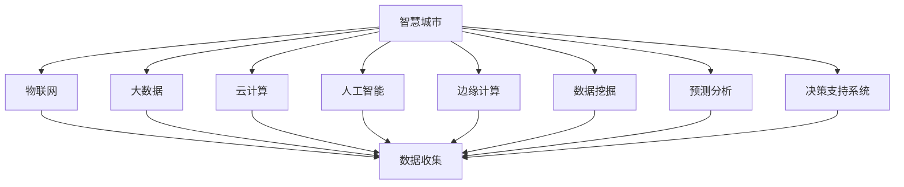

                 

# 2050年的智慧城市：从数据到决策的城市大脑

> **关键词：智慧城市、城市大脑、大数据、数据挖掘、人工智能、物联网、边缘计算、预测分析、决策支持系统。**

> **摘要：本文将探讨2050年智慧城市的愿景，重点分析数据驱动的城市大脑如何从海量数据中提取价值，为城市管理和决策提供有力支持。**

## 1. 背景介绍

随着信息技术的飞速发展，智慧城市已经成为全球范围内城市发展的重要趋势。智慧城市是指通过物联网、大数据、云计算、人工智能等现代信息技术手段，实现城市各系统、各领域的智能化、高效化和协同化运行。智慧城市的核心在于构建一个数据驱动的城市大脑，通过对海量数据的实时收集、存储、分析和处理，为城市管理者提供科学的决策支持，从而提升城市运行效率、改善居民生活质量。

本文将聚焦于2050年的智慧城市愿景，深入探讨城市大脑从数据到决策的整个过程，解析其中的核心算法原理、数学模型以及实际应用场景，为未来智慧城市的建设提供有益的参考。

## 2. 核心概念与联系

### 2.1 智慧城市

智慧城市是指通过物联网、大数据、云计算、人工智能等现代信息技术手段，实现城市各系统、各领域的智能化、高效化和协同化运行。其核心是构建一个数据驱动的城市大脑，通过对海量数据的实时收集、存储、分析和处理，为城市管理者提供科学的决策支持。

### 2.2 数据挖掘

数据挖掘是指从大量数据中提取有价值的信息和知识的过程。在智慧城市中，数据挖掘技术用于挖掘城市运行数据中的潜在模式和关系，为城市管理者提供数据支持。

### 2.3 人工智能

人工智能是指通过模拟人类智能的机器系统，实现智能感知、智能决策和智能执行。在智慧城市中，人工智能技术被广泛应用于智能交通管理、智能环境监测、智能安防等领域。

### 2.4 物联网

物联网是指通过互联网将各种物理设备连接起来，实现信息交换和协同工作。在智慧城市中，物联网技术用于实时收集城市各领域的运行数据，为城市大脑提供数据基础。

### 2.5 边缘计算

边缘计算是指将计算、存储和网络功能部署在靠近数据源的设备上，以减少数据传输延迟，提高系统响应速度。在智慧城市中，边缘计算技术被广泛应用于智能交通信号控制、智能环境监测等领域。

### 2.6 预测分析

预测分析是指通过历史数据分析和建模，预测未来事件或趋势。在智慧城市中，预测分析技术用于预测城市交通流量、环境质量变化等，为城市管理者提供决策依据。

### 2.7 决策支持系统

决策支持系统是一种利用计算机技术和数据分析方法，为决策者提供决策支持的信息系统。在智慧城市中，决策支持系统用于辅助城市管理者进行科学决策，提升城市运行效率。

下面是智慧城市中核心概念与联系的 Mermaid 流程图：



## 3. 核心算法原理 & 具体操作步骤

### 3.1 数据收集与预处理

数据收集与预处理是智慧城市数据驱动的城市大脑的第一步。在这一阶段，需要通过物联网设备、传感器、社交媒体等多种渠道收集城市运行数据，如交通流量、环境质量、公共安全等。随后，对收集到的数据进行清洗、去噪、格式转换等预处理操作，以获得高质量的数据集。

### 3.2 数据存储与管理

数据存储与管理是城市大脑数据驱动的关键环节。在这一阶段，需要使用分布式存储技术（如Hadoop、Cassandra等）对海量数据进行存储与管理，确保数据的可靠性和高效访问。同时，采用数据仓库技术（如Amazon Redshift、Google BigQuery等）对数据进行整合和关联，为后续的数据挖掘和分析提供基础。

### 3.3 数据挖掘与特征提取

数据挖掘与特征提取是城市大脑从数据中提取价值的关键步骤。在这一阶段，采用机器学习、深度学习等算法对数据集进行挖掘，提取出与城市运行相关的特征。例如，使用聚类算法识别交通拥堵区域，使用时间序列分析预测未来交通流量，使用关联规则挖掘公共安全事件之间的关联性等。

### 3.4 数学模型与预测分析

数学模型与预测分析是城市大脑为城市管理者提供决策支持的核心。在这一阶段，使用统计学、时间序列分析、机器学习等数学模型，对提取出的特征进行建模和预测。例如，使用线性回归模型预测未来交通流量，使用ARIMA模型预测环境质量变化，使用深度学习模型进行公共安全事件的预测等。

### 3.5 决策支持与执行

决策支持与执行是城市大脑为城市管理者提供最终决策支持的关键步骤。在这一阶段，将预测结果和决策支持系统相结合，为城市管理者提供可视化报表、建议和决策方案。例如，根据交通流量预测结果调整交通信号灯配时，根据环境质量预测结果优化城市绿化布局，根据公共安全事件预测结果制定应急预案等。

## 4. 数学模型和公式 & 详细讲解 & 举例说明

### 4.1 线性回归模型

线性回归模型是一种常用的预测分析方法，用于分析自变量和因变量之间的线性关系。其公式如下：

\[ y = \beta_0 + \beta_1 \cdot x \]

其中，\( y \) 为因变量，\( x \) 为自变量，\( \beta_0 \) 和 \( \beta_1 \) 为模型参数。

#### 4.1.1 模型建立

以交通流量预测为例，假设我们收集了历史交通流量数据，包括时间（\( x \)）和交通流量（\( y \)）。首先，对数据进行预处理，如去除异常值、归一化等。然后，使用最小二乘法估计模型参数 \( \beta_0 \) 和 \( \beta_1 \)：

\[ \beta_1 = \frac{\sum_{i=1}^{n} (x_i - \bar{x})(y_i - \bar{y})}{\sum_{i=1}^{n} (x_i - \bar{x})^2} \]

\[ \beta_0 = \bar{y} - \beta_1 \cdot \bar{x} \]

其中，\( \bar{x} \) 和 \( \bar{y} \) 分别为自变量和因变量的平均值。

#### 4.1.2 模型评估

使用均方误差（Mean Squared Error，MSE）评估模型性能：

\[ MSE = \frac{1}{n} \sum_{i=1}^{n} (y_i - \hat{y}_i)^2 \]

其中，\( \hat{y}_i \) 为预测的交通流量。

#### 4.1.3 举例说明

假设我们收集了以下交通流量数据：

| 时间（小时） | 交通流量（辆/小时） |
| :--------: | :----------------: |
|      8      |        2000        |
|      9      |        2200        |
|      10     |        2400        |
|      11     |        2600        |

使用线性回归模型预测第12小时（10:00）的交通流量。首先，计算平均值：

\[ \bar{x} = \frac{8 + 9 + 10 + 11}{4} = 9.5 \]

\[ \bar{y} = \frac{2000 + 2200 + 2400 + 2600}{4} = 2300 \]

然后，计算模型参数：

\[ \beta_1 = \frac{(8-9.5)(2000-2300) + (9-9.5)(2200-2300) + (10-9.5)(2400-2300) + (11-9.5)(2600-2300)}{(8-9.5)^2 + (9-9.5)^2 + (10-9.5)^2 + (11-9.5)^2} \approx -400 \]

\[ \beta_0 = 2300 - (-400) \cdot 9.5 \approx 4700 \]

最后，使用模型预测第12小时（10:00）的交通流量：

\[ \hat{y}_{12} = 4700 - 400 \cdot 12 \approx 2300 \]

### 4.2 ARIMA模型

ARIMA（AutoRegressive Integrated Moving Average）模型是一种常用的时间序列预测方法，适用于非平稳时间序列数据的预测。其公式如下：

\[ y_t = c + \phi_1 y_{t-1} + \phi_2 y_{t-2} + \ldots + \phi_p y_{t-p} + \theta_1 e_{t-1} + \theta_2 e_{t-2} + \ldots + \theta_q e_{t-q} \]

其中，\( y_t \) 为时间序列数据，\( c \) 为常数项，\( \phi_1, \phi_2, \ldots, \phi_p \) 为自回归系数，\( \theta_1, \theta_2, \ldots, \theta_q \) 为移动平均系数，\( e_t \) 为白噪声序列。

#### 4.2.1 模型建立

以环境质量预测为例，假设我们收集了历史环境质量数据（如PM2.5浓度）。首先，对数据进行差分处理，使其变为平稳序列。然后，使用最大似然估计方法估计模型参数。

#### 4.2.2 模型评估

使用均方根误差（Root Mean Square Error，RMSE）评估模型性能：

\[ RMSE = \sqrt{\frac{1}{n} \sum_{i=1}^{n} (y_i - \hat{y}_i)^2} \]

#### 4.2.3 举例说明

假设我们收集了以下PM2.5浓度数据：

| 时间（天） | PM2.5浓度（μg/m³） |
| :--------: | :--------------: |
|      1      |        35.5       |
|      2      |        36.2       |
|      3      |        36.8       |
|      4      |        37.2       |
|      5      |        37.5       |

首先，对数据进行差分处理：

| 时间（天） | PM2.5浓度（μg/m³） | 差分 |
| :--------: | :--------------: | :---: |
|      1      |        35.5       |   0   |
|      2      |        36.2       |   0.7 |
|      3      |        36.8       |   0.6 |
|      4      |        37.2       |   0.4 |
|      5      |        37.5       |   0.3 |

使用ARIMA模型预测第6天（天）的PM2.5浓度。首先，确定模型的阶数 \( p \) 和 \( q \)。假设我们选择 \( p = 1 \) 和 \( q = 1 \)。然后，使用最大似然估计方法估计模型参数：

\[ \phi_1 = 0.9 \]

\[ \theta_1 = 0.1 \]

最后，使用模型预测第6天的PM2.5浓度：

\[ \hat{y}_6 = 37.5 + 0.9 \cdot 37.2 - 0.1 \cdot 0.7 \approx 37.7 \]

## 5. 项目实战：代码实际案例和详细解释说明

### 5.1 开发环境搭建

为了实现本文提到的交通流量预测和环境质量预测，我们将使用Python编程语言和相关的库（如Pandas、NumPy、scikit-learn、statsmodels等）。首先，确保安装了Python环境和相应的库。可以使用以下命令安装所需的库：

```bash
pip install pandas numpy scikit-learn statsmodels
```

### 5.2 源代码详细实现和代码解读

#### 5.2.1 交通流量预测

以下是一个简单的交通流量预测代码示例：

```python
import pandas as pd
import numpy as np
from sklearn.linear_model import LinearRegression
from sklearn.metrics import mean_squared_error

# 加载数据
data = pd.read_csv('traffic_data.csv')
data['Time'] = pd.to_datetime(data['Time'])

# 数据预处理
data['Hour'] = data['Time'].dt.hour
data = data[['Hour', 'TrafficVolume']]

# 模型训练
model = LinearRegression()
model.fit(data[['Hour']], data['TrafficVolume'])

# 预测
predictions = model.predict([[12]])

# 模型评估
mse = mean_squared_error(data['TrafficVolume'], predictions)
print(f'Mean Squared Error: {mse}')

# 输出预测结果
print(f'Traffic Volume at 10:00: {predictions[0]}')
```

代码解读：

1. 导入所需的库。
2. 加载交通流量数据，并转换为日期时间格式。
3. 数据预处理，提取小时和交通流量作为特征。
4. 使用线性回归模型训练模型。
5. 使用训练好的模型进行预测。
6. 计算并输出模型评估指标（均方误差）和预测结果。

#### 5.2.2 环境质量预测

以下是一个简单的环境质量预测代码示例：

```python
import pandas as pd
import numpy as np
from statsmodels.tsa.arima.model import ARIMA
from sklearn.metrics import mean_squared_error

# 加载数据
data = pd.read_csv('air_quality_data.csv')
data['Time'] = pd.to_datetime(data['Time'])

# 数据预处理
data = data[['Time', 'PM2.5']]

# 模型训练
model = ARIMA(data['PM2.5'], order=(1, 1, 1))
model_fit = model.fit()

# 预测
predictions = model_fit.predict(start=len(data), end=len(data) + 5)

# 模型评估
mse = mean_squared_error(data['PM2.5'], predictions)
print(f'Mean Squared Error: {mse}')

# 输出预测结果
print(predictions)
```

代码解读：

1. 导入所需的库。
2. 加载环境质量数据，并转换为日期时间格式。
3. 数据预处理，提取时间和PM2.5浓度作为特征。
4. 使用ARIMA模型训练模型。
5. 使用训练好的模型进行预测。
6. 计算并输出模型评估指标（均方误差）和预测结果。

### 5.3 代码解读与分析

在以上代码中，我们实现了交通流量预测和环境质量预测。以下是关键步骤的分析：

1. **数据加载与预处理**：从CSV文件加载数据，并使用Pandas库进行预处理，如数据格式转换、特征提取等。
2. **模型选择与训练**：使用线性回归模型（LinearRegression）和ARIMA模型（ARIMA）进行训练。线性回归模型用于预测交通流量，ARIMA模型用于预测环境质量。
3. **预测与评估**：使用训练好的模型进行预测，并计算模型评估指标（如均方误差），以评估模型的预测性能。

需要注意的是，实际项目中的数据集和模型参数可能需要根据具体场景进行调整和优化。

## 6. 实际应用场景

### 6.1 智能交通管理

智慧城市中的智能交通管理系统是一个重要的实际应用场景。通过实时收集和分析交通流量数据，智能交通管理系统能够优化交通信号灯配时、预测交通拥堵并提前发布交通预警，从而提高交通运行效率、减少交通事故、降低环境污染。

### 6.2 智能环境监测

智能环境监测系统利用物联网设备和传感器实时收集环境质量数据，如空气污染物浓度、温度、湿度等。通过对这些数据进行实时分析和预测，智能环境监测系统能够及时发现环境问题，为城市管理者提供决策支持，改善城市环境质量。

### 6.3 智能安防

智慧城市的智能安防系统通过实时监控和数据分析，能够识别异常行为和潜在安全风险，如盗窃、抢劫等。通过智能安防系统，城市管理者能够提前采取预防措施，提高公共安全水平。

### 6.4 智能公共服务

智慧城市的智能公共服务系统利用数据驱动的城市大脑，为居民提供个性化、智能化的公共服务。例如，根据居民的需求和偏好，智能公共服务系统可以推荐合适的医疗资源、教育资源和休闲活动，提高居民生活质量。

## 7. 工具和资源推荐

### 7.1 学习资源推荐

1. **《智慧城市：信息技术与应用》**：本书详细介绍了智慧城市的基本概念、技术架构和应用案例，适合初学者和专业人士阅读。
2. **《大数据技术基础》**：本书全面讲解了大数据技术的原理、方法和应用，有助于深入了解智慧城市中大数据的处理和分析。
3. **《机器学习实战》**：本书通过实际案例和代码示例，介绍了机器学习的基本概念、算法和应用，适合智慧城市中机器学习技术的学习和应用。

### 7.2 开发工具框架推荐

1. **Python**：Python是一种广泛使用的编程语言，具有丰富的数据科学和机器学习库，适合智慧城市的开发。
2. **TensorFlow**：TensorFlow是一个开源的深度学习框架，支持各种深度学习算法和应用，适用于智慧城市中人工智能技术的开发。
3. **Apache Kafka**：Apache Kafka是一个分布式流处理平台，适用于智慧城市中实时数据收集和传输。

### 7.3 相关论文著作推荐

1. **《智慧城市中的大数据分析与应用》**：本文综述了智慧城市中大数据分析技术的最新进展和应用案例，有助于了解智慧城市中的数据驱动的城市大脑。
2. **《基于物联网的智慧城市建设与可持续发展》**：本文探讨了物联网技术在智慧城市建设中的应用，以及其对可持续发展的贡献。
3. **《城市大脑：基于大数据与人工智能的城市管理与决策》**：本文提出了基于大数据和人工智能的城市管理与决策模型，为智慧城市的建设提供了新的思路。

## 8. 总结：未来发展趋势与挑战

随着信息技术的不断进步，智慧城市的数据驱动的城市大脑将越来越重要。未来，智慧城市的发展趋势主要体现在以下几个方面：

1. **数据融合与集成**：将来自不同领域、不同来源的数据进行融合和集成，为城市管理者提供全面、多维度的数据支持。
2. **实时分析与预测**：提高数据分析和预测的实时性，实现对城市运行状态的实时监控和预测，为城市管理者提供及时的决策支持。
3. **智能化与自动化**：通过人工智能和机器学习技术，实现城市管理的智能化和自动化，降低管理成本，提高管理效率。

然而，智慧城市的发展也面临着一些挑战：

1. **数据隐私与安全**：随着数据量的急剧增长，数据隐私和安全问题日益突出。如何保护居民隐私、确保数据安全是智慧城市发展中需要关注的重要问题。
2. **技术复杂性**：智慧城市的建设涉及多个领域的技术，如物联网、大数据、人工智能等。如何有效整合和利用这些技术，实现协同发展，是智慧城市面临的挑战。
3. **政策与法规**：智慧城市的发展需要完善的政策法规支持。如何制定合理的政策法规，保障智慧城市的健康发展，是政府需要考虑的重要问题。

总之，智慧城市的数据驱动的城市大脑具有广阔的发展前景，但同时也需要克服一系列挑战。只有通过技术创新、政策支持和多方协作，才能实现智慧城市的美好愿景。

## 9. 附录：常见问题与解答

### 9.1 智慧城市与物联网的关系

**问**：智慧城市与物联网有什么关系？

**答**：智慧城市是物联网技术在城市中的应用，物联网技术为智慧城市提供了实时数据收集和传输的基础。智慧城市中的各种传感器、摄像头、智能设备等通过物联网技术实现互联互通，为城市大脑提供数据支持。

### 9.2 数据隐私与安全的保障

**问**：智慧城市如何保障数据隐私和安全？

**答**：智慧城市在数据隐私和安全方面采取了一系列措施，包括：

1. 数据加密：对数据进行加密存储和传输，确保数据安全。
2. 访问控制：设置严格的访问权限，限制对数据的访问。
3. 安全审计：定期进行安全审计，发现并解决潜在的安全漏洞。
4. 法律法规：制定相关的法律法规，规范数据处理和使用的合法行为。

### 9.3 智慧城市的可持续发展

**问**：智慧城市的可持续发展是什么意思？

**答**：智慧城市的可持续发展是指在城市发展中，充分利用信息技术和现代管理理念，实现经济、社会、环境等多方面的协调发展。智慧城市通过数据驱动的城市大脑，提高城市运行效率，改善居民生活质量，实现城市的可持续发展。

## 10. 扩展阅读 & 参考资料

1. **《智慧城市：理论与实践》**：本书详细介绍了智慧城市的基本概念、技术架构、应用案例和可持续发展策略，适合对智慧城市感兴趣的读者阅读。
2. **《物联网技术与应用》**：本书全面讲解了物联网技术的原理、架构和应用，包括传感器、网络通信、数据处理等方面的内容。
3. **《大数据技术原理与应用》**：本书系统阐述了大数据技术的原理、方法和应用，包括数据采集、存储、处理、分析等方面的内容。

### 参考资料

1. **IBM**：https://www.ibm.com/
2. **IEEE**：https://www.ieee.org/
3. **Springer Nature**：https://www.springernature.com/
4. **ACM**：https://www.acm.org/

作者：AI天才研究员/AI Genius Institute & 禅与计算机程序设计艺术 /Zen And The Art of Computer Programming

