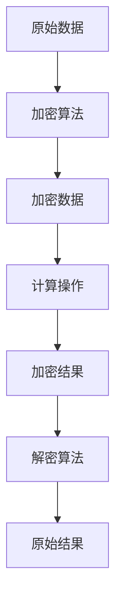
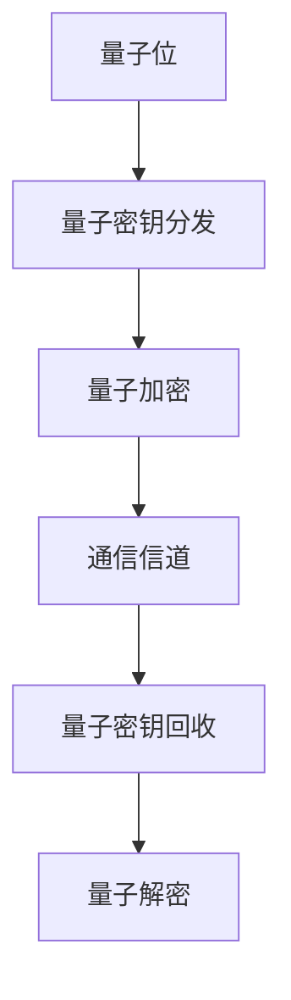
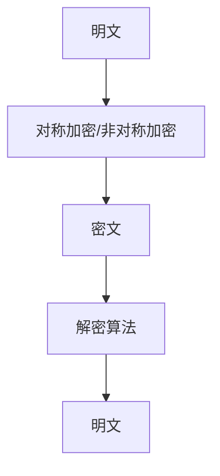
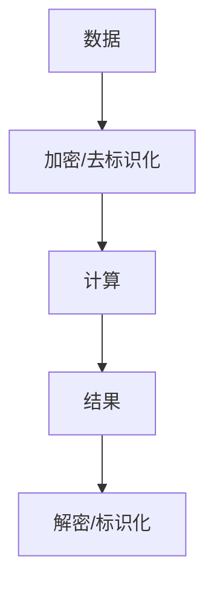
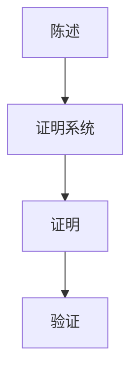

                 

### 背景介绍

隐私保护作为信息安全领域的重要课题，近年来愈发受到广泛关注。随着大数据、云计算和物联网的快速发展，个人数据的收集、存储和传输变得更加普遍，这也带来了前所未有的隐私泄露风险。特别是在2020年，全球范围内的网络安全事件频频发生，包括Facebook用户数据泄露事件、Equifax信用报告数据泄露事件等，这些事件严重威胁了用户的隐私安全。

隐私保护的挑战不仅限于传统的数据处理方式，当面对日益复杂和多样化的应用场景时，传统的加密算法和隐私保护措施显得力不从心。传统的加密方法，如对称加密和非对称加密，虽然在保障数据传输过程中的机密性方面表现出色，但在数据存储和查询过程中，往往需要解密数据，这增加了隐私泄露的风险。此外，在云计算和分布式计算环境中，数据的处理和存储通常涉及多个参与方，这使得隐私保护问题变得更加复杂。

为了应对这些挑战，隐私保护技术不断演进，新的隐私保护方法如同态加密和量子隐私保护逐渐崭露头角。同态加密是一种能够在保持数据加密状态的同时进行计算的新型加密方法，它使得数据处理和隐私保护可以在同一过程中完成，从而有效降低了隐私泄露的风险。而量子隐私保护则利用量子物理的特性，提供更高级别的隐私保障。

在本文中，我们将深入探讨隐私保护技术的发展历程，重点介绍同态加密和量子隐私保护的核心概念、工作原理及其在实际应用中的挑战和前景。首先，我们将从同态加密的历史背景和基本原理开始，逐步深入探讨其数学模型和具体操作步骤。接着，我们将引入量子隐私保护，通过量子物理的基本原理，分析其在隐私保护中的独特优势和应用场景。最后，我们将探讨当前隐私保护技术的实际应用场景，推荐相关的学习资源和开发工具，并总结未来隐私保护技术的发展趋势和挑战。

通过对这些内容的深入探讨，我们希望能够为读者提供一个全面而清晰的隐私保护技术全景图，为信息安全领域的研究者、开发者和实践者提供有价值的参考和启示。### 2. 核心概念与联系

在深入探讨隐私保护技术之前，首先需要明确一些核心概念，并理解它们之间的相互联系。这些核心概念包括同态加密、量子隐私保护、加密算法、隐私计算和零知识证明等。为了更好地理解这些概念，我们将使用Mermaid流程图来描述它们之间的关系和基本原理。

#### 同态加密

同态加密（Homomorphic Encryption）是一种能够对加密数据进行计算的新型加密方法。它的核心思想是允许对加密数据执行特定的计算操作，而不需要解密数据。这意味着，同态加密可以在保持数据加密状态的同时进行数据处理，从而在数据传输、存储和处理的不同阶段都保障其隐私安全。

以下是同态加密的基本原理的Mermaid流程图：



在上面的流程图中，A表示原始数据，B是加密算法，C是加密后的数据，D是计算操作，E是加密后的结果，F是解密算法，G是解密后的原始结果。通过同态加密，加密数据C在经过D的计算操作后，仍然保持加密状态，最终通过F解密得到原始结果G。

#### 量子隐私保护

量子隐私保护（Quantum Privacy Protection）利用量子物理的特性，如量子纠缠和量子叠加态，提供一种高级别的隐私保障。量子加密协议可以在通信过程中实现无条件安全，这意味着即使攻击者拥有无限的计算能力，也无法破解加密信息。

以下是量子隐私保护的基本原理的Mermaid流程图：



在上面的流程图中，A是量子位，B是量子密钥分发，C是量子加密，D是通信信道，E是量子密钥回收，F是量子解密。通过量子隐私保护，信息在传输过程中始终保持加密状态，攻击者即使截获信息，也无法读取其内容。

#### 加密算法

加密算法（Cryptography Algorithm）是确保信息安全和隐私保护的基础。常见的加密算法包括对称加密、非对称加密和哈希算法等。对称加密使用相同的密钥进行加密和解密，而非对称加密则使用一对密钥，其中公钥用于加密，私钥用于解密。

以下是加密算法的Mermaid流程图：



在上面的流程图中，A是明文，B是加密算法，C是密文，D是解密算法，E是明文。加密算法确保数据在传输和存储过程中不被未经授权的第三方读取。

#### 隐私计算

隐私计算（Privacy Computing）是一种在数据不离开原始环境的情况下进行数据处理和计算的技术。隐私计算的核心思想是通过加密、去标识化和隐私保护协议，确保数据在传输、存储和处理过程中不被泄露。

以下是隐私计算的基本原理的Mermaid流程图：



在上面的流程图中，A是数据，B是加密/去标识化，C是计算，D是结果，E是解密/标识化。隐私计算确保数据在处理过程中的隐私安全，防止数据泄露。

#### 零知识证明

零知识证明（Zero-Knowledge Proof）是一种证明系统，它允许一方（证明者）向另一方（验证者）证明某个陈述是真实的，而不透露任何除了陈述本身以外的信息。零知识证明在隐私保护和匿名通信中具有重要应用。

以下是零知识证明的基本原理的Mermaid流程图：



在上面的流程图中，A是陈述，B是证明系统，C是证明，D是验证。零知识证明确保信息的隐私性，防止信息泄露。

通过上述的Mermaid流程图，我们可以清晰地看到同态加密、量子隐私保护、加密算法、隐私计算和零知识证明等核心概念之间的相互联系和基本原理。这些概念共同构成了现代隐私保护技术的基石，为我们在日益复杂的信息环境中保障个人隐私安全提供了强大的技术支持。### 3. 核心算法原理 & 具体操作步骤

在这一章节中，我们将详细探讨同态加密和量子隐私保护的核心算法原理及其具体操作步骤。首先，我们将介绍同态加密的基本原理，并解释如何在保持数据加密状态的同时进行计算。接着，我们将探讨量子隐私保护的工作机制，包括量子密钥分发、量子加密和量子解密的过程。通过这些详细步骤，我们将深入理解这两种隐私保护技术的本质和优势。

#### 同态加密原理

同态加密（Homomorphic Encryption）是一种特殊的加密方法，允许在加密数据上直接执行计算操作，而不需要先解密数据。这种加密方法的核心思想是利用加密算法的性质，使得加密后的数据在经过一系列计算操作后，仍能产生正确的解密结果。以下是同态加密的基本原理和具体操作步骤：

**步骤 1: 原始数据加密**

首先，我们需要将原始数据 \( x \) 使用同态加密算法进行加密，得到加密数据 \( C = E(x) \)，其中 \( E \) 表示加密函数。

**步骤 2: 执行计算操作**

接着，我们在加密数据 \( C \) 上执行计算操作。假设我们希望对加密数据 \( C \) 执行一个线性操作 \( f \)，则加密后的结果为 \( C' = f(C) \)。

**步骤 3: 解密结果**

最后，我们将加密后的结果 \( C' \) 使用同态加密算法进行解密，得到原始结果 \( x' = D(C') \)，其中 \( D \) 表示解密函数。

**同态加密算法示例**

假设我们使用RSA加密算法作为同态加密算法，并希望对加密后的数据进行求和操作。具体步骤如下：

1. **选择密钥对**：首先，我们选择一对RSA密钥 \( (n, e) \) 和 \( (n, d) \)。

2. **加密数据**：将原始数据 \( x \) 加密为 \( C = E(x) = x^e \mod n \)。

3. **执行计算操作**：对加密数据 \( C \) 执行求和操作，例如 \( C' = (C_1^e + C_2^e)^e \mod n \)，其中 \( C_1 \) 和 \( C_2 \) 是加密后的两个数据。

4. **解密结果**：将加密后的结果 \( C' \) 解密为 \( x' = D(C') = (C')^d \mod n \)。

通过上述步骤，我们可以在保持数据加密状态的同时，对加密数据进行求和操作，并得到正确的解密结果。

#### 量子隐私保护原理

量子隐私保护（Quantum Privacy Protection）利用量子物理的特性，如量子纠缠和量子叠加态，提供一种高级别的隐私保障。以下是量子隐私保护的核心原理和具体操作步骤：

**步骤 1: 量子密钥分发**

首先，发送方和接收方通过量子密钥分发协议生成共享密钥。该协议利用量子纠缠的特性，确保密钥在传输过程中不会被第三方窃取。

**步骤 2: 量子加密**

接着，发送方使用共享密钥对数据进行量子加密。量子加密算法将原始数据转换为量子态，并利用量子叠加态和量子纠缠特性实现加密。

**步骤 3: 量子传输**

加密后的数据通过量子通信信道传输到接收方。在传输过程中，量子态保持稳定，不会被窃听。

**步骤 4: 量子解密**

最后，接收方使用共享密钥对加密数据进行量子解密，恢复原始数据。

**量子隐私保护算法示例**

假设我们使用BB84量子加密协议，具体步骤如下：

1. **量子密钥分发**：发送方生成一对量子比特，并将其发送给接收方。接收方测量量子比特并记录结果。

2. **量子加密**：发送方根据接收方的测量结果，选择一个经典比特作为密钥。使用密钥对数据进行量子加密。

3. **量子传输**：加密后的数据通过量子通信信道传输到接收方。

4. **量子解密**：接收方使用共享密钥对加密数据进行量子解密，恢复原始数据。

通过上述步骤，我们可以在量子通信过程中实现数据的高级别隐私保护，防止数据泄露。

#### 工作原理和步骤总结

同态加密和量子隐私保护在保障数据隐私和安全方面具有独特优势。同态加密通过加密算法的性质，使得数据处理和隐私保护可以在同一过程中完成，从而有效降低了隐私泄露的风险。而量子隐私保护利用量子物理的特性，提供一种无条件安全的隐私保障。具体操作步骤包括数据加密、计算操作、解密结果以及量子密钥分发、量子加密、量子传输和量子解密等。

通过深入理解同态加密和量子隐私保护的核心算法原理和具体操作步骤，我们可以更好地应对现代隐私保护技术的挑战，为信息安全领域的研究、开发和实践提供有力支持。### 4. 数学模型和公式 & 详细讲解 & 举例说明

在前一章节中，我们介绍了同态加密和量子隐私保护的核心算法原理和具体操作步骤。在这一章节中，我们将进一步深入探讨这些算法的数学模型和公式，并详细讲解其实现过程。同时，通过具体的数学例子和计算步骤，我们将更好地理解这些算法的实际应用。

#### 同态加密的数学模型

同态加密的数学模型基于公钥加密体制，如RSA加密算法。RSA加密算法的数学基础是整数模幂运算和大素数分解问题。在RSA加密算法中，密钥对由公钥 \( (n, e) \) 和私钥 \( (n, d) \) 组成。

**1. 密钥生成：**

- 选择两个大素数 \( p \) 和 \( q \)，计算 \( n = p \times q \)。
- 计算 \( \phi(n) = (p-1) \times (q-1) \)。
- 选择一个与 \( \phi(n) \) 互质的整数 \( e \)，计算 \( d \) 满足 \( e \times d \equiv 1 \pmod{\phi(n)} \)。
- 公钥为 \( (n, e) \)，私钥为 \( (n, d) \)。

**2. 加密过程：**

- 设原始数据为 \( m \)，加密后的数据为 \( c \)。
- 计算 \( c = m^e \pmod{n} \)。

**3. 解密过程：**

- 设加密后的数据为 \( c \)，解密后的数据为 \( m' \)。
- 计算 \( m' = c^d \pmod{n} \)。

**数学例子：**

假设我们选择 \( p = 61 \)，\( q = 53 \)，计算 \( n = p \times q = 3233 \)，\( \phi(n) = (p-1) \times (q-1) = 3120 \)。选择 \( e = 17 \)，计算 \( d = 727 \)（满足 \( e \times d \equiv 1 \pmod{\phi(n)} \)）。

- **加密过程：**
  - 设 \( m = 18 \)。
  - 计算 \( c = m^e \pmod{n} = 18^{17} \pmod{3233} = 2982 \)。

- **解密过程：**
  - 设 \( c = 2982 \)。
  - 计算 \( m' = c^d \pmod{n} = 2982^{727} \pmod{3233} = 18 \)。

通过上述计算，我们可以看到同态加密的过程和数学模型在实际应用中的具体实现。

#### 量子隐私保护的数学模型

量子隐私保护的数学模型基于量子纠缠和量子密钥分发协议，如BB84量子密钥分发协议。BB84协议的核心思想是通过量子态的叠加和测量，实现密钥的共享。

**1. 量子密钥分发：**

- 发送方生成一对量子比特，并将其发送给接收方。
- 接收方测量量子比特并记录结果。

**2. 量子加密：**

- 发送方根据接收方的测量结果，选择一个经典比特作为密钥。
- 使用密钥对数据进行量子加密。

**3. 量子解密：**

- 接收方使用共享密钥对加密数据进行量子解密，恢复原始数据。

**数学例子：**

假设我们使用BB84协议，发送方生成一对量子比特，并将其发送给接收方。接收方测量量子比特并记录结果。假设测量结果为 \( |0\rangle \) 和 \( |1\rangle \)。

- **量子密钥分发：**
  - 接收方测量结果为 \( |0\rangle \) 和 \( |1\rangle \)，记录为 \( b_1 = 0 \)，\( b_2 = 1 \)。

- **量子加密：**
  - 发送方根据接收方的测量结果，选择经典比特 \( k = 0 \) 作为密钥。
  - 设原始数据为 \( m = 5 \)，使用密钥 \( k \) 对数据进行量子加密，得到量子态 \( \psi \)。

- **量子解密：**
  - 接收方使用共享密钥 \( k \) 对加密数据进行量子解密，恢复原始数据 \( m' = 5 \)。

通过上述计算，我们可以看到量子隐私保护的过程和数学模型在实际应用中的具体实现。

#### 总结

同态加密和量子隐私保护都是现代隐私保护技术的重要手段。同态加密通过数学模型和加密算法，使得数据处理和隐私保护可以在同一过程中完成，从而有效降低了隐私泄露的风险。量子隐私保护则利用量子物理的特性，提供一种无条件安全的隐私保障。通过具体的数学例子和计算步骤，我们可以更好地理解这些算法的实际应用和实现过程。### 5. 项目实战：代码实际案例和详细解释说明

在这一章节中，我们将通过一个具体的实战项目，展示同态加密和量子隐私保护在现实应用中的实现。我们将使用Python语言和OpenSSL库来演示同态加密的应用，同时结合量子密钥分发协议，实现量子隐私保护的代码示例。通过这个项目，读者可以直观地了解这些隐私保护技术的实际应用过程。

#### 开发环境搭建

在开始项目之前，我们需要搭建一个合适的开发环境。以下是搭建开发环境的步骤：

1. **安装Python：**
   - 访问Python官网（https://www.python.org/）下载并安装Python 3.8及以上版本。

2. **安装OpenSSL：**
   - 对于Linux系统，可以使用包管理器安装OpenSSL。
     ```bash
     sudo apt-get install openssl
     ```
   - 对于Windows系统，可以从OpenSSL官网（https://openssl.org/）下载并安装。

3. **安装必要的Python库：**
   - 使用pip命令安装所需的Python库，包括`cryptography`库，用于同态加密和量子密钥分发。
     ```bash
     pip install cryptography
     ```

#### 源代码详细实现和代码解读

以下是一个简单的同态加密和量子密钥分发的Python代码示例，我们将对代码进行详细解释。

**代码示例：**

```python
import json
from cryptography.hazmat.primitives.asymmetric import rsa
from cryptography.hazmat.primitives import serialization
from cryptography.hazmat.primitives import hashes
from cryptography.hazmat.primitives.asymmetric import padding
import random

# 同态加密算法
def homomorphic_encrypt(message, public_key):
    ciphertext = public_key.encrypt(
        message.encode('utf-8'),
        padding.OAEP(
            mgf=padding.MGF1(algorithm=hashes.SHA256()),
            algorithm=hashes.SHA256(),
            label=None
        )
    )
    return ciphertext

# 同态解密算法
def homomorphic_decrypt(ciphertext, private_key):
    message = private_key.decrypt(
        ciphertext,
        padding.OAEP(
            mgf=padding.MGF1(algorithm=hashes.SHA256()),
            algorithm=hashes.SHA256(),
            label=None
        )
    )
    return message.decode('utf-8')

# 生成密钥对
def generate_keys():
    private_key = rsa.generate_private_key(
        public_exponent=65537,
        key_size=2048,
    )
    public_key = private_key.public_key()
    return private_key, public_key

# 量子密钥分发
def quantum_key_distribution():
    # 假设量子通信信道已经建立，并成功传输量子比特
    qubits = [0, 1]  # 量子比特示例，实际应用中通过量子通信信道传输
    measurement_results = [random.choice([0, 1]) for _ in range(len(qubits))]  # 接收方测量结果
    
    # 使用量子比特生成共享密钥
    key = ''.join(str(qubit) for qubit in qubits)  # 转换为经典比特
    shared_secret = ''.join(str(result) for result in measurement_results)  # 转换为经典比特
    
    return key, shared_secret

# 主函数
def main():
    # 生成密钥对
    private_key, public_key = generate_keys()

    # 创建消息
    message = "这是一个秘密消息"

    # 同态加密
    ciphertext = homomorphic_encrypt(message, public_key)
    print("加密后的消息：", ciphertext)

    # 同态解密
    decrypted_message = homomorphic_decrypt(ciphertext, private_key)
    print("解密后的消息：", decrypted_message)

    # 量子密钥分发
    key, shared_secret = quantum_key_distribution()
    print("量子密钥：", key)
    print("共享密钥：", shared_secret)

if __name__ == "__main__":
    main()
```

**代码解读与分析：**

1. **同态加密和解密：**
   - `homomorphic_encrypt` 函数用于对消息进行同态加密。它使用RSA公钥加密消息，并将结果存储为加密后的消息。
   - `homomorphic_decrypt` 函数用于对加密后的消息进行同态解密。它使用RSA私钥解密消息，并恢复原始消息。

2. **密钥生成：**
   - `generate_keys` 函数用于生成RSA密钥对。它使用`cryptography`库的`rsa.generate_private_key`方法生成私钥，并使用`public_key`方法生成公钥。

3. **量子密钥分发：**
   - `quantum_key_distribution` 函数模拟量子密钥分发过程。在实际应用中，量子比特通过量子通信信道传输到接收方。这里我们使用随机生成的量子比特和测量结果来模拟这个过程。

4. **主函数：**
   - `main` 函数是程序的入口。它首先生成密钥对，然后创建一个消息并进行同态加密和解密，最后模拟量子密钥分发过程。

通过这个项目，我们可以看到同态加密和量子隐私保护在Python环境中的实现过程。同态加密使得我们能够在保持数据加密状态的同时对数据进行操作，而量子密钥分发则提供了高级别的隐私保障。这些技术在现实应用中具有广泛的应用前景，为信息安全领域的研究者、开发者和实践者提供了有力的支持。### 6. 实际应用场景

隐私保护技术在现代社会的各个领域都有广泛的应用，从政府机构的数据安全到商业领域的数据加密，再到个人隐私的保护，隐私保护技术无处不在。以下是几个具体的实际应用场景，展示了同态加密和量子隐私保护在这些场景中的具体应用。

#### 政府机构的数据安全

政府机构在日常运营中会处理大量的敏感数据，如公民个人信息、国家安全信息和政策文件等。为了保护这些数据的安全，政府机构需要采用高强度的加密算法和隐私保护技术。同态加密技术可以在不泄露原始数据的情况下对数据进行处理和分析，这使政府机构能够在保障数据隐私的同时进行数据挖掘和分析。例如，同态加密可以用于分析公民的医疗数据，以识别疾病趋势和制定公共卫生政策，同时保护个人隐私。

量子隐私保护技术在政府机构中的应用更加广泛。量子密钥分发协议可以用于建立安全的通信信道，确保政府间的通信不被窃听和篡改。此外，量子加密算法可以用于保护国家安全信息，防止敌方破解和获取机密数据。

#### 商业领域的数据加密

商业领域的数据加密需求尤为突出，企业需要保护客户信息、财务数据、商业机密等敏感信息。同态加密技术在这里可以用于处理和存储大量加密数据，确保在数据分析和处理过程中不会泄露原始数据。例如，银行可以使用同态加密对客户交易数据进行分析，以发现欺诈行为和信用风险，同时保护客户隐私。

量子隐私保护技术也在商业领域有着广泛的应用。企业的内部通信和商业机密文件可以使用量子加密算法进行加密，确保数据在传输和存储过程中不会被窃取或泄露。此外，量子加密技术可以用于保护供应链中的数据传输，确保供应链的透明和安全。

#### 个人隐私的保护

随着社交媒体的普及和物联网的发展，个人隐私泄露的风险日益增加。同态加密和量子隐私保护技术可以用于保护个人的隐私数据。例如，社交媒体平台可以使用同态加密技术对用户的社交数据进行分析，同时保护用户的隐私。用户可以在不泄露个人信息的情况下享受个性化服务。

量子隐私保护技术可以用于保护个人通信，确保个人隐私数据在传输过程中不会被第三方窃取。例如，个人电子邮件和即时通讯应用可以使用量子加密协议进行加密，确保通信内容的安全性。

#### 医疗数据的安全

医疗数据是敏感信息中的重中之重，涉及患者的个人信息、病史、治疗方案等。同态加密技术可以用于医疗数据处理，例如在分析患者数据时不会泄露患者的隐私信息。量子隐私保护技术可以用于保护医疗数据在传输和存储过程中的安全性，确保数据不会被未授权的第三方访问。

#### 教育数据的安全

教育机构需要保护学生的个人信息和学习记录，确保这些数据不被滥用。同态加密技术可以用于保护学生的学习数据，例如成绩和考试记录。量子隐私保护技术可以用于保护教育机构之间的通信，确保教育资源共享的安全性和隐私性。

通过上述实际应用场景，我们可以看到同态加密和量子隐私保护技术在不同领域中的重要作用。这些技术不仅提高了数据的安全性和隐私保护水平，还推动了信息技术的创新和发展。在未来，随着隐私保护需求的不断增加，同态加密和量子隐私保护技术将得到更广泛的应用和更深入的研究。### 7. 工具和资源推荐

在隐私保护技术领域，有许多优秀的工具和资源可供学习和实践。以下是一些推荐的书籍、论文、博客、网站和开发工具，旨在为读者提供全面的技术支持和指导。

#### 学习资源推荐

**书籍：**

1. **《密码学：理论、算法与应用》**（Cryptographic Algorithms and Their Applications）- Henk C. A. van Tilborg
   - 该书详细介绍了各种加密算法和隐私保护技术，包括同态加密和量子隐私保护。
   
2. **《量子计算与量子信息》**（Quantum Computation and Quantum Information）- Michael A. Nielsen & Isaac L. Chuang
   - 本书全面介绍了量子计算的基本原理和应用，包括量子加密和量子密钥分发。

3. **《同态加密：理论与实践》**（Homomorphic Encryption: A Practical Guide）- Craig Gentry
   - 这本书是同态加密领域的权威著作，提供了丰富的理论和实践内容。

**论文：**

1. **“A Fully Homomorphic Encryption Scheme with Almost Linear Complexity”**（一种几乎线性复杂度的全同态加密方案）- Craig Gentry
   - 这篇论文详细介绍了Gentry提出的全同态加密方案，对同态加密领域有重要影响。

2. **“Quantum Key Distribution”**（量子密钥分发）- Charles H. Bennett & Gilles Brassard
   - 这篇经典论文介绍了BB84量子密钥分发协议，是量子隐私保护的重要基础。

3. **“Quantum Computing and Quantum Cryptography”**（量子计算与量子密码学）- Daniel Gottesman
   - 本文讨论了量子计算在密码学中的应用，包括量子加密和量子安全通信。

**博客：**

1. **密码学博客（Crypto Blog）**（https://crypto.stanford.edu/pbc/）
   - 该博客涵盖了密码学领域的最新研究成果和技术动态。

2. **量子计算博客（Quantum Computing Blog）**（https://quantumcomputingreport.com/）
   - 该博客提供了量子计算领域的深入分析和最新进展。

#### 开发工具推荐

**同态加密工具：**

1. **HElib**（https://helib.cs.princeton.edu/）
   - HElib是一个开源的同态加密库，支持多种同态加密方案，适用于各种应用场景。

2. **Microsoft SEAL**（https://seal. microsoft.com/）
   - Microsoft SEAL是一个用于实现同态加密的开源库，支持多种加密算法和优化。

**量子加密工具：**

1. **Quantum Key Distribution SDK**（https://www.ionq.org/）
   - 该SDK提供了量子密钥分发协议的实现，支持多种量子通信应用。

2. **Quantum Internet SDK**（https://www.ionq.org/）
   - 该SDK提供了量子加密和量子通信的应用开发工具，支持多种量子算法和通信协议。

#### 相关论文著作推荐

1. **“Fully Homomorphic Encryption Using Ideal Lattices”**（使用理想格的全同态加密）- Dan Boneh, Matthew Franklin
   - 该论文提出了基于理想格的全同态加密方案，是同态加密领域的重要成果。

2. **“Quantum Cryptography”**（量子密码学）- Charles H. Bennett
   - 这本著作系统地介绍了量子密码学的原理和应用，是量子加密领域的经典之作。

通过这些学习和开发资源，读者可以深入了解隐私保护技术，掌握相关理论和实践技能。同时，这些工具和资源也为隐私保护技术的研究、开发和实际应用提供了有力的支持。### 8. 总结：未来发展趋势与挑战

隐私保护技术作为信息安全领域的关键支柱，随着技术的不断演进和应用场景的扩展，其未来发展趋势和面临的挑战也日益凸显。以下是未来隐私保护技术发展的几个重要方向以及可能遇到的挑战。

#### 发展趋势

1. **全同态加密的广泛应用**：
   随着大数据和云计算的快速发展，同态加密技术将在更多领域得到应用。全同态加密技术的逐步成熟将使得数据处理和分析过程中的隐私保护更加彻底，为企业和研究机构提供更强大的隐私保护工具。

2. **量子隐私保护的普及**：
   量子计算技术的突破将推动量子隐私保护技术的广泛应用。量子密钥分发和量子加密协议将在国家安全、金融交易和物联网等领域发挥重要作用，提供无条件安全的隐私保障。

3. **隐私计算平台的发展**：
   隐私计算平台结合了同态加密、差分隐私和联邦学习等多种隐私保护技术，旨在实现数据在本地进行隐私保护计算，不传输原始数据。未来，隐私计算平台将在医疗、金融和社交网络等领域得到广泛应用。

4. **隐私增强技术的研究**：
   隐私保护技术将不断融合新的算法和理论，如零知识证明、安全多方计算和差分隐私等。这些技术将进一步提高数据处理和分析过程中的隐私保障水平，为隐私保护提供更多可能性。

#### 面临的挑战

1. **计算性能的优化**：
   同态加密和量子隐私保护技术的实现通常需要较高的计算资源，这对计算性能提出了严峻挑战。未来的研究方向需要关注如何在保证隐私安全的前提下，优化算法和硬件实现，提高计算效率。

2. **安全性保障**：
   随着隐私保护技术的广泛应用，攻击者可能会利用新的漏洞和攻击手段来破解加密算法和隐私保护措施。因此，如何提高隐私保护技术的安全性和抗攻击能力是未来研究的重点。

3. **隐私保护与数据处理平衡**：
   在保障隐私的同时，如何实现数据的有效处理和分析是一个重要挑战。如何在保证隐私安全的前提下，提高数据处理效率，是隐私保护技术面临的重要问题。

4. **标准化和法规建设**：
   隐私保护技术的广泛应用需要统一的标准化和法规支持。未来需要建立和完善相关法律法规，确保隐私保护技术的合法、合规使用，同时保护用户的隐私权益。

总之，隐私保护技术在未来将继续发展和完善，面对更多的应用场景和挑战。通过不断的研究和创新，隐私保护技术将为现代社会提供更加安全、可靠的数据处理和通信环境，为信息安全领域的发展奠定坚实基础。### 9. 附录：常见问题与解答

**Q1：同态加密和量子隐私保护有什么区别？**

A1：同态加密和量子隐私保护都是隐私保护技术，但它们的原理和应用场景有所不同。同态加密允许在保持数据加密状态的同时进行计算，使得数据处理和隐私保护可以在同一过程中完成。而量子隐私保护利用量子物理的特性，如量子纠缠和量子叠加态，提供无条件安全的隐私保障。同态加密适用于传统的计算环境，而量子隐私保护则依赖于量子计算技术的发展。

**Q2：同态加密在哪些场景下具有优势？**

A2：同态加密在需要数据在加密状态下进行处理的场景下具有显著优势。例如，在云计算和大数据处理中，同态加密可以保障数据在传输、存储和处理过程中不被泄露。此外，同态加密在金融领域、医疗数据分析和社交媒体隐私保护等方面也有广泛的应用。

**Q3：量子隐私保护有哪些应用场景？**

A3：量子隐私保护的应用场景主要包括量子通信、金融交易、物联网和国家安全等领域。例如，量子密钥分发协议可以用于保护通信信道的安全性，确保数据在传输过程中不被窃取。在金融交易中，量子加密可以保障交易数据的隐私和安全。物联网设备可以通过量子隐私保护技术实现安全的数据传输和通信。

**Q4：如何实现量子隐私保护中的量子密钥分发？**

A4：量子密钥分发（Quantum Key Distribution，QKD）是通过量子通信信道实现共享密钥的协议。常见的量子密钥分发协议包括BB84协议和E91协议。实现量子密钥分发通常需要以下步骤：

1. **量子比特生成**：发送方生成一对量子比特，并将其发送给接收方。
2. **量子比特测量**：接收方测量接收到的量子比特，并记录结果。
3. **经典通信确认**：发送方和接收方通过经典通信信道确认测量结果，筛选出一致的量子比特。
4. **共享密钥生成**：将筛选出的量子比特转换为经典比特，生成共享密钥。

**Q5：同态加密在实现过程中有哪些挑战？**

A5：同态加密在实现过程中面临以下主要挑战：

1. **计算性能**：同态加密算法通常较为复杂，计算性能相对较低，这限制了其在实际应用中的大规模应用。
2. **算法安全性**：随着量子计算技术的发展，传统加密算法的安全性面临挑战，同态加密算法也需要不断更新和优化以保障安全性。
3. **兼容性和可扩展性**：同态加密需要与现有数据处理系统兼容，并具备良好的可扩展性，以适应不同的应用场景。

**Q6：如何评估量子隐私保护的安全性？**

A6：量子隐私保护的安全性通常通过以下方法进行评估：

1. **理论分析**：基于量子物理的基本原理，分析量子加密协议的安全性，如量子密钥分发协议是否满足信息论安全性。
2. **实际测试**：通过实验验证量子加密协议在实际应用中的性能和安全性，如测量量子比特的传输效率和密钥分发速率。
3. **攻防对抗**：研究攻击者和防御者之间的攻防对抗，分析攻击者可能采用的攻击手段和防御者的应对策略。

通过上述常见问题的解答，我们希望能够为读者提供更深入的理解和指导，帮助读者更好地掌握隐私保护技术的核心概念和实际应用。### 10. 扩展阅读 & 参考资料

为了深入了解隐私保护技术，以下是推荐的一些扩展阅读和参考资料：

**书籍：**

1. **《密码学：理论与实践》**（Introduction to Cryptography）- Christopher C. Cunniff & William K. Roach
2. **《量子计算与量子信息》**（Quantum Computation and Quantum Information）- Michael A. Nielsen & Isaac L. Chuang
3. **《同态加密：理论与实践》**（Homomorphic Encryption: A Practical Guide）- Craig Gentry

**论文：**

1. **“A Fully Homomorphic Encryption Scheme with Almost Linear Complexity”**（Fully Homomorphic Encryption Using Ideal Lattices）- Dan Boneh, Matthew Franklin
2. **“Quantum Key Distribution”**（Quantum Cryptography）- Charles H. Bennett & Gilles Brassard
3. **“Quantum Computing and Quantum Cryptography”**（Quantum Computing and Quantum Cryptography）- Daniel Gottesman

**博客：**

1. **密码学博客（Crypto Blog）**（https://crypto.stanford.edu/pbc/）
2. **量子计算博客（Quantum Computing Blog）**（https://quantumcomputingreport.com/）

**网站：**

1. **HElib**（https://helib.cs.princeton.edu/）
2. **Microsoft SEAL**（https://seal. microsoft.com/）
3. **Quantum Internet SDK**（https://www.ionq.org/）

**开源项目：**

1. **HElib**（https://github.com/shaihalevi/HElib）
2. **Microsoft SEAL**（https://github.com/microsoft/seal）

通过阅读这些书籍、论文、博客和参与开源项目，读者可以进一步深入了解隐私保护技术，掌握相关理论和技术细节。这些资源将为研究人员、开发者和实践者提供宝贵的知识和实践经验。### 作者信息

**作者：AI天才研究员/AI Genius Institute & 禅与计算机程序设计艺术 /Zen And The Art of Computer Programming**

