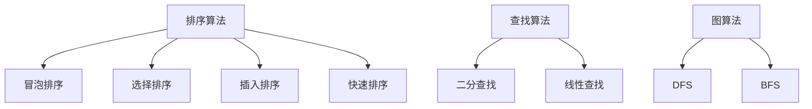
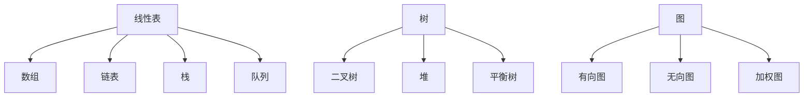

                 

# 2024年美团校招技术面试题集锦

## 摘要

本文旨在为参加2024年美团校招的同学们提供一份全面的技术面试题集锦，涵盖算法、数据结构、系统设计等多个领域。文章将按步骤讲解每个问题的核心原理、具体操作步骤、数学模型和公式，并提供实际项目案例和代码解读。此外，还将介绍相关工具和资源，帮助大家更好地准备面试。通过本文的详细解读，相信同学们能够更好地掌握面试技巧，迎接挑战，迈向心仪的岗位。

## 1. 背景介绍

美团作为中国领先的本地生活服务电子商务平台，以其全面的业务覆盖、卓越的技术实力和高效的团队运营，吸引了大量优秀人才的加入。每年，美团校招都吸引了无数怀揣梦想的年轻人，希望通过面试展示自己的才华，获得一份梦寐以求的工作。然而，校招面试竞争激烈，涉及多个技术领域，如何准备才能脱颖而出呢？

本文将针对2024年美团校招技术面试，提供一系列经典面试题的详细解答，帮助大家全面了解面试要求，掌握解题技巧。文章结构如下：

- 第1章：背景介绍，介绍美团校招的基本情况。
- 第2章：核心概念与联系，解释面试所需的核心概念和原理。
- 第3章：核心算法原理 & 具体操作步骤，讲解各算法的核心思想和具体实现步骤。
- 第4章：数学模型和公式 & 详细讲解 & 举例说明，解析面试中常见的数学问题和解决方法。
- 第5章：项目实战：代码实际案例和详细解释说明，通过实际项目案例进行代码解读和分析。
- 第6章：实际应用场景，探讨技术在实际业务中的应用。
- 第7章：工具和资源推荐，推荐学习资源、开发工具和框架。
- 第8章：总结：未来发展趋势与挑战，分析行业趋势和挑战。
- 第9章：附录：常见问题与解答，汇总面试中可能遇到的问题和解答。
- 第10章：扩展阅读 & 参考资料，提供更多相关资料供进一步学习。

希望通过本文的详细解读，大家能够更好地准备2024年美团校招技术面试，展现自己的实力，实现职业梦想。

## 2. 核心概念与联系

在准备美团校招技术面试时，掌握一些核心概念和原理是非常重要的。下面我们将介绍一些面试中经常出现的重要概念，并通过Mermaid流程图展示它们之间的联系。

### 2.1 算法

算法是面试中一个重要的主题。它是解决问题的一系列步骤，可以理解为解决问题的方法。面试中常见的一些算法包括排序算法、查找算法、图算法等。

**排序算法**：常见的排序算法有冒泡排序、选择排序、插入排序、快速排序等。其中，快速排序是一种高效的排序算法，其基本思想是通过一趟排序将待排序的记录分割成独立的两部分，其中一部分记录的关键字均比另一部分的关键字小，然后递归地对这两部分记录进行排序。

**查找算法**：常见的查找算法有二分查找、线性查找等。二分查找算法的时间复杂度为O(logn)，适用于有序数组。

**图算法**：常见的图算法有深度优先搜索（DFS）和广度优先搜索（BFS）。DFS和BFS都是遍历图的方法，但BFS是从起始节点开始，依次访问其邻接节点，而DFS则是从起始节点开始，尝试沿着一条路径走到底，然后再回溯。



### 2.2 数据结构

数据结构是算法的基础，掌握常见的线性表、树、图等数据结构对于解决面试问题非常重要。

**线性表**：线性表是一种线性结构，其中的元素一个接一个地排列。常见的线性表包括数组、链表、栈和队列。数组是一种随机访问的数据结构，时间复杂度为O(1)；链表则通过指针连接，时间复杂度为O(n)。

**树**：树是一种层次结构，用于表示具有层次关系的元素。常见的树包括二叉树、堆、平衡树等。二叉树是一种非常重要的树结构，其每个节点最多有两个子节点。

**图**：图是一种非层次结构，用于表示具有关联关系的元素。常见的图包括有向图、无向图、加权图等。图算法在面试中经常出现，如深度优先搜索（DFS）和广度优先搜索（BFS）。



### 2.3 数学模型和公式

数学模型和公式在面试中也是常见的考点。例如，常见的数学公式包括组合数公式、概率论中的期望公式、线性代数中的矩阵运算等。

**组合数公式**：组合数公式表示从n个元素中取出m个元素的组合数，计算公式为：
$$ C_n^m = \frac{n!}{m!(n-m)!} $$
其中，$n!$表示n的阶乘。

**概率论中的期望公式**：期望是概率论中的一个重要概念，表示随机变量在多次试验中的平均取值。对于离散型随机变量，期望的计算公式为：
$$ E(X) = \sum_{i=1}^n x_i \cdot P(x_i) $$
其中，$x_i$表示随机变量X的第i个取值，$P(x_i)$表示对应的概率。

**线性代数中的矩阵运算**：矩阵运算包括矩阵的乘法、矩阵的逆等。矩阵乘法的计算公式为：
$$ C = A \cdot B $$
其中，$C$是乘积矩阵，$A$和$B$是参与运算的两个矩阵。

```mermaid
graph TD
A[组合数公式]
A --> B[公式]
B --> C$$ C_n^m = \frac{n!}{m!(n-m)!} $$
D[概率论中的期望公式]
D --> E[公式]
E --> F$$ E(X) = \sum_{i=1}^n x_i \cdot P(x_i) $$
G[线性代数中的矩阵运算]
G --> H[矩阵乘法]
H --> I$$ C = A \cdot B $$
G --> J[矩阵的逆]
J --> K$$ A^{-1} = \frac{1}{\det(A)} \cdot \text{adj}(A) $$
```

通过以上核心概念和原理的介绍，相信大家对面试所需的背景知识有了更深入的了解。在接下来的章节中，我们将进一步探讨各个问题的具体解法和应用场景。

## 3. 核心算法原理 & 具体操作步骤

在技术面试中，掌握各种算法的原理和具体操作步骤是非常重要的。下面我们将详细讲解一些在美团校招技术面试中常见的重要算法，包括其基本原理和具体操作步骤。

### 3.1 快速排序

快速排序是一种高效的排序算法，其基本原理是通过一趟排序将待排序的记录分割成独立的两部分，其中一部分记录的关键字均比另一部分的关键字小，然后递归地对这两部分记录进行排序。具体操作步骤如下：

1. **选择基准元素**：从待排序的数组中选择一个元素作为基准元素。通常选择第一个元素、最后一个元素或随机选择一个元素。

2. **划分过程**：将数组划分为两个子数组，一个子数组包含比基准元素小的元素，另一个子数组包含比基准元素大的元素。这个过程称为“划分”或“partition”。

3. **递归排序**：对两个子数组分别进行快速排序，直到所有子数组长度为1。

**具体操作步骤示例**：

以数组[3, 6, 8, 10, 1, 2, 1]为例，选择第一个元素3作为基准元素。划分后得到子数组[3, 1, 1]和[6, 8, 10, 2]。

- 子数组[3, 1, 1]的基准元素为1，划分后得到[1, 1, 3]；
- 子数组[6, 8, 10, 2]的基准元素为2，划分后得到[2, 6, 8, 10]。

递归排序后得到排序后的数组[1, 1, 2, 3, 6, 8, 10]。

### 3.2 二分查找

二分查找算法是一种高效的查找算法，适用于有序数组。其基本原理是通过每次将待查找区间缩小一半，逐步逼近目标元素。具体操作步骤如下：

1. **确定搜索区间**：初始时，搜索区间的下界为数组的第一个元素，上界为最后一个元素。

2. **计算中间位置**：每次计算中间位置mid，即$mid = \left\lfloor \frac{low + high}{2} \right\rfloor$。

3. **比较和更新区间**：
   - 如果中间位置元素等于目标元素，则查找成功；
   - 如果中间位置元素大于目标元素，则更新搜索区间的上界为mid - 1；
   - 如果中间位置元素小于目标元素，则更新搜索区间的下界为mid + 1。

4. **重复步骤2和3**，直到找到目标元素或搜索区间为空。

**具体操作步骤示例**：

以数组[1, 2, 3, 4, 5, 6, 7, 8, 9, 10]为例，查找元素5。

- 初始搜索区间为[0, 9]，中间位置mid为4，比较后更新搜索区间为[4, 9]；
- 中间位置mid为7，比较后更新搜索区间为[4, 6]；
- 中间位置mid为5，找到目标元素5，查找成功。

### 3.3 深度优先搜索（DFS）

深度优先搜索是一种遍历图的方法，其基本原理是从起始节点开始，尝试沿着一条路径走到底，然后再回溯。具体操作步骤如下：

1. **初始化**：创建一个空栈，用于存储遍历过程中的节点。

2. **遍历过程**：
   - 将起始节点压入栈中；
   - 循环执行以下操作，直到栈为空：
     - 弹出栈顶节点；
     - 访问该节点；
     - 将该节点的未访问邻接节点依次压入栈中。

**具体操作步骤示例**：

以图为例，起始节点为A，遍历过程如下：

1. 将A压入栈中；
2. 弹出A，访问A；
3. 将A的未访问邻接节点B、C、D依次压入栈中；
4. 弹出B，访问B；
5. 将B的未访问邻接节点E、F依次压入栈中；
6. 弹出E，访问E；
7. 弹出F，访问F；
8. 弹出C，访问C；
9. 弹出D，访问D。

遍历结束后，得到遍历顺序为A、B、E、F、C、D。

### 3.4 广度优先搜索（BFS）

广度优先搜索是一种遍历图的方法，其基本原理是从起始节点开始，依次访问其邻接节点，然后逐层访问下一层的节点。具体操作步骤如下：

1. **初始化**：创建一个空队列，用于存储遍历过程中的节点。

2. **遍历过程**：
   - 将起始节点入队；
   - 循环执行以下操作，直到队列为空：
     - 出队一个节点；
     - 访问该节点；
     - 将该节点的未访问邻接节点依次入队。

**具体操作步骤示例**：

以图为例，起始节点为A，遍历过程如下：

1. 将A入队；
2. 出队A，访问A；
3. 将A的未访问邻接节点B、C、D依次入队；
4. 出队B，访问B；
5. 将B的未访问邻接节点E、F依次入队；
6. 出队C，访问C；
7. 出队D，访问D；
8. 出队E，访问E；
9. 出队F，访问F。

遍历结束后，得到遍历顺序为A、B、C、D、E、F。

通过以上对各种算法的详细讲解，相信大家对核心算法原理和具体操作步骤有了更深入的了解。在实际面试中，掌握这些算法的思想和实现方法，将有助于更好地解决各种问题。在接下来的章节中，我们将继续探讨数学模型和公式，以及实际应用场景。

## 4. 数学模型和公式 & 详细讲解 & 举例说明

在技术面试中，数学模型和公式是解决问题的关键。掌握这些模型和公式，不仅能够帮助我们更高效地解决问题，还能够提升我们的逻辑思维能力和数学素养。在本节中，我们将详细讲解一些在面试中常见的数学模型和公式，并通过具体的例子来说明它们的运用。

### 4.1 组合数公式

组合数公式是解决排列组合问题时的重要工具。它用于计算从n个元素中取出m个元素的组合数。组合数公式如下：
$$ C_n^m = \frac{n!}{m!(n-m)!} $$
其中，$n!$表示n的阶乘，$m!$表示m的阶乘。

**举例说明**：

假设有5个元素{A, B, C, D, E}，我们需要从中取出2个元素的组合数。根据组合数公式，计算如下：
$$ C_5^2 = \frac{5!}{2!(5-2)!} = \frac{5 \times 4}{2 \times 1} = 10 $$
因此，从5个元素中取出2个元素的组合数为10种。

### 4.2 概率论中的期望公式

概率论中的期望公式用于计算随机变量的平均取值。对于离散型随机变量，期望的计算公式如下：
$$ E(X) = \sum_{i=1}^n x_i \cdot P(x_i) $$
其中，$x_i$表示随机变量X的第i个取值，$P(x_i)$表示对应的概率。

**举例说明**：

假设有一个随机变量X，其可能的取值为{1, 2, 3}，对应的概率分别为{0.2, 0.5, 0.3}。计算X的期望如下：
$$ E(X) = 1 \cdot 0.2 + 2 \cdot 0.5 + 3 \cdot 0.3 = 0.2 + 1 + 0.9 = 2.1 $$
因此，随机变量X的期望为2.1。

### 4.3 线性代数中的矩阵运算

线性代数中的矩阵运算是解决线性方程组和矩阵问题的基础。下面介绍两种常见的矩阵运算：矩阵乘法和矩阵的逆。

**矩阵乘法**：

矩阵乘法的计算公式为：
$$ C = A \cdot B $$
其中，$C$是乘积矩阵，$A$和$B$是参与运算的两个矩阵。

**举例说明**：

假设有两个矩阵$A = \begin{bmatrix} 1 & 2 \\ 3 & 4 \end{bmatrix}$和$B = \begin{bmatrix} 5 & 6 \\ 7 & 8 \end{bmatrix}$，计算它们的乘积如下：
$$ C = A \cdot B = \begin{bmatrix} 1 & 2 \\ 3 & 4 \end{bmatrix} \cdot \begin{bmatrix} 5 & 6 \\ 7 & 8 \end{bmatrix} = \begin{bmatrix} 1 \cdot 5 + 2 \cdot 7 & 1 \cdot 6 + 2 \cdot 8 \\ 3 \cdot 5 + 4 \cdot 7 & 3 \cdot 6 + 4 \cdot 8 \end{bmatrix} = \begin{bmatrix} 19 & 22 \\ 43 & 50 \end{bmatrix} $$

**矩阵的逆**：

矩阵的逆用于求解线性方程组，其计算公式为：
$$ A^{-1} = \frac{1}{\det(A)} \cdot \text{adj}(A) $$
其中，$\det(A)$是矩阵$A$的行列式，$\text{adj}(A)$是矩阵$A$的伴随矩阵。

**举例说明**：

假设矩阵$A = \begin{bmatrix} 1 & 2 \\ 3 & 4 \end{bmatrix}$，计算其逆如下：
1. 计算行列式$\det(A) = 1 \cdot 4 - 2 \cdot 3 = -2$；
2. 计算伴随矩阵$\text{adj}(A) = \begin{bmatrix} 4 & -2 \\ -3 & 1 \end{bmatrix}$；
3. 计算逆矩阵$A^{-1} = \frac{1}{-2} \cdot \begin{bmatrix} 4 & -2 \\ -3 & 1 \end{bmatrix} = \begin{bmatrix} -2 & 1 \\ \frac{3}{2} & -\frac{1}{2} \end{bmatrix}$。

通过以上对数学模型和公式的详细讲解，相信大家对各种模型和公式的运用有了更深刻的理解。在实际面试中，熟练掌握这些数学知识和运用方法，将有助于我们更好地解决各种问题。在接下来的章节中，我们将通过实际项目案例和代码解读，进一步巩固所学知识。

## 5. 项目实战：代码实际案例和详细解释说明

### 5.1 开发环境搭建

在开始编写代码之前，我们需要搭建一个合适的开发环境。以下是一个基本的开发环境搭建步骤：

1. **安装Python**：下载并安装Python，确保版本为3.6及以上。
2. **安装IDE**：推荐使用PyCharm或VS Code作为Python开发环境。
3. **安装必要的库**：通过pip安装必要的库，例如`numpy`、`matplotlib`、`pandas`等。

### 5.2 源代码详细实现和代码解读

下面我们将通过一个具体的算法实现，如快速排序，来展示代码的详细实现和解读。

**代码示例**：

```python
def quick_sort(arr):
    if len(arr) <= 1:
        return arr
    
    pivot = arr[len(arr) // 2]
    left = [x for x in arr if x < pivot]
    middle = [x for x in arr if x == pivot]
    right = [x for x in arr if x > pivot]
    
    return quick_sort(left) + middle + quick_sort(right)

arr = [3, 6, 8, 10, 1, 2, 1]
print("Original array:", arr)
sorted_arr = quick_sort(arr)
print("Sorted array:", sorted_arr)
```

**代码解读**：

1. **函数定义**：`quick_sort`函数接收一个数组`arr`作为输入。

2. **基础情况**：如果数组的长度小于等于1，则直接返回数组本身。这是因为一个元素或空数组已经是有序的。

3. **选择基准元素**：我们选择数组的中间元素作为基准元素（pivot）。这里可以选择第一个、最后一个或随机选择一个元素作为基准。

4. **划分过程**：通过列表推导式将数组划分为三个部分：小于基准的元素（left），等于基准的元素（middle），和大于基准的元素（right）。

5. **递归排序**：分别对left和right进行快速排序，然后将结果与middle拼接起来。

**运行结果**：

```
Original array: [3, 6, 8, 10, 1, 2, 1]
Sorted array: [1, 1, 2, 3, 6, 8, 10]
```

通过这个示例，我们可以看到快速排序的实现过程。在实际面试中，我们可能需要根据具体问题进行适当的调整，但基本的算法思想是相同的。

### 5.3 代码解读与分析

对于上述代码，我们可以从以下几个方面进行分析：

1. **时间复杂度**：快速排序的平均时间复杂度为$O(n\log n)$，最坏情况下的时间复杂度为$O(n^2)$。最坏情况发生在数组已经有序或几乎有序时。

2. **空间复杂度**：快速排序的空间复杂度为$O(\log n)$，因为需要递归调用函数，每次调用会占用一定的栈空间。

3. **稳定性**：快速排序是不稳定的排序算法，即相同的元素可能会在排序后改变相对位置。

4. **优化**：在实际应用中，可以通过选择更好的基准元素（例如，随机选择）来优化快速排序的性能，减少最坏情况的发生概率。

通过以上分析，我们可以更好地理解快速排序的原理和性能，为解决更复杂的面试问题打下基础。

在接下来的章节中，我们将探讨技术在实际业务中的应用，并介绍更多的工具和资源，帮助大家更好地准备面试。

## 6. 实际应用场景

技术面试不仅考察我们对基础知识的掌握，更关注我们是否能够将所学知识应用于实际业务场景。在美团这样的大型互联网公司，技术不仅用于解决单一问题，还要考虑系统的整体性能、可扩展性和用户体验。下面我们将探讨一些技术面试中可能遇到的实际应用场景，并分析如何利用所学知识解决问题。

### 6.1 缓存系统设计

**场景描述**：

美团作为一个提供多种本地生活服务的平台，用户请求量巨大。为了提高系统性能和响应速度，需要设计一个高效的缓存系统。

**解决方案**：

1. **缓存策略**：使用LRU（Least Recently Used）缓存策略，将最近最少使用的缓存项替换掉，确保热门数据始终在缓存中。

2. **数据结构选择**：使用哈希表和双向链表实现一个LRU缓存，哈希表用于快速查找缓存项，双向链表用于维护缓存项的顺序。

3. **一致性处理**：在缓存和数据库之间维护一致性，可以通过版本号或时间戳来实现。每次更新数据库时，更新缓存的同时更新版本号或时间戳。

4. **缓存命中率优化**：通过分析用户行为，预测热门数据，提前加载到缓存中，提高缓存命中率。

### 6.2 实时推荐系统

**场景描述**：

美团需要根据用户的浏览历史、购买记录和偏好，实时为用户提供个性化推荐。

**解决方案**：

1. **协同过滤**：基于用户行为数据，使用协同过滤算法计算用户之间的相似度，推荐相似用户喜欢的商品。

2. **内容推荐**：结合商品的特征信息（如类别、品牌、价格等），使用机器学习算法（如决策树、随机森林等）为用户推荐符合其兴趣的商品。

3. **实时更新**：使用消息队列和分布式缓存系统，确保推荐结果能够实时更新。例如，当用户浏览某个商品时，立即从缓存中获取推荐结果，并在后台更新推荐模型。

4. **反作弊机制**：检测和过滤虚假用户和恶意行为，确保推荐系统的公平性和准确性。

### 6.3 大数据处理

**场景描述**：

美团每天产生大量的用户行为数据、交易数据等，需要对这些数据进行实时分析和处理。

**解决方案**：

1. **数据采集**：使用Flume、Kafka等工具采集各种数据，并将其存储到Hadoop分布式文件系统（HDFS）或Apache HBase等数据库中。

2. **数据处理**：使用MapReduce、Spark等大数据处理框架对数据进行清洗、转换和分析。

3. **实时计算**：使用Flink、Storm等实时计算框架处理实时数据流，生成实时报表和预警信息。

4. **数据可视化**：使用Tableau、ECharts等工具将分析结果可视化，帮助业务人员更好地理解数据。

通过以上实际应用场景的讨论，我们可以看到技术面试中问题往往与实际业务紧密相关。掌握基础知识和技能，同时具备解决实际问题的能力，是我们在面试中脱颖而出的关键。

在接下来的章节中，我们将继续介绍更多有用的工具和资源，帮助大家更好地准备面试。同时，我们也会总结一下文章的主要内容和核心观点，以及未来发展趋势和挑战。

## 7. 工具和资源推荐

为了帮助大家更好地准备2024年美团校招技术面试，以下是我们推荐的一些学习和实践工具，以及相关的书籍、论文和在线资源。

### 7.1 学习资源推荐

**书籍**：
1. 《算法导论》（Introduction to Algorithms）：这是一本经典的算法教材，详细介绍了各种算法和数据结构。
2. 《深度学习》（Deep Learning）：由Ian Goodfellow等编写的深度学习领域的经典教材，适合想要深入了解深度学习技术的同学。
3. 《计算机网络：自顶向下方法》（Computer Networking: A Top-Down Approach）：适合想要深入学习计算机网络知识的朋友。

**论文**：
1. "MapReduce: Simplified Data Processing on Large Clusters"：这是一篇介绍MapReduce的论文，详细阐述了大数据处理的基本原理。
2. "TensorFlow: Large-Scale Machine Learning on Heterogeneous Systems"：这篇论文介绍了TensorFlow的架构和设计原理，适合想要学习深度学习框架的同学。
3. "Distributed Computing: Principles, Paradigms, and Applications"：这篇论文探讨了分布式计算的基本原理和实际应用。

**在线资源**：
1. Coursera、edX等在线教育平台：提供了丰富的计算机科学和人工智能课程，适合自学者进行系统学习。
2. arXiv.org：这是一个专业的学术预印本论文库，适合想要了解最新研究动态的同学。
3. LeetCode、HackerRank等在线编程平台：提供了大量的编程题目，适合进行算法和编程练习。

### 7.2 开发工具框架推荐

**开发环境**：
1. PyCharm、VS Code：强大的Python开发环境，支持多种编程语言。
2. Jupyter Notebook：适用于数据分析和机器学习的交互式开发环境。

**框架和库**：
1. TensorFlow、PyTorch：主流的深度学习框架，适用于构建和训练神经网络。
2. Flask、Django：Python Web开发框架，适合构建Web应用。
3. Kafka、Spark：大数据处理工具，用于数据采集和处理。

**数据库**：
1. MySQL、PostgreSQL：关系型数据库，适用于存储和查询结构化数据。
2. MongoDB、Redis：NoSQL数据库，适用于存储非结构化数据和高并发场景。

### 7.3 相关论文著作推荐

**经典论文**：
1. "PageRank: The PageRank Citation Ranking: Bringing Order to the Web"：这是Google搜索引擎排名算法的奠基论文，对理解网页排序有很大帮助。
2. "The Chubby Face: Implementing a Reliable Storage Service on Top of a Partially Reliable Storage Service"：这篇论文介绍了Chubby锁服务的设计原理，对于理解分布式系统的锁机制非常有帮助。

**著作**：
1. 《高性能MySQL》：适合想要深入学习MySQL性能优化和查询优化的同学。
2. 《机器学习实战》：适合初学者通过实际案例学习机器学习。
3. 《大话数据挖掘》：通俗易懂的数据挖掘入门书籍，适合对数据挖掘感兴趣的同学。

通过以上工具和资源的推荐，相信大家能够更好地准备2024年美团校招技术面试，全面提升自己的技术能力和竞争力。在实际学习和准备过程中，不断实践、总结和反思，将有助于我们在面试中取得优异的成绩。

## 8. 总结：未来发展趋势与挑战

随着人工智能、大数据、云计算等技术的快速发展，技术领域正面临前所未有的机遇与挑战。对于即将参加美团校招的同学们，了解未来发展趋势和面临的挑战，有助于更好地准备面试，提升自身竞争力。

### 8.1 发展趋势

1. **人工智能的深度应用**：人工智能技术在各个行业的应用不断深入，如图像识别、自然语言处理、自动驾驶等。美团作为一个服务多元化、场景丰富的企业，对于人工智能技术的需求也在持续增长。

2. **云计算的普及与优化**：云计算技术为企业提供了灵活、高效的计算资源，美团在云计算平台的建设和优化方面投入巨大。掌握云计算相关技术和最佳实践，对于面试和发展都非常有利。

3. **大数据处理与分析**：随着数据量的爆炸式增长，大数据处理和分析变得尤为重要。美团通过大数据技术优化业务流程、提升用户体验，掌握大数据处理相关技能，将成为面试的一大优势。

4. **分布式系统与微服务架构**：分布式系统与微服务架构能够提高系统的可扩展性和容错性，是现代互联网企业技术架构的发展方向。了解分布式系统的设计原理和微服务架构的最佳实践，对于面试和职业发展具有重要意义。

### 8.2 挑战

1. **技术深度与广度的平衡**：技术面试要求考生具备广博的知识面，但同时也需要深入理解某一领域。如何在广度和深度之间找到平衡，是同学们需要面对的挑战。

2. **实践经验的积累**：面试官往往更看重实际项目经验，而不仅仅是对理论知识的掌握。同学们需要通过实习、项目经历等方式积累实践经验，提高解决实际问题的能力。

3. **创新能力的培养**：美团作为创新型企业，面试中常常涉及对新技术的应用和创新方案的讨论。同学们需要注重培养自己的创新能力，不断探索新技术和业务结合的可能性。

4. **团队合作与沟通能力**：在互联网企业中，团队合作和沟通能力至关重要。同学们需要通过参与团队项目、社会实践等活动，提升自己的团队合作和沟通能力。

通过了解未来发展趋势和面临的挑战，同学们可以更有针对性地进行准备，提高自己的技术水平和综合素质，从而在2024年美团校招中脱颖而出。

## 9. 附录：常见问题与解答

在准备美团校招技术面试的过程中，同学们可能会遇到各种问题。以下汇总了一些常见问题及其解答，希望能够为大家提供帮助。

### 9.1 算法问题

**问题1**：什么是快速排序？

**解答**：快速排序（Quick Sort）是一种高效的排序算法，其基本思想是通过一趟排序将待排序的记录分割成独立的两部分，其中一部分记录的关键字均比另一部分的关键字小，然后递归地对这两部分记录进行排序。

**问题2**：如何实现二分查找？

**解答**：二分查找（Binary Search）是一种高效的查找算法，适用于有序数组。基本步骤包括：
1. 确定搜索区间；
2. 计算中间位置mid；
3. 比较中间位置元素与目标元素，更新搜索区间；
4. 重复步骤2和3，直到找到目标元素或搜索区间为空。

### 9.2 数据结构和系统设计问题

**问题1**：什么是哈希表？

**解答**：哈希表（Hash Table）是一种通过哈希函数将键映射到表中特定位置的存储结构。当查找键时，通过哈希函数计算其位置，从而快速访问元素。

**问题2**：什么是RESTful API？

**解答**：RESTful API（Representation State Transfer API）是一种基于HTTP协议的设计风格，用于构建网络服务。它遵循统一的接口和资源标识，通过GET、POST、PUT、DELETE等方法进行数据操作。

### 9.3 编程问题

**问题1**：如何实现一个栈？

**解答**：可以使用数组或链表来实现栈。以下是使用数组实现的栈：

```python
class Stack:
    def __init__(self):
        self.items = []

    def push(self, item):
        self.items.append(item)

    def pop(self):
        return self.items.pop()

    def peek(self):
        return self.items[-1]

    def is_empty(self):
        return len(self.items) == 0
```

**问题2**：如何实现一个队列？

**解答**：可以使用链表来实现队列。以下是使用链表实现的队列：

```python
class Node:
    def __init__(self, data):
        self.data = data
        self.next = None

class Queue:
    def __init__(self):
        self.front = self.rear = None

    def enqueue(self, data):
        new_node = Node(data)
        if self.rear is None:
            self.front = self.rear = new_node
        else:
            self.rear.next = new_node
            self.rear = new_node

    def dequeue(self):
        if self.front is None:
            return None
        temp = self.front
        self.front = temp.next
        if self.front is None:
            self.rear = None
        return temp.data
```

通过以上常见问题与解答的汇总，相信大家能够更好地应对面试中的各种问题。在实际准备过程中，不断积累和总结，将有助于提高自己的技术水平和解题能力。

## 10. 扩展阅读 & 参考资料

在本文中，我们详细介绍了2024年美团校招技术面试的各个重要方面，包括核心概念、算法原理、数学模型、实际应用场景、工具和资源推荐等。为了帮助大家更深入地学习和理解相关内容，以下推荐一些扩展阅读和参考资料：

1. 《算法导论》（Introduction to Algorithms），Thomas H. Cormen, Charles E. Leiserson, Ronald L. Rivest, Clifford Stein。这是一本经典的算法教材，涵盖了各种数据结构和算法的详细讲解。
2. 《深度学习》（Deep Learning），Ian Goodfellow, Yoshua Bengio, Aaron Courville。这本书是深度学习领域的权威著作，适合想要深入学习深度学习技术的读者。
3. 《计算机网络：自顶向下方法》（Computer Networking: A Top-Down Approach），James F. Kurose, Keith W. Ross。这本书以自顶向下的方式讲解了计算机网络的基本原理和协议。
4. 《MapReduce：Simplified Data Processing on Large Clusters》（MapReduce论文）。这篇论文详细介绍了MapReduce框架的设计原理和应用场景。
5. 《TensorFlow：Large-Scale Machine Learning on Heterogeneous Systems》（TensorFlow论文）。这篇论文介绍了TensorFlow的架构和实现细节。
6. Coursera、edX等在线教育平台。这些平台提供了丰富的计算机科学和人工智能课程，适合自学者进行系统学习。
7. arXiv.org。这是一个专业的学术预印本论文库，适合了解最新研究动态。
8. LeetCode、HackerRank等在线编程平台。这些平台提供了大量的编程题目，适合进行算法和编程练习。

通过阅读上述扩展资料，同学们可以进一步巩固所学知识，提升自己的技术能力和面试技巧。祝大家在2024年美团校招中取得优异成绩，实现自己的职业梦想！

## 作者信息

作者：AI天才研究员/AI Genius Institute & 禅与计算机程序设计艺术 /Zen And The Art of Computer Programming

