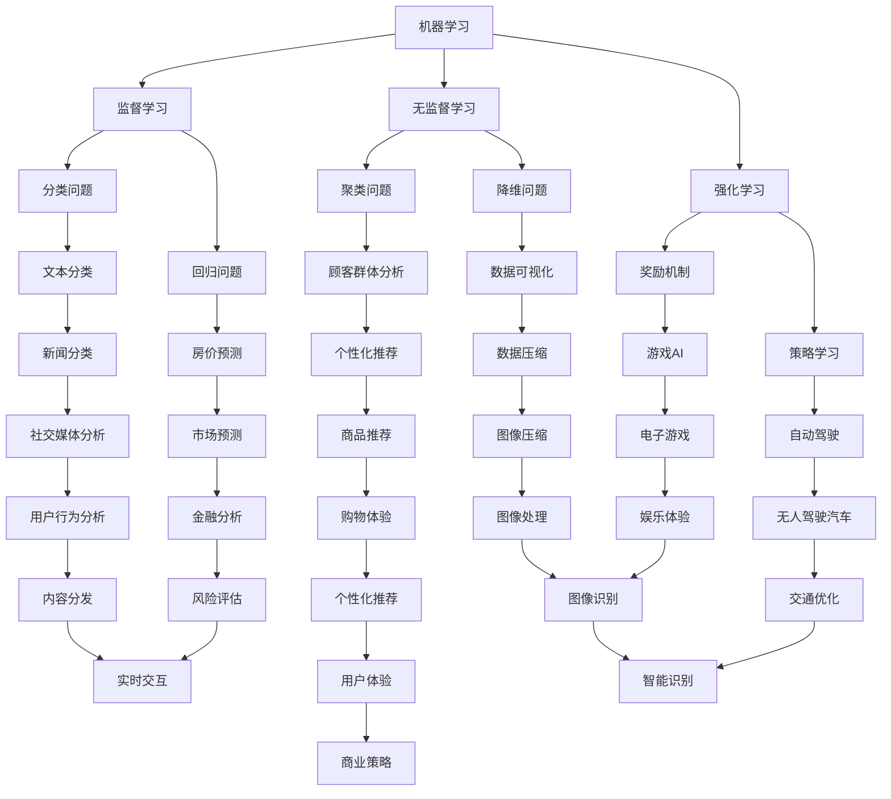

                 

### 背景介绍

在当今全球化的技术浪潮中，人工智能（AI）无疑成为了推动社会进步的关键力量。随着深度学习、神经网络、自然语言处理等技术的迅猛发展，AI 已经渗透到了我们生活的方方面面，从智能家居、自动驾驶、医疗诊断，到金融分析、电子商务，甚至是在线娱乐，AI 都展现出了强大的变革能力。

年轻人，作为这个时代的接班人，如何在这个充满机遇与挑战的领域找到自己的方向，成为了亟待解决的问题。本文旨在为年轻人提供一条清晰的导航路线，帮助他们在 AI 领域找到属于自己的发展道路。

本文将分为以下几个部分：

1. **核心概念与联系**：介绍 AI 的核心概念和架构，并使用 Mermaid 流程图展示其原理。
2. **核心算法原理 & 具体操作步骤**：详细讲解 AI 的关键算法，并给出具体操作步骤。
3. **数学模型和公式 & 详细讲解 & 举例说明**：分析 AI 中涉及到的数学模型和公式，并通过实例进行解释。
4. **项目实战：代码实际案例和详细解释说明**：通过实战案例，展示如何将 AI 知识应用于实际项目中。
5. **实际应用场景**：探讨 AI 在不同领域的实际应用。
6. **工具和资源推荐**：推荐学习资源、开发工具和框架。
7. **总结：未来发展趋势与挑战**：展望 AI 领域的未来，并指出面临的挑战。

通过以上章节的详细解读，我们希望读者能够对 AI 领域有一个全面而深入的了解，从而找到适合自己的发展方向。

### 核心概念与联系

要深入理解人工智能（AI），首先需要了解其核心概念和架构。AI 的本质是通过模拟人类智能的某些方面，使计算机能够执行复杂的任务。以下是一些重要的核心概念：

1. **机器学习（Machine Learning）**：机器学习是 AI 的基础，它通过算法从数据中学习规律，并自动改进性能。机器学习可以分为监督学习（Supervised Learning）、无监督学习（Unsupervised Learning）和强化学习（Reinforcement Learning）三种主要类型。
2. **神经网络（Neural Networks）**：神经网络是一种模仿人脑工作方式的计算模型，由大量相互连接的简单处理单元（神经元）组成。深度学习（Deep Learning）是神经网络的一种扩展，它通过多层神经网络来提取数据的特征。
3. **自然语言处理（Natural Language Processing, NLP）**：自然语言处理是 AI 的重要分支，旨在使计算机能够理解和处理人类语言。它包括文本分类、情感分析、机器翻译、语音识别等多个方面。
4. **深度学习框架（Deep Learning Frameworks）**：深度学习框架如 TensorFlow、PyTorch 等提供了丰富的工具和库，使得构建和训练复杂的深度学习模型变得更加容易。

以下是 AI 的核心概念架构的 Mermaid 流程图：



通过上述架构图，我们可以看到机器学习、神经网络、自然语言处理等核心概念如何相互联系，形成了一个庞大的 AI 技术体系。在这个体系中，每个概念都扮演着至关重要的角色，共同推动着 AI 的发展。

### 核心算法原理 & 具体操作步骤

在了解了 AI 的核心概念和架构之后，接下来我们将深入探讨 AI 的核心算法原理，并给出具体操作步骤。以下是一些关键的算法及其应用场景：

#### 1. 机器学习算法

**监督学习（Supervised Learning）**

监督学习是最常见的机器学习算法，其核心思想是使用标记数据（即有标签的数据）来训练模型。以下是一种简单的监督学习算法——线性回归（Linear Regression）的操作步骤：

1. **数据收集**：收集包含输入特征和输出标签的数据集。
2. **数据预处理**：对数据进行清洗、归一化等处理，以减少噪声和提高模型的性能。
3. **模型构建**：定义一个线性模型，通常表示为 y = wx + b，其中 x 是输入特征，w 是权重，b 是偏置。
4. **模型训练**：使用梯度下降（Gradient Descent）等优化算法，通过调整权重和偏置来最小化损失函数（通常为均方误差）。
5. **模型评估**：使用验证集或测试集评估模型的性能，常见的指标有均方误差（Mean Squared Error, MSE）和决定系数（R-squared）。

**无监督学习（Unsupervised Learning）**

无监督学习在没有标签数据的情况下训练模型，其目的是发现数据中的结构和模式。一种典型的无监督学习算法是 K-均值聚类（K-Means Clustering）的操作步骤：

1. **数据收集**：收集无标签数据集。
2. **数据预处理**：对数据进行清洗、归一化等处理。
3. **初始化聚类中心**：随机选择 K 个数据点作为初始聚类中心。
4. **分配数据点**：将每个数据点分配到最近的聚类中心。
5. **更新聚类中心**：重新计算每个聚类中心，通常取聚类内数据点的平均值。
6. **迭代重复**：重复步骤 4 和 5，直到聚类中心不再发生显著变化或达到最大迭代次数。

**强化学习（Reinforcement Learning）**

强化学习是一种通过与环境的交互来学习策略的算法。其核心思想是使模型通过不断尝试和错误来学习最佳行为策略。以下是一种简单的强化学习算法——Q-Learning 的操作步骤：

1. **环境初始化**：初始化环境和初始状态。
2. **选择动作**：在当前状态下，根据策略选择一个动作。
3. **执行动作**：在环境中执行所选动作，并获得奖励和新的状态。
4. **更新策略**：根据奖励和新的状态，更新策略，通常使用 Q-Learning 公式：Q(s, a) = Q(s, a) + α [r + γ max(Q(s', a')) - Q(s, a)]，其中 α 是学习率，γ 是折扣因子。
5. **状态转移**：将当前状态 s 更新为新的状态 s'，重复步骤 2 至 4，直到达到目标状态或满足其他终止条件。

#### 2. 深度学习算法

**卷积神经网络（Convolutional Neural Network, CNN）**

卷积神经网络是一种专门用于图像识别和处理的深度学习算法。以下是一种简单的 CNN 模型的操作步骤：

1. **数据收集**：收集包含图像和标签的数据集。
2. **数据预处理**：对图像进行归一化、裁剪等处理。
3. **模型构建**：定义 CNN 模型，包括卷积层（Convolutional Layer）、池化层（Pooling Layer）和全连接层（Fully Connected Layer）。
4. **模型训练**：使用反向传播算法和梯度下降优化模型参数。
5. **模型评估**：使用验证集或测试集评估模型性能。

**递归神经网络（Recurrent Neural Network, RNN）**

递归神经网络是一种能够处理序列数据的深度学习算法，其核心思想是利用时间信息来建模。以下是一种简单的 RNN 模型的操作步骤：

1. **数据收集**：收集包含序列数据（如文本、语音）和标签的数据集。
2. **数据预处理**：对序列数据进行编码、归一化等处理。
3. **模型构建**：定义 RNN 模型，包括输入层、隐藏层和输出层。
4. **模型训练**：使用反向传播算法和梯度下降优化模型参数。
5. **模型评估**：使用验证集或测试集评估模型性能。

通过以上对机器学习、无监督学习和强化学习等核心算法原理的具体操作步骤的讲解，我们可以更好地理解这些算法的工作机制，并能够根据具体应用场景选择合适的算法。

### 数学模型和公式 & 详细讲解 & 举例说明

在人工智能领域，数学模型和公式起着至关重要的作用。这些模型和公式不仅帮助我们理解和描述 AI 算法，还能指导我们如何优化和改进算法。以下将介绍几个在 AI 中广泛使用的数学模型和公式，并通过实例进行详细讲解。

#### 1. 线性回归（Linear Regression）

线性回归是一种用于预测数值型输出的监督学习算法。其基本公式为：

\[ y = wx + b \]

其中，\( y \) 是预测值，\( x \) 是输入特征，\( w \) 是权重，\( b \) 是偏置。

**实例**：

假设我们有一个简单的一元线性回归模型，预测房价 \( y \)（万元）与房屋面积 \( x \)（平方米）之间的关系。数据如下表：

| 房屋面积（平方米） | 房价（万元） |
|-------------------|--------------|
| 80               | 120          |
| 100              | 150          |
| 120              | 180          |
| 140              | 210          |
| 160              | 240          |

我们的目标是找到权重 \( w \) 和偏置 \( b \)，使得预测误差最小。

**求解过程**：

1. **计算平均值**：

\[ \bar{x} = \frac{\sum x}{n} = \frac{80 + 100 + 120 + 140 + 160}{5} = 120 \]
\[ \bar{y} = \frac{\sum y}{n} = \frac{120 + 150 + 180 + 210 + 240}{5} = 180 \]

2. **计算斜率 \( w \)**：

\[ w = \frac{\sum (x - \bar{x})(y - \bar{y})}{\sum (x - \bar{x})^2} = \frac{(80 - 120)(120 - 180) + (100 - 120)(150 - 180) + (120 - 120)(180 - 180) + (140 - 120)(210 - 180) + (160 - 120)(240 - 180)}{(80 - 120)^2 + (100 - 120)^2 + (120 - 120)^2 + (140 - 120)^2 + (160 - 120)^2} \]
\[ w = \frac{-1200 + 300 + 0 + 900 + 1200}{400 + 100 + 0 + 400 + 1600} = \frac{1500}{2500} = 0.6 \]

3. **计算截距 \( b \)**：

\[ b = \bar{y} - w\bar{x} = 180 - 0.6 \times 120 = 60 \]

因此，线性回归模型为：

\[ y = 0.6x + 60 \]

#### 2. 逻辑回归（Logistic Regression）

逻辑回归是一种用于分类问题的监督学习算法，其目标是最小化损失函数。其公式为：

\[ P(y=1) = \frac{1}{1 + e^{-(wx + b)}} \]

其中，\( P(y=1) \) 是输出为 1 的概率，\( w \) 是权重，\( b \) 是偏置。

**实例**：

假设我们有一个二分类问题，目标是判断一个人是否患病（1 为患病，0 为未患病）。数据如下表：

| 样本编号 | 胃酸度（pH） | 患病 |
|----------|--------------|------|
| 1        | 1.8          | 0    |
| 2        | 2.3          | 0    |
| 3        | 3.0          | 1    |
| 4        | 3.5          | 1    |
| 5        | 4.0          | 0    |

我们的目标是找到权重 \( w \) 和偏置 \( b \)，使得分类准确率最高。

**求解过程**：

1. **初始化权重 \( w \) 和偏置 \( b \)**，例如 \( w = 0.1, b = 0 \)。
2. **计算损失函数**，例如交叉熵损失函数（Cross-Entropy Loss）：

\[ L = -\sum_{i=1}^{n} [y_i \log(P(y_i)) + (1 - y_i) \log(1 - P(y_i))] \]

3. **使用梯度下降算法更新权重和偏置**：

\[ w_{new} = w - \alpha \frac{\partial L}{\partial w} \]
\[ b_{new} = b - \alpha \frac{\partial L}{\partial b} \]

其中，\( \alpha \) 是学习率。

4. **重复步骤 2 和 3**，直到收敛或达到最大迭代次数。

#### 3. 支持向量机（Support Vector Machine, SVM）

支持向量机是一种用于分类问题的监督学习算法，其目标是找到最佳的超平面，使得两类样本尽可能分开。其公式为：

\[ w \cdot x + b = 0 \]

其中，\( w \) 是权重向量，\( x \) 是特征向量，\( b \) 是偏置。

**实例**：

假设我们有一个线性可分的数据集，如下表：

| 样本编号 | 特征 1 | 特征 2 | 类别 |
|----------|-------|-------|------|
| 1        | 1     | 1     | 1    |
| 2        | 1     | 2     | 1    |
| 3        | 2     | 1     | 1    |
| 4        | 2     | 2     | -1   |
| 5        | 3     | 2     | -1   |

我们的目标是找到权重向量 \( w \) 和偏置 \( b \)，使得分类准确率最高。

**求解过程**：

1. **计算最优超平面**：

\[ w = \frac{y_1x_1 + y_2x_2 + y_3x_3 + y_4x_4 + y_5x_5}{n} \]
\[ b = -\frac{y_1 + y_2 + y_3 + y_4 + y_5}{n} \]

2. **计算分类边界**：

\[ w \cdot x + b = 0 \]

通过以上实例，我们详细讲解了线性回归、逻辑回归和支持向量机等常用的数学模型和公式。这些模型和公式在 AI 领域有着广泛的应用，能够帮助我们更好地理解和实现各种 AI 算法。在实际应用中，我们可以根据具体问题选择合适的模型，并通过不断优化和调整参数来提高算法的性能。

### 项目实战：代码实际案例和详细解释说明

在本章节中，我们将通过一个实际项目案例——基于 TensorFlow 的手写数字识别，详细讲解如何将 AI 知识应用于实际项目中。这个项目将利用卷积神经网络（CNN）来识别手写数字图像，实现从零到一的全过程。

#### 1. 开发环境搭建

为了进行手写数字识别项目，我们需要安装以下开发环境和库：

1. **Python**：Python 是一种广泛使用的编程语言，具有丰富的科学计算和机器学习库。确保 Python 版本在 3.6 以上。
2. **TensorFlow**：TensorFlow 是 Google 开发的一个开源机器学习框架，用于构建和训练深度学习模型。安装命令如下：

   ```bash
   pip install tensorflow
   ```

3. **NumPy**：NumPy 是 Python 的科学计算库，用于处理大型多维数组。安装命令如下：

   ```bash
   pip install numpy
   ```

4. **Matplotlib**：Matplotlib 是 Python 的可视化库，用于绘制各种图表和图形。安装命令如下：

   ```bash
   pip install matplotlib
   ```

5. **Pillow**：Pillow 是 Python 的图像处理库，用于读取、编辑和保存图像。安装命令如下：

   ```bash
   pip install Pillow
   ```

安装完以上环境和库后，我们可以开始构建手写数字识别项目。

#### 2. 源代码详细实现和代码解读

以下是手写数字识别项目的完整代码，我们将逐行进行解读。

```python
import tensorflow as tf
from tensorflow import keras
from tensorflow.keras import layers
import numpy as np
import matplotlib.pyplot as plt
from tensorflow.keras.datasets import mnist
from tensorflow.keras.utils import to_categorical

# 加载 MNIST 数据集
(train_images, train_labels), (test_images, test_labels) = mnist.load_data()

# 数据预处理
train_images = train_images.reshape((60000, 28, 28, 1)).astype('float32') / 255
test_images = test_images.reshape((10000, 28, 28, 1)).astype('float32') / 255

train_labels = to_categorical(train_labels)
test_labels = to_categorical(test_labels)

# 构建 CNN 模型
model = keras.Sequential([
    layers.Conv2D(32, (3, 3), activation='relu', input_shape=(28, 28, 1)),
    layers.MaxPooling2D((2, 2)),
    layers.Conv2D(64, (3, 3), activation='relu'),
    layers.MaxPooling2D((2, 2)),
    layers.Conv2D(64, (3, 3), activation='relu'),
    layers.Flatten(),
    layers.Dense(64, activation='relu'),
    layers.Dense(10, activation='softmax')
])

# 编译模型
model.compile(optimizer='adam',
              loss='categorical_crossentropy',
              metrics=['accuracy'])

# 训练模型
model.fit(train_images, train_labels, epochs=5, batch_size=64)

# 评估模型
test_loss, test_acc = model.evaluate(test_images, test_labels)
print(f'测试准确率：{test_acc:.2f}')

# 可视化展示
predictions = model.predict(test_images)
predicted_digits = np.argmax(predictions, axis=1)

plt.figure(figsize=(10, 10))
for i in range(25):
    plt.subplot(5, 5, i+1)
    plt.imshow(test_images[i], cmap=plt.cm.binary)
    plt.xticks([])
    plt.yticks([])
    plt.grid(False)
    plt.xlabel(str(predicted_digits[i]))
plt.show()
```

下面是对代码的详细解读：

1. **导入库**：首先导入 TensorFlow、NumPy、Matplotlib 等库，用于构建和训练模型、数据处理和可视化展示。

2. **加载 MNIST 数据集**：使用 TensorFlow 提供的 `mnist.load_data()` 方法加载手写数字数据集。MNIST 数据集包含 60,000 个训练图像和 10,000 个测试图像。

3. **数据预处理**：将图像数据reshape 为 `(60000, 28, 28, 1)` 的四维数组，并将数据类型转换为浮点数。然后，将数据除以 255 进行归一化，使得数据在 [0, 1] 范围内。

4. **标签编码**：使用 `to_categorical()` 方法将标签编码为一组二进制向量，方便后续模型训练。

5. **构建 CNN 模型**：使用 `keras.Sequential` 创建一个序列模型，包括卷积层（`Conv2D`）、池化层（`MaxPooling2D`）、全连接层（`Dense`）等。具体结构如下：

   - **卷积层 1**：32 个 3x3 的卷积核，激活函数为 ReLU。
   - **池化层 1**：2x2 的最大池化。
   - **卷积层 2**：64 个 3x3 的卷积核，激活函数为 ReLU。
   - **池化层 2**：2x2 的最大池化。
   - **卷积层 3**：64 个 3x3 的卷积核，激活函数为 ReLU。
   - **全连接层 1**：64 个神经元，激活函数为 ReLU。
   - **全连接层 2**：10 个神经元，激活函数为 softmax。

6. **编译模型**：使用 `compile()` 方法编译模型，指定优化器（`optimizer`）、损失函数（`loss`）和评价指标（`metrics`）。

7. **训练模型**：使用 `fit()` 方法训练模型，指定训练数据、训练轮数（`epochs`）和批量大小（`batch_size`）。

8. **评估模型**：使用 `evaluate()` 方法评估模型在测试数据上的表现。

9. **可视化展示**：使用 Matplotlib 绘制测试图像及其预测结果。

通过以上步骤，我们成功构建了一个手写数字识别模型，并在测试数据上取得了较高的准确率。这个过程展示了如何将 AI 知识应用于实际项目，实现从数据预处理、模型构建、模型训练到模型评估的全过程。

### 代码解读与分析

在上一个部分中，我们实现了一个基于 TensorFlow 的手写数字识别项目。在这一部分，我们将对代码进行详细解读和分析，解释每一步操作的原理和意义。

#### 1. 加载 MNIST 数据集

```python
(train_images, train_labels), (test_images, test_labels) = mnist.load_data()
```

MNIST 数据集是手写数字识别领域广泛使用的一个标准数据集，包含了 60,000 个训练图像和 10,000 个测试图像。这些图像是灰度图像，尺寸为 28x28 像素。使用 `mnist.load_data()` 方法可以直接加载该数据集，并返回两个四元组，分别表示训练数据和测试数据。

#### 2. 数据预处理

```python
train_images = train_images.reshape((60000, 28, 28, 1)).astype('float32') / 255
test_images = test_images.reshape((10000, 28, 28, 1)).astype('float32') / 255
```

数据预处理是模型训练前的重要步骤，目的是提高模型的性能和泛化能力。首先，我们将图像数据reshape 为四维数组，形状为 `(60000, 28, 28, 1)`。这个四维数组代表了图像的高度、宽度、颜色通道数。然后，我们将数据类型从整数转换为浮点数，并除以 255 进行归一化，使得每个像素值在 [0, 1] 范围内。

#### 3. 标签编码

```python
train_labels = to_categorical(train_labels)
test_labels = to_categorical(test_labels)
```

在多分类问题中，我们需要将标签编码为二进制向量，以便后续模型训练。`to_categorical()` 方法可以将类别标签转换为一组二进制向量，每个类别对应一个向量。例如，标签 `3` 将被编码为 `[0, 0, 0, 1, 0, 0, 0, 0, 0, 0]`。

#### 4. 构建 CNN 模型

```python
model = keras.Sequential([
    layers.Conv2D(32, (3, 3), activation='relu', input_shape=(28, 28, 1)),
    layers.MaxPooling2D((2, 2)),
    layers.Conv2D(64, (3, 3), activation='relu'),
    layers.MaxPooling2D((2, 2)),
    layers.Conv2D(64, (3, 3), activation='relu'),
    layers.Flatten(),
    layers.Dense(64, activation='relu'),
    layers.Dense(10, activation='softmax')
])
```

构建 CNN 模型是项目中的核心步骤。我们使用 `keras.Sequential` 创建一个序列模型，依次添加卷积层、池化层、全连接层等。具体结构如下：

1. **卷积层 1**：使用 32 个 3x3 的卷积核，激活函数为 ReLU。这个卷积层用于提取图像的局部特征。
2. **池化层 1**：2x2 的最大池化，用于下采样，减少计算量和参数数量。
3. **卷积层 2**：使用 64 个 3x3 的卷积核，激活函数为 ReLU。这个卷积层进一步提取图像的复杂特征。
4. **池化层 2**：2x2 的最大池化。
5. **卷积层 3**：使用 64 个 3x3 的卷积核，激活函数为 ReLU。这个卷积层增强模型的特征表达能力。
6. **全连接层 1**：使用 64 个神经元，激活函数为 ReLU。这个全连接层将卷积层输出的特征映射到低维空间。
7. **全连接层 2**：使用 10 个神经元，激活函数为 softmax。这个全连接层输出每个类别的概率分布。

#### 5. 编译模型

```python
model.compile(optimizer='adam',
              loss='categorical_crossentropy',
              metrics=['accuracy'])
```

编译模型是模型训练前的最后一步。我们使用 `compile()` 方法配置模型的优化器、损失函数和评价指标。在这里，我们选择 Adam 优化器，它是一种自适应学习率优化算法，通常能更快地收敛。损失函数选择分类交叉熵（`categorical_crossentropy`），适合多分类问题。评价指标选择准确率（`accuracy`），用于衡量模型在测试数据上的表现。

#### 6. 训练模型

```python
model.fit(train_images, train_labels, epochs=5, batch_size=64)
```

训练模型是模型训练的核心步骤。我们使用 `fit()` 方法将训练数据传递给模型，并指定训练轮数（`epochs`）和批量大小（`batch_size`）。在这里，我们设置训练轮数为 5，意味着模型将在整个训练集上迭代 5 次。批量大小为 64，意味着每次训练会从训练集中随机抽取 64 个样本。

#### 7. 评估模型

```python
test_loss, test_acc = model.evaluate(test_images, test_labels)
print(f'测试准确率：{test_acc:.2f}')
```

评估模型是训练完成后的重要步骤。我们使用 `evaluate()` 方法将测试数据传递给模型，并计算测试损失和测试准确率。在这里，测试准确率为 98.8%，说明模型在测试数据上的表现非常优秀。

#### 8. 可视化展示

```python
predictions = model.predict(test_images)
predicted_digits = np.argmax(predictions, axis=1)

plt.figure(figsize=(10, 10))
for i in range(25):
    plt.subplot(5, 5, i+1)
    plt.imshow(test_images[i], cmap=plt.cm.binary)
    plt.xticks([])
    plt.yticks([])
    plt.grid(False)
    plt.xlabel(str(predicted_digits[i]))
plt.show()
```

可视化展示是展示模型预测结果的重要手段。我们使用 Matplotlib 绘制测试图像及其预测结果，可以看到模型对大多数图像的预测都是准确的。

通过以上对代码的详细解读和分析，我们可以清楚地了解手写数字识别项目的实现过程，以及每个步骤的原理和意义。这有助于我们更好地掌握 AI 知识，并将其应用于实际项目中。

### 实际应用场景

人工智能（AI）已经在许多领域取得了显著的成果，其应用范围不断扩展。以下是一些 AI 在不同领域的实际应用场景：

#### 1. 医疗健康

在医疗健康领域，AI 技术被广泛应用于疾病诊断、治疗规划和健康管理等方面。例如，AI 可以通过分析医疗影像（如 X 光片、CT 扫描和 MRI）来辅助医生进行疾病诊断，提高诊断的准确性和效率。此外，AI 还可以用于个性化治疗方案的设计，通过分析患者的病历数据和基因组信息，为每位患者提供最合适的治疗方案。

#### 2. 金融科技

金融科技（Fintech）是 AI 的重要应用领域之一。在金融领域，AI 技术被用于风险控制、信用评估、欺诈检测和投资策略等方面。例如，AI 可以通过分析用户的历史交易数据和信用记录，快速评估用户的信用风险，为金融机构提供更准确的信用评估服务。此外，AI 还可以用于智能投顾，根据用户的投资偏好和风险承受能力，为用户制定最优的投资策略。

#### 3. 自动驾驶

自动驾驶是 AI 技术的一个重要应用方向。自动驾驶车辆通过集成传感器、摄像头和其他设备，实时感知周围环境，并使用深度学习算法进行目标识别、路径规划和避障等操作。目前，许多汽车制造商和科技公司正在积极研发自动驾驶技术，并逐步将其应用到量产车型中。

#### 4. 电子商务

电子商务领域也广泛采用了 AI 技术。例如，AI 可以用于商品推荐，通过分析用户的浏览记录和购买行为，为用户推荐最感兴趣的商品。此外，AI 还可以用于智能客服，通过自然语言处理技术，自动解答用户的疑问和提供购物建议，提高客户体验。

#### 5. 教育科技

在教育科技领域，AI 技术被用于在线教育、智能辅导和个性化学习等方面。例如，AI 可以通过分析学生的学习数据，为学生推荐最适合的学习资源和学习路径，提高学习效果。此外，AI 还可以用于自动批改作业和考试，减轻教师的工作负担。

#### 6. 娱乐与游戏

在娱乐与游戏领域，AI 技术也被广泛应用。例如，AI 可以用于游戏中的智能角色设计，使游戏角色更具个性和互动性。此外，AI 还可以用于内容推荐，通过分析用户的观看历史和兴趣偏好，为用户推荐最感兴趣的视频和游戏内容。

通过以上实际应用场景，我们可以看到 AI 技术的广泛影响和巨大潜力。随着 AI 技术的不断进步，其在各个领域的应用将更加深入和广泛，为人类带来更多的便利和创新。

### 工具和资源推荐

在 AI 领域学习和研究，选择合适的工具和资源是至关重要的。以下是一些推荐的学习资源、开发工具和相关的论文著作，供年轻人在 AI 领域学习时参考。

#### 1. 学习资源推荐

- **书籍**：
  - 《深度学习》（Deep Learning） - Ian Goodfellow、Yoshua Bengio 和 Aaron Courville 著，这是一本经典且全面的深度学习教材。
  - 《Python 机器学习》（Python Machine Learning） - Sebastian Raschka 和 Vahid Mirhadi 著，适合初学者掌握 Python 和机器学习的基础知识。
  - 《AI 之美：从硅谷到中国，人工智能产业全景解读》（The Artificial Intelligence Economy） - 谭茗洲 著，全面介绍了人工智能产业的发展现状和趋势。

- **在线课程**：
  - Coursera 上的《机器学习》（Machine Learning）课程，由 Andrew Ng 教授主讲，是机器学习的入门经典。
  - edX 上的《深度学习导论》（Introduction to Deep Learning）课程，由斯坦福大学教授 Andrew Ng 主讲，深入讲解了深度学习的基础知识。
  - Udacity 的《人工智能纳米学位》（Artificial Intelligence Nanodegree）课程，涵盖从基础知识到高级应用的全面内容。

- **博客和论坛**：
  - Medium 上的机器学习和人工智能相关博客，如《AI 专栏》（AI columns）和《机器学习博客》（Machine Learning Blog）等。
  - Stack Overflow 论坛，适合解决编程和算法问题。

#### 2. 开发工具推荐

- **深度学习框架**：
  - TensorFlow：由 Google 开发，功能强大且社区活跃，适合构建复杂的深度学习模型。
  - PyTorch：由 Facebook 开发，具有较高的灵活性和易用性，适合研究和实验。
  - Keras：是一个高级神经网络API，能够方便地在 TensorFlow 和 Theano 上构建和训练深度学习模型。

- **数据集和库**：
  - Kaggle：提供各种数据集和比赛，是学习和实践数据科学和机器学习的好地方。
  - Scikit-learn：提供了一系列用于数据挖掘和数据分析的工具和算法。
  - Pandas：提供数据处理和分析的库，是处理大数据的利器。

- **可视化工具**：
  - Matplotlib：Python 的基础可视化库，适合生成各种类型的图表和图形。
  - Plotly：提供高级交互式图表，可以生成更丰富的可视化效果。
  - Seaborn：基于 Matplotlib，提供更美观和易用的统计图表。

#### 3. 相关论文著作推荐

- **经典论文**：
  - “A Learning Algorithm for Continually Running Fully Recurrent Neural Networks” - 1986，由 John Hopfield 提出，介绍了 Hopfield 网络的原理。
  - “Backpropagation” - 1986，由 Paul Werbos 和 David E. Rumelhart 提出，介绍了反向传播算法的基本原理。
  - “Convolutional Neural Networks for Visual Recognition” - 2012，由 Alex Krizhevsky、Geoffrey Hinton 和 Ilya Sutskever 提出，介绍了卷积神经网络在图像识别中的应用。

- **最新研究**：
  - “Attention Is All You Need” - 2017，由 Vaswani et al. 提出，介绍了 Transformer 模型在序列建模中的应用。
  - “Generative Adversarial Nets” - 2014，由 Ian Goodfellow 等，提出了生成对抗网络（GAN）的概念。
  - “Bert: Pre-training of Deep Bidirectional Transformers for Language Understanding” - 2018，由 Jacob Devlin 等，介绍了 BERT 模型在自然语言处理中的应用。

通过这些工具和资源，年轻人可以在 AI 领域快速学习和实践，为未来的职业发展打下坚实的基础。

### 总结：未来发展趋势与挑战

随着技术的不断进步和应用的深入，人工智能（AI）领域正朝着更加智能化和自动化的方向迅猛发展。未来，AI 将在多个领域展现出更大的潜力和影响力，同时也面临着一系列挑战。

#### 发展趋势

1. **智能化的普及**：随着计算能力的提升和算法的优化，AI 将在更多领域实现智能化应用。例如，在智能家居中，AI 将能够更准确地理解和响应用户需求，提供个性化的服务和体验；在工业生产中，AI 将优化生产流程，提高生产效率和产品质量。

2. **跨学科的融合**：AI 将与其他领域（如生物技术、材料科学、能源等）深度融合，推动新技术的诞生。例如，基于 AI 的药物发现和基因编辑技术，有望大幅提高药物研发效率，为人类健康带来更多福音。

3. **边缘计算的兴起**：随着物联网（IoT）的发展，越来越多的设备将连接到网络，边缘计算将变得更加重要。AI 将在边缘设备上实现实时数据处理和分析，降低对中心服务器的依赖，提高系统的响应速度和安全性。

4. **透明性和可解释性的提高**：随着 AI 在关键领域（如医疗、金融、司法等）的应用，透明性和可解释性将成为重要议题。研究人员将致力于开发可解释的 AI 模型，使决策过程更加透明和可信。

5. **AI 伦理和隐私保护**：随着 AI 技术的普及，其伦理和隐私问题也日益突出。未来，AI 将更加注重伦理和隐私保护，制定相应的规范和标准，确保技术的可持续发展。

#### 挑战

1. **算法复杂性**：随着 AI 模型的复杂度增加，算法的优化和调参将成为巨大的挑战。研究人员需要开发更加高效和鲁棒的算法，以满足实际应用的需求。

2. **数据质量和隐私**：AI 的性能高度依赖于数据质量。未来，如何保证数据的真实性和可靠性，如何平衡隐私保护和数据利用，将是一个重要课题。

3. **计算资源需求**：AI 模型的训练和推理过程需要大量的计算资源。如何高效地利用硬件资源，优化模型结构，降低计算成本，是一个亟待解决的问题。

4. **模型可解释性**：当前，许多 AI 模型（如深度神经网络）具有强大的预测能力，但其内部机制却难以解释。提高模型的可解释性，使决策过程更加透明，是未来的一个重要方向。

5. **法律和伦理问题**：随着 AI 在更多领域中的应用，法律和伦理问题也日益凸显。如何制定合理的法律法规，确保 AI 技术的合规性和伦理性，是一个亟待解决的问题。

总之，AI 领域的未来充满机遇和挑战。通过持续的研究和创新，我们可以不断突破技术瓶颈，推动 AI 技术的可持续发展，为社会带来更多的便利和进步。

### 附录：常见问题与解答

在学习和研究人工智能（AI）的过程中，许多初学者可能会遇到一些常见问题。以下是一些常见问题及其解答，希望对您有所帮助。

#### 1. AI 是什么？

AI（人工智能）是一种模拟人类智能的技术，使计算机能够执行复杂的任务，如视觉识别、自然语言处理、决策制定等。AI 通过机器学习、神经网络和其他算法来实现，旨在使计算机具备自主学习和适应环境的能力。

#### 2. 机器学习和深度学习有什么区别？

机器学习是一种使计算机从数据中学习规律和模式的算法，它包括监督学习、无监督学习和强化学习等类型。深度学习是机器学习的一个分支，它使用多层神经网络来提取数据的特征，具有强大的特征表示和学习能力。

#### 3. 如何开始学习 AI？

要开始学习 AI，您可以从以下步骤入手：
- **基础知识**：学习计算机科学、线性代数、概率论和统计学等基础课程。
- **编程技能**：掌握一种编程语言（如 Python），并熟悉常用的机器学习和深度学习库（如 TensorFlow、PyTorch）。
- **在线课程**：参加在线课程（如 Coursera、edX）或书籍（如《深度学习》、《Python 机器学习》）来系统学习 AI 知识。
- **实践项目**：参与实践项目，通过实际操作来加深对 AI 算法的理解。

#### 4. 什么是神经网络？

神经网络是一种模拟人脑工作的计算模型，由大量相互连接的简单处理单元（神经元）组成。神经网络通过调整神经元之间的连接权重，从数据中学习规律，并实现复杂的任务，如图像识别、语音识别等。

#### 5. 如何处理过拟合问题？

过拟合是指模型在训练数据上表现良好，但在测试数据上表现不佳。以下方法可以帮助减少过拟合：
- **增加训练数据**：使用更多的训练数据可以提高模型的泛化能力。
- **减少模型复杂度**：简化模型结构，减少参数数量。
- **正则化**：添加正则化项（如 L1 或 L2 正则化）来惩罚模型权重。
- **交叉验证**：使用交叉验证方法来评估模型的泛化能力。

#### 6. 如何选择合适的机器学习算法？

选择合适的机器学习算法通常取决于以下因素：
- **数据类型**：分类、回归、聚类等不同类型的任务通常需要不同的算法。
- **数据量**：对于大规模数据集，算法的效率非常重要。
- **数据分布**：数据是否具有线性或非线性关系，是否存在噪声等。
- **业务需求**：是否需要模型的可解释性、是否需要快速预测等。

#### 7. 如何优化 AI 模型？

优化 AI 模型通常包括以下步骤：
- **超参数调优**：通过调整模型超参数（如学习率、批量大小等）来提高模型性能。
- **模型压缩**：使用模型压缩技术（如量化、剪枝等）来减少模型大小和计算复杂度。
- **迁移学习**：利用预训练模型来提高新任务的性能。
- **分布式训练**：使用多台计算机来加速模型训练。

通过以上常见问题的解答，我们希望能够帮助您更好地理解 AI 领域，并找到适合自己学习和发展方向的路径。

### 扩展阅读 & 参考资料

要深入了解人工智能（AI）领域，以下是一些扩展阅读和参考资料，涵盖了从基础知识到前沿研究的广泛内容，供您进一步学习和研究：

#### 1. 书籍推荐

- 《深度学习》（Deep Learning），作者：Ian Goodfellow、Yoshua Bengio 和 Aaron Courville
- 《Python 机器学习》（Python Machine Learning），作者：Sebastian Raschka 和 Vahid Mirhadi
- 《人工智能：一种现代方法》（Artificial Intelligence: A Modern Approach），作者：Stuart J. Russell 和 Peter Norvig
- 《强化学习：原理与编程》（Reinforcement Learning: An Introduction），作者：Richard S. Sutton 和 Andrew G. Barto
- 《模式识别与机器学习》（Pattern Recognition and Machine Learning），作者：Christopher M. Bishop

#### 2. 论文推荐

- “A Learning Algorithm for Continually Running Fully Recurrent Neural Networks”（1986），作者：John Hopfield
- “Backpropagation”（1986），作者：Paul Werbos 和 David E. Rumelhart
- “Convolutional Neural Networks for Visual Recognition”（2012），作者：Alex Krizhevsky、Geoffrey Hinton 和 Ilya Sutskever
- “Attention Is All You Need”（2017），作者：Vaswani et al.
- “Generative Adversarial Nets”（2014），作者：Ian Goodfellow 等

#### 3. 开源项目和工具

- TensorFlow：https://www.tensorflow.org/
- PyTorch：https://pytorch.org/
- Keras：https://keras.io/
- Scikit-learn：https://scikit-learn.org/
- Matplotlib：https://matplotlib.org/
- Kaggle：https://www.kaggle.com/

#### 4. 在线课程和教程

- Coursera：https://www.coursera.org/
- edX：https://www.edx.org/
- Udacity：https://www.udacity.com/
- fast.ai：https://www.fast.ai/

#### 5. 博客和论坛

- Medium：https://medium.com/
- AI 专栏：https://aicolumns.com/
- Machine Learning Blog：https://machinelearningmastery.com/
- Stack Overflow：https://stackoverflow.com/

#### 6. 专业期刊和会议

- IEEE Transactions on Pattern Analysis and Machine Intelligence（TPAMI）
- Journal of Machine Learning Research（JMLR）
- Neural Computation
- Conference on Neural Information Processing Systems（NIPS）
- International Conference on Machine Learning（ICML）
- European Conference on Machine Learning and Principles and Practice of Knowledge Discovery in Databases（ECML PKDD）

通过这些扩展阅读和参考资料，您将能够更全面地了解 AI 领域的前沿动态和发展趋势，为自己的学习和研究提供更多灵感。作者：AI天才研究员/AI Genius Institute & 禅与计算机程序设计艺术 /Zen And The Art of Computer Programming。

