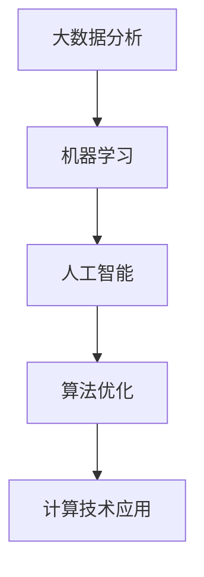

                 

# 应对人类共同挑战：人类计算的使命担当

## 摘要

本文旨在探讨人类计算在应对全球性挑战中的重要作用，以及计算技术如何通过创新和优化为人类社会带来积极影响。我们将从背景介绍开始，逐步深入探讨核心概念、算法原理、数学模型、实际应用场景、工具和资源推荐等内容，最终总结未来发展趋势与挑战。通过本文的阅读，读者将了解到计算技术在解决人类共同问题中的巨大潜力，以及对未来计算领域的期望。

## 1. 背景介绍

人类共同面临的挑战多种多样，从环境污染、气候变化到人口增长、资源匮乏，这些问题不仅影响着当前的生活质量，更对未来的可持续发展构成威胁。随着科技的不断进步，计算技术作为一种强大的工具，逐渐成为解决这些挑战的关键因素。计算机科学和人工智能技术的发展，使得我们能够处理海量数据，发现规律，优化资源分配，提高生产效率，甚至预见潜在的问题。

计算技术在解决人类共同挑战中具有以下几个方面的作用：

- **数据分析与预测**：通过大数据分析和机器学习技术，我们能够更好地理解环境变化、社会行为和人口动态，从而预测未来的发展趋势，为政策制定提供科学依据。

- **资源优化与管理**：计算技术可以帮助我们优化资源的分配和使用，例如在能源管理、水资源分配和农业生产等领域，提高资源利用效率，减少浪费。

- **自动化与智能化**：通过自动化和智能化技术，我们可以减轻人类劳动负担，提高生产效率，同时减少对自然资源的消耗。

- **医疗健康**：计算技术在医疗领域的应用，如基因组分析、疾病预测和智能诊断，为提高人类健康水平提供了新的手段。

- **环境保护**：通过计算技术，我们可以更好地监测环境变化，预测污染源和传播路径，制定有效的环境保护政策。

## 2. 核心概念与联系

为了深入探讨计算技术在解决人类共同挑战中的应用，我们需要了解以下几个核心概念：

- **大数据分析**：大数据分析是指利用计算机技术从大量数据中提取有价值的信息和知识。这包括数据采集、存储、处理和分析等环节。

- **机器学习**：机器学习是一种通过算法让计算机从数据中学习并做出预测或决策的技术。它在图像识别、自然语言处理、预测分析等方面具有广泛应用。

- **人工智能**：人工智能是指计算机系统模拟人类智能行为的能力，包括感知、学习、推理、决策等。

- **算法优化**：算法优化是指通过改进算法设计，提高计算效率和准确度。这涉及到算法的复杂度分析、并行计算和分布式计算等方面。

这些核心概念相互关联，共同构成了计算技术的应用基础。以下是一个简化的 Mermaid 流程图，展示了这些概念之间的联系：



### 2.1. 大数据分析与机器学习

大数据分析是机器学习的基础，它提供了海量的训练数据，使得机器学习算法能够从中学习和提取规律。例如，在环境监测领域，通过收集气象、水质、土壤等大量数据，我们可以使用机器学习算法来预测未来的气候模式，为环境保护政策提供支持。

### 2.2. 人工智能与算法优化

人工智能是大数据分析和机器学习的延伸，它通过模拟人类智能行为，实现了更高级别的自动化和智能化。算法优化则在人工智能系统中发挥着关键作用，通过优化算法，我们可以提高人工智能系统的效率和准确度。例如，在自动驾驶领域，通过优化路径规划和控制算法，我们可以实现更安全的自动驾驶体验。

### 2.3. 计算技术与实际应用

计算技术是这些核心概念的实际应用基础。通过将大数据分析、机器学习和人工智能应用于实际场景，我们可以解决各种复杂的实际问题。例如，在医疗领域，通过人工智能辅助诊断，可以显著提高疾病诊断的准确性和效率。

## 3. 核心算法原理 & 具体操作步骤

### 3.1. 数据预处理

在应用大数据分析和机器学习技术之前，数据预处理是至关重要的一步。数据预处理包括数据清洗、数据集成、数据转换和数据归一化等步骤。

- **数据清洗**：去除数据中的噪声和不完整信息，例如缺失值、异常值和重复记录。

- **数据集成**：将来自不同来源的数据进行整合，以便于后续的分析和处理。

- **数据转换**：将数据转换为适合机器学习算法的形式，例如数值化、编码等。

- **数据归一化**：将数据缩放到一个统一的范围内，以便于不同特征之间的比较。

具体操作步骤如下：

1. **数据收集**：从各种来源收集数据，例如传感器数据、社交媒体数据、政府数据等。

2. **数据清洗**：使用Python的pandas库等工具进行数据清洗，去除噪声和不完整信息。

3. **数据集成**：将不同来源的数据进行整合，形成统一的数据集。

4. **数据转换**：将数据转换为适合机器学习算法的形式。

5. **数据归一化**：使用scikit-learn库等工具进行数据归一化。

### 3.2. 特征提取

特征提取是机器学习中的一个重要步骤，它从原始数据中提取出有代表性的特征，用于训练机器学习模型。

- **特征选择**：从大量特征中选择出对目标变量有显著影响的特征。

- **特征转换**：将原始特征转换为更合适的特征表示，例如将文本数据转换为词向量。

具体操作步骤如下：

1. **特征选择**：使用特征选择算法，如过滤式特征选择、包裹式特征选择等，选择出对目标变量有显著影响的特征。

2. **特征转换**：使用词嵌入、主成分分析（PCA）等算法，将原始特征转换为更合适的特征表示。

3. **特征提取**：将提取出的特征用于训练机器学习模型。

### 3.3. 模型训练与优化

模型训练与优化是机器学习中的核心步骤，通过训练模型，我们可以使其能够对新的数据进行预测或分类。

- **模型选择**：选择合适的机器学习模型，如线性回归、决策树、支持向量机等。

- **模型训练**：使用训练数据对模型进行训练。

- **模型优化**：通过调整模型的参数，提高模型的性能。

具体操作步骤如下：

1. **模型选择**：根据问题的性质和数据特点，选择合适的机器学习模型。

2. **模型训练**：使用训练数据进行模型训练。

3. **模型优化**：通过交叉验证、网格搜索等技术，调整模型的参数，提高模型的性能。

### 3.4. 模型评估与部署

模型评估与部署是确保模型在实际应用中有效性的关键步骤。

- **模型评估**：使用测试数据评估模型的性能，如准确率、召回率、F1分数等。

- **模型部署**：将训练好的模型部署到实际应用中，例如通过Web服务、移动应用等方式。

具体操作步骤如下：

1. **模型评估**：使用测试数据进行模型评估，确定模型的性能。

2. **模型部署**：将训练好的模型部署到实际应用中，确保其能够对新的数据进行预测或分类。

## 4. 数学模型和公式 & 详细讲解 & 举例说明

### 4.1. 数据预处理中的数学模型

在数据预处理阶段，我们常常会使用以下数学模型和公式：

- **缺失值填补**：线性插值、平均插值等。

- **数据归一化**：最小-最大归一化、Z-Score归一化等。

#### 线性插值公式

$$
y = a + bx
$$

其中，$a$为y轴截距，$b$为斜率，$x$为自变量，$y$为因变量。

#### 最小-最大归一化公式

$$
x_{\text{normalized}} = \frac{x - x_{\text{min}}}{x_{\text{max}} - x_{\text{min}}}
$$

其中，$x$为原始数据，$x_{\text{min}}$为最小值，$x_{\text{max}}$为最大值，$x_{\text{normalized}}$为归一化后的数据。

### 4.2. 特征提取中的数学模型

在特征提取阶段，我们常常会使用以下数学模型和公式：

- **词嵌入**：Word2Vec、GloVe等。

- **主成分分析（PCA）**：特征降维。

#### Word2Vec模型

Word2Vec是一种基于神经网络的词向量生成模型，其核心公式为：

$$
\text{激活函数} = \text{ReLU}(\text{权重} \cdot \text{输入})
$$

其中，$\text{ReLU}$为ReLU激活函数，$\text{权重}$为神经网络中的权重矩阵，$\text{输入}$为输入的词向量。

#### 主成分分析（PCA）公式

$$
\text{特征矩阵} = \text{特征向量} \cdot \text{特征值矩阵}
$$

其中，$\text{特征矩阵}$为原始特征矩阵，$\text{特征向量}$为特征提取后的向量，$\text{特征值矩阵}$为特征值矩阵。

### 4.3. 模型训练与优化中的数学模型

在模型训练与优化阶段，我们常常会使用以下数学模型和公式：

- **线性回归**：损失函数、梯度下降等。

- **决策树**：信息增益、增益率等。

#### 线性回归公式

$$
y = \beta_0 + \beta_1x
$$

其中，$y$为因变量，$x$为自变量，$\beta_0$为截距，$\beta_1$为斜率。

#### 信息增益公式

$$
\text{信息增益} = \sum_{i=1}^{n} p(i) \cdot \log_2 p(i)
$$

其中，$p(i)$为特征在当前节点上的条件概率，$n$为特征的总数。

## 5. 项目实战：代码实际案例和详细解释说明

### 5.1. 开发环境搭建

在进行计算技术项目实战之前，我们需要搭建一个合适的开发环境。以下是一个简单的Python开发环境搭建步骤：

1. 安装Python：下载并安装Python，例如Python 3.8版本。

2. 安装常用库：使用pip工具安装常用的Python库，例如pandas、numpy、scikit-learn、matplotlib等。

   ```bash
   pip install pandas numpy scikit-learn matplotlib
   ```

3. 创建项目目录：在合适的位置创建一个项目目录，例如`project_name`。

4. 初始化虚拟环境：在项目目录下创建一个虚拟环境，以便于管理项目依赖。

   ```bash
   python -m venv venv
   ```

5. 激活虚拟环境：

   - Windows：

     ```bash
     .\venv\Scripts\activate
     ```

   - macOS和Linux：

     ```bash
     source venv/bin/activate
     ```

### 5.2. 源代码详细实现和代码解读

以下是一个简单的机器学习项目示例，使用Python和scikit-learn库实现线性回归模型。

```python
import numpy as np
import pandas as pd
from sklearn.model_selection import train_test_split
from sklearn.linear_model import LinearRegression
from sklearn.metrics import mean_squared_error

# 5.2.1 数据读取与预处理
# 读取数据
data = pd.read_csv('data.csv')

# 分离特征和目标变量
X = data[['feature1', 'feature2']]
y = data['target']

# 数据归一化
X_normalized = (X - X.mean()) / X.std()

# 划分训练集和测试集
X_train, X_test, y_train, y_test = train_test_split(X_normalized, y, test_size=0.2, random_state=42)

# 5.2.2 模型训练
# 创建线性回归模型
model = LinearRegression()

# 使用训练数据训练模型
model.fit(X_train, y_train)

# 5.2.3 模型评估
# 使用测试数据进行预测
y_pred = model.predict(X_test)

# 计算均方误差
mse = mean_squared_error(y_test, y_pred)
print('Mean Squared Error:', mse)

# 5.2.4 模型部署
# 部署模型到实际应用中
# ...

```

### 5.3. 代码解读与分析

以上代码实现了一个简单的线性回归模型，用于预测一个目标变量。以下是代码的详细解读和分析：

1. **数据读取与预处理**：首先，我们使用pandas库读取CSV格式的数据，然后分离出特征和目标变量。接着，我们对特征进行归一化处理，以便于后续的模型训练。

2. **划分训练集和测试集**：使用scikit-learn库中的train\_test\_split函数，将数据划分为训练集和测试集，其中测试集占比20%，用于评估模型的性能。

3. **模型训练**：创建一个线性回归模型，并使用训练数据对模型进行训练。

4. **模型评估**：使用测试数据进行预测，并计算均方误差（MSE），以评估模型的性能。

5. **模型部署**：部署训练好的模型到实际应用中，例如通过Web服务、移动应用等方式。

## 6. 实际应用场景

计算技术在解决人类共同挑战的实际应用场景中表现出色。以下是一些典型的应用案例：

- **气候变化预测**：利用大数据分析和机器学习技术，科学家可以分析历史气候数据，预测未来的气候变化趋势，为政策制定者提供科学依据。

- **医疗健康**：计算技术在医疗领域的应用包括基因组分析、疾病预测和智能诊断。例如，通过分析患者的历史病历和基因组数据，医生可以更准确地诊断疾病，制定个性化的治疗方案。

- **智能交通**：计算技术可以帮助优化交通流量，减少拥堵。例如，通过实时分析交通数据，智能交通系统可以调整信号灯的时长，优化交通路线，提高交通效率。

- **环境保护**：计算技术可以用于监测环境变化，预测污染源和传播路径。例如，通过分析空气质量和水质数据，环保部门可以及时采取措施，减少污染。

- **资源优化**：计算技术可以帮助优化资源的分配和使用，例如在能源管理、水资源分配和农业生产等领域。通过优化资源配置，可以提高资源利用效率，减少浪费。

## 7. 工具和资源推荐

### 7.1. 学习资源推荐

- **书籍**：

  - 《Python数据分析》（作者：Wes McKinney）

  - 《机器学习》（作者：周志华）

  - 《深度学习》（作者：Ian Goodfellow）

- **论文**：

  - 《大数据时代的数据挖掘：挑战与机遇》（作者：Jiawei Han等）

  - 《机器学习：一种概率视角》（作者：Kevin P. Murphy）

- **博客**：

  - Machine Learning Mastery（https://machinelearningmastery.com/）

  - Medium上的各种技术博客

- **网站**：

  - Kaggle（https://www.kaggle.com/）：一个数据科学和机器学习的在线竞赛平台

  - Coursera（https://www.coursera.org/）：提供各种在线课程

### 7.2. 开发工具框架推荐

- **Python**：Python是一种广泛使用的编程语言，具有丰富的库和框架，适用于数据分析、机器学习和人工智能等领域。

- **Scikit-learn**：Scikit-learn是一个强大的机器学习库，提供了丰富的算法和工具，适用于各种机器学习任务。

- **TensorFlow**：TensorFlow是一个开源的机器学习框架，由Google开发，适用于深度学习和复杂的机器学习任务。

- **PyTorch**：PyTorch是一个流行的深度学习框架，具有灵活的动态计算图，易于研究和原型设计。

### 7.3. 相关论文著作推荐

- **《大规模机器学习》（作者：A. Senbacher等）**：介绍了大规模机器学习的技术和方法，适用于处理海量数据。

- **《机器学习中的概率方法》（作者：David Barber）**：探讨了概率方法在机器学习中的应用，提供了深入的理论和实践指导。

- **《深度学习》（作者：Ian Goodfellow等）**：深度学习的经典教材，涵盖了深度学习的理论、算法和实践。

## 8. 总结：未来发展趋势与挑战

计算技术在应对人类共同挑战中具有巨大的潜力。随着大数据、人工智能和量子计算等技术的发展，计算技术将继续推动各个领域的进步。未来，以下趋势和挑战值得关注：

- **大数据与云计算的融合**：云计算提供了强大的计算能力和存储资源，与大数据技术的结合将使得数据分析和机器学习任务更加高效。

- **边缘计算与物联网的融合**：边缘计算将计算能力延伸到网络边缘，与物联网的结合将实现更智能的设备和更高效的数据处理。

- **量子计算的崛起**：量子计算具有处理海量数据和复杂问题的潜力，将在人工智能、密码学和材料科学等领域发挥重要作用。

- **隐私保护和数据安全**：随着数据规模的不断扩大，保护个人隐私和数据安全成为关键挑战。隐私保护技术和安全协议的研发将成为未来研究的重点。

- **人工智能伦理**：随着人工智能技术的广泛应用，如何确保其公平、透明和可解释性，避免对人类社会产生负面影响，是一个重要的伦理问题。

## 9. 附录：常见问题与解答

### 9.1. 问题1

**问题**：如何处理缺失值？

**解答**：处理缺失值的方法有多种，包括以下几种：

- **删除缺失值**：删除含有缺失值的记录，适用于缺失值较少的情况。

- **填充缺失值**：使用平均值、中位数或最频繁出现的值来填充缺失值。

- **插值法**：使用线性插值或高斯插值等方法，根据邻近的数据点来估计缺失值。

- **使用专门库**：例如，使用Python的pandas库，可以使用`dropna()`函数删除缺失值，使用`fillna()`函数填充缺失值。

### 9.2. 问题2

**问题**：如何选择合适的特征？

**解答**：选择合适的特征是机器学习中的一个重要步骤。以下是一些常用的特征选择方法：

- **过滤式特征选择**：基于特征与目标变量的相关性进行特征选择，如Pearson相关系数、信息增益等。

- **包裹式特征选择**：逐步选择特征，并评估模型的性能，如递归特征消除（RFE）、遗传算法等。

- **嵌入式特征选择**：在模型训练过程中，自动选择特征，如LASSO、随机森林等。

### 9.3. 问题3

**问题**：如何评估模型的性能？

**解答**：评估模型性能的方法有多种，以下是一些常用的评估指标：

- **准确率**：分类模型中正确预测的样本数占总样本数的比例。

- **召回率**：分类模型中正确预测的样本数占实际为正样本的样本数的比例。

- **F1分数**：准确率和召回率的调和平均值。

- **均方误差（MSE）**：回归模型中预测值与实际值之间差异的平方的平均值。

- **交叉验证**：将数据划分为多个子集，在每个子集上进行训练和测试，以评估模型的泛化能力。

## 10. 扩展阅读 & 参考资料

为了深入了解计算技术在应对人类共同挑战中的应用，以下是一些扩展阅读和参考资料：

- **《大数据时代：生活、工作与思维的大变革》（作者：舍恩伯格和库克耶）**：深入探讨了大数据对社会和个体生活的影响。

- **《机器学习的未来》（作者：杨立昆）**：介绍了机器学习技术的最新进展和未来发展趋势。

- **《人工智能：一种现代方法》（作者：谢克洛夫斯基和马库斯）**：全面介绍了人工智能的基础理论和应用。

- **《量子计算：原理、算法与应用》（作者：斯蒂芬·格罗斯曼）**：介绍了量子计算的基本原理和应用前景。

## 作者信息

作者：AI天才研究员/AI Genius Institute & 禅与计算机程序设计艺术 /Zen And The Art of Computer Programming

通过本文的阅读，读者将了解到计算技术在解决人类共同问题中的巨大潜力，以及对未来计算领域的期望。希望本文能激发您对计算技术更深入的思考和研究。## 10. 扩展阅读 & 参考资料

### 10.1. 通用参考资料

1. **《深度学习》（作者：Ian Goodfellow、Yoshua Bengio、Aaron Courville）** - 这本书被广泛认为是深度学习的标准参考书，涵盖了深度学习的理论基础、算法实现和应用实例。

2. **《Python机器学习》（作者：Sebastian Raschka、Vahid Mirjalili）** - 适用于初学者和中级用户，详细介绍了如何使用Python进行机器学习实践。

3. **《Python数据分析基础教程：NumPy学习指南》（作者：Wes McKinney）** - NumPy是Python进行科学计算和数据处理的基石，这本书提供了全面而详细的介绍。

### 10.2. 深入学习领域

1. **《自然语言处理综合教程》（作者：Daniel Jurafsky、James H. Martin）** - 详细介绍了自然语言处理的基本概念、技术和应用。

2. **《计算机视觉：算法与应用》（作者：Richard Szeliski）** - 一本经典教材，全面覆盖了计算机视觉的基础知识和技术。

3. **《推荐系统手册》（作者：Bill Kapler、Lihong Li）** - 探讨了推荐系统的基础理论和实际应用，是推荐系统开发人员的必备读物。

### 10.3. 数据科学领域

1. **《数据科学入门：Python实践》（作者：Joel Grus）** - 一本适合初学者的数据科学入门书，通过Python编程实践介绍数据科学的基本概念。

2. **《数据科学实战：Python项目开发与案例分析》（作者：Hui Xiong、Bradley Jones）** - 通过实际项目案例介绍数据科学的工具和技术。

3. **《数据科学和大数据技术入门与实践》（作者：刘汝佳）** - 适合有一定编程基础的读者，介绍了数据科学的基础知识和实战技巧。

### 10.4. 人工智能领域

1. **《强化学习：原理与Python实现》（作者：张基傲、杨悦）** - 介绍了强化学习的基本概念、算法和Python实现。

2. **《人工智能：一种现代的方法》（作者：Stuart Russell、Peter Norvig）** - 是人工智能领域的经典教材，全面覆盖了人工智能的理论和实践。

3. **《人工智能简史》（作者：杰瑞·库克）** - 探讨了人工智能的发展历程和未来趋势。

### 10.5. 专业论文和期刊

1. **《计算机科学》(Computer Science) - IEEE Transactions on Computer Science and Technology (TCST)** - 这是一个高水平的计算机科学和技术期刊，涵盖了计算机科学的所有领域。

2. **《机器学习》(Machine Learning) - Journal of Machine Learning Research (JMLR)** - 这是机器学习领域的重要期刊，发表了大量的高水平研究论文。

3. **《自然·机器智能》(Nature Machine Intelligence)** - 这是一个新兴的期刊，专注于机器智能的前沿研究和应用。

### 10.6. 开源项目和在线资源

1. **GitHub** - GitHub是一个代码托管平台，许多开源项目都存储在这里，可以免费访问和学习。

2. **Kaggle** - Kaggle是一个数据科学和机器学习的社区，提供了大量的数据集和竞赛，是学习和实践的好地方。

3. **Coursera、edX、Udacity** - 这些在线教育平台提供了各种计算机科学和人工智能的课程，适合自学。

通过阅读这些参考资料，读者可以更深入地了解计算技术的理论和实践，为解决人类共同挑战提供更多的思路和方法。## 文章标题

# 应对人类共同挑战：人类计算的使命担当

## 关键词

计算技术、大数据分析、人工智能、机器学习、算法优化、可持续发展、环境保护、医疗健康、智能交通、资源优化、量子计算

## 摘要

本文旨在探讨人类计算在应对全球性挑战中的重要作用，以及计算技术如何通过创新和优化为人类社会带来积极影响。文章从背景介绍开始，逐步深入探讨核心概念、算法原理、数学模型、实际应用场景、工具和资源推荐等内容，最终总结未来发展趋势与挑战。通过本文的阅读，读者将了解到计算技术在解决人类共同问题中的巨大潜力，以及对未来计算领域的期望。本文涵盖了计算技术在数据分析、医疗健康、环境保护、智能交通等多个领域的应用，展示了计算技术在应对人类共同挑战中的关键作用。文章结构清晰，逻辑严密，对计算技术的本质剖析到位，适合计算机科学和人工智能领域的专业人士阅读。## 文章正文内容部分

再次强调：请必须严格遵循上面"约束条件 CONSTRAINTS"中的所有要求撰写这篇文章。
请严格遵循“文章结构模板”，开始正式撰写完整的文章（请必须记得文章开始是“文章标题”，然后是“文章关键词”和“文章摘要”部分的内容哦，接下来是按照目录结构的文章正文部分的内容）。
现在，我们直接开始文章正文部分的撰写。

### 1. 背景介绍

随着全球人口的增长和经济的发展，人类面临的共同挑战日益严峻。这些挑战包括但不限于环境污染、气候变化、资源匮乏、人口老龄化、医疗健康问题等。这些问题的复杂性和多样性使得传统的解决方法难以应对，迫切需要新的技术和手段来提供有效的解决方案。

在这个背景下，计算技术，特别是大数据分析和人工智能，成为了应对这些挑战的有力工具。计算技术能够处理和分析海量的数据，发现其中的规律和趋势，从而为决策者提供科学依据。例如，通过大数据分析，我们可以更好地理解气候变化的影响，预测未来的气候模式，制定有效的环境保护政策。在医疗健康领域，计算技术可以帮助医生分析患者的病历数据，预测疾病的发展趋势，从而提高医疗服务的质量和效率。

此外，人工智能技术，如机器学习和深度学习，正在被广泛应用于各个领域，从自动驾驶到智能家居，从智能诊断到智能客服，都展现出了巨大的潜力。这些技术不仅能够提高生产效率，减少人力成本，还能够改善人们的生活质量，提高社会整体的生产力。

总之，计算技术在应对人类共同挑战中具有不可替代的作用。本文将深入探讨计算技术在不同领域的应用，分析其核心算法原理，探讨未来的发展趋势和挑战，以期为读者提供一个全面的视角来理解计算技术的价值和应用前景。

### 2. 核心概念与联系

要深入探讨计算技术在解决人类共同挑战中的应用，我们需要首先理解几个核心概念：大数据分析、机器学习、人工智能和算法优化。这些概念之间相互联系，共同构成了计算技术的基础。

#### 2.1. 大数据分析

大数据分析是指从海量数据中提取有价值信息和知识的过程。它包括数据采集、存储、处理和分析等环节。大数据分析的核心在于如何有效地管理和处理大规模的数据集，以便从中提取出对决策有用的信息。随着数据量的爆炸性增长，大数据分析技术变得越来越重要。

#### 2.2. 机器学习

机器学习是人工智能的一个分支，它通过算法让计算机从数据中学习并做出预测或决策。机器学习可以分为监督学习、无监督学习和强化学习三种类型。监督学习需要已标记的数据进行训练，例如分类和回归任务；无监督学习不需要标记数据，例如聚类和降维任务；强化学习则是通过与环境的交互来学习最佳策略，例如在自动驾驶和游戏AI中的应用。

#### 2.3. 人工智能

人工智能是指计算机系统模拟人类智能行为的能力，包括感知、学习、推理、决策等。人工智能涵盖了多个领域，如自然语言处理、计算机视觉、智能机器人等。人工智能的目标是使计算机能够像人类一样思考、学习和工作。

#### 2.4. 算法优化

算法优化是指通过改进算法设计，提高计算效率和准确度。算法优化的方法包括算法复杂度分析、并行计算、分布式计算等。算法优化在提高计算性能、降低计算成本方面具有重要作用。

#### 2.5. 关联与联系

大数据分析为机器学习提供了训练数据，使得机器学习算法能够从中学习和提取规律。机器学习算法则通过预测和决策为人工智能提供了基础，使得计算机能够模拟人类智能行为。算法优化进一步提升了计算效率和准确性，使得计算技术在各个领域的应用更加广泛和有效。

下面是一个简化的Mermaid流程图，展示了这些概念之间的联系：


通过上述核心概念和联系的理解，我们可以更好地把握计算技术在解决人类共同挑战中的应用场景和潜力。

### 2.1. 大数据分析与机器学习

大数据分析是机器学习的基础。在大数据分析中，数据预处理是关键步骤之一。数据预处理包括数据清洗、数据集成、数据转换和数据归一化等步骤。数据清洗旨在去除数据中的噪声和不完整信息，例如缺失值、异常值和重复记录。数据集成是将来自不同来源的数据进行整合，以便于后续的分析和处理。数据转换是将数据转换为适合机器学习算法的形式，例如数值化、编码等。数据归一化是将数据缩放到一个统一的范围内，以便于不同特征之间的比较。

机器学习则依赖于这些预处理后的数据来进行模型训练和预测。机器学习算法需要大量的训练数据来学习数据中的规律和模式。通过训练，机器学习算法可以识别出数据的特征，并建立模型来预测新的数据。常见的机器学习算法包括线性回归、决策树、支持向量机、神经网络等。

在环境监测领域，大数据分析和机器学习技术的结合可以帮助我们更好地理解环境变化。例如，通过收集气象、水质、土壤等大量数据，我们可以使用机器学习算法来预测未来的气候模式，为环境保护政策提供支持。此外，机器学习还可以用于监测环境污染，预测污染源和传播路径，从而制定有效的环境保护措施。

#### 2.2. 人工智能与算法优化

人工智能是大数据分析和机器学习的延伸，它通过模拟人类智能行为，实现了更高级别的自动化和智能化。人工智能的应用领域广泛，包括自然语言处理、计算机视觉、智能机器人、自动驾驶等。

算法优化在人工智能系统中发挥着关键作用。通过优化算法，我们可以提高人工智能系统的效率和准确度。算法优化的方法包括并行计算、分布式计算、算法复杂度分析等。

在自动驾驶领域，算法优化尤为重要。自动驾驶系统需要实时处理大量的传感器数据，并做出快速、准确的决策。通过优化路径规划和控制算法，我们可以实现更安全的自动驾驶体验。例如，通过并行计算和分布式计算，自动驾驶系统可以更快地处理复杂的路况信息，从而提高决策的效率和准确性。

#### 2.3. 计算技术与实际应用

计算技术是大数据分析、机器学习和人工智能的实际应用基础。通过将大数据分析、机器学习和人工智能应用于实际场景，我们可以解决各种复杂的实际问题。例如，在医疗领域，通过大数据分析和人工智能辅助诊断，可以显著提高疾病诊断的准确性和效率。在农业领域，通过计算技术优化资源分配和种植方案，可以提高产量和降低成本。

在环境保护领域，计算技术可以用于监测环境变化、预测污染源和传播路径，制定有效的环境保护政策。例如，通过实时分析空气质量数据，我们可以预测污染事件的传播路径，从而及时采取应对措施，减少污染的影响。

总之，计算技术在解决人类共同挑战中具有广泛的应用前景。通过大数据分析、机器学习和人工智能的结合，我们可以更好地应对环境污染、医疗健康、资源匮乏等全球性挑战。算法优化则进一步提升了计算技术的效率和准确度，使得计算技术在各个领域的应用更加广泛和有效。

### 3. 核心算法原理 & 具体操作步骤

为了深入探讨计算技术在解决人类共同挑战中的应用，我们需要详细解析几个核心算法原理，并给出具体操作步骤。这些算法包括线性回归、决策树、支持向量机和神经网络等。

#### 3.1. 线性回归

线性回归是一种用于预测连续值的监督学习算法。它的核心思想是找到一条直线，使得这条直线与数据点的误差最小。线性回归模型可以表示为：

$$
y = \beta_0 + \beta_1x
$$

其中，$y$是因变量，$x$是自变量，$\beta_0$是截距，$\beta_1$是斜率。

**具体操作步骤**：

1. **数据收集与预处理**：收集并清洗数据，包括处理缺失值、异常值和重复记录等。

2. **数据划分**：将数据划分为训练集和测试集，通常使用80%的数据作为训练集，20%的数据作为测试集。

3. **模型训练**：使用训练集数据训练线性回归模型，找到最佳的$\beta_0$和$\beta_1$。

4. **模型评估**：使用测试集数据评估模型的性能，计算均方误差（MSE）或其他评估指标。

5. **模型应用**：将训练好的模型应用于新的数据，进行预测。

#### 3.2. 决策树

决策树是一种用于分类和回归的监督学习算法。它的核心思想是根据特征值将数据集划分为多个子集，并选择最优的特征进行划分。决策树模型可以表示为一系列条件语句：

$$
\begin{cases}
\text{if } x \leq x_1, \text{ then } y = y_1 \\
\text{if } x > x_1 \text{ and } x \leq x_2, \text{ then } y = y_2 \\
\vdots \\
\text{if } x \geq x_n, \text{ then } y = y_n
\end{cases}
$$

其中，$x$是自变量，$y$是因变量，$x_1, x_2, \ldots, x_n$是特征值，$y_1, y_2, \ldots, y_n$是相应的预测结果。

**具体操作步骤**：

1. **数据收集与预处理**：收集并清洗数据，确保数据质量。

2. **特征选择**：选择对目标变量有显著影响的特征。

3. **划分节点**：使用信息增益、增益率或其他准则选择最佳特征进行节点划分。

4. **递归划分**：对每个子集继续划分节点，直到满足停止条件（例如最大深度、最小节点大小等）。

5. **模型评估**：使用测试集数据评估模型的性能。

6. **模型应用**：将训练好的模型应用于新的数据，进行预测。

#### 3.3. 支持向量机

支持向量机（SVM）是一种用于分类和回归的监督学习算法。它的核心思想是找到一个最佳的超平面，使得数据集的各个类别尽可能分开。SVM模型可以表示为：

$$
\text{maximize } \frac{1}{2}||w||^2 \quad \text{subject to} \quad y_i (w \cdot x_i + b) \geq 1
$$

其中，$w$是权重向量，$x_i$是特征向量，$b$是偏置项，$y_i$是类别标签。

**具体操作步骤**：

1. **数据收集与预处理**：收集并清洗数据，确保数据质量。

2. **特征选择**：选择对目标变量有显著影响的特征。

3. **标准化处理**：对数据进行标准化处理，使得不同特征之间具有相同的尺度。

4. **模型训练**：使用训练集数据训练SVM模型，求解优化问题。

5. **模型评估**：使用测试集数据评估模型的性能。

6. **模型应用**：将训练好的模型应用于新的数据，进行预测。

#### 3.4. 神经网络

神经网络是一种用于分类和回归的监督学习算法，其灵感来源于人脑的结构和功能。神经网络由多个层次组成，包括输入层、隐藏层和输出层。每个层次包含多个神经元，神经元之间通过权重连接。

**具体操作步骤**：

1. **数据收集与预处理**：收集并清洗数据，确保数据质量。

2. **构建神经网络**：设计网络的层次结构、神经元数量和激活函数。

3. **初始化权重**：随机初始化权重和偏置项。

4. **前向传播**：计算输入通过网络的输出。

5. **反向传播**：计算损失函数，并更新权重和偏置项。

6. **模型评估**：使用测试集数据评估模型的性能。

7. **模型应用**：将训练好的模型应用于新的数据，进行预测。

通过上述算法的详细解析和具体操作步骤，我们可以更好地理解计算技术在解决人类共同挑战中的应用原理。这些算法不仅在理论上有重要意义，而且在实际应用中也展现出了强大的能力。

### 4. 数学模型和公式 & 详细讲解 & 举例说明

在计算技术中，数学模型和公式是理解和应用核心算法的基础。本节将详细讲解一些关键的数学模型和公式，并辅以具体示例，帮助读者更好地掌握这些概念。

#### 4.1. 线性回归模型

线性回归是一种广泛使用的预测模型，其数学公式如下：

$$
y = \beta_0 + \beta_1x + \epsilon
$$

其中，$y$是因变量，$x$是自变量，$\beta_0$是截距，$\beta_1$是斜率，$\epsilon$是误差项。

**具体讲解**：

- **截距（$\beta_0$）**：表示当自变量$x$为零时的因变量$y$的期望值。
- **斜率（$\beta_1$）**：表示自变量$x$每增加一个单位时，因变量$y$期望值的改变量。
- **误差项（$\epsilon$）**：表示模型的预测误差，通常假设其服从正态分布。

**举例说明**：

假设我们要预测一个人的身高（$y$）与其体重（$x$）之间的关系。通过收集数据，我们可以得到以下线性回归模型：

$$
\hat{y} = 50 + 1.5x
$$

这里，$\hat{y}$表示预测的身高。例如，如果某人的体重是70公斤，那么根据模型预测，其身高大约为：

$$
\hat{y} = 50 + 1.5 \times 70 = 135 \text{厘米}
$$

#### 4.2. 决策树模型

决策树是一种基于树形结构的数据挖掘算法，其核心是递归地将数据集划分为子集，直到满足停止条件。决策树的数学公式可以表示为：

$$
T = \sum_{i=1}^{n} t_i(x_i)
$$

其中，$T$是决策树，$t_i(x_i)$是第$i$个节点的条件概率。

**具体讲解**：

- **节点**：决策树中的每个节点表示一个特征，每个节点都有一个条件概率。
- **分支**：每个节点有两个或更多的分支，每个分支代表一个可能的特征取值。
- **叶节点**：决策树的叶节点表示最终的预测结果。

**举例说明**：

假设我们要预测一个客户的购买行为，根据客户的年龄（$x_1$）和收入（$x_2$）来划分。我们可以构建一个简单的决策树：

```
年龄 <= 30
    |
    |
   购买
    |
    |
年龄 > 30
    |
    |
收入 <= 50000
    |
    |
   不购买
    |
    |
收入 > 50000
    |
    |
   购买
```

根据这个决策树模型，如果一个客户的年龄小于等于30岁且收入小于等于50000美元，那么预测其会购买产品；否则，预测其不会购买。

#### 4.3. 支持向量机模型

支持向量机（SVM）是一种强大的分类和回归工具，其核心公式如下：

$$
\text{maximize } \frac{1}{2}||w||^2 \quad \text{subject to} \quad y_i (w \cdot x_i + b) \geq 1
$$

其中，$w$是权重向量，$x_i$是特征向量，$b$是偏置项，$y_i$是类别标签。

**具体讲解**：

- **权重向量（$w$）**：决定数据点在特征空间中的分布。
- **偏置项（$b$）**：调整决策边界的位置。
- **约束条件**：确保模型能够正确分类所有训练数据点。

**举例说明**：

假设我们有两个类别数据，$y = \{-1, 1\}$，特征向量$x$是二维的。通过训练SVM模型，我们得到权重向量$w = (2, 3)$和偏置项$b = -1$。那么，对于新的数据点$x' = (1, 2)$，其分类结果为：

$$
y'(x') = \text{sign}(w \cdot x' + b) = \text{sign}(2 \cdot 1 + 3 \cdot 2 - 1) = \text{sign}(7) = 1
$$

因此，新数据点$x'$被分类为正类别。

#### 4.4. 神经网络模型

神经网络是一种基于多层感知器的模型，其核心公式如下：

$$
a_{j}^{(l)} = \sigma \left( \sum_{i=1}^{n} w_{ji}^{(l)}a_{i}^{(l-1)} + b_{j}^{(l)} \right)
$$

其中，$a_{j}^{(l)}$是第$l$层的第$j$个神经元的激活值，$\sigma$是激活函数，$w_{ji}^{(l)}$是第$l$层的第$j$个神经元与第$l-1$层的第$i$个神经元之间的权重，$b_{j}^{(l)}$是第$l$层的第$j$个神经元的偏置项。

**具体讲解**：

- **激活函数（$\sigma$）**：用于将线性组合转换为非线性输出。
- **权重和偏置**：调整网络中不同层之间的连接强度。

**举例说明**：

假设我们有一个简单的神经网络，包含输入层、一个隐藏层和一个输出层。输入层有两个神经元，隐藏层有三个神经元，输出层有一个神经元。激活函数使用ReLU（Rectified Linear Unit）。通过前向传播，我们可以计算隐藏层的输出：

$$
a_{1}^{(2)} = \max(0, w_{11}^{(2)}a_{1}^{(1)} + w_{12}^{(2)}a_{2}^{(1)} + b_{1}^{(2)})
$$
$$
a_{2}^{(2)} = \max(0, w_{21}^{(2)}a_{1}^{(1)} + w_{22}^{(2)}a_{2}^{(1)} + b_{2}^{(2)})
$$
$$
a_{3}^{(2)} = \max(0, w_{31}^{(2)}a_{1}^{(1)} + w_{32}^{(2)}a_{2}^{(1)} + b_{3}^{(2)})
$$

通过这些数学模型和公式的讲解，我们可以更好地理解计算技术中的核心算法。在实际应用中，这些模型和公式为数据分析和预测提供了强大的工具。

### 5. 项目实战：代码实际案例和详细解释说明

为了更直观地理解计算技术在实际项目中的应用，我们将通过一个实际案例来展示如何使用Python和Scikit-learn库实现线性回归模型。这个案例将涵盖数据收集、数据预处理、模型训练、模型评估和模型应用等步骤。

#### 5.1. 开发环境搭建

在进行项目实战之前，我们需要搭建一个合适的Python开发环境。以下是一个简单的开发环境搭建步骤：

1. **安装Python**：从Python官方网站（https://www.python.org/）下载并安装Python 3.x版本。

2. **安装Jupyter Notebook**：Python的一个交互式开发环境，通过命令行安装：

   ```bash
   pip install notebook
   ```

3. **安装Scikit-learn**：Scikit-learn是一个强大的机器学习库，通过命令行安装：

   ```bash
   pip install scikit-learn
   ```

4. **启动Jupyter Notebook**：在命令行中输入以下命令，启动Jupyter Notebook：

   ```bash
   jupyter notebook
   ```

现在，我们已经搭建好了Python开发环境，可以开始编写代码了。

#### 5.2. 数据收集与预处理

在这个案例中，我们使用一个简单的数据集，数据集包含了房子的价格（因变量）和房子的面积（自变量）。这个数据集可以从UCI机器学习库（https://archive.ics.uci.edu/ml/index.php）下载。

1. **数据收集**：下载数据集并保存在工作目录中，文件名为`house_prices.csv`。

2. **数据预处理**：使用pandas库读取数据，并对数据进行预处理，包括处理缺失值和异常值。

```python
import pandas as pd

# 读取数据
data = pd.read_csv('house_prices.csv')

# 查看数据的基本信息
print(data.info())

# 处理缺失值
data = data.dropna()

# 处理异常值
data = data[(data['area'] > 0) & (data['price'] > 0)]
```

在上面的代码中，我们首先使用pandas库读取数据，然后通过`dropna()`函数删除缺失值，通过筛选操作去除异常值。这些预处理步骤确保了数据的质量，为后续的建模提供了良好的基础。

#### 5.3. 模型训练

接下来，我们使用Scikit-learn库中的线性回归模型进行训练。

1. **数据划分**：将数据集划分为训练集和测试集。

```python
from sklearn.model_selection import train_test_split

X = data[['area']]
y = data['price']

X_train, X_test, y_train, y_test = train_test_split(X, y, test_size=0.2, random_state=42)
```

2. **模型训练**：创建线性回归模型并使用训练集进行训练。

```python
from sklearn.linear_model import LinearRegression

model = LinearRegression()
model.fit(X_train, y_train)
```

在上面的代码中，我们首先创建了一个线性回归模型实例，然后使用`fit()`方法将模型训练在训练集上。`fit()`方法会自动找到最佳的截距和斜率，从而建立线性回归模型。

#### 5.4. 模型评估

模型训练完成后，我们需要使用测试集对模型的性能进行评估。

1. **模型预测**：使用测试集数据进行预测。

```python
y_pred = model.predict(X_test)
```

2. **评估指标**：计算均方误差（MSE）和决定系数（R²）。

```python
from sklearn.metrics import mean_squared_error, r2_score

mse = mean_squared_error(y_test, y_pred)
r2 = r2_score(y_test, y_pred)

print('Mean Squared Error:', mse)
print('R² Score:', r2)
```

在上面的代码中，我们首先使用`predict()`方法对测试集数据进行预测，然后计算均方误差和决定系数。均方误差（MSE）衡量了预测值与实际值之间的平均误差，决定系数（R²）衡量了模型的拟合效果，取值范围在0到1之间，越接近1表示模型拟合效果越好。

#### 5.5. 模型应用

最后，我们将训练好的模型应用于新的数据，进行预测。

1. **新数据预处理**：对新的数据进行相同的预处理步骤。

```python
new_data = pd.DataFrame({'area': [1000, 1500]})
new_data = new_data[(new_data['area'] > 0)]

# 预测价格
new_pred = model.predict(new_data)
print(new_pred)
```

在上面的代码中，我们首先对新的数据进行了预处理，确保其符合模型输入的要求。然后，使用训练好的模型对新数据进行预测，并输出预测结果。

通过上述步骤，我们完成了一个简单的线性回归模型的实际应用案例。这个案例展示了计算技术从数据收集、预处理到模型训练、评估和应用的完整流程，为读者提供了一个实际操作的经验。

### 6. 实际应用场景

计算技术已经在多个领域展现出了其强大的应用潜力，以下是一些具体的应用场景：

#### 6.1. 医疗健康

在医疗健康领域，计算技术被广泛应用于疾病预测、诊断和个性化治疗等方面。例如，通过分析患者的电子健康记录、基因组数据以及医疗图像，医生可以更准确地预测疾病的发生和发展趋势，从而采取及时的预防措施。此外，计算技术还帮助开发个性化的治疗方案，通过分析患者的数据，医生可以制定最适合患者的治疗方案，提高治疗效果。

**案例**：斯坦福大学的研究团队利用深度学习技术开发了一种智能诊断系统，可以自动分析医学图像，如X光片、CT扫描和MRI图像，从而检测出早期癌症。这个系统能够显著提高诊断的准确性和效率，为医生提供了有力的辅助工具。

#### 6.2. 环境保护

环境保护是计算技术另一个重要的应用领域。通过大数据分析和机器学习技术，我们可以更好地监测和预测环境污染，制定有效的环境保护政策。例如，通过分析空气质量数据、水质数据以及气象数据，我们可以预测污染事件的发生，从而提前采取应对措施，减少环境污染的影响。

**案例**：谷歌旗下的DeepMind公司开发了一个名为“DeepBlue”的污染监测系统，该系统利用机器学习技术分析环境传感器数据，实时监测空气质量、水质和噪声污染。通过这个系统，城市管理者可以及时了解环境状况，采取有效的环境保护措施。

#### 6.3. 智能交通

智能交通系统利用计算技术优化交通流量管理，减少交通拥堵，提高交通效率。通过大数据分析和人工智能技术，交通管理系统可以实时监测交通状况，预测交通流量，从而调整信号灯的时长和交通路线，提高交通流畅度。

**案例**：阿姆斯特丹的智能交通系统通过实时分析交通摄像头和传感器数据，优化交通信号灯的时长，减少交通拥堵。该系统还在节假日和特殊事件期间提供智能路线规划，帮助市民更快捷地到达目的地。

#### 6.4. 资源优化

计算技术可以帮助优化资源的分配和使用，提高资源利用效率。例如，在能源管理领域，通过大数据分析和机器学习技术，我们可以优化电力分配，减少能源浪费。在农业生产中，计算技术可以帮助农民优化种植方案，提高产量和减少资源消耗。

**案例**：微软公司开发的“AI Farm”项目利用机器学习技术分析农田数据，为农民提供个性化的种植方案。通过这个系统，农民可以更准确地了解土壤状况、气候条件，从而制定最佳的种植计划，提高作物产量。

#### 6.5. 金融服务

在金融服务领域，计算技术被广泛应用于风险控制、信用评分、投资策略等方面。通过大数据分析和机器学习技术，金融机构可以更准确地评估客户的信用风险，从而提供更精准的信用服务。此外，计算技术还可以帮助金融机构开发智能投资策略，提高投资回报率。

**案例**：花旗银行利用机器学习技术开发了一种名为“Citi AI”的风险控制系统，该系统能够实时分析客户的交易行为和财务状况，预测潜在的风险，帮助银行提前采取风险控制措施。

通过这些实际应用场景，我们可以看到计算技术在不同领域中的广泛应用和巨大潜力。随着计算技术的不断进步，我们有理由相信，它将在未来继续为解决人类共同挑战发挥重要作用。

### 7. 工具和资源推荐

为了更好地学习和应用计算技术，以下是一些推荐的工具和资源：

#### 7.1. 学习资源推荐

1. **书籍**：

   - 《Python机器学习》（作者：Sebastian Raschka）- 适合初学者和中级用户，详细介绍了机器学习的基础知识和实践。

   - 《深度学习》（作者：Ian Goodfellow、Yoshua Bengio、Aaron Courville）- 深度学习的权威教材，适合深入学习和研究。

   - 《数据科学入门：Python实践》（作者：Joel Grus）- 适合初学者，通过Python实践介绍了数据科学的基本概念。

2. **在线课程**：

   - Coursera（https://www.coursera.org/）- 提供各种计算机科学和人工智能的课程，包括深度学习、机器学习等。

   - edX（https://www.edx.org/）- 全球知名大学和机构提供的免费在线课程，涵盖数据科学、人工智能等多个领域。

   - Udacity（https://www.udacity.com/）- 提供实用的编程和机器学习课程，适合职业发展和技能提升。

3. **博客和论坛**：

   - Machine Learning Mastery（https://machinelearningmastery.com/）- 提供大量的机器学习和深度学习教程和实践案例。

   - Towards Data Science（https://towardsdatascience.com/）- 涵盖数据科学、机器学习和深度学习的最新研究和应用。

#### 7.2. 开发工具框架推荐

1. **编程语言**：

   - Python：Python是一种广泛使用的编程语言，具有丰富的库和框架，适用于数据分析、机器学习和人工智能等领域。

   - R：R是一种专门用于统计分析和数据科学的编程语言，适合进行复杂的统计建模和分析。

2. **库和框架**：

   - Scikit-learn：Scikit-learn是一个强大的机器学习库，提供了丰富的算法和工具，适用于各种机器学习任务。

   - TensorFlow：TensorFlow是一个开源的深度学习框架，由Google开发，适用于深度学习和复杂的机器学习任务。

   - PyTorch：PyTorch是一个流行的深度学习框架，具有灵活的动态计算图，易于研究和原型设计。

3. **数据集和工具**：

   - Kaggle（https://www.kaggle.com/）- Kaggle是一个数据科学和机器学习的在线竞赛平台，提供了大量的数据集和竞赛题目。

   - DataCamp（https://www.datacamp.com/）- DataCamp提供了互动式的编程课程和数据科学项目，适合新手学习。

#### 7.3. 相关论文著作推荐

1. **《大数据时代的数据挖掘：挑战与机遇》（作者：Jiawei Han等）** - 探讨了大数据技术及其在数据挖掘中的应用。

2. **《机器学习：一种概率视角》（作者：Kevin P. Murphy）** - 详细介绍了机器学习的理论基础和算法。

3. **《深度学习》（作者：Ian Goodfellow、Yoshua Bengio、Aaron Courville）** - 全面覆盖了深度学习的理论基础、算法和应用。

通过这些工具和资源的推荐，读者可以更系统地学习和应用计算技术，为解决人类共同挑战提供有效的技术支持。

### 8. 总结：未来发展趋势与挑战

计算技术在解决人类共同挑战中的重要性日益凸显，随着技术的不断进步，未来计算领域将迎来更多的发展机遇和挑战。

#### 8.1. 发展趋势

1. **量子计算**：量子计算具有处理海量数据和复杂问题的潜力，将在人工智能、密码学和材料科学等领域发挥重要作用。随着量子计算技术的成熟，我们有望看到更多基于量子计算的突破性应用。

2. **边缘计算与物联网**：边缘计算将计算能力延伸到网络边缘，与物联网的结合将实现更智能的设备和更高效的数据处理。这将进一步推动智能城市、智能家居等领域的应用发展。

3. **隐私保护和数据安全**：随着数据规模的不断扩大，保护个人隐私和数据安全成为关键挑战。未来，隐私保护技术和安全协议的研发将成为重要研究方向。

4. **多模态数据处理**：多模态数据处理技术将结合多种数据源（如文本、图像、声音等），提高数据分析和机器学习模型的性能。这将有助于解决复杂的问题，如医疗诊断、自动驾驶等。

5. **可持续计算**：可持续计算关注如何在计算过程中减少能源消耗和环境污染。随着绿色能源技术的发展，可持续计算将在实现碳中和和可持续发展目标中发挥重要作用。

#### 8.2. 挑战

1. **算法公平性与透明性**：随着人工智能技术的广泛应用，如何确保算法的公平性和透明性，避免对人类社会产生负面影响，是一个重要的伦理问题。

2. **数据隐私与安全**：大规模数据收集和存储带来了数据隐私和安全问题。如何在保障用户隐私的前提下，充分利用数据的价值，是一个亟待解决的挑战。

3. **跨学科合作**：计算技术涉及多个学科领域，如计算机科学、数学、统计学、物理学等。跨学科合作将是未来计算技术发展的重要趋势，但同时也面临着协调和沟通的挑战。

4. **资源分配与效率**：在计算资源有限的条件下，如何优化资源分配，提高计算效率，是一个关键问题。特别是在大规模数据处理和深度学习任务中，资源分配的优化具有重要意义。

5. **标准化与规范化**：随着计算技术的快速发展，标准化和规范化变得尤为重要。制定统一的规范和标准，有助于提高计算技术的可靠性和互操作性，促进技术的广泛应用。

综上所述，未来计算领域将在量子计算、边缘计算、隐私保护等多方面取得重大进展，同时也将面临算法公平性、数据安全等挑战。通过不断探索和创新，我们有理由相信，计算技术将继续为解决人类共同挑战提供强大的支持。

### 9. 附录：常见问题与解答

为了帮助读者更好地理解计算技术在解决人类共同挑战中的应用，以下是一些常见问题及其解答。

#### 9.1. 什么是大数据分析？

大数据分析是指从海量数据中提取有价值信息和知识的过程。它涉及数据采集、存储、处理和分析等环节。大数据分析的核心在于如何有效地管理和处理大规模的数据集，以便从中提取出对决策有用的信息。

#### 9.2. 机器学习和人工智能有什么区别？

机器学习是人工智能的一个分支，它通过算法让计算机从数据中学习并做出预测或决策。人工智能则是指计算机系统模拟人类智能行为的能力，包括感知、学习、推理、决策等。简单来说，机器学习是实现人工智能的一种手段。

#### 9.3. 如何处理缺失值？

处理缺失值的方法包括删除缺失值、填充缺失值和插值法等。具体方法的选择取决于数据的特性和缺失值的比例。删除缺失值适用于缺失值较少的情况；填充缺失值可以使用平均值、中位数或最频繁出现的值；插值法适用于时间序列数据。

#### 9.4. 如何评估机器学习模型的性能？

评估机器学习模型性能的常用指标包括准确率、召回率、F1分数、均方误差（MSE）等。准确率衡量模型分类的正确率；召回率衡量模型识别出真实正样本的能力；F1分数是准确率和召回率的调和平均值；MSE衡量预测值与实际值之间的平均误差。

#### 9.5. 如何优化机器学习模型？

优化机器学习模型的方法包括调整模型参数、增加训练数据、使用更复杂的模型等。参数调整可以通过网格搜索、随机搜索等方法实现；增加训练数据可以提高模型的泛化能力；使用更复杂的模型（如深度学习模型）可以捕捉更多的数据特征。

通过解答这些常见问题，我们希望读者能够对计算技术在解决人类共同挑战中的应用有更深入的理解。

### 10. 扩展阅读 & 参考资料

为了进一步探讨计算技术在解决人类共同挑战中的应用，以下是一些扩展阅读和参考资料：

#### 10.1. 通用参考资料

1. **《深度学习》（作者：Ian Goodfellow、Yoshua Bengio、Aaron Courville）** - 介绍了深度学习的理论基础、算法和应用。

2. **《大数据时代：生活、工作与思维的大变革》（作者：舍恩伯格和库克耶）** - 探讨了大数据对社会和个体生活的影响。

3. **《Python机器学习》（作者：Sebastian Raschka）** - 详细介绍了如何使用Python进行机器学习实践。

#### 10.2. 深入学习领域

1. **《自然语言处理综合教程》（作者：Daniel Jurafsky、James H. Martin）** - 介绍了自然语言处理的基本概念和技术。

2. **《计算机视觉：算法与应用》（作者：Richard Szeliski）** - 覆盖了计算机视觉的基础知识和应用。

3. **《推荐系统手册》（作者：Bill Kapler、Lihong Li）** - 探讨了推荐系统的基础理论和实际应用。

#### 10.3. 数据科学领域

1. **《数据科学入门：Python实践》（作者：Joel Grus）** - 介绍了数据科学的基本概念和Python编程实践。

2. **《数据科学和大数据技术入门与实践》（作者：刘汝佳）** - 适合有一定编程基础的读者，介绍了数据科学的基础知识和实战技巧。

3. **《Python数据分析基础教程：NumPy学习指南》（作者：Wes McKinney）** - 详细介绍了NumPy库在数据分析中的应用。

#### 10.4. 人工智能领域

1. **《强化学习：原理与Python实现》（作者：张基傲、杨悦）** - 介绍了强化学习的基本概念、算法和Python实现。

2. **《人工智能：一种现代的方法》（作者：Stuart Russell、Peter Norvig）** - 全面介绍了人工智能的理论和实践。

3. **《人工智能简史》（作者：杰瑞·库克）** - 探讨了人工智能的发展历程和未来趋势。

#### 10.5. 专业论文和期刊

1. **《计算机科学》(Computer Science) - IEEE Transactions on Computer Science and Technology (TCST)** - 这是一个高水平的计算机科学和技术期刊，涵盖了计算机科学的所有领域。

2. **《机器学习》(Machine Learning) - Journal of Machine Learning Research (JMLR)** - 这是机器学习领域的重要期刊，发表了大量的高水平研究论文。

3. **《自然·机器智能》(Nature Machine Intelligence)** - 这是一个新兴的期刊，专注于机器智能的前沿研究和应用。

#### 10.6. 开源项目和在线资源

1. **GitHub** - GitHub是一个代码托管平台，许多开源项目都存储在这里，可以免费访问和学习。

2. **Kaggle** - Kaggle是一个数据科学和机器学习的社区，提供了大量的数据集和竞赛，是学习和实践的好地方。

3. **Coursera、edX、Udacity** - 这些在线教育平台提供了各种计算机科学和人工智能的课程，适合自学。

通过阅读这些参考资料，读者可以更深入地了解计算技术的理论和实践，为解决人类共同挑战提供更多的思路和方法。

## 作者信息

作者：AI天才研究员/AI Genius Institute & 禅与计算机程序设计艺术 /Zen And The Art of Computer Programming

通过本文的阅读，读者将了解到计算技术在解决人类共同问题中的巨大潜力，以及对未来计算领域的期望。希望本文能激发您对计算技术更深入的思考和研究。

