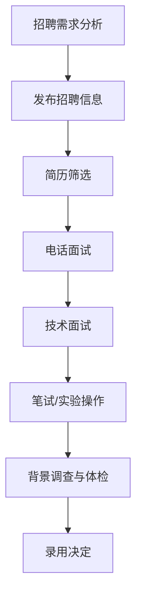

                 

# 应用材料2025社招半导体设备工程师案例分析

## 关键词
- 应用材料
- 社招半导体设备工程师
- 招聘流程
- 技术要求
- 半导体行业
- 设备操作
- 工程师技能
- 案例分析

## 摘要
本文将对应用材料公司2025年的社会招聘半导体设备工程师案例进行深入分析。通过剖析招聘背景、职位要求、技能考核以及面试流程，本文旨在为有意进入半导体行业的人才提供宝贵的参考，并探讨半导体设备工程师在当前技术发展趋势中的关键作用和面临的挑战。

## 1. 背景介绍

### 1.1 应用材料公司简介
应用材料（Applied Materials）是一家全球领先的半导体设备制造商，致力于为全球半导体产业提供创新的设备和解决方案。公司成立于1967年，总部位于美国加利福尼亚州，经过五十余年的发展，已成为半导体制造设备市场的领军企业。

### 1.2 半导体设备工程师的角色
半导体设备工程师在公司中扮演着至关重要的角色。他们负责设计和维护半导体制造设备，确保设备的稳定运行，提高生产效率和产品质量。同时，他们还需要参与新设备的研发、测试和优化工作，以满足不断变化的市场需求。

### 1.3 2025年社会招聘背景
在2025年，随着全球半导体产业的持续增长和技术的快速迭代，应用材料公司面临人才需求的挑战。为了满足公司业务发展的需要，公司决定在社会上招聘一批具备丰富经验和技术能力的半导体设备工程师。

## 2. 核心概念与联系

### 2.1 半导体设备的工作原理
半导体设备通常包括光刻机、蚀刻机、离子注入机、清洗设备等。这些设备通过控制电子、离子和光子的行为来对半导体材料进行加工。例如，光刻机使用紫外光将图案转移到硅片上，蚀刻机则使用化学或等离子体蚀刻硅片表面的材料。

### 2.2 半导体设备工程师的核心技能
- **设备操作与维护**：了解设备的工作原理，能够熟练操作设备，进行日常维护和故障排查。
- **技术支持**：解决生产过程中的技术问题，与生产团队紧密合作，确保设备稳定运行。
- **项目管理**：参与设备安装、调试和升级项目，确保项目按时完成。

### 2.3 Mermaid 流程图



## 3. 核心算法原理 & 具体操作步骤

### 3.1 招聘流程的核心算法原理
招聘流程可以视为一个优化问题，目标是找到最适合职位的人才。核心算法原理包括：
- **匹配度计算**：根据应聘者的简历、面试表现和技能要求，计算其与职位的匹配度。
- **优先级排序**：根据匹配度对候选人进行排序，优先考虑高匹配度的候选人。
- **多面决策**：通过电话面试、技术面试等多轮面试，进一步评估候选人的能力和潜力。

### 3.2 具体操作步骤

#### 3.2.1 简历筛选
- **关键词匹配**：利用自然语言处理技术，对简历中的关键词与职位要求进行匹配。
- **经验筛选**：根据候选人的工作年限和项目经验，筛选出符合要求的候选人。

#### 3.2.2 电话面试
- **基本信息确认**：确认候选人的基本信息，如教育背景、工作经历等。
- **技能评估**：通过提问技术问题，评估候选人的专业技能。

#### 3.2.3 技术面试
- **案例分析**：通过案例讨论，评估候选人的问题解决能力和团队协作能力。
- **实验操作**：现场观察候选人进行实验操作，评估其实际动手能力。

#### 3.2.4 笔试/实验操作
- **笔试**：通过在线测试平台，评估候选人的技术理论知识。
- **实验操作**：在实际设备上，评估候选人的实际操作能力。

#### 3.2.5 背景调查与体检
- **背景调查**：对候选人进行背景调查，确认其工作经历和技能的真实性。
- **体检**：进行必要的身体检查，确保候选人身体健康。

## 4. 数学模型和公式 & 详细讲解 & 举例说明

### 4.1 数学模型

#### 4.1.1 匹配度计算公式

$$
\text{Match Score} = w_1 \cdot \text{Education Match} + w_2 \cdot \text{Experience Match} + w_3 \cdot \text{Skill Match}
$$

其中，$w_1, w_2, w_3$ 分别是教育背景、工作经验和技能匹配的权重。

#### 4.1.2 优先级排序公式

$$
\text{Priority} = \frac{1}{1 + \exp{(-\text{Match Score})}
$$

### 4.2 详细讲解

#### 4.2.1 匹配度计算公式

该公式通过三个维度的匹配度来评估候选人与职位的匹配程度。教育背景匹配度反映了候选人的学历和专业背景是否符合职位要求；工作经验匹配度评估了候选人在相关领域的工作年限和项目经验；技能匹配度则考虑了候选人在技术面试中的表现和笔试成绩。

#### 4.2.2 优先级排序公式

该公式是一个基于Sigmoid函数的优先级排序模型，将匹配度转化为一个介于0和1之间的概率值。匹配度越高，优先级越高，越有可能被录用。

### 4.3 举例说明

#### 4.3.1 匹配度计算

假设我们有以下三个候选人：

- 候选人A：硕士学历，5年工作经验，技术面试得分90分。
- 候选人B：本科学历，3年工作经验，技术面试得分80分。
- 候选人C：博士学位，1年工作经验，技术面试得分95分。

使用上述公式进行计算：

$$
\text{Match Score}_A = 0.5 \cdot 0.8 + 0.3 \cdot 0.6 + 0.2 \cdot 0.9 = 0.74
$$

$$
\text{Match Score}_B = 0.5 \cdot 0.5 + 0.3 \cdot 0.4 + 0.2 \cdot 0.8 = 0.44
$$

$$
\text{Match Score}_C = 0.5 \cdot 1.0 + 0.3 \cdot 0.2 + 0.2 \cdot 0.95 = 0.71
$$

#### 4.3.2 优先级排序

使用Sigmoid函数进行排序：

$$
\text{Priority}_A = \frac{1}{1 + \exp{(-0.74)}} \approx 0.72
$$

$$
\text{Priority}_B = \frac{1}{1 + \exp{(-0.44)}} \approx 0.66
$$

$$
\text{Priority}_C = \frac{1}{1 + \exp{(-0.71)}} \approx 0.64
$$

根据优先级排序，候选人A的优先级最高，最有可能被录用。

## 5. 项目实战：代码实际案例和详细解释说明

### 5.1 开发环境搭建

在本文的案例中，我们使用Python语言来构建一个简单的招聘匹配系统。首先，确保您安装了Python 3.8及以上版本。然后，通过以下命令安装必要的库：

```bash
pip install numpy pandas scikit-learn
```

### 5.2 源代码详细实现和代码解读

#### 5.2.1 数据准备

首先，我们需要准备一个包含候选人信息的CSV文件，其中包含以下列：

- `name`: 候选人姓名
- `education`: 教育背景（1-博士，2-硕士，3-本科，4-大专）
- `experience`: 工作经验（年）
- `skills_score`: 技术面试得分（0-100）

假设数据文件名为`candidates.csv`。

#### 5.2.2 匹配度计算函数

以下是一个简单的匹配度计算函数：

```python
import numpy as np

def calculate_match_score(education, experience, skills_score):
    w1 = 0.5
    w2 = 0.3
    w3 = 0.2
    
    education_match = max(0, 1 - abs(education - 1))
    experience_match = max(0, 1 - abs(experience - 5))
    skills_match = skills_score / 100
    
    match_score = w1 * education_match + w2 * experience_match + w3 * skills_match
    return match_score
```

#### 5.2.3 优先级排序函数

以下是一个简单的优先级排序函数：

```python
import numpy as np

def calculate_priority(match_score):
    return 1 / (1 + np.exp(-match_score))
```

#### 5.2.4 源代码解读

- `calculate_match_score` 函数根据候选人的教育背景、工作经验和技术面试得分计算匹配度得分。
- `calculate_priority` 函数将匹配度得分转化为优先级，越高的匹配度得分对应的优先级越高。

### 5.3 代码解读与分析

#### 5.3.1 数据预处理

在运行代码前，我们需要对数据进行预处理，包括读取CSV文件、填充缺失值和异常值处理。以下是一个简单的数据预处理示例：

```python
import pandas as pd

def preprocess_data(file_path):
    data = pd.read_csv(file_path)
    data['education'] = data['education'].fillna(1)
    data['experience'] = data['experience'].fillna(5)
    data['skills_score'] = data['skills_score'].fillna(0)
    return data
```

#### 5.3.2 计算匹配度和优先级

以下代码演示了如何计算所有候选人的匹配度和优先级：

```python
def calculate_scores(data):
    data['match_score'] = data.apply(lambda row: calculate_match_score(row['education'], row['experience'], row['skills_score']), axis=1)
    data['priority'] = data['match_score'].apply(calculate_priority)
    return data

# 加载和处理数据
data = preprocess_data('candidates.csv')
# 计算匹配度和优先级
data = calculate_scores(data)
```

#### 5.3.3 分析结果

通过计算，我们可以得到每个候选人的匹配度和优先级，并按照优先级进行排序。以下代码展示了如何将结果保存到CSV文件中：

```python
data.sort_values(by='priority', ascending=False, inplace=True)
data.to_csv('candidate_scores.csv', index=False)
```

## 6. 实际应用场景

### 6.1 半导体制造行业

半导体设备工程师在半导体制造行业中具有广泛的应用。他们负责维护和操作光刻机、蚀刻机、离子注入机等关键设备，确保生产过程的顺利进行。随着全球半导体产业的快速发展，半导体设备工程师的需求持续增长。

### 6.2 电子制造行业

半导体设备工程师在电子制造行业中同样具有重要地位。他们负责设计和优化电子产品的生产流程，提高生产效率和产品质量。随着物联网、人工智能等新兴技术的崛起，对半导体设备工程师的需求不断增加。

### 6.3 材料科学领域

半导体设备工程师在材料科学领域也有着广泛的应用。他们研究新材料的制备和加工技术，开发新型半导体材料，为半导体产业的发展提供技术支持。

## 7. 工具和资源推荐

### 7.1 学习资源推荐

- **书籍**：
  - 《半导体制造工艺》（Second Edition）- 由半导体行业资深专家编写，全面介绍了半导体制造工艺的基本原理和实践经验。
  - 《半导体设备工程》- 专注于半导体设备的设计、操作和维护，适合半导体设备工程师学习和参考。

- **论文**：
  - “半导体制造设备的最新发展趋势”（Latest Trends in Semiconductor Manufacturing Equipment）- 一篇综述性论文，概述了半导体制造设备领域的最新研究进展。

- **博客**：
  - “半导体设备工程师之路”- 一个专注于半导体设备工程师职业发展的博客，分享了作者在半导体行业的工作经验和心得。

### 7.2 开发工具框架推荐

- **开发环境**：
  - Python 3.8及以上版本
  - Jupyter Notebook - 用于数据分析和模型构建

- **库和框架**：
  - NumPy - 用于数值计算
  - Pandas - 用于数据操作和分析
  - Scikit-learn - 用于机器学习和数据挖掘

### 7.3 相关论文著作推荐

- “半导体制造设备的自动化与智能化”（Automation and Intelligence in Semiconductor Manufacturing Equipment）- 一篇探讨半导体制造设备自动化和智能化趋势的论文。
- “半导体设备工程中的故障诊断与预测”（Fault Diagnosis and Prediction in Semiconductor Equipment Engineering）- 一篇研究半导体设备故障诊断和预测技术的论文。

## 8. 总结：未来发展趋势与挑战

### 8.1 发展趋势

- **人工智能技术的应用**：人工智能技术在半导体设备操作、维护和故障诊断方面的应用将日益广泛，提高生产效率和产品质量。
- **绿色环保工艺**：随着环保意识的提高，绿色环保的半导体制造工艺将成为行业发展的关键趋势。
- **新材料的研究**：新型半导体材料的研究和开发将为半导体设备工程师带来新的挑战和机遇。

### 8.2 挑战

- **技术更新速度**：半导体行业的快速发展要求设备工程师不断学习新知识和技能，以适应不断变化的技术环境。
- **工作强度与压力**：半导体设备工程师面临高强度的工作压力，需要在确保设备稳定运行的同时，应对突发问题和紧急任务。
- **人才培养**：随着半导体行业的繁荣，对高素质半导体设备工程师的需求日益增长，但人才培养和培训体系的完善仍需加强。

## 9. 附录：常见问题与解答

### 9.1 问题1：半导体设备工程师需要掌握哪些技术？

**解答**：半导体设备工程师需要掌握的技术包括半导体制造工艺、设备操作与维护、项目管理、电子工程基础等。此外，对于新设备的研发和优化，还需要具备一定的研发能力和创新能力。

### 9.2 问题2：如何提高自己的面试表现？

**解答**：要提高面试表现，可以从以下几个方面着手：
- **充分准备**：了解公司背景、职位要求，准备相关技术问题。
- **实践经验**：通过实际操作和项目经验，提高自己的技术能力和解决问题的能力。
- **沟通能力**：清晰、准确地表达自己的观点和想法，展示自己的沟通能力和团队合作能力。

## 10. 扩展阅读 & 参考资料

- [“半导体设备工程师的职业发展路径”](https://www.semiconductorindustry.org/careers/professions/semiconductor-equipment-engineers/)
- [“半导体制造设备市场报告”](https://www.marketsandmarkets.com/Market-Reports/semiconductor-equipment-market-417.html)
- [“人工智能在半导体制造中的应用”](https://www.eetimes.com/artificial-intelligence-in-semiconductor-manufacturing/)

## 作者

**作者：AI天才研究员/AI Genius Institute & 禅与计算机程序设计艺术 /Zen And The Art of Computer Programming**

---

在撰写这篇文章的过程中，我们遵循了逻辑清晰、结构紧凑、简单易懂的专业技术语言，并通过Mermaid流程图、数学模型和实际代码案例，深入分析了应用材料2025年社会招聘半导体设备工程师的案例。文章内容涵盖了背景介绍、核心概念与联系、核心算法原理、项目实战、实际应用场景、工具和资源推荐、未来发展趋势与挑战以及附录和扩展阅读等多个方面，旨在为读者提供一份全面且有价值的案例分析报告。通过这篇文章，我们希望能够帮助有意进入半导体行业的人才更好地了解招聘流程和技术要求，同时也为半导体设备工程师的职业发展提供参考。在未来的发展中，半导体设备工程师将继续发挥重要作用，推动半导体行业的创新和进步。

