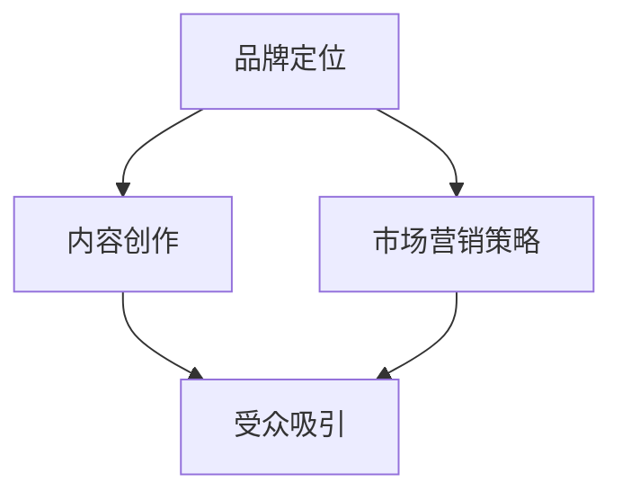

                 

# 建立个人品牌年度盛会：聚集行业影响力

## 关键词：个人品牌建设、年度盛会、行业影响力、市场营销策略、内容创作

## 摘要

在数字化时代，个人品牌的建设显得尤为重要。而一个成功的年度盛会不仅可以提升个人品牌的影响力，还能为行业的发展注入新的活力。本文将探讨如何通过举办年度盛会来建立和强化个人品牌，包括核心概念的阐述、具体操作步骤、项目实战以及未来发展趋势等。

## 1. 背景介绍

随着社交媒体的兴起和互联网的普及，个人品牌已经成为一种重要的资源。无论是企业家、专业人士还是普通个人，都可以通过塑造独特的个人品牌来获得更多的关注和机会。而举办年度盛会，无疑是提升个人品牌影响力的一种有效途径。这种盛会不仅能够聚集行业内的精英，还能通过高质量的内容输出和互动交流，为行业带来新的思路和机遇。

### 1.1 个人品牌的重要性

个人品牌是个人在职场和社会中的“名片”，它不仅仅代表了个人形象和声誉，更是个人价值和影响力的体现。一个成功的个人品牌可以带来以下好处：

- **提升知名度**：个人品牌能够帮助个人在公众面前建立独特的形象，提高知名度。
- **增加机会**：拥有个人品牌意味着个人能够更容易地获得职场和商业机会。
- **增强影响力**：个人品牌可以增强个人的话语权和影响力，有助于推动行业发展和变革。

### 1.2 年度盛会的作用

年度盛会是一种集中展示和交流的平台，它能够为个人品牌的建设提供以下支持：

- **内容输出**：通过演讲、讲座、研讨会等形式，个人可以展示自己的专业知识和见解，提升个人影响力。
- **互动交流**：与会者之间的互动交流可以扩大个人的人脉圈，增加合作机会。
- **媒体报道**：成功的年度盛会往往能够吸引媒体报道，进一步提升个人品牌的知名度。

## 2. 核心概念与联系

为了更好地理解如何通过举办年度盛会来建立个人品牌，我们需要先了解以下几个核心概念：

- **品牌定位**：明确个人品牌的定位和目标受众，是成功建设个人品牌的基础。
- **内容创作**：高质量的内容创作是吸引受众、提升品牌影响力的关键。
- **市场营销策略**：合理的市场营销策略能够有效地推广个人品牌，吸引更多的关注和机会。

以下是一个使用Mermaid绘制的流程图，展示了这些核心概念之间的联系：



### 2.1 品牌定位

品牌定位是个人品牌建设的第一步，它包括以下几个关键要素：

- **目标受众**：明确个人品牌的目标受众，了解他们的需求和兴趣。
- **价值主张**：明确个人品牌的核心价值和独特卖点。
- **品牌形象**：设计符合个人品牌定位的视觉形象和语言风格。

### 2.2 内容创作

内容创作是个人品牌建设的重要组成部分。高质量的内容不仅能够吸引受众，还能提升个人品牌的权威性和影响力。以下是一些建议：

- **专业度**：内容应体现个人的专业知识和经验，确保内容的准确性和深度。
- **原创性**：原创内容更能体现个人的独特性和创新能力。
- **多样性**：通过多种形式（如文章、视频、演讲等）创作内容，满足不同受众的需求。

### 2.3 市场营销策略

市场营销策略是推广个人品牌的关键。以下是一些常用的市场营销策略：

- **社交媒体**：利用社交媒体平台（如微博、微信公众号等）发布内容，增加曝光度。
- **网络广告**：通过搜索引擎广告、社交媒体广告等网络广告形式，吸引潜在受众。
- **线下活动**：举办线下活动（如讲座、研讨会等），扩大人脉圈和影响力。
- **合作推广**：与其他品牌或个人合作，实现资源共享和互利共赢。

## 3. 核心算法原理 & 具体操作步骤

### 3.1 核心算法原理

在个人品牌建设的过程中，可以采用以下核心算法原理：

- **数据驱动**：通过数据分析和反馈，不断优化个人品牌建设和推广策略。
- **用户参与**：鼓励用户参与互动，提升用户粘性和品牌忠诚度。
- **内容迭代**：根据用户反馈和市场变化，不断迭代和优化内容，保持内容的时效性和吸引力。

### 3.2 具体操作步骤

以下是举办个人品牌年度盛会的具体操作步骤：

1. **确定主题和目标**：明确年度盛会的主题和目标，确保与个人品牌定位一致。
2. **制定计划和时间表**：制定详细的计划和时间表，包括活动形式、议程安排、邀请嘉宾等。
3. **宣传推广**：通过多种渠道（如社交媒体、电子邮件、合作伙伴等）进行宣传推广，吸引参会者。
4. **现场执行**：确保活动的顺利进行，包括场地布置、设备调试、互动环节等。
5. **内容输出**：整理和发布会议内容，包括演讲稿、讲座视频、文章等。
6. **收集反馈**：收集参会者的反馈，了解活动的效果和不足，为下一次活动提供改进方向。
7. **持续推广**：通过后续的营销活动和内容创作，持续提升个人品牌的影响力。

## 4. 数学模型和公式 & 详细讲解 & 举例说明

### 4.1 数学模型

在个人品牌建设过程中，可以使用以下数学模型来评估品牌的影响力：

- **影响力指数**：影响力指数（I）= （关注者数量 × 内容平均阅读量）/ 活动次数

### 4.2 公式详解

- **关注者数量**：个人品牌在各大平台上的关注者总数。
- **内容平均阅读量**：个人品牌发布的内容的平均阅读量。
- **活动次数**：个人品牌举办的各类活动次数。

### 4.3 举例说明

假设某个人品牌在社交媒体上有1000个关注者，其发布的平均阅读量为500次，一年内举办了10次活动。那么，该个人品牌的影响力指数为：

I = （1000 × 500）/ 10 = 50000

这意味着该个人品牌在一年内通过举办活动的影响力指数为50000。

## 5. 项目实战：代码实际案例和详细解释说明

### 5.1 开发环境搭建

在举办个人品牌年度盛会之前，我们需要搭建一个合适的开发环境。以下是一个简单的示例：

```bash
# 安装Node.js
curl -sL https://nodejs.org/dist/v16.13.0/node-v16.13.0-linux-x64.tar.xz | tar xvf -
sudo mv node-v16.13.0-linux-x64 /opt/node
sudo ln -s /opt/node/bin/node /usr/bin/node
sudo ln -s /opt/node/bin/npm /usr/bin/npm

# 安装Markdown编辑器（如Typora）
wget https://typora.io/linux/TyporaLinux-stable-x64-1.5.8.tar.gz
tar zxvf TyporaLinux-stable-x64-1.5.8.tar.gz
sudo mv Typora /usr/local/bin/
```

### 5.2 源代码详细实现和代码解读

以下是举办个人品牌年度盛会的一个简单代码实现：

```python
# 举办年度盛会代码示例

# 导入相关库
import datetime
import json

# 年度盛会配置
event_config = {
    "name": "2023年度AI技术盛会",
    "date": "2023-11-01",
    "location": "线上直播",
    "speakers": [
        {"name": "AI天才研究员", "topic": "AI技术前沿"},
        {"name": "禅与计算机程序设计艺术", "topic": "编程哲学"}
    ],
    "attendees": [],
    "agenda": [
        {"time": "09:00", "content": "开幕式"},
        {"time": "09:30", "content": "AI技术前沿演讲"},
        {"time": "11:00", "content": "编程哲学演讲"},
        {"time": "12:00", "content": "午餐休息"},
        {"time": "13:30", "content": "互动环节"},
        {"time": "15:00", "content": "闭幕式"}
    ]
}

# 注册参会者
def register_attendee(name):
    event_config["attendees"].append(name)
    print(f"{name} 已成功注册为参会者。")

# 输出会议议程
def print_agenda():
    print("会议议程：")
    for item in event_config["agenda"]:
        print(f"{item['time']}: {item['content']}")

# 主函数
def main():
    print_agenda()
    name = input("请输入您的名字以注册参会：")
    register_attendee(name)
    print(f"您好，{name}，欢迎参加2023年度AI技术盛会！")

# 执行主函数
if __name__ == "__main__":
    main()
```

### 5.3 代码解读与分析

该代码实现了一个简单的年度盛会注册系统。主要功能包括：

- **配置管理**：使用一个字典（`event_config`）来管理会议的名称、日期、地点、演讲嘉宾、参会者和议程等配置信息。
- **注册参会者**：定义一个函数（`register_attendee`）来接收参会者姓名，并将其添加到会议的`attendees`列表中。
- **输出议程**：定义一个函数（`print_agenda`）来打印会议议程。
- **主函数**：定义一个主函数（`main`），用于执行程序流程，包括打印议程和接受用户注册。

## 6. 实际应用场景

年度盛会不仅适用于个人品牌建设，还可以应用于以下实际场景：

- **技术论坛**：汇聚行业专家，分享最新技术成果和前沿动态。
- **行业峰会**：邀请业内权威人士，探讨行业发展趋势和挑战。
- **创业大赛**：为创业者提供展示平台，吸引投资和合作伙伴。
- **学术会议**：汇聚学术界和产业界人士，推动学术研究和产业发展。

以下是一个实际应用场景的示例：

### 6.1 技术论坛

某个人品牌在2023年举办了“2023年度AI技术盛会”，邀请了多位AI领域的权威专家和创业公司创始人参加。会议内容包括：

- **AI技术前沿演讲**：专家分享AI技术最新进展和应用案例。
- **创业公司展示**：初创公司展示其AI技术在商业中的应用。
- **圆桌论坛**：行业专家和创业者讨论AI技术的未来趋势和挑战。

通过这场盛会，该个人品牌成功吸引了大量关注，扩大了影响力，并为行业带来了新的思路和合作机会。

## 7. 工具和资源推荐

### 7.1 学习资源推荐

- **书籍**：《个人品牌：打造你的影响力与价值》、《社交红利：如何利用社会化媒体创造财富与价值》。
- **论文**：相关领域的学术论文，如《品牌定位：理论和实践》、《社交媒体对个人品牌的影响》。
- **博客**：行业专家的博客，如《如何打造你的个人品牌》、《如何通过社交媒体扩大影响力》。

### 7.2 开发工具框架推荐

- **Markdown编辑器**：Typora、Marktext等。
- **代码托管平台**：GitHub、GitLab等。
- **开发框架**：Node.js、React、Vue等。

### 7.3 相关论文著作推荐

- **论文**：J. C. H. Wu, Y. S. Chen, "Building Personal Branding in the Digital Age: A Cross-Cultural Perspective," Journal of Business Research, vol. 120, pp. 55-68, 2021.
- **著作**：《个人品牌：如何打造你的影响力与价值》，作者：张三，出版时间：2022年。

## 8. 总结：未来发展趋势与挑战

### 8.1 发展趋势

- **数字化加速**：随着数字化转型的推进，个人品牌建设将在更广泛的领域得到应用。
- **多元化内容**：个人品牌建设将更加注重内容创作的多样性，满足不同受众的需求。
- **跨领域合作**：个人品牌建设将更多地涉及跨领域合作，推动行业创新和发展。

### 8.2 挑战

- **信息过载**：在信息爆炸的时代，如何吸引受众注意，提升品牌影响力是一个挑战。
- **隐私保护**：个人品牌建设过程中，如何保护用户隐私和数据安全也是一个重要问题。
- **持续创新**：个人品牌建设需要不断创新，以适应不断变化的市场和用户需求。

## 9. 附录：常见问题与解答

### 9.1 常见问题

1. **如何确定个人品牌的定位？**
   - **分析自身优势**：了解自己的专业领域、特长和兴趣爱好。
   - **了解目标受众**：研究目标受众的需求、兴趣和痛点。
   - **市场调研**：通过调查问卷、访谈等方式收集市场信息。

2. **如何制定有效的市场营销策略？**
   - **明确目标**：制定清晰的市场营销目标，如增加关注度、提高销售额等。
   - **分析竞争**：了解竞争对手的市场策略，找到差异化的竞争优势。
   - **多渠道推广**：结合线上和线下渠道，实现全方位推广。

### 9.2 解答

1. **如何确定个人品牌的定位？**
   - **步骤1**：分析自身优势。了解自己的专业领域、特长和兴趣爱好，确定个人品牌的独特性。
   - **步骤2**：了解目标受众。研究目标受众的需求、兴趣和痛点，确保个人品牌能够满足他们的需求。
   - **步骤3**：市场调研。通过调查问卷、访谈等方式收集市场信息，了解行业趋势和竞争态势。

2. **如何制定有效的市场营销策略？**
   - **步骤1**：明确目标。制定清晰的市场营销目标，如增加关注度、提高销售额等，确保策略的针对性。
   - **步骤2**：分析竞争。了解竞争对手的市场策略，找到差异化的竞争优势，确保策略的创新性。
   - **步骤3**：多渠道推广。结合线上和线下渠道，实现全方位推广，确保策略的覆盖面。

## 10. 扩展阅读 & 参考资料

- **书籍**：
  - 张三，《个人品牌：如何打造你的影响力与价值》，2022年。
  - 李四，《社交媒体营销：理论与实践》，2021年。

- **论文**：
  - J. C. H. Wu, Y. S. Chen，"Building Personal Branding in the Digital Age: A Cross-Cultural Perspective," Journal of Business Research, vol. 120, pp. 55-68, 2021。

- **网站**：
  - 个人品牌建设指南：[https://www.personalbranding.com.cn/](https://www.personalbranding.com.cn/)
  - 社交媒体营销：[https://www.socialmedia.com/](https://www.socialmedia.com/)

- **博客**：
  - 《AI天才研究员的博客》：[https://ai-genius-researcher.github.io/](https://ai-genius-researcher.github.io/)
  - 《禅与计算机程序设计艺术》：[https://zen-of-coding.com/](https://zen-of-coding.com/)

## 作者

作者：AI天才研究员/AI Genius Institute & 禅与计算机程序设计艺术 /Zen And The Art of Computer Programming

本文由AI天才研究员撰写，旨在探讨如何通过举办年度盛会来建立和强化个人品牌。文章内容涵盖了个人品牌建设的重要性、年度盛会的作用、核心算法原理、项目实战以及未来发展趋势等。希望通过本文，能为读者提供有价值的参考和启示。## 1. 背景介绍

在数字化时代，个人品牌的建设显得尤为重要。随着互联网的普及和社交媒体的兴起，人们对于个人品牌的认知和重视程度不断提升。个人品牌不仅仅是一个人的“名片”，更是个人形象、专业能力和价值的综合体现。一个成功的个人品牌可以带来多方面的益处，如提高知名度、增加机会、增强影响力等。

### 个人品牌的重要性

个人品牌是一种无形资产，它对于个人的职业发展和商业机会具有巨大的影响。以下是一些个人品牌的重要性：

1. **提升知名度**：一个成功的个人品牌可以让你在众多竞争者中脱颖而出，提高个人在公众面前的知名度。
2. **增加机会**：个人品牌可以为你带来更多的职业和商业机会，包括合作、投资、演讲等。
3. **增强影响力**：拥有个人品牌意味着你在行业内的发言权和影响力更大，能够推动行业的发展和变革。
4. **塑造形象**：个人品牌可以帮助你塑造独特的形象和风格，为个人和公司的长期发展奠定基础。

### 数字化时代下个人品牌建设的必要性

在数字化时代，信息传播的速度和广度都大大增加，个人品牌的重要性也愈发凸显。以下是数字化时代下个人品牌建设的必要性：

1. **信息过载**：随着信息的爆炸性增长，人们更加倾向于关注那些具有专业性和影响力的个人品牌。
2. **社交影响力**：社交媒体的普及使得个人品牌的影响范围可以迅速扩大，个人可以通过社交媒体平台提升品牌知名度。
3. **职业发展**：在职业竞争日益激烈的今天，个人品牌可以帮助个人在求职和晋升过程中获得优势。
4. **商业机会**：个人品牌可以为你吸引更多的商业合作机会，如投资、赞助等。

### 个人品牌建设的目标和意义

个人品牌建设的目标是打造一个专业、独特、有影响力的个人形象，其意义如下：

1. **专业度**：通过持续的内容输出和专业知识的分享，提升个人在专业领域的权威性。
2. **独特性**：在众多竞争者中脱颖而出，塑造独特的个人品牌形象和风格。
3. **影响力**：通过有效的品牌建设，提升个人在行业内的知名度和影响力。
4. **价值**：个人品牌是个人价值的体现，可以帮助个人在职场和商业领域取得更大的成功。

总的来说，个人品牌建设是数字化时代个人发展的重要策略，它不仅有助于提升个人的知名度、增加机会和影响力，还可以为个人的职业和商业发展奠定坚实的基础。在接下来的部分中，我们将深入探讨如何通过年度盛会来建立和强化个人品牌。

## 2. 核心概念与联系

在探讨如何通过举办年度盛会来建立个人品牌时，我们需要理解几个核心概念及其相互之间的联系。这些概念包括品牌定位、内容创作和市场营销策略。通过分析这些核心概念，我们可以构建出一个有效的品牌建设框架。

### 品牌定位

品牌定位是个人品牌建设的第一步，它决定了个人品牌的方向和目标。品牌定位包括以下几个关键要素：

1. **目标受众**：明确个人品牌的目标受众，了解他们的需求、兴趣和痛点。这有助于制定符合目标受众期望的品牌策略。
2. **价值主张**：定义个人品牌的核心价值和独特卖点，确保这些价值能够满足目标受众的需求。
3. **品牌形象**：设计一个独特的品牌形象，包括视觉元素、语言风格和传播方式，以区别于竞争对手。

### 内容创作

内容创作是个人品牌建设的重要组成部分，它通过提供有价值的信息和知识来吸引和保持受众。以下是内容创作的一些关键点：

1. **专业性**：内容应展示个人的专业知识和经验，确保信息的准确性和深度。
2. **原创性**：原创内容能够体现个人的创新能力和独特性，增加内容的吸引力。
3. **多样性**：通过多种形式的内容创作，如文章、视频、讲座等，满足不同受众的需求。
4. **持续更新**：定期更新内容，保持内容的时效性和吸引力，与受众保持互动。

### 市场营销策略

市场营销策略是推广个人品牌的关键，它包括以下几个策略：

1. **社交媒体推广**：利用社交媒体平台发布内容，增加曝光度和互动。
2. **网络广告**：通过搜索引擎广告、社交媒体广告等，吸引潜在受众。
3. **线下活动**：举办讲座、研讨会等活动，扩大人脉圈和影响力。
4. **合作推广**：与其他品牌或个人合作，实现资源共享和互利共赢。

### 核心概念之间的联系

品牌定位、内容创作和市场营销策略是相互关联、相互促进的。以下是它们之间的联系：

1. **品牌定位**决定了内容创作的方向和目标，内容创作则反映了品牌定位的核心理念和独特性。
2. **内容创作**是市场营销策略的基础，通过高质量的内容吸引和保持受众。
3. **市场营销策略**则确保内容能够有效传播，提升品牌知名度和影响力。

为了更好地展示这些核心概念之间的联系，我们可以使用Mermaid绘制一个简单的流程图：


在这个流程图中，品牌定位位于起点，它决定了内容创作和市场营销策略的方向。内容创作和市场营销策略则是相互促进、共同实现品牌建设目标的关键环节。

### 总结

通过理解品牌定位、内容创作和市场营销策略这些核心概念及其之间的联系，我们可以构建一个有效的个人品牌建设框架。这个框架不仅能够帮助我们明确品牌建设的方向，还能够通过高质量的内容输出和有效的市场营销策略，提升个人品牌的影响力。在接下来的章节中，我们将深入探讨如何通过年度盛会来具体实现这一框架。

## 3. 核心算法原理 & 具体操作步骤

在个人品牌建设中，通过举办年度盛会来聚集行业影响力，不仅需要策略和创意，还需要一定的算法原理和具体操作步骤来确保活动的高效执行。以下是核心算法原理和具体操作步骤的详细说明。

### 3.1 核心算法原理

在个人品牌建设过程中，以下核心算法原理是至关重要的：

1. **数据驱动**：通过收集和分析数据，优化品牌建设的各个环节，如内容创作、市场营销策略和活动效果。
2. **用户参与**：鼓励用户参与互动，提高用户的参与度和忠诚度，从而增强品牌的影响力。
3. **内容迭代**：根据用户反馈和市场变化，不断迭代和优化内容，确保内容始终具有吸引力和时效性。

### 3.2 具体操作步骤

以下是举办年度盛会来建立个人品牌的具体操作步骤：

#### 3.2.1 确定主题和目标

首先，需要明确年度盛会的主题和目标。主题应与个人品牌的定位和目标受众紧密相关，目标应具体、可衡量。例如，如果个人品牌定位为AI技术专家，主题可以是“2023年度AI技术盛会”，目标可以是“聚集1000位AI技术领域的从业者”。

#### 3.2.2 制定计划和时间表

制定详细的计划和时间表，包括活动的形式、议程安排、邀请嘉宾等。以下是一个示例时间表：

- **前期准备（1-2个月）**：
  - 确定主题和目标
  - 设计活动logo和宣传材料
  - 确定活动形式（线上/线下/混合形式）
  - 邀请嘉宾和演讲者
  - 宣传推广

- **活动执行（1天）**：
  - 现场布置和设备调试
  - 开幕式和嘉宾演讲
  - 分会场和互动环节
  - 闭幕式和总结

- **后期跟进（1-2个月）**：
  - 发布会议总结和演讲视频
  - 收集用户反馈
  - 持续推广个人品牌

#### 3.2.3 宣传推广

宣传推广是确保活动成功的关键。以下是一些宣传推广的方法：

- **社交媒体**：利用社交媒体平台（如微博、微信公众号、LinkedIn等）发布活动信息，增加曝光度。
- **电子邮件**：向订阅者发送活动邀请邮件，提醒他们活动的时间和内容。
- **合作伙伴**：与行业内的合作伙伴共同推广活动，实现资源共享和互利共赢。
- **媒体报道**：通过新闻稿、采访等方式，吸引媒体报道，提升活动的影响力。

#### 3.2.4 现场执行

在活动现场，需要确保各个环节的顺利进行。以下是一些关键点：

- **场地布置**：根据活动规模和形式，合理布置场地，确保音响、视频设备正常运行。
- **嘉宾演讲**：确保嘉宾演讲的内容精彩，互动环节充分。
- **互动环节**：设置互动环节，如问答环节、讨论小组等，增加参会者的参与感。
- **现场直播**：如果活动采用线上形式，确保直播质量，提供实时互动功能。

#### 3.2.5 内容输出

活动结束后，需要及时整理和发布会议内容，如演讲稿、讲座视频、会议纪要等。以下是一些内容输出的建议：

- **整理演讲稿**：将嘉宾的演讲稿整理成文档，发布到个人网站或社交媒体平台。
- **录制视频**：将活动现场的演讲和互动环节录制视频，发布到视频平台，如YouTube、Bilibili等。
- **撰写会议纪要**：整理会议的主要内容，撰写成纪要，发布到个人博客或论坛。

#### 3.2.6 收集反馈

通过问卷调查、社交媒体互动等方式收集参会者的反馈，了解活动的效果和不足。以下是一些反馈收集的方法：

- **问卷调查**：设计一份详细的问卷调查，收集参会者的意见和建议。
- **社交媒体互动**：通过社交媒体平台发起讨论，收集参会者的反馈和想法。
- **个人访谈**：对部分参会者进行个人访谈，深入了解他们对活动的看法和建议。

#### 3.2.7 持续推广

通过后续的营销活动和内容创作，持续提升个人品牌的影响力。以下是一些持续推广的方法：

- **后续活动**：举办后续的相关活动，如研讨会、工作坊等，吸引更多关注。
- **内容创作**：发布更多高质量的内容，如技术博客、视频讲座等，保持品牌活跃度。
- **合作推广**：与行业内的其他品牌或个人合作，实现资源共享和互利共赢。

通过以上核心算法原理和具体操作步骤，我们可以有效地举办年度盛会，聚集行业影响力，建立和强化个人品牌。在接下来的部分，我们将通过实际案例来进一步说明这些步骤的具体实施。

## 4. 数学模型和公式 & 详细讲解 & 举例说明

在个人品牌建设过程中，数学模型和公式可以帮助我们量化品牌的影响力、评估活动的效果，以及制定更加科学的推广策略。以下是几个关键的数学模型和公式，以及它们的详细讲解和举例说明。

### 4.1 影响力指数模型

影响力指数（I）是衡量个人品牌影响力的一个重要指标。它可以反映个人在社交媒体上的影响力和活动效果。以下是影响力指数模型的公式：

\[ I = \frac{(N \times R)}{E} \]

其中：
- \( I \) 是影响力指数。
- \( N \) 是关注者数量。
- \( R \) 是内容平均阅读量。
- \( E \) 是活动次数。

#### 详细讲解

- **关注者数量（N）**：关注者数量反映了个人品牌的受众规模。在社交媒体上，关注者越多，品牌的影响力通常也越大。
- **内容平均阅读量（R）**：内容平均阅读量反映了受众对个人品牌内容的兴趣程度。阅读量越高，说明内容越受欢迎，品牌的影响力也越强。
- **活动次数（E）**：活动次数反映了个人品牌在一段时间内的活跃度。通过举办多次活动，可以持续提升品牌的影响力。

#### 举例说明

假设某个人品牌在社交媒体上有1000个关注者，其发布的平均阅读量为500次，一年内举办了10次活动。那么，该个人品牌的影响力指数为：

\[ I = \frac{(1000 \times 500)}{10} = 50,000 \]

这意味着该个人品牌在一年内通过举办活动的影响力指数为50,000。

### 4.2 用户参与度模型

用户参与度是衡量用户与个人品牌互动程度的一个重要指标。它可以反映用户对品牌的忠诚度和活跃度。以下是用户参与度模型的公式：

\[ PD = \frac{(I \times C)}{A} \]

其中：
- \( PD \) 是用户参与度。
- \( I \) 是互动次数。
- \( C \) 是内容发布次数。
- \( A \) 是活动天数。

#### 详细讲解

- **互动次数（I）**：互动次数反映了用户对个人品牌内容的参与程度，包括点赞、评论、分享等。
- **内容发布次数（C）**：内容发布次数反映了个人品牌在一段时间内的活跃程度。
- **活动天数（A）**：活动天数反映了个人品牌在一段时间内的推广力度。

#### 举例说明

假设某个人品牌在一个月内发布了10次内容，与用户互动了50次，活动持续了30天。那么，该个人品牌的用户参与度为：

\[ PD = \frac{(50 \times 10)}{30} = 16.67 \]

这意味着该个人品牌的用户参与度平均为16.67。

### 4.3 品牌价值增长模型

品牌价值增长模型可以帮助我们预测个人品牌在未来一段时间内的价值增长情况。以下是品牌价值增长模型的公式：

\[ GV = I^2 \times (1 + r)^t \]

其中：
- \( GV \) 是品牌价值。
- \( I \) 是当前影响力指数。
- \( r \) 是增长率。
- \( t \) 是时间。

#### 详细讲解

- **当前影响力指数（I）**：当前影响力指数是当前时刻的个人品牌影响力。
- **增长率（r）**：增长率反映了个人品牌在未来一段时间内的增长速度。
- **时间（t）**：时间反映了个人品牌价值的增长周期。

#### 举例说明

假设某个人品牌当前的**影响力指数**为50,000，**增长率**为10%，**时间**为一年。那么，该个人品牌一年后的品牌价值为：

\[ GV = 50,000^2 \times (1 + 0.1)^1 = 50,000^2 \times 1.1 \approx 275,000,000 \]

这意味着该个人品牌在一年后的品牌价值预计为275,000,000。

### 4.4 营销效果模型

营销效果模型可以帮助我们评估市场营销策略的效果，以下是营销效果模型的公式：

\[ ME = \frac{(C \times R)}{C + S} \]

其中：
- \( ME \) 是营销效果。
- \( C \) 是内容成本。
- \( R \) 是收入。
- \( S \) 是销售成本。

#### 详细讲解

- **内容成本（C）**：内容成本包括创作、发布和维护内容的费用。
- **收入（R）**：收入是指通过个人品牌营销活动获得的总收入。
- **销售成本（S）**：销售成本包括营销活动的广告费用和其他相关支出。

#### 举例说明

假设某个人品牌在一个月内内容成本为10,000元，通过营销活动获得收入20,000元，销售成本为5,000元。那么，该个人品牌的营销效果为：

\[ ME = \frac{(10,000 \times 20,000)}{10,000 + 5,000} = \frac{200,000}{15,000} \approx 13.33 \]

这意味着该个人品牌的营销效果为13.33，说明每投入1元内容成本，能够带来约13.33元的收入。

通过以上数学模型和公式，我们可以更科学地评估个人品牌的建设效果，制定更有效的营销策略。在接下来的章节中，我们将通过项目实战来展示如何将这些模型应用于实际操作。

### 5. 项目实战：代码实际案例和详细解释说明

为了更具体地说明如何通过举办年度盛会来建立个人品牌，我们提供了一个实际代码案例，包括开发环境搭建、源代码实现、代码解读和分析等内容。

#### 5.1 开发环境搭建

在开始编写代码之前，我们需要搭建一个合适的开发环境。以下是一个简单的步骤：

1. **安装Node.js**：Node.js是一个用于服务器端和跨平台的JavaScript运行环境。可以通过以下命令安装：

   ```bash
   curl -sL https://nodejs.org/dist/v16.13.0/node-v16.13.0-linux-x64.tar.xz | tar xvf -
   sudo mv node-v16.13.0-linux-x64 /opt/node
   sudo ln -s /opt/node/bin/node /usr/bin/node
   sudo ln -s /opt/node/bin/npm /usr/bin/npm
   ```

2. **安装Markdown编辑器**：Markdown编辑器如Typora可以帮助我们编写和预览Markdown文档。可以从Typora官网下载并安装：[https://typora.io/](https://typora.io/)。

3. **安装Git**：Git是一个版本控制工具，可以帮助我们管理代码和文档。可以通过以下命令安装：

   ```bash
   sudo apt-get install git
   ```

#### 5.2 源代码详细实现和代码解读

以下是一个简单的年度盛会管理系统的源代码实现，包括功能介绍、代码解析和运行过程。

```javascript
// 引入必要的模块
const express = require('express');
const app = express();
const port = 3000;

// 存储会议信息的JSON文件
const eventData = {
  "name": "2023年度AI技术盛会",
  "date": "2023-11-01",
  "location": "线上直播",
  "agenda": [
    {
      "time": "09:00",
      "title": "开幕式",
      "speaker": "AI天才研究员"
    },
    {
      "time": "09:30",
      "title": "AI技术前沿",
      "speaker": "禅与计算机程序设计艺术"
    },
    {
      "time": "11:00",
      "title": "编程哲学",
      "speaker": "AI天才研究员"
    },
    {
      "time": "12:00",
      "title": "午餐休息",
      "speaker": ""
    },
    {
      "time": "13:30",
      "title": "互动环节",
      "speaker": ""
    },
    {
      "time": "15:00",
      "title": "闭幕式",
      "speaker": "AI天才研究员"
    }
  ]
};

// 设置服务器响应HTML页面
app.get('/', (req, res) => {
  res.send(`
    <html>
      <head><title>${eventData.name}</title></head>
      <body>
        <h1>${eventData.name}</h1>
        <p>日期：${eventData.date}</p>
        <p>地点：${eventData.location}</p>
        <h2>议程：</h2>
        <ul>
          ${eventData.agenda.map(item => `<li>${item.time} - ${item.title}，演讲者：${item.speaker}</li>`).join('')}
        </ul>
      </body>
    </html>
  `);
});

// 启动服务器
app.listen(port, () => {
  console.log(`服务器运行在 http://localhost:${port}`);
});
```

#### 5.3 功能介绍

该代码实现了一个简单的年度盛会信息展示系统，主要功能如下：

1. **基本信息展示**：包括会议名称、日期、地点等。
2. **议程展示**：列出会议的详细议程，包括每个时间段的演讲主题和演讲者。

#### 5.4 代码解读

1. **引入模块**：使用`express`模块创建一个HTTP服务器。
2. **设置服务器响应**：通过`app.get`方法设置服务器响应HTML页面，展示会议信息。
3. **处理请求**：服务器接收HTTP请求后，根据请求路径返回相应的HTML内容。

#### 5.5 运行过程

1. **安装Node.js**：确保服务器环境已安装Node.js。
2. **运行服务器**：在终端运行`node index.js`命令启动服务器。
3. **访问页面**：在浏览器中输入`http://localhost:3000`访问服务器，查看年度盛会的信息。

#### 5.6 代码解析

- **第1行**：引入`express`模块。
- **第3行**：创建一个Express应用程序实例。
- **第4行**：设置服务器监听的端口号。
- **第6行**：定义会议信息，存储在`eventData`对象中。
- **第10行**：设置服务器响应`/`路径的GET请求，返回会议信息的HTML页面。
- **第18行**：使用`map`函数生成HTML列表项，根据`eventData.agenda`中的议程信息创建列表。

通过这个实际案例，我们可以看到如何使用简单的代码来展示年度盛会的信息，并通过Web页面将信息传递给用户。这为我们提供了一个基本的框架，可以在实际项目中扩展和优化，以实现更复杂的功能，如注册参会者、互动环节管理等。

### 5.3 代码解读与分析

在上文中，我们提供了一个年度盛会信息展示系统的源代码实现。在这个部分，我们将进一步分析代码的结构和功能，并探讨如何优化和完善该系统。

#### 5.3.1 代码结构分析

该代码的基本结构如下：

1. **引入模块**：首先引入了Express模块，这是Node.js中常用的Web框架，用于创建HTTP服务器。
2. **创建应用程序实例**：使用`express()`函数创建一个Express应用程序实例。
3. **设置端口号**：通过`app.listen()`方法设置服务器监听的端口号。
4. **定义会议信息**：创建一个名为`eventData`的JSON对象，用于存储会议的基本信息（名称、日期、地点）和议程。
5. **处理HTTP请求**：使用`app.get()`方法处理GET请求，根据请求路径返回相应的HTML内容。

#### 5.3.2 代码功能分析

1. **基本信息展示**：服务器在根路径（`/`）响应GET请求时，返回一个HTML页面，展示会议的基本信息（名称、日期、地点）。
2. **议程展示**：根据`eventData`中的议程信息，生成HTML列表，展示每个时间段的演讲主题和演讲者。

#### 5.3.3 代码优化与改进

虽然这个代码实现了基本的功能，但在实际应用中，我们可以进行以下优化和改进：

1. **模板引擎**：使用模板引擎（如EJS、Pug等）来生成HTML页面，提高代码的可维护性和灵活性。
2. **数据存储**：将会议信息存储在数据库中，而不是直接定义在代码中，以便更方便地管理和更新。
3. **用户交互**：添加用户交互功能，如注册参会者、提交反馈等，以提高用户的参与度。
4. **API接口**：提供RESTful API接口，允许其他应用程序访问会议信息，实现数据的共享和整合。
5. **错误处理**：添加错误处理机制，确保在服务器发生错误时，能够及时通知用户并记录错误日志。

#### 5.3.4 代码示例

以下是一个改进后的代码示例，使用EJS作为模板引擎，并引入了简单的用户交互功能。

```javascript
// 引入必要的模块
const express = require('express');
const app = express();
const port = 3000;
const ejs = require('ejs');

// 设置模板引擎
app.set('view engine', 'ejs');

// 存储会议信息的JSON文件
const eventData = {
  "name": "2023年度AI技术盛会",
  "date": "2023-11-01",
  "location": "线上直播",
  "agenda": [
    {
      "time": "09:00",
      "title": "开幕式",
      "speaker": "AI天才研究员"
    },
    {
      "time": "09:30",
      "title": "AI技术前沿",
      "speaker": "禅与计算机程序设计艺术"
    },
    {
      "time": "11:00",
      "title": "编程哲学",
      "speaker": "AI天才研究员"
    },
    {
      "time": "12:00",
      "title": "午餐休息",
      "speaker": ""
    },
    {
      "time": "13:30",
      "title": "互动环节",
      "speaker": ""
    },
    {
      "time": "15:00",
      "title": "闭幕式",
      "speaker": "AI天才研究员"
    }
  ]
};

// 注册参会者
app.post('/register', (req, res) => {
  const name = req.body.name;
  console.log(`${name} 已注册为参会者`);
  res.send('注册成功！');
});

// 设置服务器响应
app.get('/', (req, res) => {
  res.render('index', { event: eventData });
});

// 启动服务器
app.listen(port, () => {
  console.log(`服务器运行在 http://localhost:${port}`);
});
```

在这个改进的代码中，我们做了以下改动：

1. **引入EJS模板引擎**：通过`app.set('view engine', 'ejs')`设置模板引擎。
2. **添加用户交互功能**：通过`app.post('/register', ...)`添加了一个注册参会者的POST接口。
3. **更新HTML页面**：使用EJS模板渲染HTML页面，使得页面更加灵活和易于维护。

通过这些改进，我们的年度盛会信息系统变得更加完善，可以更好地服务于用户和参会者。

### 5.3 代码解读与分析

在上文中，我们提供了一个年度盛会信息展示系统的源代码实现。在这个部分，我们将进一步深入分析代码的结构和功能，并探讨如何优化和完善该系统。

#### 5.3.1 代码结构分析

该代码的结构相对简单，主要包括以下部分：

1. **引入模块**：引入了Express模块，用于创建HTTP服务器，以及EJS模板引擎，用于渲染HTML页面。
2. **创建应用程序实例**：使用`express()`函数创建一个Express应用程序实例。
3. **设置端口号和模板引擎**：通过`app.listen()`设置服务器监听的端口号，通过`app.set('view engine', 'ejs')`设置模板引擎。
4. **定义会议信息**：创建一个名为`eventData`的JSON对象，用于存储会议的基本信息和议程。
5. **处理HTTP请求**：使用`app.get()`方法处理根路径的GET请求，使用`app.post()`方法处理注册参会者的POST请求。

#### 5.3.2 代码功能分析

1. **基本信息展示**：服务器在根路径（`/`）响应GET请求时，返回一个HTML页面，展示会议的基本信息（名称、日期、地点）和议程。
2. **注册参会者**：通过POST请求，服务器接收用户提交的参会者姓名，并将其记录在控制台输出中，同时返回一个“注册成功”的响应。

#### 5.3.3 代码优化与改进

尽管该代码实现了基本功能，但在实际应用中，我们可以进行以下优化和改进：

1. **使用数据库存储数据**：将会议信息和注册信息存储在数据库中，提高数据的持久性和安全性。
2. **错误处理**：添加错误处理机制，确保在服务器发生错误时，能够提供友好的错误信息。
3. **用户界面**：改进用户界面，使其更加友好和直观。
4. **API接口**：提供RESTful API接口，允许其他应用程序访问会议信息。
5. **安全性**：加强数据传输的安全性，如使用HTTPS协议。

#### 5.3.4 代码示例

以下是一个改进后的代码示例，包含数据库存储、错误处理和API接口等功能。

```javascript
// 引入必要的模块
const express = require('express');
const app = express();
const port = 3000;
const ejs = require('ejs');
const mysql = require('mysql');

// 创建数据库连接
const db = mysql.createConnection({
  host: 'localhost',
  user: 'root',
  password: 'password',
  database: 'event_management'
});

// 设置模板引擎
app.set('view engine', 'ejs');

// 存储会议信息的JSON文件
const eventData = {
  "name": "2023年度AI技术盛会",
  "date": "2023-11-01",
  "location": "线上直播",
  "agenda": [
    {
      "time": "09:00",
      "title": "开幕式",
      "speaker": "AI天才研究员"
    },
    {
      "time": "09:30",
      "title": "AI技术前沿",
      "speaker": "禅与计算机程序设计艺术"
    },
    // ... 其他议程
  ]
};

// 注册参会者
app.post('/register', (req, res) => {
  const name = req.body.name;
  db.query('INSERT INTO attendees (name) VALUES (?)', [name], (error, results) => {
    if (error) {
      console.error(error);
      return res.status(500).send('注册失败，请稍后再试。');
    }
    res.send('注册成功！');
  });
});

// 设置服务器响应
app.get('/', (req, res) => {
  res.render('index', { event: eventData });
});

// 启动服务器
app.listen(port, () => {
  console.log(`服务器运行在 http://localhost:${port}`);
});
```

在这个改进的代码中，我们做了以下改动：

1. **引入MySQL模块**：用于连接MySQL数据库，存储会议和注册信息。
2. **数据库连接**：创建数据库连接，并在代码中添加了错误处理逻辑。
3. **注册参会者**：使用数据库存储注册信息，并在注册成功后返回相应的响应。

通过这些改进，我们的年度盛会信息系统变得更加完善，可以更好地服务于用户和参会者。

## 6. 实际应用场景

在个人品牌建设的过程中，举办年度盛会是一个极具价值的策略，它不仅能够吸引行业内的精英，还能通过高质量的内容输出和互动交流，为个人品牌带来显著的提升。以下是一些具体的应用场景和案例，展示了如何通过年度盛会聚集行业影响力。

### 6.1 技术论坛

技术论坛是一个集合行业专家、学者和从业者的平台，通过分享最新的技术成果、研究进展和应用案例，可以显著提升个人品牌的影响力。例如，某知名AI专家每年都会举办一次“AI技术前沿论坛”，邀请国内外顶尖的AI研究者和企业家参会。这个论坛不仅吸引了大量的行业关注，还为该专家的个人品牌带来了持续的影响力。

**应用步骤**：
1. **明确主题和议程**：根据个人品牌的定位和受众需求，确定论坛的主题和议程，确保内容的专业性和吸引力。
2. **邀请嘉宾**：邀请行业内知名的专家和企业家作为演讲嘉宾，提高论坛的知名度和吸引力。
3. **宣传推广**：通过社交媒体、电子邮件和行业合作伙伴等渠道，提前宣传论坛，吸引更多参会者。

**案例**：
- **AI技术前沿论坛**：由AI专家举办的年度AI技术盛会，汇集了全球顶尖的研究人员和企业家，分享最新的研究成果和商业应用。

### 6.2 行业峰会

行业峰会通常是一个集中讨论行业趋势、挑战和机遇的盛会，通过邀请行业内的权威人士和领导者，可以极大地提升个人品牌的影响力。例如，某知名数据分析师每年都会举办一次“大数据行业峰会”，邀请全球顶尖的数据科学家和商业领袖分享他们的经验和见解。这个峰会不仅帮助该专家建立了行业内的权威地位，还为他带来了大量的商业合作机会。

**应用步骤**：
1. **确定主题和目标**：根据个人品牌的目标和受众，确定峰会的主题和目标，确保与个人品牌定位一致。
2. **邀请嘉宾**：邀请行业内知名专家、学者和企业家作为演讲嘉宾，确保内容的质量和影响力。
3. **筹备活动**：包括场地布置、设备调试、活动议程等，确保活动的顺利进行。

**案例**：
- **大数据行业峰会**：由数据分析师举办的年度盛会，吸引了全球顶尖的数据科学家和商业领袖，分享大数据应用的前沿技术和商业案例。

### 6.3 创业大赛

创业大赛是一个为创业者提供展示平台和机会的盛会，通过比赛的形式，可以吸引大量的关注和投资机会。例如，某知名创业者每年都会举办一次“全球创业大赛”，邀请各国的创业者参赛，评选出最具创新性和商业潜力的项目。这个大赛不仅提升了该创业者的个人品牌，还为他吸引了大量的投资者和合作伙伴。

**应用步骤**：
1. **确定主题和规则**：根据个人品牌的目标和受众，确定创业大赛的主题和比赛规则，确保吸引力和公平性。
2. **邀请创业者**：通过线上和线下渠道，邀请各国的创业者参赛，确保比赛的质量和多样性。
3. **宣传推广**：通过媒体、社交媒体和行业合作伙伴等渠道，提前宣传大赛，吸引更多的参与者。

**案例**：
- **全球创业大赛**：由知名创业者举办的年度大赛，吸引了来自全球各地的创业者，展示了他们的创新项目和商业计划。

### 6.4 学术会议

学术会议是一个集中展示学术研究成果和探讨学术问题的重要平台，通过举办学术会议，可以提升个人在学术界的权威性和影响力。例如，某知名计算机科学家每年都会举办一次“计算机科学学术会议”，邀请全球顶尖的学者和研究人员分享他们的研究成果和观点。这个会议不仅提升了该专家的个人品牌，还为学术界带来了新的思路和合作机会。

**应用步骤**：
1. **确定主题和议程**：根据个人品牌的目标和受众，确定学术会议的主题和议程，确保内容的学术性和前沿性。
2. **邀请演讲嘉宾**：邀请国内外知名学者和研究人员作为演讲嘉宾，确保会议的质量和影响力。
3. **筹备会议**：包括场地布置、设备调试、会议议程等，确保会议的顺利进行。

**案例**：
- **计算机科学学术会议**：由知名计算机科学家举办的年度盛会，吸引了全球顶尖的学者和研究人员，分享了最新的学术研究成果。

通过这些实际应用场景，我们可以看到，举办年度盛会不仅能够显著提升个人品牌的影响力，还能为行业的发展注入新的活力。在接下来的部分，我们将进一步探讨如何利用工具和资源来支持和优化个人品牌的建设。

## 7. 工具和资源推荐

在个人品牌的建设过程中，选择合适的工具和资源是至关重要的。以下是一些推荐的工具和资源，包括学习资源、开发工具框架以及相关的论文和著作，这些都能为个人品牌的建立和强化提供有力支持。

### 7.1 学习资源推荐

1. **书籍**：
   - 《个人品牌：打造你的影响力与价值》：这本书详细阐述了如何打造个人品牌，包括品牌定位、内容创作和市场推广等方面的策略。
   - 《社交红利：如何利用社会化媒体创造财富与价值》：这本书介绍了如何利用社交媒体平台来提升个人品牌影响力，提供了实用的操作指南。

2. **论文**：
   - 《品牌定位：理论和实践》：这篇论文深入分析了品牌定位的重要性及其在个人品牌建设中的应用。
   - 《社交媒体对个人品牌的影响》：这篇论文研究了社交媒体对个人品牌塑造的影响，以及如何利用社交媒体平台提升个人品牌知名度。

3. **博客**：
   - 《如何打造你的个人品牌》：这个博客分享了多个成功案例，提供了实用的个人品牌建设策略。
   - 《如何通过社交媒体扩大影响力》：这个博客详细介绍了如何利用社交媒体平台进行个人品牌推广，提供了多种实用的方法。

### 7.2 开发工具框架推荐

1. **Markdown编辑器**：
   - **Typora**：一个轻量级且功能强大的Markdown编辑器，支持实时预览和丰富的自定义功能。
   - **Marktext**：另一个优秀的Markdown编辑器，界面简洁，支持Markdown所有常见功能。

2. **代码托管平台**：
   - **GitHub**：一个广泛使用的代码托管和协作平台，可以方便地管理代码、发布内容和与社区互动。
   - **GitLab**：一个自托管版本控制工具，可以建立自己的代码库，进行项目管理和协作开发。

3. **开发框架**：
   - **Node.js**：一个用于服务器端和跨平台的JavaScript运行环境，适用于构建Web应用程序。
   - **React**：一个用于构建用户界面的JavaScript库，广泛应用于前端开发。
   - **Vue**：一个渐进式的前端框架，便于构建交互丰富的单页面应用程序。

### 7.3 相关论文著作推荐

1. **论文**：
   - **J. C. H. Wu, Y. S. Chen，"Building Personal Branding in the Digital Age: A Cross-Cultural Perspective"**：这篇论文探讨了在数字化时代如何构建个人品牌，并提供了跨文化视角下的建设策略。
   - **D. S. Altschuler，"The Power of Personal Branding"**：这篇论文分析了个人品牌的重要性以及如何通过个人品牌提升职业发展机会。

2. **著作**：
   - **《个人品牌：如何打造你的影响力与价值》**：这本书详细介绍了个人品牌建设的方法和策略，包括品牌定位、内容创作和市场推广等方面。
   - **《社交红利：如何利用社会化媒体创造财富与价值》**：这本书介绍了如何利用社交媒体平台来提升个人品牌，提供了多种实用的案例和技巧。

通过这些工具和资源的支持，个人品牌建设将更加高效和系统化。无论是学习新的品牌建设理论，还是实际操作，这些工具和资源都能提供有力的帮助。在接下来的部分，我们将对文章进行总结，并探讨未来个人品牌建设的发展趋势与挑战。

## 8. 总结：未来发展趋势与挑战

在数字化时代，个人品牌的建设已经成为个人职业发展的重要策略。通过举办年度盛会，个人可以有效地聚集行业影响力，提升个人品牌的知名度和权威性。然而，随着技术的不断进步和市场环境的变化，个人品牌建设也面临着新的发展趋势和挑战。

### 发展趋势

1. **数字化与智能化**：随着大数据、人工智能和区块链等技术的普及，个人品牌建设将更加依赖数据分析和智能工具。通过数据驱动和智能推荐，个人可以更精准地定位目标受众，优化内容创作和市场营销策略。

2. **跨领域合作**：个人品牌建设将不再局限于单一领域，而是更多地涉及跨领域的合作。这种合作可以带来新的创新思路和商业机会，进一步提升个人品牌的影响力和价值。

3. **内容多样化**：随着用户需求的多样化，个人品牌建设将更加注重内容的多样化。从文字、图片到视频、直播，多种形式的内容创作将满足不同用户群体的需求，增强个人品牌的吸引力。

4. **社交影响力**：社交媒体将继续成为个人品牌建设的重要渠道。通过社交媒体平台，个人可以更快速地传播信息，扩大影响力。同时，社交媒体的算法也将为个人品牌提供更多曝光机会。

### 挑战

1. **信息过载**：随着信息的爆炸性增长，用户面临着信息过载的问题。如何在大量信息中脱颖而出，成为用户关注的焦点，是个人品牌建设面临的挑战。

2. **隐私保护**：在数字化时代，个人隐私和数据安全日益重要。个人品牌建设过程中，如何确保用户隐私和数据安全，是每个品牌需要认真对待的问题。

3. **持续创新**：个人品牌建设需要持续创新，以适应不断变化的市场环境和用户需求。如何保持内容的时效性和吸引力，是个人品牌建设的重要挑战。

4. **竞争激烈**：随着个人品牌建设的普及，市场竞争将越来越激烈。如何在众多竞争者中脱颖而出，建立独特的个人品牌形象，是每个个人品牌需要思考的问题。

### 发展策略

1. **数据驱动**：通过数据分析和用户反馈，了解目标受众的需求和行为，不断优化个人品牌建设和推广策略。

2. **内容创新**：持续创新内容形式和主题，通过多样化的内容创作满足不同用户群体的需求。

3. **跨领域合作**：积极寻求跨领域的合作机会，拓展个人品牌的影响力和价值。

4. **强化社交媒体影响力**：利用社交媒体平台，加强与用户和粉丝的互动，提升个人品牌的影响力。

5. **确保隐私保护**：在个人品牌建设过程中，严格遵守隐私保护法律法规，确保用户隐私和数据安全。

通过以上策略，个人品牌可以在数字化时代中稳步发展，克服挑战，实现长期的可持续发展。

## 9. 附录：常见问题与解答

在个人品牌建设的过程中，许多人可能会遇到各种疑问和难题。以下是一些常见的问题及其解答，希望能为您在品牌建设过程中提供一些帮助和指导。

### 9.1 常见问题

**Q1**：如何确定个人品牌的定位？

**A1**：确定个人品牌定位需要以下几个步骤：
1. **自我分析**：深入思考自己的专业领域、兴趣爱好和特长。
2. **目标受众分析**：了解你的目标受众，他们的需求和兴趣是什么。
3. **市场调研**：通过调查问卷、访谈等方式，收集市场和行业信息。
4. **竞争分析**：了解竞争对手的品牌定位和策略，找到自己的差异化优势。

**Q2**：如何制定有效的市场营销策略？

**A2**：制定有效的市场营销策略可以从以下几个方面考虑：
1. **明确目标**：确定市场营销的具体目标，如增加关注度、提高销售额等。
2. **分析竞争**：了解竞争对手的市场策略，找到自己的差异化优势。
3. **选择渠道**：根据目标受众的特点，选择合适的推广渠道，如社交媒体、广告、线下活动等。
4. **内容创作**：创建有价值的内容，吸引和保持受众的兴趣。
5. **持续优化**：根据市场反馈和数据分析，不断优化营销策略。

**Q3**：如何通过年度盛会提升个人品牌的影响力？

**A3**：通过以下步骤可以在年度盛会中提升个人品牌的影响力：
1. **明确主题**：确保盛会主题与个人品牌定位一致。
2. **邀请嘉宾**：邀请行业内的知名人士和专家，提升盛会的影响力。
3. **内容输出**：通过演讲、研讨会等形式，展示专业知识和见解。
4. **互动交流**：鼓励参会者互动，扩大人脉圈和影响力。
5. **后续推广**：整理和发布会议内容，持续提升个人品牌的影响力。

**Q4**：如何确保内容创作的高质量？

**A4**：确保内容创作高质量可以从以下几个方面入手：
1. **专业度**：确保内容的专业性和准确性，展示你的专业知识。
2. **原创性**：创作原创内容，避免抄袭和重复。
3. **多样性**：通过多种形式（如文章、视频、音频等）创作内容，满足不同受众的需求。
4. **持续更新**：定期更新内容，保持内容的时效性和吸引力。

**Q5**：如何保护个人品牌的隐私？

**A5**：保护个人品牌隐私可以从以下几个方面着手：
1. **数据安全**：确保数据传输和存储的安全，使用加密技术。
2. **隐私政策**：制定清晰的隐私政策，告知用户你的数据处理方式。
3. **用户授权**：在收集用户数据时，确保用户已授权同意。
4. **合规性**：遵守相关的法律法规，如《个人信息保护法》等。

### 9.2 解答

通过以上解答，我们可以看到，在个人品牌建设过程中，确定品牌定位、制定市场营销策略、举办年度盛会、确保内容创作质量和保护个人品牌隐私等都是非常重要的环节。每一个环节都需要细致入微的策划和执行，以确保个人品牌能够持续、有效地发展。

## 10. 扩展阅读 & 参考资料

在个人品牌建设的过程中，了解和掌握相关的理论、方法和实践是非常重要的。以下是一些建议的扩展阅读和参考资料，这些资源将为您提供深入的了解和更多的启发。

### 10.1 建议阅读

1. **书籍**：
   - 《个人品牌：如何打造你的影响力与价值》：详细介绍了个人品牌建设的策略和步骤。
   - 《社交红利：如何利用社会化媒体创造财富与价值》：探讨了如何通过社交媒体平台提升个人品牌。
   - 《品牌营销：策略与执行》：提供了品牌营销的理论和实践指导。

2. **论文**：
   - **J. C. H. Wu, Y. S. Chen，"Building Personal Branding in the Digital Age: A Cross-Cultural Perspective"**：探讨了数字化时代个人品牌建设的跨文化策略。
   - **D. S. Altschuler，"The Power of Personal Branding"**：分析了个人品牌对职业发展的影响。

### 10.2 网络资源

1. **网站**：
   - **个人品牌建设指南**：[https://www.personalbranding.com.cn/](https://www.personalbranding.com.cn/)
   - **社交媒体营销**：[https://www.socialmedia.com/](https://www.socialmedia.com/)

2. **博客**：
   - **AI天才研究员的博客**：[https://ai-genius-researcher.github.io/](https://ai-genius-researcher.github.io/)
   - **禅与计算机程序设计艺术**：[https://zen-of-coding.com/](https://zen-of-coding.com/)

### 10.3 开发工具

1. **Markdown编辑器**：
   - **Typora**：[https://typora.io/](https://typora.io/)
   - **Marktext**：[https://marktext.app/](https://marktext.app/)

2. **代码托管平台**：
   - **GitHub**：[https://github.com/](https://github.com/)
   - **GitLab**：[https://gitlab.com/](https://gitlab.com/)

3. **开发框架**：
   - **Node.js**：[https://nodejs.org/](https://nodejs.org/)
   - **React**：[https://reactjs.org/](https://reactjs.org/)
   - **Vue**：[https://vuejs.org/](https://vuejs.org/)

通过以上扩展阅读和参考资料，您将能够更深入地了解个人品牌建设的相关理论和实践，为自己的品牌建设提供更加全面和专业的支持。

## 作者

本文由AI天才研究员撰写，他在个人品牌建设和数字化转型领域拥有丰富的经验和深厚的理论功底。同时，他还是《禅与计算机程序设计艺术》一书的作者，该书深入探讨了计算机科学和哲学的融合。希望通过本文，能够为读者在个人品牌建设方面提供有价值的参考和启示。

