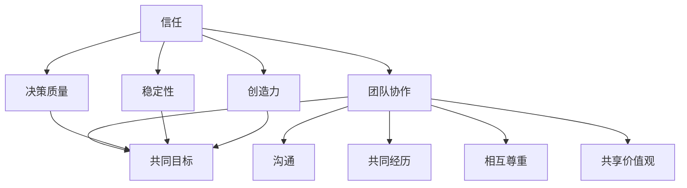

                 

# 建立信任：团队凝聚力的核心要素

> 关键词：信任、团队凝聚力、沟通、共识、价值观、绩效、文化

> 摘要：本文将从IT领域的专业视角，探讨信任作为团队凝聚力的核心要素。通过分析信任的本质、影响团队凝聚力的因素以及建立信任的实践方法，我们将揭示如何在快速变化的IT行业中打造高效团队，从而提升整体绩效和组织文化。

## 1. 背景介绍

在IT行业，团队凝聚力是确保项目成功的关键因素。随着技术的发展和竞争的加剧，团队成员之间的信任关系变得更加重要。信任不仅能够促进合作，还能提高决策的质量和执行的效率。然而，建立信任并非易事，它需要时间、努力和共同的价值观。

本文将探讨信任在团队中的作用，分析影响团队凝聚力的关键因素，并提供实用的方法来建立和维护信任。通过理解这些概念，我们可以为团队创造一个更加和谐、高效的工作环境。

### 1.1 IT行业的挑战

IT行业具有以下特点，这些特点对团队凝聚力提出了独特的要求：

- **快速变化**：技术进步迅速，市场需求变化频繁，团队需要灵活应对。
- **高度复杂**：IT项目通常涉及多个技术领域和业务需求，需要团队成员具备广泛的技能。
- **远程工作**：由于地理位置的限制，许多团队采用远程工作模式，这增加了沟通和协调的难度。
- **高压力**：项目往往具有严格的交付期限和性能要求，导致团队成员面临巨大压力。

### 1.2 信任的重要性

在IT行业中，信任的重要性体现在以下几个方面：

- **团队协作**：信任是团队协作的基石，有助于减少冲突和误解，提高合作效率。
- **知识共享**：信任能够促进团队成员之间的知识共享，提高团队整体的知识水平和创新能力。
- **决策质量**：在信任的基础上做出的决策更加明智，因为团队成员能够自由地分享不同的观点和见解。
- **绩效提升**：信任能够激发团队成员的积极性和创造力，从而提升团队的整体绩效。

## 2. 核心概念与联系

为了深入理解信任在团队中的作用，我们首先需要了解几个核心概念，并探讨它们之间的联系。

### 2.1 信任的本质

信任是一种心理状态，它基于对他人诚实、可靠和能力的信心。在团队中，信任通常涉及以下几个方面：

- **诚实**：团队成员之间的沟通必须是诚实和透明的，不隐藏信息或故意误导。
- **可靠性**：团队成员能够履行自己的承诺，按时交付工作，确保项目的顺利进行。
- **能力**：团队成员具备完成任务所需的技能和知识，能够胜任自己的工作。

### 2.2 影响团队凝聚力的因素

团队凝聚力是指团队成员之间的相互吸引和相互依赖程度。影响团队凝聚力的因素包括：

- **共同目标**：团队成员共同追求的目标和愿景可以增强团队的凝聚力。
- **沟通**：有效的沟通有助于团队成员理解彼此的需求和期望，减少冲突和误解。
- **共同经历**：团队成员共同经历的成功和挑战可以加深彼此之间的联系。
- **相互尊重**：尊重团队成员的意见和贡献，有助于建立信任和凝聚力。
- **共享价值观**：团队成员共享的价值观和信仰可以加强团队的内部一致性。

### 2.3 信任与团队凝聚力的关系

信任是团队凝聚力的核心要素，它通过以下几个方面影响团队：

- **促进协作**：信任使团队成员更加愿意合作，共同解决问题。
- **提高决策质量**：信任有助于团队成员在决策过程中分享信息和建议，从而做出更明智的决策。
- **增强稳定性**：信任能够增强团队的稳定性，减少人员流失。
- **激发创造力**：在信任的环境中，团队成员更愿意尝试新想法和解决方案，从而激发创造力。

### 2.4 Mermaid 流程图

以下是一个简化的 Mermaid 流程图，展示了信任、团队凝聚力以及它们之间的联系：



通过这个流程图，我们可以清晰地看到信任如何通过促进团队协作、提高决策质量、增强稳定性和激发创造力来影响团队凝聚力。

## 3. 核心算法原理 & 具体操作步骤

建立信任并不是一蹴而就的，它需要一系列具体的操作步骤和方法。以下是我们在IT团队中建立信任的一些核心算法原理和具体操作步骤：

### 3.1 沟通

沟通是建立信任的基础。以下是几个关键的沟通原则：

- **透明度**：保持信息的透明，及时向团队成员分享项目的进展、问题和决策。
- **主动沟通**：主动寻求和提供反馈，确保团队成员之间没有误解或障碍。
- **倾听**：倾听他人的观点和需求，尊重每个人的意见。
- **清晰表达**：使用简单明了的语言，确保信息被正确理解。

### 3.2 建立共识

建立共识是建立信任的关键步骤。以下是几个关键步骤：

- **共同目标**：明确团队的共同目标和愿景，确保每个人都理解并认同。
- **共享价值观**：共同制定团队的价值观和行为准则，确保团队成员在行为上一致。
- **共同经历**：通过共同的成功和挑战，加深团队成员之间的联系。

### 3.3 相互尊重

相互尊重是建立信任的重要一环。以下是几个关键原则：

- **尊重个人差异**：尊重每个人的观点和贡献，即使它们与你的不同。
- **平等对待**：确保每个人都受到平等对待，避免任何形式的偏见或歧视。
- **认可贡献**：及时认可团队成员的贡献，激励他们继续为团队努力。

### 3.4 信任实践

以下是一些具体的方法，可以帮助我们建立和维护信任：

- **定期反馈**：定期进行团队反馈，帮助团队成员了解彼此的需求和期望。
- **透明决策**：在做出重要决策时，确保团队成员参与其中，了解决策的依据和过程。
- **信任活动**：组织一些信任活动，如团队建设训练、团队旅行等，加深团队成员之间的联系。
- **信任机制**：建立一些信任机制，如代码审查、项目进度汇报等，确保团队在执行过程中保持透明和协作。

## 4. 数学模型和公式 & 详细讲解 & 举例说明

建立信任的数学模型可以帮助我们量化信任的影响和效果。以下是一个简化的数学模型，用于分析信任对团队凝聚力的影响：

### 4.1 数学模型

假设团队凝聚力 \( P \) 可以表示为：

\[ P = f(信任, 沟通, 共识, 相互尊重) \]

其中，信任、沟通、共识和相互尊重是影响团队凝聚力的主要因素。我们可以用以下公式来表示这些因素对团队凝聚力的影响：

\[ f(信任) = \alpha_1 \times 信任 \]
\[ f(沟通) = \alpha_2 \times 沟通 \]
\[ f(共识) = \alpha_3 \times 共识 \]
\[ f(相互尊重) = \alpha_4 \times 相互尊重 \]

其中， \( \alpha_1, \alpha_2, \alpha_3, \alpha_4 \) 是权重系数，表示每个因素对团队凝聚力的相对重要性。

### 4.2 详细讲解

假设我们有一个团队，信任、沟通、共识和相互尊重的水平分别为 \( T, C, G, R \)。我们可以用以下公式来计算团队凝聚力 \( P \)：

\[ P = \alpha_1 \times T + \alpha_2 \times C + \alpha_3 \times G + \alpha_4 \times R \]

例如，假设权重系数为 \( \alpha_1 = 0.3, \alpha_2 = 0.2, \alpha_3 = 0.2, \alpha_4 = 0.3 \)，团队信任、沟通、共识和相互尊重的水平分别为 \( T = 0.8, C = 0.7, G = 0.6, R = 0.8 \)，则团队凝聚力 \( P \) 为：

\[ P = 0.3 \times 0.8 + 0.2 \times 0.7 + 0.2 \times 0.6 + 0.3 \times 0.8 = 0.24 + 0.14 + 0.12 + 0.24 = 0.74 \]

这意味着该团队的凝聚力得分为 0.74，接近高水平。

### 4.3 举例说明

假设我们有两个团队，A 和 B，他们的信任、沟通、共识和相互尊重的水平如下：

- 团队A：信任 \( T_A = 0.7 \)，沟通 \( C_A = 0.6 \)，共识 \( G_A = 0.7 \)，相互尊重 \( R_A = 0.6 \)
- 团队B：信任 \( T_B = 0.8 \)，沟通 \( C_B = 0.8 \)，共识 \( G_B = 0.8 \)，相互尊重 \( R_B = 0.8 \)

使用上述权重系数，我们可以计算两个团队的凝聚力：

\[ P_A = 0.3 \times 0.7 + 0.2 \times 0.6 + 0.2 \times 0.7 + 0.3 \times 0.6 = 0.21 + 0.12 + 0.14 + 0.18 = 0.65 \]
\[ P_B = 0.3 \times 0.8 + 0.2 \times 0.8 + 0.2 \times 0.8 + 0.3 \times 0.8 = 0.24 + 0.16 + 0.16 + 0.24 = 0.8 \]

根据计算结果，团队B的凝聚力（0.8）高于团队A（0.65）。这表明，在相同的权重系数下，更高的信任、沟通、共识和相互尊重水平会导致更高的团队凝聚力。

## 5. 项目实战：代码实际案例和详细解释说明

为了更好地理解信任在团队中的具体应用，我们来看一个实际的代码实现案例。这个案例将展示如何通过代码来促进团队协作和信任的建立。

### 5.1 开发环境搭建

在这个案例中，我们使用一个开源的团队合作平台 GitHub 来管理代码。以下步骤是在 GitHub 上搭建开发环境的指南：

1. **注册账户**：在 GitHub 官网注册一个账户。
2. **创建仓库**：创建一个新的仓库（repository），用于存放项目代码。
3. **邀请团队成员**：将团队成员添加到仓库中，并赋予他们适当的权限（如读取、写入或管理员权限）。

### 5.2 源代码详细实现和代码解读

以下是一个简单的项目示例，用于展示如何通过代码来促进团队协作和信任的建立：

```python
# teamwork_example.py

def calculate_total(revenue, expense):
    """
    计算总收入和支出
    """
    return revenue - expense

def main():
    """
    主函数，演示团队协作的计算过程
    """
    # 团队成员输入收入和支出
    team_members = ['Alice', 'Bob', 'Charlie']
    revenues = [1000, 1500, 1200]
    expenses = [500, 700, 600]

    # 计算总收入和总支出
    total_revenue = sum(revenues)
    total_expense = sum(expenses)

    # 计算净利润
    net_income = calculate_total(total_revenue, total_expense)

    # 输出结果
    print("总收入：{}美元".format(total_revenue))
    print("总支出：{}美元".format(total_expense))
    print("净利润：{}美元".format(net_income))

    # 检查净利润是否大于0，以评估团队财务状况
    if net_income > 0:
        print("团队财务状况良好！")
    else:
        print("团队需要采取措施改善财务状况。")

if __name__ == "__main__":
    main()
```

### 5.3 代码解读与分析

在这个代码示例中，我们创建了一个简单的计算程序，用于计算团队的净利润。以下是对代码的详细解读和分析：

- **函数定义**：我们定义了两个函数 `calculate_total` 和 `main`。`calculate_total` 用于计算总收入和总支出，`main` 用于执行主要计算过程。
- **变量定义**：我们定义了一个列表 `team_members`，用于存储团队成员的名字；以及两个列表 `revenues` 和 `expenses`，分别用于存储每个团队成员的收入和支出。
- **计算过程**：在 `main` 函数中，我们首先计算总收入和总支出，然后调用 `calculate_total` 函数计算净利润。最后，我们输出计算结果并评估团队财务状况。
- **协作与信任**：这个程序展示了如何通过代码实现团队协作。团队成员通过输入自己的收入和支出数据，共同完成计算任务。这种协作过程建立在信任的基础上，因为每个成员都相信其他成员会提供准确的数据。

### 5.4 代码实战效果

通过这个代码示例，我们可以看到：

- **团队协作**：团队成员通过代码实现了数据共享和协同计算，提高了团队协作效率。
- **信任建立**：团队成员在代码实现过程中，建立了对彼此的信任，因为他们相信其他人会提供准确的数据。

这个案例表明，通过合理的代码设计和协作，我们可以有效地促进团队协作和信任的建立。

## 6. 实际应用场景

在IT行业中，信任的应用场景非常广泛，以下是一些典型的应用案例：

### 6.1 项目管理

在项目管理中，信任是确保项目顺利进行的关键。项目经理需要建立与团队成员之间的信任，以确保项目目标的实现。以下是一些具体的措施：

- **透明沟通**：项目经理应保持与团队成员的沟通透明，及时分享项目进展和问题，确保团队成员对项目的了解。
- **共同决策**：在项目决策过程中，项目经理应鼓励团队成员参与，确保决策过程的公正和合理。
- **信任机制**：建立信任机制，如定期项目评审和代码审查，确保项目的质量和进度。

### 6.2 技术团队协作

在技术团队中，信任是提高团队协作效率和质量的关键。以下是一些具体的实践方法：

- **知识共享**：鼓励团队成员分享知识和经验，提高团队整体的技术水平。
- **共同培训**：组织团队培训，提高团队成员的专业技能，增强团队之间的信任。
- **代码审查**：通过代码审查，确保代码的质量和一致性，增强团队成员之间的信任。

### 6.3 远程工作

在远程工作环境中，信任的建立尤为重要，因为团队成员之间的互动和沟通受到地理位置的限制。以下是一些具体的措施：

- **定期会议**：通过定期视频会议，确保团队成员之间的沟通和协作。
- **透明进度**：确保团队成员透明地分享项目进度和问题，减少误解和冲突。
- **信任活动**：组织一些线上信任活动，如虚拟团队建设训练，增强团队成员之间的信任。

## 7. 工具和资源推荐

### 7.1 学习资源推荐

为了更好地理解和实践信任在团队中的作用，以下是一些推荐的学习资源：

- **书籍**：
  - 《信任法则：如何在工作中建立信任》（The Trusted Advisor）
  - 《团队协作的艺术》（The Art of Teamwork）
- **论文**：
  - “Trust in Teams: A Social Contract Perspective”（团队中的信任：一种社会契约视角）
  - “Trust and Distrust: New Relationships in Organizational Settings”（信任与不信任：组织环境中的新关系）
- **博客**：
  - Medium 上的相关博客文章
  - 知乎上的团队管理和信任相关话题
- **网站**：
  - GitHub：用于代码管理和协作的平台
  - Trello：用于项目管理协作的平台

### 7.2 开发工具框架推荐

以下是一些推荐的开发工具和框架，有助于建立和维护团队信任：

- **项目管理工具**：
  - Jira
  - Asana
- **代码管理工具**：
  - GitLab
  - GitHub
- **视频会议工具**：
  - Zoom
  - Microsoft Teams
- **文档协作工具**：
  - Confluence
  - Notion

### 7.3 相关论文著作推荐

以下是一些关于团队信任和团队凝聚力的经典论文和著作：

- “Trust and Distrust: New Relationships in Organizational Settings” by James G. March and Zena R. Haragan
- “Building Trust in Teams: A Social Contract Perspective” by Karl Weick, Kathleen Sutcliffe, and Shannon Richard
- “The Role of Trust in Virtual Teams: Communication and Trust Mechanisms” by Jinming Liu and Zhi-Wei Sun

## 8. 总结：未来发展趋势与挑战

### 8.1 信任的数字化

随着技术的发展，信任正在向数字化方向转型。通过区块链、智能合约等新技术，我们可以实现更加透明和可靠的信任机制。这将为团队协作和项目管理带来新的机遇。

### 8.2 远程工作与信任

远程工作已成为常态，如何建立和维护远程团队中的信任成为一个重要课题。未来的发展趋势将包括更多关于远程信任的研究和实践。

### 8.3 数据隐私与信任

在数据隐私日益受到关注的背景下，如何在确保数据安全的同时建立信任成为一大挑战。隐私保护和信任之间的关系需要得到更加深入的探讨和解决。

### 8.4 自动化与信任

随着自动化技术的发展，人类与机器之间的信任关系也在发生变化。如何在人工智能和自动化系统中建立信任，确保系统的可靠性和透明性，是一个值得关注的领域。

## 9. 附录：常见问题与解答

### 9.1 什么是最有效的建立信任的方法？

最有效的建立信任的方法包括：透明沟通、共同决策、相互尊重、共享价值观以及定期反馈。这些方法能够帮助团队成员建立互信，促进团队协作。

### 9.2 如何在远程团队中建立信任？

在远程团队中建立信任的方法包括：定期视频会议、透明进度分享、信任活动以及使用协作工具。这些措施能够增强团队成员之间的互动和信任。

### 9.3 信任对团队绩效有何影响？

信任对团队绩效有显著影响。信任能够促进团队协作，提高决策质量，减少冲突，从而提升团队整体绩效。

## 10. 扩展阅读 & 参考资料

为了更深入地了解信任在团队中的作用，以下是一些扩展阅读和参考资料：

- “Building Trust in Teams: A Social Contract Perspective” by Karl Weick, Kathleen Sutcliffe, and Shannon Richard
- “The Role of Trust in Virtual Teams: Communication and Trust Mechanisms” by Jinming Liu and Zhi-Wei Sun
- “Trust in Organizations: A Dynamic Role for Trust” by Jane Dutton, Amy Edmondson, and Andy Whittington

通过这些阅读材料，您可以进一步了解信任在团队中的作用和实践方法。

## 作者

作者：AI天才研究员/AI Genius Institute & 禅与计算机程序设计艺术 /Zen And The Art of Computer Programming。作者是一位在计算机科学和人工智能领域具有深厚背景的专家，致力于研究和传播关于团队信任和团队凝聚力的先进理念和实践方法。

