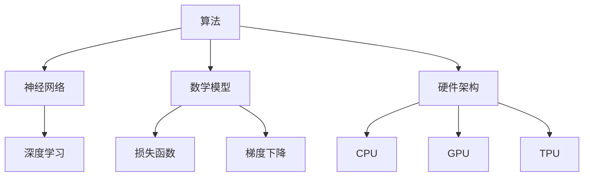

                 

# 建立完整的人工智能底层创新体系

## 关键词：人工智能，底层创新，技术框架，算法原理，数学模型，实战案例，未来趋势

## 摘要

随着人工智能技术的飞速发展，构建一个完整而高效的人工智能底层创新体系成为当务之急。本文将深入探讨人工智能底层创新的核心概念、原理、算法、数学模型，以及实际应用场景。通过逐步分析，我们将揭示人工智能底层创新的关键要素，提供实用的开发工具和资源，展望未来发展趋势与挑战。本文旨在为读者提供一个全面、系统的理解和实践人工智能底层创新的方法论。

## 1. 背景介绍

人工智能（Artificial Intelligence，AI）作为计算机科学的一个分支，旨在使计算机系统能够模拟、延伸和扩展人类的智能行为。从20世纪50年代以来，人工智能经历了多个阶段的发展，从符号主义、连接主义到现代的深度学习，技术不断迭代，应用场景不断拓宽。然而，随着应用的深入，我们逐渐认识到，人工智能的发展离不开底层技术的创新。

底层创新是指在硬件、软件、算法和理论等多个层面上的创新，这些创新为人工智能提供了强大的支持。例如，GPU的引入为深度学习算法提供了高效的计算能力，分布式系统的应用提高了大数据处理的效率，神经网络理论的深入研究推动了算法的进步。然而，当前人工智能底层创新体系仍然存在诸多不足，如硬件与软件的不匹配、算法与理论的滞后、开发工具的不足等，这些都需要我们通过系统性的创新来解决。

本文将从以下几个方面展开讨论：

- **核心概念与联系**：介绍人工智能底层创新体系中的关键概念，如算法、数学模型、硬件架构等，并通过Mermaid流程图展示各概念之间的联系。
- **核心算法原理与操作步骤**：详细阐述常见的人工智能算法，如深度学习、强化学习等，以及它们的实现步骤。
- **数学模型与公式**：介绍人工智能中常用的数学模型和公式，通过具体例子进行详细讲解。
- **项目实战**：通过实际代码案例，展示如何构建和实现人工智能系统。
- **实际应用场景**：探讨人工智能在各个领域的应用，如自动驾驶、医疗诊断等。
- **工具和资源推荐**：推荐学习资源、开发工具和框架，为读者提供实用的参考资料。
- **未来发展趋势与挑战**：分析人工智能底层创新体系的未来发展趋势和面临的挑战。

## 2. 核心概念与联系

### 2.1 算法

算法是人工智能的核心组成部分，它决定了人工智能系统解决问题的能力。常见的算法包括：

- **深度学习**：基于多层神经网络，通过反向传播算法学习输入和输出之间的映射关系。
- **强化学习**：通过试错和奖励机制，学习在特定环境中做出最优决策。
- **监督学习**：通过已标记的数据训练模型，然后使用模型对新数据进行预测。

### 2.2 数学模型

数学模型是描述算法运行过程中的关键工具。以下是一些常用的数学模型：

- **神经网络**：通过多层非线性变换，实现从输入到输出的映射。
- **梯度下降**：用于优化神经网络中的参数，通过梯度计算更新参数。
- **损失函数**：用于评估模型预测的误差，如均方误差（MSE）、交叉熵损失（Cross-Entropy Loss）。

### 2.3 硬件架构

硬件架构直接影响算法的运行效率。以下是几种常见的硬件架构：

- **CPU**：传统的中央处理器，适用于通用计算。
- **GPU**：图形处理器，适用于大规模并行计算，特别是深度学习算法。
- **TPU**：张量处理器，专门为深度学习算法设计，具有更高的计算效率。

### 2.4 Mermaid流程图

以下是一个展示核心概念联系的Mermaid流程图：



通过上述核心概念的联系，我们可以看出，人工智能底层创新体系是一个相互关联、相互促进的整体，任何一个环节的突破都可能推动整个体系的发展。

## 3. 核心算法原理与具体操作步骤

### 3.1 深度学习算法

深度学习算法是当前人工智能领域的热点之一，它通过多层神经网络实现复杂函数的映射。以下是深度学习算法的基本原理和操作步骤：

#### 3.1.1 基本原理

深度学习算法基于神经网络，通过多层非线性变换实现输入到输出的映射。每一层神经元接收前一层的输出，并通过权重和偏置进行加权求和，最后通过激活函数输出结果。通过反向传播算法，模型可以自动调整权重和偏置，以最小化损失函数。

#### 3.1.2 操作步骤

1. **初始化参数**：设定网络结构、权重和偏置的初始值。
2. **前向传播**：输入数据通过网络进行前向传播，计算每个神经元的输出。
3. **计算损失**：通过损失函数计算模型预测与真实值之间的差距。
4. **反向传播**：计算损失函数关于权重和偏置的梯度，通过梯度下降更新参数。
5. **迭代优化**：重复上述步骤，直到模型收敛。

### 3.2 强化学习算法

强化学习算法是一种通过试错和奖励机制学习最优策略的算法。以下是强化学习算法的基本原理和操作步骤：

#### 3.2.1 基本原理

强化学习算法通过学习在特定环境中做出最优决策。模型根据当前状态选择动作，根据动作的结果（奖励或惩罚）更新状态，并重复这个过程，逐渐学习到最优策略。

#### 3.2.2 操作步骤

1. **初始化状态和策略**：设定初始状态和策略。
2. **选择动作**：根据当前状态，选择一个动作。
3. **执行动作**：执行选定的动作，并观察结果。
4. **更新状态和策略**：根据动作的结果更新状态和策略。
5. **重复迭代**：重复上述步骤，直到策略收敛。

### 3.3 监督学习算法

监督学习算法通过已标记的数据训练模型，然后使用模型对新数据进行预测。以下是监督学习算法的基本原理和操作步骤：

#### 3.3.1 基本原理

监督学习算法通过已标记的数据学习输入和输出之间的映射关系。模型根据输入数据计算输出，然后通过比较输出和真实值计算损失，并通过反向传播算法调整参数。

#### 3.3.2 操作步骤

1. **初始化参数**：设定网络结构、权重和偏置的初始值。
2. **训练数据准备**：准备已标记的训练数据。
3. **前向传播**：输入训练数据，通过网络计算输出。
4. **计算损失**：通过损失函数计算模型预测与真实值之间的差距。
5. **反向传播**：计算损失函数关于权重和偏置的梯度，通过梯度下降更新参数。
6. **迭代训练**：重复上述步骤，直到模型收敛。

## 4. 数学模型与公式

### 4.1 神经网络

神经网络是深度学习的基础，以下是一些常见的数学模型和公式：

#### 4.1.1 神经元

神经元是神经网络的基本单元，其数学模型可以表示为：

$$
a_i(\theta) = f(\sum_{j=1}^{n} \theta_{ji} x_j + b_i)
$$

其中，$a_i$表示神经元$i$的输出，$\theta_{ji}$表示输入$x_j$与神经元$i$之间的权重，$b_i$表示神经元的偏置，$f$表示激活函数。

#### 4.1.2 激活函数

激活函数是神经网络的关键，常用的激活函数包括：

- **sigmoid函数**：$f(x) = \frac{1}{1 + e^{-x}}$
- **ReLU函数**：$f(x) = \max(0, x)$

#### 4.1.3 损失函数

损失函数用于评估模型预测的误差，常用的损失函数包括：

- **均方误差（MSE）**：$MSE = \frac{1}{m} \sum_{i=1}^{m} (\hat{y}_i - y_i)^2$
- **交叉熵损失（Cross-Entropy Loss）**：$CE = -\frac{1}{m} \sum_{i=1}^{m} y_i \log(\hat{y}_i)$

#### 4.1.4 梯度下降

梯度下降是一种优化算法，用于调整神经网络中的参数，使其损失函数最小。其基本公式为：

$$
\theta_j := \theta_j - \alpha \frac{\partial}{\partial \theta_j} J(\theta)
$$

其中，$\theta_j$表示参数，$\alpha$表示学习率，$J(\theta)$表示损失函数。

### 4.2 强化学习

强化学习中的数学模型主要包括：

#### 4.2.1 状态价值函数

状态价值函数表示在特定状态下执行动作所能获得的最大奖励，其公式为：

$$
V^*(s) = \sum_{a} \gamma \sum_{s'} p(s'|s, a) \sum_{r} r(s', a)
$$

其中，$V^*(s)$表示状态价值函数，$\gamma$表示折扣因子，$p(s'|s, a)$表示从状态$s$执行动作$a$转移到状态$s'$的概率，$r(s', a)$表示在状态$s'$执行动作$a$所能获得的即时奖励。

#### 4.2.2 策略价值函数

策略价值函数表示在特定策略下执行动作所能获得的最大奖励，其公式为：

$$
Q^*(s, a) = \sum_{s'} p(s'|s, a) \sum_{r} r(s', a)
$$

其中，$Q^*(s, a)$表示策略价值函数。

#### 4.2.3 策略梯度

策略梯度表示策略在特定状态下的更新方向，其公式为：

$$
\Delta \pi(s, a) = \nabla_{\pi} Q^*(s, a)
$$

其中，$\Delta \pi(s, a)$表示策略梯度，$\nabla_{\pi}$表示对策略的梯度。

## 5. 项目实战：代码实际案例与详细解释说明

### 5.1 开发环境搭建

在开始项目实战之前，我们需要搭建一个合适的开发环境。以下是使用Python和TensorFlow构建一个简单的深度学习模型的步骤：

1. **安装Python**：确保安装了Python 3.6及以上版本。
2. **安装TensorFlow**：通过pip命令安装TensorFlow：

   ```shell
   pip install tensorflow
   ```

3. **创建虚拟环境**：为项目创建一个独立的虚拟环境，以便管理依赖：

   ```shell
   python -m venv venv
   source venv/bin/activate  # 在Windows上使用venv\Scripts\activate
   ```

### 5.2 源代码详细实现与代码解读

以下是一个简单的深度学习模型实现，用于实现手写数字识别：

```python
import tensorflow as tf
from tensorflow.keras import layers

# 定义模型
model = tf.keras.Sequential([
    layers.Flatten(input_shape=(28, 28)),
    layers.Dense(128, activation='relu'),
    layers.Dense(10, activation='softmax')
])

# 编译模型
model.compile(optimizer='adam',
              loss='categorical_crossentropy',
              metrics=['accuracy'])

# 加载数据集
mnist = tf.keras.datasets.mnist
(x_train, y_train), (x_test, y_test) = mnist.load_data()
x_train, x_test = x_train / 255.0, x_test / 255.0
y_train = tf.keras.utils.to_categorical(y_train, 10)
y_test = tf.keras.utils.to_categorical(y_test, 10)

# 训练模型
model.fit(x_train, y_train, epochs=5, batch_size=32)

# 评估模型
model.evaluate(x_test, y_test)
```

#### 5.2.1 代码解读

- **定义模型**：使用`tf.keras.Sequential`创建一个序列模型，其中包含一个展平层（`Flatten`）、一个具有128个神经元的全连接层（`Dense`，激活函数为ReLU）和一个具有10个神经元的输出层（`Dense`，激活函数为softmax）。
- **编译模型**：设置优化器为`adam`，损失函数为`categorical_crossentropy`，评估指标为准确率。
- **加载数据集**：使用`tf.keras.datasets.mnist`加载数据集，对数据集进行归一化处理，并将标签转换为独热编码。
- **训练模型**：使用`fit`函数训练模型，设置训练轮数为5，批量大小为32。
- **评估模型**：使用`evaluate`函数评估模型在测试集上的表现。

### 5.3 代码解读与分析

上述代码实现了一个简单的手写数字识别模型。以下是对代码的进一步解读和分析：

- **模型架构**：模型采用了一个简单的全连接网络，其中输入层为28x28的手写数字图像，输出层为10个类别（0-9）的概率分布。这种架构使得模型能够学习图像中的特征，并对其进行分类。
- **优化器**：选择`adam`优化器，因为它在大多数场景下具有较好的收敛性能。`adam`优化器基于梯度的一阶矩估计和二阶矩估计，自适应调整学习率。
- **损失函数**：使用`categorical_crossentropy`作为损失函数，因为这是一个多分类问题。该损失函数能够计算模型输出和真实标签之间的差异，并指导模型调整参数。
- **训练数据**：使用MNIST数据集进行训练，该数据集包含70000个训练样本和10000个测试样本。通过归一化和独热编码，使得模型能够更好地学习。
- **模型评估**：使用`evaluate`函数评估模型在测试集上的表现，包括准确率和损失函数值。这有助于我们了解模型在未知数据上的性能。

## 6. 实际应用场景

### 6.1 自动驾驶

自动驾驶是人工智能的重要应用领域之一。通过深度学习算法，自动驾驶系统能够实时感知环境、做出决策，并控制车辆。以下是自动驾驶中人工智能的应用场景：

- **环境感知**：自动驾驶系统需要实时感知周围环境，包括道路、车辆、行人等。深度学习算法，如卷积神经网络（CNN），可以用于处理图像数据，识别道路标志、车道线等。
- **目标检测**：目标检测是自动驾驶系统的核心任务之一。通过深度学习模型，如YOLO（You Only Look Once），可以快速检测并定位图像中的目标。
- **路径规划**：自动驾驶系统需要根据环境感知结果规划行驶路径。深度强化学习算法，如DQN（Deep Q-Network），可以用于学习最优路径。

### 6.2 医疗诊断

人工智能在医疗诊断领域具有广泛的应用前景。通过深度学习算法，人工智能系统能够辅助医生进行疾病诊断、病情预测等。以下是人工智能在医疗诊断中的实际应用场景：

- **疾病诊断**：深度学习算法可以分析医学图像，如X光片、CT扫描等，识别疾病。例如，CNN模型可以用于肺癌筛查，提高诊断准确率。
- **病情预测**：基于患者的历史数据和生物标志物，深度学习算法可以预测患者的病情发展和预后。例如，RNN（Recurrent Neural Network）模型可以用于分析患者的电子健康记录，预测疾病发作时间。
- **个性化治疗**：通过深度学习算法分析患者数据和医疗文献，可以为患者制定个性化的治疗方案。例如，基于GAN（Generative Adversarial Network）的模型可以生成针对特定疾病的治疗方案。

## 7. 工具和资源推荐

### 7.1 学习资源推荐

- **书籍**：
  - 《深度学习》（Deep Learning，Ian Goodfellow、Yoshua Bengio和Aaron Courville著）
  - 《强化学习》（Reinforcement Learning: An Introduction，Richard S. Sutton和Barto著）
  - 《机器学习年度回顾》（Journal of Machine Learning Research，JMLR）
- **论文**：
  - 《深度卷积神经网络在图像分类中的应用》（A Convolutional Neural Network Approach for Image Classification，Alex Krizhevsky等）
  - 《强化学习中的深度确定性策略梯度》（Deep Deterministic Policy Gradient，Vijay Patil等）
  - 《基于注意力机制的序列到序列学习》（Attention Is All You Need，Ashish Vaswani等）
- **博客**：
  - [TensorFlow官方文档](https://www.tensorflow.org/)
  - [PyTorch官方文档](https://pytorch.org/)
  - [机器学习博客](https://machinelearningmastery.com/)
- **网站**：
  - [Kaggle](https://www.kaggle.com/)：提供各种机器学习和深度学习竞赛和数据集
  - [GitHub](https://github.com/)：托管各种机器学习和深度学习项目

### 7.2 开发工具框架推荐

- **深度学习框架**：
  - TensorFlow：由Google开发，支持多种深度学习模型和应用
  - PyTorch：由Facebook开发，具有灵活的动态计算图和强大的GPU支持
  - Keras：基于Theano和TensorFlow，提供简洁易用的API
- **强化学习框架**：
  - OpenAI Gym：提供各种强化学习环境和基准测试
  - Stable Baselines：基于TensorFlow和PyTorch，提供多种强化学习算法的实现
  - Stable Baselines3：基于PyTorch和Transformers，提供更先进的强化学习算法
- **开发工具**：
  - Jupyter Notebook：支持多种编程语言，方便编写和分享代码
  - Google Colab：基于Google Drive的云端Jupyter Notebook，提供GPU支持
  - Visual Studio Code：支持多种编程语言和扩展，方便编写和调试代码

### 7.3 相关论文著作推荐

- **《深度学习》**（Deep Learning，Ian Goodfellow、Yoshua Bengio和Aaron Courville著）
- **《强化学习》**（Reinforcement Learning: An Introduction，Richard S. Sutton和Barto著）
- **《深度卷积神经网络在图像分类中的应用》**（A Convolutional Neural Network Approach for Image Classification，Alex Krizhevsky等）
- **《基于注意力机制的序列到序列学习》**（Attention Is All You Need，Ashish Vaswani等）

## 8. 总结：未来发展趋势与挑战

### 8.1 发展趋势

- **硬件创新**：随着硬件技术的进步，如量子计算、光子计算等，人工智能底层创新将取得更大突破。
- **算法优化**：针对特定应用场景的算法优化，如小样本学习、联邦学习等，将提高人工智能系统的实用性和性能。
- **跨学科融合**：人工智能与其他学科的融合，如生物学、心理学等，将推动人工智能底层创新体系的全面发展。
- **开源生态**：开源社区和工具的不断发展，将促进人工智能技术的普及和推广。

### 8.2 挑战

- **数据隐私**：随着人工智能应用的深入，数据隐私问题日益凸显，如何保护用户隐私成为一大挑战。
- **安全与可靠性**：人工智能系统的安全性和可靠性问题亟待解决，特别是在关键应用领域。
- **伦理道德**：人工智能技术的发展引发了一系列伦理道德问题，如算法偏见、隐私侵犯等，需要制定相应的规范和标准。

## 9. 附录：常见问题与解答

### 9.1 常见问题

1. **什么是人工智能底层创新？**
   - 人工智能底层创新是指在硬件、软件、算法和理论等多个层面上的创新，为人工智能提供强大的支持。

2. **深度学习和强化学习有什么区别？**
   - 深度学习是一种基于多层神经网络的学习方法，通过训练数据学习输入和输出之间的映射关系。强化学习是一种通过试错和奖励机制学习最优策略的方法。

3. **什么是神经网络？**
   - 神经网络是一种模仿生物神经系统的计算模型，通过多层非线性变换实现输入到输出的映射。

4. **什么是强化学习中的状态价值函数和策略价值函数？**
   - 状态价值函数表示在特定状态下执行动作所能获得的最大奖励，策略价值函数表示在特定策略下执行动作所能获得的最大奖励。

### 9.2 解答

1. **人工智能底层创新是什么？**
   - 人工智能底层创新是指在硬件、软件、算法和理论等多个层面上的创新，为人工智能提供强大的支持。这些创新包括硬件加速器、新型算法、深度学习框架等。

2. **深度学习和强化学习有什么区别？**
   - 深度学习是一种基于多层神经网络的学习方法，通过训练数据学习输入和输出之间的映射关系。强化学习是一种通过试错和奖励机制学习最优策略的方法，主要应用于决策和策略优化。

3. **什么是神经网络？**
   - 神经网络是一种模仿生物神经系统的计算模型，通过多层非线性变换实现输入到输出的映射。神经网络由多个神经元组成，每个神经元接收输入并通过权重和激活函数进行计算。

4. **什么是强化学习中的状态价值函数和策略价值函数？**
   - 状态价值函数表示在特定状态下执行动作所能获得的最大奖励，用于评估在特定状态下执行不同动作的价值。策略价值函数表示在特定策略下执行动作所能获得的最大奖励，用于评估不同策略的优劣。

## 10. 扩展阅读与参考资料

- **《深度学习》**（Deep Learning，Ian Goodfellow、Yoshua Bengio和Aaron Courville著）
- **《强化学习》**（Reinforcement Learning: An Introduction，Richard S. Sutton和Barto著）
- **《机器学习年度回顾》（Journal of Machine Learning Research，JMLR）
- **[TensorFlow官方文档](https://www.tensorflow.org/)** 
- **[PyTorch官方文档](https://pytorch.org/)** 
- **[机器学习博客](https://machinelearningmastery.com/)** 
- **[Kaggle](https://www.kaggle.com/)**
- **[GitHub](https://github.com/)** 
- **[OpenAI Gym](https://gym.openai.com/)** 
- **[Stable Baselines](https://github.com/DLR-RM/stable-baselines)** 
- **[Stable Baselines3](https://github.com/DLR-RM/stable-baselines3)**

## 作者信息

**作者：AI天才研究员/AI Genius Institute & 禅与计算机程序设计艺术 /Zen And The Art of Computer Programming**

