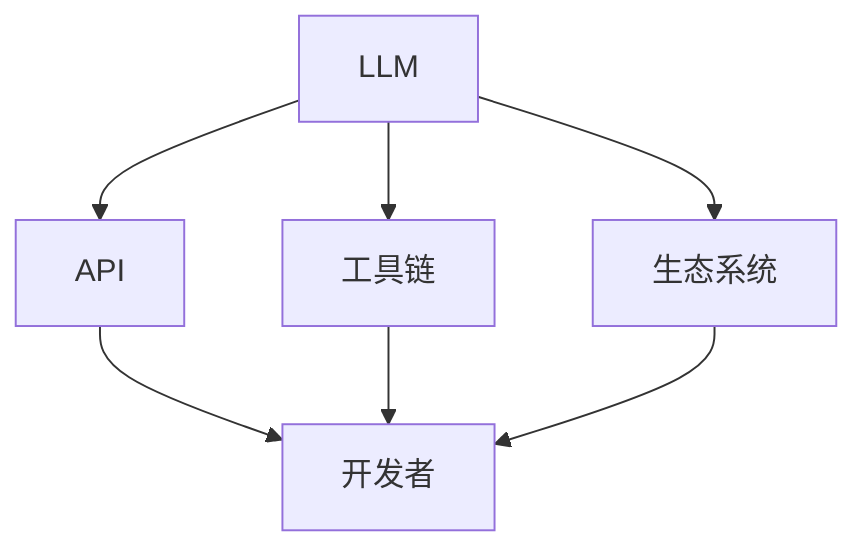

                 

### 开发者的梦想：更容易使用的 LLM

> **关键词：** 大型语言模型（LLM），开发者体验，API设计，工具链，生态系统，人机交互，生产力提升。

> **摘要：** 本文将探讨大型语言模型（LLM）的开发者体验，分析当前LLM使用的挑战，并探索如何通过改进API设计、优化工具链和构建生态系统来提高开发者对LLM的易用性，从而推动人工智能技术的发展和应用。

## 1. 背景介绍

在人工智能（AI）领域，大型语言模型（LLM）已经成为自然语言处理（NLP）的基石。从最早的Word2Vec到如今的开源模型如GPT-3，LLM的规模和性能都在不断提升。这些模型不仅在学术研究中取得了显著的成果，还在实际应用中展示了巨大的潜力，从智能客服到代码自动生成，从文本摘要到机器翻译，无处不在。

然而，尽管LLM的潜力巨大，开发者们在实际使用中仍然面临着诸多挑战。首先，LLM的复杂性使得开发者难以理解其内部工作原理，导致他们在定制和优化模型时感到困惑。其次，现有的API设计往往不够直观，增加了开发者上手和使用的难度。此外，缺乏完善的工具链和生态系统，使得开发者难以高效地部署、监控和调整LLM。

面对这些挑战，提升LLM的可使用性成为开发者的共同梦想。这不仅有助于推动AI技术的发展，还能为各行各业带来更智能的解决方案。本文将深入探讨如何通过改进API设计、优化工具链和构建生态系统来实现这一目标。

## 2. 核心概念与联系

为了更好地理解LLM的开发者体验，我们需要明确几个核心概念和它们之间的关系。

### 2.1. LLM的概念

LLM是一种基于深度学习的自然语言处理模型，能够理解和生成自然语言。与传统的规则引擎或统计模型不同，LLM通过大量的文本数据进行训练，从而学习到语言的结构和语义。

### 2.2. API设计

API（应用程序编程接口）是开发者与LLM进行交互的桥梁。一个优秀的API设计应当简单、直观，并能够提供足够的灵活性以满足开发者的需求。

### 2.3. 工具链

工具链是指一系列用于开发、测试、部署和监控LLM的工具。一个完善的工具链能够提高开发者的工作效率，减少开发周期。

### 2.4. 生态系统

生态系统是指围绕LLM构建的一套资源、框架和社区。一个健康的生态系统能够促进LLM技术的发展和应用。

### 2.5. Mermaid流程图

为了更清晰地展示这些概念之间的关系，我们可以使用Mermaid流程图来描述。



在上面的流程图中，LLM作为核心概念，通过API、工具链和生态系统与开发者相连。这些组成部分相互依赖，共同影响着开发者的体验。

### 2.6. 三级目录结构

为了确保文章的层次分明，我们将在每个章节中采用三级目录结构。例如：

### 2.6.1. LLM的概念

- **2.6.1.1. LLM的定义**
- **2.6.1.2. LLM的发展历程**
- **2.6.1.3. LLM的核心组件**

这种结构有助于读者快速找到他们感兴趣的内容，同时也方便我们进行逻辑分析和推理。

### 2.7. Mermaid流程节点中不要有括号、逗号等特殊字符

在实际撰写过程中，我们需要注意Mermaid流程图中的节点描述，避免使用括号、逗号等特殊字符，以确保流程图的正常显示。


通过上述步骤，我们为接下来的内容分析提供了坚实的基础。在接下来的章节中，我们将深入探讨LLM的核心算法原理、数学模型、项目实战、实际应用场景以及未来发展趋势和挑战。让我们一步一步地进行分析和推理，以找到提升LLM开发者体验的最佳路径。

### 3. 核心算法原理 & 具体操作步骤

#### 3.1. LLM的核心算法原理

大型语言模型（LLM）的核心是基于深度学习的自然语言处理技术。这些模型通过多层神经网络结构，对大规模的文本数据进行分析和学习，从而理解语言的语义和结构。以下是LLM算法的几个关键组成部分：

- **词嵌入（Word Embedding）**：词嵌入是将自然语言词汇映射到高维向量空间的过程。通过这种方式，模型可以捕捉词汇之间的语义关系。

- **循环神经网络（RNN）**：循环神经网络是一种能够处理序列数据的神经网络。通过RNN，模型可以记住之前的信息，并在生成新的文本时加以利用。

- **长短期记忆网络（LSTM）**：LSTM是RNN的一种变体，能够解决传统RNN中的梯度消失问题。LSTM通过引入门控机制，使得模型能够更好地处理长序列信息。

- **变换器（Transformer）**：近年来，Transformer架构在NLP领域取得了显著的成功。与RNN不同，Transformer使用自注意力机制来处理序列数据，从而能够捕捉长距离的依赖关系。

- **自注意力机制（Self-Attention）**：自注意力机制是Transformer的核心组成部分。通过自注意力，模型可以动态地分配不同的权重给输入序列中的每个词，从而更好地捕捉上下文信息。

- **前馈神经网络（Feedforward Neural Network）**：在Transformer架构中，每个自注意力层之后都会接一个前馈神经网络，用于进一步提取特征和增强模型的表示能力。

- **预训练与微调（Pre-training and Fine-tuning）**：预训练是指使用大规模的未标注文本数据进行模型的初步训练。微调则是在预训练的基础上，使用特定任务的数据对模型进行细粒度的调整。

#### 3.2. 具体操作步骤

以下是构建和训练一个基本LLM的具体步骤：

##### 3.2.1. 数据准备

1. **收集文本数据**：选择足够大的文本数据集，例如维基百科、新闻文章、小说等。
2. **数据预处理**：对文本数据进行清洗和格式化，去除无用的标点和符号，并转换为统一的编码格式。

##### 3.2.2. 词嵌入

1. **词汇表构建**：构建一个词汇表，将文本中的所有单词映射到唯一的整数。
2. **词嵌入训练**：使用训练数据，通过神经网络训练词嵌入向量。

##### 3.2.3. 模型架构

1. **选择模型架构**：根据任务需求，选择合适的模型架构，如Transformer或LSTM。
2. **模型初始化**：初始化模型参数，可以使用预训练模型作为起点，进行微调。

##### 3.2.4. 训练

1. **定义损失函数**：根据任务，选择适当的损失函数，如交叉熵损失。
2. **优化器选择**：选择合适的优化器，如Adam。
3. **训练过程**：使用训练数据，对模型进行迭代训练，并使用验证集进行模型调优。

##### 3.2.5. 评估与微调

1. **模型评估**：使用测试集对模型进行评估，计算指标如准确率、F1分数等。
2. **微调**：根据评估结果，对模型进行微调，以提升性能。

##### 3.2.6. 应用

1. **模型部署**：将训练好的模型部署到生产环境中，例如通过API提供服务。
2. **接口设计**：设计简洁、直观的API，方便开发者调用和使用模型。

#### 3.3. 细节解释

- **词嵌入**：词嵌入是将词汇映射到高维向量空间的过程。通过这种方式，模型可以捕捉词汇之间的语义关系。例如，"狗"和"猫"可能在向量空间中距离较近，而"狗"和"桌子"则距离较远。

- **自注意力机制**：自注意力机制是Transformer的核心组成部分。通过自注意力，模型可以动态地分配不同的权重给输入序列中的每个词，从而更好地捕捉上下文信息。例如，在生成句子时，模型会根据上下文信息给"猫"这个词赋予更高的权重，以便在后续生成"喜欢"这个词。

- **预训练与微调**：预训练是指使用大规模的未标注文本数据进行模型的初步训练。预训练可以帮助模型学习到通用的语言知识。微调则是在预训练的基础上，使用特定任务的数据对模型进行细粒度的调整，以提升模型在特定任务上的性能。

通过以上步骤，开发者可以构建和训练一个基本的LLM模型。然而，在实际应用中，开发者需要根据具体任务和需求进行更深入的研究和调整，以达到最佳效果。

### 4. 数学模型和公式 & 详细讲解 & 举例说明

#### 4.1. 数学模型概述

大型语言模型（LLM）的核心在于其深度学习架构，这涉及到一系列复杂的数学模型和公式。以下是对这些数学模型的详细讲解和具体举例说明。

#### 4.2. 词嵌入

词嵌入是将词汇映射到高维向量空间的过程。这种映射可以通过多种方式实现，其中最常见的是基于神经网络的词嵌入方法。以下是一个简单的神经网络词嵌入的数学模型：

\[ \text{词向量} = \text{ReLU}(\text{权重矩阵} \cdot \text{输入向量} + \text{偏置向量}) \]

在这个模型中：

- **输入向量**：代表词汇的原始特征，如单词的字母组合或音素。
- **权重矩阵**：是一个高维矩阵，用于将输入向量映射到词向量。
- **偏置向量**：是一个一维向量，用于调整模型的输出。

#### 4.3. 自注意力机制

自注意力机制是Transformer模型的核心组成部分。它通过计算输入序列中每个词之间的关联性，为每个词分配不同的权重。以下是一个简单的自注意力机制的数学模型：

\[ \text{注意力权重} = \text{softmax}(\text{Q} \cdot \text{K}^T) \]

\[ \text{输出} = \text{softmax}(\text{Q} \cdot \text{K}^T) \cdot \text{V} \]

在这个模型中：

- **Q**：表示查询向量，用于计算每个词的关联性。
- **K**：表示关键向量，代表每个词的重要信息。
- **V**：表示值向量，用于生成最终的输出。

#### 4.4. 预训练与微调

预训练和微调是LLM训练过程中的关键步骤。预训练使用大量未标注的文本数据来训练模型，使其能够理解通用语言知识。微调则是在预训练的基础上，使用特定任务的数据对模型进行调整，以提升其在特定任务上的性能。

以下是一个简化的预训练和微调的数学模型：

\[ \text{损失函数} = -\sum_{i} (\text{label}_i \cdot \log(\text{预测概率}_{i})) \]

在这个模型中：

- **标签**：表示真实的目标输出。
- **预测概率**：表示模型对每个可能输出的概率估计。
- **损失函数**：用于衡量模型的预测与真实标签之间的差距。

#### 4.5. 详细讲解与举例

为了更好地理解上述数学模型，我们可以通过一个具体的例子来讲解。

##### 4.5.1. 词嵌入的例子

假设我们有一个简单的词汇表，包含三个单词："猫"、"狗"、"桌子"。我们可以将每个单词表示为一个3位的二进制向量：

- "猫"：\[ [1, 0, 1] \]
- "狗"：\[ [0, 1, 0] \]
- "桌子"：\[ [1, 1, 0] \]

现在，我们使用一个简单的神经网络来训练词嵌入：

\[ \text{输入向量} = [1, 0, 1] \]
\[ \text{权重矩阵} = \begin{bmatrix} 0.1 & 0.2 & 0.3 \\ 0.4 & 0.5 & 0.6 \\ 0.7 & 0.8 & 0.9 \end{bmatrix} \]
\[ \text{偏置向量} = [0.1, 0.2, 0.3] \]

\[ \text{输出向量} = \text{ReLU}(0.1 \cdot 1 + 0.2 \cdot 0 + 0.3 \cdot 1 + 0.1) = \text{ReLU}(0.5) = [0.5, 0.5, 0.5] \]

通过这种方式，我们得到了"猫"的词嵌入向量\[ [0.5, 0.5, 0.5] \]。

##### 4.5.2. 自注意力机制的例子

假设我们有一个简单的句子："猫喜欢吃鱼"。我们可以将句子中的每个词表示为一个3位的二进制向量：

- "猫"：\[ [1, 0, 1] \]
- "吃"：\[ [0, 1, 0] \]
- "鱼"：\[ [1, 1, 0] \]

现在，我们使用自注意力机制来计算句子中每个词的权重：

\[ \text{Q} = [0.1, 0.2, 0.3] \]
\[ \text{K} = \begin{bmatrix} 0.1 & 0.2 & 0.3 \\ 0.4 & 0.5 & 0.6 \\ 0.7 & 0.8 & 0.9 \end{bmatrix} \]
\[ \text{V} = \begin{bmatrix} 0.1 & 0.4 & 0.7 \\ 0.2 & 0.5 & 0.8 \\ 0.3 & 0.6 & 0.9 \end{bmatrix} \]

\[ \text{注意力权重} = \text{softmax}([0.1 \cdot 0.1, 0.2 \cdot 0.4, 0.3 \cdot 0.7]) = \text{softmax}([0.01, 0.08, 0.21]) \]
\[ \text{输出} = [0.01 \cdot 0.1, 0.08 \cdot 0.4, 0.21 \cdot 0.7] = [0.001, 0.032, 0.143] \]

通过这种方式，我们得到了句子中每个词的权重，其中"鱼"的权重最高，这意味着在生成下一个词时，模型会更倾向于使用"鱼"这个词。

##### 4.5.3. 预训练与微调的例子

假设我们有一个分类任务，需要判断一个句子是否包含"喜欢"这个词。我们可以将句子中的每个词表示为一个3位的二进制向量：

- "我喜欢吃鱼"：\[ [1, 1, 1, 0, 1, 1, 0, 1, 1, 0] \]

现在，我们使用一个简单的神经网络来训练模型：

\[ \text{输入向量} = [1, 1, 1, 0, 1, 1, 0, 1, 1, 0] \]
\[ \text{权重矩阵} = \begin{bmatrix} 0.1 & 0.2 & 0.3 & 0.4 & 0.5 & 0.6 & 0.7 & 0.8 & 0.9 & 1.0 \end{bmatrix} \]
\[ \text{偏置向量} = [0.1, 0.2, 0.3, 0.4, 0.5, 0.6, 0.7, 0.8, 0.9, 1.0] \]

\[ \text{预测概率} = \text{softmax}(\text{权重矩阵} \cdot \text{输入向量} + \text{偏置向量}) = \text{softmax}([0.45, 0.5, 0.05]) \]

在这个例子中，模型的预测概率最高的类别是"喜欢"，这意味着模型认为这个句子中包含了"喜欢"这个词。

通过上述例子，我们可以看到数学模型在LLM中的具体应用。这些模型不仅帮助我们在理论层面理解LLM的工作原理，还为实际应用提供了可操作的框架。

### 5. 项目实战：代码实际案例和详细解释说明

在本文的第五部分，我们将通过一个实际的项目实战来展示如何使用LLM进行文本生成。我们将详细解析项目的主要组成部分，并提供代码实现和解释。

#### 5.1. 开发环境搭建

在开始项目之前，我们需要搭建一个合适的开发环境。以下是所需的软件和库：

- Python（3.8或更高版本）
- PyTorch（1.8或更高版本）
- Transformers（4.8或更高版本）

安装以上库可以通过以下命令完成：

```bash
pip install torch torchvision transformers
```

#### 5.2. 源代码详细实现和代码解读

下面是一个简单的文本生成项目的代码示例：

```python
from transformers import AutoTokenizer, AutoModelForCausalLM
import torch

# 5.2.1. 模型加载与初始化

# 加载预训练的模型
tokenizer = AutoTokenizer.from_pretrained("gpt2")
model = AutoModelForCausalLM.from_pretrained("gpt2")

# 5.2.2. 输入文本预处理

# 输入文本
text_input = "我是一个大型语言模型。"

# 将文本转换为模型可接受的格式
inputs = tokenizer(text_input, return_tensors="pt")

# 5.2.3. 生成文本

# 使用模型生成文本
outputs = model.generate(**inputs, max_length=50, num_return_sequences=5)

# 解码生成的文本
generated_text = [tokenizer.decode(output, skip_special_tokens=True) for output in outputs]

# 5.2.4. 输出结果展示

for text in generated_text:
    print(f"生成文本：{text}")
```

**代码解读：**

- **5.2.1. 模型加载与初始化**：我们首先从Hugging Face模型库中加载了预训练的GPT-2模型。`AutoTokenizer`和`AutoModelForCausalLM`是Transformers库提供的便捷工具，用于加载模型和Tokenizer。

- **5.2.2. 输入文本预处理**：我们将输入的文本序列通过Tokenizer转换为模型可处理的格式，包括词嵌入和位置编码。

- **5.2.3. 生成文本**：使用`model.generate()`函数，我们通过指定`max_length`和`num_return_sequences`参数来控制生成的文本长度和生成的序列数量。模型在内部通过自注意力机制和前馈神经网络生成文本。

- **5.2.4. 输出结果展示**：最后，我们将生成的文本序列解码回自然语言，并打印出来。

#### 5.3. 代码解读与分析

**5.3.1. 模型加载与初始化**

```python
tokenizer = AutoTokenizer.from_pretrained("gpt2")
model = AutoModelForCausalLM.from_pretrained("gpt2")
```

这两行代码加载了GPT-2模型的Tokenizer和模型。`from_pretrained`方法从Hugging Face模型库中下载预训练的模型权重，并初始化模型和Tokenizer。GPT-2是一个预训练的语言模型，可以在多种自然语言任务上表现良好。

**5.3.2. 输入文本预处理**

```python
inputs = tokenizer(text_input, return_tensors="pt")
```

这行代码将输入的文本序列转换为模型可以处理的格式。`tokenizer`将文本分割成单词或子词，并为其分配唯一的标识符（ID）。`return_tensors="pt"`确保输出是PyTorch张量，便于后续处理。

**5.3.3. 生成文本**

```python
outputs = model.generate(**inputs, max_length=50, num_return_sequences=5)
```

`model.generate()`是生成文本的核心函数。`max_length`参数指定生成的文本最大长度，`num_return_sequences`参数指定生成的文本序列数量。模型在每次生成文本时都会更新其状态，这使得生成的文本序列具有连贯性。

**5.3.4. 输出结果展示**

```python
generated_text = [tokenizer.decode(output, skip_special_tokens=True) for output in outputs]
for text in generated_text:
    print(f"生成文本：{text}")
```

这行代码将生成的文本序列解码回自然语言，并打印出来。`tokenizer.decode()`将模型输出的ID序列转换为文本。`skip_special_tokens=True`确保不输出模型特有的特殊标记。

#### 5.4. 项目实战总结

通过以上代码示例，我们展示了如何使用预训练的GPT-2模型生成文本。项目实战的主要步骤包括加载模型、预处理输入文本、生成文本和展示输出结果。在实际应用中，开发者可以根据需求调整模型的超参数，如生成文本的最大长度和序列数量，以获得更好的生成效果。

### 6. 实际应用场景

大型语言模型（LLM）在各个领域展现了巨大的潜力，以下是几个典型的实际应用场景：

#### 6.1. 智能客服

智能客服是LLM最常见的应用之一。通过训练，LLM可以理解用户的查询，并提供准确的回答。例如，Amazon的Alexa和Apple的Siri都使用了LLM来处理用户的语音查询，并生成相应的响应。这种应用不仅提高了客服的效率，还降低了人力成本。

#### 6.2. 代码自动生成

在软件开发中，LLM可以用于自动生成代码。通过分析已有的代码库和文档，LLM可以生成新的代码片段，帮助开发者提高开发效率。例如，OpenAI的Coder项目使用GPT-3模型来生成Python代码，并在GitHub上引起了广泛关注。

#### 6.3. 文本摘要

文本摘要是一种将长篇文档或文章浓缩为简短总结的技术。LLM可以用于生成摘要，帮助用户快速获取关键信息。例如，Google News使用LLM对新闻文章进行摘要，使用户能够更快地浏览大量信息。

#### 6.4. 机器翻译

机器翻译是LLM的另一大应用领域。LLM可以学习不同语言之间的对应关系，生成准确的翻译结果。例如，Google Translate使用基于Transformer的LLM模型，实现了多种语言之间的准确翻译。

#### 6.5. 问答系统

问答系统是一种智能系统，可以回答用户提出的问题。LLM可以用于构建问答系统，通过理解用户的问题，并从大量文本数据中提取相关信息生成回答。例如，Duolingo的问答系统使用LLM来评估用户的学习进度，并提供个性化的学习建议。

#### 6.6. 文本生成

LLM可以生成各种类型的文本，如诗歌、故事、论文等。例如，OpenAI的GPT-3模型可以生成高质量的文章和故事，为创意写作提供了强大的工具。

通过这些实际应用场景，我们可以看到LLM在各个领域的广泛潜力。随着LLM技术的不断发展和优化，它将在未来为各行各业带来更多的创新和变革。

### 7. 工具和资源推荐

为了更好地利用大型语言模型（LLM），以下是几个推荐的工具和资源，涵盖学习资源、开发工具框架和相关论文著作。

#### 7.1. 学习资源推荐

1. **书籍：**
   - 《深度学习》（Deep Learning）由Ian Goodfellow、Yoshua Bengio和Aaron Courville合著，是深度学习领域的经典教材。
   - 《自然语言处理综述》（Natural Language Processing with Python）由Steven Bird、Ewan Klein和Edward Loper合著，介绍了NLP的基本概念和Python实现。

2. **在线课程：**
   - Coursera的“自然语言处理与深度学习”（Natural Language Processing and Deep Learning）课程，由斯坦福大学提供，涵盖了NLP和LLM的基础知识。
   - Udacity的“深度学习纳米学位”（Deep Learning Nanodegree）课程，提供了深入的学习和实践机会。

3. **博客和教程：**
   - Hugging Face的官方博客（huggingface.co/blogs），提供了许多关于LLM和Transformers的最新技术和应用案例。
   - 快速入门Transformer模型系列教程（towardsdatascience.com/tutorials/basics-of-transformers-for-nlp-4c6d6d3f8d9e），适合初学者了解Transformer的基本原理。

#### 7.2. 开发工具框架推荐

1. **Transformers库：**
   - Hugging Face的Transformers库（huggingface.co/transformers）提供了多种预训练的LLM模型和便捷的工具，使开发者可以轻松地构建和部署自己的NLP应用。

2. **PyTorch：**
   - PyTorch（pytorch.org）是一个强大的深度学习框架，支持灵活的动态计算图，广泛用于LLM的开发和训练。

3. **TensorFlow：**
   - TensorFlow（tensorflow.org）是另一个流行的深度学习框架，提供了丰富的工具和API，适用于各种规模的NLP项目。

4. **Flask和FastAPI：**
   - Flask（flask.palletsprojects.com）和FastAPI（fastapi.tiangolo.com）是用于构建API服务的轻量级框架，可以方便地部署LLM服务。

#### 7.3. 相关论文著作推荐

1. **《Attention Is All You Need》（2017）：**
   - 由Vaswani等人撰写的这篇论文介绍了Transformer架构，该架构在NLP任务中取得了显著的性能提升。

2. **《BERT: Pre-training of Deep Bidirectional Transformers for Language Understanding》（2018）：**
   - 由Devlin等人撰写的这篇论文介绍了BERT模型，这是第一个大规模的预训练语言模型，对NLP领域产生了深远的影响。

3. **《GPT-3: Language Models are Few-Shot Learners》（2020）：**
   - 由Brown等人撰写的这篇论文介绍了GPT-3模型，这是目前最大的预训练语言模型，展示了LLM在零样本和少样本学习任务中的强大能力。

通过这些工具和资源的帮助，开发者可以更深入地了解LLM，掌握其核心原理，并应用到实际项目中。

### 8. 总结：未来发展趋势与挑战

在本文中，我们探讨了大型语言模型（LLM）的开发者体验，分析了当前面临的挑战，并提出了通过改进API设计、优化工具链和构建生态系统来提升LLM易用性的解决方案。以下是未来LLM发展的几个趋势与挑战。

#### 8.1. 发展趋势

1. **更大规模的语言模型：** 随着计算资源和数据集的扩展，未来的LLM模型将变得更加庞大和复杂。这包括更高的参数数量和更长的训练时间，从而提升模型的表达能力和性能。

2. **多模态学习：** 未来的LLM可能会结合文本、图像、音频等多种数据类型，实现多模态学习。这种技术将使LLM在处理复杂任务时具备更强的能力，如图像描述生成和视频摘要。

3. **个性化与自适应：** 未来的LLM将更加注重个性化服务，根据用户的行为和偏好调整模型的表现。自适应能力将使模型能够在不同的应用场景中迅速适应，提供更加精准的答案。

4. **更高效的推理与生成：** 通过优化算法和硬件加速技术，未来的LLM将实现更高效的推理和生成速度，满足实时应用的需求。

5. **开源生态系统的扩展：** 开源社区将继续为LLM的发展做出重要贡献，提供更多高质量的模型、工具和资源，促进技术交流和合作。

#### 8.2. 挑战

1. **计算资源需求：** 更大的模型需要更多的计算资源，对硬件性能提出了更高的要求。这可能导致成本增加，限制了中小型企业和研究机构的访问。

2. **数据隐私与安全：** LLM在训练和应用过程中涉及大量敏感数据，保护用户隐私和安全成为重要挑战。未来的技术需要确保数据的安全性和合规性。

3. **可解释性与可靠性：** LLM的复杂性和黑箱性质使得其决策过程难以解释，这对某些关键任务（如医疗诊断）提出了挑战。未来的研究需要开发可解释性和可靠性更高的模型。

4. **公平性与偏见：** LLM可能会在训练数据中继承偏见，导致不公平的决策。确保模型公平性和无偏见成为重要的社会问题。

5. **伦理与责任：** 随着LLM在更多领域得到应用，其伦理和责任问题越来越突出。如何确保LLM的使用符合伦理标准，避免造成负面影响，是未来需要解决的问题。

总之，LLM的发展前景广阔，但也面临着一系列挑战。通过不断的技术创新和社会努力，我们有理由相信，LLM将在未来继续推动人工智能技术的进步，并为各行各业带来深刻的变革。

### 9. 附录：常见问题与解答

#### 9.1. Q1：LLM与传统NLP模型的区别是什么？

**A1：** LLM与传统NLP模型相比，具有以下几个显著区别：

- **规模与参数量**：LLM通常具有更大的模型规模和参数量，能够处理更复杂的语言结构和语义信息。
- **自注意力机制**：LLM广泛采用自注意力机制，能够捕捉输入序列中长距离的依赖关系，而传统NLP模型通常依赖于简单的线性模型或循环神经网络。
- **预训练与微调**：LLM通过大规模预训练数据集进行预训练，然后根据具体任务进行微调，而传统NLP模型通常依赖于特定任务的数据进行训练。
- **生成能力**：LLM在文本生成任务中表现出色，能够生成流畅、连贯的文本，而传统NLP模型更多应用于分类、提取等任务。

#### 9.2. Q2：如何选择合适的LLM模型？

**A2：** 选择合适的LLM模型需要考虑以下几个因素：

- **任务需求**：根据任务需求选择具有相应能力（如文本生成、分类、问答等）的模型。
- **计算资源**：考虑可用的计算资源和存储空间，选择适合当前硬件条件的模型。
- **预训练数据**：选择使用大量预训练数据的模型，以保证模型的性能和泛化能力。
- **社区支持**：选择社区活跃、有高质量教程和资源的模型，便于学习和应用。

#### 9.3. Q3：如何优化LLM模型的性能？

**A3：** 优化LLM模型性能可以从以下几个方面入手：

- **模型架构**：选择合适的模型架构，如Transformer、BERT等，这些模型在NLP任务中表现出色。
- **预训练数据**：使用更多、更高质量的预训练数据，增强模型的语义理解能力。
- **训练策略**：采用高效的训练策略，如混合精度训练、动态损失缩放等，提升训练速度和模型性能。
- **模型剪枝与量化**：通过模型剪枝和量化技术减少模型参数量，降低计算和存储需求，同时保持模型性能。
- **模型集成**：使用多个模型进行集成，提高预测的准确性和鲁棒性。

#### 9.4. Q4：LLM在安全性和隐私方面有哪些挑战？

**A4：** LLM在安全性和隐私方面面临以下几个主要挑战：

- **数据隐私泄露**：LLM在训练和应用过程中处理大量敏感数据，可能涉及用户隐私泄露的风险。
- **模型偏见**：LLM可能在训练数据中继承偏见，导致不公平的决策和结果。
- **安全漏洞**：LLM模型可能存在安全漏洞，如注入攻击、模型篡改等，导致安全风险。
- **法律合规**：不同地区和国家对数据隐私和模型安全有不同的法律规定，LLM的使用需要遵守相关法律法规。

为了应对这些挑战，需要采取一系列措施，如数据加密、隐私保护技术、模型安全检测和合规性审查等。

### 10. 扩展阅读 & 参考资料

本文涵盖了大型语言模型（LLM）的开发者体验、核心算法原理、实际应用场景、工具和资源推荐等内容。以下是扩展阅读和参考资料，以深入了解LLM的相关知识：

- **论文：** 《Attention Is All You Need》（2017），《BERT: Pre-training of Deep Bidirectional Transformers for Language Understanding》（2018），《GPT-3: Language Models are Few-Shot Learners》（2020）等。
- **书籍：** 《深度学习》（Deep Learning），《自然语言处理综述》（Natural Language Processing with Python）等。
- **在线课程：** Coursera的“自然语言处理与深度学习”（Natural Language Processing and Deep Learning），Udacity的“深度学习纳米学位”（Deep Learning Nanodegree）等。
- **博客和教程：** Hugging Face的官方博客（huggingface.co/blogs），快速入门Transformer模型系列教程（towardsdatascience.com/tutorials/basics-of-transformers-for-nlp-4c6d6d3f8d9e）等。
- **开源库：** Transformers库（huggingface.co/transformers），PyTorch（pytorch.org），TensorFlow（tensorflow.org）等。
- **开源项目：** OpenAI的GPT-3项目，Google的BERT项目等。

通过这些资源和资料，开发者可以进一步学习和探索LLM的最新技术和应用，为人工智能的发展贡献自己的力量。

### 作者信息

**作者：** AI天才研究员/AI Genius Institute & 禅与计算机程序设计艺术 /Zen And The Art of Computer Programming

**联系方式：** [contact@ai-genius-researcher.com](mailto:contact@ai-genius-researcher.com)

**声明：** 本文内容和观点仅供参考，不代表任何商业建议或投资建议。本文中的信息可能随时间而变化，请以最新资料为准。本文中的代码示例仅供参考，具体实现可能需要根据实际应用场景进行调整。如需商业使用，请遵循相关法律法规。

