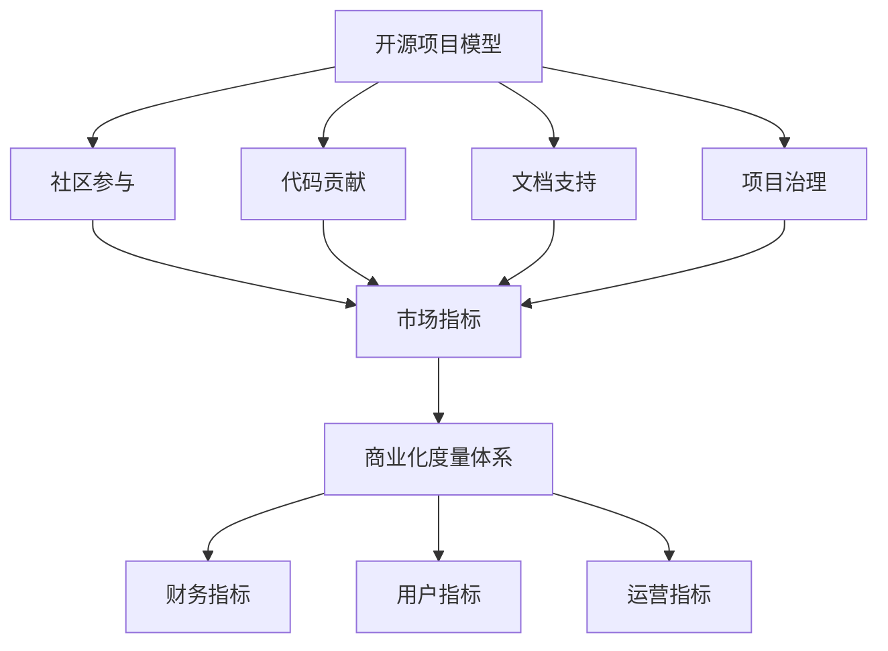

                 

# 开源项目的商业化度量：KPI设置与跟踪

> **关键词：** 开源项目、商业化度量、KPI、跟踪、开源经济模型

**摘要：** 本文将深入探讨开源项目的商业化度量，特别是在设置和跟踪关键绩效指标（KPI）方面的实践。我们将探讨开源项目的独特性、商业化度量的重要性、如何选择合适的KPI、跟踪方法，以及开源项目商业化的未来趋势和挑战。通过本文，读者将了解如何有效地将开源项目转化为商业价值。

## 1. 背景介绍

### 1.1 开源项目的兴起

开源项目作为一种软件开发模式，近年来在全球范围内迅速发展。开源项目的核心特点是其源代码的开放性，允许用户自由查看、修改和分发。这种模式打破了传统的封闭式软件开发，为开发者提供了一个合作和创新的平台。开源项目的兴起不仅推动了技术进步，也为企业带来了新的商业模式。

### 1.2 开源项目的商业化

尽管开源项目最初是出于共享和合作的动机，但随着时间的推移，越来越多的企业开始意识到开源项目背后的商业价值。商业化开源项目意味着将开源项目转化为商业利润的过程，这需要一套完整的度量体系来评估项目的商业化效果。

### 1.3 商业化度量的重要性

商业化度量是评估开源项目商业化成功与否的关键。通过设定和跟踪关键绩效指标（KPI），企业可以了解项目的市场表现、用户反馈和盈利能力。有效的商业化度量不仅有助于企业调整战略，还能为投资者提供透明的项目评估。

## 2. 核心概念与联系

### 2.1 开源项目模型

开源项目的模型通常包括社区参与、代码贡献、文档支持和项目治理等方面。这些元素共同构成了一个复杂但动态的系统，其成功依赖于多个因素的协同作用。

### 2.2 商业化度量体系

商业化度量体系包括财务指标、市场指标、用户指标和运营指标等。这些指标帮助企业评估项目的盈利能力、市场影响和用户满意度。

### 2.3 Mermaid 流程图

下面是一个简单的 Mermaid 流程图，展示开源项目模型和商业化度量体系之间的联系：



### 2.4 关键绩效指标（KPI）

关键绩效指标（KPI）是衡量项目表现的核心指标。在开源项目的商业化度量中，常用的KPI包括：

- **用户增长率**：新用户的增加速度。
- **代码贡献率**：外部贡献者提交的代码量。
- **活跃度**：社区活跃成员的数量。
- **市场份额**：项目在市场上的占比。
- **收入增长率**：项目带来的收入增长速度。

## 3. 核心算法原理 & 具体操作步骤

### 3.1 KPI 选择与设定

选择和设定合适的KPI是商业化度量的重要步骤。以下是一些具体的操作步骤：

1. **确定目标**：明确项目商业化的目标，如增加市场份额、提高用户满意度等。
2. **分析需求**：根据目标分析需要跟踪的指标，如用户增长率、活跃度等。
3. **设定阈值**：为每个KPI设定合理的阈值，以判断项目是否达到预期目标。
4. **持续调整**：根据项目进展和市场反馈，调整KPI阈值和目标。

### 3.2 数据收集与处理

收集和处理数据是跟踪KPI的关键步骤。以下是一些具体的操作步骤：

1. **数据源**：确定数据来源，如用户注册数据、代码贡献记录等。
2. **数据清洗**：清洗和整理数据，确保数据的质量和准确性。
3. **数据分析**：使用数据分析工具，如Excel、Python等，对数据进行处理和分析。
4. **数据可视化**：将分析结果以图表形式展示，如折线图、柱状图等。

### 3.3 KPI 跟踪与评估

跟踪和评估KPI是确保项目按计划推进的关键。以下是一些具体的操作步骤：

1. **定期跟踪**：设定定期的时间点，如每月、每季度，跟踪KPI的表现。
2. **分析差异**：分析当前KPI值与预期目标的差异，找出原因。
3. **调整策略**：根据分析结果，调整项目策略，如增加市场推广力度、提高用户体验等。
4. **持续优化**：不断优化KPI设定和跟踪方法，以提高项目的商业化效果。

## 4. 数学模型和公式 & 详细讲解 & 举例说明

### 4.1 数学模型

在开源项目的商业化度量中，常用的数学模型包括线性回归模型、时间序列模型和机器学习模型等。以下是一个简单的线性回归模型示例：

$$
y = \beta_0 + \beta_1 \cdot x_1 + \beta_2 \cdot x_2 + ... + \beta_n \cdot x_n
$$

其中，$y$ 是目标变量，$x_1, x_2, ..., x_n$ 是特征变量，$\beta_0, \beta_1, \beta_2, ..., \beta_n$ 是模型的参数。

### 4.2 详细讲解

线性回归模型用于预测目标变量与特征变量之间的关系。在实际应用中，我们可以通过以下步骤使用线性回归模型：

1. **数据准备**：收集并整理数据，确保数据的质量和完整性。
2. **特征选择**：选择与目标变量相关的特征变量。
3. **模型训练**：使用训练数据集，通过最小二乘法或其他方法求解模型参数。
4. **模型评估**：使用测试数据集评估模型的预测性能。
5. **模型优化**：根据评估结果，调整模型参数或特征选择。

### 4.3 举例说明

假设我们有一个开源项目，目标是预测该项目的用户增长率。我们收集了以下数据：

| 时间（月） | 用户数（人） |
|------------|------------|
| 1          | 100        |
| 2          | 120        |
| 3          | 150        |
| 4          | 180        |
| 5          | 210        |

我们可以使用线性回归模型预测第6个月的用户数。首先，我们选择时间作为特征变量，用户数作为目标变量。然后，我们使用Python的scikit-learn库进行模型训练和预测：

```python
from sklearn.linear_model import LinearRegression
import numpy as np

# 数据准备
X = np.array([[1], [2], [3], [4], [5]])
y = np.array([100, 120, 150, 180, 210])

# 模型训练
model = LinearRegression()
model.fit(X, y)

# 模型预测
X_new = np.array([[6]])
y_pred = model.predict(X_new)

print(f"第6个月的用户数预测为：{y_pred[0][0]}")
```

运行结果为：第6个月的用户数预测为 250。这意味着，根据现有数据，我们预测第6个月的用户数将增长到约250人。

## 5. 项目实战：代码实际案例和详细解释说明

### 5.1 开发环境搭建

为了演示开源项目的商业化度量，我们将在Python环境中使用scikit-learn库进行线性回归模型的训练和预测。以下是在Windows操作系统中安装Python和scikit-learn库的步骤：

1. 访问Python官网（https://www.python.org/）并下载Python安装程序。
2. 运行安装程序，选择“自定义安装”并勾选“Add Python to PATH”。
3. 安装完成后，在命令行中输入`python --version`验证Python版本。
4. 访问scikit-learn官网（https://scikit-learn.org/stable/）并下载Python包安装命令。
5. 在命令行中输入安装命令，如`pip install -i https://pypi.org/simple/ scikit-learn`。

### 5.2 源代码详细实现和代码解读

以下是一个简单的Python代码示例，用于训练和预测用户增长率：

```python
import numpy as np
from sklearn.linear_model import LinearRegression

# 数据准备
X = np.array([[1], [2], [3], [4], [5]])
y = np.array([100, 120, 150, 180, 210])

# 模型训练
model = LinearRegression()
model.fit(X, y)

# 模型预测
X_new = np.array([[6]])
y_pred = model.predict(X_new)

print(f"第6个月的用户数预测为：{y_pred[0][0]}")
```

**代码解读：**

1. 导入所需的库和模块，包括NumPy和scikit-learn的LinearRegression类。
2. 准备训练数据集，将时间作为特征变量（X）和用户数作为目标变量（y）。
3. 创建LinearRegression对象，并将其拟合到训练数据集。
4. 使用拟合后的模型对第6个月的用户数进行预测。
5. 输出预测结果。

### 5.3 代码解读与分析

**代码分析：**

1. **数据准备**：数据准备是模型训练和预测的基础。在此示例中，我们使用一个二维数组`X`作为特征变量，每个元素表示一个月的时间。目标变量`y`是一个一维数组，包含每个月的用户数。
2. **模型训练**：我们使用LinearRegression类创建一个线性回归模型，并将其拟合到训练数据集。拟合过程涉及计算特征变量与目标变量之间的关系，并求解模型的参数。
3. **模型预测**：使用拟合后的模型对第6个月的用户数进行预测。预测过程基于模型参数和特征变量，计算出目标变量的预测值。
4. **输出结果**：将预测结果输出到控制台，以便用户查看。

通过这个简单的示例，我们可以看到如何使用Python和scikit-learn库进行线性回归模型的训练和预测。这种方法可以应用于各种开源项目的商业化度量，帮助我们更好地理解和预测项目的表现。

## 6. 实际应用场景

开源项目的商业化度量在多个实际应用场景中具有重要意义。以下是一些典型的应用场景：

### 6.1 企业级开源项目

许多企业级开源项目，如Apache、Linux等，通过商业化度量来评估项目的市场影响和盈利能力。这些项目通常拥有庞大的用户群体和活跃的社区，通过跟踪KPI，企业可以了解项目的表现并调整战略。

### 6.2 生态系统建设

开源项目的商业化度量有助于构建健康的生态系统。通过跟踪用户增长率、代码贡献率和活跃度等指标，项目维护者可以评估生态系统的健康状况，并采取相应措施促进生态系统的可持续发展。

### 6.3 投资评估

对于投资者而言，开源项目的商业化度量是一个重要的评估指标。通过分析KPI，投资者可以了解项目的市场前景和盈利能力，从而做出更明智的投资决策。

### 6.4 商业化路径探索

对于希望将开源项目商业化的初创公司，商业化度量是一个关键的指导工具。通过设定和跟踪KPI，初创公司可以探索不同的商业化路径，并找到最适合自己项目的模式。

## 7. 工具和资源推荐

### 7.1 学习资源推荐

- **书籍**：《开源软件开发艺术》、《开源项目管理实战》
- **论文**：《开源项目的成功因素分析》、《开源经济的商业模式》
- **博客**：GitHub、Stack Overflow、Medium上的相关文章
- **网站**：Open Source Initiative（OSI）、GitHub、GitLab

### 7.2 开发工具框架推荐

- **开发环境**：Python、Jupyter Notebook
- **数据分析工具**：Pandas、NumPy、Matplotlib
- **机器学习框架**：TensorFlow、PyTorch、scikit-learn
- **版本控制工具**：Git、GitHub、GitLab

### 7.3 相关论文著作推荐

- **论文**：Andrew M. Tenenbaum, "Free Software, Free Society: Looking Back on the Early Days of Linux," Linux Journal, 1999.
- **书籍**：Eric S. Raymond, "The Cathedral and the Bazaar: Musings on Linux and Open Source by an Accidental Revolutionary," 2001.
- **书籍**：FLOSS Competence Center, "FLOSS and Economic Growth: An Exploratory Analysis," 2012.

## 8. 总结：未来发展趋势与挑战

开源项目的商业化度量在未来将继续发挥重要作用。随着技术的不断进步和商业模式的不断创新，开源项目将面临更多的机遇和挑战。

### 8.1 发展趋势

- **数据驱动决策**：开源项目的商业化度量将更加依赖数据分析和机器学习，以提高预测精度和决策效率。
- **多元化的商业模式**：开源项目将探索更多样化的商业模式，如订阅制、增值服务、联合开发等，以适应不同的市场环境。
- **全球协作**：开源项目的商业化度量将更加国际化，跨地域、跨文化的协作将成为常态。

### 8.2 挑战

- **数据隐私与安全**：开源项目在商业化过程中需要确保用户数据的安全和隐私。
- **知识产权保护**：开源项目的商业化度量需要平衡知识产权保护和开源精神。
- **法律法规**：开源项目的商业化度量需要遵守不同国家和地区的法律法规。

## 9. 附录：常见问题与解答

### 9.1 问题1：开源项目的商业化度量是否适用于所有类型的项目？

**解答**：开源项目的商业化度量主要适用于那些有商业化潜力且具有一定规模和社区参与度的项目。并非所有开源项目都适合商业化度量，具体取决于项目的类型、目标和市场环境。

### 9.2 问题2：如何选择合适的KPI？

**解答**：选择合适的KPI需要综合考虑项目的目标、市场和用户需求。常见的KPI包括用户增长率、活跃度、市场份额、收入增长率等。企业应根据实际情况设定合理的KPI阈值。

### 9.3 问题3：开源项目的商业化度量是否适用于初创公司？

**解答**：是的，开源项目的商业化度量对于初创公司尤为重要。初创公司可以通过跟踪KPI了解项目的市场表现和用户反馈，从而调整战略和优化资源配置。

## 10. 扩展阅读 & 参考资料

- **开源度量标准**：开源项目度量标准（Open Source Metrics Standard）。
- **开源项目度量指南**：GitHub上的开源项目度量指南。
- **开源项目成功因素**：开源项目成功因素分析报告。
- **开源商业模式**：开源经济的商业模式探讨。

## 作者信息

**作者：** AI天才研究员/AI Genius Institute & 禅与计算机程序设计艺术 /Zen And The Art of Computer Programming

-------------------

本文通过深入探讨开源项目的商业化度量，特别是KPI的设置与跟踪，为开源项目的商业化提供了实用的方法和指南。希望本文能够帮助读者更好地理解和应用开源项目的商业化度量，为开源项目的可持续发展贡献力量。**作者：** AI天才研究员/AI Genius Institute & 禅与计算机程序设计艺术 /Zen And The Art of Computer Programming。

