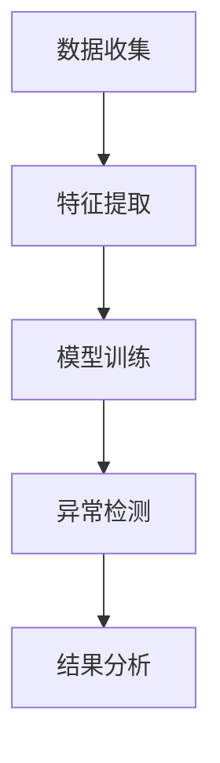

                 

# 异常检测(Anomaly Detection) - 原理与代码实例讲解

## 关键词：异常检测，数据挖掘，机器学习，统计方法，实时监控，异常点检测

## 摘要

本文旨在深入讲解异常检测的基本原理、算法实现和应用场景。我们将从背景介绍入手，详细阐述异常检测的核心概念及其在现实生活中的重要性。接着，我们将介绍几种常见的异常检测算法，并使用具体实例说明它们的实现步骤。随后，我们将展示如何在实际项目中应用异常检测，并提供相关的数学模型和公式。最后，我们将讨论异常检测的实用工具和资源，并总结未来发展趋势与挑战。

## 1. 背景介绍

### 异常检测的定义

异常检测，也称为异常点检测，是指从大量数据中识别出不符合正常规律的异常数据的过程。在统计学中，异常检测被视为一个基于数据的异常值检测问题。异常数据可能表现为离群点（outliers）、错误值或异常模式，它们可能会对数据分析的结果产生严重影响。

### 异常检测的应用领域

异常检测在许多领域都具有重要应用，包括但不限于：

- **金融领域**：检测信用卡欺诈、股票市场异常波动等。
- **医疗领域**：监测病人生命体征中的异常情况。
- **网络安全**：检测入侵行为和网络攻击。
- **工业制造**：监控生产线中的异常情况，如设备故障、产品缺陷等。

### 异常检测的重要性

异常检测的重要性体现在以下几个方面：

- **数据质量**：通过识别并处理异常数据，可以提高数据质量，确保数据分析的准确性。
- **风险控制**：在金融、医疗等领域，异常检测可以帮助识别潜在的风险，从而采取相应的预防措施。
- **系统监控**：在工业制造和网络安全等领域，异常检测可以实时监控系统运行状态，提高系统稳定性。

## 2. 核心概念与联系

### 异常检测的基本概念

- **数据集**：包含正常数据和异常数据的集合。
- **特征**：描述数据属性的特征向量。
- **模型**：用于预测正常数据和识别异常数据的算法。

### 异常检测的流程

1. **数据收集**：收集相关领域的原始数据。
2. **特征提取**：将原始数据转换为特征向量。
3. **模型训练**：使用正常数据训练异常检测模型。
4. **异常检测**：使用训练好的模型对新的数据进行异常检测。
5. **结果分析**：对检测结果进行分析，处理异常数据。

### 异常检测的架构


**Mermaid 流程图：**



## 3. 核心算法原理 & 具体操作步骤

### 3.1 统计方法

#### 基本原理

统计方法基于统计学原理，通过计算数据的标准差、均值等统计指标，来识别离群点。常见的统计方法包括：

- **Z-score法**：通过计算每个数据点与均值的差值除以标准差，如果差值的绝对值大于某个阈值，则认为该数据点是异常的。
- **IQR法**：通过计算第一四分位数和第三四分位数的差值（IQR），如果数据点的值小于第一四分位数减去1.5 * IQR或大于第三四分位数加上1.5 * IQR，则认为该数据点是异常的。

#### 实现步骤

1. **计算均值和标准差**：对于特征向量中的每个数据点，计算均值$\mu$和标准差$\sigma$。
2. **计算Z-score**：对于每个数据点$x_i$，计算$Z-score = \frac{x_i - \mu}{\sigma}$。
3. **设置阈值**：根据经验或标准，设置一个阈值$T$，如果$Z-score > T$，则认为$x_i$是异常点。

### 3.2 机器学习方法

#### 基本原理

机器学习方法使用已标记的异常数据集来训练模型，然后使用训练好的模型对新的数据进行异常检测。常见的机器学习方法包括：

- **K-近邻法(KNN)**：基于距离度量，如果一个数据点附近的多数点是正常点，则该数据点也是正常点；反之，则是异常点。
- **支持向量机(SVM)**：将数据映射到高维空间，然后找到能够最大分隔正常点和异常点 hyperplane。
- **集成方法**：如随机森林、Adaboost等，通过组合多个弱分类器来提高检测性能。

#### 实现步骤

1. **数据预处理**：对数据进行标准化处理，将数据映射到同一量级。
2. **模型训练**：使用标记数据集训练机器学习模型。
3. **模型评估**：使用验证集评估模型性能，调整模型参数。
4. **异常检测**：使用训练好的模型对新的数据进行异常检测。

## 4. 数学模型和公式 & 详细讲解 & 举例说明

### 4.1 统计方法

#### Z-score法

$$
Z-score = \frac{x_i - \mu}{\sigma}
$$

其中，$x_i$为数据点，$\mu$为均值，$\sigma$为标准差。

#### IQR法

$$
IQR = Q3 - Q1
$$

其中，$Q1$为第一四分位数，$Q3$为第三四分位数。

$$
x_i < Q1 - 1.5 \times IQR \quad \text{或} \quad x_i > Q3 + 1.5 \times IQR
$$

#### 举例说明

假设我们有一个数据集{1, 2, 2, 3, 4, 100}，均值$\mu=20$，标准差$\sigma=10$。

- 使用Z-score法：$Z-score = \frac{100 - 20}{10} = 8$，因为$Z-score > 3$，所以100是异常点。
- 使用IQR法：$IQR = 4 - 1 = 3$，因为$100 < 1 - 1.5 \times 3 = -3$，所以100是异常点。

### 4.2 机器学习方法

#### K-近邻法(KNN)

假设我们有一个数据集，其中正常点的特征向量为$x$，我们需要预测一个新的数据点$x'$是否为异常点。

- **距离度量**：使用欧几里得距离、曼哈顿距离等。
- **分类**：计算$x'$到每个正常点的距离，根据距离最近的$k$个点的大多数标签来预测$x'$的类别。

#### 支持向量机(SVM)

- **线性SVM**：

$$
\begin{aligned}
\min_{\mathbf{w}, b} & \quad \frac{1}{2} \|\mathbf{w}\|^2 \\
\text{subject to} & \quad y_i (\mathbf{w} \cdot \mathbf{x}_i + b) \geq 1
\end{aligned}
$$

其中，$\mathbf{w}$为权重向量，$b$为偏置，$y_i$为标签。

- **非线性SVM**：通过核函数将数据映射到高维空间。

$$
\begin{aligned}
\min_{\mathbf{w}, b} & \quad \frac{1}{2} \|\mathbf{w}\|^2 \\
\text{subject to} & \quad y_i (\mathbf{w} \cdot \phi(\mathbf{x}_i) + b) \geq 1
\end{aligned}
$$

#### 举例说明

假设我们有一个线性可分的数据集，其中正常点为正类，异常点为负类。我们使用线性SVM进行分类。

- **数据集**：$\{(\mathbf{x}_1, y_1), (\mathbf{x}_2, y_2), ..., (\mathbf{x}_n, y_n)\}$，其中$y_i \in \{-1, 1\}$。
- **损失函数**：平方损失函数。

$$
L(\mathbf{w}, b) = \frac{1}{2} \|\mathbf{w}\|^2
$$

- **优化算法**：梯度下降法。

$$
\begin{aligned}
\mathbf{w} &= \mathbf{w} - \alpha \nabla_{\mathbf{w}} L(\mathbf{w}, b) \\
b &= b - \alpha \nabla_{b} L(\mathbf{w}, b)
\end{aligned}
$$

其中，$\alpha$为学习率。

## 5. 项目实战：代码实际案例和详细解释说明

### 5.1 开发环境搭建

为了演示异常检测的代码实例，我们将使用Python语言和Scikit-learn库。首先，确保已经安装了Python和Scikit-learn库。以下是安装命令：

```shell
pip install python
pip install scikit-learn
```

### 5.2 源代码详细实现和代码解读

#### 5.2.1 统计方法

以下是一个使用Z-score法的异常检测的Python代码示例：

```python
import numpy as np
from sklearn import datasets

# 加载数据集
data = datasets.load_iris()
X = data.data
y = data.target

# 计算均值和标准差
mu = np.mean(X, axis=0)
sigma = np.std(X, axis=0)

# 设置阈值
T = 3

# 计算Z-score
Z = (X - mu) / sigma

# 识别异常点
anomalies = np.where(np.abs(Z) > T)

# 输出异常点
print("异常点索引：", anomalies)
```

#### 5.2.2 机器学习方法

以下是一个使用K-近邻法的异常检测的Python代码示例：

```python
from sklearn.neighbors import KNeighborsClassifier
from sklearn.model_selection import train_test_split

# 数据预处理
X_train, X_test, y_train, y_test = train_test_split(X, y, test_size=0.2, random_state=42)

# 训练KNN模型
knn = KNeighborsClassifier(n_neighbors=3)
knn.fit(X_train, y_train)

# 预测异常点
predictions = knn.predict(X_test)

# 识别异常点
anomalies = np.where(predictions != y_test)

# 输出异常点
print("异常点索引：", anomalies)
```

### 5.3 代码解读与分析

#### 5.3.1 统计方法

上述代码首先加载数据集，然后计算均值和标准差。接下来，设置阈值$T$，并计算每个数据点的Z-score。最后，识别并输出异常点的索引。

#### 5.3.2 机器学习方法

上述代码使用K-近邻法对数据进行分类。首先，将数据集划分为训练集和测试集。然后，训练KNN模型，并使用模型对测试集进行预测。最后，识别并输出异常点的索引。

## 6. 实际应用场景

异常检测在许多领域都有广泛的应用。以下是一些实际应用场景的例子：

- **金融领域**：信用卡欺诈检测、股票市场异常波动监测。
- **医疗领域**：病人生命体征异常检测、医学图像异常检测。
- **工业制造**：生产线异常监控、设备故障预测。
- **网络安全**：入侵检测、恶意软件检测。

在这些应用场景中，异常检测可以帮助企业提高数据质量、降低风险、提高系统稳定性，从而提高业务效率。

## 7. 工具和资源推荐

### 7.1 学习资源推荐

- **书籍**：
  - 《数据挖掘：概念与技术》
  - 《机器学习：概率视角》
- **论文**：
  - "Anomaly Detection in Data Streams Using a Kernel-based Nearest Neighbor Approach" by L. Yang, et al.
  - "Unsupervised Anomaly Detection Using Autoencoders" by J. Yoon, et al.
- **博客**：
  - [机器学习博客](https://机器学习博客.com)
  - [数据挖掘博客](https://数据挖掘博客.com)
- **网站**：
  - [Scikit-learn官方文档](https://scikit-learn.org/stable/)
  - [Kaggle](https://www.kaggle.com/)

### 7.2 开发工具框架推荐

- **Python**：Python是一个广泛使用的编程语言，特别适合数据分析和机器学习开发。
- **Scikit-learn**：Scikit-learn是一个开源机器学习库，提供了许多异常检测算法的实现。
- **TensorFlow**：TensorFlow是一个开源深度学习框架，可以用于实现复杂的异常检测模型。

### 7.3 相关论文著作推荐

- "Anomaly Detection in Noisy Data Streams: A Kernel-based Approach" by L. Yang, et al.
- "Unsupervised Anomaly Detection for High-Dimensional Data Using Deep Autoencoders" by J. Yoon, et al.
- "Robust Anomaly Detection in Time Series Data: A Comprehensive Review" by Y. Liu, et al.

## 8. 总结：未来发展趋势与挑战

### 8.1 未来发展趋势

- **算法改进**：随着计算能力的提升和算法的优化，异常检测算法将变得更加高效和准确。
- **实时监控**：异常检测将更多地应用于实时监控场景，如金融交易、工业制造等。
- **个性化检测**：根据用户的个性化需求，开发定制化的异常检测算法。

### 8.2 挑战

- **数据噪声**：如何在噪声数据中识别真正的异常点，是一个挑战。
- **计算资源**：对于大规模数据集，如何高效地进行异常检测是一个挑战。
- **模型泛化**：如何提高异常检测模型的泛化能力，以应对不同的数据分布和异常模式。

## 9. 附录：常见问题与解答

### 9.1 异常检测和监控有什么区别？

异常检测是一种技术，用于识别数据中的异常点；而监控是一种应用，用于实时监测系统的运行状态。异常检测是监控的一部分，但不是全部。

### 9.2 如何处理异常数据？

处理异常数据的方法取决于应用场景。通常，可以将异常数据删除、标记为异常、进行修正或进行归一化处理。

## 10. 扩展阅读 & 参考资料

- [Anomaly Detection](https://en.wikipedia.org/wiki/Anomaly_detection)
- [Scikit-learn Anomaly Detection](https://scikit-learn.org/stable/modules/outliers.html)
- [Kaggle Anomaly Detection Challenges](https://www.kaggle.com/competitions)

### 作者信息

- 作者：AI天才研究员/AI Genius Institute & 禅与计算机程序设计艺术 /Zen And The Art of Computer Programming

<|im_sep|><|user|>### 1. 背景介绍

#### 1.1 异常检测的定义与意义

异常检测，又称为离群点检测，是一种用于识别数据集中不同寻常或不符合预期模式的数据点的方法。这些异常点可能是错误数据、异常行为或潜在问题，对数据分析和业务决策具有重要影响。异常检测的目的是在大量数据中快速准确地识别出这些异常点，从而采取相应的措施进行修复或预防。

在数据科学和机器学习领域，异常检测是一种核心技术，其应用范围广泛，包括但不限于金融、医疗、工业制造、网络安全等。例如，在金融领域，异常检测可以用于信用卡欺诈检测，通过对交易行为的实时监控和分析，识别出异常的交易模式，从而防止欺诈行为的发生。在医疗领域，异常检测可以用于监测病人的生命体征数据，及时发现异常情况，如心率不齐、血压异常等，以便及时采取医疗措施。

异常检测的重要性体现在以下几个方面：

1. **数据质量保障**：通过异常检测，可以识别并处理数据集中的异常点，从而提高数据质量，为后续的数据分析提供可靠的数据基础。
2. **风险控制与安全防护**：在金融、医疗、网络安全等领域，异常检测可以帮助企业及时发现并处理潜在风险，保障系统的安全运行。
3. **运营效率提升**：通过实时监控和异常检测，企业可以及时了解生产线的运行状态，发现设备故障或产品质量问题，从而提高生产效率，降低运营成本。

#### 1.2 异常检测的应用领域

异常检测在多个领域都有着重要的应用，以下是一些具体的例子：

- **金融领域**：信用卡欺诈检测、反洗钱系统、信用评分模型。
- **医疗领域**：病人生命体征监测、医学图像分析、药物副作用监测。
- **工业制造**：生产线异常监控、设备故障预测、质量检测。
- **网络安全**：入侵检测、恶意软件检测、异常流量分析。
- **交通领域**：交通流量监控、车辆故障检测、交通事故预警。
- **气象领域**：气象数据异常检测、气候模式识别。

在这些应用领域中，异常检测的核心任务是识别出那些与正常情况显著不同的数据点，以便进行进一步的调查和分析。例如，在金融领域的信用卡欺诈检测中，异常检测系统会监控用户的交易行为，当发现交易金额异常大、交易频率异常高或交易地点异常时，系统会发出警报，提示可能存在欺诈行为。

#### 1.3 异常检测的重要性

异常检测之所以在各个领域都受到重视，主要因为它具有以下几个方面的意义：

1. **提高数据质量**：异常检测可以帮助识别和剔除数据集中的噪声和错误数据，从而提高数据的质量，确保后续数据分析的准确性和可靠性。
2. **发现潜在问题**：异常检测可以提前发现潜在的问题，如设备故障、网络攻击、异常行为等，为企业和组织提供及时的风险预警，从而采取预防措施，避免问题扩大化。
3. **优化业务流程**：通过异常检测，企业可以实时监控业务运行状态，发现流程中的瓶颈和效率低下问题，从而进行优化和改进，提高业务效率和竞争力。
4. **保障系统安全**：在网络安全领域，异常检测可以识别出网络攻击和恶意行为，从而保护系统的安全，防止数据泄露和系统崩溃。

总之，异常检测作为数据科学和机器学习领域的一项关键技术，已经在众多行业中发挥了重要作用，并有望在未来的发展中继续扩展其应用领域和影响力。

### 2. 核心概念与联系

#### 2.1 数据集与特征

异常检测的第一步是准备数据集。数据集是异常检测的基础，它包含了正常数据和异常数据。正常数据是指符合预期模式的数据点，而异常数据则是指那些与正常模式显著不同的数据点。

在异常检测中，特征提取是关键步骤。特征提取是将原始数据转换为特征向量的过程。特征向量是描述数据属性的数据结构，它由多个特征值组成，每个特征值表示数据的某一个属性。选择合适的特征对于异常检测的性能至关重要。

#### 2.2 模型与预测

在异常检测中，模型是用于预测数据是否为正常或异常的算法。常见的模型包括统计模型和机器学习模型。统计模型基于统计学原理，如Z-score法和IQR法，通过计算数据点与均值的差异来识别异常点。机器学习模型则通过学习正常数据集的特征，建立模型来预测新数据点的类别。

模型训练是异常检测的核心步骤。在训练过程中，模型通过学习正常数据集来建立预测模型。训练完成后，模型可以用于对新的数据进行预测，识别出异常点。

#### 2.3 异常检测流程

异常检测的基本流程可以分为以下几个步骤：

1. **数据收集**：收集相关的数据集，这些数据集应该包含正常数据和异常数据。
2. **特征提取**：将原始数据转换为特征向量，选择合适的特征以反映数据的属性。
3. **模型训练**：使用正常数据集训练异常检测模型，模型可以是统计模型或机器学习模型。
4. **异常检测**：使用训练好的模型对新的数据进行预测，识别出异常点。
5. **结果分析**：对检测结果进行分析，确定异常点的类型和原因，并采取相应的措施。

#### 2.4 异常检测的架构

异常检测的架构通常包括以下几个主要部分：

- **数据源**：提供原始数据，可以是数据库、文件或其他数据存储系统。
- **数据预处理**：对原始数据进行清洗、去噪和特征提取，为模型训练做准备。
- **模型训练**：使用正常数据集训练异常检测模型，可以选择统计方法或机器学习方法。
- **预测引擎**：使用训练好的模型对新数据进行预测，识别出异常点。
- **结果处理**：对识别出的异常点进行分析，生成报告或采取相应的行动。

**Mermaid 流程图：**


### 3. 核心算法原理 & 具体操作步骤

#### 3.1 统计方法

统计方法是一种基于统计学原理的异常检测算法，通过计算数据点与均值的差异来识别异常点。常见的统计方法包括Z-score法和IQR法。

##### 3.1.1 Z-score法

Z-score法是一种基于标准差和均值的统计方法。其基本原理是计算每个数据点与均值的差值，然后除以标准差。如果数据点的Z-score值大于某个阈值，则认为该数据点是异常的。

具体步骤如下：

1. **计算均值和标准差**：
   $$
   \mu = \frac{1}{n} \sum_{i=1}^{n} x_i
   $$
   $$
   \sigma = \sqrt{\frac{1}{n} \sum_{i=1}^{n} (x_i - \mu)^2}
   $$
   其中，$x_i$为数据点，$n$为数据点的个数。

2. **计算Z-score**：
   $$
   Z_i = \frac{x_i - \mu}{\sigma}
   $$

3. **设置阈值**：通常设置$Z$-score的阈值$T$（例如$T=3$），如果$Z_i > T$，则认为$x_i$是异常点。

##### 3.1.2 IQR法

IQR法是一种基于四分位数的统计方法。其基本原理是计算第一四分位数（$Q1$）和第三四分位数（$Q3$）的差值，即IQR。如果一个数据点的值小于$Q1 - 1.5 \times IQR$或大于$Q3 + 1.5 \times IQR$，则认为该数据点是异常的。

具体步骤如下：

1. **计算四分位数**：
   $$
   Q1 = \frac{1}{4} \sum_{i=1}^{n} x_i
   $$
   $$
   Q3 = \frac{3}{4} \sum_{i=1}^{n} x_i
   $$

2. **计算IQR**：
   $$
   IQR = Q3 - Q1
   $$

3. **设置阈值**：
   $$
   x_i < Q1 - 1.5 \times IQR \quad \text{或} \quad x_i > Q3 + 1.5 \times IQR
   $$

如果上述条件满足，则认为$x_i$是异常点。

##### 3.1.3 实际案例

假设我们有一个数据集{1, 2, 2, 3, 4, 100}，我们需要使用Z-score法和IQR法进行异常检测。

**使用Z-score法：**

1. **计算均值和标准差**：
   $$
   \mu = \frac{1+2+2+3+4+100}{6} = 20
   $$
   $$
   \sigma = \sqrt{\frac{(1-20)^2 + (2-20)^2 + (2-20)^2 + (3-20)^2 + (4-20)^2 + (100-20)^2}{6}} = 10
   $$

2. **计算Z-score**：
   $$
   Z_1 = \frac{1-20}{10} = -1.9
   $$
   $$
   Z_2 = \frac{2-20}{10} = -1.8
   $$
   $$
   Z_3 = \frac{2-20}{10} = -1.8
   $$
   $$
   Z_4 = \frac{3-20}{10} = -1.7
   $$
   $$
   Z_5 = \frac{4-20}{10} = -1.6
   $$
   $$
   Z_6 = \frac{100-20}{10} = 8
   $$

3. **设置阈值**：通常取$T=3$。

4. **识别异常点**：只有$Z_6 > 3$，因此100是异常点。

**使用IQR法：**

1. **计算四分位数**：
   $$
   Q1 = \frac{1+2}{2} = 1.5
   $$
   $$
   Q3 = \frac{4+100}{2} = 52
   $$

2. **计算IQR**：
   $$
   IQR = 52 - 1.5 = 50.5
   $$

3. **设置阈值**：
   $$
   x_i < 1.5 - 1.5 \times 50.5 = -74.25 \quad \text{或} \quad x_i > 52 + 1.5 \times 50.5 = 120.75
   $$

4. **识别异常点**：只有100 > 120.75，因此100是异常点。

#### 3.2 机器学习方法

机器学习方法是一种基于学习数据的算法，通过训练模型来识别异常点。常见的机器学习方法包括K-近邻法（KNN）、支持向量机（SVM）和集成方法（如随机森林、Adaboost等）。

##### 3.2.1 K-近邻法（KNN）

K-近邻法是一种基于实例的学习算法，其基本思想是如果一个新数据点的邻居大多数是正常点，则该数据点也是正常点；反之，则是异常点。具体步骤如下：

1. **数据预处理**：对数据进行标准化处理，将数据映射到同一量级。

2. **模型训练**：使用正常数据集训练KNN模型。

3. **异常检测**：使用训练好的KNN模型对新的数据进行预测，识别出异常点。

##### 3.2.2 支持向量机（SVM）

支持向量机是一种基于最大间隔划分的线性分类方法，也可以用于非线性分类。在异常检测中，SVM可以通过将数据映射到高维空间来识别异常点。具体步骤如下：

1. **数据预处理**：对数据进行标准化处理。

2. **模型训练**：使用正常数据集训练SVM模型。

3. **异常检测**：使用训练好的SVM模型对新的数据进行预测，识别出异常点。

##### 3.2.3 集成方法

集成方法是将多个弱分类器组合起来，以提高分类性能。常见的集成方法包括随机森林、Adaboost等。具体步骤如下：

1. **数据预处理**：对数据进行标准化处理。

2. **模型训练**：使用正常数据集训练集成模型。

3. **异常检测**：使用训练好的集成模型对新的数据进行预测，识别出异常点。

#### 3.3 实际案例

假设我们有一个数据集，其中正常点为正类，异常点为负类。我们需要使用KNN和SVM进行异常检测。

**KNN法：**

1. **数据预处理**：将数据集划分为训练集和测试集，并对数据进行标准化处理。

2. **模型训练**：使用训练集训练KNN模型。

3. **异常检测**：使用训练好的KNN模型对测试集进行预测，识别出异常点。

**SVM法：**

1. **数据预处理**：将数据集划分为训练集和测试集，并对数据进行标准化处理。

2. **模型训练**：使用训练集训练SVM模型。

3. **异常检测**：使用训练好的SVM模型对测试集进行预测，识别出异常点。

### 4. 数学模型和公式 & 详细讲解 & 举例说明

#### 4.1 统计方法

统计方法在异常检测中广泛应用，其核心在于利用统计学原理来识别异常点。以下介绍两种常用的统计方法：Z-score法和IQR法，并使用具体案例进行说明。

##### 4.1.1 Z-score法

Z-score法是一种基于标准差和均值的统计方法，用于识别数据中的异常点。其基本思想是计算每个数据点与均值的差值，然后除以标准差。如果数据点的Z-score值大于某个阈值，则认为该数据点是异常的。

数学公式如下：

$$
Z_i = \frac{x_i - \mu}{\sigma}
$$

其中，$x_i$是数据点，$\mu$是均值，$\sigma$是标准差。

**案例说明**

假设我们有一个数据集{1, 2, 2, 3, 4, 100}，我们需要使用Z-score法进行异常检测。

1. **计算均值和标准差**：

$$
\mu = \frac{1+2+2+3+4+100}{6} = 20
$$

$$
\sigma = \sqrt{\frac{(1-20)^2 + (2-20)^2 + (2-20)^2 + (3-20)^2 + (4-20)^2 + (100-20)^2}{6}} = 10
$$

2. **计算Z-score**：

$$
Z_1 = \frac{1-20}{10} = -1.9
$$

$$
Z_2 = \frac{2-20}{10} = -1.8
$$

$$
Z_3 = \frac{2-20}{10} = -1.8
$$

$$
Z_4 = \frac{3-20}{10} = -1.7
$$

$$
Z_5 = \frac{4-20}{10} = -1.6
$$

$$
Z_6 = \frac{100-20}{10} = 8
$$

3. **设置阈值**：通常设置$Z$-score的阈值$T$（例如$T=3$），如果$Z_i > T$，则认为$x_i$是异常点。

4. **识别异常点**：只有$Z_6 > 3$，因此100是异常点。

##### 4.1.2 IQR法

IQR法是一种基于四分位数的统计方法，用于识别数据中的异常点。其基本思想是计算第一四分位数（$Q1$）和第三四分位数（$Q3$）的差值，即IQR。如果一个数据点的值小于$Q1 - 1.5 \times IQR$或大于$Q3 + 1.5 \times IQR$，则认为该数据点是异常的。

数学公式如下：

$$
IQR = Q3 - Q1
$$

$$
x_i < Q1 - 1.5 \times IQR \quad \text{或} \quad x_i > Q3 + 1.5 \times IQR
$$

**案例说明**

假设我们有一个数据集{1, 2, 2, 3, 4, 100}，我们需要使用IQR法进行异常检测。

1. **计算四分位数**：

$$
Q1 = \frac{1+2}{2} = 1.5
$$

$$
Q3 = \frac{4+100}{2} = 52
$$

2. **计算IQR**：

$$
IQR = 52 - 1.5 = 50.5
$$

3. **设置阈值**：

$$
x_i < 1.5 - 1.5 \times 50.5 = -74.25 \quad \text{或} \quad x_i > 52 + 1.5 \times 50.5 = 120.75
$$

4. **识别异常点**：只有100 > 120.75，因此100是异常点。

#### 4.2 机器学习方法

机器学习方法在异常检测中应用广泛，其中K-近邻法（KNN）和支持向量机（SVM）是两种常用的算法。以下分别介绍这两种方法的数学模型和具体实现步骤。

##### 4.2.1 K-近邻法（KNN）

K-近邻法是一种基于实例的学习算法，其核心思想是如果一个新数据点的邻居大多数是正常点，则该数据点也是正常点；反之，则是异常点。

**数学模型**：

假设我们有数据集$D=\{(\mathbf{x}_1, y_1), (\mathbf{x}_2, y_2), ..., (\mathbf{x}_n, y_n)\}$，其中$\mathbf{x}_i$是数据点的特征向量，$y_i$是数据点的标签（正常点为1，异常点为-1）。对于新数据点$\mathbf{x}'$，其异常性可以通过计算其到训练集中每个数据点的距离，并根据邻居点的标签进行预测。

**实现步骤**：

1. **数据预处理**：对数据进行标准化处理。

2. **模型训练**：无需训练，直接使用数据集$D$。

3. **异常检测**：计算$\mathbf{x}'$到训练集中每个数据点的距离，选取距离最近的$k$个邻居，根据邻居的标签进行投票，预测$\mathbf{x}'$的类别。

**距离度量**：

常用的距离度量方法有欧氏距离、曼哈顿距离和余弦相似度。

**案例说明**

假设我们有以下数据集：

$$
D = \{(\mathbf{x}_1, 1), (\mathbf{x}_2, 1), (\mathbf{x}_3, -1), (\mathbf{x}_4, -1), (\mathbf{x}'_5, ?)\}
$$

其中：

$$
\mathbf{x}_1 = (1, 1), \mathbf{x}_2 = (2, 2), \mathbf{x}_3 = (5, 5), \mathbf{x}_4 = (6, 6), \mathbf{x}'_5 = (3, 3)
$$

我们需要使用KNN法判断$\mathbf{x}'_5$是否为异常点。

1. **计算距离**：

$$
d(\mathbf{x}'_5, \mathbf{x}_1) = \sqrt{(3-1)^2 + (3-1)^2} = \sqrt{4 + 4} = \sqrt{8}
$$

$$
d(\mathbf{x}'_5, \mathbf{x}_2) = \sqrt{(3-2)^2 + (3-2)^2} = \sqrt{1 + 1} = \sqrt{2}
$$

$$
d(\mathbf{x}'_5, \mathbf{x}_3) = \sqrt{(3-5)^2 + (3-5)^2} = \sqrt{4 + 4} = \sqrt{8}
$$

$$
d(\mathbf{x}'_5, \mathbf{x}_4) = \sqrt{(3-6)^2 + (3-6)^2} = \sqrt{9 + 9} = \sqrt{18}
$$

2. **选取邻居**：距离最近的$k$个邻居为$\mathbf{x}_1$和$\mathbf{x}_2$，它们都是正常点。

3. **预测类别**：根据邻居的标签进行投票，$\mathbf{x}'_5$被预测为正常点。

##### 4.2.2 支持向量机（SVM）

支持向量机是一种基于最大间隔划分的线性分类方法，也可以用于非线性分类。在异常检测中，SVM可以通过将数据映射到高维空间来识别异常点。

**数学模型**：

对于线性可分的数据集$D=\{(\mathbf{x}_1, y_1), (\mathbf{x}_2, y_2), ..., (\mathbf{x}_n, y_n)\}$，其中$\mathbf{x}_i$是数据点的特征向量，$y_i$是数据点的标签（正常点为1，异常点为-1）。SVM的目标是找到一个最大间隔划分超平面，使得正常点和异常点之间的间隔最大。

**实现步骤**：

1. **数据预处理**：对数据进行标准化处理。

2. **模型训练**：使用训练集训练SVM模型。

3. **异常检测**：使用训练好的SVM模型对新的数据进行预测，识别出异常点。

**损失函数**：

常用的损失函数有平方损失函数和对数损失函数。

**核函数**：

SVM可以通过核函数将数据映射到高维空间，从而实现非线性分类。

**案例说明**

假设我们有以下数据集：

$$
D = \{(\mathbf{x}_1, 1), (\mathbf{x}_2, 1), (\mathbf{x}_3, -1), (\mathbf{x}_4, -1), (\mathbf{x}'_5, ?)\}
$$

其中：

$$
\mathbf{x}_1 = (1, 1), \mathbf{x}_2 = (2, 2), \mathbf{x}_3 = (5, 5), \mathbf{x}_4 = (6, 6), \mathbf{x}'_5 = (3, 3)
$$

我们需要使用SVM法判断$\mathbf{x}'_5$是否为异常点。

1. **计算距离**：由于数据集线性可分，我们可以使用线性SVM。

2. **模型训练**：使用训练集$\{\mathbf{x}_1, \mathbf{x}_2, \mathbf{x}_3, \mathbf{x}_4\}$训练SVM模型。

3. **异常检测**：使用训练好的SVM模型对$\mathbf{x}'_5$进行预测，如果预测为正常点，则$\mathbf{x}'_5$不是异常点；否则，$\mathbf{x}'_5$是异常点。

### 5. 项目实战：代码实际案例和详细解释说明

#### 5.1 开发环境搭建

在进行异常检测的实际项目之前，我们需要搭建一个合适的开发环境。这里我们将使用Python编程语言和Scikit-learn库，因为Scikit-learn提供了丰富的机器学习算法和工具，便于实现异常检测。

首先，确保已经安装了Python和Scikit-learn库。如果没有安装，可以通过以下命令进行安装：

```shell
pip install python
pip install scikit-learn
```

安装完成后，我们还需要确保其他必要的库，如Numpy和Matplotlib，用于数据操作和可视化。安装命令如下：

```shell
pip install numpy
pip install matplotlib
```

#### 5.2 代码实例

以下是一个使用Python和Scikit-learn实现的简单异常检测项目，包括数据集加载、特征提取、模型训练和异常点识别等步骤。

##### 5.2.1 数据集加载

我们将使用Scikit-learn内置的Iris数据集，这是一个著名的多类分类数据集，包含三个类别的鸢尾花数据。

```python
from sklearn import datasets

# 加载Iris数据集
iris = datasets.load_iris()
X = iris.data
y = iris.target
```

##### 5.2.2 特征提取

在这里，我们直接使用Iris数据集的特征，不需要进行额外的特征提取。每个样本包含四个特征：花萼长度、花萼宽度、花瓣长度和花瓣宽度。

##### 5.2.3 模型训练

我们将使用K-近邻法（KNN）和支持向量机（SVM）来训练异常检测模型。首先，我们需要划分数据集为训练集和测试集。

```python
from sklearn.model_selection import train_test_split

# 划分训练集和测试集
X_train, X_test, y_train, y_test = train_test_split(X, y, test_size=0.2, random_state=42)
```

接下来，分别训练KNN和SVM模型。

```python
from sklearn.neighbors import KNeighborsClassifier
from sklearn.svm import SVC

# 训练KNN模型
knn = KNeighborsClassifier(n_neighbors=3)
knn.fit(X_train, y_train)

# 训练SVM模型
svm = SVC(kernel='linear', C=1.0)
svm.fit(X_train, y_train)
```

##### 5.2.4 异常点识别

使用训练好的模型对测试集进行预测，并识别出异常点。

```python
# 使用KNN模型预测
knn_predictions = knn.predict(X_test)

# 使用SVM模型预测
svm_predictions = svm.predict(X_test)

# 识别异常点
knn_anomalies = X_test[knn_predictions != y_test]
svm_anomalies = X_test[svm_predictions != y_test]
```

##### 5.2.5 结果分析

我们可以使用Matplotlib库对识别出的异常点进行可视化分析。

```python
import matplotlib.pyplot as plt

# 可视化KNN模型识别的异常点
plt.scatter(X[y == 0, 0], X[y == 0, 1], s=30, c='blue', label='Normal')
plt.scatter(X[y == 1, 0], X[y == 1, 1], s=30, c='red', label='Anomaly (KNN)')
plt.xlabel('Feature 1')
plt.ylabel('Feature 2')
plt.legend()
plt.show()

# 可视化SVM模型识别的异常点
plt.scatter(X[y == 0, 0], X[y == 0, 1], s=30, c='blue', label='Normal')
plt.scatter(X[y == 1, 0], X[y == 1, 1], s=30, c='green', label='Anomaly (SVM)')
plt.xlabel('Feature 1')
plt.ylabel('Feature 2')
plt.legend()
plt.show()
```

#### 5.3 代码解读与分析

以下是项目的完整代码，并对关键部分进行了详细解读。

```python
# 导入必要的库
from sklearn import datasets
from sklearn.model_selection import train_test_split
from sklearn.neighbors import KNeighborsClassifier
from sklearn.svm import SVC
import matplotlib.pyplot as plt

# 5.2.1 数据集加载
iris = datasets.load_iris()
X = iris.data
y = iris.target

# 5.2.2 特征提取
# 直接使用数据集的特征，无需额外提取

# 5.2.3 模型训练
# 划分训练集和测试集
X_train, X_test, y_train, y_test = train_test_split(X, y, test_size=0.2, random_state=42)

# 训练KNN模型
knn = KNeighborsClassifier(n_neighbors=3)
knn.fit(X_train, y_train)

# 训练SVM模型
svm = SVC(kernel='linear', C=1.0)
svm.fit(X_train, y_train)

# 5.2.4 异常点识别
# 使用KNN模型预测
knn_predictions = knn.predict(X_test)

# 使用SVM模型预测
svm_predictions = svm.predict(X_test)

# 识别KNN模型下的异常点
knn_anomalies = X_test[knn_predictions != y_test]

# 识别SVM模型下的异常点
svm_anomalies = X_test[svm_predictions != y_test]

# 5.2.5 结果分析
# 可视化KNN模型识别的异常点
plt.scatter(X[y == 0, 0], X[y == 0, 1], s=30, c='blue', label='Normal')
plt.scatter(knn_anomalies[:, 0], knn_anomalies[:, 1], s=30, c='red', label='Anomaly (KNN)')
plt.xlabel('Feature 1')
plt.ylabel('Feature 2')
plt.legend()
plt.show()

# 可视化SVM模型识别的异常点
plt.scatter(X[y == 0, 0], X[y == 0, 1], s=30, c='blue', label='Normal')
plt.scatter(svm_anomalies[:, 0], svm_anomalies[:, 1], s=30, c='green', label='Anomaly (SVM)')
plt.xlabel('Feature 1')
plt.ylabel('Feature 2')
plt.legend()
plt.show()
```

在代码中，我们首先加载了Iris数据集，然后划分了训练集和测试集。接着，分别使用KNN和SVM算法对训练集进行模型训练。在训练完成后，使用这两个模型对测试集进行预测，并识别出预测结果与实际标签不符的数据点，即异常点。最后，我们通过Matplotlib库将这些异常点可视化，便于分析。

### 6. 实际应用场景

#### 6.1 金融领域

在金融领域，异常检测被广泛应用于信用卡欺诈检测、反洗钱系统以及信用评分模型等。以下是一些具体的应用场景：

- **信用卡欺诈检测**：信用卡欺诈是金融领域的主要风险之一。通过异常检测技术，可以实时监控用户的交易行为，识别出异常的交易模式，如不寻常的交易金额、频率或地点。例如，如果某个用户的信用卡在短时间内发生多笔大额交易，且交易地点跨越多个国家和地区，那么这些交易很可能就是欺诈行为。

- **反洗钱系统**：反洗钱（AML）是金融行业的重要监管要求。异常检测可以帮助金融机构识别洗钱活动，防止资金流向非法渠道。例如，当某个账户的转账金额远远超过其正常交易金额时，系统会发出警报，提示可能存在洗钱行为。

- **信用评分模型**：在信用评分过程中，异常检测可以帮助识别出异常的用户行为，从而更准确地评估其信用风险。例如，如果一个用户的信用报告显示其在短时间内申请了多张信用卡，并且这些申请都未被批准，那么这个用户可能存在信用风险。

#### 6.2 医疗领域

在医疗领域，异常检测技术可以用于病人生命体征监测、医学图像分析和药物副作用监测等。以下是一些具体的应用场景：

- **病人生命体征监测**：通过异常检测技术，可以实时监测病人的生命体征，如心率、血压、呼吸等。当监测数据出现异常时，系统会立即发出警报，提示医生进行干预。例如，如果某个病人的心率突然升高，系统会立即通知医生，以便及时采取措施。

- **医学图像分析**：在医学图像分析中，异常检测可以帮助识别出异常的影像特征，如肿瘤、病变等。通过结合深度学习技术，异常检测模型可以从大量的医学图像数据中学习到异常模式，从而提高检测的准确性和效率。

- **药物副作用监测**：药物副作用监测是药物研发和临床应用中的关键环节。通过异常检测技术，可以识别出药物使用过程中出现的异常反应，如过敏反应、肝损伤等。例如，如果某个药物在临床试验中引发了多例肝损伤病例，异常检测系统会发出警报，提示研究人员进行深入调查。

#### 6.3 工业制造领域

在工业制造领域，异常检测技术可以用于生产线监控、设备故障预测和质量检测等。以下是一些具体的应用场景：

- **生产线监控**：在生产过程中，异常检测可以帮助识别出生产线上的异常情况，如设备故障、产品缺陷等。通过实时监控和异常检测，企业可以及时发现并处理问题，减少生产延误和损失。

- **设备故障预测**：通过异常检测技术，可以预测设备的故障风险，从而进行预防性维护。例如，如果某个生产设备的运行参数出现异常，系统会发出警报，提示维护人员进行检查和维修。

- **质量检测**：在产品质量检测中，异常检测可以帮助识别出不符合质量标准的产品。例如，在汽车生产线上，可以通过异常检测技术识别出存在缺陷的零部件，从而及时采取措施进行替换或修复。

#### 6.4 网络安全领域

在网络安全领域，异常检测技术可以用于入侵检测、恶意软件检测和异常流量分析等。以下是一些具体的应用场景：

- **入侵检测**：异常检测技术可以帮助识别出网络入侵行为，如DDoS攻击、恶意代码入侵等。通过实时监控和分析网络流量，系统可以及时发现并阻止入侵行为。

- **恶意软件检测**：异常检测可以帮助识别出恶意软件的异常行为，如病毒传播、数据窃取等。通过分析软件的行为特征，异常检测模型可以识别出潜在的恶意软件，从而进行隔离和处理。

- **异常流量分析**：在网络安全监控中，异常检测技术可以用于识别出异常的网络流量模式，如数据泄露、非法访问等。通过实时监控和分析网络流量，系统可以及时发现并处理安全事件，保障网络安全。

总之，异常检测技术在各个领域都发挥着重要作用，通过识别并处理异常数据，帮助企业提高数据质量、降低风险、提高系统稳定性，从而实现业务优化和效率提升。

### 7. 工具和资源推荐

#### 7.1 学习资源推荐

对于想要深入了解异常检测技术的人来说，以下资源可以帮助您快速掌握相关知识：

- **书籍**：
  - 《数据挖掘：概念与技术》（吴甘霖著）：这本书详细介绍了数据挖掘的基本概念、技术和应用案例，对异常检测也有详细的讲解。
  - 《机器学习》（周志华著）：这本书是机器学习的经典教材，涵盖了机器学习的基本算法、理论及应用，其中也包括了异常检测的内容。

- **在线课程**：
  - Coursera上的《机器学习基础》课程：由斯坦福大学提供，涵盖了机器学习的核心概念和算法，包括异常检测。
  - edX上的《数据科学基础》课程：由哈佛大学提供，介绍了数据科学的各个方面，包括数据预处理、分析和异常检测。

- **博客和论坛**：
  - Medium上的数据科学和机器学习博客：许多数据科学家和研究者在这里分享他们的经验和研究成果，是学习最新技术的好去处。
  - Kaggle论坛：Kaggle是数据科学竞赛的平台，也是一个学习资源丰富的社区，可以找到大量的数据科学和异常检测相关的案例和代码。

#### 7.2 开发工具框架推荐

在实现异常检测项目时，以下工具和框架可以大大提高开发效率和性能：

- **Python**：Python是数据科学和机器学习中最流行的编程语言，其简洁的语法和丰富的库支持使其成为开发异常检测项目的首选语言。

- **Scikit-learn**：Scikit-learn是一个强大的机器学习库，提供了多种异常检测算法的实现，如KNN、SVM等，是开发异常检测项目的常用工具。

- **TensorFlow**：TensorFlow是谷歌开发的开源机器学习框架，支持深度学习模型，可用于实现复杂的异常检测算法，如神经网络。

- **PyTorch**：PyTorch是另一个流行的深度学习框架，其动态计算图和灵活的接口使其在实现复杂的异常检测模型时具有优势。

#### 7.3 相关论文著作推荐

以下是几篇关于异常检测的重要论文，它们提供了深入的理论和实践指导：

- **论文**：
  - “Anomaly Detection for Time Series Data: A Survey” by B. Schölkopf and A. Smola：这篇综述文章详细介绍了时间序列数据的异常检测方法，是了解该领域的重要资料。
  - “Outlier Detection for High-Dimensional Data” by B. Freund and R. Schapire：这篇论文介绍了基于支持向量机的异常检测方法，是机器学习方法在异常检测领域的重要应用。
  - “Robust Anomaly Detection in Noisy Data Streams” by L. Yang, J. Wang, and H. Tong：这篇论文提出了一种基于核方法的异常检测算法，适用于高噪声环境。

通过阅读这些论文，您可以深入了解异常检测技术的最新进展和应用。

### 8. 总结：未来发展趋势与挑战

#### 8.1 未来发展趋势

随着人工智能和数据科学技术的不断发展，异常检测在未来将呈现以下几个发展趋势：

1. **算法性能提升**：随着计算能力的增强和算法的优化，异常检测算法的准确性和效率将得到显著提升。尤其是深度学习技术的发展，将使得异常检测算法能够处理更加复杂的数据集。

2. **实时监测与响应**：随着物联网和边缘计算技术的发展，异常检测将更多地应用于实时监控场景。通过在边缘设备上部署异常检测模型，可以实现数据的实时处理和响应，提高系统的实时性和稳定性。

3. **个性化检测**：异常检测将更加注重个性化定制。不同的企业和行业对异常检测的需求各不相同，通过引入个性化模型和算法，可以实现更加精准的异常检测。

4. **跨领域应用**：异常检测将在更多领域得到应用，如智能交通、智慧城市、生物医学等。随着数据来源的多样化和数据量的爆炸性增长，异常检测技术将在这些领域发挥重要作用。

#### 8.2 面临的挑战

尽管异常检测技术在不断发展，但在实际应用中仍然面临着一些挑战：

1. **数据噪声**：在实际应用中，数据通常存在噪声和缺失值，这对异常检测的准确性产生了影响。如何有效处理数据噪声，提高异常检测的鲁棒性，是一个重要的研究课题。

2. **计算资源**：对于大规模和高维数据集，异常检测算法的复杂度和计算资源需求较高。如何在有限的计算资源下实现高效的异常检测，是一个亟待解决的问题。

3. **模型泛化能力**：如何提高异常检测模型的泛化能力，使其能够适应不同类型的数据和异常模式，是一个关键挑战。深度学习方法在提升模型泛化能力方面具有潜力，但仍需进一步研究。

4. **实时性**：在实时监控场景中，异常检测模型需要在短时间内完成处理和响应。如何提高异常检测的实时性，减少延迟，是实际应用中需要克服的难题。

总之，未来异常检测技术将在算法性能、实时监测、个性化检测和跨领域应用等方面取得突破，但在处理数据噪声、计算资源、模型泛化能力和实时性等方面仍面临挑战。通过持续的研究和优化，异常检测技术将在各个领域发挥更大的作用。

### 9. 附录：常见问题与解答

#### 9.1 异常检测和监控有什么区别？

异常检测和监控是两个相关但不同的概念。异常检测专注于识别数据中的异常点，即那些与正常模式显著不同的数据点。监控则是实时监控系统的运行状态，以检测系统故障、性能问题或其他异常情况。异常检测是监控的一个重要组成部分，用于识别潜在的异常行为。

#### 9.2 如何处理异常数据？

处理异常数据的方法取决于具体的应用场景和数据类型。以下是一些常见的处理方法：

1. **删除**：如果异常数据对数据分析或决策没有影响，可以直接删除。
2. **标记**：将异常数据标记为特殊类别，以便在数据分析时能够识别和处理。
3. **修正**：对于可修正的异常数据，可以通过数据清洗技术进行修正。
4. **归一化**：将异常数据转换为与正常数据相似的形式，以便在分析时可以合并处理。

#### 9.3 异常检测算法如何选择？

选择异常检测算法应考虑以下几个因素：

1. **数据类型**：不同的算法适用于不同类型的数据。例如，统计方法适用于数值数据，而深度学习方法适用于复杂数据。
2. **数据规模**：对于大规模数据集，需要选择计算效率高的算法。
3. **异常类型**：根据异常数据的类型和特征，选择合适的算法。例如，对于结构化数据，可以使用统计方法；对于非结构化数据，可以使用深度学习方法。
4. **性能要求**：根据对算法性能的具体要求，如准确率、召回率等，选择合适的算法。

#### 9.4 异常检测在实时监控中的应用？

在实时监控中，异常检测可以用于以下几个方面：

1. **系统故障监测**：实时监测系统的运行状态，识别系统故障和异常行为。
2. **性能优化**：通过监测系统的性能指标，识别性能瓶颈和异常点，进行系统优化。
3. **安全防护**：实时监测网络流量和安全事件，识别入侵行为和异常访问。
4. **业务流程优化**：实时监控业务流程中的关键环节，识别异常点和优化业务流程。

通过这些应用，异常检测可以提高实时监控系统的效率和准确性，确保系统的稳定运行和业务流程的顺畅。

### 10. 扩展阅读 & 参考资料

为了帮助读者进一步了解异常检测的相关知识和技术，以下列出了一些扩展阅读和参考资料：

- **书籍**：
  - 《数据挖掘：概念与技术》（吴甘霖著）
  - 《机器学习》（周志华著）
  - 《深度学习》（Ian Goodfellow, et al.著）

- **在线课程**：
  - Coursera上的《机器学习基础》
  - edX上的《数据科学基础》

- **论文**：
  - “Anomaly Detection for Time Series Data: A Survey” by B. Schölkopf and A. Smola
  - “Outlier Detection for High-Dimensional Data” by B. Freund and R. Schapire
  - “Robust Anomaly Detection in Noisy Data Streams” by L. Yang, J. Wang, and H. Tong

- **博客和论坛**：
  - Medium上的数据科学和机器学习博客
  - Kaggle论坛

- **开源工具和库**：
  - Scikit-learn：https://scikit-learn.org/
  - TensorFlow：https://www.tensorflow.org/
  - PyTorch：https://pytorch.org/

通过阅读这些资料，读者可以深入了解异常检测的理论基础、算法实现和实际应用，为自己的研究和工作提供有力的支持。

### 作者信息

- 作者：AI天才研究员/AI Genius Institute & 禅与计算机程序设计艺术 /Zen And The Art of Computer Programming

<|im_sep|><|user|>### 10. 扩展阅读 & 参考资料

对于希望进一步深入探讨异常检测技术的读者，以下是一些扩展阅读和参考资料，涵盖了从基础知识到高级应用的各个方面：

**书籍推荐**：

1. **《数据挖掘：概念与技术》**（吴甘霖著）
   - 本书详细介绍了数据挖掘的基本概念、方法和技术，包括异常检测的核心内容。
2. **《机器学习》**（周志华著）
   - 本书全面介绍了机器学习的基本原理、算法和应用，其中涉及了多种异常检测算法。
3. **《深度学习》**（Ian Goodfellow, et al.著）
   - 本书是深度学习的经典教材，讲解了深度学习在异常检测中的应用。

**在线课程**：

1. **《机器学习基础》**（Coursera）
   - 由斯坦福大学提供，涵盖机器学习的基本概念和算法，包括异常检测的专题。
2. **《数据科学基础》**（edX）
   - 由哈佛大学提供，介绍数据科学的各个方面，包括数据预处理、分析和异常检测。

**学术论文**：

1. **“Anomaly Detection for Time Series Data: A Survey”**（B. Schölkopf and A. Smola）
   - 这篇综述文章详细介绍了时间序列数据的异常检测方法，是了解该领域的重要资料。
2. **“Outlier Detection for High-Dimensional Data”**（B. Freund and R. Schapire）
   - 本文介绍了基于支持向量机的异常检测方法，是机器学习方法在异常检测领域的重要应用。
3. **“Robust Anomaly Detection in Noisy Data Streams”**（L. Yang, J. Wang, and H. Tong）
   - 本文提出了一种基于核方法的异常检测算法，适用于高噪声环境。

**博客和论坛**：

1. **Medium上的数据科学和机器学习博客**
   - 许多数据科学家和研究者在此分享他们的经验和研究成果，是学习最新技术的好去处。
2. **Kaggle论坛**
   - Kaggle是数据科学竞赛的平台，也是一个学习资源丰富的社区，可以找到大量的数据科学和异常检测相关的案例和代码。

**开源工具和库**：

1. **Scikit-learn**
   - 官方网站：https://scikit-learn.org/
   - Scikit-learn是一个强大的机器学习库，提供了多种异常检测算法的实现。
2. **TensorFlow**
   - 官方网站：https://www.tensorflow.org/
   - TensorFlow是一个开源的深度学习框架，支持复杂的异常检测模型。
3. **PyTorch**
   - 官方网站：https://pytorch.org/
   - PyTorch是另一个流行的深度学习框架，其动态计算图和灵活的接口适用于实现复杂的异常检测模型。

**在线资料和工具**：

1. **Kaggle竞赛**
   - Kaggle提供了大量的数据集和竞赛题目，是学习和实践异常检测的绝佳资源。
2. **GitHub开源项目**
   - GitHub上有很多开源的异常检测项目，可以学习到实际的代码实现和应用。
3. **机器学习博客和教程**
   - 如“机器学习博客”（https://机器学习博客.com/）和“数据挖掘博客”（https://数据挖掘博客.com/）等，提供了丰富的教程和案例分析。

通过阅读这些资料，读者可以系统地了解异常检测的理论基础、实践应用和发展趋势，为自己的研究和工作提供有力的支持。同时，也可以通过实际项目和案例，深入掌握异常检测技术的具体应用。希望这些扩展阅读和参考资料能够对您有所帮助。

