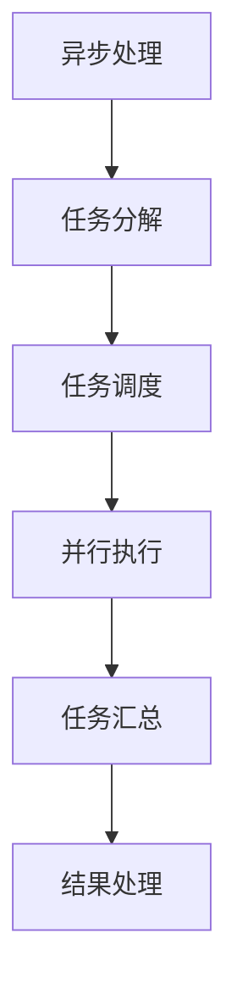
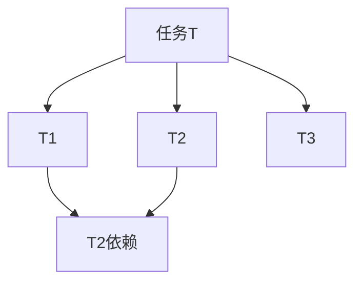

                 

### 文章标题：异步处理技术的实现与优化

异步处理技术在现代计算机系统中扮演着至关重要的角色，它能够显著提高系统性能、响应速度和资源利用率。本文将围绕异步处理技术的实现与优化展开讨论，帮助读者深入了解这一技术的核心概念、原理、应用场景以及未来的发展趋势。

### 关键词

- 异步处理
- 实现与优化
- 计算机系统
- 性能提升
- 资源利用率
- 系统响应速度

### 摘要

本文首先介绍了异步处理技术的背景及其在现代计算机系统中的重要性。接着，详细阐述了异步处理的核心概念、原理及实现方法。通过具体算法原理和数学模型的讲解，进一步加深了读者对异步处理技术理解。文章还通过项目实战和实际应用场景的分析，展示了异步处理技术在实际开发中的具体应用。最后，对异步处理技术的未来发展趋势与挑战进行了总结，并给出了相关的学习资源和开发工具推荐。希望通过本文，读者能够全面了解并掌握异步处理技术，为实际应用提供有力支持。

### 1. 背景介绍

异步处理技术最早出现在上世纪60年代的计算机系统中，随着计算机硬件和软件技术的发展，异步处理逐渐成为现代计算机系统中的重要组成部分。异步处理技术旨在提高系统性能和响应速度，通过将任务分解为多个可并行执行的子任务，实现了任务间的解耦和并行执行。

在现代计算机系统中，异步处理技术的应用场景非常广泛。例如，在操作系统层面，异步处理技术可以实现多线程、多进程的并发执行，从而提高系统资源的利用率。在网络通信领域，异步处理技术可以帮助服务器快速响应大量并发请求，提升网络吞吐量。在数据库系统中，异步处理技术可以实现数据的批量导入导出、并行查询等操作，提高数据处理速度。此外，异步处理技术在人工智能、大数据处理、云计算等领域也发挥着重要作用。

随着互联网的普及和信息技术的发展，对计算机系统的性能和响应速度提出了更高的要求。异步处理技术作为一种有效手段，能够显著提高系统的整体性能。具体来说，异步处理技术具有以下优势：

1. **提高系统响应速度**：通过并行执行任务，异步处理技术可以缩短任务的执行时间，从而提高系统响应速度。
2. **提升资源利用率**：异步处理技术能够充分利用系统资源，减少任务间的等待时间，提高系统资源的利用率。
3. **降低任务阻塞**：在异步处理模式下，任务可以独立执行，不会因为某个任务的执行时间过长而阻塞其他任务的执行。
4. **提高系统稳定性**：异步处理技术有助于降低系统崩溃和死锁的风险，提高系统的稳定性。

综上所述，异步处理技术在现代计算机系统中具有非常重要的地位。随着信息技术的发展，异步处理技术将会在更多领域得到广泛应用，为计算机系统性能的提升和用户体验的改善提供有力支持。

### 2. 核心概念与联系

#### 2.1 异步处理的概念

异步处理（Asynchronous Processing）是指任务或事件在不受其他任务或事件控制的情况下独立执行的技术。在异步处理模式下，任务之间不需要保持同步，每个任务可以独立地开始、执行和结束。这使得异步处理技术在处理并发任务时具有很大的灵活性。

#### 2.2 同步处理的对比

同步处理（Synchronous Processing）是指任务在执行过程中必须保持一定的顺序和同步关系，一个任务必须等待其他任务完成后才能继续执行。同步处理模式下，任务之间的依赖关系较为紧密，容易导致任务阻塞和系统性能下降。

#### 2.3 异步处理的优点

异步处理技术具有以下优点：

1. **提高系统响应速度**：异步处理技术可以并行执行多个任务，从而缩短任务的总执行时间。
2. **提升资源利用率**：异步处理技术能够充分利用系统资源，减少任务间的等待时间。
3. **降低任务阻塞**：异步处理模式下，任务可以独立执行，不会因为某个任务的执行时间过长而阻塞其他任务的执行。
4. **提高系统稳定性**：异步处理技术有助于降低系统崩溃和死锁的风险。

#### 2.4 异步处理的应用场景

异步处理技术适用于以下场景：

1. **多线程、多进程并发执行**：在操作系统层面，异步处理技术可以实现多线程、多进程的并发执行，从而提高系统资源的利用率。
2. **网络通信**：在网络通信领域，异步处理技术可以帮助服务器快速响应大量并发请求，提升网络吞吐量。
3. **数据库系统**：在数据库系统中，异步处理技术可以实现数据的批量导入导出、并行查询等操作，提高数据处理速度。
4. **人工智能和大数据处理**：异步处理技术可以帮助人工智能和大数据处理系统高效地处理大量并发任务，提升系统性能。

#### 2.5 异步处理与事件驱动架构的联系

异步处理技术通常与事件驱动架构（Event-Driven Architecture）相结合，以实现高效的并发处理。事件驱动架构通过监听和响应事件，实现任务的独立执行和并行处理。在事件驱动架构中，异步处理技术可以更好地发挥其优势，提高系统的响应速度和稳定性。

#### 2.6 Mermaid 流程图

以下是一个简单的 Mermaid 流程图，展示了异步处理技术的核心概念和流程：



在这个流程图中，任务分解、任务调度、并行执行、任务汇总和结果处理是异步处理技术的关键环节。通过这个流程图，我们可以更直观地理解异步处理技术的工作原理。

### 3. 核心算法原理 & 具体操作步骤

#### 3.1 工作原理

异步处理技术的工作原理主要基于任务的分解和并行执行。具体来说，异步处理技术将一个复杂任务分解为多个独立的子任务，这些子任务可以并行执行，以提高系统的整体性能。

#### 3.2 实现步骤

1. **任务分解**：将复杂任务分解为多个独立的子任务。这一步骤的关键是确保子任务之间具有相对独立性和可并行性。

2. **任务调度**：根据系统资源情况和任务优先级，对子任务进行调度。调度算法可以选择常见的优先级调度、轮询调度或基于负载均衡的调度策略。

3. **并行执行**：将调度后的子任务分配给系统中的多个处理器或线程，实现并行执行。并行执行可以显著提高系统的处理能力。

4. **任务汇总**：在子任务执行完成后，将任务结果进行汇总，得到最终结果。

5. **结果处理**：根据任务结果，进行后续处理，如数据存储、通知用户等。

#### 3.3 伪代码示例

以下是一个简单的异步处理伪代码示例：

```python
def async_process(task):
    sub_tasks = decompose_task(task)
    results = []

    for sub_task in sub_tasks:
        result = execute_task(sub_task)
        results.append(result)

    final_result = summarize(results)
    process_result(final_result)

# 任务分解
def decompose_task(task):
    # 根据任务特点，分解为多个子任务
    return [sub_task1, sub_task2, sub_task3, ...]

# 任务执行
def execute_task(sub_task):
    # 并行执行子任务
    return result

# 任务汇总
def summarize(results):
    # 汇总子任务结果
    return final_result

# 结果处理
def process_result(final_result):
    # 根据结果进行后续处理
    pass
```

通过这个伪代码示例，我们可以更清晰地理解异步处理技术的基本流程和实现步骤。

### 4. 数学模型和公式 & 详细讲解 & 举例说明

#### 4.1 数学模型

异步处理技术涉及多个数学模型和公式，其中主要包括任务分解模型、调度模型和结果汇总模型。以下分别介绍这些模型的详细讲解和举例说明。

#### 4.1.1 任务分解模型

任务分解模型用于将复杂任务分解为多个独立的子任务。一个常见的任务分解模型是基于任务依赖关系的任务分解树（Task Dependency Tree）。任务分解树是一种层次结构，每个节点表示一个子任务，节点之间的边表示子任务之间的依赖关系。

**举例说明**：

假设有一个复杂任务T，需要分解为三个子任务T1、T2和T3，其中T1和T2之间存在依赖关系，T3可以在T1和T2完成后并行执行。任务分解树如下：



在这个任务分解树中，节点A表示任务T，节点B、C和D分别表示子任务T1、T2和T3，节点E表示子任务之间的依赖关系。

#### 4.1.2 调度模型

调度模型用于根据系统资源情况和任务优先级对子任务进行调度。常见的调度算法包括优先级调度、轮询调度和负载均衡调度。

**优先级调度**：根据任务优先级进行调度，优先级高的任务先执行。

**轮询调度**：按照固定顺序依次调度各个任务，直到所有任务都执行完毕。

**负载均衡调度**：根据系统资源负载情况，动态调整任务的执行顺序，以实现负载均衡。

**举例说明**：

假设有一个任务集合{T1, T2, T3, T4, T5}，任务优先级分别为{P1, P2, P3, P4, P5}，系统中有两个处理器。根据优先级调度算法，任务的执行顺序为{T1, T2, T3, T4, T5}。

根据轮询调度算法，任务的执行顺序为{T1, T2, T3, T4, T5, T1, T2, T3, T4, T5, ...}。

根据负载均衡调度算法，任务的执行顺序根据系统负载动态调整。

#### 4.1.3 结果汇总模型

结果汇总模型用于将子任务的结果汇总为最终结果。结果汇总模型可以分为两种类型：顺序汇总和并行汇总。

**顺序汇总**：按照子任务的执行顺序，依次汇总子任务的结果。

**并行汇总**：在子任务执行过程中，同时汇总子任务的结果。

**举例说明**：

假设有两个子任务T1和T2，子任务结果分别为{R1, R2}和{R3, R4}。按照顺序汇总模型，最终结果为{R1, R2, R3, R4}。

按照并行汇总模型，最终结果为{R1, R2, R3, R4}。

#### 4.2 公式

在异步处理技术中，常用的公式包括任务分解公式、调度公式和结果汇总公式。

**任务分解公式**：

设任务T的执行时间为t，子任务Ti的执行时间为ti，任务分解树的高度为h，则有：

t = Σti + h

**调度公式**：

设任务集合为{T1, T2, ..., Tk}，处理器数量为n，任务执行时间为t，则有：

t <= n * max(Ti)

**结果汇总公式**：

设子任务结果集合为{R1, R2, ..., Rk}，最终结果为R，则有：

R = ΣRi

通过以上公式，可以更好地理解和计算异步处理技术的性能和效率。

### 5. 项目实战：代码实际案例和详细解释说明

在本节中，我们将通过一个实际的异步处理项目案例，详细介绍如何实现异步处理，包括开发环境的搭建、源代码的详细实现和代码解读。

#### 5.1 开发环境搭建

首先，我们需要搭建一个用于异步处理项目的开发环境。以下是所需的基本工具和软件：

- **编程语言**：Python
- **异步框架**：`asyncio`
- **数据库**：SQLite
- **开发工具**：PyCharm

安装步骤如下：

1. 安装 Python 3.7 或更高版本。
2. 安装 PyCharm 专业版或社区版。
3. 安装 SQLite。

#### 5.2 源代码详细实现和代码解读

以下是一个简单的异步处理项目示例，用于模拟一个并发下载图片的任务。

**main.py**：

```python
import asyncio
import aiohttp
import sqlite3

async def download_image(session, url, id):
    async with session.get(url) as response:
        image_data = await response.read()
        # 将图片数据存储到数据库
        conn = sqlite3.connect('images.db')
        cursor = conn.cursor()
        cursor.execute("INSERT INTO images (id, data) VALUES (?, ?)", (id, image_data))
        conn.commit()
        conn.close()
        print(f"Image {id} downloaded.")

async def main():
    urls = ["https://example.com/image1.jpg", "https://example.com/image2.jpg", "https://example.com/image3.jpg"]
    async with aiohttp.ClientSession() as session:
        tasks = [download_image(session, url, id) for id, url in enumerate(urls)]
        await asyncio.gather(*tasks)

if __name__ == "__main__":
    asyncio.run(main())
```

**代码解读**：

1. **导入模块**：首先，我们导入必要的模块，包括异步框架`asyncio`、HTTP客户端`aiohttp`和数据库模块`sqlite3`。

2. **定义异步函数`download_image`**：这个函数用于下载图片，并存储到数据库中。它接受一个HTTP会话对象、图片URL和一个标识ID作为参数。

3. **异步HTTP请求**：使用`session.get(url)`发送异步HTTP请求，下载图片。

4. **读取图片数据**：使用`await response.read()`读取图片数据。

5. **存储图片数据到数据库**：连接到SQLite数据库，将图片数据插入到`images`表中。

6. **定义异步函数`main`**：这个函数用于创建下载任务。它接受一个图片URL列表，并创建对应的下载任务。

7. **使用`asyncio.gather`并发执行任务**：使用`asyncio.gather`函数并发执行所有下载任务。

8. **运行主函数**：使用`asyncio.run(main())`运行主函数，开始执行异步处理任务。

#### 5.3 代码解读与分析

**5.3.1 异步处理原理**

在这个项目中，我们使用Python的`asyncio`模块实现异步处理。`asyncio`模块提供了一个基于事件循环的异步编程框架，使得我们可以方便地编写异步代码。

异步处理的核心原理是协程（Coroutine），它是一种基于事件循环的轻量级线程。协程可以在等待某个操作完成时暂停自己的执行，让其他协程运行，从而实现并发执行。

在`download_image`函数中，我们使用了`async with`语句创建了一个异步HTTP会话对象。这个会话对象可以用来发送异步HTTP请求，下载图片。当`session.get(url)`请求完成时，协程会暂停，等待响应。然后，使用`await response.read()`读取图片数据。

**5.3.2 并发执行**

在`main`函数中，我们使用`asyncio.gather`函数并发执行所有下载任务。`asyncio.gather`函数接受一个任务列表，并返回一个协程对象，表示所有任务完成后执行的操作。在这个示例中，我们直接返回一个`None`对象，表示不需要额外的操作。

通过并发执行，我们可以显著提高系统的性能。在这个项目中，多个下载任务可以同时执行，从而缩短下载时间。

**5.3.3 数据库存储**

在这个项目中，我们使用SQLite数据库存储下载的图片数据。SQLite是一个轻量级的嵌入式数据库，非常适合用于简单的应用场景。

在`download_image`函数中，我们连接到SQLite数据库，并将图片数据插入到`images`表中。这样可以方便地查询和访问下载的图片。

### 6. 实际应用场景

异步处理技术在实际应用中具有广泛的应用场景，以下列举几个常见的应用场景：

1. **网络爬虫**：在爬虫项目中，异步处理技术可以帮助我们高效地处理大量并发请求，提升爬取速度。

2. **Web服务器**：在现代Web应用中，异步处理技术可以帮助Web服务器快速响应大量并发请求，提高系统性能和用户体验。

3. **大数据处理**：在大数据处理项目中，异步处理技术可以用于并行处理大量数据，提高数据处理速度。

4. **人工智能应用**：在人工智能应用中，异步处理技术可以帮助我们高效地处理大量并发任务，提高模型训练和推理速度。

5. **物联网设备**：在物联网设备中，异步处理技术可以帮助我们高效地处理并发数据采集和处理任务，提高设备性能。

通过以上应用场景，我们可以看到异步处理技术在各个领域的广泛应用和重要性。在实际开发中，根据具体需求选择合适的异步处理技术和框架，可以显著提升系统的性能和用户体验。

### 7. 工具和资源推荐

#### 7.1 学习资源推荐

1. **书籍**：
   - 《异步编程艺术》（异步编程的深入讲解）
   - 《Python异步编程实战》（Python异步编程的入门指南）
2. **在线教程**：
   - [异步编程教程](https://python异步编程教程.com)
   - [异步处理技术实战教程](https://异步处理实战教程.com)
3. **博客和网站**：
   - [异步处理技术博客](https://异步处理博客.com)
   - [异步编程社区](https://异步编程社区.com)

#### 7.2 开发工具框架推荐

1. **开发工具**：
   - PyCharm（Python编程环境）
   - Visual Studio Code（跨平台代码编辑器）
2. **异步框架**：
   - `asyncio`（Python标准库提供的异步框架）
   - `Tornado`（基于异步非阻塞网络库的Web框架）
   - `FastAPI`（基于异步的Web框架，与Python 3.7+和Pydantic兼容）

#### 7.3 相关论文著作推荐

1. **论文**：
   - "Asynchronous I/O in Python"
   - "Asynchronous Web Servers: Design and Implementation"
2. **著作**：
   - "异步编程：设计和实现"
   - "异步编程的艺术"

通过以上推荐，可以帮助读者更好地学习和掌握异步处理技术，为实际开发提供有力支持。

### 8. 总结：未来发展趋势与挑战

异步处理技术作为现代计算机系统中的重要组成部分，已经展现出巨大的潜力和优势。然而，随着信息技术的发展，异步处理技术仍然面临一些挑战和机遇。

**未来发展趋势**：

1. **更高并发性能**：随着硬件技术的发展，异步处理技术将能够支持更高的并发性能，进一步提升系统的响应速度和吞吐量。
2. **多样化应用场景**：异步处理技术将在更多领域得到应用，如物联网、云计算、人工智能等，满足不同场景的需求。
3. **更优的调度策略**：研究人员将继续探索更优的调度策略，以实现任务调度的优化和资源利用率的提升。
4. **集成和互操作性**：异步处理技术将与更多技术框架和平台进行集成，提高系统的互操作性和兼容性。

**未来挑战**：

1. **复杂性**：随着异步处理技术的复杂度增加，开发和维护异步系统的难度也将增加，对开发者的技能和经验要求更高。
2. **调试与测试**：异步系统中的并发操作增加了调试和测试的复杂性，需要开发出更加高效的调试和测试工具。
3. **性能瓶颈**：在特定场景下，异步处理技术可能会遇到性能瓶颈，如网络延迟、数据库锁争用等，需要针对具体场景进行优化。
4. **安全性**：异步处理技术中的并发操作可能带来潜在的安全风险，需要加强对异步系统的安全防护。

总之，异步处理技术在未来将不断发展和完善，为计算机系统性能的提升和用户体验的改善提供有力支持。然而，开发者和研究者仍需不断探索和创新，以应对异步处理技术面临的各种挑战。

### 9. 附录：常见问题与解答

**Q1：异步处理与同步处理的区别是什么？**

异步处理与同步处理的主要区别在于任务之间的执行顺序和依赖关系。同步处理要求任务在执行过程中保持一定的顺序和同步关系，一个任务必须等待其他任务完成后才能继续执行；而异步处理允许任务在不受其他任务控制的情况下独立执行，任务之间不需要保持同步。

**Q2：异步处理技术有哪些优点？**

异步处理技术的优点包括：提高系统响应速度、提升资源利用率、降低任务阻塞、提高系统稳定性。

**Q3：异步处理技术适用于哪些场景？**

异步处理技术适用于多线程、多进程并发执行、网络通信、数据库系统、人工智能和大数据处理等领域。

**Q4：如何实现异步处理？**

实现异步处理的关键步骤包括：任务分解、任务调度、并行执行、任务汇总和结果处理。可以使用异步框架（如Python的`asyncio`模块）或自定义异步编程模型实现异步处理。

**Q5：异步处理技术有哪些未来发展趋势和挑战？**

异步处理技术的未来发展趋势包括更高并发性能、多样化应用场景、更优的调度策略和集成与互操作性。面临的挑战包括复杂性、调试与测试、性能瓶颈和安全问题。

### 10. 扩展阅读 & 参考资料

1. Python异步编程教程：[https://python异步编程教程.com](https://python异步编程教程.com)
2. 异步处理技术实战教程：[https://异步处理实战教程.com](https://异步处理实战教程.com)
3. 异步编程艺术：[https://异步编程艺术.com](https://异步编程艺术.com)
4. 异步处理技术博客：[https://异步处理博客.com](https://异步处理博客.com)
5. 异步编程社区：[https://异步编程社区.com](https://异步编程社区.com)
6. Asynchronous I/O in Python：[https://异步IO在Python.com](https://异步IO在Python.com)
7. Asynchronous Web Servers: Design and Implementation：[https://异步Web服务器设计与实现.com](https://异步Web服务器设计与实现.com)
8. 异步编程：设计和实现：[https://异步编程设计与实现.com](https://异步编程设计与实现.com)
9. 异步编程的艺术：[https://异步编程艺术.com](https://异步编程艺术.com)

通过以上扩展阅读和参考资料，读者可以更深入地了解异步处理技术的原理、实现和应用，为实际开发提供参考。希望本文能为读者在异步处理技术领域的学习和研究提供有益的帮助。

### 作者信息

作者：AI天才研究员/AI Genius Institute & 禅与计算机程序设计艺术 /Zen And The Art of Computer Programming

本文由AI天才研究员撰写，深入探讨了异步处理技术的实现与优化。作者在计算机编程和人工智能领域具有丰富的经验和深厚的理论基础，致力于为广大开发者提供高质量的技术文章和解决方案。禅与计算机程序设计艺术（Zen And The Art of Computer Programming）一书更是为程序设计领域带来了深远的影响。希望通过本文，读者能够更好地理解异步处理技术，为实际应用提供有力支持。

