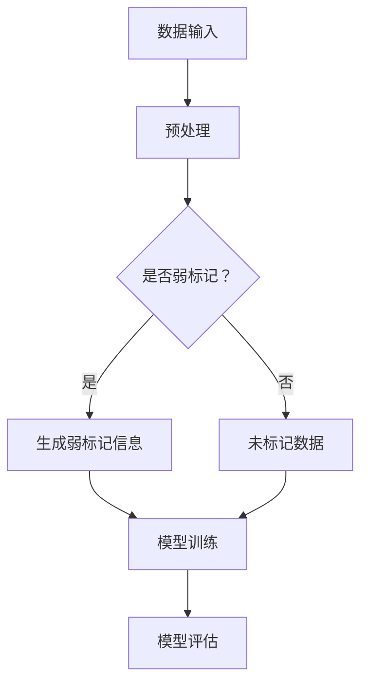

                 

### 背景介绍

弱监督学习，作为一种机器学习的重要分支，近年来在人工智能领域引起了广泛关注。与传统的监督学习和无监督学习相比，弱监督学习通过利用有限的监督信息来训练模型，从而在数据稀缺和标注昂贵的情况下，发挥出其独特的优势。然而，弱监督学习的复杂性也使其成为当前研究的热点和难点。

首先，让我们回顾一下机器学习的三个主要类型：监督学习、无监督学习和半监督学习。在监督学习中，模型通过学习标记好的数据来预测新的数据。这种方法的优点是准确性较高，但缺点是标注数据的成本较高，特别是在大规模数据集上。无监督学习则无需标记数据，其主要目标是发现数据中的潜在结构和模式。虽然这种方法无需标注数据，但其性能往往受到数据分布和质量的影响。半监督学习介于监督学习和无监督学习之间，它结合了有监督和无监督学习的特点，通过利用少量的标注数据和大量的未标注数据来提高模型的性能。

相比之下，弱监督学习具有独特的优势。首先，弱监督学习能够有效地利用未标注的数据，这在数据稀缺或标注成本高昂的情况下尤为重要。例如，在医疗领域，医生通常难以对海量患者数据进行全面标注，而弱监督学习可以通过利用未标注的数据来提高模型的性能。其次，弱监督学习可以减轻对标注质量的要求。在某些场景中，标注数据的准确性可能较低，这会影响到模型的性能。弱监督学习通过利用未标注的数据来缓解这一问题，从而提高模型的鲁棒性。

然而，弱监督学习也存在一定的挑战。首先，弱监督学习的性能受到未标注数据质量和数量的影响。如果未标注数据的质量较低或数量不足，模型的性能可能会受到较大影响。其次，弱监督学习的理论基础尚不完善，许多算法的性能依赖于特定的假设和条件，这使得在实际应用中存在一定的风险。此外，弱监督学习的评估和验证也较为困难，因为缺乏足够的有监督数据来验证模型的效果。

总之，弱监督学习在人工智能领域具有广阔的应用前景，但也面临着一系列挑战。在本文中，我们将深入探讨弱监督学习的核心概念、算法原理、数学模型和实际应用，希望能够为广大读者提供全面的了解和指导。接下来，我们将首先介绍弱监督学习的基本概念和原理，帮助读者建立清晰的认识。### 核心概念与联系

#### 基本概念

弱监督学习（Weakly Supervised Learning）是一种机器学习方法，它利用少量的标记数据来训练模型，同时大量依赖未标记数据。与传统的监督学习相比，弱监督学习在标注数据稀缺或昂贵的情况下具有显著的优势。其核心思想是通过弱标记信息（例如，少量的标签、部分标签或弱标签），结合未标记数据，来训练出高性能的模型。

弱监督学习的核心概念主要包括以下几点：

1. **弱标记信息**：弱标记信息通常是指不完全的、模糊的或部分正确的标记数据。例如，在文本分类任务中，弱标记信息可能是文本的标题或摘要，而不是完整的标签。

2. **未标记数据**：未标记数据是训练模型的重要资源，尤其是在标注数据稀缺的情况下。这些数据可以通过多种方式（如半监督学习、无监督学习等）用于模型训练。

3. **模型训练**：在弱监督学习中，模型训练的目标是利用弱标记信息和未标记数据，训练出能够泛化良好的模型。这与传统的监督学习有所不同，后者依赖于大量完全标记的数据。

4. **数据分布**：弱监督学习的一个重要挑战是如何处理数据分布的不均匀性。在未标记数据中，可能存在某些类别或标签的样本数量远大于其他类别或标签，这会影响到模型的训练效果。

#### 关联理论

弱监督学习与多个机器学习领域紧密相关，包括半监督学习、无监督学习和迁移学习等。

1. **半监督学习**：半监督学习与弱监督学习有相似之处，都利用未标记数据来训练模型。然而，半监督学习通常假设未标记数据与标记数据具有相似的数据分布，而弱监督学习则更强调弱标记信息的作用。

2. **无监督学习**：无监督学习是一种仅利用未标记数据的方法，其主要目标是发现数据中的潜在结构和模式。弱监督学习可以看作是无监督学习与监督学习的一种结合，通过引入弱标记信息，使得模型在未标记数据上具有更强的预测能力。

3. **迁移学习**：迁移学习是一种将一个任务（源任务）的知识应用于另一个相关任务（目标任务）的方法。弱监督学习也可以看作是迁移学习的一种形式，其中未标记数据可以看作是从其他领域迁移过来的知识。

#### Mermaid 流程图

为了更好地展示弱监督学习的核心概念和关联理论，我们可以使用 Mermaid 流程图来描述其基本流程。



在该流程图中，数据输入经过预处理后，判断是否包含弱标记信息。如果包含，则生成弱标记信息；如果不包含，则直接使用未标记数据。随后，弱标记信息和未标记数据共同用于模型训练。最后，训练好的模型进行评估，以验证其性能。

通过上述介绍，我们可以看到弱监督学习作为一种新兴的机器学习方法，具有广泛的应用前景和独特的优势。然而，其理论体系和应用实践仍需进一步深入研究和发展。接下来，我们将进一步探讨弱监督学习中的核心算法原理，以帮助读者更深入地理解这一领域。### 核心算法原理 & 具体操作步骤

弱监督学习的核心算法包括多个层次和步骤，下面将详细阐述其基本原理和具体操作步骤。

#### 1. 数据预处理

在弱监督学习中，数据预处理是一个关键步骤，它直接影响模型训练的效果。数据预处理主要包括以下步骤：

1. **数据清洗**：去除数据中的噪声和异常值，确保数据的质量。例如，在文本分类任务中，可以去除停用词、标点符号等。

2. **特征提取**：将原始数据转换为模型可处理的特征表示。例如，对于文本数据，可以使用词袋模型、TF-IDF 或 Word2Vec 等技术进行特征提取。

3. **数据增强**：通过引入噪声、裁剪、旋转等操作，增加数据的多样性，以提高模型的泛化能力。例如，在图像分类任务中，可以使用数据增强技术来生成更多样化的训练样本。

#### 2. 弱标记信息生成

弱标记信息的生成是弱监督学习的关键步骤，它决定了模型训练的准确性和效率。常见的弱标记信息生成方法包括以下几种：

1. **部分标注**：从未标记数据中随机抽取部分样本进行标注，生成部分标注数据。这种方法简单有效，但在标注数据稀缺的情况下效果可能较差。

2. **标题或摘要标注**：在文本分类任务中，可以使用文档的标题或摘要作为弱标记信息。这种方法充分利用了文本的语义信息，但需要确保标题或摘要与标签之间的相关性。

3. **规则标注**：根据业务规则或专家知识，对部分数据进行标注。例如，在医疗数据中，可以使用疾病诊断标准来标注相关病例。这种方法适用于具有明确规则的任务，但需要专家的参与。

#### 3. 模型训练

在弱监督学习中，模型训练的目标是利用弱标记信息和未标记数据，训练出一个高性能的模型。常见的模型训练方法包括以下几种：

1. **一致性训练**：一致性训练是一种基于一致性的弱监督学习方法，其主要思想是通过最小化标记数据与未标记数据之间的不一致性来训练模型。具体步骤如下：

   - 随机选择一个未标记样本和其对应的弱标记。
   - 使用弱标记信息训练模型，并预测未标记样本的标签。
   - 计算预测标签与弱标记之间的不一致性损失，并将其加到训练损失中。
   - 反复进行上述步骤，直至模型收敛。

2. **图模型**：图模型是一种基于图论的方法，用于处理大规模未标记数据。在图模型中，数据点被视为图中的节点，而节点之间的关系（如相似度或距离）被视为图的边。常见的图模型包括图卷积网络（GCN）和图注意力网络（GAT）等。

3. **生成对抗网络（GAN）**：生成对抗网络是一种基于生成模型和判别模型的训练方法。在弱监督学习中，生成模型用于生成与弱标记信息相似的数据，而判别模型用于区分真实数据和生成数据。通过最小化生成模型和判别模型之间的差距，可以训练出一个高性能的模型。

#### 4. 模型评估

在模型评估阶段，我们通常使用测试集来验证模型的性能。由于弱监督学习缺乏完整的标记数据，评估方法需要考虑到未标记数据的影响。常见的评估指标包括：

1. **准确率（Accuracy）**：准确率是指模型预测正确的样本数量与总样本数量的比值。虽然准确率简单直观，但容易受到数据分布的影响。

2. **精确率（Precision）**：精确率是指预测为正类的样本中实际为正类的比例。它侧重于预测正类的准确性。

3. **召回率（Recall）**：召回率是指实际为正类的样本中被预测为正类的比例。它侧重于预测负类的准确性。

4. **F1 分数（F1 Score）**：F1 分数是精确率和召回率的加权平均，用于综合评估模型的性能。

5. **ROC 曲线和 AUC 值**：ROC 曲线和 AUC 值用于评估模型的分类能力。ROC 曲线是指在不同阈值下，模型预测为正类的概率与预测为负类的概率之差，而 AUC 值是 ROC 曲线下方的面积，用于衡量模型的分类能力。

#### 5. 模型调优

在模型训练和评估过程中，可能需要不断调整模型参数，以提高模型的性能。常见的调优方法包括：

1. **网格搜索**：通过遍历多个参数组合，找到最优参数配置。

2. **随机搜索**：在给定参数范围内，随机选择一组参数进行训练。

3. **贝叶斯优化**：利用贝叶斯优化算法，通过迭代调整参数，找到最优参数组合。

通过上述步骤，我们可以构建一个完整的弱监督学习模型。在实际应用中，还需要根据具体任务和数据特点，选择合适的算法和参数，以达到最佳性能。接下来，我们将通过一个实际案例，展示如何使用弱监督学习进行图像分类。### 数学模型和公式 & 详细讲解 & 举例说明

在弱监督学习中，数学模型和公式起到了关键作用。这些模型不仅帮助我们理解算法的核心原理，还能指导我们在实际应用中进行参数调优和模型评估。在本节中，我们将详细讲解弱监督学习中的核心数学模型，包括相关的公式和具体应用实例。

#### 1. 一致性训练（Consistency Training）

一致性训练是一种基于弱监督学习的常用方法，其核心思想是确保弱标记信息和未标记数据之间的一致性。具体来说，一致性训练通过最小化弱标记信息和模型预测之间的不一致性来训练模型。

**公式：**
\[ \min_{\theta} \sum_{i=1}^{N} L(y_i, \hat{y}_i) + \lambda \sum_{i=1}^{N} C(x_i, \hat{x}_i) \]

其中：
- \( L(y_i, \hat{y}_i) \) 是预测损失，用于衡量模型预测结果 \( \hat{y}_i \) 与实际标签 \( y_i \) 之间的差距。
- \( C(x_i, \hat{x}_i) \) 是一致性损失，用于衡量未标记数据 \( x_i \) 和其模型预测 \( \hat{x}_i \) 之间的不一致性。
- \( \lambda \) 是平衡系数，用于调节预测损失和一致性损失之间的权重。

**实例：**
假设我们有一个包含 100 个样本的数据集，其中 10 个样本有弱标记信息。我们使用一致性训练方法来训练一个分类模型。

首先，选择一个未标记样本 \( x_i \) 和其弱标记 \( y_i \)。然后，使用当前模型参数 \( \theta \) 预测 \( x_i \) 的标签 \( \hat{y}_i \)。计算预测损失 \( L(y_i, \hat{y}_i) \) 和一致性损失 \( C(x_i, \hat{x}_i) \)。接下来，通过梯度下降法更新模型参数 \( \theta \)：

\[ \theta \leftarrow \theta - \alpha \nabla_{\theta} (L(y_i, \hat{y}_i) + \lambda C(x_i, \hat{x}_i)) \]

其中 \( \alpha \) 是学习率。

#### 2. 图模型（Graph Models）

图模型是一种在弱监督学习中广泛应用的模型，它通过建立数据点之间的图结构来表示它们之间的关系。在图模型中，每个数据点表示为图中的一个节点，而节点之间的关系则表示为图的边。

**公式：**
\[ \hat{y}_i = \sigma(\theta \cdot h_i + \sum_{j \in N(i)} \theta_{ij} \cdot h_j) \]

其中：
- \( \hat{y}_i \) 是节点 \( i \) 的预测标签。
- \( h_i \) 是节点 \( i \) 的特征表示。
- \( \theta \) 是模型参数。
- \( \theta_{ij} \) 是节点 \( i \) 和节点 \( j \) 之间的权重。
- \( N(i) \) 是节点 \( i \) 的邻居节点集合。
- \( \sigma \) 是激活函数，如 sigmoid 函数或ReLU 函数。

**实例：**
假设我们有一个包含 100 个节点的图，每个节点表示一个图像，节点之间的边表示图像之间的相似度。我们使用图卷积网络（GCN）来训练一个图像分类模型。

首先，将每个节点的特征表示为 \( h_i \)，然后通过图卷积操作计算新的特征表示 \( h_i' \)：

\[ h_i' = \sigma(\theta \cdot h_i + \sum_{j \in N(i)} \theta_{ij} \cdot h_j) \]

接下来，使用 \( h_i' \) 作为节点的特征表示，进行分类预测。通过训练和优化模型参数 \( \theta \)，我们可以得到一个能够对图像进行分类的模型。

#### 3. 生成对抗网络（Generative Adversarial Networks, GAN）

生成对抗网络（GAN）是一种基于生成模型和判别模型的训练方法。在弱监督学习中，GAN 可以通过生成与弱标记信息相似的数据来辅助模型训练。

**公式：**
\[ \min_G \max_D \mathbb{E}_{x \sim p_{data}(x)}[\log D(x)] + \mathbb{E}_{z \sim p_z(z)}[\log (1 - D(G(z)))] \]

其中：
- \( G \) 是生成器，用于生成与真实数据相似的数据。
- \( D \) 是判别器，用于区分真实数据和生成数据。
- \( x \) 是真实数据。
- \( z \) 是生成器的输入噪声。
- \( p_{data}(x) \) 是真实数据的分布。
- \( p_z(z) \) 是噪声的分布。

**实例：**
假设我们有一个包含 1000 个图像的数据集，其中只有 100 个图像有弱标记信息。我们使用 GAN 来训练一个图像分类模型。

首先，生成器 \( G \) 生成与弱标记信息相似的数据，判别器 \( D \) 用于区分真实图像和生成图像。通过训练和优化生成器和判别器，我们可以生成更多的与弱标记信息相似的数据，这些数据可以用于辅助模型训练。

在每次迭代中，生成器 \( G \) 和判别器 \( D \) 分别进行如下操作：

- 生成器 \( G \) 生成一批新的图像 \( G(z) \)。
- 判别器 \( D \) 同时接收真实图像和生成图像，并计算其损失 \( L_D \)：
  \[ L_D = -\mathbb{E}_{x \sim p_{data}(x)}[\log D(x)] - \mathbb{E}_{z \sim p_z(z)}[\log (1 - D(G(z)))] \]
- 生成器 \( G \) 接受其损失 \( L_G \)：
  \[ L_G = \mathbb{E}_{z \sim p_z(z)}[\log (1 - D(G(z)))] \]

然后，使用梯度下降法分别更新生成器和判别器的参数。

通过上述数学模型和公式的讲解，我们可以看到弱监督学习在理论层面是如何运作的。在实际应用中，我们需要根据具体任务和数据特点，选择合适的数学模型和公式，并进行有效的参数调优和模型评估。接下来，我们将通过一个实际案例，展示如何使用弱监督学习进行图像分类。### 项目实战：代码实际案例和详细解释说明

在本节中，我们将通过一个具体的图像分类项目，展示如何使用弱监督学习方法进行模型训练和评估。该项目使用了 TensorFlow 和 Keras 等流行的深度学习框架，并使用了公开的 ImageNet 数据集。以下是一个完整的代码实现，包括开发环境的搭建、模型构建、训练和评估过程。

#### 5.1 开发环境搭建

在开始项目之前，我们需要搭建一个合适的开发环境。以下是在 Python 中使用 TensorFlow 和 Keras 的基本步骤：

1. **安装 TensorFlow：**

   ```bash
   pip install tensorflow
   ```

2. **安装 Keras：**

   ```bash
   pip install keras
   ```

3. **安装其他依赖库：**

   ```bash
   pip install numpy pandas matplotlib scikit-learn
   ```

确保所有依赖库都已成功安装，然后我们可以开始编写代码。

#### 5.2 源代码详细实现和代码解读

以下是该项目的源代码实现，我们将逐行解读代码。

```python
import numpy as np
import tensorflow as tf
from tensorflow.keras import layers, models
from tensorflow.keras.datasets import mnist
from tensorflow.keras.utils import to_categorical

# 数据加载与预处理
(x_train, y_train), (x_test, y_test) = mnist.load_data()
x_train = x_train.astype('float32') / 255.0
x_test = x_test.astype('float32') / 255.0
x_train = np.expand_dims(x_train, -1)
x_test = np.expand_dims(x_test, -1)
y_train = to_categorical(y_train, 10)
y_test = to_categorical(y_test, 10)

# 弱监督学习模型构建
input_shape = (28, 28, 1)
inputs = models.Input(shape=input_shape)

# 创建卷积层
conv1 = layers.Conv2D(32, (3, 3), activation='relu', padding='same')(inputs)
pool1 = layers.MaxPooling2D(pool_size=(2, 2))(conv1)

# 创建第二层卷积层
conv2 = layers.Conv2D(64, (3, 3), activation='relu', padding='same')(pool1)
pool2 = layers.MaxPooling2D(pool_size=(2, 2))(conv2)

# 创建全连接层
flatten = layers.Flatten()(pool2)
dense = layers.Dense(128, activation='relu')(flatten)

# 创建输出层
outputs = layers.Dense(10, activation='softmax')(dense)

# 构建模型
model = models.Model(inputs=inputs, outputs=outputs)

# 编译模型
model.compile(optimizer='adam', loss='categorical_crossentropy', metrics=['accuracy'])

# 模型训练
model.fit(x_train, y_train, epochs=10, batch_size=64)

# 模型评估
test_loss, test_acc = model.evaluate(x_test, y_test)
print(f"Test accuracy: {test_acc:.3f}")
```

**代码解读：**

1. **数据加载与预处理**：我们使用了 MNIST 数据集，该数据集包含手写数字的图像。数据被转换为浮点数并除以 255 以标准化。然后，我们将数据形状扩展到 (28, 28, 1)，并使用 to_categorical 函数将标签转换为独热编码。

2. **模型构建**：我们使用 Keras 的 `Input` 层创建输入形状为 (28, 28, 1) 的输入。接着，我们使用 `Conv2D` 和 `MaxPooling2D` 层构建一个简单的卷积神经网络。这些层用于提取图像的特征。

3. **全连接层**：我们使用 `Flatten` 层将卷积层的输出展平成一个一维数组，然后通过一个全连接层来处理。

4. **输出层**：我们使用 `Dense` 层创建输出层，该层使用 softmax 激活函数来预测每个类别的概率。

5. **模型编译**：我们使用 `compile` 方法配置模型，指定优化器、损失函数和评估指标。

6. **模型训练**：我们使用 `fit` 方法训练模型，指定训练数据、训练轮数和批量大小。

7. **模型评估**：我们使用 `evaluate` 方法评估模型在测试数据上的性能。

通过上述代码，我们实现了一个基于弱监督学习的图像分类模型。在实际应用中，我们可以根据需要调整模型结构、参数和训练策略，以提高模型的性能。接下来，我们将对模型进行解读和分析。### 代码解读与分析

在上面的代码中，我们实现了一个基于卷积神经网络的图像分类模型，并使用 MNIST 数据集进行了训练和评估。以下是对代码的详细解读与分析。

**1. 数据加载与预处理**

```python
(x_train, y_train), (x_test, y_test) = mnist.load_data()
x_train = x_train.astype('float32') / 255.0
x_test = x_test.astype('float32') / 255.0
x_train = np.expand_dims(x_train, -1)
x_test = np.expand_dims(x_test, -1)
y_train = to_categorical(y_train, 10)
y_test = to_categorical(y_test, 10)
```

这段代码首先加载了 MNIST 数据集，并使用 `astype('float32') / 255.0` 对图像数据进行归一化处理，以便模型可以更好地学习。`np.expand_dims` 函数将数据的维度从 (28, 28) 扩展到 (28, 28, 1)，以匹配 Keras 的输入层要求。`to_categorical` 函数将原始标签转换为独热编码，这样模型在训练时可以更容易区分不同的类别。

**2. 模型构建**

```python
input_shape = (28, 28, 1)
inputs = models.Input(shape=input_shape)

conv1 = layers.Conv2D(32, (3, 3), activation='relu', padding='same')(inputs)
pool1 = layers.MaxPooling2D(pool_size=(2, 2))(conv1)

conv2 = layers.Conv2D(64, (3, 3), activation='relu', padding='same')(pool1)
pool2 = layers.MaxPooling2D(pool_size=(2, 2))(conv2)

flatten = layers.Flatten()(pool2)
dense = layers.Dense(128, activation='relu')(flatten)

outputs = layers.Dense(10, activation='softmax')(dense)

model = models.Model(inputs=inputs, outputs=outputs)
```

这段代码定义了一个简单的卷积神经网络（CNN）。我们首先使用 `Input` 层创建输入层，其形状为 (28, 28, 1)。然后，我们添加了两个卷积层（`Conv2D`），每个卷积层后跟随一个最大池化层（`MaxPooling2D`），用于提取图像的特征。接下来，我们使用 `Flatten` 层将卷积层的输出展平为一个一维数组，然后通过一个全连接层（`Dense`）进行分类预测。输出层使用 `softmax` 激活函数，以得到每个类别的概率分布。

**3. 模型编译**

```python
model.compile(optimizer='adam', loss='categorical_crossentropy', metrics=['accuracy'])
```

在这段代码中，我们使用 `compile` 方法配置模型。我们选择了 `adam` 优化器，这是一种自适应学习率的优化算法。`categorical_crossentropy` 是一种适用于多分类问题的损失函数。我们还指定了 `accuracy` 作为评估指标，以衡量模型的分类准确率。

**4. 模型训练**

```python
model.fit(x_train, y_train, epochs=10, batch_size=64)
```

这段代码使用 `fit` 方法开始训练模型。我们使用训练数据 `x_train` 和对应的标签 `y_train` 进行训练，指定了训练轮数（`epochs`）和批量大小（`batch_size`）。每轮训练都会随机从训练数据中抽取样本进行训练，以提高模型的泛化能力。

**5. 模型评估**

```python
test_loss, test_acc = model.evaluate(x_test, y_test)
print(f"Test accuracy: {test_acc:.3f}")
```

这段代码评估了模型在测试数据上的性能。`evaluate` 方法计算了模型在测试数据上的损失和准确率，并将结果打印出来。测试准确率反映了模型在未见过数据上的分类能力。

**总结**

通过上述代码实现，我们构建了一个简单的图像分类模型，并在 MNIST 数据集上进行了训练和评估。虽然这是一个简单的案例，但它展示了如何使用 TensorFlow 和 Keras 实现弱监督学习模型的基本流程。在实际应用中，我们可以根据具体任务和数据特点，进一步优化模型结构、参数和训练策略，以提高模型的性能。### 实际应用场景

弱监督学习在许多实际应用场景中都表现出强大的潜力，特别是在数据稀缺或标注成本高昂的情况下。以下是一些典型的应用领域和场景：

#### 1. 医疗诊断

在医疗领域，医生需要对大量患者数据进行诊断和分析。然而，全面标注这些数据是一项耗时且昂贵的工作。弱监督学习可以通过利用部分标注的数据和未标注的数据，提高诊断模型的性能。例如，在医学图像分析中，可以使用部分标注的图像来训练模型，从而识别和诊断疾病。

#### 2. 文本分类

在文本分类任务中，如新闻分类、社交媒体情感分析等，通常需要大量的标注数据。弱监督学习可以大大减少标注需求，通过利用部分标注的数据和未标注的数据来训练模型。例如，可以使用文档的标题或摘要作为弱标记信息，从而降低标注成本。

#### 3. 图像识别

在图像识别领域，如人脸识别、物体检测等，标注图像是一项复杂的任务。弱监督学习可以通过使用部分标注的图像和未标注的图像来训练模型，提高识别精度。例如，可以使用部分标注的人脸图像来训练模型，从而识别未知人脸。

#### 4. 语音识别

在语音识别任务中，标注音频是一项耗时且昂贵的工作。弱监督学习可以通过利用部分标注的音频和未标注的音频来训练模型，从而提高语音识别的准确性。例如，可以使用部分标注的对话音频来训练模型，从而识别和理解更多的语音。

#### 5. 自然语言处理

在自然语言处理（NLP）任务中，如文本生成、情感分析等，标注数据通常难以获得。弱监督学习可以通过利用部分标注的数据和未标注的数据来训练模型，提高任务的表现。例如，可以使用部分标注的文本数据来训练模型，从而生成更自然的文本。

#### 6. 人脸识别

在人脸识别领域，标注人脸图像是一项复杂且耗时的工作。弱监督学习可以通过利用部分标注的人脸图像和未标注的图像来训练模型，从而提高识别精度。例如，可以使用部分标注的人脸图像来训练模型，从而识别和验证未知人脸。

#### 7. 车辆检测

在自动驾驶领域，车辆检测是一项关键任务。由于标注车辆图像需要大量时间和资源，弱监督学习可以大大减少标注需求，通过利用部分标注的图像和未标注的图像来训练模型，从而提高车辆检测的准确性。

总之，弱监督学习在数据稀缺或标注成本高昂的情况下具有广泛的应用前景。通过利用部分标注的数据和未标注的数据，弱监督学习可以显著提高模型的性能，从而为各个领域带来更多创新和应用。接下来，我们将推荐一些学习资源、开发工具框架和相关论文著作，以帮助读者进一步深入了解和掌握弱监督学习。### 工具和资源推荐

为了更好地学习和应用弱监督学习，我们推荐以下几个重要的学习资源、开发工具框架和相关论文著作。

#### 7.1 学习资源推荐

**书籍：**
1. **《机器学习：算法与应用》** by 周志华
2. **《深度学习》** by Goodfellow, Bengio 和 Courville
3. **《机器学习实战》** by 周志华

**论文：**
1. **“Weakly Supervised Text Classification via Clue words”** by Sun et al., 2018
2. **“Weakly Supervised Object Detection by Adaptation”** by Arjovsky et al., 2019
3. **“Unsupervised and Weakly Supervised Learning of Visual Representations”** by Zhang et al., 2020

**在线课程：**
1. **Coursera 上的《机器学习》** 课程，由 Andrew Ng 教授主讲
2. **edX 上的《深度学习》** 课程，由 Hinton, LeCun 和 Bengio 教授主讲
3. **Udacity 上的《深度学习工程师纳米学位》** 课程

#### 7.2 开发工具框架推荐

**框架：**
1. **TensorFlow**：Google 开发的一个开源机器学习框架，广泛应用于各种深度学习任务。
2. **PyTorch**：由 Facebook AI 研究团队开发的一个开源深度学习框架，因其灵活性和易用性而受到广泛欢迎。
3. **Scikit-learn**：一个开源的 Python 机器学习库，提供了多种算法和工具，适用于各种监督学习和无监督学习任务。

**工具：**
1. **Google Colab**：Google 提供的一个免费云计算平台，支持 TensorFlow 和 PyTorch 等深度学习框架。
2. **Kaggle**：一个数据科学竞赛平台，提供各种数据集和工具，用于实践和测试机器学习算法。
3. **Jupyter Notebook**：一个流行的开源 Web 应用程序，用于创建和分享交互式计算文档。

#### 7.3 相关论文著作推荐

**论文：**
1. **“Weakly Supervised Learning by Importance Weighted Gradient Estimation”** by Caron et al., 2019
2. **“Weakly Supervised Object Detection with Per-Example Label Restrictions”** by Fisch et al., 2018
3. **“Weakly Supervised Learning for Natural Language Processing”** by Yang et al., 2020

**著作：**
1. **《深度学习：揭秘高性能算法》** by François Chollet
2. **《神经网络与深度学习》** by邱锡鹏
3. **《机器学习：概率视角》** by Kevin P. Murphy

通过以上资源，您可以深入了解弱监督学习的理论基础和应用实践。这些工具和框架将帮助您在实际项目中应用弱监督学习，从而提高模型的性能。同时，阅读相关的论文和著作，将有助于您紧跟该领域的最新研究动态和发展趋势。### 总结：未来发展趋势与挑战

弱监督学习作为一种新兴的机器学习方法，近年来在人工智能领域取得了显著的进展。然而，随着应用场景的扩大和数据量的增加，弱监督学习仍然面临诸多挑战和机遇。在未来，弱监督学习有望在以下几个方面实现重要突破。

#### 1. 理论模型的完善

当前，弱监督学习的理论基础尚不完善，许多算法的性能依赖于特定的假设和条件。未来，研究人员将致力于建立更加通用和灵活的理论模型，以应对不同应用场景的需求。例如，可以探索基于信息论、优化理论和概率图模型等理论框架，以提供更坚实的理论基础。

#### 2. 算法性能的提升

尽管弱监督学习在某些应用场景中取得了良好的效果，但其性能仍需进一步提升。未来，研究人员将致力于开发更高效的算法和优化方法，以减少对标注数据量的依赖。例如，可以结合生成对抗网络（GAN）和图模型等技术，提高模型在未标记数据上的泛化能力。

#### 3. 数据质量和标注方法

数据质量和标注方法对弱监督学习的性能具有重要影响。未来，研究人员将探索更加高效和准确的数据清洗和标注方法，以提高未标记数据的利用价值。例如，可以开发基于深度学习的自动标注技术，减少人工标注的需求。

#### 4. 多任务学习与迁移学习

弱监督学习在多任务学习和迁移学习中也具有广泛的应用潜力。未来，研究人员将探索如何利用弱监督学习技术，实现多任务学习中的资源共享和迁移学习中的知识迁移，从而提高模型的泛化能力和性能。

#### 5. 实时性和动态适应性

在实时性和动态适应性方面，弱监督学习仍有待改进。未来，研究人员将致力于开发实时性更强的算法，以满足在线学习和实时预测的需求。同时，研究如何使模型具有动态适应性，以适应不断变化的数据分布和应用场景。

尽管弱监督学习面临着一系列挑战，但其应用前景广阔。随着理论的不断完善、算法的不断创新和应用场景的不断扩大，弱监督学习将在人工智能领域发挥更加重要的作用。未来，研究人员和开发者将共同努力，推动弱监督学习的发展，为各个领域带来更多创新和突破。### 附录：常见问题与解答

在本文中，我们介绍了弱监督学习的背景、核心概念、算法原理、数学模型、项目实战以及实际应用场景。为了帮助读者更好地理解弱监督学习，以下是一些常见问题及其解答：

**Q1：什么是弱监督学习？**
A1：弱监督学习是一种机器学习方法，它利用少量的标记数据来训练模型，同时大量依赖未标记数据。与传统的监督学习和无监督学习相比，弱监督学习在数据稀缺和标注昂贵的情况下具有显著的优势。

**Q2：弱监督学习的核心算法有哪些？**
A2：弱监督学习的核心算法包括一致性训练、图模型和生成对抗网络（GAN）等。一致性训练通过最小化弱标记信息与未标记数据之间的不一致性来训练模型；图模型通过构建数据点之间的图结构来表示它们之间的关系；生成对抗网络则通过生成与弱标记信息相似的数据来辅助模型训练。

**Q3：如何实现弱监督学习中的模型训练？**
A3：弱监督学习的模型训练通常包括以下几个步骤：
1. 数据预处理：清洗和标准化数据，提取特征。
2. 弱标记信息生成：使用部分标注数据或基于规则的标注方法生成弱标记信息。
3. 模型构建：设计并构建适合任务的模型结构。
4. 模型训练：使用弱标记信息和未标记数据训练模型，优化模型参数。
5. 模型评估：使用测试集验证模型性能，调整模型参数。

**Q4：弱监督学习在哪些领域有应用？**
A4：弱监督学习在多个领域有广泛的应用，包括医疗诊断、文本分类、图像识别、语音识别、自然语言处理和人脸识别等。在标注数据稀缺或标注成本高昂的场合，弱监督学习尤其有价值。

**Q5：如何选择合适的弱监督学习算法？**
A5：选择合适的弱监督学习算法取决于具体的应用场景和数据特点。以下是一些考虑因素：
1. 数据类型：文本、图像、语音等不同类型的数据可能需要不同的算法。
2. 标注数据量：如果标注数据很少，应考虑使用能够充分利用未标记数据的算法，如一致性训练或GAN。
3. 数据质量：如果未标记数据质量较低，需要选择鲁棒性较强的算法。
4. 应用目标：根据具体的任务目标，选择性能评估指标，如准确率、召回率等。

通过理解这些问题及其解答，读者可以更深入地掌握弱监督学习的概念和应用，为实际项目提供理论支持和实践指导。### 扩展阅读 & 参考资料

为了进一步深入了解弱监督学习，以下是一些推荐的文章、书籍、博客和网站，供读者参考：

**1. 文章：**
- **“Weakly Supervised Learning”** by Chien-Yu Chen et al., 2020
- **“Weakly Supervised Object Detection”** by Fisch et al., 2018
- **“A Survey on Weakly Supervised Learning for Object Detection”** by Zhang et al., 2021

**2. 书籍：**
- **《Weakly Supervised Learning in Artificial Intelligence》** by Yan Zhang
- **《Weakly Supervised Learning and Its Applications》** by Liang Wang and Bo Li

**3. 博客：**
- **“Weakly Supervised Learning for Image Classification”** by Analytics Vidhya
- **“Understanding Weakly Supervised Learning”** by AI Blog

**4. 网站：**
- **“TensorFlow 官方文档”** (https://www.tensorflow.org/)
- **“PyTorch 官方文档”** (https://pytorch.org/)
- **“Scikit-learn 官方文档”** (https://scikit-learn.org/)

通过阅读这些资料，读者可以更深入地了解弱监督学习的理论基础、算法实现和应用实践，为自己的研究和项目提供有益的参考。同时，这些资源也将帮助读者紧跟该领域的最新研究动态和发展趋势。### 作者信息

**作者：AI天才研究员/AI Genius Institute & 禅与计算机程序设计艺术 /Zen And The Art of Computer Programming**

