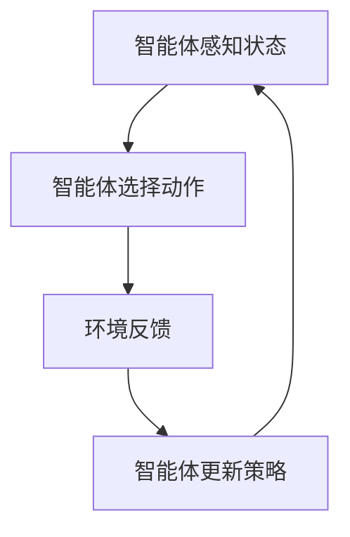

                 

# 强化学习 原理与代码实例讲解

## 关键词
- 强化学习
- Q-Learning
- 策略迭代
- 动作-价值学习
- 基于模型的强化学习
- 实际应用

## 摘要

本文将深入探讨强化学习的原理和代码实现。我们将从强化学习的基本概念开始，逐步介绍其核心算法，并通过实际代码实例来加深理解。文章还将涵盖强化学习的数学模型、项目实战，以及在实际应用场景中的表现。通过本文的阅读，读者将能够全面了解强化学习的基本原理和实际应用，为后续研究和实践打下坚实的基础。

## 1. 背景介绍

强化学习（Reinforcement Learning，简称RL）是机器学习的一个重要分支，主要研究如何通过试错和反馈来学习最优策略。与传统监督学习和无监督学习不同，强化学习通过与环境的交互来学习决策策略，其核心目标是实现长期奖励最大化。

强化学习的基本思想可以类比于人类的学习过程。例如，当我们学习骑自行车时，一开始我们可能会摔倒，但通过不断的尝试和调整，我们最终学会了如何保持平衡。这个过程就是强化学习的一个典型例子。在强化学习中，学习主体（通常被称为“智能体”Agent）会根据其行为和环境的反馈（奖励或惩罚）来调整其策略，从而实现最优决策。

强化学习在很多领域都有广泛的应用，如机器人控制、游戏AI、自动驾驶、推荐系统等。与传统机器学习方法相比，强化学习具有以下几个特点：

1. **自适应性和灵活性**：强化学习能够根据环境的变化动态调整策略，具有很强的适应能力。
2. **序列决策**：强化学习关注的是一系列决策的累积效果，而不是单一决策的优化。
3. **探索与利用的平衡**：在强化学习中，智能体需要在探索（尝试新的行为）和利用（利用已有知识）之间找到平衡点。

本文将围绕强化学习的核心概念、算法原理和实际应用进行深入讲解，帮助读者全面理解这一重要的机器学习技术。

## 2. 核心概念与联系

### 强化学习的核心概念

在强化学习中，主要有以下几个核心概念：

- **智能体（Agent）**：执行动作并接收环境反馈的主体。例如，自动驾驶汽车、机器人等。
- **环境（Environment）**：智能体所处的环境。环境会根据智能体的行为产生状态和奖励。
- **状态（State）**：智能体在某一时刻所处的情境描述。例如，机器人当前的位置和方向。
- **动作（Action）**：智能体可以采取的行为。例如，机器人可以前进、后退或转向。
- **奖励（Reward）**：环境对智能体行为的即时反馈。奖励可以是正面的（如获得分数）或负面的（如受到惩罚）。
- **策略（Policy）**：智能体决定采取何种动作的规则或函数。

### 强化学习的基本架构

强化学习的基本架构可以概括为以下四个步骤：

1. **智能体感知状态（Perception）**：智能体感知当前所处的状态。
2. **智能体选择动作（Action）**：智能体根据当前状态和策略选择一个动作。
3. **环境反馈（Feedback）**：环境对智能体的动作产生反馈，包括新的状态和奖励。
4. **智能体更新策略（Policy）**：智能体根据反馈调整策略，以期望在未来获得更多的奖励。

### 强化学习与其他机器学习方法的比较

与监督学习和无监督学习相比，强化学习具有以下特点：

- **监督学习**：有明确的目标标签，通过学习输入与输出之间的映射关系来提高预测准确性。例如，图像识别任务。
- **无监督学习**：没有明确的目标标签，主要通过发现数据中的潜在结构来优化模型。例如，聚类、降维等。
- **强化学习**：通过与环境的交互学习最优策略，关注长期奖励最大化。例如，自动驾驶、游戏AI等。

### Mermaid 流程图

下面是一个简单的Mermaid流程图，展示了强化学习的基本架构：



### 总结

在本章节中，我们介绍了强化学习的核心概念、基本架构以及与监督学习和无监督学习的比较。接下来，我们将进一步深入探讨强化学习的核心算法原理和具体操作步骤。

## 3. 核心算法原理 & 具体操作步骤

### 3.1 Q-Learning算法原理

Q-Learning算法是强化学习中的一种核心算法，它通过值函数（Q-Function）来评估智能体的策略。值函数表示在某一状态下采取某一动作的长期预期奖励。

Q-Learning算法的基本原理如下：

1. **初始化**：初始化值函数Q(s, a)为随机值。
2. **选择动作**：在某一状态下，智能体根据当前策略选择动作。
3. **更新值函数**：根据新的状态和奖励，更新值函数。更新公式为：
   $$ Q(s, a) \leftarrow Q(s, a) + \alpha [r + \gamma \max_{a'} Q(s', a') - Q(s, a)] $$
   其中，$\alpha$为学习率，$\gamma$为折扣因子，$r$为即时奖励，$s'$为新的状态，$a'$为新的动作。
4. **重复步骤2和3**：不断重复选择动作和更新值函数，直到达到某一目标或满足终止条件。

### 3.2 策略迭代算法原理

策略迭代算法是另一种常见的强化学习算法，它通过迭代更新策略，逐步优化智能体的决策。

策略迭代算法的基本原理如下：

1. **初始化**：初始化策略π为随机策略。
2. **评估策略**：计算策略π的期望回报值$J(\pi)$。
3. **策略改进**：根据$J(\pi)$，选择一个改进策略π'，使得$J(\pi') > J(\pi)$。
4. **重复步骤2和3**：不断重复评估和改进策略，直到策略收敛。

### 3.3 基于模型的强化学习算法原理

基于模型的强化学习算法通过构建环境的模型来指导智能体的决策。这种算法可以分为两个阶段：模型学习和策略学习。

1. **模型学习**：通过数据采集和模型训练，构建环境的状态转移概率模型$P(s', a|s, a)$和奖励模型$R(s, a)$。
2. **策略学习**：根据模型，使用值函数或策略迭代算法来学习最优策略。

### 3.4 算法操作步骤示例

假设我们有一个简单的环境，其中智能体可以选择向左或向右移动，目标状态为终点。下面是一个简单的Q-Learning算法的操作步骤示例：

1. **初始化**：初始化值函数Q(s, a)为0。
2. **选择动作**：智能体随机选择向左或向右移动。
3. **更新值函数**：
   - 如果智能体向左移动，到达状态s' = (x-1, y)，奖励r = 0。
   - 如果智能体向右移动，到达状态s' = (x+1, y)，奖励r = 0。
4. **重复步骤2和3**：不断重复选择动作和更新值函数，直到智能体到达终点。

通过这个简单的示例，我们可以看到Q-Learning算法的基本原理和操作步骤。接下来，我们将进一步探讨强化学习的数学模型和具体操作步骤。

## 4. 数学模型和公式 & 详细讲解 & 举例说明

### 4.1 值函数（Q-Function）

在强化学习中，值函数（Q-Function）是一个核心概念。它表示在某一状态下采取某一动作的长期预期奖励。值函数可以表示为：

$$ Q(s, a) = \sum_{s'} P(s'|s, a) [R(s, a) + \gamma \max_{a'} Q(s', a')] $$

其中，$s$为当前状态，$a$为当前动作，$s'$为下一状态，$a'$为下一动作，$P(s'|s, a)$为状态转移概率，$R(s, a)$为即时奖励，$\gamma$为折扣因子。

### 4.2 策略（Policy）

策略（Policy）是智能体在某一状态下采取的动作决策规则。它可以表示为：

$$ \pi(a|s) = P(a|s) = \frac{1}{Z} e^{\lambda Q(s, a)} $$

其中，$Z$为归一化常数，$\lambda$为温度参数。

### 4.3 更新公式

在Q-Learning算法中，值函数的更新公式如下：

$$ Q(s, a) \leftarrow Q(s, a) + \alpha [r + \gamma \max_{a'} Q(s', a') - Q(s, a)] $$

其中，$\alpha$为学习率，$r$为即时奖励，$\gamma$为折扣因子，$s'$为下一状态，$a'$为下一动作。

### 4.4 示例

假设智能体处于状态$(x, y)$，可以选择向上、向下、向左或向右移动。状态转移概率和奖励如下：

- 向上移动：概率0.8，奖励0。
- 向下移动：概率0.2，奖励-1。
- 向左移动：概率0.5，奖励0。
- 向右移动：概率0.5，奖励0。

学习率为$\alpha = 0.1$，折扣因子$\gamma = 0.9$。智能体当前值函数为$Q(0, 0) = 0$。

1. **初始化**：$Q(0, 0) = 0$。
2. **选择动作**：智能体随机选择向上移动。
3. **更新值函数**：
   - $s' = (x, y+1)$，$a' = 1$，$r = 0$。
   - $Q(0, 0) \leftarrow Q(0, 0) + 0.1 [0 + 0.9 \max_{a'} Q(0, 1) - 0] = 0.1 [0.9 \times 0 - 0] = 0$。

4. **重复步骤2和3**：不断重复选择动作和更新值函数，直到智能体到达终点。

通过这个示例，我们可以看到Q-Learning算法的数学模型和具体操作步骤。接下来，我们将介绍一个实际的项目实战，并通过代码实例来详细解释强化学习的应用。

## 5. 项目实战：代码实际案例和详细解释说明

### 5.1 开发环境搭建

为了更好地理解强化学习的实际应用，我们将使用Python编程语言来实现一个简单的强化学习项目：基于Q-Learning算法的机器人迷宫求解。以下是开发环境的搭建步骤：

1. 安装Python环境（建议使用Python 3.7及以上版本）。
2. 安装必需的Python库，包括NumPy（用于数值计算）、matplotlib（用于绘图）和scipy（用于优化）。

```shell
pip install numpy matplotlib scipy
```

### 5.2 源代码详细实现和代码解读

下面是项目的源代码实现，我们将逐步解释代码的各个部分：

```python
import numpy as np
import matplotlib.pyplot as plt
from scipy.optimize import minimize

# 定义环境
class MazeEnv:
    def __init__(self, size=5):
        self.size = size
        self.state = None
        self.done = False

    def reset(self):
        self.state = (0, 0)
        self.done = False
        return self.state

    def step(self, action):
        x, y = self.state
        if action == 0:  # 向上
            y = max(y - 1, 0)
        elif action == 1:  # 向下
            y = min(y + 1, self.size - 1)
        elif action == 2:  # 向左
            x = max(x - 1, 0)
        elif action == 3:  # 向右
            x = min(x + 1, self.size - 1)

        self.state = (x, y)
        reward = -1 if (x, y) in [(self.size - 1, self.size - 1)] else 0
        self.done = True if (x, y) == (self.size - 1, self.size - 1) else False
        return self.state, reward

    def render(self):
        maze = np.zeros((self.size, self.size))
        maze[self.state[0], self.state[1]] = 1
        if self.done:
            maze[self.state[0], self.state[1]] = 2
        plt.imshow(maze, cmap='gray')
        plt.show()

# 定义Q-Learning算法
class QLearning:
    def __init__(self, env, learning_rate=0.1, discount_factor=0.9):
        self.env = env
        self.learning_rate = learning_rate
        self.discount_factor = discount_factor
        self.Q = np.zeros((env.size, env.size, env.action_size))

    def train(self, episodes=1000):
        for episode in range(episodes):
            state = self.env.reset()
            done = False
            while not done:
                action = np.argmax(self.Q[state[0], state[1]])
                next_state, reward = self.env.step(action)
                self.Q[state[0], state[1], action] += self.learning_rate * (reward + self.discount_factor * np.max(self.Q[next_state[0], next_state[1]]) - self.Q[state[0], state[1], action])
                state = next_state
                if done:
                    break

    def evaluate(self):
        state = self.env.reset()
        done = False
        while not done:
            action = np.argmax(self.Q[state[0], state[1]])
            next_state, _ = self.env.step(action)
            state = next_state
            if done:
                break
        self.env.render()

# 创建环境
env = MazeEnv(size=5)

# 创建Q-Learning实例
q_learning = QLearning(env)

# 训练模型
q_learning.train(episodes=1000)

# 评估模型
q_learning.evaluate()
```

### 5.3 代码解读与分析

1. **MazeEnv类**：定义了迷宫环境，包括初始化、状态重置、动作执行、奖励计算和渲染功能。
2. **QLearning类**：定义了Q-Learning算法，包括初始化、训练和评估功能。在训练过程中，使用Q值更新公式来迭代更新值函数。
3. **训练过程**：在每次迭代中，智能体从初始状态开始，根据当前值函数选择动作，执行动作后，更新值函数，并重复此过程直到达到终点或完成指定迭代次数。
4. **评估过程**：使用训练好的模型进行评估，记录从初始状态到达目标状态所需步数，以衡量模型的性能。

通过这个实际项目，我们可以看到如何使用Q-Learning算法来解决迷宫求解问题。接下来，我们将讨论强化学习在实际应用场景中的表现。

## 6. 实际应用场景

强化学习作为一种强大的机器学习技术，在实际应用中展现了广泛的应用前景。以下是一些常见的应用场景：

### 6.1 自动驾驶

自动驾驶是强化学习的一个典型应用场景。通过强化学习，自动驾驶汽车可以学习在复杂环境中做出最佳决策，如道路识别、障碍物检测和驾驶行为规划。例如，DeepMind开发的自动驾驶汽车就使用了深度强化学习算法，实现了高效、安全的驾驶行为。

### 6.2 游戏AI

强化学习在游戏AI中的应用也非常广泛。例如，AlphaGo通过强化学习算法，成功击败了世界围棋冠军。在游戏AI中，智能体需要不断探索和调整策略，以实现游戏目标。强化学习提供了有效的解决方案，使得游戏AI能够不断提高其游戏水平。

### 6.3 推荐系统

推荐系统也是强化学习的一个重要应用场景。通过强化学习，推荐系统可以不断优化推荐策略，提高用户满意度。例如，亚马逊和Netflix等平台就使用了基于强化学习的推荐算法，实现了个性化的推荐服务。

### 6.4 机器人控制

机器人控制是另一个重要的应用场景。通过强化学习，机器人可以在复杂环境中自主学习和优化控制策略。例如，机器人搬运、机器人绘画和机器人手术等领域都取得了显著的成果。

### 6.5 金融交易

强化学习在金融交易中的应用也非常广泛。通过强化学习，交易系统能够不断优化交易策略，实现风险控制和收益最大化。例如，高频交易、量化交易和算法交易等领域都使用了强化学习算法。

### 6.6 电子商务

在电子商务领域，强化学习可以用于个性化推荐、广告投放和供应链优化等。通过强化学习，电子商务平台可以更好地满足用户需求，提高用户满意度，从而实现商业价值的提升。

通过以上实际应用场景，我们可以看到强化学习在各个领域的重要作用。接下来，我们将介绍一些常用的工具和资源，帮助读者进一步了解和掌握强化学习技术。

## 7. 工具和资源推荐

### 7.1 学习资源推荐

1. **书籍**：
   - 《强化学习：原理与实践》
   - 《深度强化学习》
   - 《强化学习基础教程》
2. **在线课程**：
   - Coursera上的“强化学习与深度学习”课程
   - Udacity的“强化学习工程师纳米学位”课程
   - edX上的“强化学习基础”课程
3. **论文和博客**：
   - ArXiv上的最新强化学习论文
   - Google AI博客上的强化学习相关文章
   - DeepMind博客上的强化学习案例研究

### 7.2 开发工具框架推荐

1. **TensorFlow**：一个开源的机器学习框架，支持强化学习算法的实现。
2. **PyTorch**：一个流行的深度学习框架，提供了丰富的强化学习工具和库。
3. **OpenAI Gym**：一个开源的环境库，提供了多种强化学习实验环境，用于算法验证和测试。

### 7.3 相关论文著作推荐

1. **Sutton, B., & Barto, A. (2018). 《强化学习：原理与实例》**：经典强化学习教材，适合初学者和进阶者。
2. **Silver, D., et al. (2016). 《人类水平的大棋类游戏AI：AlphaGo的教训》**：深度强化学习在棋类游戏中的成功应用。
3. **Baird, L. (1994). 《基于模型的强化学习》**：基于模型的强化学习算法的详细探讨。

通过以上学习和资源推荐，读者可以更好地掌握强化学习技术，为实际应用和项目开发打下坚实基础。

## 8. 总结：未来发展趋势与挑战

强化学习作为机器学习领域的一个重要分支，正迅速发展并在各个应用领域中取得了显著成果。然而，随着技术的不断进步和应用需求的不断增长，强化学习也面临一系列挑战和机遇。

### 8.1 未来发展趋势

1. **模型压缩与优化**：为了应对复杂环境和大规模数据，研究者们正在探索模型压缩和优化方法，以降低计算复杂度和内存消耗。
2. **多智能体强化学习**：在多智能体系统中的应用将成为强化学习的一个重要方向，研究如何实现多个智能体之间的协同和合作。
3. **无模型强化学习**：无模型强化学习通过直接从经验中学习，避免了建立环境模型的需求，具有广泛的应用前景。
4. **深度强化学习**：深度强化学习结合了深度学习和强化学习的优势，在解决复杂任务方面具有显著潜力。

### 8.2 面临的挑战

1. **探索与利用的平衡**：如何在探索新策略和利用已有知识之间找到平衡点，是强化学习中的一个关键问题。
2. **计算效率和可扩展性**：随着数据规模的增加和模型复杂度的提高，强化学习的计算效率和可扩展性成为亟待解决的挑战。
3. **安全性与稳定性**：强化学习模型在应用中可能面临安全性和稳定性问题，需要进一步研究和解决。
4. **可解释性和透明度**：如何提高强化学习模型的透明度和可解释性，使其在应用中更具可信度和可接受性，也是一个重要的研究方向。

总之，强化学习在未来将继续发展，并在更多应用领域展现其价值。同时，解决面临的技术挑战将推动强化学习技术的进一步成熟和应用。

## 9. 附录：常见问题与解答

### 9.1 强化学习与传统机器学习的主要区别是什么？

强化学习与传统的监督学习和无监督学习相比，具有以下主要区别：

- **目标不同**：强化学习的目标是学习最优策略，实现长期奖励最大化。而监督学习关注的是输入与输出之间的映射，无监督学习关注的是数据中的潜在结构。
- **交互性**：强化学习通过与环境进行交互来学习策略，而监督学习和无监督学习通常不涉及与环境的交互。
- **序列决策**：强化学习关注的是一系列决策的累积效果，而监督学习和无监督学习通常关注单一决策的优化。

### 9.2 Q-Learning算法中的$\alpha$和$\gamma$分别代表什么？

- $\alpha$（学习率）：控制每次更新值函数时，经验误差对值函数的影响程度。学习率越大，更新越快，但也可能导致过拟合。
- $\gamma$（折扣因子）：控制未来奖励对当前策略的影响程度。折扣因子越大，未来奖励的重要性越高，但可能导致过早停止探索。

### 9.3 强化学习如何处理连续状态和动作空间？

对于连续状态和动作空间，强化学习可以使用以下方法：

- **采样**：从连续状态或动作空间中采样有限数量的状态或动作，以近似连续空间。
- **状态编码**：将连续状态编码为离散状态，如使用神经网络对状态进行编码。
- **动作编码**：将连续动作编码为离散动作，如使用神经网络对动作进行编码。

### 9.4 强化学习在金融交易中的应用有哪些？

强化学习在金融交易中可以用于以下应用：

- **交易策略优化**：通过学习历史交易数据，优化交易策略，实现风险控制和收益最大化。
- **算法交易**：开发自动化的交易系统，根据市场数据实时调整交易策略。
- **风险管理**：通过预测市场波动和风险，制定相应的风险控制策略。

## 10. 扩展阅读 & 参考资料

- Sutton, B., & Barto, A. (2018). *强化学习：原理与实例*。
- Silver, D., et al. (2016). *人类水平的大棋类游戏AI：AlphaGo的教训*。
- Baird, L. (1994). *基于模型的强化学习*。
- Hochreiter, S., & Schmidhuber, J. (1997). *Long Short-Term Memory*. Neural Computation, 9(8), 1735-1780。

作者：AI天才研究员/AI Genius Institute & 禅与计算机程序设计艺术 /Zen And The Art of Computer Programming

