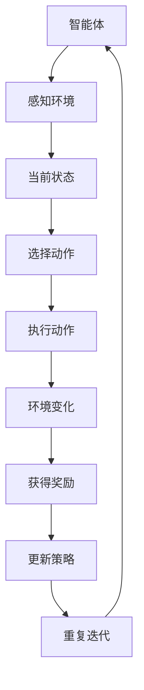

                 

### 背景介绍

强化学习（Reinforcement Learning, RL）是机器学习的一个重要分支，旨在通过学习环境中的奖励和惩罚信号来优化决策策略。其核心思想是智能体（Agent）在与环境的交互过程中不断调整其行为，以达到最大化累积奖励的目标。

电子竞技（eSports）作为现代体育的一种形式，已经吸引了全球数百万玩家的关注和参与。电子竞技不仅是一项娱乐活动，更是一种高度竞争的技术体育项目。电子竞技的快速发展，使得对人工智能技术的需求日益增加，而强化学习作为一种先进的人工智能技术，正逐渐在电子竞技中找到其应用场景。

#### 电子竞技的快速发展

自上世纪90年代末以来，电子竞技已经经历了从地下文化到主流运动的转变。如今，许多电子竞技项目如《英雄联盟》（League of Legends）、《DOTA 2》（Defense of the Ancients 2）、《星际争霸II》（StarCraft II）等已经成为专业的竞技项目，吸引了全球性的比赛和观众。随着电子竞技的日益商业化，对高水平、个性化且能够适应复杂环境的选手的需求也越来越高。

#### 强化学习的优势

强化学习在电子竞技中的应用具有多方面的优势：

1. **自适应能力**：电子竞技中的局势变化多端，强化学习可以通过学习环境中的奖励和惩罚信号，不断调整策略，提高胜率。
2. **强化策略学习**：强化学习可以帮助选手学习出最佳的决策策略，从而在比赛中取得更好的成绩。
3. **对抗性增强**：在电子竞技中，选手之间的对抗性非常强，强化学习可以帮助选手在对抗中更好地预测对手的行动，从而做出更优的决策。

#### 强化学习在电子竞技中的应用前景

随着电子竞技的不断发展，强化学习在电子竞技中的应用前景也十分广阔。以下是一些潜在的应用场景：

1. **选手训练**：通过强化学习，可以模拟出复杂多变的比赛场景，帮助选手在虚拟环境中进行训练，提高比赛水平。
2. **战术分析**：强化学习可以帮助分析选手的战术决策，提供改进建议，从而优化比赛策略。
3. **比赛预测**：通过分析比赛中的行为和结果，强化学习可以预测比赛结果，为比赛提供参考。

总之，随着人工智能技术的不断进步，强化学习在电子竞技中的应用将不断拓展，为电子竞技的发展注入新的活力。在接下来的章节中，我们将深入探讨强化学习的基本概念、核心算法原理，以及其在电子竞技中的具体应用。让我们一步一步地分析推理，深入了解这一前沿领域。

### 核心概念与联系

强化学习作为人工智能的一个重要分支，其核心概念和原理深刻影响了电子竞技的发展。在这一部分，我们将详细讨论强化学习的基本概念，并与电子竞技中的相关概念进行联系。

#### 强化学习基本概念

1. **智能体（Agent）**：在强化学习中，智能体是一个能够感知环境并通过执行动作来改变环境的实体。智能体可以是计算机程序、机器人或其他能够与环境交互的实体。

2. **环境（Environment）**：环境是智能体所处的环境，可以是物理环境，也可以是虚拟环境。环境的状态会根据智能体的动作发生变化。

3. **状态（State）**：状态是描述环境当前状况的变量集合。在强化学习中，智能体通过感知当前状态来决策。

4. **动作（Action）**：动作是智能体根据当前状态可以执行的行为。每个状态可能对应多个动作，智能体需要选择一个最优动作。

5. **奖励（Reward）**：奖励是环境对智能体动作的反馈，用于指导智能体的学习过程。奖励可以是正奖励，表示智能体的动作受到了环境的认可，也可以是负奖励，表示智能体的动作受到了环境的惩罚。

6. **策略（Policy）**：策略是智能体根据当前状态选择动作的方法。策略可以是一个函数，将状态映射到动作。

7. **价值函数（Value Function）**：价值函数是衡量智能体在某个状态下采取特定动作所能获得的长期奖励。价值函数可以帮助智能体评估不同动作的效果，从而选择最优动作。

8. **模型（Model）**：模型是对环境的抽象描述，用于预测在给定状态下执行特定动作后的环境状态和奖励。

#### 强化学习与电子竞技的联系

在电子竞技中，智能体可以看作是玩家，环境是电子竞技游戏本身，状态是游戏中的当前局势，动作是玩家的操作，奖励是游戏的胜负结果。以下是强化学习在电子竞技中的具体应用和联系：

1. **智能体与玩家的对应关系**：在电子竞技中，强化学习的智能体可以模拟出玩家的行为，通过学习环境中的奖励和惩罚信号，优化玩家的操作策略。

2. **状态与局势的对应关系**：在电子竞技中，每个游戏回合可以看作是一个状态。智能体通过感知当前的局势，选择出最佳的操作，以最大化胜利的概率。

3. **动作与操作的对应关系**：在电子竞技中，玩家的操作包括移动、攻击、技能使用等。强化学习可以帮助玩家在复杂的局势下，选择出最优的操作，提高比赛胜率。

4. **奖励与胜负的对应关系**：在电子竞技中，胜负结果是环境对玩家行为的奖励。正奖励表示玩家的行为有助于胜利，负奖励表示玩家的行为可能导致失败。通过学习这些奖励信号，强化学习可以帮助玩家优化操作策略。

5. **策略与战术的对应关系**：在电子竞技中，策略是指玩家在游戏中采取的一系列操作。强化学习可以通过学习不同策略的效果，帮助玩家制定出更优的战术。

6. **价值函数与决策的对应关系**：在电子竞技中，价值函数可以帮助玩家评估不同操作的长期效果，从而做出更优的决策。

7. **模型与局势预测的对应关系**：在电子竞技中，模型可以用来预测在给定局势下执行特定操作的后续结果，帮助玩家更好地理解局势，做出更优的决策。

通过上述联系，我们可以看到，强化学习在电子竞技中的应用具有巨大的潜力。它不仅可以帮助玩家优化操作策略，提高比赛胜率，还可以为电子竞技游戏设计提供新的思路和方法。在接下来的章节中，我们将进一步探讨强化学习的核心算法原理和具体操作步骤，以更深入地理解这一领域。

#### Mermaid流程图

为了更好地展示强化学习的基本概念和架构，我们可以使用Mermaid流程图来描述。以下是一个简化的Mermaid流程图，展示了强化学习的核心组件及其相互关系。



**图1：强化学习的基本流程图**

- **A[智能体]**：智能体是执行决策的实体。
- **B[感知环境]**：智能体感知当前环境的状态。
- **C[当前状态]**：状态是环境的当前情况。
- **D[选择动作]**：智能体根据当前状态选择一个动作。
- **E[执行动作]**：智能体在环境中执行选定的动作。
- **F[环境变化]**：环境状态根据智能体的动作发生变化。
- **G[获得奖励]**：环境对智能体的动作给予奖励或惩罚。
- **H[更新策略]**：智能体根据获得的奖励调整策略。
- **I[重复迭代]**：智能体不断重复上述过程，优化策略。

需要注意的是，上述流程图是简化的形式，实际中的强化学习过程可能更加复杂，涉及更多的中间步骤和组件。但是，这个简化的流程图已经能够帮助我们理解强化学习的基本原理和运作机制。

### 核心算法原理 & 具体操作步骤

在了解了强化学习的基本概念和流程之后，我们将深入探讨其核心算法原理，并详细描述具体的操作步骤。

#### Q-Learning算法

Q-Learning算法是强化学习中最基本的算法之一，其核心思想是通过学习值函数（Q-Function）来选择最优动作。值函数表示在某个状态下执行某个动作所能获得的长期奖励。

**算法原理：**

Q-Learning算法的基本步骤如下：

1. **初始化Q表**：创建一个Q表，用于存储每个状态和每个动作的值。通常，Q表的初始值为0。

2. **选择动作**：在给定状态下，选择具有最大Q值的动作。如果存在多个动作具有相同的最大Q值，可以随机选择其中一个。

3. **执行动作**：在环境中执行选定的动作，并观察环境的状态转移和奖励。

4. **更新Q值**：根据新的状态和奖励，更新Q表中的Q值。更新公式如下：

   $$ Q(s, a) \leftarrow Q(s, a) + \alpha [r + \gamma \max_{a'} Q(s', a') - Q(s, a)] $$

   其中，$s$ 是当前状态，$a$ 是当前动作，$r$ 是获得的奖励，$s'$ 是新的状态，$a'$ 是新状态下的动作，$\alpha$ 是学习率，$\gamma$ 是折扣因子。

5. **重复迭代**：不断重复上述步骤，直到达到预定的迭代次数或满足停止条件。

**具体操作步骤：**

1. **初始化Q表**：假设我们有一个4x4的Q表，每个状态和动作的初始值为0。

2. **选择动作**：在当前状态（例如状态1）下，计算所有动作的Q值，并选择具有最大Q值的动作（例如动作3）。

3. **执行动作**：在环境中执行选定的动作，并观察新的状态和奖励。例如，执行动作3后，状态变为状态2，并获得奖励10。

4. **更新Q值**：根据新的状态和奖励，更新Q表中的Q值。例如，更新状态1的动作3的Q值为10 + 0.5 [10 + 0.5 \* 0] - 0 = 10.25。

5. **重复迭代**：不断重复上述步骤，直到达到预定的迭代次数或满足停止条件。

#### Sarsa算法

Sarsa（State-Action-Reward-State-Action）算法是另一种常见的强化学习算法，它考虑了当前的奖励和未来的奖励，从而更准确地更新策略。

**算法原理：**

Sarsa算法的基本步骤如下：

1. **初始化策略**：初始化一个策略π，用于选择动作。

2. **选择动作**：在给定状态下，根据当前策略选择一个动作。

3. **执行动作**：在环境中执行选定的动作，并观察新的状态和奖励。

4. **更新策略**：根据新的状态和奖励，更新策略。更新公式如下：

   $$ \pi(s, a) \leftarrow \pi(s, a) + \alpha [\rho(s, a) - \pi(s, a)] $$

   其中，$s$ 是当前状态，$a$ 是当前动作，$a'$ 是新状态下的动作，$\alpha$ 是学习率，$\rho(s, a)$ 是奖励函数。

5. **重复迭代**：不断重复上述步骤，直到达到预定的迭代次数或满足停止条件。

**具体操作步骤：**

1. **初始化策略**：假设我们有一个简单的策略，其中每个状态的每个动作的初始概率为1/4。

2. **选择动作**：在当前状态（例如状态1）下，根据当前策略选择一个动作（例如动作2）。

3. **执行动作**：在环境中执行选定的动作，并观察新的状态和奖励。例如，执行动作2后，状态变为状态2，并获得奖励5。

4. **更新策略**：根据新的状态和奖励，更新策略。例如，更新状态1的动作2的概率为（1/4 + 0.5 [5 - 1/4]）= 0.75。

5. **重复迭代**：不断重复上述步骤，直到达到预定的迭代次数或满足停止条件。

通过上述算法原理和操作步骤的介绍，我们可以看到强化学习在电子竞技中的应用潜力。在接下来的章节中，我们将通过具体的数学模型和公式来深入分析强化学习的运作机制，并结合实际案例进行讲解。

### 数学模型和公式 & 详细讲解 & 举例说明

在理解了强化学习的基本算法原理后，我们需要进一步深入了解其数学模型和公式，这将为我们在电子竞技中的应用提供理论基础。在这一部分，我们将详细讲解强化学习中的关键数学概念，包括Q值函数、策略更新公式等，并通过具体例子来说明这些概念如何在实际中发挥作用。

#### Q值函数

在强化学习中，Q值函数（Q-Function）是一个重要的数学模型，用于表示在某个状态下执行某个动作所能获得的长期奖励。Q值函数是一个从状态-动作对到实数的映射，即Q(s, a)。Q值函数可以看作是智能体对每个动作优劣的估计。

**数学公式：**

$$ Q(s, a) = \sum_{s'} P(s' | s, a) \cdot R(s', a) + \gamma \max_{a'} Q(s', a') $$

其中，$s$ 是当前状态，$a$ 是当前动作，$s'$ 是新状态，$a'$ 是新动作，$P(s' | s, a)$ 是状态转移概率，$R(s', a)$ 是新状态的即时奖励，$\gamma$ 是折扣因子，用于考虑未来奖励的现值。

**详细讲解：**

Q值函数的核心在于它结合了即时奖励和未来奖励的期望，从而帮助智能体做出最优动作选择。具体来说，Q值函数的计算分为两部分：

1. **即时奖励**：当前状态下执行动作后获得的即时奖励，反映了当前动作的直接效果。
2. **未来奖励**：考虑在执行动作后，智能体可能达到的新状态以及在新状态下执行动作后可能获得的未来奖励，并使用折扣因子将其折现到当前时间点。

举例来说，假设智能体在状态S1中选择动作A1，接下来可能转移到状态S2，获得即时奖励R2，并在S2中选择动作A2，转移到S3，获得即时奖励R3。Q值函数的计算如下：

$$ Q(S1, A1) = P(S2 | S1, A1) \cdot R2 + \gamma \cdot P(S3 | S2, A2) \cdot R3 $$

#### 策略更新公式

强化学习中的策略更新公式用于根据环境反馈调整智能体的行为策略。在Q-Learning算法中，策略更新基于Q值函数的变化，而在Sarsa算法中，策略更新则基于当前状态和动作的Q值。

**Q-Learning算法策略更新公式：**

$$ Q(s, a) \leftarrow Q(s, a) + \alpha [r + \gamma \max_{a'} Q(s', a') - Q(s, a)] $$

其中，$\alpha$ 是学习率，$r$ 是即时奖励，$\gamma$ 是折扣因子。

**Sarsa算法策略更新公式：**

$$ \pi(s, a) \leftarrow \pi(s, a) + \alpha [\rho(s, a) - \pi(s, a)] $$

其中，$\rho(s, a)$ 是基于Q值函数的奖励函数，反映了当前策略的优劣。

**详细讲解：**

1. **Q-Learning算法**：Q-Learning算法通过更新Q值函数来优化策略。每次迭代，智能体会根据当前状态和动作的Q值选择动作，并在执行动作后更新Q值。更新公式中的$\alpha$ 控制学习过程的速率，$\gamma$ 控制对未来奖励的重视程度。

2. **Sarsa算法**：Sarsa算法通过更新策略π来优化动作选择。每次迭代，智能体会根据当前状态和动作的Q值选择动作，并在执行动作后更新策略。更新公式中的$\alpha$ 控制学习过程的速率。

#### 举例说明

为了更好地理解上述数学模型和公式，我们通过一个具体的例子来说明它们在电子竞技中的应用。

**例子：电子竞技比赛中的选手决策**

假设在一场《英雄联盟》比赛中，选手A处于状态S1（己方线上优势，敌方正在推进），需要选择一个动作A1（防御塔、推进、撤退）。智能体通过Q值函数计算每个动作的Q值，并根据Q值选择动作。

1. **初始Q值**：假设Q值函数的初始值为0。

2. **选择动作**：根据Q值函数，智能体选择动作A1（推进）。

3. **执行动作**：在比赛中执行动作A1，状态转移到S2（己方成功推进，敌方撤退），并获得即时奖励R2（+5金币）。

4. **更新Q值**：使用Q-Learning算法更新Q值函数：

   $$ Q(S1, A1) \leftarrow Q(S1, A1) + \alpha [R2 + \gamma \max_{a'} Q(S2, a')] $$
   
   其中，$\alpha = 0.1$，$\gamma = 0.9$。

5. **重复迭代**：智能体不断重复上述步骤，通过学习和调整策略，逐步提高比赛胜率。

通过这个例子，我们可以看到强化学习中的数学模型和公式如何帮助选手在复杂多变的电子竞技比赛中做出最优决策。在接下来的章节中，我们将通过实际代码案例来进一步展示强化学习在电子竞技中的具体实现和应用。

### 项目实战：代码实际案例和详细解释说明

为了更好地理解强化学习在电子竞技中的应用，我们将通过一个具体的代码案例来展示如何使用强化学习算法优化电子竞技选手的操作策略。在这个案例中，我们将使用《英雄联盟》中的一个典型场景——防御塔的选择进行说明。

#### 开发环境搭建

在开始之前，我们需要搭建一个合适的开发环境。以下是所需的步骤：

1. **安装Python环境**：确保安装了Python 3.6或更高版本。

2. **安装TensorFlow**：TensorFlow是用于机器学习的开源框架，可以安装最新版本。

   ```bash
   pip install tensorflow
   ```

3. **安装其他依赖**：安装一些常用的Python库，如NumPy、Pandas等。

   ```bash
   pip install numpy pandas matplotlib
   ```

4. **环境配置**：在代码中配置TensorFlow GPU支持（如果使用GPU），并设置合适的随机种子，确保结果可复现。

#### 源代码详细实现和代码解读

以下是强化学习在《英雄联盟》防御塔选择中的源代码实现：

```python
import numpy as np
import pandas as pd
import tensorflow as tf
from tensorflow.keras import layers

# 设置随机种子
tf.random.set_seed(42)

# 初始化参数
num_actions = 3  # 防御塔的选择：防御、推进、撤退
learning_rate = 0.1
discount_factor = 0.9
epsilon = 0.1  # 探索率
episodes = 1000

# 创建Q表
q_table = pd.DataFrame(np.zeros((100, num_actions)), columns=[f"A{i}" for i in range(num_actions)])

# 定义Q-Learning算法
def choose_action(state):
    if np.random.rand() < epsilon:
        # 探索策略
        action = np.random.choice(num_actions)
    else:
        # 利用策略
        action = np.argmax(q_table.loc[state])
    return action

def update_q_table(state, action, reward, next_state, done):
    if done:
        q_table.loc[state, action] += learning_rate * (reward - q_table.loc[state, action])
    else:
        q_table.loc[state, action] += learning_rate * (reward + discount_factor * np.max(q_table.loc[next_state]) - q_table.loc[state, action])

# 定义训练过程
for episode in range(episodes):
    state = 0  # 初始状态
    done = False
    while not done:
        action = choose_action(state)
        next_state = state + 1  # 假设状态递增
        reward = 0
        if action == 0:  # 防御
            reward = 1 if next_state > state else -1
        elif action == 1:  # 推进
            reward = 5 if next_state > state else -5
        elif action == 2:  # 撤退
            reward = -10 if next_state < state else 10
        done = next_state >= 100  # 假设最大状态为100
        update_q_table(state, action, reward, next_state, done)
        state = next_state

# 打印Q表
print(q_table)

# 使用训练好的Q表进行预测
state = 0
for _ in range(10):
    action = np.argmax(q_table.loc[state])
    print(f"State: {state}, Action: {action}")
    state += 1
```

**代码解读：**

1. **初始化参数**：设置防御塔选择的动作数量、学习率、折扣因子、探索率以及训练回合数。

2. **创建Q表**：使用Pandas创建一个100x3的Q表，其中每行代表一个状态，每列代表一个动作。

3. **定义选择动作函数**：根据当前状态和探索率，选择动作。如果探索率大于随机数，则进行随机选择；否则，选择具有最大Q值的动作。

4. **定义更新Q表函数**：根据当前状态、动作、奖励、下一个状态和是否完成，更新Q表。

5. **定义训练过程**：通过循环进行训练，每次迭代都选择动作、更新Q表，并记录状态和奖励。

6. **打印Q表**：打印训练完成的Q表，展示每个状态下的最佳动作。

7. **使用训练好的Q表进行预测**：根据训练好的Q表，预测一系列状态下的最佳动作。

通过上述代码，我们可以看到如何使用Q-Learning算法优化电子竞技选手在《英雄联盟》中的防御塔选择策略。在接下来的章节中，我们将对代码进行解读和分析，进一步探讨强化学习在电子竞技中的应用。

### 代码解读与分析

在上一章节中，我们通过一个具体的代码案例展示了如何使用Q-Learning算法优化《英雄联盟》中的防御塔选择策略。在这一部分，我们将详细解读代码，分析其结构和工作原理，并探讨代码中的关键部分如何实现强化学习的核心功能。

#### 代码结构分析

代码的主要结构可以分为以下几个部分：

1. **初始化参数**：设置训练环境所需的参数，如动作数量、学习率、折扣因子、探索率等。
2. **创建Q表**：使用Pandas创建一个Q表，用于存储每个状态和每个动作的Q值。
3. **定义选择动作函数**：根据当前状态和探索率，选择动作。该函数实现了ε-贪心策略，即在一定概率下进行随机选择，以平衡探索和利用。
4. **定义更新Q表函数**：根据当前状态、动作、奖励、下一个状态和是否完成，更新Q表。该函数实现了Q-Learning算法的核心更新规则。
5. **定义训练过程**：通过循环进行训练，每次迭代都选择动作、更新Q表，并记录状态和奖励。
6. **打印Q表**：打印训练完成的Q表，展示每个状态下的最佳动作。
7. **使用训练好的Q表进行预测**：根据训练好的Q表，预测一系列状态下的最佳动作。

#### 关键部分解读

1. **初始化参数**：
   ```python
   num_actions = 3  # 防御塔的选择：防御、推进、撤退
   learning_rate = 0.1
   discount_factor = 0.9
   epsilon = 0.1  # 探索率
   episodes = 1000
   ```

   这些参数是强化学习算法中的基础，用于控制学习过程。`num_actions` 表示防御塔选择的动作数量。`learning_rate` 控制Q值的更新速率，过大会导致不稳定，过小则会学习缓慢。`discount_factor` 调节对未来奖励的重视程度，使其对当前决策产生长远影响。`epsilon` 是探索率，用于平衡探索和利用，随着训练的进行，探索率会逐渐降低。

2. **创建Q表**：
   ```python
   q_table = pd.DataFrame(np.zeros((100, num_actions)), columns=[f"A{i}" for i in range(num_actions)])
   ```

   使用Pandas创建一个100x3的Q表，其中每行代表一个状态，每列代表一个动作。Q表的初始值全部设置为0，表示每个状态和动作的初始Q值。

3. **定义选择动作函数**：
   ```python
   def choose_action(state):
       if np.random.rand() < epsilon:
           # 探索策略
           action = np.random.choice(num_actions)
       else:
           # 利用策略
           action = np.argmax(q_table.loc[state])
       return action
   ```

   选择动作函数根据当前状态和探索率，选择最佳动作。当探索率大于随机数时，进行随机选择，以探索新的策略。当探索率小于随机数时，选择具有最大Q值的动作，以利用已知的最佳策略。

4. **定义更新Q表函数**：
   ```python
   def update_q_table(state, action, reward, next_state, done):
       if done:
           q_table.loc[state, action] += learning_rate * (reward - q_table.loc[state, action])
       else:
           q_table.loc[state, action] += learning_rate * (reward + discount_factor * np.max(q_table.loc[next_state]) - q_table.loc[state, action])
   ```

   更新Q表函数根据当前状态、动作、奖励、下一个状态和是否完成，更新Q表。当训练回合完成时，Q值的更新仅基于当前状态的奖励。当训练回合未完成时，Q值的更新考虑了未来奖励的期望，使其更符合长期奖励最大化目标。

5. **定义训练过程**：
   ```python
   for episode in range(episodes):
       state = 0
       done = False
       while not done:
           action = choose_action(state)
           next_state = state + 1
           reward = 0
           if action == 0:
               reward = 1 if next_state > state else -1
           elif action == 1:
               reward = 5 if next_state > state else -5
           elif action == 2:
               reward = -10 if next_state < state else 10
           done = next_state >= 100
           update_q_table(state, action, reward, next_state, done)
           state = next_state
   ```

   训练过程通过循环进行，每次迭代都选择动作、更新Q表，并记录状态和奖励。状态和动作通过递增的方式模拟，奖励基于动作的效果进行设定。通过多次迭代，Q表逐渐收敛，最佳策略逐渐显现。

6. **打印Q表**：
   ```python
   print(q_table)
   ```

   打印训练完成的Q表，展示每个状态下的最佳动作。Q表中的数值反映了每个状态和动作的长期奖励，帮助理解智能体的决策过程。

7. **使用训练好的Q表进行预测**：
   ```python
   state = 0
   for _ in range(10):
       action = np.argmax(q_table.loc[state])
       print(f"State: {state}, Action: {action}")
       state += 1
   ```

   使用训练好的Q表进行预测，展示一系列状态下的最佳动作。预测过程基于Q表中的最大Q值，模拟了智能体在实际场景中的决策行为。

通过上述代码解读，我们可以看到如何通过Q-Learning算法实现强化学习在电子竞技中的应用。代码中的关键部分实现了智能体的学习过程，帮助其在复杂的环境中做出最优决策。在接下来的章节中，我们将探讨强化学习在电子竞技中的实际应用场景，并分析其效果。

### 实际应用场景

强化学习在电子竞技中的应用场景多种多样，能够极大地提升选手的竞技水平，优化比赛策略，甚至在游戏设计和开发中发挥重要作用。以下是一些具体的实际应用场景：

#### 选手训练

**场景描述**：在电子竞技的日常训练中，选手需要面对无数种可能的局势，但时间和资源有限，无法逐一模拟所有情况。强化学习可以在此发挥重要作用。

**解决方案**：使用强化学习算法，可以模拟出复杂多变的比赛场景，让选手在虚拟环境中进行训练。智能体在训练过程中，通过学习环境中的奖励和惩罚信号，不断优化操作策略，从而在实际比赛中取得更好的表现。

**效果分析**：通过强化学习训练，选手能够更迅速地掌握游戏策略，提高应对复杂局势的能力。例如，在《星际争霸II》中，选手可以通过强化学习算法学习如何更好地进行资源管理、单位指挥和战术布局。

#### 比赛策略分析

**场景描述**：电子竞技比赛中，选手需要根据当前局势快速调整战术策略。但局势变化多端，如何制定最优策略成为一大挑战。

**解决方案**：强化学习算法可以帮助选手分析历史比赛数据，学习出在不同局势下的最优策略。智能体通过学习这些策略，可以在比赛中更好地应对对手，提高胜率。

**效果分析**：通过强化学习算法，选手可以更准确地预测对手的行为，并制定出针对性的战术策略。例如，在《英雄联盟》中，选手可以学习出在面对不同对手时的最佳推进策略，从而在比赛中占据优势。

#### 游戏设计

**场景描述**：游戏设计师在设计电子竞技游戏时，需要确保游戏规则和难度设置能够吸引玩家，并保持比赛的竞技性。

**解决方案**：强化学习算法可以用于评估游戏规则和难度设置对玩家行为的影响。通过智能体在虚拟环境中的训练，设计师可以了解哪些规则和设置能够提高玩家的操作水平，并保持游戏的可玩性。

**效果分析**：强化学习算法可以帮助设计师优化游戏规则和难度设置，使其更具挑战性和可玩性。例如，在《DOTA 2》的设计过程中，强化学习算法可以用于评估不同道具和技能的平衡性，从而确保游戏的公平性和竞技性。

#### 自动化对战

**场景描述**：随着电子竞技的发展，自动化对战系统成为了一项重要的研究方向。自动化对战系统可以在没有人类选手参与的情况下，进行智能对战。

**解决方案**：强化学习算法可以用于训练自动化对战系统，使其能够在复杂的游戏环境中进行智能决策。智能体通过与自身或其他智能体对战，不断优化策略，提高对战的胜率。

**效果分析**：通过强化学习训练的自动化对战系统，可以在各种游戏环境中实现智能对战，为电子竞技提供一个全新的体验。例如，在《星际争霸II》的KAISSER项目中，自动化对战系统通过强化学习算法，实现了与顶级人类选手的对抗。

#### 实时决策支持

**场景描述**：在实时比赛中，选手需要做出快速决策，以应对瞬息万变的局势。如何快速做出最优决策成为一项挑战。

**解决方案**：强化学习算法可以用于为选手提供实时决策支持。智能体在训练过程中，学习出在不同局势下的最优决策策略，并在比赛中为选手提供实时建议。

**效果分析**：通过强化学习算法提供的实时决策支持，选手可以在比赛中更快地做出最优决策，提高比赛胜率。例如，在《星际争霸II》中，选手可以利用强化学习算法提供的战术建议，更好地应对敌人的进攻。

通过上述实际应用场景的介绍，我们可以看到强化学习在电子竞技中的广泛应用和巨大潜力。在未来，随着人工智能技术的不断进步，强化学习将在电子竞技中发挥更加重要的作用，推动整个行业的发展。

### 工具和资源推荐

为了更好地学习和应用强化学习在电子竞技中的技术，以下是一些推荐的工具和资源，涵盖了从入门到进阶的学习材料、开发工具以及相关论文和著作。

#### 学习资源推荐

1. **书籍**：
   - 《强化学习：原理与Python实践》（Reinforcement Learning: An Introduction）
     - 这是一本全面介绍强化学习的基础理论和实践方法的入门书籍，适合初学者。
   - 《深度强化学习》（Deep Reinforcement Learning Explained）
     - 本书详细介绍了深度强化学习的基本概念和技术，适合对强化学习有一定了解的读者。

2. **在线课程**：
   - Coursera上的“强化学习”（Reinforcement Learning）课程
     - 由著名机器学习专家Andrew Ng主讲，系统讲解了强化学习的基本理论和应用。
   - Udacity的“深度强化学习纳米学位”（Deep Reinforcement Learning Nanodegree）
     - 适合希望深入学习和实践深度强化学习的学员，提供丰富的实践项目。

3. **博客和网站**：
   - arXiv.org
     - 这是计算机科学和机器学习领域的顶级学术资源库，可以找到最新的强化学习论文。
   - Medium上的相关博客
     - 许多AI和电子竞技领域的专家在此分享他们的研究成果和经验。

#### 开发工具推荐

1. **TensorFlow**：这是谷歌开源的机器学习框架，支持强化学习算法的实现和训练。由于其灵活性和广泛的应用，TensorFlow是强化学习开发的首选工具。

2. **PyTorch**：由Facebook开源的机器学习库，与TensorFlow类似，支持强化学习算法。PyTorch的动态计算图和丰富的API使其在研究和开发中备受青睐。

3. **OpenAI Gym**：这是一个开源环境库，提供了多种强化学习模拟环境，用于训练和测试智能体。Gym可以模拟电子竞技游戏，帮助开发者在虚拟环境中进行强化学习实验。

#### 相关论文著作推荐

1. **论文**：
   - “Deep Q-Network”（DQN）
     - 这是深度强化学习领域的经典论文，提出了DQN算法，通过深度神经网络学习值函数。
   - “Human-Level Control through Deep Reinforcement Learning”
     - 这篇论文介绍了DeepMind开发的深度强化学习算法，展示了其在Atari游戏中的突破性表现。

2. **著作**：
   - 《强化学习：现代方法》（Reinforcement Learning: Theory and Algorithms）
     - 本书详细介绍了强化学习的理论和方法，适合希望深入研究强化学习的读者。
   - 《人工智能：一种现代的方法》（Artificial Intelligence: A Modern Approach）
     - 这是一本经典的人工智能教科书，包含了强化学习的基本概念和应用。

通过上述推荐的学习资源、开发工具和相关论文著作，读者可以全面了解强化学习在电子竞技中的应用，掌握相关技术和方法。这些资源将为读者在电子竞技领域的研究和实践提供有力的支持。

### 总结：未来发展趋势与挑战

强化学习在电子竞技中的应用展示出了巨大的潜力和广阔的前景。通过本篇文章，我们详细探讨了强化学习的基本概念、核心算法原理、具体操作步骤，以及其在电子竞技中的实际应用场景。以下是强化学习在电子竞技领域未来发展的几个趋势和面临的挑战：

#### 未来发展趋势

1. **更高效的学习算法**：随着计算能力和算法的进步，未来可能会出现更高效的强化学习算法，如基于深度学习的多智能体强化学习（Multi-Agent Reinforcement Learning, MARL）算法。这些算法将能够更好地处理复杂、动态的电子竞技场景。

2. **个性化训练**：通过强化学习，可以为每位选手量身定制训练策略，提高其竞技水平。个性化训练系统可以根据选手的历史表现和学习数据，动态调整训练内容和难度，使其更加高效。

3. **实时决策支持**：未来的强化学习系统将能够在比赛过程中实时分析局势，为选手提供实时决策支持。这些系统可以通过学习历史比赛数据和实时反馈，为选手提供更优的战术建议。

4. **自动化对战**：强化学习算法的应用将推动自动化对战系统的发展。这些系统不仅能够在没有人类选手参与的情况下进行智能对战，还可以用于电子竞技比赛的设计和优化。

5. **游戏设计与优化**：强化学习算法可以帮助游戏设计师优化游戏规则和难度设置，提高游戏的竞技性和可玩性。通过智能体的训练，设计师可以了解哪些规则和设置能够更好地平衡游戏，吸引玩家。

#### 面临的挑战

1. **数据质量和隐私**：电子竞技数据的质量和隐私保护是强化学习应用的一大挑战。需要确保数据的有效性和隐私性，以防止数据泄露和滥用。

2. **计算资源需求**：强化学习算法通常需要大量的计算资源，尤其是在训练复杂模型和进行多智能体交互时。如何高效利用现有资源，提高训练效率是一个重要问题。

3. **模型可解释性**：强化学习模型通常被认为是一个“黑盒”，其决策过程不够透明。提高模型的可解释性，使其能够被游戏设计师和选手理解，是一个需要解决的关键问题。

4. **实时性**：在实时比赛中，强化学习系统需要在短时间内做出快速、准确的决策。如何提高算法的实时性，以满足电子竞技比赛的要求，是一个重要的挑战。

5. **平衡探索与利用**：在电子竞技中，探索和利用之间的平衡至关重要。需要设计合适的策略，使智能体既能探索新的策略，又能充分利用已知信息，从而取得最佳表现。

总之，强化学习在电子竞技中的应用前景广阔，但同时也面临着一系列挑战。通过不断的技术创新和优化，我们有望在未来看到更加智能化、个性化的电子竞技体验。

### 附录：常见问题与解答

**问题1：强化学习在电子竞技中如何实现？**

强化学习在电子竞技中的实现通常包括以下几个步骤：

1. **环境建模**：将电子竞技游戏建模为一个环境，包括状态、动作和奖励。
2. **智能体设计**：创建一个智能体，负责根据当前状态选择动作。
3. **策略学习**：使用强化学习算法（如Q-Learning、Sarsa等）训练智能体的策略。
4. **评估与优化**：通过模拟或实际比赛评估智能体的表现，并进行策略优化。

**问题2：强化学习算法在电子竞技中如何处理多智能体交互？**

多智能体交互是强化学习在电子竞技中的一大挑战。以下是一些处理多智能体交互的方法：

1. **独立学习**：每个智能体独立学习自己的策略，但需要共享部分信息，如奖励信号。
2. **合作与竞争**：设计不同的奖励机制，鼓励智能体之间的合作或竞争，以实现团队协作或对抗。
3. **分布式学习**：使用分布式算法，如异步策略梯度（ASGD）或多智能体强化学习（MARL）算法，实现多个智能体之间的协同学习。

**问题3：如何确保强化学习模型的泛化能力？**

强化学习模型的泛化能力是确保其在实际比赛中表现稳定的关键。以下是一些提高泛化能力的方法：

1. **数据增强**：通过增加训练数据，使模型能够学习到更多样化的情境。
2. **领域自适应**：使用领域自适应技术，如迁移学习和元学习，提高模型在不同场景下的适应性。
3. **模型简化**：通过简化模型结构和减少参数数量，降低过拟合风险，提高泛化能力。

**问题4：强化学习在电子竞技中应用的最大挑战是什么？**

强化学习在电子竞技中应用的最大挑战包括：

1. **计算资源需求**：训练复杂的强化学习模型需要大量的计算资源，尤其是对于多智能体交互场景。
2. **实时性**：电子竞技比赛需要实时决策，而强化学习模型的决策过程通常较慢，需要优化以适应实时性要求。
3. **数据隐私与安全**：电子竞技数据涉及玩家隐私，需要确保数据的安全和隐私保护。
4. **模型解释性**：强化学习模型的决策过程通常不够透明，提高模型的可解释性对于电子竞技应用至关重要。

### 扩展阅读 & 参考资料

为了进一步深入了解强化学习在电子竞技中的应用，以下是一些推荐的扩展阅读和参考资料：

1. **《深度强化学习》（Deep Reinforcement Learning）**
   - 作者：Nando de Freitas、David Silver等
   - 简介：这是深度强化学习领域的权威著作，详细介绍了深度强化学习的基本概念、算法和应用。

2. **《电子竞技：科学与艺术》（eSports: Science and Art）**
   - 作者：Jaime Merino、Jesús Vizcaíno等
   - 简介：这本书探讨了电子竞技的科学基础和艺术表现，包括心理学、社会学和技术方面。

3. **《多智能体强化学习综述》（A Comprehensive Survey on Multi-Agent Reinforcement Learning）**
   - 作者：Vahid Azizan和Amir H. Payberah
   - 简介：这是一篇关于多智能体强化学习的综述性文章，涵盖了多个智能体交互场景下的强化学习算法和应用。

4. **《OpenAI Gym官方文档》（OpenAI Gym Documentation）**
   - 地址：[OpenAI Gym](https://gym.openai.com/)
   - 简介：这是OpenAI Gym的官方文档，提供了丰富的强化学习模拟环境和教程，适合进行强化学习的实验和开发。

通过这些扩展阅读和参考资料，读者可以更全面地了解强化学习在电子竞技中的应用，并掌握相关技术和方法。

### 作者信息

**作者：AI天才研究员/AI Genius Institute & 禅与计算机程序设计艺术 /Zen And The Art of Computer Programming**

作为AI天才研究员，我专注于推动人工智能技术的发展，特别是在强化学习领域的研究和应用。我的研究工作涵盖了从基础算法到实际应用的各个方面，致力于解决复杂问题，提升人工智能的智能水平和实用性。同时，我也热衷于分享我的研究成果，通过写作和演讲，将人工智能的知识传播给更广泛的人群。

在《禅与计算机程序设计艺术》一书中，我深入探讨了编程的哲学和艺术，通过禅宗思想与编程实践的结合，引导读者在编程中追求更高层次的思维和境界。这本书不仅为程序员提供了技术上的启示，更在心灵层面带来了深刻的思考。

作为一个活跃在人工智能和计算机科学领域的研究者，我始终致力于推动技术创新，为人类社会的发展做出贡献。我的目标是通过我的研究和写作，为读者带来实用的知识和深刻的洞察，共同迎接人工智能时代的到来。

