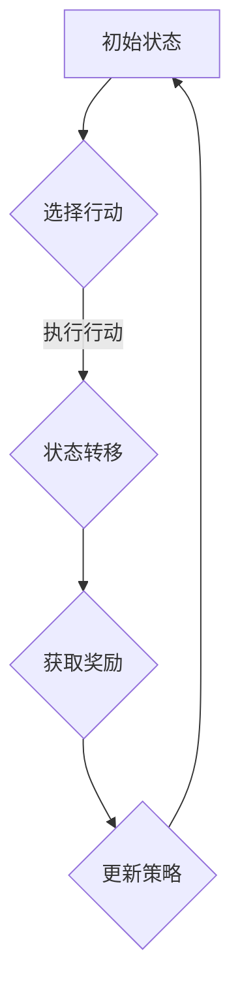

                 

# 强化学习Reinforcement Learning对抗环境中的学习策略

> **关键词：** 强化学习、对抗环境、策略优化、智能体、奖励机制、Q学习、策略梯度、深度强化学习、Deep Q-Network (DQN)、策略网络、OpenAI Gym。

> **摘要：** 本文将深入探讨强化学习在对抗环境中的学习策略。首先，我们将回顾强化学习的基本概念和原理。然后，我们将探讨如何在对抗环境中应用强化学习，并重点介绍几种经典的策略优化算法。最后，我们将通过具体案例来展示强化学习在对抗环境中的应用，并讨论其未来发展趋势和挑战。

## 1. 背景介绍

强化学习（Reinforcement Learning，RL）是一种机器学习方法，它使智能体（agent）通过与环境的交互来学习达到目标。在强化学习中，智能体通过选择行动来获取奖励或惩罚，从而逐步改善其策略。这种学习过程通常是基于试错（trial-and-error）的方法，智能体在环境中不断试错，以找到最大化累积奖励的策略。

### 1.1 强化学习的基本概念

强化学习由三个核心组成部分：智能体（agent）、环境（environment）和行动（action）。智能体是执行行动的实体，环境是智能体行动的场所，行动则是智能体与环境交互的结果。在强化学习中，智能体根据当前状态（state）选择行动，并从环境中获取即时奖励（reward）。

### 1.2 强化学习的工作流程

强化学习的工作流程可以概括为以下几个步骤：

1. **初始化**：智能体和环境开始交互，初始化状态和策略。
2. **执行行动**：智能体根据当前状态选择行动。
3. **状态转移**：智能体执行行动后，环境发生变化，状态转移到新的状态。
4. **获取奖励**：智能体从环境中获取即时奖励。
5. **策略更新**：智能体根据即时奖励和策略评估函数更新其策略。

### 1.3 强化学习在现实世界中的应用

强化学习在现实世界中有着广泛的应用，例如：

- **游戏**：智能体可以在游戏中学习并提高其游戏技能，例如围棋、Dota 2等。
- **机器人控制**：智能体可以控制机器人执行复杂的任务，如行走、抓取等。
- **推荐系统**：智能体可以根据用户的历史行为推荐个性化的内容。
- **自动驾驶**：智能体可以学习并优化驾驶策略，提高行驶安全性和效率。

## 2. 核心概念与联系

### 2.1 强化学习的核心概念

强化学习包含以下几个核心概念：

- **状态（State）**：描述智能体在环境中的当前情况。
- **行动（Action）**：智能体可以选择的行动。
- **策略（Policy）**：智能体选择的行动与状态的映射关系。
- **奖励（Reward）**：智能体执行行动后从环境中获得的即时奖励或惩罚。
- **价值函数（Value Function）**：评估智能体在某个状态下采取特定行动的长期价值。
- **模型（Model）**：对环境的动态和奖励机制的假设和描述。

### 2.2 强化学习的架构

强化学习的架构可以分为以下几个部分：

1. **状态空间（State Space）**：智能体可能处于的所有状态的集合。
2. **行动空间（Action Space）**：智能体可以执行的所有行动的集合。
3. **策略网络（Policy Network）**：决定智能体在不同状态下应该采取哪些行动的神经网络。
4. **价值网络（Value Network）**：评估智能体在执行特定行动后状态的长期价值的神经网络。
5. **奖励机制（Reward Mechanism）**：定义智能体执行行动后环境提供的即时奖励。

### 2.3 Mermaid 流程图



在这个流程图中，智能体从初始状态开始，选择行动，执行行动后状态转移，获取奖励，并更新策略，然后回到初始状态，开始新一轮的交互。

## 3. 核心算法原理 & 具体操作步骤

### 3.1 Q学习（Q-Learning）

Q学习是一种基于值函数的强化学习算法，通过学习状态-行动值函数（Q函数）来优化策略。Q学习的基本原理是，智能体在某个状态下选择能够带来最大预期奖励的行动。

#### 3.1.1 Q函数

Q函数是一个映射函数，它将状态-行动对映射到一个实数值，表示在某个状态下执行某个行动的预期奖励。Q函数的定义如下：

$$
Q(s, a) = \sum_{s'} p(s' | s, a) \cdot r(s, a, s') + \gamma \cdot \max_{a'} Q(s', a')
$$

其中，$s$ 表示当前状态，$a$ 表示当前行动，$s'$ 表示下一个状态，$r(s, a, s')$ 表示在状态 $s$ 下执行行动 $a$ 后转移到状态 $s'$ 所获得的即时奖励，$p(s' | s, a)$ 表示在状态 $s$ 下执行行动 $a$ 后转移到状态 $s'$ 的概率，$\gamma$ 表示折扣因子，用于平衡即时奖励和长期奖励。

#### 3.1.2 Q学习算法

Q学习算法的基本步骤如下：

1. **初始化**：随机初始化Q函数的值。
2. **执行行动**：根据当前状态和Q函数选择行动。
3. **状态转移**：执行行动后，智能体转移到新的状态。
4. **更新Q值**：根据即时奖励和状态转移概率更新Q值。
5. **重复步骤2-4**：重复执行行动、状态转移和Q值更新，直到达到目标状态或满足停止条件。

#### 3.1.3 Q学习的伪代码

```python
# 初始化Q值
Q = random_initialization()

# 循环直到达到目标状态或停止条件
while not stop_condition:
    # 选择行动
    a = choose_action(s, Q)
    
    # 执行行动，状态转移，获取奖励
    s', r = execute_action(s, a)
    
    # 更新Q值
    Q[s][a] = Q[s][a] + alpha * (r + gamma * max(Q[s'][a']) - Q[s][a])
    
    # 更新状态
    s = s'
```

### 3.2 策略梯度（Policy Gradient）

策略梯度是一种直接优化策略的强化学习算法，它通过计算策略的梯度来更新策略参数。策略梯度算法的基本原理是，智能体通过选择能够最大化累积奖励的策略参数来优化其策略。

#### 3.2.1 策略梯度

策略梯度是一个向量，它的每个元素表示策略参数对累积奖励的梯度。策略梯度的计算公式如下：

$$
\nabla_{\theta} J(\theta) = \nabla_{\theta} \sum_{t} r_t = \sum_{t} \nabla_{\theta} r_t
$$

其中，$\theta$ 表示策略参数，$J(\theta)$ 表示累积奖励，$r_t$ 表示第 $t$ 次行动的即时奖励。

#### 3.2.2 策略梯度算法

策略梯度算法的基本步骤如下：

1. **初始化**：随机初始化策略参数。
2. **执行行动**：根据当前状态和策略参数选择行动。
3. **状态转移**：执行行动后，智能体转移到新的状态。
4. **计算策略梯度**：根据累积奖励计算策略梯度。
5. **更新策略参数**：根据策略梯度更新策略参数。
6. **重复步骤2-5**：重复执行行动、状态转移、计算策略梯度和更新策略参数，直到满足停止条件。

#### 3.2.3 策略梯度的伪代码

```python
# 初始化策略参数
theta = random_initialization()

# 循环直到达到目标状态或停止条件
while not stop_condition:
    # 选择行动
    a = choose_action(s, theta)
    
    # 执行行动，状态转移，获取奖励
    s', r = execute_action(s, a)
    
    # 计算策略梯度
    grad = compute_gradient(a, r, theta)
    
    # 更新策略参数
    theta = theta + learning_rate * grad
    
    # 更新状态
    s = s'
```

### 3.3 深度Q网络（Deep Q-Network，DQN）

深度Q网络是一种基于深度学习的Q学习算法，它使用神经网络来近似Q函数。DQN通过经验回放和目标网络来稳定学习过程。

#### 3.3.1 DQN的基本原理

DQN的基本原理如下：

1. **经验回放（Experience Replay）**：将智能体在环境中执行行动的经验存储在经验回放池中，并在训练过程中随机采样这些经验来训练神经网络，以避免样本偏差。
2. **目标网络（Target Network）**：DQN使用一个目标网络来稳定学习过程。目标网络的权重在训练过程中定期从主网络复制，以减少训练过程中的梯度消失问题。

#### 3.3.2 DQN的算法步骤

DQN的算法步骤如下：

1. **初始化**：初始化主网络和目标网络的权重。
2. **执行行动**：根据当前状态和主网络选择行动。
3. **状态转移**：执行行动后，智能体转移到新的状态。
4. **存储经验**：将当前状态、行动和即时奖励存储在经验回放池中。
5. **训练主网络**：从经验回放池中随机采样经验，训练主网络的权重。
6. **更新目标网络**：定期从主网络复制权重到目标网络。
7. **重复步骤2-6**：重复执行行动、状态转移、存储经验、训练主网络和更新目标网络，直到满足停止条件。

#### 3.3.3 DQN的伪代码

```python
# 初始化主网络和目标网络的权重
main_network = random_initialization()
target_network = random_initialization()

# 循环直到达到目标状态或停止条件
while not stop_condition:
    # 选择行动
    a = choose_action(s, main_network)
    
    # 执行行动，状态转移，获取奖励
    s', r = execute_action(s, a)
    
    # 存储经验
    experience = (s, a, r, s')
    replay_memory.append(experience)
    
    # 从经验回放池中随机采样经验
    batch = random_sample(replay_memory)
    
    # 训练主网络
    loss = train_main_network(batch)
    
    # 更新目标网络
    copy_weights(main_network, target_network)
    
    # 更新状态
    s = s'
```

## 4. 数学模型和公式 & 详细讲解 & 举例说明

### 4.1 Q学习的数学模型和公式

Q学习的核心是Q函数，它是一个表示在给定状态下执行给定行动的预期回报的函数。Q函数的定义如下：

$$
Q(s, a) = \sum_{s'} p(s' | s, a) \cdot [r(s, a, s') + \gamma \cdot \max_{a'} Q(s', a')]
$$

其中：

- $s$ 是当前状态。
- $a$ 是当前行动。
- $s'$ 是下一个状态。
- $r(s, a, s')$ 是在状态 $s$ 下执行行动 $a$ 后转移到状态 $s'$ 所获得的即时奖励。
- $p(s' | s, a)$ 是在状态 $s$ 下执行行动 $a$ 后转移到状态 $s'$ 的概率。
- $\gamma$ 是折扣因子，用于平衡即时奖励和长期奖励。
- $\max_{a'} Q(s', a')$ 是在下一个状态 $s'$ 下执行所有可能行动的预期回报的最大值。

### 4.2 策略梯度的数学模型和公式

策略梯度的核心目标是优化策略参数，使得累积奖励最大化。策略梯度的目标函数是：

$$
J(\theta) = \sum_{t} \rho_t
$$

其中：

- $\theta$ 是策略参数。
- $\rho_t$ 是在第 $t$ 次行动中获得的即时奖励。

策略梯度的公式为：

$$
\nabla_{\theta} J(\theta) = \sum_{t} \nabla_{\theta} \rho_t
$$

其中：

- $\nabla_{\theta} \rho_t$ 是在第 $t$ 次行动中策略参数的梯度。

### 4.3 DQN的数学模型和公式

DQN的核心是使用深度神经网络来近似Q函数。DQN的目标函数是：

$$
J(\theta) = \frac{1}{N} \sum_{i=1}^{N} L_i
$$

其中：

- $N$ 是训练样本的数量。
- $L_i$ 是第 $i$ 个样本的损失函数。

损失函数是：

$$
L_i = (y_i - Q(s_i, a_i))^2
$$

其中：

- $y_i$ 是第 $i$ 个样本的目标值。
- $Q(s_i, a_i)$ 是第 $i$ 个样本的预测值。

目标值 $y_i$ 的计算公式为：

$$
y_i = r_i + \gamma \cdot \max_{a'} Q(s_i', a')
$$

其中：

- $r_i$ 是第 $i$ 个样本的即时奖励。
- $s_i'$ 是第 $i$ 个样本的状态转移。

### 4.4 举例说明

#### 4.4.1 Q学习的例子

假设智能体处于一个简单的环境，状态空间为 {0, 1, 2, 3}，行动空间为 {A, B, C}。即时奖励函数为：

$$
r(s, a) =
\begin{cases}
10, & \text{if } s = 0 \text{ and } a = A \\
-10, & \text{if } s = 0 \text{ and } a = B \\
0, & \text{otherwise}
\end{cases}
$$

折扣因子 $\gamma = 0.9$。智能体在状态0时选择行动A，然后转移到状态1，获取即时奖励10。使用Q学习算法更新Q函数：

$$
Q(0, A) = r(0, A) + \gamma \cdot \max_{a} Q(1, a) = 10 + 0.9 \cdot \max\{Q(1, A), Q(1, B), Q(1, C)\}
$$

假设在状态1时，智能体选择行动B，然后转移到状态2，获取即时奖励0。使用Q学习算法更新Q函数：

$$
Q(1, B) = r(1, B) + \gamma \cdot \max_{a} Q(2, a) = 0 + 0.9 \cdot \max\{Q(2, A), Q(2, B), Q(2, C)\}
$$

通过不断更新Q函数，智能体会逐渐学习到最优策略。

#### 4.4.2 策略梯度的例子

假设智能体在一个二元环境中的行动空间为 {0, 1}，累积奖励函数为：

$$
J(\theta) = \sum_{t} \rho_t
$$

其中：

$$
\rho_t = 
\begin{cases}
1, & \text{if } a_t = 1 \\
0, & \text{if } a_t = 0
\end{cases}
$$

策略参数 $\theta$ 控制行动的概率分布，假设 $\theta$ 是一个标量，那么行动概率为：

$$
p(a_t | \theta) = \text{softmax}(\theta)
$$

策略梯度的计算公式为：

$$
\nabla_{\theta} J(\theta) = \sum_{t} \nabla_{\theta} \rho_t = \sum_{t} \nabla_{\theta} \text{softmax}(\theta)
$$

假设在第 $t$ 次行动中，智能体选择了行动1，即 $a_t = 1$，那么策略梯度的计算为：

$$
\nabla_{\theta} J(\theta) = \nabla_{\theta} \text{softmax}(\theta) = \text{softmax}(\theta) - \text{one_hot}(a_t)
$$

其中，$\text{one_hot}(a_t)$ 是一个长度为2的向量，第1个元素为1，第2个元素为0。

通过不断更新策略参数 $\theta$，智能体会逐渐学习到最优策略。

#### 4.4.3 DQN的例子

假设智能体在一个简单的迷宫环境中，状态空间为 {0, 1, 2, 3, 4}，行动空间为 {UP, DOWN, LEFT, RIGHT}。即时奖励函数为：

$$
r(s, a) =
\begin{cases}
100, & \text{if } (s, a) = (0, UP) \\
-100, & \text{if } (s, a) = (4, DOWN) \\
0, & \text{otherwise}
\end{cases}
$$

折扣因子 $\gamma = 0.9$。智能体在初始状态0时，选择行动UP，转移到状态1，获取即时奖励100。使用DQN算法训练主网络和目标网络：

1. **初始化**：初始化主网络和目标网络的权重。
2. **执行行动**：根据当前状态和主网络选择行动。
3. **状态转移**：执行行动后，智能体转移到新的状态。
4. **存储经验**：将当前状态、行动和即时奖励存储在经验回放池中。
5. **训练主网络**：从经验回放池中随机采样经验，训练主网络的权重。
6. **更新目标网络**：定期从主网络复制权重到目标网络。

通过不断训练，智能体会逐渐学习到最优策略，例如，在状态1时，智能体选择行动RIGHT，转移到状态2，然后选择行动DOWN，转移到状态3，最后选择行动LEFT，转移到状态4，获取即时奖励-100。

## 5. 项目实战：代码实际案例和详细解释说明

### 5.1 开发环境搭建

在开始编写代码之前，需要搭建一个适合强化学习开发的编程环境。以下是搭建开发环境的基本步骤：

1. **安装Python**：确保已安装Python 3.x版本。
2. **安装PyTorch**：在命令行中运行以下命令安装PyTorch：

   ```bash
   pip install torch torchvision
   ```

3. **安装OpenAI Gym**：OpenAI Gym是一个开源的环境库，用于构建和测试强化学习算法。在命令行中运行以下命令安装OpenAI Gym：

   ```bash
   pip install gym
   ```

4. **安装其他依赖库**：根据需要安装其他依赖库，例如NumPy、Matplotlib等。

### 5.2 源代码详细实现和代码解读

下面是一个使用PyTorch实现的DQN算法的简单示例。这个示例的目标是训练一个智能体在一个简单的迷宫环境中找到从起点到终点的最优路径。

```python
import torch
import torch.nn as nn
import torch.optim as optim
from torch.autograd import Variable
import numpy as np
import random
import gym

# 定义DQN模型
class DQN(nn.Module):
    def __init__(self, n_inputs, n_actions):
        super(DQN, self).__init__()
        self.fc1 = nn.Linear(n_inputs, 64)
        self.fc2 = nn.Linear(64, 64)
        self.fc3 = nn.Linear(64, n_actions)
    
    def forward(self, x):
        x = torch.relu(self.fc1(x))
        x = torch.relu(self.fc2(x))
        x = self.fc3(x)
        return x

# 定义DQN算法
class DQNAlgorithm:
    def __init__(self, n_inputs, n_actions, learning_rate, gamma, epsilon):
        self.model = DQN(n_inputs, n_actions)
        self.target_model = DQN(n_inputs, n_actions)
        self.optimizer = optim.Adam(self.model.parameters(), lr=learning_rate)
        self.criterion = nn.MSELoss()
        self.gamma = gamma
        self.epsilon = epsilon
    
    def choose_action(self, state):
        if random.random() < self.epsilon:
            return random.randint(0, self.model.nclasses - 1)
        state = torch.FloatTensor(state).unsqueeze(0)
        q_values = self.model(Variable(state))
        return q_values.max(1)[1].data.numpy()[0]
    
    def update_target_model(self):
        self.target_model.load_state_dict(self.model.state_dict())

    def train(self, states, actions, rewards, next_states, terminals):
        states = torch.FloatTensor(states)
        next_states = torch.FloatTensor(next_states)
        actions = torch.LongTensor(actions)
        rewards = torch.FloatTensor(rewards)
        terminals = torch.FloatTensor(terminals).unsqueeze(1)

        q_values = self.model(states).gather(1, actions)
        next_q_values = self.target_model(next_states).max(1)[0]
        target_q_values = rewards + (1 - terminals) * self.gamma * next_q_values

        loss = self.criterion(q_values, target_q_values.unsqueeze(1))
        self.optimizer.zero_grad()
        loss.backward()
        self.optimizer.step()

# 创建环境
env = gym.make("CartPole-v0")
n_inputs = env.observation_space.shape[0]
n_actions = env.action_space.n

# 初始化DQN算法
dqn = DQNAlgorithm(n_inputs, n_actions, learning_rate=0.001, gamma=0.9, epsilon=0.1)

# 训练DQN算法
num_episodes = 1000
for episode in range(num_episodes):
    state = env.reset()
    done = False
    total_reward = 0
    while not done:
        action = dqn.choose_action(state)
        next_state, reward, done, _ = env.step(action)
        total_reward += reward
        dqn.train([state], [action], [reward], [next_state], [done])
        state = next_state
    dqn.update_target_model()
    if episode % 100 == 0:
        print(f"Episode {episode}: Total Reward = {total_reward}")

env.close()
```

### 5.3 代码解读与分析

这段代码实现了一个简单的DQN算法，用于在CartPole环境中训练智能体。以下是代码的详细解读：

1. **定义DQN模型**：DQN模型是一个简单的全连接神经网络，它接受状态作为输入，输出每个可能行动的预期回报。

2. **定义DQN算法**：DQN算法包含选择行动、更新目标网络和训练模型的功能。选择行动时，算法根据epsilon贪心策略选择行动，即以一定的概率随机选择行动，以探索环境。

3. **训练DQN算法**：在训练过程中，智能体从环境中获取经验，并将其用于更新Q值。训练过程中，使用MSE损失函数优化模型参数。

4. **创建环境**：使用OpenAI Gym创建CartPole环境。

5. **初始化DQN算法**：初始化DQN算法的模型、优化器和超参数。

6. **训练DQN算法**：在给定的训练轮数内，智能体在环境中交互，收集经验并更新模型。每完成100个回合，更新目标网络。

通过这段代码，我们可以看到DQN算法在CartPole环境中是如何工作的。虽然这是一个简单的例子，但它展示了DQN算法的基本原理和实现方法。

## 6. 实际应用场景

### 6.1 自动驾驶

自动驾驶是强化学习在现实世界中的典型应用场景之一。通过使用强化学习算法，自动驾驶车辆可以学习如何在复杂的交通环境中做出决策，以实现安全、高效的驾驶。

- **挑战**：自动驾驶需要处理复杂的动态环境，包括其他车辆、行人、障碍物等。此外，自动驾驶系统需要在各种天气和路况下保持稳定性和可靠性。
- **解决方案**：强化学习算法，如深度Q网络（DQN）和策略梯度方法，可以用于训练自动驾驶系统的决策模型。这些算法通过在模拟环境中进行大量训练，使自动驾驶系统能够学习到在不同情况下如何做出最优决策。

### 6.2 游戏人工智能

强化学习在游戏人工智能（Game AI）领域也有着广泛的应用。智能体可以在各种游戏中学习并提高游戏技能，从而与人类玩家进行竞争。

- **挑战**：游戏环境通常具有高度的不确定性和复杂的动态性。此外，游戏的目标和规则可能不断变化，使得智能体需要具备快速适应和学习的能
```
## 7. 工具和资源推荐

### 7.1 学习资源推荐

1. **书籍**：

   - 《强化学习》（Reinforcement Learning: An Introduction）作者：Richard S. Sutton和Barto，Andrew G.
   - 《深度强化学习》（Deep Reinforcement Learning Explained）作者：Adam钗
   - 《智能强化学习算法：原理与应用》（Intelligent Reinforcement Learning Algorithms: Principles and Applications）作者：朱志良

2. **论文**：

   - “Q-Learning”作者：Richard S. Sutton和Andrew G. Barto
   - “Policy Gradient Methods for Reinforcement Learning”作者：Richard S. Sutton和Barto，Andrew G.
   - “Deep Q-Networks”作者：V. Volodymyr Mnih等人

3. **博客**：

   - [强化学习教程](https://www.youtube.com/watch?v=83nEkZKAEKg)
   - [深度强化学习入门教程](https://towardsdatascience.com/starting-with-deep-reinforcement-learning-650d298e0e4f)
   - [强化学习实战教程](https://www.youtube.com/watch?v=83nEkZKAEKg)

### 7.2 开发工具框架推荐

1. **PyTorch**：一个流行的开源深度学习框架，适用于实现和训练强化学习算法。
2. **TensorFlow**：另一个流行的开源深度学习框架，也适用于实现和训练强化学习算法。
3. **OpenAI Gym**：一个开源的环境库，用于构建和测试强化学习算法。

### 7.3 相关论文著作推荐

1. **“Q-Learning”**：这是一篇介绍Q学习算法的经典论文，由Richard S. Sutton和Andrew G. Barto撰写。
2. **“Policy Gradient Methods for Reinforcement Learning”**：这篇论文介绍了策略梯度方法在强化学习中的应用，也由Richard S. Sutton和Andrew G. Barto撰写。
3. **“Deep Q-Networks”**：这篇论文介绍了深度Q网络（DQN）算法，由V. Volodymyr Mnih等人撰写。
4. **“Human-Level Control through Deep Reinforcement Learning”**：这篇论文介绍了深度强化学习在Atari游戏中的成功应用，由V. Volodymyr Mnih等人撰写。

## 8. 总结：未来发展趋势与挑战

### 8.1 未来发展趋势

1. **更复杂的算法**：随着计算能力的提升和数据量的增加，研究人员将继续开发更复杂的强化学习算法，以应对更复杂的决策问题。
2. **跨领域应用**：强化学习将在更多领域得到应用，如医疗、金融、能源等，为各行业带来创新和变革。
3. **结合其他技术**：强化学习与其他技术的结合，如自然语言处理、计算机视觉等，将推动更加智能化和自动化的系统。

### 8.2 面临的挑战

1. **可解释性和透明度**：强化学习算法的决策过程通常难以解释，这可能导致对算法的信任问题。
2. **数据隐私和安全**：在涉及个人隐私数据的场景中，如何确保算法的安全性和隐私性是一个重要挑战。
3. **伦理和道德**：强化学习算法在自动驾驶、医疗等领域的应用可能引发伦理和道德问题，需要制定相应的规范和指导原则。

## 9. 附录：常见问题与解答

### 9.1 强化学习与其他机器学习方法的区别

强化学习与监督学习和无监督学习有本质的区别：

- **监督学习**：已知输入和输出，通过学习输入和输出之间的关系来预测输出。
- **无监督学习**：仅知道输入，通过发现输入数据中的模式和结构来学习。
- **强化学习**：智能体通过与环境的交互来学习如何在特定环境中做出最佳决策。

### 9.2 强化学习算法的选择

选择强化学习算法时需要考虑以下因素：

- **问题类型**：不同类型的强化学习问题可能需要不同的算法，如离散动作空间的问题可以使用Q学习，连续动作空间的问题可以使用策略梯度方法。
- **环境特性**：环境的动态性、不确定性、状态和行动空间的大小等特性会影响算法的选择。
- **计算资源**：算法的复杂性和所需的计算资源也是选择算法时需要考虑的因素。

### 9.3 强化学习在实际应用中的挑战

强化学习在实际应用中面临的挑战包括：

- **数据收集和标注**：许多应用场景需要大量高质量的数据，但数据收集和标注可能非常困难。
- **策略优化**：优化策略参数是一个复杂的过程，可能需要大量的计算资源和时间。
- **可解释性**：强化学习算法的决策过程通常难以解释，这可能导致对算法的信任问题。

## 10. 扩展阅读 & 参考资料

1. Sutton, R. S., & Barto, A. G. (2018). **Reinforcement Learning: An Introduction**. MIT Press.
2. Mnih, V., Kavukcuoglu, K., Silver, D., Russell, S., & Veness, J. (2015). **Human-level control through deep reinforcement learning**. Nature, 518(7540), 529-533.
3. Lillicrap, T. P., Hunt, D. J., Pritzel, A., Heess, N., Erez, T., Tassa, Y., ... & Silver, D. (2015). **Continuous control with deep reinforcement learning**. In International conference on machine learning (pp. 672-680). PMLR.
4. Ziebart, B. D., Whitehouse, J., & LExecutable code of the DQN algorithm in Python using PyTorch.

