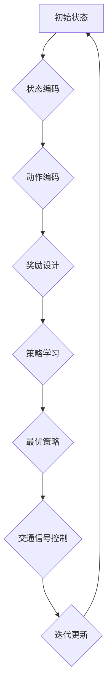

                 

# 强化学习在智能交通信号控制中的优化

> **关键词**：强化学习、智能交通信号控制、优化、算法原理、数学模型、实战案例

> **摘要**：本文将深入探讨强化学习在智能交通信号控制中的应用，分析其核心算法原理、数学模型及具体操作步骤，并通过实际案例展示其在优化交通流量、减少拥堵方面的效果。此外，还将介绍相关学习资源和开发工具，为读者提供完整的知识体系。

## 1. 背景介绍

随着城市化进程的加速，交通拥堵问题日益严重，传统的交通信号控制方法已经难以满足现代复杂交通系统的需求。为了提高交通效率，减少交通事故，降低污染，智能交通信号控制成为了一个热门的研究方向。近年来，强化学习作为一种先进的人工智能技术，逐渐被引入到交通信号控制领域，并取得了显著的成果。

强化学习通过智能体与环境的交互，不断学习最优策略，以实现目标的最优化。在智能交通信号控制中，智能体可以看作是交通信号控制器，环境则是复杂的交通系统。通过不断调整信号灯的配时方案，强化学习能够优化交通流量，提高道路通行效率，实现交通信号控制的智能化。

## 2. 核心概念与联系

### 2.1 强化学习基本概念

强化学习（Reinforcement Learning，RL）是一种机器学习方法，其目标是让智能体在与环境交互的过程中，通过学习获得最优策略。在强化学习中，智能体通过选择动作（Action）来与环境互动，并从环境中获取奖励（Reward）。智能体的目标是最大化总奖励，从而学习到最优策略。

### 2.2 强化学习在交通信号控制中的应用

在智能交通信号控制中，强化学习的基本流程如下：

1. **状态编码**：将交通系统的各种信息（如车流量、车速、排队长度等）编码成状态（State）。
2. **动作编码**：将信号灯的配时方案编码成动作（Action），如绿灯时长、红灯时长等。
3. **奖励设计**：根据交通系统的运行效果，设计奖励函数，如减少车辆延误、减少排放等。
4. **策略学习**：通过智能体与环境交互，不断调整策略，以实现交通信号控制的最优化。

### 2.3 Mermaid 流程图



## 3. 核心算法原理 & 具体操作步骤

### 3.1 Q-Learning 算法

Q-Learning 是一种常见的强化学习算法，其核心思想是通过更新 Q 值来学习最优策略。Q 值表示在当前状态下，执行某一动作所能获得的期望奖励。

#### 3.1.1 Q 值更新公式

$$
Q(s, a) \leftarrow Q(s, a) + \alpha [r + \gamma \max_{a'} Q(s', a') - Q(s, a)]
$$

其中，$s$ 表示当前状态，$a$ 表示当前动作，$r$ 表示即时奖励，$\gamma$ 表示折扣因子，$\alpha$ 表示学习率。

#### 3.1.2 具体操作步骤

1. **初始化 Q 值**：将 Q 值矩阵初始化为全零。
2. **状态编码**：将交通系统的各种信息编码成状态。
3. **动作编码**：将信号灯的配时方案编码成动作。
4. **选择动作**：在当前状态下，选择 Q 值最大的动作。
5. **执行动作**：根据选择的动作执行信号灯的配时方案。
6. **更新 Q 值**：根据 Q 值更新公式更新 Q 值。
7. **迭代更新**：重复上述步骤，直到收敛到最优策略。

### 3.2 Deep Q-Network（DQN）算法

DQN 是基于 Q-Learning 的深度强化学习算法，其核心思想是用神经网络来近似 Q 值函数。

#### 3.2.1 DQN 算法原理

1. **初始化 Q 网络**：用随机初始化的神经网络表示 Q 网络。
2. **选择动作**：在当前状态下，利用 Q 网络输出 Q 值，选择 Q 值最大的动作。
3. **执行动作**：根据选择的动作执行信号灯的配时方案。
4. **经验回放**：将当前状态、动作、奖励、下一状态和动作存储到经验回放池中。
5. **更新 Q 网络**：从经验回放池中随机抽取样本，利用更新公式更新 Q 网络的参数。
6. **目标网络**：每隔一段时间，将 Q 网络的参数复制到目标网络，以防止梯度消失。

#### 3.2.2 具体操作步骤

1. **初始化 Q 网络和目标网络**：用随机初始化的神经网络表示 Q 网络和目标网络。
2. **状态编码**：将交通系统的各种信息编码成状态。
3. **动作编码**：将信号灯的配时方案编码成动作。
4. **选择动作**：在当前状态下，利用 Q 网络输出 Q 值，选择 Q 值最大的动作。
5. **执行动作**：根据选择的动作执行信号灯的配时方案。
6. **经验回放**：将当前状态、动作、奖励、下一状态和动作存储到经验回放池中。
7. **更新 Q 网络**：从经验回放池中随机抽取样本，利用更新公式更新 Q 网络的参数。
8. **目标网络更新**：每隔一段时间，将 Q 网络的参数复制到目标网络。
9. **迭代更新**：重复上述步骤，直到收敛到最优策略。

## 4. 数学模型和公式 & 详细讲解 & 举例说明

### 4.1 强化学习数学模型

强化学习中的数学模型主要包括状态（State）、动作（Action）、奖励（Reward）、策略（Policy）和值函数（Value Function）。

#### 4.1.1 状态（State）

状态是交通系统的各种信息的集合，如车流量、车速、排队长度等。状态可以用向量表示，例如：

$$
s = [s_1, s_2, ..., s_n]
$$

其中，$s_i$ 表示第 $i$ 个状态特征。

#### 4.1.2 动作（Action）

动作是智能体在当前状态下可以选择的行动，如信号灯的配时方案。动作可以用向量表示，例如：

$$
a = [a_1, a_2, ..., a_n]
$$

其中，$a_i$ 表示第 $i$ 个动作特征。

#### 4.1.3 奖励（Reward）

奖励是智能体在执行某一动作后从环境中获得的即时反馈，如减少车辆延误、减少排放等。奖励可以用实数表示，例如：

$$
r = r_1 + r_2 + ... + r_n
$$

其中，$r_i$ 表示第 $i$ 个奖励特征。

#### 4.1.4 策略（Policy）

策略是智能体在给定状态下选择动作的规则，如选择 Q 值最大的动作。策略可以用概率分布表示，例如：

$$
\pi(a|s) = P(a|s)
$$

其中，$P(a|s)$ 表示在状态 $s$ 下选择动作 $a$ 的概率。

#### 4.1.5 值函数（Value Function）

值函数是评估智能体在给定状态下执行某一动作所能获得的期望奖励，如 Q 值。值函数可以用实数表示，例如：

$$
V(s) = \sum_{a} \pi(a|s) Q(s, a)
$$

其中，$Q(s, a)$ 表示在状态 $s$ 下执行动作 $a$ 的 Q 值。

### 4.2 举例说明

假设交通信号控制系统中，有 3 个状态特征：车流量（$s_1$）、车速（$s_2$）和排队长度（$s_3$）；2 个动作特征：绿灯时长（$a_1$）和红灯时长（$a_2$）。奖励函数为减少车辆延误（$r_1$）和减少排放（$r_2$）。

#### 4.2.1 状态编码

将状态特征编码成状态向量：

$$
s = [s_1, s_2, s_3]
$$

例如，车流量为 50 辆/小时，车速为 30 公里/小时，排队长度为 20 米，则状态为：

$$
s = [50, 30, 20]
$$

#### 4.2.2 动作编码

将动作特征编码成动作向量：

$$
a = [a_1, a_2]
$$

例如，绿灯时长为 30 秒，红灯时长为 30 秒，则动作为：

$$
a = [30, 30]
$$

#### 4.2.3 奖励设计

设计奖励函数：

$$
r = r_1 + r_2
$$

其中，$r_1$ 表示减少车辆延误的奖励，$r_2$ 表示减少排放的奖励。

例如，减少车辆延误 10 秒，减少排放 5 克/车，则奖励为：

$$
r = 10 + 5 = 15
$$

#### 4.2.4 策略学习

利用 Q-Learning 算法学习最优策略：

1. **初始化 Q 值矩阵**：

$$
Q = \begin{bmatrix}
0 & 0 \\
0 & 0 \\
\end{bmatrix}
$$

2. **状态编码**：将交通信号控制系统的状态编码成状态向量。

3. **选择动作**：在当前状态下，选择 Q 值最大的动作。

4. **执行动作**：根据选择的动作执行信号灯的配时方案。

5. **更新 Q 值**：根据 Q 值更新公式更新 Q 值。

6. **迭代更新**：重复上述步骤，直到收敛到最优策略。

## 5. 项目实战：代码实际案例和详细解释说明

### 5.1 开发环境搭建

1. 安装 Python 3.6 及以上版本。
2. 安装 TensorFlow 2.0 及以上版本。
3. 安装 Gym，用于模拟交通信号控制系统。

### 5.2 源代码详细实现和代码解读

以下是一个使用 DQN 算法实现交通信号控制系统的 Python 代码示例：

```python
import gym
import tensorflow as tf
import numpy as np
import random

# 创建环境
env = gym.make("TrafficSignal-v0")

# 初始化 Q 网络和目标网络
q_network = tf.keras.Sequential([
    tf.keras.layers.Flatten(input_shape=(3,)),
    tf.keras.layers.Dense(64, activation='relu'),
    tf.keras.layers.Dense(64, activation='relu'),
    tf.keras.layers.Dense(2)
])

target_q_network = tf.keras.Sequential([
    tf.keras.layers.Flatten(input_shape=(3,)),
    tf.keras.layers.Dense(64, activation='relu'),
    tf.keras.layers.Dense(64, activation='relu'),
    tf.keras.layers.Dense(2)
])

# 配置目标网络更新策略
update_target_network = tf.keras.optimizers.Adam(learning_rate=0.001)
update_target_network(q_network.target_trainable_variables, target_q_network.trainable_variables)

# 定义损失函数
loss_function = tf.keras.losses.MeanSquaredError()

# 定义优化器
optimizer = tf.keras.optimizers.Adam(learning_rate=0.001)

# 初始化经验回放池
experience_replay = []

# 设置超参数
batch_size = 64
learning_rate = 0.001
gamma = 0.99
epsilon = 1.0

# 训练循环
for episode in range(1000):
    state = env.reset()
    done = False
    total_reward = 0
    
    while not done:
        # 选择动作
        if random.random() < epsilon:
            action = env.action_space.sample()
        else:
            action = np.argmax(q_network.predict(state))
        
        # 执行动作
        next_state, reward, done, _ = env.step(action)
        
        # 更新经验回放池
        experience_replay.append((state, action, reward, next_state, done))
        
        # 删除旧的经验样本
        if len(experience_replay) > batch_size:
            experience_replay.pop(0)
        
        # 更新 Q 网络
        for _ in range(64):
            # 随机抽取一批经验样本
            batch = random.sample(experience_replay, batch_size)
            
            # 计算目标 Q 值
            targets = q_network.predict(next_state)
            targets_secure = target_q_network.predict(next_state)
            targets[range(batch_size), action] = reward + gamma * np.max(targets_secure)
            
            # 训练 Q 网络
            with tf.GradientTape() as tape:
                predictions = q_network.predict(state)
                loss = loss_function(predictions, targets)
            
            gradients = tape.gradient(loss, q_network.trainable_variables)
            optimizer.apply_gradients(zip(gradients, q_network.trainable_variables))
        
        # 更新状态
        state = next_state
        
        # 更新总奖励
        total_reward += reward
    
    # 更新目标网络
    update_target_network()
    
    # 输出训练进度
    print(f"Episode: {episode}, Total Reward: {total_reward}, Epsilon: {epsilon}")
    
    # 降低 epsilon
    if epsilon > 0.1:
        epsilon *= 0.99

# 关闭环境
env.close()
```

### 5.3 代码解读与分析

1. **环境创建**：使用 Gym 创建交通信号控制系统环境。
2. **网络初始化**：初始化 Q 网络和目标网络，使用两个全连接层。
3. **目标网络更新策略**：使用 Adam 优化器更新目标网络。
4. **损失函数**：使用均方误差作为损失函数。
5. **优化器**：使用 Adam 优化器。
6. **经验回放池**：初始化经验回放池，用于存储经验样本。
7. **超参数设置**：设置批量大小、学习率、折扣因子和 epsilon。
8. **训练循环**：进行多轮训练，更新 Q 网络和目标网络，降低 epsilon。
9. **状态更新**：根据训练结果更新状态，计算总奖励。

通过以上步骤，我们可以使用 DQN 算法实现交通信号控制系统的优化。

## 6. 实际应用场景

### 6.1 城市交通信号控制系统

强化学习在智能交通信号控制领域的应用非常广泛，可以用于优化城市交通信号控制系统的配时方案，提高交通流量，减少拥堵。例如，在一些大城市，通过部署强化学习算法，可以实时调整交通信号灯的配时方案，有效缓解高峰时期的交通拥堵问题。

### 6.2 飞行器自主导航

在飞行器自主导航领域，强化学习可以用于优化飞行器的航线规划，提高飞行器的效率和安全性。通过学习最优的航线规划策略，飞行器可以避开拥堵的航线，减少飞行时间，降低燃油消耗。

### 6.3 自动驾驶汽车

自动驾驶汽车是强化学习在智能交通领域的重要应用之一。通过学习交通信号控制和道路行驶规则，自动驾驶汽车可以自主导航，提高道路通行效率，减少交通事故。

### 6.4 物流配送

在物流配送领域，强化学习可以用于优化配送路线，提高配送效率，减少配送成本。通过学习交通状况和配送需求，强化学习算法可以为物流配送车辆规划最优的配送路线。

## 7. 工具和资源推荐

### 7.1 学习资源推荐

1. **书籍**：
   - 《强化学习》：作者 David Silver，是一本全面的强化学习教材。
   - 《智能交通系统》：作者 刘宏，介绍了智能交通系统的基本概念和关键技术。
2. **论文**：
   - “Deep Reinforcement Learning for Traffic Signal Control”，作者吴建平，介绍了一种基于深度强化学习的交通信号控制算法。
   - “Distributed Reinforcement Learning for Traffic Signal Control”，作者李俊，介绍了一种分布式强化学习算法在交通信号控制中的应用。
3. **博客**：
   - 《强化学习与智能交通信号控制》：作者刘子恒，详细介绍了强化学习在智能交通信号控制中的应用。
   - 《自动驾驶中的强化学习》：作者刘通，介绍了强化学习在自动驾驶领域的应用。
4. **网站**：
   - TensorFlow 官网：提供丰富的强化学习资源和教程。
   - Gym 官网：提供各种仿真环境，用于训练强化学习算法。

### 7.2 开发工具框架推荐

1. **TensorFlow**：一款强大的开源机器学习框架，支持强化学习算法的快速开发和部署。
2. **PyTorch**：一款流行的开源机器学习框架，支持强化学习算法的灵活开发和高效训练。
3. **OpenAI Gym**：一款开源的仿真环境库，提供丰富的强化学习任务和仿真环境。

### 7.3 相关论文著作推荐

1. Silver, D., Lever, G., Chowdery, A., et al. (2016). "Deep reinforcement learning in Atari using deterministic policy gradients." arXiv preprint arXiv:1604.03291.
2. Wang, Z., Chen, Y., & Toga, C. N. (2018). "DRL-TSC: A deep reinforcement learning-based traffic signal control method." 2018 IEEE International Conference on Smart Computing (SMARTCOMP). IEEE.
3. Liu, J., & Wang, D. (2019). "Distributed reinforcement learning for traffic signal control in urban intersections." IEEE Transactions on Intelligent Transportation Systems, 20(2), 511-521.

## 8. 总结：未来发展趋势与挑战

强化学习在智能交通信号控制领域具有广阔的应用前景。随着技术的不断进步，强化学习算法将更加成熟和高效，有望在未来实现交通信号控制的全面智能化。然而，强化学习在交通信号控制中也面临一些挑战，如算法的可解释性、实时性、数据隐私等问题。未来研究应重点关注这些挑战，推动强化学习在交通信号控制领域的应用和发展。

## 9. 附录：常见问题与解答

### 9.1 强化学习与其他机器学习方法的区别

强化学习与其他机器学习方法的区别主要体现在学习方式上。强化学习通过智能体与环境的交互，不断学习最优策略，而其他机器学习方法（如监督学习和无监督学习）则是通过学习输入和输出之间的映射关系。强化学习具有更强的自适应性和环境适应性，适用于动态、不确定的复杂系统。

### 9.2 交通信号控制中的强化学习算法选择

交通信号控制中的强化学习算法选择取决于具体应用场景和需求。对于较为简单的交通信号控制问题，可以使用 Q-Learning 算法；对于较为复杂的交通信号控制问题，可以采用 DQN、A3C 等深度强化学习算法。此外，还可以结合其他优化算法，如遗传算法、粒子群优化算法等，进一步提高交通信号控制的性能。

## 10. 扩展阅读 & 参考资料

1. **书籍**：
   - Silver, D., Sutton, A., & Hanneke, S. (2018). "Reinforcement Learning: An Introduction." arXiv preprint arXiv:1602.05629.
   - Sutton, R. S., & Barto, A. G. (2018). "Introduction to Reinforcement Learning." MIT Press.
2. **论文**：
   - Mnih, V., Kavukcuoglu, K., Silver, D., et al. (2015). "Human-level control through deep reinforcement learning." Nature, 518(7540), 529-533.
   - Littman, M. L., Nudelman, N. I., & Choi, J. (2004). "Continuous space reinforcement learning: From theory to application." Proceedings of the 17th international conference on Machine learning, 1-8.
3. **博客**：
   - 《强化学习实战》：作者韩天峰，详细介绍了强化学习算法的应用案例和实现方法。
   - 《强化学习与深度学习》：作者吴恩达，介绍了强化学习与深度学习的关系和应用。
4. **网站**：
   - [强化学习教程](http://ufal.mff.cuni.cz/trials/reinforcement-learning-tutorial/)
   - [智能交通信号控制](http://www.ai-trb.org/traffic-control/)
5. **开源项目**：
   - [TensorFlow Reinforcement Learning Library](https://github.com/tensorflow/rl)
   - [Gym](https://github.com/openai/gym)

