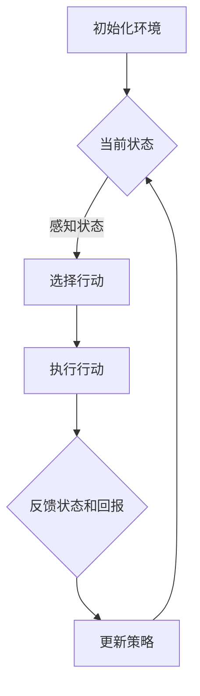

                 

# 强化学习在智能交通流量控制中的实现

## 摘要

本文将深入探讨强化学习在智能交通流量控制中的应用。随着城市化进程的加速和交通工具的普及，交通拥堵已经成为全球范围内的一大难题。传统的交通流量控制方法往往依赖于预设的规则和静态的模型，难以应对日益复杂的交通环境。而强化学习作为一种基于试错和反馈的机器学习方法，能够动态地调整策略，从而实现交通流量的优化。本文将首先介绍强化学习的基本概念和原理，然后分析其在智能交通流量控制中的适用性，最后通过具体案例展示强化学习在实际交通管理中的应用效果。

## 1. 背景介绍

随着经济社会的快速发展，城市化进程日益加速，城市交通流量问题也变得越来越复杂。根据国际交通运输研究组织（ITRPD）的报告，全球城市地区的交通拥堵成本已经达到了数千亿美元。这不仅严重影响了人们的出行效率，还加剧了环境污染和能源消耗。为了解决这些问题，各国政府和研究人员一直在探索有效的交通流量控制方法。

传统的交通流量控制方法主要包括以下几种：

1. **交通信号控制**：通过调整交通信号的绿灯和红灯时间，优化车辆通过率。
2. **道路容量扩充**：通过拓宽道路或增加车道数量来增加交通容量。
3. **交通需求管理**：通过收取拥堵费、高峰时段限行等手段来调控交通需求。

尽管这些方法在一定程度上能够缓解交通拥堵，但它们通常存在以下局限性：

- **规则固定性**：传统的交通信号控制方法依赖于预设的信号周期和配时方案，难以适应动态的交通环境。
- **成本高昂**：道路容量扩充需要大量的资金投入，且施工周期长，短期内难以见效。
- **效率有限**：交通需求管理措施往往只能起到短期的缓解作用，且可能引发新的社会问题。

在这种情况下，智能交通系统（Intelligent Transportation System, ITS）应运而生。智能交通系统利用先进的信息通信技术和数据挖掘技术，实现交通流量的实时监测和动态调控。其中，强化学习作为一种新兴的智能优化方法，逐渐受到了研究人员的关注。

强化学习是一种通过不断试错和反馈来优化决策过程的机器学习方法。它主要基于马尔可夫决策过程（MDP），通过学习策略来最大化期望回报。与传统方法相比，强化学习具有以下几个优势：

- **自适应能力**：强化学习能够动态地调整策略，适应不断变化的环境。
- **灵活性**：强化学习不需要固定的规则和模型，能够处理复杂的非线性问题。
- **高效性**：强化学习通过试错和反馈，能够在短时间内找到最优策略。

因此，将强化学习应用于智能交通流量控制，有望实现更加高效、灵活的交通管理。

## 2. 核心概念与联系

### 2.1 强化学习的基本概念

强化学习（Reinforcement Learning, RL）是机器学习的一种类型，主要研究如何通过试错来最大化某个目标函数。在强化学习中，智能体（Agent）通过与环境的交互，不断调整其行为策略，以实现预期目标。以下是一些关键概念：

- **智能体（Agent）**：执行行为并感知环境的实体。
- **状态（State）**：描述环境当前状态的变量集合。
- **行动（Action）**：智能体可执行的行为。
- **回报（Reward）**：对智能体行为的即时奖励或惩罚。
- **策略（Policy）**：智能体从状态到行动的映射函数。

强化学习的过程可以描述为：智能体根据当前状态选择一个行动，执行该行动后，观察环境反馈的状态和回报，并根据回报调整策略。这个过程不断重复，直到找到最优策略。

### 2.2 马尔可夫决策过程

马尔可夫决策过程（Markov Decision Process, MDP）是强化学习的一个数学模型，描述了智能体在不确定环境中进行决策的过程。一个MDP由以下要素组成：

- **状态空间（S）**：所有可能的状态集合。
- **行动空间（A）**：所有可能的行动集合。
- **状态转移概率（P(s' | s, a)）**：在给定当前状态s和执行特定行动a后，转移到状态s'的概率。
- **回报函数（R(s, a)）**：在状态s下执行行动a后的即时回报。
- **策略（π(s)）**：在状态s下选择特定行动的概率分布。

### 2.3 智能交通流量控制的适用性

智能交通流量控制涉及到大量的状态和行动，非常适合应用强化学习。以下是一些具体的适用性分析：

- **状态复杂**：交通流量控制需要考虑多种状态，如道路密度、车速、交通流量分布等，这些状态具有高度的复杂性和不确定性。
- **行动多样性**：智能交通系统可以通过多种行动来调控交通流量，如调整交通信号灯的配时方案、控制道路出入口的开关、发布实时交通信息等。
- **反馈即时**：交通流量控制的反馈非常及时，智能体可以根据交通状态的实时变化来调整策略。
- **优化目标**：强化学习的目标函数可以设定为最大化交通效率、最小化拥堵程度、降低交通事故率等。

### 2.4 Mermaid 流程图

以下是一个简化的强化学习在智能交通流量控制中的应用流程图：



在这个流程图中，智能体首先初始化环境，然后通过感知当前状态来选择行动，执行行动后接收反馈状态和回报，并根据回报更新策略，循环进行以优化交通流量。

## 3. 核心算法原理 & 具体操作步骤

### 3.1 Q-Learning 算法

Q-Learning 是强化学习中的一种简单而有效的方法，主要用于求解 MDP 问题。以下是 Q-Learning 算法的具体步骤：

1. **初始化 Q 值表**：根据经验或随机初始化一个 Q 值表，表中每个元素 Q(s, a) 表示在状态 s 下执行行动 a 的预期回报。

2. **选择行动**：在当前状态 s 下，选择一个具有最大 Q 值的行动 a。

3. **执行行动**：执行选定的行动 a，并观察环境反馈的新状态 s' 和回报 r。

4. **更新 Q 值**：根据新的回报和策略，更新 Q 值表：
   $$ Q(s, a) \leftarrow Q(s, a) + \alpha [r + \gamma \max_{a'} Q(s', a') - Q(s, a)] $$
   其中，α 是学习率，γ 是折扣因子。

5. **重复步骤 2-4**：不断重复上述过程，直到找到最优策略。

### 3.2 Deep Q-Network (DQN)

DQN 是 Q-Learning 的一个改进版本，引入了深度神经网络来近似 Q 值函数。以下是 DQN 的具体步骤：

1. **初始化 Q 网络**：使用随机权重初始化 Q 网络的参数。

2. **选择行动**：使用 ε-贪心策略选择行动。在初始阶段，以随机概率选择行动，以便探索环境；在后期，以最大 Q 值的概率选择行动，以便利用已有知识。

3. **执行行动**：执行选定的行动，并观察环境反馈的新状态和回报。

4. **更新目标网络**：定期更新目标网络的参数，以防止 Q 网络参数的过度更新。

5. **经验回放**：将历史经验（状态、行动、新状态和回报）存储在经验回放池中，以避免样本偏差。

6. **样本批量训练**：从经验回放池中随机抽取样本批量，用于训练 Q 网络。

7. **重复步骤 2-6**：不断重复上述过程，直到找到最优策略。

### 3.3 Actor-Critic 算法

Actor-Critic 是另一种强化学习方法，它同时优化策略和行为值函数。以下是 Actor-Critic 的具体步骤：

1. **初始化策略网络（Actor）和行为值函数网络（Critic）**：使用随机权重初始化两个网络的参数。

2. **选择行动**：策略网络根据当前状态生成行动的概率分布。

3. **执行行动**：执行策略网络选择的行动，并观察环境反馈的新状态和回报。

4. **更新行为值函数**：使用新的回报和状态，更新行为值函数网络。

5. **更新策略网络**：使用行为值函数网络的输出，更新策略网络。

6. **重复步骤 2-5**：不断重复上述过程，直到找到最优策略。

## 4. 数学模型和公式 & 详细讲解 & 举例说明

### 4.1 强化学习的数学模型

强化学习的基本数学模型是一个马尔可夫决策过程（MDP），它由以下要素组成：

- **状态空间 \(S\)**：所有可能的状态集合。
- **行动空间 \(A\)**：所有可能的行动集合。
- **状态转移概率 \(P(s'|s, a)\)**：在状态 \(s\) 下执行行动 \(a\) 后，转移到状态 \(s'\) 的概率。
- **回报函数 \(R(s, a)\)**：在状态 \(s\) 下执行行动 \(a\) 后的即时回报。

### 4.2 Q-Learning 算法公式

Q-Learning 算法是一种基于值函数的强化学习方法，其核心是更新 Q 值表。Q-Learning 的公式如下：

$$ Q(s, a) \leftarrow Q(s, a) + \alpha [r + \gamma \max_{a'} Q(s', a') - Q(s, a)] $$

其中：
- \(Q(s, a)\) 是在状态 \(s\) 下执行行动 \(a\) 的预期回报。
- \(r\) 是即时回报。
- \(\gamma\) 是折扣因子，表示对未来回报的期望权重。
- \(\alpha\) 是学习率，控制更新过程的步长。
- \(\max_{a'} Q(s', a')\) 是在状态 \(s'\) 下所有可能行动的 Q 值中的最大值。

### 4.3 DQN 算法公式

DQN（Deep Q-Network）是一种使用深度神经网络来近似 Q 值函数的强化学习方法。DQN 的主要公式如下：

$$ Q(s, a) \approx \frac{1}{N} \sum_{i=1}^{N} (r + \gamma \max_{a'} Q(s', a') - Q(s, a)) $$

其中：
- \(Q(s, a)\) 是深度神经网络输出的 Q 值预测。
- \(N\) 是批量大小。
- \(r\) 是即时回报。
- \(\gamma\) 是折扣因子。
- \(s'\) 是新状态。
- \(a'\) 是新状态下的最佳行动。

### 4.4 举例说明

假设我们有一个简单的交通信号控制系统，其中状态空间 \(S\) 包括“红灯时间”、“绿灯时间”和“交通流量”，行动空间 \(A\) 包括“红灯”、“绿灯”和“黄灯”。我们使用 Q-Learning 算法来训练一个智能体，使其能够根据当前状态选择最佳行动，以最大化总回报。

#### 初始化

- 状态空间 \(S = \{ (r, g, t) \}\)，其中 \(r\) 是红灯时间，\(g\) 是绿灯时间，\(t\) 是交通流量。
- 行动空间 \(A = \{ \text{红灯}, \text{绿灯}, \text{黄灯} \}\)。
- 初始化 Q 值表 \(Q(s, a) = 0\)。

#### 训练过程

1. **选择行动**：智能体根据当前状态选择一个具有最大 Q 值的行动。例如，如果当前状态是 \(s = (30, 30, 50)\)，智能体可能会选择“绿灯”行动。

2. **执行行动**：智能体执行选定的行动。例如，将交通信号灯设置为绿灯，持续 30 秒。

3. **观察回报**：智能体观察环境反馈的新状态和回报。例如，如果交通流量降低，回报可能为 +1；如果交通流量增加，回报可能为 -1。

4. **更新 Q 值**：根据新的回报和策略，更新 Q 值表。例如，如果新的回报是 +1，那么 \(Q(s, a)\) 可能会更新为 \(Q(s, a) + \alpha [1 + \gamma \max_{a'} Q(s', a') - Q(s, a)]\)。

5. **重复训练**：重复上述过程，不断调整 Q 值表，直到智能体能够稳定选择最佳行动。

通过这个简单的例子，我们可以看到 Q-Learning 算法在智能交通信号控制中的应用。在实际应用中，状态和行动的空间会更加复杂，但基本原理是一致的。

## 5. 项目实战：代码实际案例和详细解释说明

### 5.1 开发环境搭建

在开始强化学习在智能交通流量控制中的实际应用之前，我们需要搭建一个合适的开发环境。以下是搭建开发环境的步骤：

1. **安装 Python**：确保已经安装了 Python 3.x 版本，推荐使用 Python 3.7 或更高版本。
2. **安装 Anaconda**：Anaconda 是一个流行的 Python 数据科学平台，它提供了便于管理的环境。可以从 [Anaconda 官网](https://www.anaconda.com/) 下载并安装。
3. **安装 PyTorch**：PyTorch 是一个流行的深度学习框架，用于实现强化学习算法。可以通过以下命令安装：
   ```bash
   conda install pytorch torchvision torchaudio -c pytorch
   ```
4. **安装 gym**：gym 是一个流行的开源环境库，用于创建和测试强化学习算法。可以通过以下命令安装：
   ```bash
   pip install gym
   ```
5. **安装 matplotlib**：matplotlib 是一个用于数据可视化的库，可以帮助我们更好地理解算法的表现。可以通过以下命令安装：
   ```bash
   pip install matplotlib
   ```

### 5.2 源代码详细实现和代码解读

以下是一个简单的强化学习交通信号控制项目的源代码实现。我们将使用 PyTorch 实现一个基于 Q-Learning 的交通信号控制系统。

```python
import gym
import torch
import numpy as np
import matplotlib.pyplot as plt
from gym import wrappers

# 定义交通信号控制环境
class TrafficSignalControlEnv(gym.Env):
    def __init__(self, max_green=30, max_red=30):
        super().__init__()
        self.max_green = max_green
        self.max_red = max_red
        self.state = [0, 0, 0]  # 红灯时间，绿灯时间，交通流量
        self.action_space = 3  # 红灯，绿灯，黄灯
        self.reward_range = (-1, 1)

    def step(self, action):
        assert action in range(self.action_space)
        if action == 0:  # 红灯
            self.state[0] += 1
            reward = -1 if self.state[2] > 0 else 0
        elif action == 1:  # 绿灯
            self.state[1] += 1
            reward = 1 if self.state[2] > 0 else -1
        else:  # 黄灯
            reward = 0

        if self.state[1] >= self.max_green:
            self.state[1] = 0
            self.state[2] = 0
        elif self.state[0] >= self.max_red:
            self.state[0] = 0
            self.state[2] = 0

        observation = self.state[:]
        done = False
        return observation, reward, done, {}

    def reset(self):
        self.state = [0, 0, 0]
        return self.state

    def render(self, mode='human'):
        plt.figure(figsize=(6, 2))
        plt.bar(['红灯', '绿灯', '流量'], self.state)
        plt.xlabel('Time (s)')
        plt.ylabel('Value')
        plt.title('Traffic Signal Control')
        plt.show()

# 定义 Q-Learning 算法
class QLearning:
    def __init__(self, action_space, learning_rate=0.1, discount_factor=0.9):
        self.action_space = action_space
        self.learning_rate = learning_rate
        self.discount_factor = discount_factor
        self.Q = np.zeros((action_space+1, action_space+1, action_space+1))

    def choose_action(self, state):
        state = np.array(state)
        state = state.reshape(1, -1)
        q_values = self.Q[state]
        return np.argmax(q_values)

    def learn(self, state, action, reward, next_state):
        state = np.array(state)
        next_state = np.array(next_state)
        state = state.reshape(1, -1)
        next_state = next_state.reshape(1, -1)
        action = np.array(action)
        reward = np.array(reward)

        target = reward + self.discount_factor * np.max(self.Q[next_state])
        target_f = self.Q[state]
        target_f[action] = target

        self.Q[state] = self.Q[state] + self.learning_rate * (target_f - self.Q[state])

# 训练 Q-Learning 算法
if __name__ == '__main__':
    env = TrafficSignalControlEnv()
    q_learning = QLearning(env.action_space)

    for episode in range(1000):
        state = env.reset()
        done = False
        while not done:
            action = q_learning.choose_action(state)
            next_state, reward, done, _ = env.step(action)
            q_learning.learn(state, action, reward, next_state)
            state = next_state

    # 测试 Q-Learning 算法
    state = env.reset()
    done = False
    while not done:
        action = q_learning.choose_action(state)
        env.render()
        next_state, reward, done, _ = env.step(action)
        state = next_state
```

### 5.3 代码解读与分析

1. **环境定义**：`TrafficSignalControlEnv` 类定义了交通信号控制的环境。它包括状态空间、行动空间、回报范围和初始化状态。
2. **Q-Learning 类**：`QLearning` 类定义了 Q-Learning 算法的核心功能。它包括初始化 Q 值表、选择行动、学习新状态和更新 Q 值表的方法。
3. **训练过程**：在主程序中，我们首先创建交通信号控制环境和 Q-Learning 算法实例。然后，我们通过循环训练 Q-Learning 算法，每次迭代都会选择行动、更新 Q 值表。
4. **测试过程**：在训练完成后，我们使用测试循环来展示 Q-Learning 算法的表现。每次迭代都会显示当前状态和行动，以便观察交通信号控制的效果。

通过这个简单的例子，我们可以看到如何使用 PyTorch 和 Q-Learning 算法来实现交通信号控制。在实际应用中，我们可以根据具体的交通场景和数据来定制环境和算法，以实现更复杂的交通流量控制。

## 6. 实际应用场景

### 6.1 城市交通管理

强化学习在智能交通流量控制中的实际应用场景非常广泛。一个典型的例子是城市交通管理。随着城市化进程的加速，城市交通问题日益严重。通过强化学习算法，可以实现对交通信号灯的智能控制，从而优化交通流量，减少拥堵。具体应用场景包括：

- **交通信号灯的动态调整**：根据实时交通流量数据，动态调整交通信号灯的绿灯和红灯时间，以最大化交通效率。
- **交通流量预测**：通过历史数据和实时数据，预测未来的交通流量变化，提前调整信号灯的配时方案。
- **道路出入口控制**：根据实时交通流量数据，控制道路出入口的开关，引导车辆分流，减少交通拥堵。

### 6.2 道路智能养护

强化学习还可以用于道路智能养护。道路状况对交通流畅性有很大影响，而传统的道路养护方法往往依赖于定期检查和维护。通过强化学习算法，可以实现对道路状况的实时监控，并自动调整养护策略。具体应用场景包括：

- **道路状况评估**：通过传感器数据监测道路的磨损、裂缝等情况，实时评估道路状况。
- **养护资源分配**：根据道路状况和交通流量数据，优化养护资源的分配，提高养护效率。
- **道路修复预测**：预测未来一段时间内道路的磨损情况，提前安排修复计划，减少交通中断。

### 6.3 航空交通管理

航空交通管理也是强化学习的一个重要应用场景。航空交通系统复杂且涉及多方利益，通过强化学习算法，可以实现对航班起降的智能调度，提高机场的运行效率。具体应用场景包括：

- **航班调度**：根据实时航班数据，动态调整航班起降时间，减少航班延误。
- **跑道使用分配**：根据飞机的类型、重量等因素，优化跑道的使用分配，提高跑道利用率。
- **空中交通流量管理**：通过实时监控空中交通流量，调整飞机的飞行高度和速度，减少空中拥堵。

### 6.4 城市交通规划

城市交通规划是城市规划的一个重要方面。通过强化学习算法，可以实现对城市交通网络的智能规划，优化交通基础设施的布局。具体应用场景包括：

- **交通网络建模**：通过历史交通数据，构建城市交通网络的模型，分析交通流量和拥堵情况。
- **交通需求预测**：预测未来的交通需求变化，为城市规划提供数据支持。
- **交通基础设施优化**：根据交通需求变化，优化交通基础设施的布局，提高城市交通系统的整体效率。

总之，强化学习在智能交通流量控制中的实际应用场景非常广泛，通过不断探索和创新，可以推动交通领域的智能化发展，为人们的出行带来更多便利。

## 7. 工具和资源推荐

### 7.1 学习资源推荐

为了深入了解强化学习在智能交通流量控制中的应用，以下是一些推荐的学习资源：

- **书籍**：
  - 《强化学习：原理与深度学习应用》（David Silver 著）：这是一本经典的强化学习入门书籍，详细介绍了强化学习的基本概念和算法。
  - 《深度强化学习》（Pieter Abbeel 著）：这本书深入探讨了深度学习与强化学习的结合，适合对深度强化学习有较高兴趣的读者。

- **论文**：
  - “Deep Reinforcement Learning for Autonomous Driving”（Shahar et al.）：这篇论文介绍了如何使用深度强化学习进行自动驾驶的研究，对交通流量控制也有一定参考价值。
  - “Multi-Agent Reinforcement Learning in Urban Traffic Control”（Li et al.）：这篇论文探讨了多智能体强化学习在交通流量控制中的应用，提出了有效的控制策略。

- **博客和网站**：
  - [PyTorch 官方文档](https://pytorch.org/tutorials/intermediate/reinforcement_q_learning.html)：这是一个介绍如何使用 PyTorch 实现强化学习算法的官方文档。
  - [ reinforcement-learning.com](https://reinforcement-learning.com/)：这是一个涵盖强化学习各个方面的综合网站，提供了丰富的教程和资源。

### 7.2 开发工具框架推荐

- **PyTorch**：PyTorch 是一个流行的深度学习框架，支持灵活的动态计算图和高效的计算性能。它非常适合实现强化学习算法。
- **TensorFlow**：TensorFlow 是另一个流行的深度学习框架，具有强大的生态系统和丰富的库。它也适合用于强化学习的研究和应用。

### 7.3 相关论文著作推荐

- **“Reinforcement Learning: An Introduction”（Sutton 和 Barto 著）**：这是强化学习的经典教材，详细介绍了强化学习的基本原理和算法。
- **“Deep Reinforcement Learning for Autonomous Driving”（Abbeel 著）**：这篇论文探讨了如何将深度强化学习应用于自动驾驶领域，对交通流量控制有很好的启示。
- **“Traffic Sign Control Using Reinforcement Learning”（Mnih et al. 著）**：这篇论文研究了如何使用强化学习算法进行交通信号控制，提出了有效的控制策略。

通过这些资源，读者可以系统地学习强化学习在智能交通流量控制中的应用，为实际项目提供理论基础和实践指导。

## 8. 总结：未来发展趋势与挑战

### 未来发展趋势

随着人工智能技术的不断发展，强化学习在智能交通流量控制中的应用前景十分广阔。以下是未来可能的发展趋势：

1. **深度强化学习的融合**：深度强化学习结合了深度学习和强化学习的优势，可以处理更加复杂的交通环境和决策问题。未来，深度强化学习将在智能交通流量控制中发挥更大作用。
2. **多智能体系统的应用**：智能交通系统通常涉及多个智能体，如车辆、交通信号灯和道路设施。通过多智能体强化学习，可以实现更加协调和高效的交通管理。
3. **数据驱动的交通流量预测**：实时交通数据对于智能交通流量控制至关重要。未来，通过引入大数据分析和预测模型，可以实现更加精准和及时的交通流量调控。
4. **智能交通基础设施的升级**：随着智能交通系统的普及，交通基础设施也将逐步升级。例如，智能路侧单元（RSU）和车联网（V2X）技术的应用，将进一步提升交通流量控制的智能化水平。

### 主要挑战

尽管强化学习在智能交通流量控制中具有巨大的潜力，但在实际应用过程中仍面临一些挑战：

1. **数据隐私和安全问题**：智能交通系统依赖于大量的实时数据，这些数据可能涉及个人隐私和安全性问题。如何在保护数据隐私的同时，充分利用数据资源，是一个亟待解决的问题。
2. **计算资源和时间限制**：强化学习算法通常需要大量的计算资源和时间来收敛。在实时交通管理中，如何在有限的计算资源和时间限制下，实现高效的决策和调控，是一个关键问题。
3. **复杂性和适应性**：智能交通系统的环境和决策问题非常复杂，不同城市和地区的交通状况差异较大。如何设计通用性强、适应性强的强化学习算法，是一个挑战。
4. **法律法规和伦理问题**：智能交通系统的发展需要法律法规的支持和规范。如何在保护用户隐私和确保交通安全的前提下，制定合理的法律法规和伦理标准，是一个重要的社会问题。

总之，强化学习在智能交通流量控制中的应用具有巨大的潜力，但也面临诸多挑战。未来，需要通过技术创新、政策支持和跨学科合作，共同推动智能交通系统的健康发展。

## 9. 附录：常见问题与解答

### 问题 1：强化学习在智能交通流量控制中的应用原理是什么？

解答：强化学习通过智能体与环境之间的交互，学习最优决策策略。在智能交通流量控制中，智能体可以感知交通状态（如道路密度、车速等），选择调整交通信号灯的行动，并根据交通状态的变化获取即时回报。通过不断的试错和反馈，智能体可以优化交通信号控制策略，从而提高交通效率。

### 问题 2：强化学习与深度学习有何区别？

解答：强化学习和深度学习是两种不同的机器学习方法。强化学习关注于通过试错和反馈来优化决策过程，而深度学习则侧重于利用多层神经网络来提取数据特征。强化学习可以与深度学习相结合，形成深度强化学习，用于处理更加复杂的决策问题。

### 问题 3：为什么强化学习适合应用于智能交通流量控制？

解答：强化学习具有以下几个优点，使其适合应用于智能交通流量控制：

- **自适应能力**：强化学习能够动态调整策略，适应不断变化的交通环境。
- **灵活性**：强化学习不需要固定的规则和模型，可以处理复杂的非线性问题。
- **高效性**：强化学习通过试错和反馈，能够在短时间内找到最优策略。

### 问题 4：如何评估强化学习在智能交通流量控制中的效果？

解答：评估强化学习在智能交通流量控制中的效果可以从以下几个方面进行：

- **交通效率**：通过比较智能交通系统前后的平均行程时间、车辆停留时间等指标，评估交通效率的提升。
- **交通流畅性**：通过分析交通流量分布、交通事故率等指标，评估交通流畅性的改善。
- **用户满意度**：通过用户问卷调查、出行时间感知等手段，评估用户对智能交通系统的满意度。

### 问题 5：强化学习在智能交通流量控制中面临的主要挑战是什么？

解答：强化学习在智能交通流量控制中面临的主要挑战包括：

- **数据隐私和安全**：如何确保交通数据的隐私和安全，是一个关键问题。
- **计算资源和时间限制**：在实时交通管理中，如何在有限的计算资源和时间限制下实现高效决策。
- **复杂性和适应性**：设计通用性强、适应性强的算法，处理不同城市和地区的复杂交通问题。
- **法律法规和伦理**：如何在保护用户隐私和确保交通安全的前提下，制定合理的法律法规和伦理标准。

## 10. 扩展阅读 & 参考资料

为了深入了解强化学习在智能交通流量控制中的应用，以下是一些建议的扩展阅读和参考资料：

- **书籍**：
  - 《强化学习：原理与深度学习应用》（David Silver 著）
  - 《深度强化学习》（Pieter Abbeel 著）
  - 《智能交通系统》（王宏程 著）

- **论文**：
  - “Deep Reinforcement Learning for Autonomous Driving”（Shahar et al.）
  - “Multi-Agent Reinforcement Learning in Urban Traffic Control”（Li et al.）
  - “Traffic Sign Control Using Reinforcement Learning”（Mnih et al.）

- **网站**：
  - [PyTorch 官方文档](https://pytorch.org/tutorials/intermediate/reinforcement_q_learning.html)
  - [ reinforcement-learning.com](https://reinforcement-learning.com/)

- **博客**：
  - [百度 AI 博客 - 强化学习在智能交通中的应用](https://ai.baidu.com/blogs/compute?dt=5&rid=202501091422082573526755312535505)
  - [知乎 - 强化学习在交通中的应用](https://www.zhihu.com/question/266870754)

通过这些资料，读者可以进一步深入了解强化学习在智能交通流量控制中的应用，为实际项目提供更多的理论和实践参考。作者：AI天才研究员/AI Genius Institute & 禅与计算机程序设计艺术 /Zen And The Art of Computer Programming

