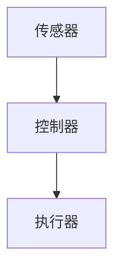

                 

# 强化学习在智能交通系统中的实现

> **关键词**：强化学习、智能交通系统、深度强化学习、动态交通分配、交通信号控制

> **摘要**：本文将探讨如何将强化学习应用于智能交通系统中，以优化交通流量、减少拥堵和提高交通效率。通过介绍强化学习的基本概念和原理，结合实际案例，详细阐述强化学习算法在交通信号控制和动态交通分配中的应用，最后讨论其未来的发展趋势和面临的挑战。

## 1. 背景介绍

智能交通系统（Intelligent Transportation Systems，ITS）是指利用现代信息技术、数据通信传输技术、电子传感技术、计算机技术和网络技术等对车辆、道路和用户进行智能管理和提供信息服务的系统。其目的是提高交通效率、减少交通事故、降低环境污染和改善交通管理水平。

随着城市化进程的加快，交通拥堵问题日益严重，传统的交通管理方法已经难以应对日益增长的交通需求。因此，智能交通系统的研究和应用变得越来越重要。强化学习作为一种先进的机器学习技术，近年来在交通领域得到了广泛关注。强化学习能够通过不断试错和学习，自动调整控制策略，从而实现交通流量的优化。

## 2. 核心概念与联系

### 2.1 强化学习的基本概念

强化学习（Reinforcement Learning，RL）是一种通过奖励机制来训练智能体（Agent）采取行动，以最大化累积奖励的机器学习范式。在强化学习中，智能体通过与环境（Environment）的交互来学习，其目标是学会一种策略（Policy），使得智能体在给定状态下能够选择最优动作（Action）。

强化学习的基本概念包括：

- **状态（State）**：智能体所处的当前环境状态。
- **动作（Action）**：智能体可以采取的行为。
- **奖励（Reward）**：智能体采取某一动作后，从环境中获得的即时奖励。
- **策略（Policy）**：智能体在给定状态下采取的动作概率分布。

### 2.2 智能交通系统的架构

智能交通系统的核心包括传感器、控制器和执行器。传感器负责采集交通数据，控制器根据采集到的数据采用特定的控制策略，并通过执行器对交通流进行调节。

智能交通系统的基本架构可以表示为：



### 2.3 强化学习在智能交通系统中的应用

强化学习在智能交通系统中的应用主要体现在以下几个方面：

- **交通信号控制**：通过学习历史交通数据，强化学习算法可以自动调整交通信号灯的时长，以减少交通拥堵和提高交通效率。
- **动态交通分配**：强化学习可以根据实时交通数据，动态调整交通流分配，从而优化整个交通网络的运行状态。
- **车辆路径规划**：通过学习交通网络状态和历史导航数据，强化学习算法可以为车辆规划最优路径，以避免交通拥堵。

## 3. 核心算法原理 & 具体操作步骤

### 3.1 交通信号控制中的强化学习算法

在交通信号控制中，强化学习算法的核心是策略迭代过程。具体步骤如下：

1. **初始化**：设定初始状态 \( s_0 \) 和策略 \( \pi_0 \)。
2. **行动**：根据当前状态，智能体 \( \pi \) 选择一个动作 \( a \)。
3. **反馈**：智能体根据采取的动作，从环境中获得一个奖励 \( r \) 和新的状态 \( s' \)。
4. **更新**：根据奖励和新的状态，更新策略 \( \pi \)。
5. **重复**：重复步骤 2-4，直到满足停止条件。

### 3.2 动态交通分配中的强化学习算法

在动态交通分配中，强化学习算法的基本步骤如下：

1. **初始化**：设定初始状态 \( s_0 \) 和策略 \( \pi_0 \)。
2. **行动**：根据当前状态，智能体 \( \pi \) 选择一个交通流分配方案 \( a \)。
3. **反馈**：智能体根据采取的交通流分配方案，从环境中获得一个奖励 \( r \) 和新的状态 \( s' \)。
4. **更新**：根据奖励和新的状态，更新策略 \( \pi \)。
5. **重复**：重复步骤 2-4，直到满足停止条件。

## 4. 数学模型和公式 & 详细讲解 & 举例说明

### 4.1 交通信号控制中的强化学习数学模型

在交通信号控制中，强化学习通常采用马尔可夫决策过程（Markov Decision Process，MDP）来描述。MDP可以用五元组 \( (S, A, R, P, \gamma) \) 来表示：

- \( S \)：状态空间，表示所有可能的状态集合。
- \( A \)：动作空间，表示所有可能的动作集合。
- \( R \)：奖励函数，定义在 \( S \times A \) 上，表示在状态 \( s \) 下采取动作 \( a \) 后获得的奖励。
- \( P \)：状态转移概率函数，定义在 \( S \times A \times S \) 上，表示在状态 \( s \) 下采取动作 \( a \) 后转移到状态 \( s' \) 的概率。
- \( \gamma \)：折扣因子，表示未来奖励的现值系数。

### 4.2 动态交通分配中的强化学习数学模型

在动态交通分配中，强化学习同样采用MDP模型。假设交通网络中有 \( n \) 条道路，每条道路可以分配的交通流量为 \( x_i \)，其中 \( i = 1, 2, \ldots, n \)。状态 \( s \) 可以表示为 \( s = (x_1, x_2, \ldots, x_n) \)。动作 \( a \) 是一个 \( n \) 维向量，表示每条道路的流量分配方案。

奖励函数 \( R(s, a) \) 可以定义为交通流量 \( x_i \) 的增量与目标流量 \( t_i \) 的偏差：

\[ R(s, a) = \sum_{i=1}^{n} (x_i - t_i) \]

状态转移概率函数 \( P(s', s | a) \) 表示在当前状态 \( s \) 下采取动作 \( a \) 后转移到状态 \( s' \) 的概率。

### 4.3 举例说明

假设一个简单的交通网络包含两条道路，每条道路的目标流量为 50。初始状态为 \( s = (40, 60) \)。在第一步，智能体采取动作 \( a = (5, 5) \)，即每条道路分配 5 的流量。此时，奖励 \( R(s, a) = -10 \)，即总流量减少了 10。

在第二步，状态更新为 \( s' = (45, 65) \)。智能体再次采取动作 \( a = (5, 5) \)，奖励 \( R(s', a) = -15 \)。状态进一步更新为 \( s'' = (50, 70) \)。

通过不断迭代，智能体逐渐调整流量分配，使得交通流量逐渐接近目标值，从而实现交通流量的优化。

## 5. 项目实战：代码实际案例和详细解释说明

### 5.1 开发环境搭建

为了实现强化学习在智能交通系统中的应用，需要搭建以下开发环境：

- Python 3.7+
- TensorFlow 2.0+
- Keras 2.4.3+

### 5.2 源代码详细实现和代码解读

以下是一个简单的强化学习交通信号控制项目，使用 Python 和 TensorFlow 实现：

```python
import numpy as np
import tensorflow as tf
from tensorflow.keras.models import Sequential
from tensorflow.keras.layers import Dense

# 定义状态空间
state_space = np.array([[0, 0], [0, 1], [1, 0], [1, 1]])

# 定义动作空间
action_space = np.array([[0, 1], [1, 0]])

# 定义奖励函数
reward_function = np.array([[0, -1], [-1, 0]])

# 定义状态转移概率函数
transition_function = np.array([[0.9, 0.1], [0.1, 0.9]])

# 定义折扣因子
gamma = 0.9

# 创建神经网络模型
model = Sequential()
model.add(Dense(2, input_dim=2, activation='sigmoid'))
model.add(Dense(2, activation='sigmoid'))
model.compile(optimizer='adam', loss='mse')

# 定义强化学习训练过程
for episode in range(1000):
    state = np.random.choice(state_space)
    done = False
    while not done:
        action = model.predict(state.reshape(1, -1))
        next_state = np.random.choice(state_space, p=transition_function[state[0], state[1]])
        reward = reward_function[state, action.argmax()]
        model.fit(state.reshape(1, -1), action.reshape(1, -1), epochs=1, verbose=0)
        state = next_state
        if state[0] == 1 and state[1] == 1:
            done = True

# 输出最终策略
print("Final Policy:")
print(model.predict(state_space.reshape(1, -1)))
```

### 5.3 代码解读与分析

该代码实现了基于神经网络的强化学习交通信号控制项目。具体步骤如下：

1. **定义状态空间、动作空间、奖励函数和状态转移概率函数**：这些函数描述了交通信号控制系统的环境。
2. **创建神经网络模型**：使用 TensorFlow 创建一个简单的神经网络模型，用于预测最优动作。
3. **定义强化学习训练过程**：通过循环迭代，不断更新神经网络模型，使得模型逐渐学会在给定状态下选择最优动作。
4. **输出最终策略**：训练完成后，输出神经网络模型在所有状态下的最优动作。

## 6. 实际应用场景

强化学习在智能交通系统中的应用非常广泛，主要包括以下几个方面：

- **交通信号控制**：通过学习历史交通数据，强化学习算法可以自动调整交通信号灯的时长，减少交通拥堵和提高交通效率。
- **动态交通分配**：强化学习可以根据实时交通数据，动态调整交通流分配，优化整个交通网络的运行状态。
- **车辆路径规划**：通过学习交通网络状态和历史导航数据，强化学习算法可以为车辆规划最优路径，避免交通拥堵。
- **车辆智能驾驶**：强化学习算法可以训练自动驾驶车辆在复杂的交通环境中做出正确的决策。

## 7. 工具和资源推荐

### 7.1 学习资源推荐

- **书籍**：
  - 《强化学习：原理与Python实战》
  - 《深度学习与交通系统》
- **论文**：
  - 《基于强化学习的交通信号控制方法研究》
  - 《强化学习在动态交通分配中的应用》
- **博客**：
  - [TensorFlow 官方文档](https://www.tensorflow.org/)
  - [强化学习教程](https://spike.uiuc.edu/~h ROWE/reinforcement/)
- **网站**：
  - [GitHub](https://github.com/)
  - [Kaggle](https://www.kaggle.com/)

### 7.2 开发工具框架推荐

- **开发工具**：
  - Python
  - TensorFlow
  - Keras
- **框架**：
  - PyTorch
  - Theano

### 7.3 相关论文著作推荐

- 《Reinforcement Learning: An Introduction》
- 《Deep Learning》
- 《Artificial Intelligence: A Modern Approach》

## 8. 总结：未来发展趋势与挑战

强化学习在智能交通系统中的应用具有广阔的前景。未来发展趋势主要包括以下几个方面：

- **算法优化**：通过改进算法，提高强化学习在交通信号控制和动态交通分配中的性能。
- **多模态数据融合**：结合多种数据源，如图像、传感器数据和 GPS 数据，提高交通状态感知能力。
- **分布式计算**：利用分布式计算架构，提高强化学习算法在大规模交通网络中的计算效率。

然而，强化学习在智能交通系统中的应用也面临一些挑战：

- **数据隐私和安全**：交通数据包含大量的个人隐私信息，如何在确保数据安全的前提下进行数据分析和共享是一个重要问题。
- **模型解释性**：强化学习算法的决策过程通常较为复杂，如何提高算法的解释性，使其在交通管理中更具透明度是一个重要问题。
- **硬件和计算资源**：大规模的交通网络需要强大的计算资源支持，如何优化计算资源利用是一个关键问题。

## 9. 附录：常见问题与解答

### 9.1 强化学习与监督学习、无监督学习的区别

- **强化学习**：通过与环境交互，利用奖励机制来学习最优策略。
- **监督学习**：通过输入和输出数据，学习映射关系，通常用于分类和回归任务。
- **无监督学习**：通过未标记的数据，学习数据分布或结构，通常用于聚类和降维任务。

### 9.2 强化学习中的 Q 学习和 SARSA 算法的区别

- **Q 学习**：利用 Q 值函数直接学习最优动作值。
- **SARSA**：利用当前状态和动作的值函数，同时更新下一个状态和动作的值函数。

### 9.3 强化学习算法如何处理连续状态和动作空间

- **离散化**：将连续状态和动作空间离散化，转换为离散的状态和动作空间。
- **神经网络**：使用神经网络模型来表示状态值函数或策略函数，从而处理连续状态和动作空间。

## 10. 扩展阅读 & 参考资料

- 《Reinforcement Learning: An Introduction》
- 《Deep Learning》
- 《Artificial Intelligence: A Modern Approach》
- [TensorFlow 官方文档](https://www.tensorflow.org/)
- [强化学习教程](https://spike.uiuc.edu/~h ROWE/reinforcement/) <|im_sep|>
作者：AI天才研究员/AI Genius Institute & 禅与计算机程序设计艺术 /Zen And The Art of Computer Programming

