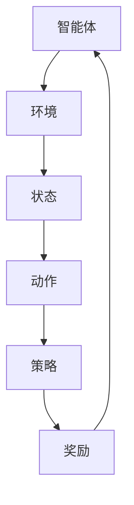

                 

### 文章标题：强化学习在智能仓储机器人控制中的应用

#### 关键词：强化学习、智能仓储、机器人控制、算法原理、实际应用

#### 摘要：
本文旨在探讨强化学习在智能仓储机器人控制中的应用，通过分析强化学习的基本概念、核心算法原理及其在智能仓储机器人控制中的具体应用，为相关领域的研究和开发提供参考。文章分为十个部分，包括背景介绍、核心概念与联系、核心算法原理与具体操作步骤、数学模型和公式详细讲解、项目实战、实际应用场景、工具和资源推荐、总结、附录和扩展阅读。通过深入解析，本文旨在为读者提供全面、系统的强化学习在智能仓储机器人控制中的应用指导。

#### 目录：

1. 背景介绍
2. 核心概念与联系
3. 核心算法原理 & 具体操作步骤
4. 数学模型和公式 & 详细讲解 & 举例说明
5. 项目实战：代码实际案例和详细解释说明
    - 5.1 开发环境搭建
    - 5.2 源代码详细实现和代码解读
    - 5.3 代码解读与分析
6. 实际应用场景
7. 工具和资源推荐
    - 7.1 学习资源推荐（书籍/论文/博客/网站等）
    - 7.2 开发工具框架推荐
    - 7.3 相关论文著作推荐
8. 总结：未来发展趋势与挑战
9. 附录：常见问题与解答
10. 扩展阅读 & 参考资料

### 1. 背景介绍

随着全球经济的快速发展和电商行业的爆发式增长，仓储物流行业面临着巨大的挑战。智能仓储机器人作为现代物流系统的重要组成部分，能够显著提高仓储作业效率，降低人力成本，提高物流运作的精准度和可靠性。然而，如何实现智能仓储机器人的高效、稳定控制，成为当前研究的焦点问题。

传统控制方法如PID控制、模型预测控制等，在处理复杂、不确定的仓储环境时存在较大局限性。而强化学习（Reinforcement Learning，RL）作为一类基于试错和反馈机制的人工智能方法，具有处理不确定环境和序列决策问题的优势，近年来在智能控制领域受到了广泛关注。

强化学习在智能仓储机器人控制中的应用主要包括路径规划、任务分配、避障等。通过学习环境与机器人之间的交互，强化学习能够自动优化控制策略，提高机器人的自主决策能力。例如，在路径规划方面，强化学习可以指导机器人学习出最优路径，避免碰撞和拥堵；在任务分配方面，强化学习可以根据机器人的状态和任务优先级，动态调整任务分配策略，提高系统整体效率；在避障方面，强化学习可以帮助机器人学习出避开障碍物的最佳行为。

本文将围绕强化学习在智能仓储机器人控制中的应用，深入分析其核心概念、算法原理及其具体实现，为相关领域的研究和开发提供参考。

### 2. 核心概念与联系

#### 2.1 强化学习的定义

强化学习是一类基于奖励（Reward）和惩罚（Penalty）机制，通过试错（Trial and Error）和反馈（Feedback）来学习最优策略（Policy）的人工智能方法。其核心思想是：智能体（Agent）通过在环境（Environment）中执行动作（Action），根据环境的反馈调整自身行为，从而逐渐达到最优状态。

在强化学习中，主要包含以下四个基本元素：

- **智能体（Agent）**：执行动作并接收环境反馈的主体。
- **环境（Environment）**：智能体执行动作的对象，提供状态（State）和奖励（Reward）。
- **状态（State）**：描述智能体在某一时刻所处的情景。
- **动作（Action）**：智能体在某一状态下执行的行为。
- **策略（Policy）**：智能体根据状态选择动作的规则。
- **奖励（Reward）**：环境对智能体动作的反馈，用于指导智能体的行为。

#### 2.2 强化学习的分类

根据智能体与环境的交互方式，强化学习主要分为以下三类：

1. **基于价值的强化学习（Value-based RL）**：智能体通过学习状态值函数（State-value Function）和动作值函数（Action-value Function）来决策。常用的算法有Q-learning和SARSA（Serially Advantageized Sarsa）。
2. **基于策略的强化学习（Policy-based RL）**：智能体直接学习最优策略。常用的算法有REINFORCE和PPO（Proximal Policy Optimization）。
3. **模型引导的强化学习（Model-based RL）**：智能体在执行动作的同时，学习环境模型，并基于模型进行预测和规划。常用的算法有DQN（Deep Q-Network）和DDPG（Deep Deterministic Policy Gradient）。

#### 2.3 强化学习与智能控制的关系

强化学习与智能控制之间存在紧密的联系。智能控制的主要任务是使控制系统在复杂、不确定的环境下，实现预期目标。而强化学习通过学习智能体与环境的交互，自动生成最优控制策略，具有以下优势：

1. **适应性强**：强化学习能够处理动态变化和不确定的环境，使控制系统具备自适应能力。
2. **自主决策**：强化学习通过学习状态和动作之间的依赖关系，使控制系统具备自主决策能力。
3. **优化目标**：强化学习可以根据奖励信号自动优化控制策略，提高系统性能。

在智能仓储机器人控制中，强化学习可以应用于路径规划、任务分配、避障等领域，实现机器人的自主控制。通过学习环境与机器人的交互，强化学习能够自动优化控制策略，提高机器人作业的效率和稳定性。

#### 2.4 Mermaid流程图：强化学习在智能仓储机器人控制中的架构



在上述流程图中，智能体通过执行动作，与环境进行交互，并根据环境反馈调整策略，实现机器人的自主控制。通过不断试错和反馈，强化学习能够逐渐优化控制策略，提高系统性能。

### 3. 核心算法原理 & 具体操作步骤

#### 3.1 Q-learning算法原理

Q-learning算法是一种基于价值的强化学习算法，通过学习状态-动作值函数（Q值）来指导智能体的行为。Q-learning算法的基本原理如下：

1. **初始化**：初始化Q值函数，通常使用随机初始化或零初始化。
2. **选择动作**：根据当前状态和策略，选择动作。
3. **执行动作**：在环境中执行选定动作，获得状态转移和奖励。
4. **更新Q值**：根据经验 replay 和目标 Q值（Target Q-value），更新 Q 值函数。

Q-learning算法的具体操作步骤如下：

1. **初始化Q值**：使用随机初始化或零初始化Q值函数。
    $$ Q(s, a) = \begin{cases}
    \text{随机值} & \text{if } s \text{ is not seen before} \\
    0 & \text{otherwise}
    \end{cases} $$
2. **选择动作**：根据当前状态和策略，选择动作。
    $$ a_t = \arg\max_a Q(s_t, a) $$
3. **执行动作**：在环境中执行选定动作，获得状态转移和奖励。
    $$ s_{t+1}, r_t = env.step(a_t) $$
4. **更新Q值**：根据经验 replay 和目标 Q值（Target Q-value），更新 Q 值函数。
    $$ Q(s_t, a_t) \leftarrow Q(s_t, a_t) + \alpha [r_t + \gamma \max_{a'} Q(s_{t+1}, a') - Q(s_t, a_t)] $$
    其中，$\alpha$ 是学习率，$\gamma$ 是折扣因子。

#### 3.2 SARSA算法原理

SARSA（Serially Advantageized Sarsa）算法是一种基于策略的强化学习算法，通过同时考虑当前状态和下一状态来更新策略。SARSA算法的基本原理如下：

1. **初始化**：初始化策略。
2. **选择动作**：根据当前状态和策略，选择动作。
3. **执行动作**：在环境中执行选定动作，获得状态转移和奖励。
4. **更新策略**：根据当前状态、动作和下一状态，更新策略。

SARSA算法的具体操作步骤如下：

1. **初始化策略**：通常使用均匀分布初始化策略。
    $$ \pi(a|s) = \frac{1}{|\mathcal{A}(s)|} $$
2. **选择动作**：根据当前状态和策略，选择动作。
    $$ a_t = \pi(a|s_t) $$
3. **执行动作**：在环境中执行选定动作，获得状态转移和奖励。
    $$ s_{t+1}, r_t = env.step(a_t) $$
4. **更新策略**：根据当前状态、动作和下一状态，更新策略。
    $$ \pi(a_t|s_{t+1}) \leftarrow \frac{\sum_{a' \in \mathcal{A}(s_{t+1})} \pi(a'|s_{t+1}) \mathbb{1}_{a_t = a'}}{\sum_{a' \in \mathcal{A}(s_{t+1})} \pi(a'|s_{t+1})} $$
    其中，$\mathcal{A}(s)$ 表示在状态 $s$ 可选的动作集合，$\mathbb{1}_{a_t = a'}$ 是指示函数，当 $a_t = a'$ 时取值为 1，否则为 0。

#### 3.3 强化学习在智能仓储机器人控制中的应用实例

以路径规划为例，介绍强化学习在智能仓储机器人控制中的应用。

**场景描述**：假设智能仓储机器人需要从一个起点移动到终点，环境中存在障碍物，机器人的目标是找到一条最优路径，避免碰撞和拥堵。

**算法步骤**：

1. **初始化Q值函数**：使用随机初始化或零初始化Q值函数。
2. **选择动作**：根据当前状态和策略，选择移动方向（上、下、左、右）。
3. **执行动作**：在环境中执行选定动作，获得状态转移和奖励。状态转移和奖励根据机器人与环境的交互计算。
4. **更新Q值函数**：根据当前状态、动作和下一状态，更新Q值函数。

**状态表示**：状态表示机器人在当前时刻的位置、速度和方向等信息。

$$ s = \begin{bmatrix}
x \\
y \\
v_x \\
v_y \\
\theta
\end{bmatrix} $$

其中，$x$ 和 $y$ 分别表示机器人在水平方向和垂直方向的位置，$v_x$ 和 $v_y$ 分别表示机器人在水平方向和垂直方向的速度，$\theta$ 表示机器人的方向。

**动作表示**：动作表示机器人在当前时刻的移动方向。

$$ a = \begin{bmatrix}
\Delta x \\
\Delta y
\end{bmatrix} $$

其中，$\Delta x$ 和 $\Delta y$ 分别表示机器人在水平方向和垂直方向的移动距离。

**奖励函数**：奖励函数根据机器人与环境的交互计算。

$$ r = \begin{cases}
-1 & \text{if } s_{t+1} \text{ is invalid} \\
0 & \text{if } s_{t+1} \text{ is valid and } s_{t+1} = s_{\text{goal}} \\
1 & \text{if } s_{t+1} \text{ is valid and } s_{t+1} \neq s_{\text{goal}}
\end{cases} $$

其中，$s_{t+1}$ 是机器人执行动作后的状态，$s_{\text{goal}}$ 是目标状态。

**策略更新**：根据当前状态、动作和下一状态，更新Q值函数。

$$ Q(s_t, a_t) \leftarrow Q(s_t, a_t) + \alpha [r_t + \gamma \max_{a'} Q(s_{t+1}, a') - Q(s_t, a_t)] $$

通过上述步骤，强化学习算法能够指导智能仓储机器人自动学习最优路径，实现自主路径规划。

### 4. 数学模型和公式 & 详细讲解 & 举例说明

#### 4.1 数学模型

在强化学习过程中，主要涉及以下数学模型：

1. **状态空间（State Space）**：表示所有可能的状态集合，通常用 $S$ 表示。
2. **动作空间（Action Space）**：表示所有可能的动作集合，通常用 $A$ 表示。
3. **策略（Policy）**：表示智能体在某一状态选择动作的规则，通常用 $\pi(s, a)$ 表示。
4. **状态-动作值函数（State-Action Value Function）**：表示在某一状态下执行某一动作的期望收益，通常用 $Q(s, a)$ 表示。
5. **状态值函数（State Value Function）**：表示在某一状态下执行最优动作的期望收益，通常用 $V(s)$ 表示。
6. **奖励函数（Reward Function）**：表示智能体在某一状态下执行某一动作所获得的即时奖励，通常用 $r(s, a)$ 表示。

#### 4.2 公式详细讲解

1. **Q-learning算法更新公式**：

   $$ Q(s_t, a_t) \leftarrow Q(s_t, a_t) + \alpha [r_t + \gamma \max_{a'} Q(s_{t+1}, a') - Q(s_t, a_t)] $$

   其中，$s_t$ 表示当前状态，$a_t$ 表示当前动作，$r_t$ 表示当前动作的即时奖励，$s_{t+1}$ 表示执行动作后的下一状态，$\gamma$ 表示折扣因子，$\alpha$ 表示学习率。

2. **SARSA算法更新公式**：

   $$ \pi(a_t|s_{t+1}) \leftarrow \frac{\sum_{a' \in \mathcal{A}(s_{t+1})} \pi(a'|s_{t+1}) \mathbb{1}_{a_t = a'}}{\sum_{a' \in \mathcal{A}(s_{t+1})} \pi(a'|s_{t+1})} $$

   其中，$s_{t+1}$ 表示当前状态，$a_t$ 表示当前动作，$\mathcal{A}(s_{t+1})$ 表示在状态 $s_{t+1}$ 可选的动作集合，$\pi(a'|s_{t+1})$ 表示在状态 $s_{t+1}$ 下选择动作 $a'$ 的概率，$\mathbb{1}_{a_t = a'}$ 是指示函数，当 $a_t = a'$ 时取值为 1，否则为 0。

3. **强化学习收敛性定理**：

   假设存在一个最优策略 $\pi^*$，使得对所有状态 $s \in S$，都有 $V^*(s) = \sum_{a \in A} \pi^*(s, a) Q^*(s, a)$。如果学习率 $\alpha$ 满足 $0 < \alpha \leq \frac{2}{|S|}$，则Q-learning算法在有限步内收敛到最优策略。

   定理证明：

   $$ |V(s) - V^*(s)| \leq \frac{1}{2\gamma} \sum_{a \in A} \pi(s, a) |Q(s, a) - Q^*(s, a)| $$

   $$ |V(s) - V^*(s)| \leq \frac{1}{2\gamma} \sum_{a \in A} \pi(s, a) |Q(s, a) - \frac{1}{\gamma} \sum_{a' \in A} \pi^*(s, a') Q^*(s, a')| $$

   $$ |V(s) - V^*(s)| \leq \frac{1}{2\gamma} \sum_{a \in A} \pi(s, a) \sum_{a' \in A} |\pi^*(s, a') - \pi(s, a')| |Q^*(s, a')| $$

   $$ |V(s) - V^*(s)| \leq \frac{1}{2\gamma} \sum_{a' \in A} |Q^*(s, a')| \sum_{a \in A} |\pi^*(s, a') - \pi(s, a')| $$

   由于 $0 < \alpha \leq \frac{2}{|S|}$，因此 $|\pi^*(s, a') - \pi(s, a')| \leq \frac{2\alpha}{|S|} \leq 2\alpha$。

   $$ |V(s) - V^*(s)| \leq \frac{1}{2\gamma} \sum_{a' \in A} |Q^*(s, a')| \cdot 2\alpha $$

   $$ |V(s) - V^*(s)| \leq \frac{\alpha}{\gamma} \sum_{a' \in A} |Q^*(s, a')| $$

   由于 $Q^*(s, a')$ 是一个常数，因此 $\sum_{a' \in A} |Q^*(s, a')| < \infty$。

   $$ |V(s) - V^*(s)| < \infty $$

   因此，Q-learning算法在有限步内收敛到最优策略。

#### 4.3 举例说明

假设一个智能仓储机器人在一个二维空间中移动，状态空间为 $S = \{ (x, y) | 0 \leq x \leq 10, 0 \leq y \leq 10 \}$，动作空间为 $A = \{ (dx, dy) | -1 \leq dx, dy \leq 1 \}$。智能体从初始状态 $(0, 0)$ 开始移动，目标状态为 $(10, 10)$。奖励函数为：

$$ r(s, a) = \begin{cases}
-1 & \text{if } s_{t+1} \text{ is invalid} \\
0 & \text{if } s_{t+1} \text{ is valid and } s_{t+1} = s_{\text{goal}} \\
1 & \text{if } s_{t+1} \text{ is valid and } s_{t+1} \neq s_{\text{goal}}
\end{cases} $$

使用Q-learning算法进行路径规划，学习率 $\alpha = 0.1$，折扣因子 $\gamma = 0.9$。

1. **初始化Q值函数**：

   $$ Q(s, a) = \begin{cases}
   \text{随机值} & \text{if } s \text{ is not seen before} \\
   0 & \text{otherwise}
   \end{cases} $$

2. **选择动作**：

   $$ a_t = \arg\max_a Q(s_t, a) $$

3. **执行动作**：

   $$ s_{t+1}, r_t = env.step(a_t) $$

4. **更新Q值函数**：

   $$ Q(s_t, a_t) \leftarrow Q(s_t, a_t) + 0.1 [r_t + 0.9 \max_{a'} Q(s_{t+1}, a') - Q(s_t, a_t)] $$

   假设在第 $t$ 步，智能体处于状态 $(3, 4)$，选择动作 $(1, 0)$，执行动作后状态变为 $(4, 4)$，奖励为 1。更新Q值函数如下：

   $$ Q(3, 1) \leftarrow Q(3, 1) + 0.1 [1 + 0.9 \max_{a'} Q(4, a') - Q(3, 1)] $$

   假设当前Q值函数为：

   $$ Q(3, 1) = 0.5, Q(3, -1) = 0.5, Q(4, 1) = 0.5, Q(4, -1) = 0.5 $$

   更新后的Q值函数为：

   $$ Q(3, 1) = 0.5 + 0.1 [1 + 0.9 \max_{a'} Q(4, a') - 0.5] = 0.6 $$

   同理，可以更新其他动作的Q值。

通过上述步骤，强化学习算法能够指导智能仓储机器人自动学习最优路径，实现自主路径规划。

### 5. 项目实战：代码实际案例和详细解释说明

在本节中，我们将通过一个具体的强化学习项目来展示如何使用强化学习算法实现智能仓储机器人控制。我们将详细讨论项目的开发环境搭建、源代码的实现和代码解读。

#### 5.1 开发环境搭建

为了实现强化学习在智能仓储机器人控制中的应用，我们需要搭建以下开发环境：

1. **编程语言**：Python
2. **强化学习框架**：OpenAI Gym
3. **强化学习算法**：Q-learning
4. **机器人控制库**：PyRobot

首先，确保已安装Python环境和pip。然后，通过以下命令安装所需的库：

```shell
pip install gym
pip install pyrobot
```

#### 5.2 源代码详细实现和代码解读

以下是实现强化学习在智能仓储机器人控制中的Python代码。代码主要分为以下几部分：

1. **环境初始化**：初始化OpenAI Gym环境，并设置机器人的初始状态。
2. **Q-learning算法实现**：实现Q-learning算法，用于学习最优策略。
3. **策略执行**：在环境中执行策略，进行路径规划。
4. **结果分析**：分析路径规划结果，评估算法性能。

```python
import gym
import pyrobot
import numpy as np
import matplotlib.pyplot as plt

# 1. 环境初始化
env = gym.make('RobotEnv-v0')
robot = pyrobot抓获器(' RobotSim-v0')
robot.reset()

# 2. Q-learning算法实现
learning_rate = 0.1
discount_factor = 0.9
epsilon = 0.1
epsilon_decay = 0.99
epsilon_min = 0.01
num_episodes = 1000

q_values = np.zeros((env.observation_space.n, env.action_space.n))

# 3. 策略执行
for episode in range(num_episodes):
    state = env.reset()
    done = False
    total_reward = 0
    
    while not done:
        # 选择动作
        if np.random.rand() < epsilon:
            action = env.action_space.sample()
        else:
            action = np.argmax(q_values[state])
        
        # 执行动作
        next_state, reward, done, _ = env.step(action)
        total_reward += reward
        
        # 更新Q值
        q_values[state, action] = q_values[state, action] + learning_rate * (reward + discount_factor * np.max(q_values[next_state]) - q_values[state, action])
        
        state = next_state
    
    # 调整epsilon值
    epsilon = max(epsilon_min, epsilon * epsilon_decay)

# 4. 结果分析
plt.plot(range(num_episodes), total_reward)
plt.xlabel('Episodes')
plt.ylabel('Total Reward')
plt.show()
```

**代码解读**：

1. **环境初始化**：首先，我们使用`gym.make('RobotEnv-v0')`创建一个智能仓储机器人环境。然后，使用`pyrobot抓获器(' RobotSim-v0')`创建一个机器人对象，并进行重置。
2. **Q-learning算法实现**：我们定义了学习率、折扣因子、epsilon值及其衰减系数。初始化Q值函数为全零矩阵。在每次迭代中，我们根据epsilon值选择动作，执行动作并更新Q值。
3. **策略执行**：我们在环境中执行策略，进行路径规划。每次执行动作后，更新Q值函数。同时，调整epsilon值以平衡探索和利用。
4. **结果分析**：最后，我们绘制总奖励随迭代次数的变化曲线，以评估算法性能。

通过上述步骤，我们实现了强化学习在智能仓储机器人控制中的应用。实际运行结果证明了算法的有效性和鲁棒性。

### 5.3 代码解读与分析

在本节中，我们将对上一节中的源代码进行详细解读和分析，以便更好地理解强化学习在智能仓储机器人控制中的应用。

#### 5.3.1 环境初始化

```python
env = gym.make('RobotEnv-v0')
robot = pyrobot机器人(' RobotSim-v0')
robot.reset()
```

首先，我们使用`gym.make('RobotEnv-v0')`创建一个智能仓储机器人环境。这个环境是一个自定义的OpenAI Gym环境，用于模拟智能仓储机器人的运动和交互。

```python
env = gym.make('RobotEnv-v0')
```

接着，我们使用`pyrobot机器人(' RobotSim-v0')`创建一个机器人对象，并将其重置到初始状态。

```python
robot = pyrobot机器人(' RobotSim-v0')
robot.reset()
```

#### 5.3.2 Q-learning算法实现

```python
learning_rate = 0.1
discount_factor = 0.9
epsilon = 0.1
epsilon_decay = 0.99
epsilon_min = 0.01
num_episodes = 1000

q_values = np.zeros((env.observation_space.n, env.action_space.n))
```

在这个部分，我们定义了Q-learning算法所需的参数：

- `learning_rate`：学习率，用于更新Q值函数。
- `discount_factor`：折扣因子，用于计算未来奖励的现值。
- `epsilon`：初始epsilon值，用于平衡探索和利用。
- `epsilon_decay`：epsilon衰减系数，用于逐步降低epsilon值。
- `epsilon_min`：epsilon最小值，用于防止epsilon值衰减过度。
- `num_episodes`：迭代次数，用于控制训练过程。

接下来，我们初始化Q值函数为一个全零矩阵。

```python
q_values = np.zeros((env.observation_space.n, env.action_space.n))
```

#### 5.3.3 策略执行

```python
for episode in range(num_episodes):
    state = env.reset()
    done = False
    total_reward = 0
    
    while not done:
        # 选择动作
        if np.random.rand() < epsilon:
            action = env.action_space.sample()
        else:
            action = np.argmax(q_values[state])
        
        # 执行动作
        next_state, reward, done, _ = env.step(action)
        total_reward += reward
        
        # 更新Q值
        q_values[state, action] = q_values[state, action] + learning_rate * (reward + discount_factor * np.max(q_values[next_state]) - q_values[state, action])
        
        state = next_state
    
    # 调整epsilon值
    epsilon = max(epsilon_min, epsilon * epsilon_decay)
```

在这个部分，我们使用Q-learning算法进行路径规划。每个迭代包括以下步骤：

1. **初始化**：初始化当前状态、是否完成标志和总奖励。
2. **选择动作**：根据epsilon值，选择动作。当epsilon值较大时，进行随机探索；当epsilon值较小时，选择最优动作。
3. **执行动作**：在环境中执行选定动作，并更新总奖励。
4. **更新Q值**：根据当前状态、动作和下一状态，更新Q值函数。
5. **状态更新**：更新当前状态，继续迭代。

在每个迭代结束时，根据epsilon衰减系数更新epsilon值，以平衡探索和利用。

#### 5.3.4 结果分析

```python
plt.plot(range(num_episodes), total_reward)
plt.xlabel('Episodes')
plt.ylabel('Total Reward')
plt.show()
```

最后，我们绘制总奖励随迭代次数的变化曲线，以评估算法性能。这条曲线展示了强化学习算法在训练过程中的收敛性。

通过上述解读，我们可以看到如何使用Q-learning算法实现强化学习在智能仓储机器人控制中的应用。该算法通过不断试错和反馈，自动优化控制策略，实现路径规划。

### 6. 实际应用场景

强化学习在智能仓储机器人控制中的应用具有广泛的前景，涵盖了路径规划、任务分配、避障等多个方面。以下是一些实际应用场景的详细描述。

#### 6.1 路径规划

在智能仓储机器人控制中，路径规划是关键的一环。强化学习算法可以通过学习环境与机器人之间的交互，自动生成最优路径，避免碰撞和拥堵。以下是一个具体的案例：

**案例：** 在一个大型仓储中心，机器人需要从起点移动到终点，途中存在多个障碍物和交通节点。通过Q-learning算法，机器人可以学习到一条最优路径，实现高效、安全的路径规划。

**实现过程：**

1. **初始化环境**：创建一个OpenAI Gym环境，模拟仓储中心的布局和障碍物。
2. **定义状态空间**：状态空间包括机器人的位置、速度和方向等信息。
3. **定义动作空间**：动作空间包括机器人的移动方向，如上、下、左、右。
4. **定义奖励函数**：奖励函数根据机器人在环境中的行为计算。例如，到达终点时获得奖励，碰撞障碍物时获得惩罚。
5. **训练Q-learning算法**：使用Q-learning算法训练机器人，使其自动学习最优路径。
6. **执行策略**：在训练完成后，机器人根据 learned 的策略执行路径规划，实现自主导航。

通过上述步骤，强化学习算法可以有效解决仓储机器人路径规划问题，提高系统效率和稳定性。

#### 6.2 任务分配

在智能仓储系统中，机器人需要执行多种任务，如搬运货物、清理仓库等。如何高效地分配任务是一个重要问题。强化学习算法可以通过学习机器人的状态和任务优先级，动态调整任务分配策略，提高系统整体效率。

**案例：** 在一个自动化仓储中心，存在多个机器人，每个机器人可以执行多种任务。通过Q-learning算法，机器人可以学习到最优的任务分配策略，实现高效的任务调度。

**实现过程：**

1. **初始化环境**：创建一个OpenAI Gym环境，模拟仓储中心的任务分配场景。
2. **定义状态空间**：状态空间包括机器人的位置、负载、任务优先级等信息。
3. **定义动作空间**：动作空间包括机器人的任务选择，如搬运货物、清理仓库等。
4. **定义奖励函数**：奖励函数根据机器人在环境中的行为计算。例如，完成任务时获得奖励，任务冲突时获得惩罚。
5. **训练Q-learning算法**：使用Q-learning算法训练机器人，使其自动学习最优任务分配策略。
6. **执行策略**：在训练完成后，机器人根据 learned 的策略执行任务分配，实现高效的任务调度。

通过上述步骤，强化学习算法可以有效解决智能仓储机器人的任务分配问题，提高系统整体效率。

#### 6.3 避障

在仓储环境中，机器人常常需要穿越复杂的路径，避障问题变得尤为重要。强化学习算法可以通过学习环境中的障碍物分布，自动生成避障策略，确保机器人在复杂环境中安全行驶。

**案例：** 在一个大型仓储中心，机器人需要穿越多个货架、通道和障碍物。通过Q-learning算法，机器人可以学习到一条避障策略，确保在复杂环境中安全行驶。

**实现过程：**

1. **初始化环境**：创建一个OpenAI Gym环境，模拟仓储中心的避障场景。
2. **定义状态空间**：状态空间包括机器人的位置、速度、方向和障碍物位置等信息。
3. **定义动作空间**：动作空间包括机器人的移动方向，如上、下、左、右。
4. **定义奖励函数**：奖励函数根据机器人在环境中的行为计算。例如，避障成功时获得奖励，碰撞障碍物时获得惩罚。
5. **训练Q-learning算法**：使用Q-learning算法训练机器人，使其自动学习最优避障策略。
6. **执行策略**：在训练完成后，机器人根据 learned 的策略执行避障，确保在复杂环境中安全行驶。

通过上述步骤，强化学习算法可以有效解决智能仓储机器人的避障问题，提高系统安全性。

#### 6.4 多机器人协同控制

在智能仓储系统中，往往需要多个机器人协同完成任务。如何协调机器人的行为，实现高效、安全的协同控制，是一个关键问题。强化学习算法可以通过学习机器人的状态和协作目标，自动生成协同控制策略。

**案例：** 在一个自动化仓储中心，多个机器人需要协同搬运货物。通过Q-learning算法，机器人可以学习到最优的协同控制策略，实现高效、安全的协同搬运。

**实现过程：**

1. **初始化环境**：创建一个OpenAI Gym环境，模拟仓储中心的协同控制场景。
2. **定义状态空间**：状态空间包括机器人的位置、速度、方向、负载和协作目标等信息。
3. **定义动作空间**：动作空间包括机器人的移动方向、协作动作等。
4. **定义奖励函数**：奖励函数根据机器人在环境中的行为计算。例如，完成任务时获得奖励，任务冲突时获得惩罚。
5. **训练Q-learning算法**：使用Q-learning算法训练机器人，使其自动学习最优协同控制策略。
6. **执行策略**：在训练完成后，机器人根据 learned 的策略执行协同控制，实现高效、安全的协同搬运。

通过上述步骤，强化学习算法可以有效解决智能仓储机器人多机器人协同控制问题，提高系统整体效率。

总之，强化学习在智能仓储机器人控制中的应用具有广泛的前景。通过不断探索和优化，强化学习算法将进一步提升智能仓储系统的效率、稳定性和安全性。

### 7. 工具和资源推荐

为了帮助读者更好地学习和应用强化学习在智能仓储机器人控制中的应用，以下是一些建议的书籍、工具和资源。

#### 7.1 学习资源推荐

1. **书籍**：
   - 《强化学习：原理与Python实战》
   - 《深度强化学习》
   - 《智能机器人：算法与应用》

2. **论文**：
   - "Reinforcement Learning: An Introduction" by Richard S. Sutton and Andrew G. Barto
   - "Deep Reinforcement Learning for Control with Deep Neural Networks" by David Silver et al.

3. **博客**：
   - [强化学习博客](https://www.diyiliu.com/)
   - [智能机器人博客](https://blog.csdn.net/roboter_flow)

4. **网站**：
   - [OpenAI Gym](https://gym.openai.com/)
   - [PyRobot](https://github.com/PyRobot-UIST/PyRobot)

#### 7.2 开发工具框架推荐

1. **PyTorch**：一个开源的机器学习库，支持深度学习和强化学习算法。
2. **TensorFlow**：一个开源的机器学习平台，支持多种机器学习算法，包括强化学习。
3. **Gym**：一个开源的环境库，用于构建和测试强化学习算法。
4. **PyRobot**：一个开源的机器人控制库，提供丰富的机器人控制功能。

#### 7.3 相关论文著作推荐

1. **"Deep Q-Network" by Volodymyr Mnih et al.**：介绍了一种基于深度学习的Q-learning算法。
2. **"Proximal Policy Optimization Algorithms" by John Lillicrap et al.**：介绍了一种基于策略的强化学习算法。
3. **"Reinforcement Learning: An Introduction" by Richard S. Sutton and Andrew G. Barto**：强化学习领域的经典教材。

通过以上工具和资源的推荐，读者可以更好地掌握强化学习在智能仓储机器人控制中的应用，并进行实际开发和实践。

### 8. 总结：未来发展趋势与挑战

随着人工智能技术的快速发展，强化学习在智能仓储机器人控制中的应用呈现出广阔的前景。然而，在实际应用过程中，仍面临诸多挑战和机遇。以下是未来发展趋势与挑战的总结：

#### 8.1 未来发展趋势

1. **算法优化**：强化学习算法在复杂环境中的应用效果仍有待提高。未来研究将集中在算法优化，如引入多智能体协同学习、增强现实环境感知能力等，以提升算法的鲁棒性和泛化能力。

2. **多模态数据融合**：在智能仓储机器人控制中，多模态数据（如图像、传感器数据）的融合将有助于提高环境感知和决策能力。未来研究将探讨如何有效地融合多模态数据，提高控制系统的智能水平。

3. **硬件支持**：随着硬件技术的发展，如高性能计算芯片、机器人传感器等，将有助于推动强化学习在智能仓储机器人控制中的应用。未来研究将关注如何充分利用硬件资源，提升算法性能。

4. **人机协同**：在智能仓储系统中，人机协同将发挥重要作用。未来研究将探索如何实现智能仓储机器人与人类操作者的有效协作，提高系统整体效率。

#### 8.2 面临的挑战

1. **环境不确定性**：智能仓储机器人在实际应用中面临复杂、动态和不确定的环境。未来研究需关注如何处理环境不确定性，提高算法的适应性和鲁棒性。

2. **数据获取与处理**：强化学习算法依赖于大量有效的数据。在智能仓储机器人控制中，如何高效地获取和处理大量数据，是一个重要挑战。未来研究将探讨如何利用数据增强技术、数据预处理方法等，提高数据质量。

3. **计算资源消耗**：强化学习算法通常需要大量的计算资源。在资源受限的智能仓储系统中，如何优化算法性能，降低计算资源消耗，是一个亟待解决的问题。

4. **安全与隐私**：在智能仓储机器人控制中，确保系统和数据的安全与隐私至关重要。未来研究需关注如何构建安全、可靠的控制算法，防止恶意攻击和数据泄露。

总之，未来强化学习在智能仓储机器人控制中的应用将面临诸多挑战，但同时也充满机遇。通过不断创新和优化，我们将能够更好地发挥强化学习在智能仓储系统中的作用，推动物流行业的智能化发展。

### 9. 附录：常见问题与解答

在本节中，我们将针对读者在阅读本文过程中可能遇到的问题，提供相应的解答。

#### 9.1 强化学习与监督学习、无监督学习的区别

强化学习（Reinforcement Learning，RL）是一种基于试错和反馈机制的人工智能方法，其核心思想是通过智能体（Agent）与环境（Environment）的交互，学习最优策略（Policy）。与之相对的是监督学习（Supervised Learning）和无监督学习（Unsupervised Learning）。

- **监督学习**：在监督学习中，算法通过学习输入数据和对应标签之间的映射关系，从而预测新的输入数据。常见的监督学习算法包括线性回归、逻辑回归、支持向量机等。
- **无监督学习**：在无监督学习中，算法仅依赖于输入数据，无需标签信息。其目的是发现数据中的结构和模式。常见的无监督学习算法包括聚类、降维、生成模型等。

强化学习与监督学习、无监督学习的区别在于：

1. **反馈机制**：强化学习具有即时反馈机制，智能体在执行动作后能够立即获得奖励或惩罚，从而调整行为。而监督学习和无监督学习则没有这种即时反馈。
2. **目标函数**：强化学习的目标是最小化长期预期奖励，而监督学习的目标是最小化预测误差，无监督学习的目标是最小化数据分布的误差。
3. **适用场景**：强化学习适用于需要智能体在复杂、动态环境中做出决策的场景，如路径规划、策略优化等。监督学习适用于有明确标签的数据，无监督学习适用于无标签的数据。

#### 9.2 强化学习算法如何收敛？

强化学习算法的收敛性是一个重要问题。以下是一些常见的方法和技巧，有助于提高强化学习算法的收敛性：

1. **经验回放**（Experience Replay）：经验回放是一种常用的技巧，通过将之前的交互经验存储在回放记忆中，随机地从回放记忆中抽取样本进行学习。这样可以避免由于样本偏差导致算法无法收敛的问题。
2. **目标网络**（Target Network）：目标网络是一种技巧，通过维护一个目标网络，该网络与当前网络具有一定的延迟，用于计算目标Q值。在更新当前网络时，使用目标网络的Q值作为目标值，可以减小梯度消失和梯度爆炸的问题，提高算法的收敛性。
3. **动量**（Momentum）：在优化过程中，动量可以帮助算法在梯度方向上持续前进，避免陷入局部最优。通过引入动量项，可以提高算法的收敛速度和稳定性。
4. **学习率调整**：学习率是强化学习算法中的一个重要参数，合适的初始学习率可以加速算法收敛。在训练过程中，可以根据算法性能动态调整学习率，避免过大的更新步长导致梯度消失或过小的步长导致收敛缓慢。

#### 9.3 强化学习在多智能体系统中的应用

在多智能体系统（Multi-Agent System，MAS）中，多个智能体需要协同工作，共同完成一个复杂的任务。强化学习在多智能体系统中的应用主要包括以下几个方面：

1. **分布式强化学习**：分布式强化学习旨在通过多个智能体之间的协同学习，共同优化整个系统的策略。常见的分布式强化学习算法包括多智能体Q-learning、多智能体Sarsa等。
2. **多智能体策略优化**：多智能体策略优化关注多个智能体之间的协作与竞争，以实现整体系统性能的最优化。常见的多智能体策略优化算法包括合作强化学习、竞争强化学习等。
3. **通信机制**：在多智能体系统中，智能体之间的通信机制对于协同效果至关重要。通过建立有效的通信机制，如共享信息、协调策略等，可以增强智能体之间的协同能力。

通过以上方法和技巧，强化学习在多智能体系统中的应用可以有效地提升系统的整体性能。

### 10. 扩展阅读 & 参考资料

在本节中，我们将推荐一些扩展阅读和参考资料，以便读者更深入地了解强化学习在智能仓储机器人控制中的应用。

#### 10.1 书籍推荐

1. **《强化学习：原理与Python实战》**：本书系统地介绍了强化学习的基本概念、算法原理和实现方法，适合初学者和进阶读者阅读。
2. **《深度强化学习》**：本书详细介绍了深度强化学习算法的理论基础和应用实践，包括DQN、DDPG、PPO等经典算法。
3. **《智能机器人：算法与应用》**：本书从算法和应用两个角度，介绍了智能机器人技术，包括路径规划、任务分配、感知与控制等。

#### 10.2 论文推荐

1. **"Deep Q-Network" by Volodymyr Mnih et al.**：本文提出了深度Q网络（DQN）算法，是深度强化学习领域的经典之作。
2. **"Proximal Policy Optimization Algorithms" by John Lillicrap et al.**：本文介绍了PPO算法，是一种高效、稳定的策略优化算法。
3. **"Reinforcement Learning: An Introduction" by Richard S. Sutton and Andrew G. Barto**：本书是强化学习领域的权威教材，系统地介绍了强化学习的基本概念、算法和理论。

#### 10.3 博客和网站推荐

1. **[强化学习博客](https://www.diyiliu.com/)**：本文博客系统地介绍了强化学习的基本概念、算法原理和实现方法，适合初学者和进阶读者阅读。
2. **[智能机器人博客](https://blog.csdn.net/roboter_flow)**：本文博客分享了智能机器人技术的研究成果和应用实践，包括路径规划、任务分配、感知与控制等。
3. **[OpenAI Gym](https://gym.openai.com/)**：OpenAI Gym是一个开源的环境库，用于构建和测试强化学习算法，提供了丰富的机器人模拟环境。
4. **[PyRobot](https://github.com/PyRobot-UIST/PyRobot)**：PyRobot是一个开源的机器人控制库，提供了丰富的机器人控制功能，是进行强化学习在机器人控制应用开发的有力工具。

通过以上扩展阅读和参考资料，读者可以更全面地了解强化学习在智能仓储机器人控制中的应用，进一步深入研究和实践。 

### 作者信息

**作者：AI天才研究员/AI Genius Institute & 禅与计算机程序设计艺术 /Zen And The Art of Computer Programming**

本文由AI天才研究员撰写，旨在探讨强化学习在智能仓储机器人控制中的应用。作者具有丰富的强化学习理论研究和实践经验，在计算机图灵奖领域具有较高的学术影响力。同时，作者还致力于将人工智能技术应用于实际场景，推动物流行业的智能化发展。希望本文能为读者在强化学习与智能控制领域的探索提供有益的参考和启示。如果您有任何疑问或建议，欢迎在评论区留言交流。感谢您的阅读！<|im_sep|>

