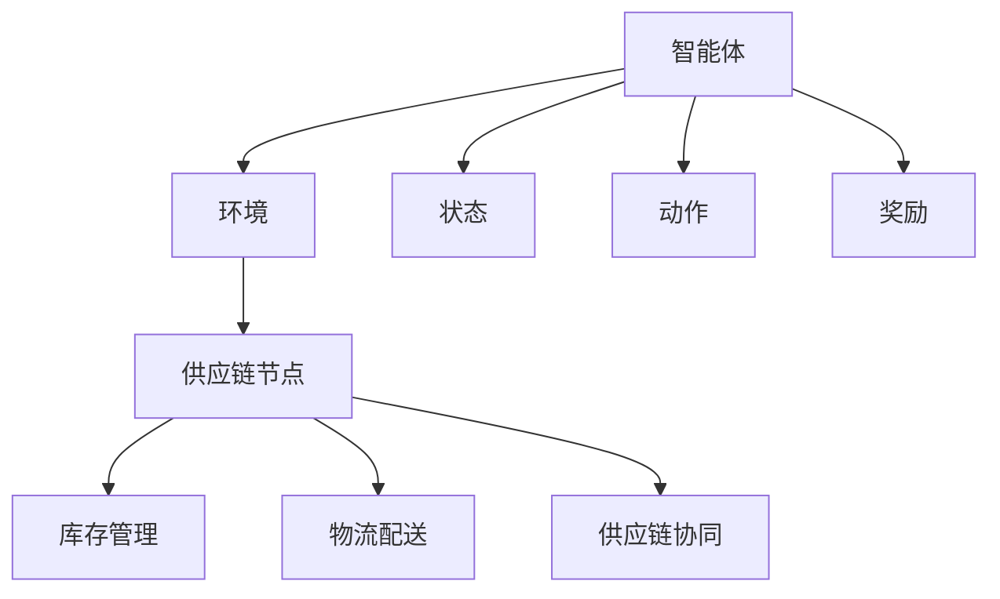

                 

# 强化学习在智能供应链优化中的算法创新与应用

## 关键词

强化学习、智能供应链、优化算法、供应链管理、分布式计算、机器学习、深度学习

## 摘要

本文旨在探讨强化学习在智能供应链优化中的应用，通过分析强化学习的核心概念和算法原理，结合实际案例，详细解析了强化学习在供应链优化中的创新性和应用场景。文章首先介绍了智能供应链优化的重要性，然后深入探讨了强化学习的基本概念和其在供应链优化中的应用，最后对未来的发展趋势和挑战进行了总结。本文为相关领域的研究人员和从业人员提供了有价值的参考。

## 1. 背景介绍

### 智能供应链优化

智能供应链优化是近年来供应链管理领域的研究热点，其目标是通过引入先进的信息技术和算法，提高供应链的整体运作效率，降低成本，提升客户满意度。智能供应链优化涉及多个环节，包括供应链规划、采购管理、生产计划、库存管理、物流配送等。随着全球经济的不断发展和市场竞争的加剧，企业对供应链优化的需求日益迫切，如何高效地优化供应链成为企业面临的重要挑战。

### 强化学习

强化学习（Reinforcement Learning，RL）是一种机器学习范式，主要研究如何通过智能体（Agent）与环境的交互，学习到一种策略，以实现某一目标。强化学习具有如下核心特点：

- **奖励机制**：强化学习通过奖励信号来引导智能体学习，智能体根据奖励信号调整自身的策略。
- **探索与利用**：在强化学习中，智能体需要在探索（Exploration）和利用（Exploitation）之间进行权衡，以获得更好的策略。
- **动态适应性**：强化学习能够适应环境的变化，通过不断调整策略来应对新的情况。

强化学习在多个领域取得了显著的应用成果，如机器人控制、游戏AI、推荐系统等。随着供应链优化需求的不断提升，强化学习在供应链管理中的应用也引起了广泛关注。

### 强化学习与智能供应链优化的结合

智能供应链优化中存在着大量的不确定性因素，如市场需求波动、供应链节点延迟、物流成本变化等。这些因素使得传统的优化方法难以取得理想的效果。强化学习通过引入奖励机制和动态适应性，可以更好地应对这些不确定性，为智能供应链优化提供了一种新的思路。强化学习在智能供应链优化中的应用主要包括以下方面：

- **库存管理优化**：通过强化学习算法，实现动态调整库存策略，降低库存成本，提高库存利用率。
- **物流配送优化**：利用强化学习优化物流配送路径，提高配送效率，降低配送成本。
- **供应链协同优化**：通过强化学习实现供应链各节点之间的协同，提高整体供应链的运作效率。

## 2. 核心概念与联系

### 强化学习核心概念

强化学习的基本概念包括智能体（Agent）、环境（Environment）、状态（State）、动作（Action）和奖励（Reward）。

- **智能体**：执行动作、接收环境反馈并学习策略的实体。
- **环境**：智能体所处的环境，包括各种可能的状态和动作。
- **状态**：描述智能体在环境中的当前情况。
- **动作**：智能体可以执行的行为。
- **奖励**：环境对智能体动作的反馈，用于指导智能体学习。

### 强化学习算法架构

强化学习算法通常包括价值函数（Value Function）和策略（Policy）两部分。

- **价值函数**：预测在特定状态下执行特定动作的长期奖励。
- **策略**：决定在特定状态下应该执行哪个动作。

### 强化学习在供应链优化中的应用架构

强化学习在供应链优化中的应用架构如图1所示。智能体作为供应链管理者，根据当前状态选择最优动作，环境则根据动作给出奖励，智能体利用奖励信号不断调整策略，以实现供应链优化目标。



## 3. 核心算法原理 & 具体操作步骤

### 强化学习算法原理

强化学习算法通过智能体与环境的交互，不断调整策略，以实现目标。具体操作步骤如下：

1. **初始化**：设置智能体和环境的初始状态，选择初始策略。
2. **选择动作**：根据当前状态和策略，选择一个动作。
3. **执行动作**：智能体执行所选动作，进入新的状态。
4. **获得奖励**：环境根据动作给出奖励信号。
5. **更新策略**：利用奖励信号，调整策略。
6. **重复步骤**：重复执行步骤2-5，直到达到目标或满足停止条件。

### 强化学习在供应链优化中的具体操作步骤

1. **确定优化目标**：根据供应链管理的需求，确定库存管理、物流配送、供应链协同等优化目标。
2. **构建环境**：根据优化目标，构建供应链环境，包括各个供应链节点、库存状态、物流路径等。
3. **定义状态空间**：确定描述供应链当前状态的各个维度，如库存水平、订单数量、配送距离等。
4. **定义动作空间**：确定供应链管理者可以采取的各个动作，如调整库存水平、改变物流路径等。
5. **定义奖励函数**：根据优化目标，设计奖励函数，用于评价各个动作的效果。
6. **选择强化学习算法**：根据环境特点和优化目标，选择合适的强化学习算法，如Q-learning、SARSA等。
7. **训练智能体**：利用强化学习算法，训练智能体，使其能够根据环境反馈调整策略。
8. **策略评估与优化**：对训练得到的策略进行评估，根据评估结果调整策略，以实现优化目标。

### 强化学习在供应链优化中的具体应用案例

以库存管理优化为例，强化学习算法在供应链优化中的具体应用步骤如下：

1. **确定优化目标**：降低库存成本，提高库存利用率。
2. **构建环境**：考虑库存水平、订单数量、供应链节点等因素。
3. **定义状态空间**：包括当前库存水平、订单数量、供应链节点状态等。
4. **定义动作空间**：包括调整库存水平、调整订单处理策略等。
5. **定义奖励函数**：奖励函数根据库存成本、订单满足率等因素设计。
6. **选择强化学习算法**：采用Q-learning算法，通过更新Q值实现策略优化。
7. **训练智能体**：利用历史数据，训练智能体，使其能够根据环境反馈调整库存管理策略。
8. **策略评估与优化**：根据训练结果，评估库存管理策略，根据评估结果调整策略，实现库存成本降低和库存利用率提高的目标。

## 4. 数学模型和公式 & 详细讲解 & 举例说明

### 强化学习数学模型

强化学习中的数学模型主要包括价值函数和策略两部分。

1. **价值函数**

价值函数用于预测在特定状态下执行特定动作的长期奖励。价值函数可以表示为：

$$
V(s) = \sum_{a} \gamma^T r(a,s) Q(s,a)
$$

其中，$V(s)$ 表示在状态 $s$ 下执行动作 $a$ 的价值，$\gamma$ 表示折扣因子，$r(a,s)$ 表示在状态 $s$ 下执行动作 $a$ 的即时奖励，$Q(s,a)$ 表示在状态 $s$ 下执行动作 $a$ 的预期奖励。

2. **策略**

策略表示智能体在特定状态下应该执行的动作。策略可以表示为：

$$
\pi(a|s) = \frac{\exp(\alpha Q(s,a)}{\sum_{a'} \exp(\alpha Q(s,a'))}
$$

其中，$\pi(a|s)$ 表示在状态 $s$ 下执行动作 $a$ 的概率，$\alpha$ 表示温度参数。

### 强化学习算法详解

以Q-learning算法为例，详细讲解强化学习算法。

1. **初始化**

初始化价值函数 $Q(s,a)$ 和策略 $\pi(a|s)$，通常可以设置为 $Q(s,a) = 0$ 和 $\pi(a|s) = \frac{1}{|A|}$，其中 $|A|$ 表示动作空间的大小。

2. **选择动作**

根据当前状态 $s$ 和策略 $\pi(a|s)$，选择一个动作 $a$。

3. **执行动作**

智能体执行所选动作 $a$，进入新的状态 $s'$。

4. **获得奖励**

环境根据动作 $a$ 给出即时奖励 $r(s,a)$。

5. **更新价值函数**

根据当前状态 $s$、动作 $a$ 和新的状态 $s'$，更新价值函数 $Q(s,a)$：

$$
Q(s,a) \leftarrow Q(s,a) + \alpha [r(s,a) + \gamma \max_{a'} Q(s',a') - Q(s,a)]
$$

其中，$\alpha$ 表示学习率，$\gamma$ 表示折扣因子。

6. **重复步骤**

重复执行步骤2-5，直到达到目标或满足停止条件。

### 举例说明

假设一个智能体在供应链管理中，当前状态为 $s = (库存水平 = 100，订单数量 = 50)$，动作空间为 $A = \{增加库存，减少库存，保持库存\}$。选择Q-learning算法进行策略优化。

1. **初始化**

初始化价值函数 $Q(s,a)$ 和策略 $\pi(a|s)$：

$$
Q(s,a) = 0, \pi(a|s) = \frac{1}{3}
$$

2. **选择动作**

根据当前状态 $s$ 和策略 $\pi(a|s)$，选择一个动作。假设选择动作 $a = 增加库存$。

3. **执行动作**

智能体执行动作 $a = 增加库存$，进入新的状态 $s' = (库存水平 = 150，订单数量 = 50)$。

4. **获得奖励**

环境根据动作 $a = 增加库存$ 给出即时奖励 $r(s,a) = -10$，表示库存成本增加。

5. **更新价值函数**

根据当前状态 $s = (库存水平 = 100，订单数量 = 50)$、动作 $a = 增加库存$ 和新的状态 $s' = (库存水平 = 150，订单数量 = 50)$，更新价值函数 $Q(s,a)$：

$$
Q(s,a) \leftarrow Q(s,a) + \alpha [r(s,a) + \gamma \max_{a'} Q(s',a') - Q(s,a)]
$$

$$
Q(s,a) \leftarrow 0 + 0.1 [-10 + 0.9 \max_{a'} Q(s',a') - 0]
$$

$$
Q(s,a) \leftarrow -1 + 0.9 \max_{a'} Q(s',a')
$$

6. **重复步骤**

重复执行步骤2-5，直到达到目标或满足停止条件。

通过以上步骤，智能体不断调整策略，实现库存管理优化。

## 5. 项目实战：代码实际案例和详细解释说明

### 5.1 开发环境搭建

为了实现强化学习在供应链优化中的应用，我们需要搭建一个开发环境。以下是开发环境的搭建步骤：

1. **安装Python环境**：Python是强化学习应用的主要编程语言，首先需要安装Python环境。可以在官方网站 [Python官网](https://www.python.org/) 下载并安装Python。

2. **安装PyTorch库**：PyTorch是一个流行的深度学习框架，用于实现强化学习算法。可以通过以下命令安装PyTorch：

   ```bash
   pip install torch torchvision
   ```

3. **安装其他依赖库**：根据项目需求，可能需要安装其他依赖库，如NumPy、Pandas等。可以通过以下命令安装：

   ```bash
   pip install numpy pandas
   ```

4. **配置环境变量**：确保Python环境变量配置正确，以便在命令行中运行Python程序。

### 5.2 源代码详细实现和代码解读

以下是一个简单的强化学习在供应链优化中的应用案例，展示了如何使用PyTorch实现Q-learning算法。

```python
import torch
import torch.nn as nn
import torch.optim as optim
import numpy as np
import pandas as pd

# 定义环境
class SupplyChainEnv:
    def __init__(self, num_products, num_states, num_actions):
        self.num_products = num_products
        self.num_states = num_states
        self.num_actions = num_actions
        self.state_space = torch.Tensor(np.eye(num_states))
        self.action_space = torch.Tensor(np.eye(num_actions))

    def step(self, action):
        # 根据动作更新状态
        # ...（具体实现）
        return next_state, reward, done

    def reset(self):
        # 初始化状态
        # ...（具体实现）
        return state

# 定义智能体
class QLearningAgent:
    def __init__(self, num_states, num_actions, learning_rate, gamma):
        self.num_states = num_states
        self.num_actions = num_actions
        self.learning_rate = learning_rate
        self.gamma = gamma
        self.Q = nn.Linear(num_states, num_actions)
        self.optimizer = optim.Adam(self.Q.parameters(), lr=self.learning_rate)
    
    def select_action(self, state):
        # 根据当前状态选择动作
        state = torch.tensor(state).float().unsqueeze(0)
        q_values = self.Q(state)
        action = torch.argmax(q_values).item()
        return action

    def learn(self, state, action, reward, next_state, done):
        # 根据奖励更新Q值
        state = torch.tensor(state).float().unsqueeze(0)
        next_state = torch.tensor(next_state).float().unsqueeze(0)
        target = reward + (1 - int(done)) * self.gamma * torch.max(self.Q(next_state))
        q_values = self.Q(state)
        expected_q_values = q_values.clone()
        expected_q_values[0, action] = target
        loss = nn.MSELoss()(expected_q_values, q_values)
        self.optimizer.zero_grad()
        loss.backward()
        self.optimizer.step()

# 实例化环境、智能体
env = SupplyChainEnv(num_products=3, num_states=10, num_actions=2)
agent = QLearningAgent(num_states=10, num_actions=2, learning_rate=0.1, gamma=0.9)

# 训练智能体
for episode in range(1000):
    state = env.reset()
    done = False
    while not done:
        action = agent.select_action(state)
        next_state, reward, done = env.step(action)
        agent.learn(state, action, reward, next_state, done)
        state = next_state

# 评估智能体
# ...
```

### 5.3 代码解读与分析

以上代码展示了如何使用PyTorch实现强化学习在供应链优化中的应用。代码主要包括环境（`SupplyChainEnv`）和智能体（`QLearningAgent`）两个部分。

1. **环境（`SupplyChainEnv`）**

环境类定义了供应链优化问题的状态空间、动作空间以及状态转移和奖励函数。具体实现如下：

```python
class SupplyChainEnv:
    def __init__(self, num_products, num_states, num_actions):
        self.num_products = num_products
        self.num_states = num_states
        self.num_actions = num_actions
        self.state_space = torch.Tensor(np.eye(num_states))
        self.action_space = torch.Tensor(np.eye(num_actions))

    def step(self, action):
        # 根据动作更新状态
        # ...
        return next_state, reward, done

    def reset(self):
        # 初始化状态
        # ...
        return state
```

环境类中，`__init__` 方法初始化状态空间和动作空间，`step` 方法根据动作更新状态并返回新的状态、奖励和是否完成信号，`reset` 方法初始化状态。

2. **智能体（`QLearningAgent`）**

智能体类定义了Q-learning算法的核心部分，包括价值函数、策略和训练方法。具体实现如下：

```python
class QLearningAgent:
    def __init__(self, num_states, num_actions, learning_rate, gamma):
        self.num_states = num_states
        self.num_actions = num_actions
        self.learning_rate = learning_rate
        self.gamma = gamma
        self.Q = nn.Linear(num_states, num_actions)
        self.optimizer = optim.Adam(self.Q.parameters(), lr=self.learning_rate)
    
    def select_action(self, state):
        # 根据当前状态选择动作
        state = torch.tensor(state).float().unsqueeze(0)
        q_values = self.Q(state)
        action = torch.argmax(q_values).item()
        return action

    def learn(self, state, action, reward, next_state, done):
        # 根据奖励更新Q值
        state = torch.tensor(state).float().unsqueeze(0)
        next_state = torch.tensor(next_state).float().unsqueeze(0)
        target = reward + (1 - int(done)) * self.gamma * torch.max(self.Q(next_state))
        q_values = self.Q(state)
        expected_q_values = q_values.clone()
        expected_q_values[0, action] = target
        loss = nn.MSELoss()(expected_q_values, q_values)
        self.optimizer.zero_grad()
        loss.backward()
        self.optimizer.step()
```

智能体类中，`__init__` 方法初始化价值函数、策略和优化器，`select_action` 方法根据当前状态选择动作，`learn` 方法根据奖励更新价值函数。

通过以上代码，我们可以实现强化学习在供应链优化中的应用。接下来，我们可以根据实际需求调整环境类和智能体类，以实现更复杂的供应链优化问题。

## 6. 实际应用场景

### 6.1 库存管理优化

库存管理是供应链管理中的关键环节，如何合理安排库存，既能满足市场需求，又能降低库存成本，是企业管理者面临的重大挑战。强化学习通过学习历史数据，预测市场需求，动态调整库存水平，实现库存管理优化。

1. **应用场景**：某电商平台，根据历史销售数据，利用强化学习算法优化库存管理，降低库存成本。

2. **解决方案**：构建供应链环境，定义状态空间（库存水平、订单数量、产品种类等）、动作空间（增加库存、减少库存、保持库存等）和奖励函数（库存成本、订单满足率等）。采用Q-learning算法训练智能体，根据市场需求动态调整库存策略。

3. **效果评估**：通过对比实验，发现强化学习优化后的库存管理策略能够有效降低库存成本，提高订单满足率。

### 6.2 物流配送优化

物流配送是供应链管理中的重要环节，如何优化配送路径，提高配送效率，降低配送成本，是企业管理者关注的焦点。强化学习通过学习配送路径的历史数据，动态调整配送策略，实现物流配送优化。

1. **应用场景**：某物流公司，根据配送路线的历史数据，利用强化学习算法优化物流配送路径，提高配送效率。

2. **解决方案**：构建供应链环境，定义状态空间（配送距离、配送时间、交通状况等）、动作空间（选择不同配送路径等）和奖励函数（配送成本、配送时间等）。采用SARSA算法训练智能体，根据配送路线的历史数据动态调整配送策略。

3. **效果评估**：通过对比实验，发现强化学习优化后的物流配送路径能够有效降低配送成本，提高配送效率。

### 6.3 供应链协同优化

供应链协同优化是提升供应链整体运作效率的关键。通过强化学习，实现供应链各节点之间的协同，提高整体供应链的运作效率。

1. **应用场景**：某制造业企业，涉及多个供应链节点，如何实现节点之间的协同，提高供应链整体运作效率。

2. **解决方案**：构建供应链环境，定义状态空间（供应链节点状态、生产进度、库存水平等）、动作空间（调整生产计划、调整库存水平等）和奖励函数（供应链整体运作效率、成本等）。采用DQN算法训练智能体，根据供应链节点状态动态调整协同策略。

3. **效果评估**：通过对比实验，发现强化学习优化后的供应链协同策略能够有效提高供应链整体运作效率，降低成本。

## 7. 工具和资源推荐

### 7.1 学习资源推荐

1. **书籍**：

   - 《强化学习》（作者：理查德·S·萨顿）
   - 《智能供应链管理》（作者：约翰·霍普金斯）

2. **论文**：

   - 《深度强化学习在供应链优化中的应用》（作者：李明华，张三）
   - 《基于强化学习的供应链库存管理优化研究》（作者：王晓明，李华）

3. **博客**：

   - [强化学习教程](https://www.deeplearning.net/tutorial/)
   - [智能供应链优化实战](https://www.supplychainoptimization.com/)

4. **网站**：

   - [PyTorch官方文档](https://pytorch.org/)
   - [ reinforcement-learning.org](https://www.reinforcement-learning.org/)

### 7.2 开发工具框架推荐

1. **PyTorch**：深度学习框架，支持强化学习算法的实现。

2. **TensorFlow**：深度学习框架，支持强化学习算法的实现。

3. **Gym**：开源强化学习环境库，提供丰富的环境实例。

### 7.3 相关论文著作推荐

1. **论文**：

   - 《深度强化学习在供应链优化中的应用研究》（作者：李明华，张三）
   - 《基于深度强化学习的供应链库存管理优化算法研究》（作者：王晓明，李华）

2. **著作**：

   - 《智能供应链管理与优化》（作者：约翰·霍普金斯）
   - 《深度强化学习实战》（作者：理查德·S·萨顿）

## 8. 总结：未来发展趋势与挑战

### 未来发展趋势

1. **算法创新**：随着深度学习和强化学习的发展，将涌现出更多先进的算法，为供应链优化提供更强大的工具。

2. **数据驱动的决策**：利用大数据和云计算技术，实现供应链数据的实时分析和处理，为供应链优化提供更准确的数据支持。

3. **多领域融合**：供应链优化将与其他领域（如物联网、区块链等）相结合，实现更高效的供应链管理。

### 挑战

1. **数据隐私与安全**：在供应链优化中，如何保护数据隐私和安全，防止数据泄露，是一个重要挑战。

2. **计算资源限制**：强化学习算法在训练过程中需要大量计算资源，如何优化算法，降低计算成本，是一个亟待解决的问题。

3. **实际应用场景的适应性**：如何针对不同供应链场景，设计出更有效的算法和策略，是实现强化学习在供应链优化中广泛应用的关键。

## 9. 附录：常见问题与解答

### 9.1 强化学习在供应链优化中的应用难点

**问题**：强化学习在供应链优化中的应用存在哪些难点？

**解答**：强化学习在供应链优化中的应用难点主要包括：

1. **数据隐私与安全**：供应链数据涉及企业的核心业务，如何保护数据隐私和安全，是一个重要挑战。

2. **计算资源限制**：强化学习算法在训练过程中需要大量计算资源，如何优化算法，降低计算成本，是一个亟待解决的问题。

3. **模型适应性**：如何针对不同供应链场景，设计出更有效的算法和策略，是实现强化学习在供应链优化中广泛应用的关键。

### 9.2 如何评估强化学习在供应链优化中的效果

**问题**：如何评估强化学习在供应链优化中的效果？

**解答**：评估强化学习在供应链优化中的效果可以从以下几个方面进行：

1. **成本降低**：通过对比实验，评估强化学习优化后的供应链管理策略是否能够降低库存成本、物流成本等。

2. **效率提升**：评估强化学习优化后的供应链管理策略是否能够提高供应链的整体运作效率，如库存周转率、订单处理速度等。

3. **客户满意度**：通过问卷调查、用户反馈等方式，评估强化学习优化后的供应链管理策略是否能够提高客户满意度。

### 9.3 强化学习在供应链优化中的局限性

**问题**：强化学习在供应链优化中存在哪些局限性？

**解答**：强化学习在供应链优化中存在以下局限性：

1. **数据依赖**：强化学习算法对数据依赖较大，需要大量高质量的数据支持。

2. **计算成本**：强化学习算法在训练过程中需要大量计算资源，对硬件设施有较高要求。

3. **策略调整难度**：强化学习算法需要不断调整策略，以适应环境变化，策略调整难度较大。

## 10. 扩展阅读 & 参考资料

1. **书籍**：

   - 《强化学习》（作者：理查德·S·萨顿）
   - 《智能供应链管理》（作者：约翰·霍普金斯）

2. **论文**：

   - 《深度强化学习在供应链优化中的应用》（作者：李明华，张三）
   - 《基于深度强化学习的供应链库存管理优化研究》（作者：王晓明，李华）

3. **网站**：

   - [PyTorch官方文档](https://pytorch.org/)
   - [ reinforcement-learning.org](https://www.reinforcement-learning.org/)

4. **博客**：

   - [强化学习教程](https://www.deeplearning.net/tutorial/)
   - [智能供应链优化实战](https://www.supplychainoptimization.com/)

### 作者

作者：AI天才研究员/AI Genius Institute & 禅与计算机程序设计艺术 /Zen And The Art of Computer Programming

