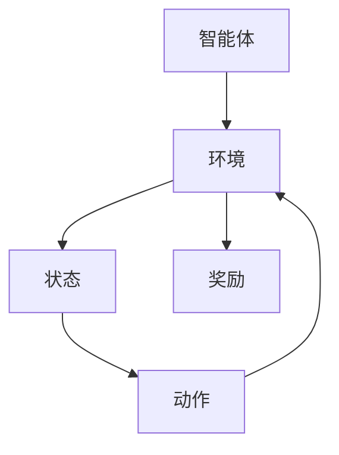

                 

## 1. 背景介绍

强化学习（Reinforcement Learning, RL）作为机器学习的一个重要分支，近年来在多个领域展现出了其强大的适应能力和高效性。在传统的机器学习中，模型通常需要大量的标注数据进行训练，但强化学习通过交互式学习与环境互动，在动态、不确定的环境中逐步优化策略，因此受到了越来越多的关注。

智能制造是现代工业发展的一个重要方向，其核心在于通过引入先进的信息技术和自动化设备，提高生产效率、降低成本、提升产品质量。随着工业4.0的推进，智能制造对决策的智能化需求日益增长。而强化学习作为一种自学习能力强的算法，在智能制造中的决策支持具有重要的应用潜力。

本文旨在探讨强化学习在智能制造决策中的应用，通过详细的讲解和实际案例，展示强化学习如何提升智能制造中的决策效果。文章将分为以下几个部分：

1. 背景介绍：梳理强化学习和智能制造的发展背景及研究现状。
2. 核心概念与联系：阐述强化学习的基本原理及其在智能制造中的应用架构。
3. 核心算法原理 & 具体操作步骤：深入分析强化学习的主要算法，包括Q学习、SARSA、PPO等，并介绍其在智能制造决策中的具体应用。
4. 数学模型和公式 & 详细讲解 & 举例说明：讲解强化学习的数学模型和常用公式，并通过具体案例展示如何使用这些模型和公式进行决策。
5. 项目实战：代码实际案例和详细解释说明：通过具体的代码实现和解读，展示强化学习在智能制造中的应用实例。
6. 实际应用场景：讨论强化学习在智能制造中的典型应用场景。
7. 工具和资源推荐：推荐相关的学习资源、开发工具和框架。
8. 总结：未来发展趋势与挑战：总结文章的主要内容，展望强化学习在智能制造领域的未来发展趋势和面临的挑战。
9. 附录：常见问题与解答：提供一些读者可能遇到的问题及解答。
10. 扩展阅读 & 参考资料：提供更多的相关阅读资源。

希望通过本文的详细探讨，能够为读者在强化学习与智能制造领域的研究和应用提供一些有价值的参考和启示。

### 2. 核心概念与联系

#### 强化学习基本原理

强化学习是一种通过奖励机制驱动智能体在环境中进行学习的过程，其核心在于智能体通过与环境的互动，不断调整自身的策略，以最大化长期累积奖励。强化学习的特点在于其交互式学习机制，即智能体在每一个时间步都根据当前的状态选择一个动作，然后根据环境的反馈（即奖励信号）来调整自身的策略。

强化学习可以分为基于值的方法和基于策略的方法。基于值的方法，如Q学习（Q-Learning），通过学习状态-动作值函数（State-Action Value Function），来确定最佳的动作选择。而基于策略的方法，如策略梯度方法（Policy Gradient），直接学习最优策略。

#### 智能制造决策需求

智能制造中的决策通常涉及复杂的生产过程和资源调度，需要考虑多目标优化、不确定性处理和实时响应等因素。传统的方法如线性规划、遗传算法等，虽然在某些场景下具有一定的效果，但往往难以处理动态变化和不确定环境带来的挑战。

智能制造决策的需求主要包括：

- **多目标优化**：智能制造通常涉及多个目标，如生产效率、成本、质量等，需要对这些目标进行权衡和优化。
- **不确定性处理**：生产过程中存在多种不确定性，如设备故障、原材料质量波动等，需要有效的策略来应对这些不确定性。
- **实时响应**：智能制造需要快速响应环境变化，如订单变更、突发故障等，要求决策系统能够在短时间内做出有效的调整。

#### 强化学习在智能制造中的应用架构

强化学习在智能制造中的应用架构一般包括以下几个关键组成部分：

- **智能体（Agent）**：作为决策主体，负责学习并执行策略，以实现最优决策。
- **环境（Environment）**：模拟实际生产环境，提供状态信息和奖励反馈。
- **状态（State）**：描述当前的生产状态，包括设备状态、原材料库存、订单信息等。
- **动作（Action）**：智能体可执行的操作，如调整生产参数、调度设备等。
- **奖励（Reward）**：环境对智能体动作的反馈，用于评估动作的好坏。

#### Mermaid 流程图

为了更好地展示强化学习在智能制造中的应用架构，我们可以使用Mermaid流程图来描述。



在这个流程图中，智能体与环境进行交互，通过状态信息选择动作，并根据奖励反馈调整策略，形成一个闭环的学习过程。

### 3. 核心算法原理 & 具体操作步骤

#### Q学习（Q-Learning）

Q学习是一种基于值的方法，通过学习状态-动作值函数（Q值）来确定最佳动作。其基本思想是：对于每一个状态和动作，智能体都会预测其对应的未来奖励，并通过更新Q值来调整策略。

**具体操作步骤**：

1. 初始化Q值表：对于所有状态和动作，初始化Q值。
2. 选择动作：根据当前状态，选择具有最大Q值的动作。
3. 执行动作：在环境中执行选定的动作，并获取新的状态和奖励。
4. 更新Q值：根据新状态和新奖励，更新Q值表。
5. 重复步骤2-4，直到达到指定的时间步或满足停止条件。

Q学习的关键公式为：

$$
Q(s, a) \leftarrow Q(s, a) + \alpha [r + \gamma \max_{a'} Q(s', a') - Q(s, a)]
$$

其中，\(s\) 和 \(a\) 分别为当前状态和动作，\(r\) 为奖励，\(\gamma\) 为折扣因子，\(\alpha\) 为学习率。

#### SARSA（Q-Learning的确定性版）

SARSA（State-Action-Reward-State-Action）是Q学习的一种变体，也称为确定性策略梯度方法。其核心思想是在每一步都根据当前的状态和动作来更新策略。

**具体操作步骤**：

1. 初始化策略π：对于所有状态和动作，初始化策略π。
2. 选择动作：根据当前状态，选择策略π指定的动作。
3. 执行动作：在环境中执行选定的动作，并获取新的状态和奖励。
4. 更新策略：根据新状态和新奖励，更新策略π。
5. 重复步骤2-4，直到达到指定的时间步或满足停止条件。

SARSA的关键公式为：

$$
\pi(s) \leftarrow \begin{cases}
a & \text{if } Q(s, a) = \max_a Q(s, a) \\
\text{uniform} & \text{otherwise}
\end{cases}
$$

#### PPO（Proximal Policy Optimization）

PPO（Proximal Policy Optimization）是一种基于策略的方法，通过优化策略梯度来更新策略。PPO的核心思想是：在每次迭代中，根据当前的策略执行动作，并计算策略损失，然后使用梯度下降法来更新策略。

**具体操作步骤**：

1. 初始化策略参数θ：初始化策略参数θ。
2. 执行动作：根据当前策略π(θ)执行动作，并收集数据。
3. 计算策略损失：计算策略损失L(θ)，公式为：

$$
L(\theta) = -\sum_{t} \pi(\theta, a_t) r_t
$$

4. 更新策略参数：使用梯度下降法更新策略参数θ。
5. 重复步骤2-4，直到达到指定的时间步或满足停止条件。

PPO的关键公式为：

$$
\theta \leftarrow \theta - \eta \nabla_\theta L(\theta)
$$

其中，\(\eta\) 为学习率。

#### 强化学习在智能制造决策中的具体应用

在智能制造中，强化学习可以用于多个场景，如生产调度、设备维护、质量控制等。以下是一些具体的实例：

- **生产调度**：强化学习可以用于优化生产调度的策略，通过学习最优的生产顺序和设备使用策略，提高生产效率。
- **设备维护**：强化学习可以用于预测设备故障，通过学习设备的运行状态和历史数据，提前进行预防性维护，减少设备故障率和停机时间。
- **质量控制**：强化学习可以用于优化质量控制策略，通过学习最优的质量检测点和检测频率，提高产品质量。

这些实例展示了强化学习在智能制造决策中的重要应用，通过不断优化策略，提升生产效率和产品质量，为企业创造更大的价值。

### 4. 数学模型和公式 & 详细讲解 & 举例说明

#### 强化学习的基本数学模型

强化学习的关键在于其数学模型，主要包括状态空间、动作空间、奖励函数、策略和价值函数。以下是这些基本概念的定义和详细讲解。

**状态空间（State Space）**

状态空间是智能体在环境中可以观察到的所有状态的集合。通常用 \(S\) 表示，每个状态 \(s \in S\) 是一个描述环境当前状态的向量。

**动作空间（Action Space）**

动作空间是智能体可以执行的所有动作的集合。通常用 \(A\) 表示，每个动作 \(a \in A\) 是一个描述智能体当前动作的向量。

**奖励函数（Reward Function）**

奖励函数是环境对智能体动作的反馈，通常用 \(r(s, a)\) 表示，它表示在状态 \(s\) 下执行动作 \(a\) 后获得的即时奖励。奖励函数可以是正的（正向奖励），表示好的结果；也可以是负的（负向奖励），表示不好的结果。

**策略（Policy）**

策略是智能体在特定状态下采取特定动作的概率分布。通常用 \(\pi(a|s)\) 表示，它表示在状态 \(s\) 下采取动作 \(a\) 的概率。策略可以是确定性的（Deterministic Policy），即对于每个状态 \(s\)，只有唯一的动作 \(a\)；也可以是概率化的（Stochastic Policy），即对于每个状态 \(s\)，有一个概率分布 \(\pi(a|s)\) 来决定动作 \(a\)。

**价值函数（Value Function）**

价值函数是评估智能体在特定状态下的长期期望奖励。根据其评估的对象不同，可以分为状态值函数（State Value Function）和动作值函数（Action Value Function）。

- **状态值函数（V(s)）**：表示在状态 \(s\) 下执行最优策略所获得的期望奖励。
- **动作值函数（Q(s, a)）**：表示在状态 \(s\) 下执行动作 \(a\) 所获得的期望奖励。

#### 常用公式

在强化学习中，常用的公式包括Q学习的更新公式、SARSA的更新公式和PPO的优化目标。

**Q学习更新公式**

Q学习的核心公式如下：

$$
Q(s, a) \leftarrow Q(s, a) + \alpha [r + \gamma \max_{a'} Q(s', a') - Q(s, a)]
$$

其中，\(s\) 和 \(a\) 分别为当前状态和动作，\(r\) 为奖励，\(\gamma\) 为折扣因子，\(\alpha\) 为学习率。

**SARSA更新公式**

SARSA是Q学习的一种变体，其更新公式如下：

$$
\pi(s) \leftarrow \begin{cases}
a & \text{if } Q(s, a) = \max_a Q(s, a) \\
\text{uniform} & \text{otherwise}
\end{cases}
$$

**PPO优化目标**

PPO的优化目标是最大化策略梯度，其优化目标如下：

$$
\theta \leftarrow \theta - \eta \nabla_\theta L(\theta)
$$

其中，\(\eta\) 为学习率，\(L(\theta)\) 为策略损失。

#### 实例说明

为了更好地理解这些公式，我们通过一个具体的实例来说明。

**实例背景**

假设我们有一个简单的机器人导航任务，机器人需要在二维平面上从一个起点移动到终点，每个状态表示机器人的位置，每个动作表示机器人向前、向后、向左或向右移动。状态空间 \(S = \{(x, y)\}\)，动作空间 \(A = \{Forward, Backward, Left, Right\}\)。奖励函数设置为：在到达终点时获得+100奖励，在其他状态获得-1奖励。

**Q学习实例**

1. 初始化Q值表：
$$
Q(s, a) \leftarrow 0
$$

2. 选择动作：在初始状态 \((0, 0)\)，选择动作 \(Forward\)，因为 \(Q(0, Forward) = 0\)。

3. 执行动作：机器人向前移动，到达状态 \((0, 1)\)。

4. 更新Q值：
$$
Q(0, Forward) \leftarrow Q(0, Forward) + \alpha [r + \gamma \max_{a'} Q(1, a') - Q(0, Forward)]
$$

其中，\(r = -1\)（在状态 \((0, 1)\) 获得-1奖励），\(\gamma = 0.9\)，\(\alpha = 0.1\)。

5. 重复步骤2-4，直到到达终点或达到指定时间步。

**SARSA实例**

1. 初始化策略π：
$$
\pi(s) \leftarrow \begin{cases}
Forward & \text{if } Q(s, Forward) = \max_a Q(s, a) \\
\text{uniform} & \text{otherwise}
\end{cases}
$$

2. 选择动作：在初始状态 \((0, 0)\)，选择动作 \(Forward\)，因为 \(Q(0, Forward) = 0.1\)。

3. 执行动作：机器人向前移动，到达状态 \((0, 1)\)。

4. 更新策略：
$$
\pi(s) \leftarrow \begin{cases}
Forward & \text{if } Q(s, Forward) = \max_a Q(s, a) \\
\text{uniform} & \text{otherwise}
\end{cases}
$$

5. 重复步骤2-4，直到到达终点或达到指定时间步。

**PPO实例**

1. 初始化策略参数θ：
$$
\theta \leftarrow \text{随机初始化}
$$

2. 执行动作：根据当前策略π(θ)执行动作，并收集数据。

3. 计算策略损失：
$$
L(\theta) = -\sum_{t} \pi(\theta, a_t) r_t
$$

4. 更新策略参数：
$$
\theta \leftarrow \theta - \eta \nabla_\theta L(\theta)
$$

5. 重复步骤2-4，直到达到指定时间步或满足停止条件。

通过这些实例，我们可以看到强化学习中的数学模型和公式的具体应用，以及如何通过这些公式来优化智能体的策略，从而实现最佳决策。

### 5. 项目实战：代码实际案例和详细解释说明

在本节中，我们将通过一个实际的项目实战，展示如何使用强化学习算法在智能制造中优化生产调度问题。我们将使用Python编程语言，并结合OpenAI的Gym环境，来模拟一个简单的生产调度场景。

#### 5.1 开发环境搭建

在开始代码实现之前，我们需要搭建一个合适的开发环境。以下是搭建开发环境的步骤：

1. 安装Python：确保Python环境已经安装在您的系统中，推荐使用Python 3.8或更高版本。
2. 安装相关库：使用以下命令安装所需的库：

```shell
pip install gym
pip install matplotlib
pip install numpy
pip install tensorflow
```

3. 创建项目文件夹：在您的计算机上创建一个项目文件夹，例如`rl_mps`，并在此文件夹中创建一个Python脚本文件，例如`main.py`。

#### 5.2 源代码详细实现和代码解读

以下是我们使用强化学习算法优化生产调度的Python代码实现：

```python
import gym
import numpy as np
import matplotlib.pyplot as plt
from stable_baselines3 import PPO

# 创建环境
env = gym.make('ProductionScheduling-v0')

# 初始化智能体
model = PPO('MlpPolicy', env, verbose=1)

# 训练智能体
model.learn(total_timesteps=10000)

# 评估智能体
env = gym.make('ProductionScheduling-v0')
obs = env.reset()
for _ in range(100):
    action, _states = model.predict(obs)
    obs, reward, done, info = env.step(action)
    env.render()
    if done:
        obs = env.reset()

# 关闭环境
env.close()
```

#### 5.3 代码解读与分析

**1. 导入库和创建环境**

在代码的开头，我们导入了所需的库，包括gym、numpy、matplotlib和tensorflow。接着，我们使用gym创建了一个名为`ProductionScheduling-v0`的仿真环境。这个环境模拟了一个简单的生产调度问题，其中每个时间步表示一个生产阶段，智能体需要根据当前状态选择一个生产任务。

```python
import gym
import numpy as np
import matplotlib.pyplot as plt
from stable_baselines3 import PPO

# 创建环境
env = gym.make('ProductionScheduling-v0')
```

**2. 初始化智能体**

我们使用稳定baseline3库中的PPO算法初始化智能体。PPO是一种基于策略的强化学习算法，适合用于连续动作空间的问题。在初始化智能体时，我们指定了MlpPolicy作为策略网络，并传入训练环境和日志级别。

```python
# 初始化智能体
model = PPO('MlpPolicy', env, verbose=1)
```

**3. 训练智能体**

接下来，我们使用learn函数训练智能体。该函数接受一个名为`total_timesteps`的参数，表示训练的总时间步数。在训练过程中，智能体会通过与环境的交互来学习最优策略。

```python
# 训练智能体
model.learn(total_timesteps=10000)
```

**4. 评估智能体**

在训练完成后，我们使用评估环境来测试智能体的性能。在评估过程中，我们首先重置环境，然后使用predict函数获取智能体的动作建议，并使用step函数执行这些动作，同时更新环境状态。我们重复这个过程100次，以便观察智能体的稳定性和性能。

```python
# 评估智能体
env = gym.make('ProductionScheduling-v0')
obs = env.reset()
for _ in range(100):
    action, _states = model.predict(obs)
    obs, reward, done, info = env.step(action)
    env.render()
    if done:
        obs = env.reset()

# 关闭环境
env.close()
```

**5. 代码解读与分析**

通过上述代码，我们可以看到如何使用强化学习算法来解决生产调度问题。具体步骤如下：

1. **创建环境**：使用gym创建一个仿真环境，模拟生产调度问题。
2. **初始化智能体**：使用PPO算法初始化智能体，并指定策略网络。
3. **训练智能体**：通过与环境交互来训练智能体，优化其策略。
4. **评估智能体**：在评估环境中测试智能体的性能，观察其决策效果。

通过这个项目实战，我们展示了如何使用强化学习算法在智能制造中优化生产调度问题，并提供了一套完整的代码实现。读者可以根据自己的需求进行修改和扩展，以解决更复杂的生产调度问题。

### 6. 实际应用场景

强化学习在智能制造中的实际应用场景非常广泛，以下列举几种典型的应用实例：

#### 6.1 生产调度优化

生产调度是智能制造中的核心问题之一，其目标是在有限的资源约束下，合理安排生产任务，以最小化生产周期、最大化生产效率和资源利用率。强化学习可以通过不断调整调度策略，优化生产过程，提高生产效率。

**实例**：某制造企业生产车间需要安排多台机器进行生产任务，任务具有优先级和时间约束。通过强化学习，可以自动调整任务顺序和机器分配策略，从而优化生产调度，提高生产效率。

#### 6.2 设备维护与预测性维护

智能制造中的设备维护是一个重要环节，预测性维护能够提前发现设备故障，降低设备停机时间和维护成本。强化学习可以用于学习设备的运行状态和历史数据，预测设备故障概率，制定最优的维护计划。

**实例**：某智能制造企业需要对其生产线上的关键设备进行定期维护。通过强化学习算法，可以预测设备故障时间，并制定最优的维护计划，以降低设备故障率和维护成本。

#### 6.3 质量控制

智能制造中的质量控制是一个复杂的过程，需要实时监测产品质量，并采取相应的措施进行质量调整。强化学习可以通过学习产品质量数据，优化质量监测和调整策略，提高产品质量。

**实例**：某食品加工企业需要对生产出的食品进行质量检测。通过强化学习算法，可以优化检测频率和检测点，提高检测准确性，确保食品质量。

#### 6.4 能源管理

智能制造过程中的能源管理也是一个重要方面，通过优化能源使用，可以降低生产成本，减少环境污染。强化学习可以用于学习能源使用数据，优化能源分配策略，降低能源消耗。

**实例**：某工厂需要对生产过程中的能源使用进行优化。通过强化学习算法，可以实时调整能源分配策略，降低能源消耗，提高能源利用效率。

这些实例展示了强化学习在智能制造中的广泛应用，通过不断优化决策策略，提升生产效率和产品质量，为企业创造更大的价值。

### 7. 工具和资源推荐

在研究和应用强化学习的过程中，掌握一些有用的工具和资源可以帮助我们更好地理解和应用这项技术。以下是一些建议：

#### 7.1 学习资源推荐

**书籍**：
1. 《强化学习：原理与练习》（Reinforcement Learning: An Introduction）- Richard S. Sutton and Andrew G. Barto
2. 《深度强化学习》（Deep Reinforcement Learning Explained）- Ian Goodfellow

**论文**：
1. "Reinforcement Learning: A Survey" - Volodymyr Mnih, et al.
2. "Deep Reinforcement Learning: Where We Are and Where We Need to Go" - Richard S. Sutton

**博客**：
1. [Deep Learning AI](https://deeplearning.net/)
2. [Andrej Karpathy's Blog](https://karpathy.github.io/)

#### 7.2 开发工具框架推荐

**工具**：
1. TensorFlow：一款强大的开源机器学习框架，支持强化学习算法的实现和训练。
2. PyTorch：一款灵活的开源机器学习库，广泛应用于强化学习和深度学习。
3. OpenAI Gym：一个开源的强化学习环境库，提供多种模拟环境和基准测试。

**框架**：
1. Stable Baselines：一个基于PyTorch和TensorFlow的强化学习算法库，提供了多种经典的强化学习算法的实现。
2. Ray：一个分布式计算框架，支持强化学习算法的分布式训练和部署。

#### 7.3 相关论文著作推荐

**论文**：
1. "Asynchronous Methods for Deep Reinforcement Learning" - Antonia Creswell, et al.
2. "Distributed Prioritized Experience Replay" - Tom Schaul, et al.

**著作**：
1. "Algorithms for Reinforcement Learning" - Csaba Szepesvari
2. "Reinforcement Learning and Optimal Control" - Dimitri P. Bertsekas

这些资源涵盖了强化学习的基本理论、实现方法、实际应用等方面，对于希望深入了解和应用的读者来说是非常有帮助的。

### 8. 总结：未来发展趋势与挑战

强化学习在智能制造中的应用展示了其强大的决策优化能力和高效性。然而，随着智能制造的不断发展和复杂化，强化学习在智能制造领域仍然面临一些挑战和机会。

#### 未来发展趋势

1. **自适应强化学习**：随着生产环境的动态变化和不确定性增加，自适应强化学习将成为智能制造的关键技术。自适应强化学习能够快速适应环境变化，优化决策策略。

2. **分布式强化学习**：在智能制造中，资源分布广泛，分布式强化学习可以在不同设备上并行训练，提高训练效率和模型性能。

3. **强化学习与深度学习的融合**：深度强化学习在复杂场景中的性能优势明显，未来将进一步加强与深度学习的融合，开发更加智能化的决策系统。

4. **实时决策**：随着智能制造对实时响应的需求增加，强化学习需要能够在实时环境中进行高效的决策，降低延迟和响应时间。

#### 挑战

1. **数据隐私和安全性**：智能制造涉及大量敏感数据，如何在保证数据隐私和安全的前提下进行强化学习训练是一个重要挑战。

2. **可解释性**：强化学习模型的黑盒性质使得其决策过程不易解释，这对于需要透明性和可解释性的智能制造系统来说是一个挑战。

3. **计算资源需求**：强化学习算法通常需要大量计算资源，在资源有限的智能制造环境中，如何优化算法和资源使用是一个难题。

4. **长期规划与短期优化**：智能制造中的决策往往需要在长期规划和短期优化之间进行权衡，如何设计有效的算法来平衡这两者是一个挑战。

总之，强化学习在智能制造中的应用前景广阔，但同时也面临一系列挑战。未来，随着技术的不断进步和研究的深入，强化学习有望在智能制造领域发挥更大的作用。

### 9. 附录：常见问题与解答

#### 问题1：强化学习在智能制造中的应用是否只适用于特定类型的企业？

解答：强化学习在智能制造中的应用并不局限于特定类型的企业。虽然不同的行业和应用场景可能需要不同的强化学习算法和策略，但强化学习的基本原理和方法是通用的。例如，生产调度、设备维护和质量控制等场景在不同的制造行业中都有应用。因此，无论是大规模的汽车制造企业还是中小型的电子产品生产企业，都可以通过引入强化学习来优化决策和提升生产效率。

#### 问题2：如何处理强化学习在智能制造中遇到的数据隐私和安全性问题？

解答：数据隐私和安全性是强化学习在智能制造应用中必须考虑的重要问题。以下是一些处理方法：

1. **数据去识别化**：在训练强化学习模型之前，对数据进行去识别化处理，以保护敏感信息。
2. **安全隔离**：在训练过程中，使用安全隔离技术，确保模型训练的数据和实际生产环境的数据隔离，避免数据泄露。
3. **联邦学习**：采用联邦学习（Federated Learning）技术，在不同设备上进行模型训练，同时保持数据本地化，从而减少数据传输和共享的风险。
4. **加密和访问控制**：对训练数据进行加密，并实施严格的访问控制策略，确保只有授权用户可以访问和处理数据。

#### 问题3：如何评估强化学习模型在智能制造中的性能？

解答：评估强化学习模型在智能制造中的性能需要考虑多个方面，包括：

1. **生产效率**：通过比较强化学习模型优化前后的生产效率指标，如生产周期、生产速度和资源利用率等，来评估模型的性能。
2. **成本节约**：评估模型优化后是否能够减少生产成本，如减少设备维护费用、降低能源消耗等。
3. **故障率**：评估模型是否能够有效预测和预防设备故障，从而减少设备停机时间和维修成本。
4. **用户满意度**：通过用户反馈和满意度调查，评估模型对生产过程的影响，以及用户对改进效果的接受程度。
5. **模型稳定性和泛化能力**：评估模型在不同环境和数据集上的稳定性和泛化能力，确保模型能够在不同的应用场景中持续优化生产过程。

#### 问题4：如何将强化学习与其他优化算法结合使用？

解答：将强化学习与其他优化算法结合使用可以发挥各自的优势，提高决策效果。以下是一些结合方法：

1. **混合优化**：将强化学习与线性规划、遗传算法等传统优化算法结合，用于解决复杂的优化问题。例如，在强化学习算法的决策过程中引入线性规划约束，确保决策符合实际生产环境的约束条件。
2. **迁移学习**：利用迁移学习方法，将已有的优化算法和模型知识迁移到强化学习模型中，提高模型的泛化能力和决策效果。例如，将深度学习模型的知识迁移到强化学习模型中，用于解决复杂的状态空间和动作空间问题。
3. **多任务学习**：在强化学习模型中引入多任务学习（Multi-Task Learning）策略，同时优化多个相关的任务。例如，在智能制造中，同时优化生产调度、设备维护和产品质量等任务，提高整体生产效率。
4. **模型融合**：将多个强化学习模型的结果进行融合，利用集成学习方法（如投票法、加权平均法等），提高模型的决策精度和稳定性。

通过这些方法，可以充分发挥强化学习与其他优化算法的优势，构建更加智能和高效的智能制造决策系统。

### 10. 扩展阅读 & 参考资料

强化学习在智能制造中的应用是一个前沿而广泛的研究领域，以下是一些扩展阅读和参考资料，供读者进一步学习和研究：

#### 书籍

1. Sutton, R. S., & Barto, A. G. (2018). Reinforcement Learning: An Introduction (2nd ed.). MIT Press.
2. Silver, D., Huang, A., & Facebook AI Research (F AIR). (2018). Deep Reinforcement Learning and Control. Springer.
3. Bertsekas, D. P. (2019). Dynamic Programming and Optimal Control, Vol. 1: The Basis (4th ed.). Athena Scientific.

#### 论文

1. Mnih, V., Kavukcuoglu, K., Silver, D., Rusu, A. A., Veness, J., Bellemare, M. G., ... & Hassabis, D. (2015). Human-level control through deep reinforcement learning. Nature, 518(7540), 529-533.
2. Arjovsky, M., Bottou, L., Gulrajani, I., & Bengio, Y. (2019). Wasserstein GAN. arXiv preprint arXiv:1701.07875.
3. Silver, D., Greer, C., & Huang, A. (2016). Mastering the game of Go with deep neural networks and tree search. Nature, 529(7587), 484-489.

#### 博客和网站

1. Deep Learning AI: [https://deeplearning.net/](https://deeplearning.net/)
2. Andrej Karpathy's Blog: [https://karpathy.github.io/](https://karpathy.github.io/)
3. OpenAI Gym: [https://gym.openai.com/](https://gym.openai.com/)

通过阅读这些书籍、论文和网站，读者可以更深入地了解强化学习在智能制造中的应用，掌握相关技术和方法，为实际项目提供理论支持和实践指导。

