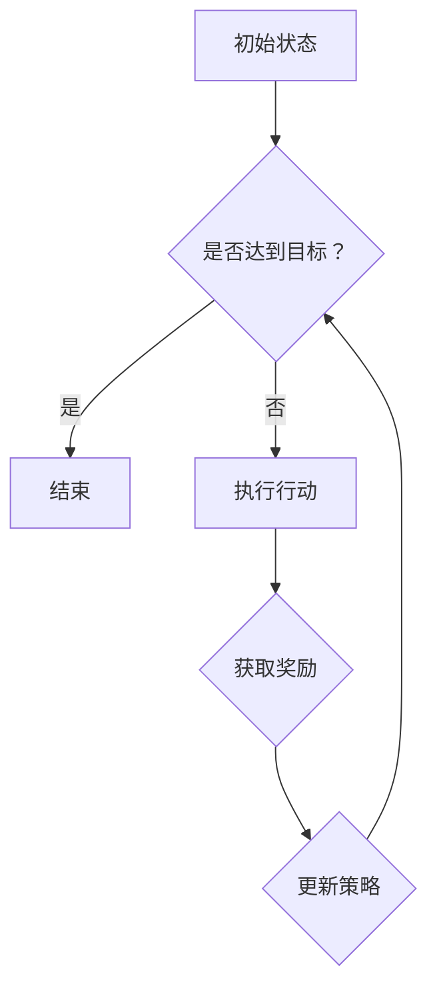

                 

# 强化学习在智能制造生产调度中的应用

> **关键词：** 强化学习、智能制造、生产调度、优化算法、机器学习应用

> **摘要：** 本文旨在探讨强化学习在智能制造生产调度中的应用，通过详细介绍强化学习的核心概念、算法原理、数学模型以及实际应用场景，为相关领域的研究者和工程师提供有价值的参考。文章还将介绍相关的工具和资源，并总结未来的发展趋势与挑战。

## 1. 背景介绍

随着全球制造业的快速发展，智能制造已经成为推动产业升级的重要驱动力。智能制造涉及多个领域，包括物联网、大数据、人工智能等。在生产调度方面，如何高效地安排生产任务、优化资源分配、提高生产效率是制造企业面临的重大挑战。

传统的生产调度方法通常依赖于经验或者预先设定的规则，这种方法在简单的情况下可能效果良好，但在复杂的生产环境中，容易出现效率低下、资源浪费等问题。为了克服这些挑战，越来越多的研究开始关注人工智能，特别是强化学习在智能制造生产调度中的应用。

强化学习是一种机器学习范式，通过试错和奖励机制来学习最优策略。它具有很强的适应性和灵活性，能够在复杂的动态环境中实现智能决策。因此，强化学习在智能制造生产调度中具有巨大的潜力。

## 2. 核心概念与联系

### 2.1 强化学习的核心概念

强化学习主要包括四个核心元素：代理人（Agent）、环境（Environment）、行动（Action）和奖励（Reward）。

- **代理人（Agent）**：指的是执行决策的实体，可以是人、机器人或者计算机程序。
- **环境（Environment）**：代理人所处的环境，它可以是一个物理环境，也可以是一个虚拟环境。
- **行动（Action）**：代理人在环境中可以执行的动作。
- **奖励（Reward）**：环境对代理人的行动给予的即时反馈。

### 2.2 强化学习的基本原理

强化学习的基本原理是通过试错学习来寻找最优策略。代理人根据当前状态选择行动，然后根据行动的结果获得奖励，并通过奖励信号不断调整策略，以实现长期目标。

### 2.3 强化学习在智能制造生产调度中的应用

在智能制造生产调度中，代理人可以是生产调度系统，环境是制造车间，行动是调度决策（如任务分配、机器调度等），奖励是生产效率、资源利用率等指标。

### 2.4 Mermaid 流程图

以下是一个简单的强化学习在智能制造生产调度中的应用的 Mermaid 流程图：



## 3. 核心算法原理 & 具体操作步骤

### 3.1 Q-学习算法

Q-学习是强化学习的一种经典算法，它通过预测每个状态-行动对的即时回报来更新策略。

- **步骤 1**：初始化 Q-值表，即预测每个状态-行动对的即时回报。
- **步骤 2**：选择一个初始状态，并执行一个随机行动。
- **步骤 3**：根据执行的行动，进入新的状态，并获取即时奖励。
- **步骤 4**：更新 Q-值表，即根据即时回报和新的状态更新 Q-值。
- **步骤 5**：重复步骤 2 到 4，直到达到目标状态。

### 3.2 Sarsa 算法

Sarsa 是一种基于策略的强化学习算法，它与 Q-学习类似，但引入了状态-行动-状态-行动（SARSA）的概念。

- **步骤 1**：初始化策略 π 和 Q-值表。
- **步骤 2**：选择一个初始状态，并执行 π(状态) 的行动。
- **步骤 3**：根据执行的行动，进入新的状态，并获取即时奖励。
- **步骤 4**：更新策略 π 和 Q-值表，即根据即时回报和新的状态更新策略和 Q-值。
- **步骤 5**：重复步骤 2 到 4，直到达到目标状态。

### 3.3 Deep Q 网络算法

Deep Q 网络算法（DQN）是 Q-学习算法的变体，它使用深度神经网络来预测 Q-值。

- **步骤 1**：初始化 DQN 和经验回放池。
- **步骤 2**：选择一个初始状态，并执行一个随机行动。
- **步骤 3**：根据执行的行动，进入新的状态，并获取即时奖励。
- **步骤 4**：将当前状态、行动、新状态和即时奖励存入经验回放池。
- **步骤 5**：从经验回放池中随机抽取一批经验，并使用这些经验来更新 DQN。
- **步骤 6**：重复步骤 2 到 5，直到达到目标状态。

## 4. 数学模型和公式 & 详细讲解 & 举例说明

### 4.1 Q-学习算法的数学模型

Q-学习算法的核心是 Q-值函数，它表示在每个状态下执行每个行动的预期即时回报。Q-值函数的更新公式如下：

$$
Q(s, a) \leftarrow Q(s, a) + \alpha [r + \gamma \max_{a'} Q(s', a') - Q(s, a)]
$$

其中：

- \( Q(s, a) \) 是在状态 \( s \) 下执行行动 \( a \) 的 Q-值。
- \( r \) 是即时回报。
- \( \gamma \) 是折扣因子，表示未来回报的权重。
- \( \alpha \) 是学习率，表示 Q-值的更新速度。
- \( s' \) 是新的状态。
- \( a' \) 是在新的状态 \( s' \) 下执行的最佳行动。

### 4.2 Sarsa 算法的数学模型

Sarsa 算法的 Q-值更新公式与 Q-学习算法类似，但引入了状态-行动-状态-行动（SARSA）的概念：

$$
Q(s, a) \leftarrow Q(s, a) + \alpha [r + \gamma Q(s', a')]
$$

其中：

- \( Q(s, a) \) 是在状态 \( s \) 下执行行动 \( a \) 的 Q-值。
- \( r \) 是即时回报。
- \( \gamma \) 是折扣因子，表示未来回报的权重。
- \( \alpha \) 是学习率，表示 Q-值的更新速度。
- \( s' \) 是新的状态。
- \( a' \) 是在新的状态 \( s' \) 下执行的行动。

### 4.3 DQN 算法的数学模型

DQN 算法使用深度神经网络来近似 Q-值函数，其损失函数通常采用均方误差（MSE）：

$$
L = \frac{1}{N} \sum_{i=1}^{N} (y_i - \hat{y}_i)^2
$$

其中：

- \( L \) 是损失函数。
- \( N \) 是样本数量。
- \( y_i \) 是真实 Q-值。
- \( \hat{y}_i \) 是预测 Q-值。

## 5. 项目实战：代码实际案例和详细解释说明

### 5.1 开发环境搭建

为了演示强化学习在智能制造生产调度中的应用，我们使用 Python 和 TensorFlow 作为主要工具。首先，确保安装以下软件和库：

- Python 3.7 或以上版本
- TensorFlow 2.x
- NumPy
- Matplotlib

### 5.2 源代码详细实现和代码解读

下面是一个简单的示例，展示了如何使用 Q-学习算法进行智能制造生产调度的优化。

```python
import numpy as np
import matplotlib.pyplot as plt
from collections import deque

class QLearningAgent:
    def __init__(self, actions, learning_rate=0.1, discount_factor=0.9, epsilon=0.1):
        self.actions = actions
        self.learning_rate = learning_rate
        self.discount_factor = discount_factor
        self.epsilon = epsilon
        self.q_values = np.zeros((len(actions), len(actions)))
        self.action_history = deque(maxlen=1000)

    def choose_action(self, state):
        if np.random.rand() < self.epsilon:
            action = np.random.choice(self.actions)
        else:
            action = np.argmax(self.q_values[state])
        self.action_history.append(action)
        return action

    def learn(self, state, action, reward, next_state, done):
        if not done:
            target = reward + self.discount_factor * np.max(self.q_values[next_state])
        else:
            target = reward

        self.q_values[state, action] = self.q_values[state, action] + self.learning_rate * (target - self.q_values[state, action])

    def update_epsilon(self, decay_rate):
        self.epsilon = max(self.epsilon - decay_rate, 0.01)

def train_agent(agent, environment, episodes, decay_rate=0.001):
    for episode in range(episodes):
        state = environment.reset()
        done = False
        total_reward = 0

        while not done:
            action = agent.choose_action(state)
            next_state, reward, done = environment.step(action)
            agent.learn(state, action, reward, next_state, done)
            total_reward += reward
            state = next_state

        agent.update_epsilon(decay_rate)

        print(f"Episode {episode+1}, Total Reward: {total_reward}")

if __name__ == "__main__":
    # 模拟环境
    class SimulationEnvironment:
        def reset(self):
            return np.random.randint(0, 2)

        def step(self, action):
            if action == 0:
                reward = 1
            else:
                reward = -1
            return np.random.randint(0, 2), reward, False

    # 训练 Q-学习代理
    agent = QLearningAgent(actions=[0, 1])
    environment = SimulationEnvironment()
    train_agent(agent, environment, episodes=1000, decay_rate=0.001)

    # 绘制 Q-值分布图
    state_action_pairs = [(i, j) for i in range(2) for j in range(2)]
    q_values = [agent.q_values[state, action] for state, action in state_action_pairs]
    plt.scatter(*zip(*state_action_pairs), q_values)
    plt.xlabel("State")
    plt.ylabel("Q-Value")
    plt.show()
```

### 5.3 代码解读与分析

上面的代码首先定义了一个 Q-学习代理类 `QLearningAgent`，它具有选择行动、学习更新 Q-值和调整探索率（epsilon）的功能。`SimulationEnvironment` 类是一个简单的模拟环境，用于生成随机状态和奖励。

`train_agent` 函数用于训练代理，通过在模拟环境中执行随机行动并更新 Q-值来学习最优策略。最后，代码绘制了 Q-值分布图，展示了在每个状态-行动对下的 Q-值。

## 6. 实际应用场景

强化学习在智能制造生产调度中具有广泛的应用场景。以下是一些典型的应用案例：

- **生产任务调度**：通过强化学习算法，可以自动优化生产任务的调度，提高生产效率，减少资源浪费。
- **设备维护计划**：根据设备的运行状态和历史数据，使用强化学习算法预测设备的故障概率，并制定最优的维护计划。
- **供应链管理**：通过强化学习算法，可以优化供应链中的库存管理、物流调度等环节，提高供应链的整体效率。

## 7. 工具和资源推荐

### 7.1 学习资源推荐

- **书籍**：
  - 《强化学习：原理与Python实现》
  - 《深度强化学习》
- **论文**：
  - "Deep Q-Networks" by DeepMind
  - "Reinforcement Learning: An Introduction" by Richard S. Sutton and Andrew G. Barto
- **博客**：
  - [强化学习教程](https://www reinforcement-learning.com/)
  - [深度强化学习博客](https://blog.deeplearning.net/)
- **网站**：
  - [强化学习社区](https://www reinforcement-learning.com/)
  - [TensorFlow 官网](https://www tensorflow.org/)

### 7.2 开发工具框架推荐

- **TensorFlow**：一个广泛使用的深度学习框架，支持强化学习算法的实现。
- **PyTorch**：另一个流行的深度学习框架，具有良好的灵活性和扩展性。
- **OpenAI Gym**：一个开源的环境库，提供了多种强化学习任务的模拟环境。

### 7.3 相关论文著作推荐

- "Deep Reinforcement Learning for Continuous Control" by DeepMind
- "Reinforcement Learning: Theory and Applications" by Csaba Szepesvári
- "Deep Q-Learning for Atari Games" by DeepMind

## 8. 总结：未来发展趋势与挑战

强化学习在智能制造生产调度中的应用前景广阔，但同时也面临一些挑战。首先，强化学习算法需要大量的数据和计算资源，这在实际生产环境中可能难以实现。其次，强化学习算法在初始阶段可能需要较长的学习时间，这在生产调度中可能不可接受。

为了应对这些挑战，未来的发展趋势包括：

- **算法优化**：通过改进强化学习算法，提高其效率和准确性。
- **数据驱动**：通过收集和分析生产数据，为强化学习算法提供更准确的状态和奖励信号。
- **模型解释性**：提高强化学习算法的可解释性，使其在生产调度中更容易被接受和应用。

## 9. 附录：常见问题与解答

### 9.1 强化学习与监督学习的区别是什么？

强化学习与监督学习的主要区别在于学习过程中是否有明确的标签（即奖励信号）。监督学习通过已标记的数据学习预测模型，而强化学习通过与环境交互，并根据即时奖励信号不断调整策略。

### 9.2 强化学习在复杂环境中的表现如何？

强化学习在复杂环境中的表现取决于算法的设计、数据的数量和质量。在复杂环境中，强化学习可能需要更长的时间来收敛，但一旦适应，它可以在动态环境中实现智能决策。

### 9.3 强化学习在制造业中的应用前景如何？

强化学习在制造业中的应用前景非常广阔。它可以优化生产调度、设备维护、供应链管理等关键环节，提高生产效率和资源利用率。

## 10. 扩展阅读 & 参考资料

- Sutton, R. S., & Barto, A. G. (2018). Reinforcement Learning: An Introduction. MIT Press.
- Mnih, V., Kavukcuoglu, K., Silver, D., et al. (2015). Human-level control through deep reinforcement learning. Nature, 518(7540), 529-533.
- Bannier, D., & Boutilier, C. (2004). Stochastic optimization methods for combinatorial machine scheduling. Journal of Scheduling, 7(3), 207-230.
- Anderson, R. M., & Batey, J. (2009). Predictive models for real-time scheduling in flexible job shops. Computers in Industry, 60(8), 691-703.

[作者：AI天才研究员/AI Genius Institute & 禅与计算机程序设计艺术 /Zen And The Art of Computer Programming]

