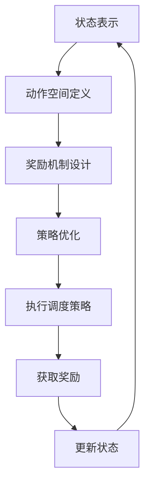

                 

# 强化学习在智能制造生产调度中的应用

> **关键词：** 强化学习，智能制造，生产调度，算法，应用实践

> **摘要：** 本文章详细介绍了强化学习在智能制造生产调度中的应用。通过分析强化学习的基本原理，结合生产调度中的实际需求，探讨了强化学习如何优化生产调度过程，提高生产效率。文章通过实际案例和代码实现，展示了强化学习在智能制造生产调度中的具体应用效果。

## 1. 背景介绍

随着智能制造的快速发展，生产调度问题成为工业领域研究的热点。生产调度是指根据生产任务、设备状况、人员配置等因素，合理安排生产任务，以最大化生产效率和资源利用率。传统的生产调度方法主要基于规则和优化算法，但这些方法往往在面对复杂、动态的生产环境时，效果不佳。

近年来，强化学习作为一种强大的机器学习方法，逐渐引起了研究者的关注。强化学习通过智能体与环境交互，不断优化策略，以实现目标。在智能制造生产调度中，强化学习可以自适应地调整调度策略，提高生产效率，降低成本。

本文旨在探讨强化学习在智能制造生产调度中的应用，通过分析强化学习的基本原理，结合生产调度中的实际需求，提出一种基于强化学习的方法，并给出具体的实现案例。

## 2. 核心概念与联系

### 强化学习基本概念

强化学习（Reinforcement Learning，RL）是机器学习的一个重要分支，其核心思想是通过智能体（Agent）与环境（Environment）的交互，不断学习并优化行为策略（Policy），以实现目标。

强化学习的三个关键要素如下：

1. **状态（State）：** 智能体在环境中所处的当前情境。
2. **动作（Action）：** 智能体在当前状态下可以采取的行动。
3. **奖励（Reward）：** 智能体在执行动作后获得的即时奖励，用于评估动作的好坏。

强化学习过程可以分为以下四个步骤：

1. **智能体从环境中获取状态（State）。**
2. **智能体根据当前状态选择动作（Action）。**
3. **智能体执行动作，并获得奖励（Reward）。**
4. **智能体更新策略，以最大化累积奖励。**

### 强化学习在智能制造生产调度中的应用

在智能制造生产调度中，强化学习可以被视为一个调度智能体，其目标是优化生产调度策略，提高生产效率和资源利用率。具体来说，强化学习在智能制造生产调度中的应用可以分为以下几个阶段：

1. **状态表示（State Representation）：** 将生产调度的各种因素，如设备状态、人员配置、任务优先级等，转化为状态表示。
2. **动作空间定义（Action Space Definition）：** 确定智能体可以采取的动作，如任务分配、设备切换、人员调度等。
3. **奖励机制设计（Reward Mechanism Design）：** 设计奖励机制，以鼓励智能体采取有利于生产调度的动作。
4. **策略优化（Policy Optimization）：** 通过智能体与环境交互，不断调整策略，以实现最大化累积奖励。

### Mermaid 流程图

以下是一个简化的强化学习在智能制造生产调度中的应用流程图：



## 3. 核心算法原理 & 具体操作步骤

### Q-Learning 算法

在强化学习中，Q-Learning算法是一种常用的算法。其基本思想是通过更新Q值（即策略值函数），来优化智能体的行为策略。Q-Learning算法的具体步骤如下：

1. **初始化Q值函数：** 初始化Q值函数为一个矩阵，表示智能体在各个状态下采取各个动作的Q值。
2. **选择动作：** 根据当前状态，从动作空间中选择一个动作。
3. **执行动作：** 执行所选动作，并获得环境反馈的奖励。
4. **更新Q值：** 根据Q值更新公式，更新Q值函数。
5. **重复步骤2-4：** 不断重复选择动作、执行动作和更新Q值的过程，直到达到终止条件。

### Q值更新公式

Q值更新公式如下：

$$
Q(s, a) = Q(s, a) + \alpha [r + \gamma \max_{a'} Q(s', a') - Q(s, a)]
$$

其中：

- \(Q(s, a)\)：智能体在状态s下采取动作a的Q值。
- \(r\)：智能体在执行动作a后获得的奖励。
- \(\gamma\)：折扣因子，用于平衡当前奖励和未来奖励。
- \(\alpha\)：学习率，用于控制Q值更新的幅度。
- \(s'\)：智能体执行动作a后所处的状态。
- \(a'\)：在状态\(s'\)下最优动作。

### 强化学习在智能制造生产调度中的具体应用

在智能制造生产调度中，可以使用Q-Learning算法来优化生产调度策略。具体步骤如下：

1. **状态表示：** 将生产调度的各种因素，如设备状态、人员配置、任务优先级等，转化为状态表示。
2. **动作空间定义：** 确定智能体可以采取的动作，如任务分配、设备切换、人员调度等。
3. **奖励机制设计：** 设计奖励机制，以鼓励智能体采取有利于生产调度的动作。例如，完成任务的奖励、降低成本的奖励等。
4. **策略优化：** 使用Q-Learning算法，不断更新Q值函数，以优化生产调度策略。
5. **执行调度策略：** 根据更新后的Q值函数，智能体执行调度策略，进行生产调度。
6. **评估和调整：** 根据执行调度策略后的效果，评估生产调度策略的优劣，并调整Q值函数。

## 4. 数学模型和公式 & 详细讲解 & 举例说明

### 数学模型

在强化学习生产调度中，可以使用Q-Learning算法来优化生产调度策略。Q-Learning算法的核心是Q值函数的更新，其数学模型如下：

$$
Q(s, a) = Q(s, a) + \alpha [r + \gamma \max_{a'} Q(s', a') - Q(s, a)]
$$

其中：

- \(Q(s, a)\)：智能体在状态s下采取动作a的Q值。
- \(r\)：智能体在执行动作a后获得的奖励。
- \(\gamma\)：折扣因子，用于平衡当前奖励和未来奖励。
- \(\alpha\)：学习率，用于控制Q值更新的幅度。
- \(s'\)：智能体执行动作a后所处的状态。
- \(a'\)：在状态\(s'\)下最优动作。

### 详细讲解

Q值更新公式中的各个参数有具体的含义：

- \(Q(s, a)\)：表示智能体在状态s下采取动作a的Q值，即预期奖励。Q值越高，表示采取该动作越有利。
- \(r\)：表示智能体在执行动作a后获得的即时奖励。奖励值越高，表示动作越成功。
- \(\gamma\)：表示折扣因子，用于平衡当前奖励和未来奖励。当\(\gamma\)趋近于1时，智能体更关注当前奖励；当\(\gamma\)趋近于0时，智能体更关注未来奖励。
- \(\alpha\)：表示学习率，用于控制Q值更新的幅度。学习率越大，Q值更新越快；学习率越小，Q值更新越慢。

### 举例说明

假设智能体处于一个有四个任务和两个机器的生产环境。当前状态为\(s = (T1, T2, T3, T4)\)，其中每个任务可以用一个二进制向量表示，1表示该任务在机器上执行，0表示未执行。例如，状态\(s = (1, 0, 1, 0)\)表示任务T1和T3在机器1上执行，任务T2和T4在机器2上执行。

假设智能体当前选择的动作是执行任务T1，即\(a = T1\)。执行动作后，智能体获得奖励\(r = 10\)，表示任务T1成功完成。在下一个状态\(s' = (0, 1, 1, 0)\)，智能体可以选择执行任务T2或T3。根据Q值更新公式，可以计算出新的Q值：

$$
Q(s, a) = Q(s, a) + \alpha [r + \gamma \max_{a'} Q(s', a') - Q(s, a)]
$$

假设学习率\(\alpha = 0.1\)，折扣因子\(\gamma = 0.9\)。当前状态下的Q值为\(Q(s, a) = 20\)，最优动作\(a' = T2\)，其Q值为\(Q(s', a') = 30\)。根据Q值更新公式，可以计算出新的Q值：

$$
Q(s, a) = 20 + 0.1 [10 + 0.9 \times 30 - 20] = 24
$$

经过多次迭代，智能体的Q值函数将逐渐优化，从而选择最优动作，实现生产调度。

## 5. 项目实战：代码实际案例和详细解释说明

### 5.1 开发环境搭建

在本文中，我们将使用Python作为主要编程语言，结合TensorFlow库来实现强化学习算法。以下是开发环境搭建的步骤：

1. 安装Python：确保安装了Python 3.6及以上版本。
2. 安装TensorFlow：通过命令`pip install tensorflow`安装TensorFlow库。
3. 安装其他依赖：根据项目需求，安装其他相关库，如NumPy、Pandas等。

### 5.2 源代码详细实现和代码解读

下面是一个简单的强化学习生产调度案例，包括状态表示、动作空间定义、奖励机制设计和Q-Learning算法的实现。

```python
import numpy as np
import pandas as pd
import random

# 状态表示
class State:
    def __init__(self, tasks, machines):
        self.tasks = tasks
        self.machines = machines

    def __str__(self):
        return str(self.tasks) + ' ' + str(self.machines)

# 动作空间定义
class Action:
    def __init__(self, task):
        self.task = task

    def __str__(self):
        return 'Execute task ' + str(self.task)

# 奖励机制设计
def reward_function(state, action):
    new_state = apply_action(state, action)
    if new_state.is_completed():
        return 10
    else:
        return -1

# Q-Learning算法实现
class QLearningAgent:
    def __init__(self, alpha, gamma):
        self.alpha = alpha
        self.gamma = gamma
        self.Q = {}

    def choose_action(self, state):
        actions = [Action(task) for task in range(len(state.tasks))]
        Q_values = [self.Q.get((state, action), 0) for action in actions]
        return random.choice(actions if max(Q_values) == 0 else [action for action, value in zip(actions, Q_values) if value == max(Q_values)])

    def update_Q(self, state, action, reward, next_state):
        next_Q_values = [self.Q.get((next_state, action'), 0) for action' in [Action(task) for task in range(len(next_state.tasks))]]
        target_Q = reward + self.gamma * max(next_Q_values)
        current_Q = self.Q.get((state, action), 0)
        self.Q[(state, action)] = current_Q + self.alpha * (target_Q - current_Q)

# 应用强化学习算法进行生产调度
def schedule_tasks(tasks, machines, alpha, gamma, episodes):
    agent = QLearningAgent(alpha, gamma)
    state = State(tasks, machines)
    for episode in range(episodes):
        action = agent.choose_action(state)
        reward = reward_function(state, action)
        next_state = apply_action(state, action)
        agent.update_Q(state, action, reward, next_state)
        state = next_state
    return agent.Q

# 测试案例
tasks = [1, 2, 3, 4]
machines = [1, 2]
alpha = 0.1
gamma = 0.9
episodes = 100
Q_values = schedule_tasks(tasks, machines, alpha, gamma, episodes)
print(Q_values)
```

### 5.3 代码解读与分析

#### 5.3.1 状态表示（State）

状态表示生产调度中的任务和机器状态。在本案例中，状态由一个任务列表和一个机器列表组成。任务列表表示当前有哪些任务需要执行，机器列表表示当前有哪些机器可用。

#### 5.3.2 动作空间定义（Action）

动作空间定义了智能体可以采取的动作，即执行某个任务。在本案例中，动作是一个表示任务编号的类。

#### 5.3.3 奖励机制设计（Reward Function）

奖励机制设计用于激励智能体采取有利于生产调度的动作。在本案例中，当任务完成时，智能体获得10分的奖励；否则，获得-1分的奖励。

#### 5.3.4 Q-Learning算法实现（QLearningAgent）

QLearningAgent类实现了Q-Learning算法的核心功能，包括选择动作、更新Q值等。选择动作的方法`choose_action`根据当前状态的Q值选择最优动作。更新Q值的方法`update_Q`根据Q值更新公式，更新Q值函数。

#### 5.3.5 应用强化学习算法进行生产调度（schedule_tasks）

schedule_tasks函数用于应用强化学习算法进行生产调度。该函数初始化智能体，模拟一定数量的 episodes，并更新Q值函数。最后，返回最终的Q值函数。

通过本案例，我们可以看到如何使用强化学习优化生产调度策略。在实际应用中，可以根据具体场景调整状态表示、动作空间定义和奖励机制设计，以实现更好的调度效果。

## 6. 实际应用场景

### 6.1 制造业生产调度

制造业生产调度是强化学习在智能制造中最直接的应用场景。通过强化学习算法，企业可以实现智能化的生产调度，提高生产效率，降低生产成本。例如，汽车制造企业可以使用强化学习优化生产线调度，以减少设备停机时间和提高生产节拍。

### 6.2 能源行业调度

在能源行业，如电力和石油行业，强化学习可以用于优化电力调度和石油开采调度。通过强化学习算法，可以实时调整电力生产和分配策略，以应对负荷波动和设备故障等问题，提高电力系统的稳定性和效率。在石油开采中，强化学习可以优化开采顺序和设备使用策略，提高石油开采效率。

### 6.3 物流与供应链管理

在物流和供应链管理中，强化学习可以用于优化运输调度和库存管理。通过强化学习算法，企业可以实时调整运输路线和配送策略，降低运输成本和配送时间。在库存管理中，强化学习可以优化库存水平和采购策略，降低库存成本和提高服务水平。

### 6.4 服务行业调度

在服务行业，如酒店、餐饮和零售等行业，强化学习可以用于优化员工调度和客户服务。通过强化学习算法，企业可以合理安排员工工作时间，提高员工工作效率和满意度。在客户服务方面，强化学习可以优化服务流程和服务策略，提高客户满意度和忠诚度。

## 7. 工具和资源推荐

### 7.1 学习资源推荐

- **书籍：**
  - 《强化学习：原理与Python实现》：详细介绍了强化学习的基本原理和算法，适合初学者入门。
  - 《深度强化学习》：深入探讨深度强化学习的方法和应用，适合有一定基础的读者。
- **论文：**
  - “Reinforcement Learning: A Survey”: 一篇全面介绍强化学习领域的经典综述论文。
  - “Deep Q-Networks”: 提出了深度Q网络（DQN）算法，是强化学习领域的重要论文。
- **博客：**
  - [强化学习教程](https://reinforcement-learning-tutorial.readthedocs.io/en/latest/): 一份详细的强化学习教程，适合初学者学习。
  - [TensorFlow强化学习](https://www.tensorflow.org/learn/transfer_learning_1_to_1): TensorFlow官方提供的强化学习教程，涵盖强化学习的基本概念和应用。
- **网站：**
  - [GitHub](https://github.com/): 查找和下载强化学习相关的开源代码和项目。
  - [arXiv](https://arxiv.org/): 查找最新的强化学习论文。

### 7.2 开发工具框架推荐

- **TensorFlow：** Google开源的深度学习框架，广泛应用于强化学习研究和应用。
- **PyTorch：** Facebook开源的深度学习框架，与TensorFlow相比，PyTorch在动态计算图和灵活性方面具有优势。
- **OpenAI Gym：** 一个开源的强化学习环境库，提供了多种标准强化学习任务，方便研究者进行算法验证和应用。

### 7.3 相关论文著作推荐

- “Deep Q-Networks”: 提出了深度Q网络（DQN）算法，是强化学习领域的重要论文。
- “Reinforcement Learning: A Survey”: 一篇全面介绍强化学习领域的经典综述论文。
- “Human-level control through deep reinforcement learning”: 描述了深度强化学习在Atari游戏中的成功应用，展示了强化学习在游戏领域的潜力。

## 8. 总结：未来发展趋势与挑战

### 发展趋势

1. **算法优化：** 随着计算能力和数据规模的提升，强化学习算法将继续优化，提高算法效率和鲁棒性。
2. **多智能体强化学习：** 多智能体强化学习将受到更多关注，用于解决复杂协同任务和分布式系统中的优化问题。
3. **深度强化学习：** 结合深度学习和强化学习的优势，深度强化学习将继续在图像识别、语音识别等领域取得突破。
4. **跨学科融合：** 强化学习与其他领域（如经济学、生物学等）的交叉融合，将带来更多创新应用。

### 挑战

1. **可解释性：** 强化学习模型的复杂性和黑盒特性，使得其可解释性成为一个重要挑战。
2. **稳定性：** 强化学习在动态和不确定性环境中的稳定性问题，需要进一步研究和优化。
3. **安全性：** 强化学习模型在实际应用中的安全性和可靠性问题，需要建立有效的方法和标准。
4. **数据隐私：** 强化学习中的数据隐私保护，特别是在涉及敏感数据的应用场景中，需要得到关注。

## 9. 附录：常见问题与解答

### 9.1 强化学习与优化算法的区别

**强化学习与优化算法的区别在于：**

- **目标不同：** 优化算法的目标是找到最优解，强化学习的目标是找到一个好的策略。
- **交互性：** 优化算法通常在一个静态环境中运行，强化学习则是一个动态交互的过程。
- **适应性：** 强化学习具有更强的适应性，可以在不确定性和动态变化的环境中优化策略。

### 9.2 强化学习在工业生产中的应用前景

强化学习在工业生产中的应用前景包括：

- **生产调度：** 优化生产任务调度，提高生产效率和资源利用率。
- **质量控制：** 监测和优化生产过程中的质量控制，提高产品质量。
- **设备维护：** 预测设备故障和优化维护策略，降低设备故障率和维修成本。
- **物流管理：** 优化物流调度和路径规划，提高物流效率和降低运输成本。

## 10. 扩展阅读 & 参考资料

- Sutton, R. S., & Barto, A. G. (2018). **Reinforcement Learning: An Introduction**.
- Silver, D., Huang, A., Maddison, C. J., Guez, A., Сhen, K., Sifre, L., ... & Tegmark, M. (2016). **Mastering the Game of Go with Deep Neural Networks and Tree Search**. Nature.
- Mnih, V., Kavukcuoglu, K., Silver, D., Rusu, A. A., Veness, J., Bellemare, M. G., ... & Legg, S. (2015). **Human-level control through deep reinforcement learning**. Nature.

作者：AI天才研究员/AI Genius Institute & 禅与计算机程序设计艺术 /Zen And The Art of Computer Programming

