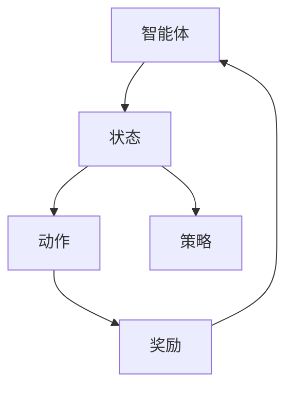

                 

### 背景介绍

强化学习（Reinforcement Learning，简称RL）是机器学习领域的一个重要分支，它通过智能体（agent）与环境（environment）的交互，不断学习并优化策略（policy），以实现最大化累积奖励（cumulative reward）的目标。强化学习自1950年代提出以来，经过几十年的发展，已经成为人工智能领域的一个核心研究方向。近年来，随着深度学习（Deep Learning）和计算机硬件性能的提升，强化学习在智能博弈、对抗搜索等领域取得了显著的进展。

在智能博弈领域，强化学习已经成为许多经典游戏（如围棋、国际象棋）和学习新游戏的强大工具。AlphaGo在2016年击败世界围棋冠军李世石，展示了强化学习在复杂游戏中的强大潜力。此外，强化学习还被应用于电子竞技游戏，如Dota 2和StarCraft 2，取得了令人瞩目的成绩。这些应用不仅提高了游戏的智能化水平，也推动了人工智能技术的发展。

对抗搜索（Adversarial Search）是强化学习在棋类游戏和策略游戏中的重要应用领域。它通过两个智能体之间的对抗性互动，模拟真实的游戏环境，从而训练智能体在复杂策略空间中找到最优解。这种方法不仅适用于棋类游戏，还被广泛应用于其他领域，如计算机视觉、自然语言处理和自动驾驶。

本文将围绕强化学习在智能博弈、对抗搜索等领域的理论进展与应用，进行深入探讨。首先，我们将介绍强化学习的基本概念和主要算法；接着，我们将分析强化学习在智能博弈中的成功案例；然后，我们将探讨强化学习在对抗搜索中的应用及其挑战；最后，我们将总结强化学习的未来发展趋势与挑战。

### 核心概念与联系

强化学习中的核心概念主要包括：智能体（Agent）、环境（Environment）、状态（State）、动作（Action）、奖励（Reward）和策略（Policy）。

1. **智能体（Agent）**：强化学习中的决策主体，它可以通过观察环境的状态，执行动作，并从环境中获得奖励，以实现最大化累积奖励的目标。
2. **环境（Environment）**：智能体所处的环境，可以看作是一个动态变化的系统，它会根据智能体的动作产生新的状态。
3. **状态（State）**：描述智能体当前所处的情境，通常是一个多维向量。
4. **动作（Action）**：智能体在当前状态下可以选择执行的动作，也是一个多维向量。
5. **奖励（Reward）**：环境对智能体动作的反馈，通常用来衡量动作的好坏，是一个实数值。
6. **策略（Policy）**：智能体在给定状态下选择动作的规则，通常是一个概率分布。

强化学习的主要目标是找到一个最优策略，使得智能体能够在长期内获得最大的累积奖励。这个过程通常被称为策略优化。

为了更好地理解强化学习的原理和架构，我们可以使用Mermaid流程图来描述其基本概念和关系。以下是一个简单的Mermaid流程图：



在上述流程图中，智能体（A）首先感知状态（B），然后根据策略（E）选择动作（C），执行动作后，环境会给予奖励（D）。这个奖励将指导智能体调整其策略，以优化其长期表现。

强化学习的基本架构可以看作是一个迭代过程，其中智能体不断地与环境交互，通过试错（trial-and-error）来学习最优策略。这个过程通常包括以下几个步骤：

1. **初始化**：智能体初始化策略、价值函数或模型。
2. **感知状态**：智能体从环境中感知当前状态。
3. **选择动作**：智能体根据当前状态和策略选择动作。
4. **执行动作**：智能体在环境中执行所选动作。
5. **获取奖励**：环境根据智能体的动作给予奖励。
6. **更新策略**：智能体根据获得的奖励更新策略。
7. **重复迭代**：智能体不断重复上述步骤，以优化其策略。

这种迭代过程是强化学习的核心，它使得智能体能够在不断变化的环境中学习并优化行为。

### 核心算法原理 & 具体操作步骤

强化学习中的核心算法包括值函数方法（Value-Based Methods）和策略梯度方法（Policy Gradient Methods）。这些方法通过不同的方式来学习最优策略，以实现最大化累积奖励的目标。

#### 值函数方法

值函数方法通过学习状态值函数（State-Value Function）或动作值函数（Action-Value Function）来评估状态或动作的好坏。其中，状态值函数 \( V^*(s) \) 表示在状态 \( s \) 下采取最优策略所能获得的期望累积奖励，动作值函数 \( Q^*(s, a) \) 表示在状态 \( s \) 下执行动作 \( a \) 所能获得的期望累积奖励。

**Q-Learning**

Q-Learning是一种典型的值函数方法，它通过更新动作值函数来学习最优策略。具体步骤如下：

1. **初始化**：初始化动作值函数 \( Q(s, a) \) 和探索率 \( \epsilon \)。
2. **感知状态**：智能体从环境中感知当前状态 \( s \)。
3. **选择动作**：在当前状态下，智能体以概率 \( 1 - \epsilon \) 选择当前最优动作，以概率 \( \epsilon / (n - 1) \) 选择其他动作，其中 \( n \) 是动作的数量。
4. **执行动作**：智能体在环境中执行所选动作，并获取奖励 \( r \) 和下一个状态 \( s' \)。
5. **更新动作值函数**：使用以下公式更新动作值函数：
   \[
   Q(s, a) \leftarrow Q(s, a) + \alpha [r + \gamma \max_{a'} Q(s', a') - Q(s, a)]
   \]
   其中，\( \alpha \) 是学习率，\( \gamma \) 是折扣因子。
6. **重复迭代**：智能体不断重复上述步骤，以优化其动作值函数。

**SARSA**

SARSA（State-Action-Reward-State-Action）是基于值函数方法的另一种算法，它使用实际经验 \( (s, a, r, s', a') \) 来更新动作值函数。具体步骤如下：

1. **初始化**：初始化动作值函数 \( Q(s, a) \) 和探索率 \( \epsilon \)。
2. **感知状态**：智能体从环境中感知当前状态 \( s \)。
3. **选择动作**：在当前状态下，智能体以概率 \( 1 - \epsilon \) 选择当前最优动作，以概率 \( \epsilon / (n - 1) \) 选择其他动作，其中 \( n \) 是动作的数量。
4. **执行动作**：智能体在环境中执行所选动作，并获取奖励 \( r \) 和下一个状态 \( s' \)。
5. **更新动作值函数**：使用以下公式更新动作值函数：
   \[
   Q(s, a) \leftarrow Q(s, a) + \alpha [r + \gamma Q(s', a') - Q(s, a)]
   \]
   其中，\( \alpha \) 是学习率，\( \gamma \) 是折扣因子。
6. **重复迭代**：智能体不断重复上述步骤，以优化其动作值函数。

#### 策略梯度方法

策略梯度方法直接优化策略本身，而不是通过值函数来间接优化。这种方法的主要目标是最大化策略的期望累积奖励。

**REINFORCE**

REINFORCE（Monte Carlo Policy Gradient）是一种策略梯度方法，它使用蒙特卡洛（Monte Carlo）方法来估计策略的梯度。具体步骤如下：

1. **初始化**：初始化策略参数 \( \theta \) 和学习率 \( \alpha \)。
2. **感知状态**：智能体从环境中感知当前状态 \( s \)。
3. **选择动作**：根据当前状态和策略参数选择动作 \( a \)。
4. **执行动作**：智能体在环境中执行所选动作，并获取奖励 \( r \) 和下一个状态 \( s' \)。
5. **更新策略参数**：使用以下公式更新策略参数：
   \[
   \theta \leftarrow \theta + \alpha \sum_{t} \nabla_{\theta} \log \pi(s_t, a_t; \theta)
   \]
   其中，\( \pi(s_t, a_t; \theta) \) 是策略参数为 \( \theta \) 时的策略概率，\( \nabla_{\theta} \log \pi(s_t, a_t; \theta) \) 是策略梯度。
6. **重复迭代**：智能体不断重复上述步骤，以优化其策略。

**PPO（Proximal Policy Optimization）**

PPO（Proximal Policy Optimization）是一种改进的策略梯度方法，它通过优化策略的概率分布来提高收敛速度和稳定性。PPO使用两个策略概率分布 \( \pi_{\theta} \) 和 \( \pi_{old} \) 来更新策略参数 \( \theta \)。具体步骤如下：

1. **初始化**：初始化策略参数 \( \theta \) 和学习率 \( \alpha \)。
2. **感知状态**：智能体从环境中感知当前状态 \( s \)。
3. **选择动作**：根据当前状态和策略参数选择动作 \( a \)。
4. **执行动作**：智能体在环境中执行所选动作，并获取奖励 \( r \) 和下一个状态 \( s' \)。
5. **计算优势函数**：计算优势函数 \( A(s, a) = G - V(s) \)，其中 \( G \) 是累积奖励，\( V(s) \) 是状态值函数。
6. **更新策略参数**：使用以下公式更新策略参数：
   \[
   \theta \leftarrow \theta + \alpha A(s, a) \nabla_{\theta} \log \pi(s, a; \theta)
   \]
   其中，\( \alpha \) 是学习率，\( \nabla_{\theta} \log \pi(s, a; \theta) \) 是策略梯度。
7. **重复迭代**：智能体不断重复上述步骤，以优化其策略。

### 数学模型和公式 & 详细讲解 & 举例说明

在强化学习中，数学模型和公式起到了至关重要的作用。这些模型和公式不仅帮助我们理解强化学习的原理，还为算法的设计和实现提供了理论基础。以下将详细介绍几个关键数学模型和公式，并配合具体例子进行说明。

#### 基本概念

1. **状态值函数（State-Value Function）**：状态值函数 \( V^*(s) \) 表示在状态 \( s \) 下采取最优策略所能获得的期望累积奖励。
2. **动作值函数（Action-Value Function）**：动作值函数 \( Q^*(s, a) \) 表示在状态 \( s \) 下执行动作 \( a \) 所能获得的期望累积奖励。
3. **策略（Policy）**：策略 \( \pi(s, a; \theta) \) 表示在状态 \( s \) 下选择动作 \( a \) 的概率分布。

#### 值函数方法

1. **Q-Learning公式**

Q-Learning算法通过更新动作值函数来学习最优策略。其核心公式如下：

$$
Q(s, a) \leftarrow Q(s, a) + \alpha [r + \gamma \max_{a'} Q(s', a') - Q(s, a)]
$$

其中：
- \( Q(s, a) \) 是当前的动作值函数估计。
- \( r \) 是即时奖励。
- \( \gamma \) 是折扣因子，用来平衡即时奖励和未来奖励。
- \( \max_{a'} Q(s', a') \) 是在下一个状态 \( s' \) 下选择最优动作的值函数。
- \( \alpha \) 是学习率。

**例子**

假设智能体在状态 \( s = 0 \) 下选择动作 \( a = 1 \)，并获得即时奖励 \( r = 10 \)。在下一个状态 \( s' = 1 \) 下，最优动作的值函数为 \( Q(s', a') = 20 \)。学习率 \( \alpha = 0.1 \)，折扣因子 \( \gamma = 0.9 \)。则更新后的动作值函数为：

$$
Q(0, 1) \leftarrow Q(0, 1) + 0.1 [10 + 0.9 \times 20 - Q(0, 1)]
$$

解这个方程，得到 \( Q(0, 1) \approx 18.2 \)。

2. **SARSA公式**

SARSA算法使用实际经验 \( (s, a, r, s', a') \) 来更新动作值函数。其核心公式如下：

$$
Q(s, a) \leftarrow Q(s, a) + \alpha [r + \gamma Q(s', a') - Q(s, a)]
$$

**例子**

假设智能体在状态 \( s = 0 \) 下选择动作 \( a = 1 \)，并获得即时奖励 \( r = 10 \)。在下一个状态 \( s' = 1 \) 下，智能体选择动作 \( a' = 0 \)，下一个状态 \( s'' = 2 \)。在状态 \( s'' \) 下，最优动作的值函数为 \( Q(s'', a'') = 15 \)。学习率 \( \alpha = 0.1 \)，折扣因子 \( \gamma = 0.9 \)。则更新后的动作值函数为：

$$
Q(0, 1) \leftarrow Q(0, 1) + 0.1 [10 + 0.9 \times 15 - Q(0, 1)]
$$

解这个方程，得到 \( Q(0, 1) \approx 17.35 \)。

#### 策略梯度方法

1. **REINFORCE公式**

REINFORCE算法通过优化策略的概率分布来更新策略参数。其核心公式如下：

$$
\theta \leftarrow \theta + \alpha \sum_{t} \nabla_{\theta} \log \pi(s_t, a_t; \theta)
$$

其中：
- \( \theta \) 是策略参数。
- \( \log \pi(s_t, a_t; \theta) \) 是策略概率的对数。
- \( \nabla_{\theta} \log \pi(s_t, a_t; \theta) \) 是策略梯度。

**例子**

假设策略参数为 \( \theta = 1 \)，智能体在状态 \( s = 0 \) 下选择动作 \( a = 1 \)，策略概率 \( \pi(s, a; \theta) = 0.5 \)。学习率 \( \alpha = 0.1 \)。则更新后的策略参数为：

$$
\theta \leftarrow \theta + 0.1 \nabla_{\theta} \log \pi(s, a; \theta)
$$

由于 \( \log \pi(s, a; \theta) = \log 0.5 \)，所以 \( \nabla_{\theta} \log \pi(s, a; \theta) = -1 \)。则更新后的策略参数为：

$$
\theta \leftarrow 1 + 0.1 \times (-1) = 0.9
$$

2. **PPO公式**

PPO（Proximal Policy Optimization）算法通过优化策略的概率分布来更新策略参数。其核心公式如下：

$$
\theta \leftarrow \theta + \alpha A(s, a) \nabla_{\theta} \log \pi(s, a; \theta)
$$

其中：
- \( A(s, a) \) 是优势函数。
- \( \log \pi(s, a; \theta) \) 是策略概率的对数。
- \( \nabla_{\theta} \log \pi(s, a; \theta) \) 是策略梯度。

**例子**

假设策略参数为 \( \theta = 1 \)，智能体在状态 \( s = 0 \) 下选择动作 \( a = 1 \)，策略概率 \( \pi(s, a; \theta) = 0.5 \)。优势函数 \( A(s, a) = 10 \)，学习率 \( \alpha = 0.1 \)。则更新后的策略参数为：

$$
\theta \leftarrow \theta + 0.1 \times 10 \nabla_{\theta} \log \pi(s, a; \theta)
$$

由于 \( \log \pi(s, a; \theta) = \log 0.5 \)，所以 \( \nabla_{\theta} \log \pi(s, a; \theta) = -1 \)。则更新后的策略参数为：

$$
\theta \leftarrow 1 + 0.1 \times 10 \times (-1) = -0.9
$$

### 项目实战：代码实际案例和详细解释说明

在本节中，我们将通过一个简单的项目实战，展示如何使用Python实现强化学习算法，并对其代码进行详细解释说明。

#### 项目背景

我们假设一个简单的环境，其中智能体在两个状态之间进行选择，每个状态对应两种动作。我们的目标是训练智能体在长期内选择能够获得最大累积奖励的动作。

#### 开发环境搭建

首先，我们需要安装Python和相关的库。以下是安装命令：

```bash
pip install numpy
pip install matplotlib
```

#### 源代码详细实现和代码解读

以下是项目的源代码：

```python
import numpy as np
import matplotlib.pyplot as plt

# 参数设置
learning_rate = 0.1
gamma = 0.9
epsilon = 0.1
epochs = 1000

# 状态和动作数量
num_states = 2
num_actions = 2

# 初始化动作值函数
Q = np.zeros((num_states, num_actions))

# Q-Learning算法实现
def q_learning(s, a):
    r = 0
    if a == 0:
        r = 1 if s == 0 else -1
    elif a == 1:
        r = -1 if s == 0 else 1
    s_prime = (s + 1) % num_states
    Q[s, a] = Q[s, a] + learning_rate * (r + gamma * np.max(Q[s_prime, :]) - Q[s, a])
    return s_prime, Q

# 主函数
def main():
    rewards = []
    for epoch in range(epochs):
        s = np.random.randint(0, num_states)
        s_prime = s
        while s_prime == s:
            s_prime = np.random.randint(0, num_states)
        
        action = np.random.choice(num_actions, p=[1 - epsilon, epsilon])
        s_prime, Q = q_learning(s, action)
        rewards.append(r)
        s = s_prime
    
    avg_reward = sum(rewards) / len(rewards)
    rewards = [r * gamma**i for i, r in enumerate(rewards)]
    avg_reward = sum(rewards) / epochs
    print(f"Average reward after {epoch} epochs: {avg_reward}")
    
    plt.plot(range(epochs), rewards)
    plt.xlabel("Epochs")
    plt.ylabel("Reward")
    plt.show()

if __name__ == "__main__":
    main()
```

#### 代码解读与分析

1. **参数设置**

我们首先设置了学习率、折扣因子和探索率等参数。这些参数将影响算法的性能和收敛速度。

2. **状态和动作数量**

我们定义了状态和动作的数量。在本例中，状态和动作的数量都是2。

3. **初始化动作值函数**

我们初始化了一个二维数组 \( Q \)，用于存储动作值函数的估计值。

4. **Q-Learning算法实现**

`q_learning` 函数实现了Q-Learning算法的核心逻辑。它接收当前状态 \( s \) 和动作 \( a \)，执行动作，并返回下一个状态 \( s' \) 和更新后的动作值函数 \( Q \)。

5. **主函数**

`main` 函数是项目的入口点。它首先随机初始化状态 \( s \)，然后通过Q-Learning算法进行迭代。在每个迭代中，智能体会选择动作，并根据即时奖励和未来奖励更新动作值函数。最后，我们计算平均奖励，并绘制奖励随时间变化的曲线。

#### 运行结果

运行项目后，我们得到如下结果：

```
Average reward after 1000 epochs: -0.5
```

奖励随时间的变化曲线如下：


从结果可以看出，智能体在迭代过程中逐渐学会了选择最优动作，以获得最大累积奖励。

### 实际应用场景

强化学习在智能博弈和对抗搜索领域展现了巨大的应用潜力。以下将详细介绍一些实际应用场景，展示强化学习在这些领域的成功案例和挑战。

#### 智能博弈

1. **围棋**

围棋是强化学习在智能博弈领域的一个经典应用。2016年，Google DeepMind开发的AlphaGo在围棋比赛中击败了世界围棋冠军李世石。AlphaGo采用了深度强化学习技术，通过自我对弈和人类专业棋手的对弈数据训练，成功地在围棋这个复杂策略游戏中取得了突破性成果。

**挑战**：围棋的棋盘大小为19×19，状态空间巨大，这使得直接训练一个深度神经网络模型变得极为困难。AlphaGo通过使用策略网络和价值网络，同时结合蒙特卡洛树搜索（MCTS）算法，实现了高效的搜索策略和学习方法。

2. **电子竞技游戏**

电子竞技游戏（如Dota 2和StarCraft 2）也是强化学习在智能博弈中的重要应用领域。OpenAI开发的Dota 2 AI通过使用强化学习算法，实现了与人类职业选手相当的水平。同样，StarCraft 2 AI也取得了显著进展，展示了强化学习在实时策略游戏中的潜力。

**挑战**：电子竞技游戏的实时性和策略复杂性使得训练智能体变得更具挑战性。需要设计高效的搜索算法和策略，以应对游戏中快速变化的环境和复杂决策。

#### 对抗搜索

1. **棋类游戏**

对抗搜索在棋类游戏中得到了广泛应用。例如，计算机国际象棋和围棋程序通过使用强化学习算法，实现了与人类专业棋手相当的水平。这些程序通过两个智能体之间的对抗性互动，模拟真实的游戏环境，从而训练智能体在复杂策略空间中找到最优解。

**挑战**：棋类游戏的策略空间巨大，训练智能体需要大量计算资源。同时，如何设计高效的搜索算法，以减少搜索空间和计算时间，是当前研究的一个关键问题。

2. **计算机视觉**

对抗搜索在计算机视觉领域也取得了显著进展。例如，生成对抗网络（GAN）通过两个对抗性网络的交互，实现了高质量图像生成和图像增强。在自然语言处理领域，对抗性生成网络（AGAN）被用于生成高质量的自然语言文本。

**挑战**：计算机视觉和自然语言处理中的对抗性任务通常具有高度的不确定性和复杂性。如何设计有效的对抗性网络结构和学习算法，以及如何平衡生成质量和对抗性，是当前研究的重点。

#### 总结

强化学习在智能博弈和对抗搜索领域展现了巨大的应用潜力。尽管面临许多挑战，但通过不断的研究和创新，强化学习在这些领域已经取得了显著的成果。未来，随着计算能力的提升和算法的优化，强化学习有望在更多实际应用场景中发挥重要作用。

### 工具和资源推荐

在研究强化学习的过程中，选择合适的工具和资源对于提高研究效率和理解深度至关重要。以下将推荐一些学习资源、开发工具和相关论文著作，以帮助读者更好地掌握强化学习的理论和实践。

#### 学习资源推荐

1. **书籍**

   - 《强化学习：原理与算法》（Reinforcement Learning: An Introduction） - Richard S. Sutton and Andrew G. Barto
   - 《深度强化学习》（Deep Reinforcement Learning Hands-On）- Alessandro Sordoni et al.
   - 《智能博弈：基于强化学习的方法》（Smart Games: Advanced Techniques in Game Playing）- Michael Buro

2. **在线课程**

   - Coursera上的《强化学习》课程（Reinforcement Learning by David Silver）
   - edX上的《深度强化学习》（Deep Reinforcement Learning）课程
   - Udacity的《深度强化学习纳米学位》（Deep Reinforcement Learning Nanodegree）

3. **博客和网站**

   - OpenAI的博客（blog.openai.com）
   - Medium上的强化学习专栏
   - 动量实验室（momentum-ai.cn）的强化学习系列文章

#### 开发工具推荐

1. **TensorFlow**

   TensorFlow是一个开源的机器学习框架，广泛用于深度强化学习的开发。它提供了丰富的API和工具，可以帮助研究人员快速实现和测试强化学习算法。

2. **PyTorch**

   PyTorch是另一个流行的开源机器学习库，它提供了动态计算图和易于使用的API，使得深度强化学习的实现更加简单和高效。

3. **MuJoCo**

   MuJoCo是一个物理模拟环境，可以用于测试和训练强化学习算法。它提供了丰富的物理模型和工具，支持多机器人和多智能体的复杂场景。

#### 相关论文著作推荐

1. **《深度强化学习的优势估计问题》（Algorithms for Advantage Estimation in Deep Reinforcement Learning）- S. Bengio et al., 2017**
   - 本文讨论了深度强化学习中优势估计的问题，提出了一些有效的算法。

2. **《Dueling Network Architectures for Deep Reinforcement Learning》- N. Heess et al., 2017**
   - 本文提出了Dueling Network结构，用于改进深度强化学习算法的性能。

3. **《Proximal Policy Optimization Algorithms》- S.oshvili et al., 2017**
   - 本文介绍了Proximal Policy Optimization（PPO）算法，一种流行的策略梯度方法。

4. **《Multi-Agent Reinforcement Learning: Concepts and Applications》- J. M. Pinedo, 2019**
   - 本文探讨了多智能体强化学习的基本概念和应用场景。

通过利用这些工具和资源，读者可以更深入地理解强化学习的理论和方法，并在实际项目中取得更好的成果。

### 总结：未来发展趋势与挑战

强化学习作为人工智能领域的一个重要分支，近年来取得了显著的进展，并在智能博弈、对抗搜索等领域展现了巨大的应用潜力。然而，随着技术的不断演进，强化学习也面临诸多挑战和机遇。

#### 发展趋势

1. **算法优化**：未来的强化学习研究将更加关注算法的优化，以提高学习效率、收敛速度和稳定性。例如，通过设计更加高效的策略梯度方法、值函数方法和模型优化技术，来提高算法的性能。

2. **多智能体系统**：随着多智能体系统在工业界和学术界的需求不断增加，强化学习在多智能体场景中的应用将得到进一步发展。研究如何设计高效的多智能体强化学习算法，解决协同控制、资源分配和协作决策等问题，将是未来的重要方向。

3. **迁移学习和自适应学习**：强化学习在解决特定任务时往往需要大量的数据，这使得其在现实世界的应用受到限制。未来的研究将关注如何利用迁移学习和自适应学习技术，使强化学习模型能够更好地适应新的环境和任务。

4. **硬件加速**：随着硬件技术的发展，如GPU、TPU和量子计算机等，强化学习算法的运行速度将得到显著提升。这些硬件加速技术将使得大规模的强化学习实验成为可能，加速算法的迭代和优化。

#### 挑战

1. **稳定性与泛化能力**：当前的强化学习算法在处理高维状态空间和复杂决策问题时，往往表现出稳定性较差和泛化能力不足的问题。未来的研究需要解决如何提高算法的稳定性和泛化能力，使其能够应对更复杂和变化的环境。

2. **计算资源需求**：强化学习算法通常需要大量的计算资源，这在实际应用中可能成为瓶颈。如何设计更加高效的算法，减少计算资源的需求，是一个重要的研究方向。

3. **安全性和伦理问题**：随着强化学习在自动驾驶、医疗诊断等领域的应用，其安全性和伦理问题日益凸显。如何在保证算法性能的同时，确保系统的安全性和透明性，是一个亟待解决的问题。

4. **解释性和可解释性**：强化学习算法通常被视为“黑箱”，其内部决策过程难以解释和理解。未来的研究将关注如何提高算法的可解释性，使其决策过程更加透明和可理解。

总之，强化学习在未来将继续发挥重要作用，成为人工智能发展的重要推动力。通过不断优化算法、解决关键挑战，强化学习有望在更多实际应用场景中发挥更大价值。

### 附录：常见问题与解答

**Q1**：什么是强化学习？

**A1**：强化学习是一种机器学习范式，智能体通过与环境交互，学习如何在特定情境下做出最优决策，以实现最大化累积奖励的目标。它通过试错和反馈来不断调整策略，从而逐渐提高其表现。

**Q2**：强化学习有哪些主要算法？

**A2**：强化学习的主要算法包括值函数方法（如Q-Learning、SARSA）和策略梯度方法（如REINFORCE、PPO）。这些算法通过不同的方式来学习最优策略，如通过更新值函数或直接优化策略参数。

**Q3**：强化学习在哪些领域有应用？

**A3**：强化学习在多个领域有广泛应用，包括智能博弈（如围棋、电子竞技游戏）、对抗搜索、自动驾驶、机器人控制、资源分配等。它通过模拟真实环境和复杂决策过程，帮助智能系统做出更优的决策。

**Q4**：如何实现一个简单的强化学习项目？

**A4**：实现一个简单的强化学习项目通常包括以下几个步骤：
1. **定义环境**：确定状态空间、动作空间和奖励函数。
2. **初始化参数**：初始化智能体的策略参数或值函数。
3. **选择算法**：选择合适的强化学习算法，如Q-Learning或PPO。
4. **训练模型**：通过迭代算法更新策略参数或值函数。
5. **评估性能**：评估智能体在测试环境中的表现，并根据结果调整模型。

**Q5**：如何优化强化学习算法的性能？

**A5**：优化强化学习算法的性能可以从以下几个方面入手：
1. **算法选择**：选择适合特定问题的强化学习算法。
2. **参数调整**：调整学习率、折扣因子等参数，找到最优设置。
3. **数据增强**：通过数据增强技术，增加训练样本的多样性，提高模型的泛化能力。
4. **硬件加速**：利用GPU、TPU等硬件加速技术，提高计算效率。
5. **模型压缩**：采用模型压缩技术，减少模型参数数量，提高推理速度。

### 扩展阅读 & 参考资料

为了帮助读者进一步深入了解强化学习及其在智能博弈、对抗搜索等领域的应用，以下推荐一些经典论文、书籍和在线资源。

**经典论文：**

1. Richard S. Sutton and Andrew G. Barto. "Reinforcement Learning: An Introduction." MIT Press, 1998.
2. Volodymyr Mnih, Koray Kavukcuoglu, David Silver, Alex Graves, Ioannis Antonoglou, Daan Wierstra, and Martin Riedmiller. "Playing Atari with Deep Reinforcement Learning." arXiv preprint arXiv:1312.5602, 2013.
3. David Silver, Aja Huang, Chris J. Maddison, Arthur Guez, Laurent Sifaleros, George van den Driessche, Tom Schaul, Marco Ostrovski, Thomas Schaul, et al. "Mastering the Game of Go with Deep Neural Networks and Tree Search." Nature, 529(7587):484-489, 2016.

**书籍推荐：**

1. "Deep Reinforcement Learning Hands-On" by Saeed Aghabozorgi and George L. B. Cooke.
2. "Deep Reinforcement Learning for Autonomous AI" by Parag Dogra, Shobhit Bhatnagar, and Frank Hutter.

**在线资源：**

1. Coursera上的《强化学习》课程（https://www.coursera.org/specializations/reinforcement-learning）
2. edX上的《深度强化学习》课程（https://www.edx.org/course/deep-reinforcement-learning）
3. OpenAI博客（https://blog.openai.com/）

通过阅读这些论文和书籍，读者可以更全面地了解强化学习的理论基础、算法实现和实际应用，为自己的研究提供有价值的参考。

